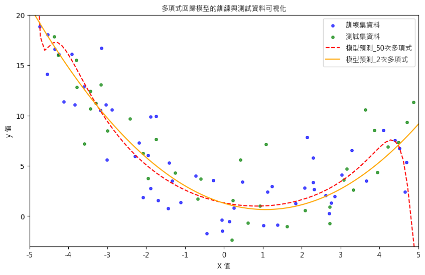

<!-- _class: cover -->
<!-- _footer: "主教材 Ch.1：The Machine Learning Landscape，p.3–39" -->
<!-- meta: minutes=2; source=B1 p.3–4 -->

# 第一週：機器學習概觀
## 資料、模型與泛化

從「模型在學什麼」到「如何相信評估結果」。

<!-- 講者提示：本檔 150 分鐘，另有導覽 10 分鐘與休息 20 分鐘。先讓學生說出一個願意交給模型處理的任務。 -->

---

<!-- _footer: "主教材 Ch.1 p.4；補充 00_Machine Learning s.3、5" -->
<!-- meta: minutes=4; source=B1 p.4; supplement=P0 s.3,5 -->

## 什麼是機器學習？

模型利用資料中的經驗，改善某項任務的表現。

| 要素 | 垃圾郵件偵測 |
|---|---|
| 任務 $T$ | 判斷一封新郵件是否為垃圾郵件 |
| 經驗 $E$ | 使用者標記過的郵件與特徵 |
| 表現 $P$ | 在未見過郵件上的錯誤與漏判情形 |

**儲存更多資料，不等於已經學會執行任務。**

<!-- 講者提示：改寫主教材引用的 Mitchell 定義，不逐字翻譯。AI 是較廣的研究領域，機器學習是其中一類方法，深度學習使用多層神經網路。此處不展開歷史。 -->

---

<!-- _footer: "主教材 Ch.1 p.5–8，圖 1-1–1-4；流程依教材重繪" -->
<!-- meta: minutes=4; source=B1 p.5–8，圖1-1–1-4 -->

## 規則程式與資料學習


當規則難以列完或經常改變時，資料學習可以減少人工維護。
訓練資料與評估方式，仍然需要人來設計。

<!-- 講者提示：例子用垃圾郵件關鍵字被刻意改寫。模型可以重新訓練，但新資料的品質會決定更新是否有幫助。兩條流程都需要測試。 -->

---

<!-- _footer: "主教材 Ch.1 p.9–10、17–22；補充 00_Machine Learning s.6–14" -->
<!-- meta: minutes=3; source=B1 p.9–10,17–22; supplement=P0 s.6–14 -->

## 機器學習系統的三個分類軸

| 分類軸 | 比較的是什麼？ | 例子 |
|---|---|---|
| 監督訊號 | 訓練時有哪些答案或回饋？ | 監督、非監督、半監督、自監督、強化 |
| 更新方式 | 是否能逐步吸收新資料？ | 批次、線上／增量 |
| 泛化方式 | 如何處理新樣本？ | 實例式、模型式 |

同一個系統可以同時是「監督式、批次、模型式」。
這些分類軸不是互斥的演算法清單。

<!-- 講者提示：先把三個分類軸當成三個獨立問題。本段依教材從監督訊號開始，之後才談更新與泛化方式。 -->

---

<!-- _footer: "主教材 Ch.1 p.10–11；圖片擷取：00_Machine Learning s.7–8" -->
<!-- meta: minutes=5; source=B1 p.10–11; supplement=P0 s.7–8 -->

## 監督式學習：迴歸與分類

<div class="columns">
<div>

### 迴歸


目標是連續數值，例如價格、溫度或需求量。

</div>
<div>

### 分類


目標是離散類別，可分為二元或多類別任務。

</div>
</div>

**標籤的意義**決定任務。數字編碼 0／1 不代表迴歸，邏輯斯迴歸通常用來分類。

<!-- 講者提示：延伸舊投影片的訂房取消與油耗案例。預測取消與否是分類，預測取消筆數則可作數值預測。不要以輸出是否用數字儲存來判斷任務。 -->

---

<!-- _footer: "主教材 Ch.1 p.10–11；課堂示例：資料表由本課程編製" -->
<!-- meta: minutes=4; source=B1 p.10–11；課堂示例 -->

## 樣本、特徵與目標

| 房屋樣本 | 面積（坪） | 房齡（年） | 區域 | 成交價（萬元） |
|---|---:|---:|---|---:|
| A | 20 | 5 | 北區 | 900 |
| B | 32 | 18 | 南區 | 1,150 |
| C | 25 | 10 | 北區 | 1,020 |

- 一列是一筆樣本。面積、房齡、區域是候選**特徵**。
- 成交價是**目標**，訓練時已知，推論時待預測。
- 樣本編號通常只供追蹤，不直接當作預測線索。

<!-- 講者提示：這是單戶房屋的自編玩具資料。第二週教材的樣本是地理區域，刻意比較兩種觀察單位。提醒推論當下必須取得使用的特徵。 -->

---

<!-- _class: small -->
<!-- _footer: "主教材 Ch.1 p.10–11；範例參考 00_Machine Learning s.8" -->
<!-- meta: minutes=2; source=B1 p.10–11; supplement=P0 s.8 -->

## 分類模型的樣本、特徵與目標

<div class="columns wide-left">
<div>

| 動物樣本 | 體重（kg） | 體高（cm） | 種類標籤 |
|---|---:|---:|---|
| A | 2.8 | 24 | 貓 |
| B | 18.0 | 52 | 狗 |
| C | 1.6 | 20 | 兔 |
| D | 4.1 | 29 | 貓 |

</div>
<div>

- 每一列是一筆**樣本**。體重與體高是**特徵**。
- 種類是**目標標籤**。貓／非貓是二元分類，貓／狗／兔是多類別分類。
- 表格特徵可嘗試 $k$ 近鄰、邏輯斯迴歸、SVM 或隨機森林。原始影像通常需要 CNN 等模型學習視覺特徵。

</div>
</div>

<!-- 講者提示：表格是依舊稿 Size、Weight 圖例改寫的教學資料，不是真實生物資料集。先問「一列是什麼」，再問「推論時哪一欄不知道」。演算法名稱來自舊稿，實際選擇還要看資料量、特徵型態與評估結果。 -->

---

<!-- _class: small -->
<!-- _footer: "主教材 Ch.1 p.11–13，圖 1-7–1-8" -->
<!-- meta: minutes=4; source=B1 p.11–13，圖1-7–1-8 -->

## 非監督式學習

<div class="columns">
<div>

### 分群（clustering）


找出特徵相似的樣本群組，群編號不是預先定義的人群標籤。

</div>
<div>

### t-SNE 視覺化


將高維資料投影到二維，用來觀察結構與可能的群聚。

</div>
</div>

訓練資料沒有這次任務的目標標籤。t-SNE 圖上的距離與群形可能失真，不能單憑圖形斷定真實類別。

<!-- 講者提示：修正舊稿「不對資訊有正確或不正確的判別」的絕對說法。非監督學習仍能以穩定性、外部標籤或下游任務評估，只是訓練監督訊號不同。 -->

---

<!-- _footer: "主教材 Ch.1 p.14–15" -->
<!-- meta: minutes=2; source=B1 p.14–15 -->

## 半監督式學習

- 少量樣本已有標籤，大量樣本還沒有標籤。
- 例如先用分群找出相似樣本，再將已確認的群標籤擴展給未標記樣本。
- 也可先用現有分類器產生**偽標籤**，再挑選高信心結果加入訓練。

**風險**：偽標籤可能出錯，錯誤還可能在後續訓練中被放大。

<!-- 講者提示：請學生區分「真實人工標籤」與「模型產生的偽標籤」。半監督式學習不是免評估，仍要使用可信的已標記驗證資料。 -->

---

<!-- _class: figure small -->
<!-- _footer: "主教材 Ch.1 p.15–16，圖 1-11" -->
<!-- meta: minutes=2; source=B1 p.15–16，圖1-11 -->

## 自監督式學習


先從未標記資料自動產生「輸入與目標」。圖 1-11 用遮罩影像當輸入，原始影像當目標，訓練模型復原被遮住的內容。

這個任務不需要人工逐張標記，但訓練時仍有明確目標。

<!-- 講者提示：先指出左圖是模型看到的輸入，右圖是用來計算誤差的目標。自監督常用來學表示，後續可再用有標籤資料微調。 -->

---

<!-- _footer: "主教材 Ch.1 p.16；補充 00_Machine Learning s.16" -->
<!-- meta: minutes=2; source=B1 p.16; supplement=P0 s.16 -->

## 遷移學習的做法

1. **先學通用表示**：在較大的來源資料集上預訓練模型。
2. **改成目標任務**：保留可重用的特徵擷取部分，替換或新增輸出層。
3. **用目標資料微調**：先凍結部分參數，再視資料量與評估結果逐步解凍。
4. **在目標分布上評估**：來源與目標差異太大時，可能出現負遷移。

**教材範例**：先學會復原寵物影像，再將模型改為寵物種類分類器，使用少量已標記影像微調。

<!-- 講者提示：遷移學習描述知識如何從來源任務重用到目標任務，不是另一種標籤有無的分類。舊稿使用 CIFAR-10 CNN 為例，教材則把自監督影像復原接到寵物分類。 -->

---

<!-- _footer: "主教材 Ch.1 p.16–17，圖 1-12；補充 00_Machine Learning s.13（修正）" -->
<!-- meta: minutes=3; source=B1 p.16–17，圖1-12; supplement=P0 s.13 -->

## 強化學習：從互動回饋學策略


- 代理人觀察環境、採取行動，再取得新狀態與獎勵。
- 學習目標通常是提高**長期累積回饋**。
- 互動軌跡就是資料，也可能使用既有軌跡訓練。

<!-- 講者提示：舊稿「不需給機器任何資料」容易誤導。採用教材的觀察、行動、獎勵迴圈，強調與每筆樣本附正確標籤的差異。 -->

---

<!-- _footer: "主教材 Ch.1 p.17–20" -->
<!-- meta: minutes=4; source=B1 p.17–20 -->

## 批次學習與線上學習

| | 批次學習 | 線上／增量學習 |
|---|---|---|
| 更新 | 彙整資料後重新訓練 | 逐筆或小批次更新 |
| 適合情境 | 資料較穩定，可定期重訓 | 資料流、快速變化或記憶體有限 |
| 主要風險 | 更新延遲，模型逐漸過時 | 壞資料可能快速影響模型 |

「線上」不一定指連上網路或即時對外服務。
推論時即時回覆，也不代表模型正在即時學習。

<!-- 講者提示：教材特別指出 out-of-core 可以離線進行。將 learning batch 與 mini-batch 優化分開說明，不把兩者混為一談。 -->

---

<!-- _footer: "主教材 Ch.1 p.21–22，圖 1-15–1-16" -->
<!-- meta: minutes=4; source=B1 p.21–22，圖1-15–1-16 -->

## 實例式與模型式泛化

| 方法 | 新樣本如何得到答案？ | 需要注意 |
|---|---|---|
| 實例式 | 比較相似樣本，例如 $k$ 個最近鄰居 | 距離定義、尺度、搜尋成本 |
| 模型式 | 把特徵代入已學到的函數 | 模型假設、參數、擬合程度 |

例如預測生活滿意度：

- 最近鄰：參考收入相近國家的生活滿意度。
- 線性模型：將收入代入一條已學好的直線。

<!-- 講者提示：截至此頁本檔 45 分鐘，連同導覽 55 分鐘，在此休息 10 分鐘。兩種方法都需要對未見資料評估，記住訓練資料不等於無法泛化。 -->

---

<!-- _class: small -->
<!-- _footer: "主教材 Ch.1 p.23，表 1-1；表中為教材歷史資料節錄" -->
<!-- meta: minutes=3; source=B1 p.23，表1-1 -->

## 生活滿意度：先看資料代表什麼

| 國家 | 人均 GDP（美元） | 生活滿意度 |
|---|---:|---:|
| 土耳其 | 28,384 | 5.5 |
| 匈牙利 | 31,008 | 5.6 |
| 法國 | 42,026 | 6.5 |
| 美國 | 60,236 | 6.9 |
| 紐西蘭 | 42,404 | 7.3 |
| 澳洲 | 48,698 | 7.3 |
| 丹麥 | 55,938 | 7.6 |

一筆資料是一個國家。國家層級關係不能直接推論個人因果。

<!-- 講者提示：保留表 1-1 的全部七列與單位。此表是教材節錄，後面的教材迴歸線用的是較完整訓練集，不能聲稱只用這七點算出。數據不是目前各國最新統計。 -->

---

<!-- _footer: "主教材 Ch.1 p.23–25，式 1-1；補充 01_Regressions s.2–3、8" -->
<!-- meta: minutes=5; source=B1 p.23–25，式1-1; supplement=P1 s.2–3,8 -->

## 線性模型的參數

$$\hat y = b + wx \qquad
\hat y = b + \sum_{j=1}^{d}w_jx_j$$

- $x$ 或 $\mathbf{x}$：輸入特徵。$\hat y$：預測值。
- $b$：截距。$w_j$：第 $j$ 個特徵的權重。
- 一個特徵是簡單線性迴歸，多個特徵是多元線性迴歸。
- **訓練**：用資料找到參數。**推論**：用已定參數產生答案。

<!-- 講者提示：權重的大小受到特徵單位影響。多個輸入特徵不代表多個輸出目標，第二週會再區分。模型有截距時，可用擴充特徵矩陣寫成 Xθ。 -->

---

<!-- _class: figure -->
<!-- _footer: "主教材 Ch.1 p.25，圖 1-19；教材模型與歷史資料" -->
<!-- meta: minutes=3; source=B1 p.24–26，圖1-19 -->

## 一條線如何產生新預測？


教材模型：$\hat y = 3.75 + 6.78\times10^{-5}x$。
代入 $x=33{,}442$ 美元，預測生活滿意度約 **6.02**。

<!-- 講者提示：圖的橫軸是人均 GDP，縱軸是生活滿意度，點是訓練國家。係數為教材四捨五入值，未用前頁七列重新擬合。請學生計算乘法，確認美元的單位不能直接換成萬元而保持原係數。 -->

---

<!-- _class: small -->
<!-- _footer: "主教材 Ch.1 p.25–26，Example 1-1（前半）" -->
<!-- meta: minutes=2; source=B1 p.25–26，Example 1-1 -->

## Example 1-1：準備資料與散布圖

```python
import matplotlib.pyplot as plt
import numpy as np
import pandas as pd
from sklearn.linear_model import LinearRegression

# Download and prepare the data
data_root = "https://github.com/ageron/data/raw/main/"
lifesat = pd.read_csv(data_root + "lifesat/lifesat.csv")
X = lifesat[["GDP per capita (USD)"]].values
y = lifesat[["Life satisfaction"]].values

# Visualize the data
lifesat.plot(kind="scatter", grid=True,
             x="GDP per capita (USD)", y="Life satisfaction")
plt.axis([23_500, 62_500, 4, 9])
plt.show()
```

`X` 是輸入特徵，`y` 是訓練時的目標。散布圖用來先檢查資料關係，不是模型的輸出。

<!-- 講者提示：這頁保留教材 Example 1-1 的資料載入與畫圖程式。強調兩層方括號會保留 X 為二維特徵矩陣。若現場沒有網路，可只讀程式流程，不將下載成功當作學習目標。 -->

---

<!-- _class: small -->
<!-- _footer: "主教材 Ch.1 p.26，Example 1-1（後半）" -->
<!-- meta: minutes=2; source=B1 p.26，Example 1-1 -->

## Example 1-1：訓練與執行線性模型

```python
# Select a linear model
model = LinearRegression()

# Train the model
model.fit(X, y)

# Make a prediction for Puerto Rico
X_new = [[33_442.8]]  # GDP per capita in 2020
print(model.predict(X_new))  # outputs [[6.01610329]]
```

| 程式片段 | 作用 |
|---|---|
| `LinearRegression()` | 選擇線性迴歸模型 |
| `fit(X, y)` | 由已知輸入與目標估計參數 |
| `predict(X_new)` | 將新樣本代入訓練完成的模型 |

輸出約為 **6.02**，與前頁把 $x=33{,}442$ 代入直線的結果一致。

<!-- 講者提示：fit 是訓練，predict 是推論。X_new 仍要是二維結構，因為它代表「一筆樣本、一個特徵」。這個小數差異來自前頁係數已四捨五入。 -->

---

<!-- _footer: "主教材 Ch.1 p.24–26；補充 01_Regressions s.4、9、12、14；示意重繪" -->
<!-- meta: minutes=5; source=B1 p.24–26; supplement=P1 s.4,9,12,14 -->

## 損失函數：把「擬合好不好」變成數字

<div class="columns">
<div>

$$e_i=\hat y_i-y_i$$
$$\mathrm{MSE}=\frac1m\sum_{i=1}^{m}e_i^2$$

比較預測與真值的垂直差距。
平方可避免正負誤差互相抵銷。

</div>
<div>


</div>
</div>

梯度下降以 $\boldsymbol\theta_{t+1}=\boldsymbol\theta_t-\eta\nabla J(\boldsymbol\theta_t)$ 反覆更新參數。
$\eta$ 是步長：太小收斂太慢，太大可能發散。訓練也可以用解析法求解。

<!-- 講者提示：這裡定義預測誤差為預測減真值，統計殘差常用相反符號；平方後相同。補充梯度下降 θ新=θ舊−η∇J 的直覺：依損失下降方向調整參數，η 控制步長。學習率過大時每步越過最低點，損失不降反升；過小則需要很多輪。完整偏微分推導不在本週要求。 -->

---

<!-- _class: cover -->
<!-- _footer: "主教材 Ch.1 p.27–38：Main Challenges of Machine Learning" -->
<!-- meta: minutes=1; source=B1 p.27–38 -->

# ML 的主要挑戰
## 資料問題與模型問題都會影響泛化

接下來檢查「壞資料」與「壞模型」如何讓新樣本的預測失敗。

<!-- 講者提示：這是明顯的分節頁。教材將主要挑戰概括為資料與模型兩大方向，後續頁面依序說明資料量、代表性、品質、特徵、過度擬合與欠擬合。 -->

---

<!-- _footer: "主教材 Ch.1 p.27–31" -->
<!-- meta: minutes=4; source=B1 p.27–31 -->

## 資料不足與不具代表性

| 狀況 | 例子 | 可能的改善方向 |
|---|---|---|
| 樣本太少 | 少量觀察不足以穩定估計關係 | 蒐集資料、簡化模型 |
| 抽樣偏差 | 只蒐集熱門網站上的商品評論 | 改善取樣與涵蓋範圍 |
| 分布改變 | 舊相機影像用於新手機 | 建立接近使用情境的評估集 |

大量資料仍可能有系統性偏差。
先定義想泛化到的對象，再判斷資料是否足夠。

<!-- 講者提示：不用「至少幾千筆」作通用門檻，資料需求與訊號、噪音、模型複雜度及任務有關。可問研究資料是否涵蓋不同班級、月份或裝置。 -->

---

<!-- _class: figure -->
<!-- _footer: "主教材 Ch.1 p.29–30，圖 1-22" -->
<!-- meta: minutes=4; source=B1 p.29–30，圖1-22 -->

## 樣本範圍會改變我們看到的關係


補入較低與較高收入的國家後，原本的直線不再同樣合適。
**外插**到訓練範圍以外，尤其需要檢查模型假設。

<!-- 講者提示：讓學生比對圓點與新增方點以及新舊直線。這張圖顯示關係依取樣範圍改變，不證明人均 GDP 導致幸福。 -->

---

<!-- _footer: "主教材 Ch.1 p.31–32" -->
<!-- meta: minutes=4; source=B1 p.31–32 -->

## 資料品質與特徵工程

- **缺失值**：缺的是誰？為什麼缺？直接刪除會不會改變樣本？
- **離群值與量測錯誤**：先確認來源與單位，再決定處理方式。
- **不相關特徵**：模型可能學到偶然關係，例如名稱中的字母。
- **特徵工程**：挑選有用特徵、組合既有欄位，或補充新資料。

> 推論當下拿不到的欄位，即使與目標高度相關，也不能直接使用。

<!-- 講者提示：舉預測訂房取消卻使用取消日期為例。這是本課程延伸的洩漏辨識案例。異常值可能是真實罕見事件，不應只因離群而刪除。 -->

---

<!-- _class: figure -->
<!-- _footer: "主教材 Ch.1 p.31–32；圖片擷取：02_Validation and Regularization s.8" -->
<!-- meta: minutes=5; source=B1 p.31–32; supplement=P2 s.7–8 -->

## 過度擬合：更貼近訓練資料，未必更能泛化



舊稿示例：藍點為訓練資料，綠點為測試資料。
二次模型與 50 次模型都能擬合曲線，高次模型更容易追隨噪音。

<!-- 講者提示：圖片原樣擷取，數字只當既有示例。高次模型並非必然過擬合，還取決於資料量、噪音、數值穩定性與正則化。下一頁用原稿 RMSE 確認泛化落差。 -->

---

<!-- _footer: "主教材 Ch.1 p.32；表格資料：02_Validation and Regularization s.8" -->
<!-- meta: minutes=4; source=B1 p.32; supplement=P2 s.8 -->

## 舊稿結果：訓練誤差與測試誤差

| 舊稿模型 | 訓練 RMSE | 測試 RMSE |
|---|---:|---:|
| 二次多項式 | 2.83 | 2.40 |
| 50 次多項式 | 2.70 | 7.24 |

- 50 次模型的訓練 RMSE 較低，測試 RMSE 卻明顯較高。
- 測試誤差偶爾比訓練誤差低，可能來自抽樣差異。

<!-- 講者提示：原稿沒有完整固定種子與全套實驗設定，不能聲稱本次重跑驗證。也不能根據測試結果反覆挑模型；接下來會引入驗證集。 -->

---

<!-- _class: figure small -->
<!-- _footer: "主教材 Ch.1 p.31–33，圖 1-23–1-24" -->
<!-- meta: minutes=4; source=B1 p.31–33，圖1-23–1-24 -->

## 正則化：限制模型追隨資料的自由度


- 圖 1-23 的高次多項式太複雜，把訓練資料中的隨機波動當成規律，因而發生過度擬合。
- **正則化**對模型加上限制，讓模型較簡單，並降低過度擬合的風險。
- 圖 1-24 中，正則化模型的斜率較小。它對圓點的擬合稍差，卻對未見過的方點預測得更好。
- 限制太強時，直線會趨近水平，模型反而可能欠擬合。

<!-- 原文脈絡補充：線性模型可透過截距 θ0 調整高度，並透過係數 θ1 調整斜率，因此具有兩個可配合訓練資料的自由度。若把 θ1 固定為 0，模型只能上下移動，會成為非常簡單的模型。若允許 θ1 變動，但限制它保持較小，模型的複雜度就介於兩者之間。目標是在「完美擬合訓練資料」與「足夠簡單、可以泛化」之間找到平衡。 -->

<!-- 講者提示：圖中有原模型、新資料重訓模型與正則化模型，指出圓點為原訓練資料，方點為新增資料。正則化是降低過擬合風險，不能保證每個資料集都改善。本檔累計 91 分鐘，在此休息 10 分鐘。 -->

---

<!-- _footer: "主教材 Ch.1 p.33–34；補充 02_Validation and Regularization s.9–10" -->
<!-- meta: minutes=4; source=B1 p.33–34; supplement=P2 s.9–10 -->

## 欠擬合與過度擬合的判讀

| 訓練誤差 | 驗證誤差 | 先檢查什麼？ |
|---|---|---|
| 高 | 高 | 特徵不足、模型太簡單、限制太強，或尚未收斂 |
| 低 | 高 | 過度擬合、資料分布不一致、切分問題 |
| 低 | 低 | 值得保留，仍需獨立測試與基準比較 |

「高」與「低」要相對於任務容許誤差及合理基準。
誤差落差是診斷線索，不能單憑一張表判定原因。

<!-- 講者提示：降低正則化可改善限制過強造成的欠擬合，不能取代補足缺失訊號。 -->

---

<!-- _footer: "主教材 Ch.1 p.34–35" -->
<!-- meta: minutes=3; source=B1 p.34–35 -->

## 泛化與部署是不同的檢查面向

即使離線評估不錯，上線仍可能遇到：

- 新資料的格式、缺失率或分布改變。
- 推論速度、記憶體與維護成本無法接受。
- 真實標籤延遲到達，無法立即判斷表現。

測試集只能估計其代表情境下的表現。
模型上線後仍需監測與更新。

<!-- 講者提示：這頁承接教材 Deployment Issues 與 Stepping Back，保留主教材順序。請學生想像手機拍攝影像與掃描影像的差異。 -->

---

<!-- _footer: "主教材 Ch.1 p.35–36；補充 02_Validation and Regularization s.2–4" -->
<!-- meta: minutes=5; source=B1 p.35–36; supplement=P2 s.2–4 -->

## 訓練、驗證與測試的分工


**訓練集學參數，驗證集做選擇，測試集估計最終表現。**
80／20 或 60／20／20 都是示例，比例取決於資料量與情境。

<!-- 講者提示：圖用 60/20/20 作示例。資料切分前需識別重複或同群樣本，分配時避免跨集合。測試集的資訊不能用於調整特徵、模型或閾值。 -->

---

<!-- _footer: "主教材 Ch.1 p.33、35–36；補充 02_Validation and Regularization s.3–4" -->
<!-- meta: minutes=4; source=B1 p.33,35–36; supplement=P2 s.3–4 -->

## 參數與超參數

| | 例子 | 主要如何決定？ |
|---|---|---|
| 模型參數 | 截距、權重、已學到的樹分割 | 訓練資料與學習演算法 |
| 超參數 | 正則化強度、鄰居數、樹最大深度 | 預先設定，再以驗證結果選擇 |
| 決策設定 | 分類閾值、可接受漏判率 | 任務代價與驗證資料 |

看過測試分數再調整設定，會讓測試集參與模型選擇。
即使沒有拿測試資料做梯度更新，也可能造成洩漏。

<!-- 講者提示：分類閾值不是每個模型本身的訓練參數，因此另外列為決策設定。驗證透過人或搜尋程序間接影響最終系統，不能說模型選擇完全沒有接觸驗證資訊。 -->

---

<!-- _footer: "主教材 Ch.1 p.36–37；補充 02_Validation and Regularization s.5–6" -->
<!-- meta: minutes=4; source=B1 p.36–37; supplement=P2 s.5–6 -->

## 交叉驗證的基本概念

把開發資料分成 $k$ 份，輪流保留一份做驗證。

- 每一折都重新訓練，再評估該折未參與訓練的資料。
- 比較各折分數與平均表現，減少依賴單一切分。
- 選完設定後，用全部開發資料重訓，再做最終測試。

**交叉驗證不取代獨立測試集，也不能補救錯誤的切分單位。**

<!-- 講者提示：此處建立概念，第二週用圖拆解每折的前處理與模型訓練。k 越大通常訓練成本越高，分數也不是互相獨立的實驗重複。 -->

---


<!-- _footer: "補充 02_Validation and Regularization s.9；對應主教材 Ch.1 模型選擇" -->
<!-- meta: minutes=6; source=B1 p.35–37; supplement=P2 s.9 -->

## 早停：訓練輪數也需要驗證


訓練損失繼續降低時，驗證損失可能已開始上升。
依驗證表現保留較好的模型狀態，不用測試集挑停止時間。

<!-- 講者提示：圖為自編示意曲線，不是實驗輸出。先讓學生指出驗證曲線最低點，再解釋可設定容忍的等待輪數，避免被單次波動影響。早停適用於可觀察逐輪訓練的模型，並非每種估計器都有同樣介面。它會限制有效複雜度，也是控制過擬合的方法之一。 -->

---

<!-- _footer: "主教材 Ch.1 p.37–38，圖 1-26；研究設計延伸" -->
<!-- meta: minutes=4; source=B1 p.37–38，圖1-26；課程延伸 -->

## 分布不一致與切分單位

| 想預測的對象 | 合理的切分思考 |
|---|---|
| 同分布的新樣本 | 可考慮隨機切分 |
| 新學生／新病人／新裝置 | 依個體或群組切分，避免同人跨集合 |
| 未來一段時間 | 依時間切分，以過去預測未來 |
| 手機拍攝照片 | 驗證與測試應涵蓋實際手機情境 |

教材另留 **train-dev**：和訓練同來源但未參與訓練，
用來協助區分過度擬合與來源差異。

<!-- 講者提示：群組與時間是本課程的研究設計延伸，教材例子是網路花卉照片與手機照片。train-dev 差而訓練好，支持過擬合疑慮；train-dev 好而目標驗證差，支持分布差異疑慮，仍要檢查標籤與資料流程。 -->

---

<!-- _footer: "主教材 Ch.1 p.38–39；本週整理" -->
<!-- meta: minutes=5; source=B1 p.38–39；課程統整 -->

## 第一週回顧與離堂題

- ML 的核心是用經驗改善任務表現，目標是**泛化**。
- 好資料要涵蓋預期使用對象，也要有可用的預測訊號。
- 正則化控制模型複雜度，強度需以驗證決定。
- 訓練、驗證、測試各自回答不同問題。

**離堂題**：某模型訓練表現很好、驗證表現很差，
請提出兩種可能原因，以及各自需要補查的證據。

<!-- 講者提示：可答過度擬合、來源差異、群組或時間切分不同、前處理不一致等；要求對應證據，不能只喊增加資料或換大模型。下一週用房價專案把這些設計串起來。 -->
