<!-- _class: cover -->

# 第二週：端到端機器學習專案
## 以加州房價理解資料與迴歸

每一個前處理與評估決定，都會影響最終結論。

<!-- 講者提示：延續第一週的泛化問題，今天依教材走一遍完整專案。 -->

---
## 專案全貌

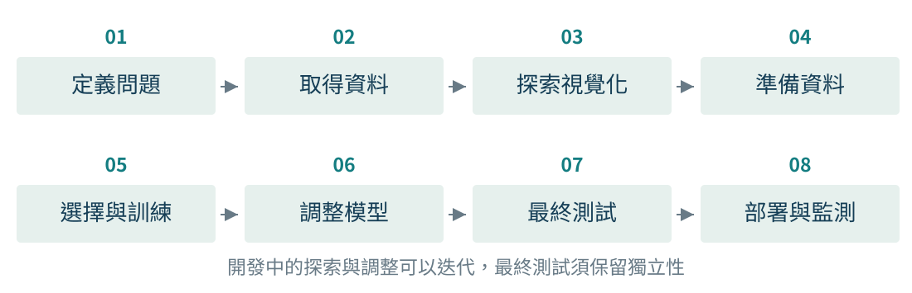

資料探索產生假設，驗證資料比較方案，測試資料評估定案。
上線後的監測，決定何時需要重新蒐集資料與訓練。

<!-- notebook-companion-link -->
💻 **配套 Notebook**：`programs/notebooks/02_端到端機器學習專案.ipynb`

<!-- 講者提示：Notebook對照：程式 02-03、02-21、02-25、02-27、02-28；見本章 ipynb 首行的程式代碼。圖例與固定玩具例依各頁標示的資料與輸入解讀。本章會依序走過八個階段。流程中的回頭修改發生在開發階段，不能以反覆看測試集作為迭代依據。 -->

---
## 問題定義：預測的是區域房價中位數

- **觀察單位**：加州的一個人口普查區域（block group）。
- **輸入**：區域人口、房齡、收入、地理位置等資料。
- **目標**：該區域的房價中位數，單位是美元。
- **任務**：監督式、多個輸入特徵、單一輸出目標的迴歸。

預測單一房屋售價，是另一個任務。
多個輸入特徵，也不等於多個輸出目標。

<!-- 講者提示：Notebook對照：程式 02-03；見本章 ipynb 首行的程式代碼。教材以房地產投資公司作情境，並非證明此資料可直接支援當代投資。資料取自 1990 年加州人口普查的教學版本。與第一週單戶房屋示例比較觀察單位。 -->

---
## 迴歸的評估指標

$$\mathrm{MAE}=\frac1m\sum_i|\hat y_i-y_i|\qquad
\mathrm{RMSE}=\sqrt{\frac1m\sum_i(\hat y_i-y_i)^2}$$

| 指標 | 直覺 | 單位 |
|---|---|---|
| MAE | 每筆絕對誤差的平均 | 與目標相同 |
| MSE | 平方後平均，較重視大誤差 | 目標單位的平方 |
| RMSE | 將 MSE 開根號 | 與目標相同 |

同一組樣本下 RMSE 不小於 MAE，但仍須依任務選指標。

<!-- 講者提示：Notebook對照：程式 02-04、02-25；見本章 ipynb 首行的程式代碼。m 是目前正在評估的樣本數，不一定是總資料量。用美元與美元平方區分 MSE、RMSE 的解釋。平方讓少數大誤差影響更大，不等於必然應刪掉離群樣本。 -->

---
## 指標之前，還有用途與假設

- 系統真正需要連續估價，還是低／中／高價位分類？
- 預測時能取得哪些欄位？資料何時更新？
- 高估與低估的代價是否相同？
- 是否需要對特定價位或地區維持基本表現？

如果使用方式不同，目標、指標與資料需求可能全部改變。

<!-- 講者提示：教材檢查下游是否只使用價位類別，避免把錯誤問題做得很精準。此處採教學案例，不提供真實投資判斷。 -->

---
## 取得資料與保留可重現流程

- 記錄資料來源、版本、欄位定義及觀察時間。
- 保留原始資料，讓清理步驟可以重做。
- 筆記本依執行順序重新跑完，避免隱藏的先前變數狀態。
- 將下載、轉換與評估分開，保存切分規則與亂數種子。

本課堂先閱讀教材圖表，不要求在教室下載或安裝環境。

> 💻 **資料探索主線**：`programs/notebooks/02_端到端機器學習專案.ipynb`。從資料讀取、欄位檢查、分層切分到地理與相關分析都在此 Notebook。

<!-- 講者提示：Notebook對照：程式 02-01、02-02；見本章 ipynb 首行的程式代碼。依教材 Get the Data 的順序簡述 Colab 與互動式執行的風險，不逐頁演示介面。固定種子有助重做同次切分，但不能使抽樣本身自動合理。 -->

---
<!-- _class: small -->

## 20,640 個區域、10 個欄位

| 欄位 | 意義與型態 |
|---|---|
| longitude、latitude | 經度、緯度，數值座標 |
| housing_median_age | 房齡中位數，數值 |
| total_rooms、total_bedrooms | 房間總數、臥室總數，計數 |
| population、households | 人口、家戶數，計數 |
| median_income | 收入中位數，已縮放的數值 |
| ocean_proximity | 鄰海位置，類別 |
| median_house_value | 房價中位數，預測目標 |

原始 10 欄包含目標，因此此時有 **9 個候選輸入欄位**。

<!-- 講者提示：Notebook對照：程式 02-03、02-05；見本章 ipynb 首行的程式代碼。型態不等於意義，計數欄位在檔案中可儲存成浮點數。households 是家戶數，不能將 total_rooms 直接當平均每戶房間數。 -->

---
## 資料摘要透露的問題

- `total_bedrooms` 非空值 **20,433** 筆，缺少 **207** 筆。
- `ocean_proximity` 有五類，ISLAND 只有 **5** 筆。
- 房齡第 25、50、75 百分位分別是 **18、29、37 年**。
- 均值與標準差只能描述部分特性，仍需觀察完整分布。

對稀少類別做細分評估時，必須同時報告樣本數。

<!-- 講者提示：Notebook對照：程式 02-05；見本章 ipynb 首行的程式代碼。207/20640約1%。問學生是否可直接補0，並引出0與缺失的意義不同。不能把百分位18解釋成18%的區域。 -->

---
<!-- _class: figure -->

## 直方圖：偏態、尺度與截頂

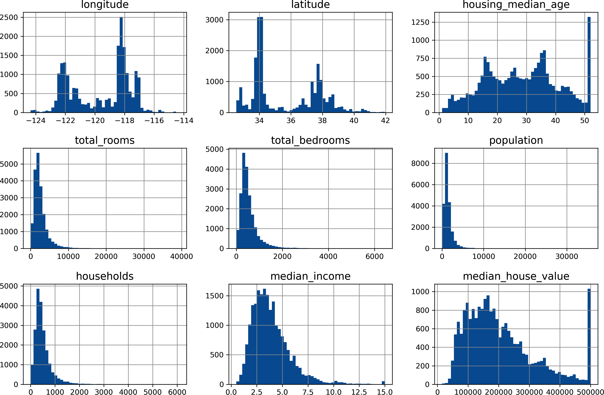

橫軸是欄位值區間，縱軸是樣本數。觀察右長尾與上限堆積。

<!-- 講者提示：Notebook對照：程式 02-06；見本章 ipynb 首行的程式代碼。圖例與固定玩具例依各頁標示的資料與輸入解讀。分箱寬度會改變圖形外觀。此圖依教材是在初步結構檢查時展示全資料；後續探索、轉換選擇及特徵決策以開發資料為主，預留測試集後不再反覆查看它。 -->

---
## 截頂標籤限制了能學到的事情

教材中的收入約以「萬美元」縮放，並設有上下限。
房齡與房價也有截頂，房價上限約 **50 萬美元**。

- 上限堆積不一定是自然形成的資料分布。
- 若真實用途要預測更高價格，需要更完整的標籤。
- 刪除截頂樣本會改變適用範圍，應明確說明。

**先查資料生成方式，再解釋圖形。**

<!-- 講者提示：Notebook對照：程式 02-06；見本章 ipynb 首行的程式代碼。教材給出蒐集完整標籤或排除上限區域等選項。若排除，就只能聲稱對保留範圍有效，不能藉刪除困難樣本營造效果。教材精確上限值可能含編碼尾數，課堂使用約50萬美元。 -->

---
## 在深入探索前保留測試集

教材示例保留 20% 作測試，其餘作開發資料：

$$20{,}640\times0.8=16{,}512\qquad
20{,}640\times0.2=4{,}128$$

- 切分需能重現，新增資料也不應讓既有樣本任意換組。
- 測試集在模型定案前保持隔離。
- 若任務要泛化到新地區，還需評估地理群組切分是否更合理。

<!-- 講者提示：Notebook對照：程式 02-03、02-14、02-16；見本章 ipynb 首行的程式代碼。雜湊穩定識別碼是教材介紹的一種方式，隨機種子不足以處理資料新增或順序改變。地理切分是本課程延伸，不把教材隨機切分宣稱為跨地區泛化。 -->

---
## 分層抽樣保留重要群體比例

教材先將收入分成區間，再依收入層進行抽樣。

| 自編示例 | 全資料 | 希望在測試集中近似維持 |
|---|---:|---:|
| 低收入 | 30% | 30% |
| 中收入 | 50% | 50% |
| 高收入 | 20% | 20% |

分層能減少指定變數上的抽樣波動，不能消除所有偏差。
收入層僅供切分，完成後移除這個臨時欄位。

> 💻 **實作位置**：`programs/notebooks/02_端到端機器學習專案.ipynb`。這裡可直接比較隨機切分、收入分層與穩定 ID 切分的差異。

<!-- 講者提示：Notebook對照：程式 02-07；見本章 ipynb 首行的程式代碼。教材實際使用5個收入層，此表為便於心算的3層示意，不能混當教材觀察比例。 -->

---

<!-- _class: small -->
## 地理視覺化：只用訓練資料閱讀位置與房價

<div class="columns">
<div>

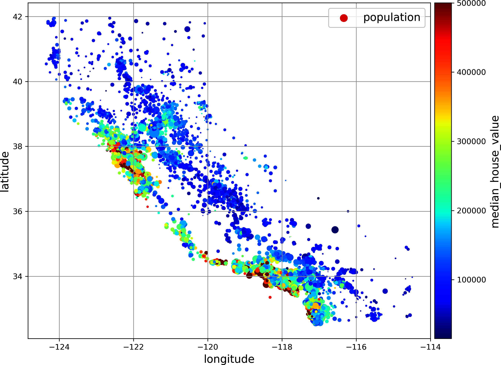

教材圖：用位置、圓大小與色彩同時編碼資料。

</div>
<div>

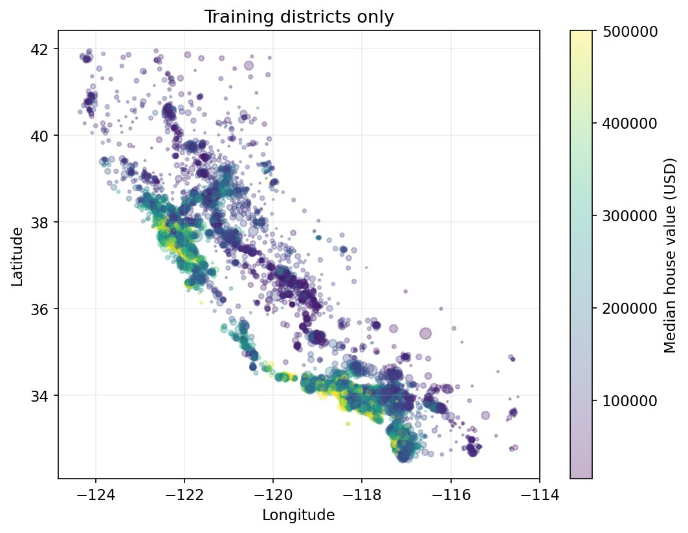

Notebook 圖：只畫訓練區域；圓大小經裁切，不是人口密度。

</div>
</div>

每點是一個區域；橫／縱軸是經度／緯度，顏色是房價中位數（美元），圓大小表示人口總量。

**讀圖**：指出一處高價區域；位置與房價的關聯，能證明沿海位置造成高房價嗎？

參考程式：`programs/notebooks/02_端到端機器學習專案.ipynb`

<!-- 講者提示：先完成收入分層並保留測試集，再讀此頁。Notebook 程式 02-08 使用 ax.scatter(train.longitude, train.latitude, s=np.clip(train.population/100, 2, 80), c=train.median_house_value, cmap='viridis', alpha=.3)，並加入美元色條；housing_split 在前面的資料設定已定義。左右圖色盤與大小設定不同，不能直接比較色值或圓大小。讀圖只能形成關聯假說，仍需檢查收入、人口及空間相鄰性，不能當作因果證據。 -->

<!-- Notebook 對照：程式 02-03、02-08；以程式代碼定位配套 Notebook。 -->

---
## 相關係數：線性關係的摘要

| 特徵與房價的 Pearson $r$ | 教材結果（取三位小數） |
|---|---:|
| median_income | 0.688 |
| total_rooms | 0.137 |
| housing_median_age | 0.102 |
| population | −0.020 |

$r$ 介於 −1 與 1，描述線性關聯方向與強度。
$r$ 接近 0 仍可能存在非線性關係，也不能用 $r$ 判定因果。

<!-- 講者提示：Notebook對照：程式 02-09、02-12；見本章 ipynb 首行的程式代碼。讓學生比較收入與人口，提醒不要僅憑相關係數刪除特徵。類別欄位不能隨意編碼後把Pearson係數當語意關係。 -->

---
## 散布圖補上相關係數看不到的細節

<div class="columns wide-left">
<div>

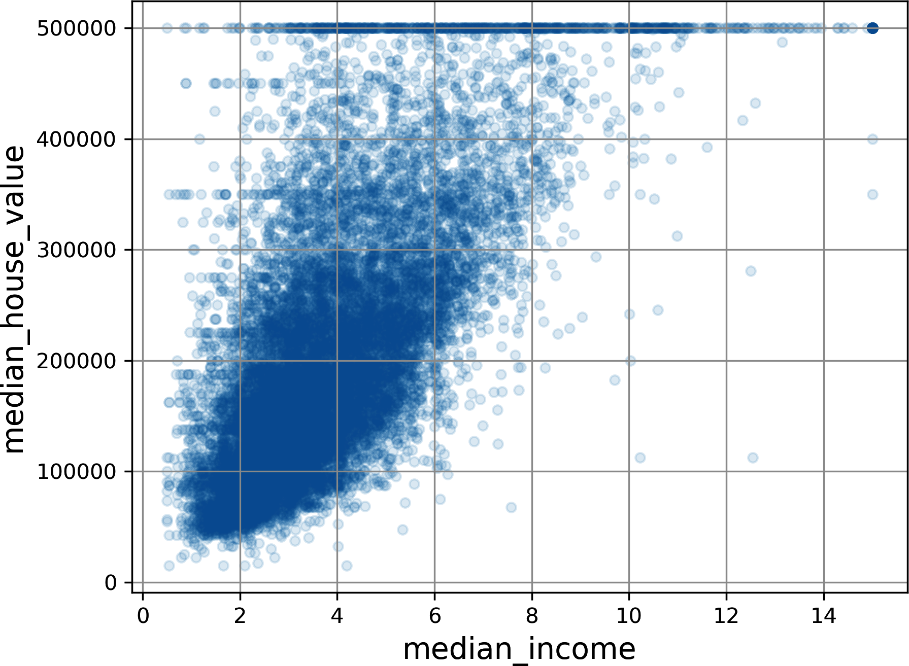

</div>
<div>

收入較高的區域，房價通常較高。

但也可看到：

- 相同收入下房價仍有差異。
- 頂部有截頂的水平線。
- 其他水平帶可能來自資料處理。

</div>
</div>

<!-- 講者提示：Notebook對照：程式 02-09；見本章 ipynb 首行的程式代碼。圖例與固定玩具例依各頁標示的資料與輸入解讀。逐一指認座標軸與50萬美元上限。看到水平帶應回查標籤生成方式，不能直接把它當市場規律。圖樣提出假設，驗證與來源查核決定是否採納。 -->

---
## 補充：Iris 散布矩陣的讀法

<div class="columns wide-left">
<div>

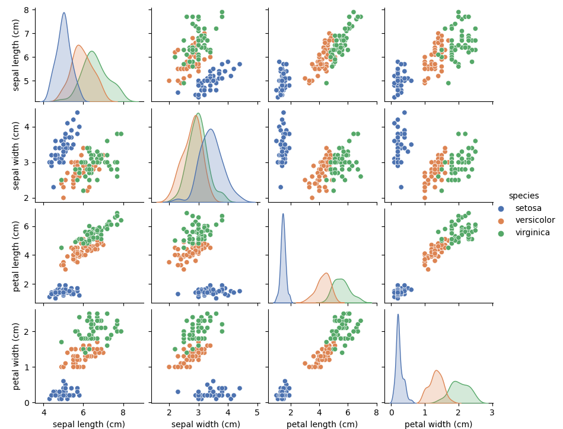

</div>
<div>

- 非對角：兩個特徵的散布圖。
- 對角：單一特徵的分布。
- 顏色：已知的鳶尾花類別。

花瓣特徵對類別分離可能有幫助。
圖上分得開，仍需要獨立評估。

</div>
</div>

<!-- 講者提示：Notebook對照：程式 02-10；見本章 ipynb 首行的程式代碼。圖例與固定玩具例依各頁標示的資料與輸入解讀。Iris pairplot 的對角線是平滑分布圖。清楚標明從房價切到 Iris 作讀圖補充，不能把它描述為本章房價資料。第三週才深入決策邊界。 -->

---
## 特徵組合：總量與比例回答不同問題

$$\text{每戶房間數}=\frac{\text{total\_rooms}}{\text{households}}$$
$$\text{臥室比例}=\frac{\text{total\_bedrooms}}{\text{total\_rooms}}$$
$$\text{每戶人口}=\frac{\text{population}}{\text{households}}$$

區域總量可能反映規模，比例則可能反映居住型態。
先處理零分母與缺失，再用驗證確認新特徵是否有幫助。

<!-- 講者提示：Notebook對照：程式 02-12、02-18；見本章 ipynb 首行的程式代碼。教材rooms_per_house實際以households作分母，中文以每戶較精確。相關性改善不保證模型泛化改善；若反覆挑特徵，就已經在做模型選擇。 -->

---
## 資料準備要能重複套用

把人工決定整理成清楚的轉換步驟：

- 缺失值與異常格式的處理。
- 類別編碼、數值縮放與特徵組合。
- 從訓練資料學到的統計量與字典。

**訓練時學到什麼，預測時就使用同一份設定。**
不能讓每一批新資料各自重算一套前處理規則。

<!-- 講者提示：Notebook對照：程式 02-17；見本章 ipynb 首行的程式代碼。區分手工設計的轉換規則與由資料估計的參數，例如公式是固定的，中位數是學到的。接下來依教材依次介紹缺失、類別、尺度與Pipeline。 -->

---
## 缺失值：刪除或補值都有假設

| 方案 | 可能的代價 |
|---|---|
| 刪除缺失樣本 | 樣本變少，可能偏向容易量測的對象 |
| 刪除整個特徵 | 失去該欄位中的預測訊號 |
| 用訓練中位數補值 | 保留樣本，但不等於恢復真實值 |
| 保留缺失指示欄位 | 可表達「缺失」本身的資訊 |

補值的中位數只能從當次訓練資料估計。
驗證／測試資料只套用，不重新估計。

<!-- 講者提示：Notebook對照：程式 02-13、02-18；見本章 ipynb 首行的程式代碼。教學例：訓練觀測值10、20、30，中位數20；驗證缺失也填20。若用全資料中位數，驗證分布就影響了模型前處理。缺失指示欄位是合理延伸，需確保未來缺失機制相近。 -->

---
## 類別特徵：整數編碼不代表有大小

對沒有自然順序的 `ocean_proximity`，可採獨熱編碼：

| 類別（節錄） | INLAND | NEAR BAY | ISLAND |
|---|---:|---:|---:|
| INLAND | 1 | 0 | 0 |
| NEAR BAY | 0 | 1 | 0 |
| ISLAND | 0 | 0 | 1 |

將類別編成 0、1、2，可能讓部分模型誤以為存在順序或距離。
也要預先決定：推論時遇到未見過的類別怎麼辦？

<!-- 講者提示：Notebook對照：程式 02-13、02-18；見本章 ipynb 首行的程式代碼。表格只節錄3個類別，教材共有5個。未知類別可忽略並以全零編碼，或事先定義未知類別，選擇需符合模型設計。這頁談輸入特徵，分類目標不一定必須手動獨熱編碼。 -->

---
## 特徵縮放與正則化不同

$$x_{\mathrm{minmax}}=\frac{x-x_{\min}}{x_{\max}-x_{\min}}
\qquad z=\frac{x-\mu}{\sigma}$$

| 方法 | 調整什麼？ |
|---|---|
| Min–max 正規化 | 將訓練範圍映射到指定區間 |
| 標準化 | 依訓練均值、標準差調整尺度 |
| 正則化 | 在訓練目標或模型結構中加入限制 |

尺度會影響距離、梯度與係數懲罰。三者不能混用名稱。

<!-- 講者提示：Notebook對照：程式 02-13、02-18；見本章 ipynb 首行的程式代碼。σ=0或max=min的常數欄位需特殊處理。測試值可能超出min–max原區間；標準化不會自動讓任意分布變成常態分布。樹模型一般不依賴線性尺度縮放。 -->

---
<!-- _class: figure -->

## 分布轉換與新表示

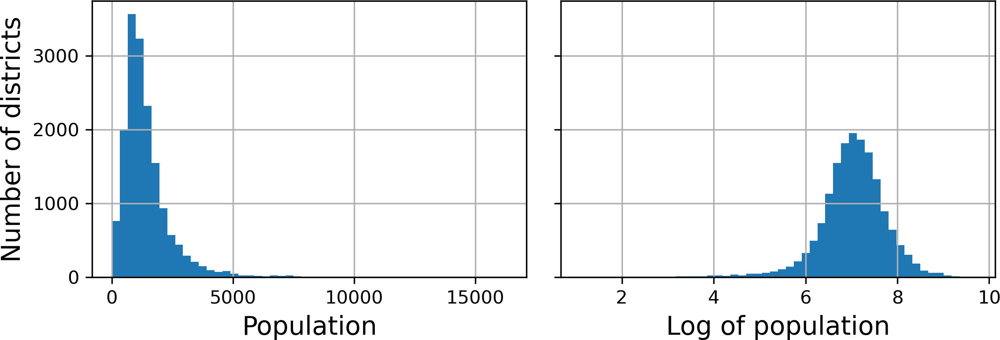

對數轉換可壓縮右長尾，但必須處理零值與負值。
教材也介紹分位數、RBF 相似度與自訂轉換，是否有用要靠驗證。

<!-- 講者提示：Notebook對照：程式 02-11、02-13、02-18；見本章 ipynb 首行的程式代碼。圖例與固定玩具例依各頁標示的資料與輸入解讀。原圖為人口分布與其log轉換，軸尺度不同不可把高度直接當同一區間的頻數。標準化改變位置尺度，對數轉換改變形狀。自訂Transformer只講保存訓練狀態及重用transform，不做類別API推導。 -->

---
<!-- _class: small -->
## Pipeline：把前處理與模型包成同一流程

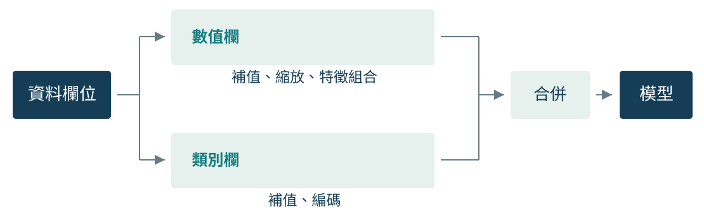

不同型態走適合的轉換，再合併成模型輸入。
保存模型時，也必須保存補值、編碼與縮放設定。

💻 **模型開發主線**：`programs/notebooks/02_端到端機器學習專案.ipynb`（前處理、Pipeline、CV、搜尋與 final test）

<!-- 講者提示：Notebook對照：程式 02-18、02-19、02-15、02-17；見本章 ipynb 首行的程式代碼。圖例與固定玩具例依各頁標示的資料與輸入解讀。圖對應ColumnTransformer與Pipeline的概念，特徵工程等其他轉換可加入分支中。 -->

---
## fit、transform、predict 各自做什麼？

| 階段 | 訓練資料 | 驗證／測試／新資料 |
|---|---|---|
| 補值與縮放 | `fit` 估計統計量，再 `transform` | 僅 `transform` |
| 類別編碼 | `fit` 建立類別字典，再轉換 | 套用同一份字典 |
| 預測模型 | `fit` 學習權重或規則 | `predict` 產生預測 |

交叉驗證的每一折，都必須有自己重新擬合的完整流程。

<!-- 講者提示：Notebook對照：程式 02-16；見本章 ipynb 首行的程式代碼。這是介面語意說明，不是可直接執行的完整程式。有人常把StandardScaler.fit_transform整份資料後再CV，這會讓各折驗證資料的統計資訊進入訓練。 -->

---
## 基準模型：改善應該有比較對象

- MSE／RMSE 任務可用「總是預測訓練目標均值」作簡單基準。
- MAE 任務可用「總是預測訓練目標中位數」作簡單基準。
- 也可比較目前人工或既有系統的預測。

$$R^2=1-\frac{\sum_i(y_i-\hat y_i)^2}{\sum_i(y_i-\bar y)^2}$$

此式 $\bar y$ 是**評估集**的均值。$R^2$ 可以為負，且不是 RMSE。

<!-- 講者提示：Notebook對照：程式 02-04、02-20、02-25；見本章 ipynb 首行的程式代碼。常數基準的值只能用訓練集估計，R²分母中的評估集均值則是指標定義，二者不要混淆。R²=0表示與評估集均值常數的平方誤差相同。若目標無變異則分母0，需特殊處理。 -->

---
## 訓練分數可能非常誤導

| 教材模型 | 訓練 RMSE（約） | 10 折驗證平均 RMSE（約） |
|---|---:|---:|
| 線性迴歸 | 68,973 | 70,003 |
| 決策樹 | 0 | 66,574 |
| 隨機森林 | 17,551 | 47,038 |

樹在訓練集零誤差，卻沒有零泛化誤差。
這些是教材在指定流程下的示例，不是普遍模型排名。

<!-- 講者提示：Notebook對照：程式 02-20；見本章 ipynb 首行的程式代碼。以預測能力與訓練落差兩個面向閱讀。此處只介紹樹的分割與森林平均直覺，不提前展開Ch.5–6。線性迴歸的訓練與CV差距小，也不意味已經達到任務要求。 -->

---
<!-- _class: small -->
## 每一折都是一次完整的模型訓練

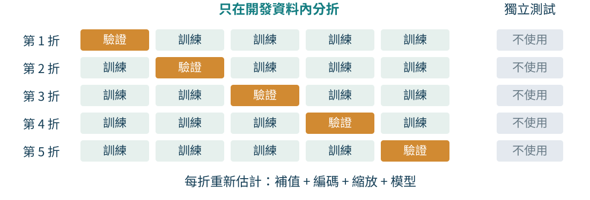

示意採 5 折，教材示例採 10 折。
報告平均值與各折波動，不能將折間標準差直接當信賴區間。

💻 **完整 CV 流程**：`programs/notebooks/02_端到端機器學習專案.ipynb`（每折重新 `fit` 整條 Pipeline）

<!-- 講者提示：Notebook對照：程式 02-19、02-20、02-16；見本章 ipynb 首行的程式代碼。圖例與固定玩具例依各頁標示的資料與輸入解讀。每份資料在某一折當驗證，其他折可訓練，但預測它的那一折不能用它擬合。不同折訓練集重疊，分數不是獨立重複。 -->

---
## 常見洩漏：切分後仍可能發生

| 做法 | 洩漏了什麼？ | 修正方向 |
|---|---|---|
| 全資料補值後才切分 | 驗證／測試分布的統計量 | 在訓練流程內估計 |
| 先挑最相關特徵再做 CV | 驗證標籤影響了特徵選擇 | 每折內選特徵 |
| 同人照片隨機分散各集合 | 個體資訊與近似重複樣本 | 按人或群組切分 |
| 多次看測試集調設定 | 測試結果引導模型選擇 | 保留真正未使用的最終評估 |

Pipeline 有助封裝前處理，不能自動修正錯誤的資料切分。

<!-- 講者提示：在目前章節談前處理是為第三週擴增與閾值調整建立底線。不是所有洩漏都會大幅提高分數，但評估流程仍應一致且可追溯。 -->

---
## Fine-Tune Your Model：先固定評估規則

教材建議先快速比較多類模型，留下約 2–5 個有希望的候選，再開始細調。

| 名稱 | 何時決定 | 本章例子 |
|---|---|---|
| 模型參數 | `fit()` 由訓練資料學得 | 樹的分割、葉節點預測值 |
| 超參數 | 訓練前由人或搜尋程序指定 | `min_samples_leaf`、`max_features` |

開發過程只使用訓練資料與其中的驗證折。
**最終測試集不參與候選組合的挑選。**

<!-- 講者提示：Notebook對照：程式 02-21；見本章 ipynb 首行的程式代碼。超參數屬於學習演算法的設定，不是模型從當次訓練資料直接估出的參數。先定義指標、切分與計算預算，再搜尋，才能合理比較候選。教材在此處從預設隨機森林出發。 -->

---
## n-fold 交叉驗證如何支撐超參數搜尋

教材使用的 **k-fold** 也常被稱為 **n-fold**：n 代表切分的折數。

1. 將開發資料切成 n 個不重疊的折。
2. 每次保留一折驗證，其餘 n−1 折重新擬合完整 Pipeline。
3. 對每組超參數取得 n 個分數，比較平均與折間波動。

$$\bar s=\frac{1}{n}\sum_{j=1}^{n}s_j
\qquad N_{\mathrm{fit}}=N_{\mathrm{candidate}}\times n$$

教材的網格搜尋用 `cv=3`；前面比較單一模型時用 10 折。

<!-- 講者提示：Notebook對照：程式 02-21；見本章 ipynb 首行的程式代碼。每個候選組合都要重複 n 次訓練，且補值、編碼、縮放與特徵工程都要在各折內重新fit。折數增加會使每次訓練使用較多資料，也會提高計算成本。折間分數有相互重疊的訓練集，不可直接當成完全獨立的重複實驗。 -->

---
<!-- _class: small -->
## Pipeline 的參數名稱可以一路往內指定

```python
forest_pipe = Pipeline([
    ('preprocess', clone(preprocess)),
    ('model', clone(models['forest'])),
])
```

| 本課 Notebook 名稱 | 設定位置 |
|---|---|
| `preprocess__num__simpleimputer__strategy` | 數值分支的補值策略 |
| `model__max_features` | 森林每次分割考慮的特徵比例 |
| `model__min_samples_leaf` | 葉節點的最少樣本數 |

`__` 依實際步驟名稱往內找。本課固定前處理，搜尋森林超參數。
教材的 `preprocessing__geo__n_clusters` 是另一條含地理群聚的管線。

<!-- 講者提示：Notebook對照：程式 02-21；見本章 ipynb 首行的程式代碼。對照 Notebook 的 forest_pipe 定義；不要把教材另一條管線的名稱直接貼入本檔。clone 建立未擬合的同設定估計器；預處理預覽不會被拿來代替折內 fit。 -->

---
<!-- _class: small -->
## GridSearchCV：列出所有候選組合

```python
grid = GridSearchCV(
    forest_pipe,
    {'model__max_features': [.6, 1.0],
     'model__min_samples_leaf': [1, 4]},
    cv=folds, scoring='neg_root_mean_squared_error',
    n_jobs=1,
)
grid.fit(X_train, y_train)
```

本課為 $2\times2=4$ 組候選，3 折共 $4\times3=12$ 次驗證用訓練。
預設 `refit=True` 另外以完整開發集擬合一次最佳設定。

教材的 15 組、45 次是較大的示例；本課縮小範圍便於 CPU 練習：

<!-- 講者提示：Notebook對照：程式 02-21；見本章 ipynb 首行的程式代碼。程式變數與 Notebook 一致。folds 是同一份預先固定的三折索引；搜尋器每折都重擬合整條 Pipeline。運算成本除了候選乘折數，還應預留一次 refit。 -->

---
<!-- _class: small -->
## GridSearchCV：讀取最佳設定與各折結果

```python
print(grid.best_params_)
cv_results = pd.DataFrame(grid.cv_results_)
cv_results['mean_RMSE'] = -cv_results['mean_test_score']
cv_results.sort_values('mean_RMSE').head()
```

- `split0_test_score` 等欄位是各折**驗證分數**。
- `mean_test_score` 越大越好；改為正 RMSE 後越小越好。
- `std_test_score` 是折間波動，不能直接當信賴區間。
- 比較 grid 與 random 的最佳 CV，才決定 `final_model`。

模型評估以當次執行表格列出的 RMSE 與設定為準。

<!-- 講者提示：Notebook對照：程式 02-21、02-22；見本章 ipynb 首行的程式代碼。名稱 test_score 不代表 locked_test。選出最高分的候選會有選擇偏差，不可將最佳 CV 當最終未偏成效。 -->

---
<!-- _class: small -->
## RandomizedSearchCV：用固定預算抽樣

```python
random = RandomizedSearchCV(
    forest_pipe,
    {'model__max_features': [.5, .7, 1.0],
     'model__min_samples_leaf': randint(1, 9)},
    n_iter=4, cv=folds,
    scoring='neg_root_mean_squared_error',
    random_state=SEED, n_jobs=1,
)
random.fit(X_train, y_train)
```

本課 4 組候選 × 3 折 = 12 次驗證用訓練，另加一次 refit。
`randint(1, 9)` 包含 1、不包含 9；種子固定候選抽樣。

配套實作：`programs/notebooks/02_端到端機器學習專案.ipynb`

<!-- 講者提示：Notebook對照：程式 02-21；見本章 ipynb 首行的程式代碼。本課 grid 與 random 使用相同開發資料、folds 及森林；教材的 n_iter=10 是另一個預算。只用 CV 選定搜尋結果，不看最終 test 再挑。 -->

---
## 網格搜尋與隨機搜尋的選擇

| 問題特徵 | 網格搜尋 | 隨機搜尋 |
|---|---|---|
| 範圍小且候選明確 | 可窮舉全部組合 | 可能漏掉指定點 |
| 連續或取值很多 | 只會測試列出的點 | 可由機率分布取樣 |
| 加入影響很小的超參數 | 組合數成倍增加 | 總輪數仍由 `n_iter` 控制 |
| 計算預算 | 由網格大小決定 | 可直接設定抽樣輪數 |

若 6 個超參數各有 10 種值，網格搜尋會產生 $10^6$ 組候選。
隨機搜尋則可依預算固定嘗試次數。

<!-- 講者提示：Notebook對照：程式 02-21；見本章 ipynb 首行的程式代碼。搜尋方法的選擇要同時看空間大小、超參數型態與計算預算。隨機搜尋不是比網格搜尋粗糙，在高維空間反而常能將預算用在更多不同取值上。但若必須確認少量特定設定，網格較容易維持可預期的涵蓋。 -->

---
## 逐次減半：先用少量資源篩選候選

`HalvingGridSearchCV` 與 `HalvingRandomSearchCV` 將搜尋分成多輪：

1. 第一輪產生較多候選，只分配少量訓練資料或訓練輪數。
2. 保留表現較好的候選，下一輪給它們更多資源。
3. 最後少數候選才使用完整資源評估。

這種做法可節省時間，但早期少量資源的排名可能受抽樣波動影響。

<!-- 講者提示：Notebook對照：程式 02-22；見本章 ipynb 首行的程式代碼。教材說明的「資源」預設是訓練樣本數，也可是某個訓練輪數超參數。逐次減半並不保證絕對找到全局最佳組合，它是以較少資源優先篩選的預算策略。 -->

---
## 搜尋完成後才建立定案模型

```python
chosen_search = max(searches, key=lambda k: searches[k].best_score_)
final_model = searches[chosen_search].best_estimator_

feature_names = final_model["preprocess"].get_feature_names_out()
importances = final_model["model"].feature_importances_
```

- `refit=True` 是預設值。搜尋完成後，最佳 Pipeline 會用全部開發訓練資料再擬合。
- `best_estimator_` 包含前處理與模型，應當整體保存與部署。
- 取出最佳模型後，先做特徵重要性、錯誤樣本與群體切片分析，最後才使用測試集。

<!-- 講者提示：Notebook對照：程式 02-21、02-23；見本章 ipynb 首行的程式代碼。refit不是另一次模型選擇，而是將已選定的超參數用在更完整的開發訓練資料。若看完最終測試結果後再改超參數，原測試集就已參與開發，不再是獨立的泛化評估。 -->

---
<!-- _class: activity -->

## 活動：用計算預算設計超參數搜尋

你準備搜尋：

- `n_clusters = [5, 10, 15, 20]`
- `max_features = [4, 6, 8]`
- `min_samples_leaf = [1, 2]`
- `cv = 5`，每次擬合約 18 秒

<div class="columns">
<div>

### 先算成本

1. 網格共有幾組候選？
2. 總共要執行幾次擬合？
3. 預估需要幾分鐘？

</div>
<div>

### 再做決策

限制在 **15 分鐘內**，你會如何修改？
寫下搜尋方法、`cv`／`n_iter` 與理由；並指出最終測試集何時才可使用。

</div>
</div>

<!-- 講者提示：Notebook對照：程式 02-22；見本章 ipynb 首行的程式代碼。答案：4×3×2=24組；24×5=120次擬合；120×18秒=2160秒=36分鐘。一種可行方案是RandomizedSearchCV設n_iter=8、cv=5，共40次擬合，約12分鐘。也可縮小範圍或使用逐次減半，但須說明取捨。測試集只能在流程與超參數定案後使用一次。 -->

---
## 錯誤分析：平均分數之外

- 依地區、價位、城鄉等切片，檢查誤差與樣本量。
- 查看大誤差樣本是否涉及截頂、缺失或未涵蓋情境。
- 特徵重要性提供模型使用資訊的線索，不能當作因果證據。
- 將改善假設交給驗證資料評估。

某一群體誤差很高，不應被整體平均掩蓋。

<!-- 講者提示：Notebook對照：程式 02-23、02-24、02-26；見本章 ipynb 首行的程式代碼。以偏遠地區與都市比較；如果一組只有很少樣本，必須呈現不確定性。特徵重要性受相關特徵與估計方法影響，不在此推導。 -->

---
## 最終測試與不確定性

教材定案模型的測試 RMSE 約 **41,446 美元**。
教材 bootstrap 95% 信賴區間約 **39,521–43,702 美元**。

- 點估計不是保證值，結果取決於樣本與評估設計。
- 看完測試後再改模型，原測試就參與了開發。
- 測試表現較驗證好或壞，都不能靠反覆挑選結果解決。

<!-- 講者提示：Notebook對照：程式 02-25；見本章 ipynb 首行的程式代碼。此區間估計RMSE，不是單一房屋售價的預測區間。bootstrap需考慮樣本依賴性；若有群組或空間相依，應按合理單位重抽。單次教材區間不保證對當代房價有效。 -->

---
## 部署、監測與維護

| 保存 | 監測 | 更新時機 |
|---|---|---|
| 模型、前處理、版本與切分規則 | 輸入格式、缺失率、分布與預測錯誤 | 資料或任務改變，表現不再符合要求 |

輸入漂移可能先於標籤到達而被觀察到。
但看到輸入改變，仍需後續真實結果確認預測表現是否下降。

> 💻 **部署練習**：先執行 `programs/notebooks/02_端到端機器學習專案.ipynb` 產生並保存模型，再由同一本的 `cloudpickle.load` 載入完整 Pipeline，核對同一批原始欄位的預測。

<!-- 講者提示：Notebook對照：程式 02-02、02-27、02-28；見本章 ipynb 首行的程式代碼。保留上一個可運作版本與比較記錄。教材web service僅作部署直覺，不在本課堂做服務實作。模型本體不是完整系統。 -->

---
## 第二週回顧與課後整理

完成一頁房價預測設計，至少包含：

- 觀察單位、特徵、目標與資料限制。
- 一張分布或關係圖，以及它支持與不支持的解讀。
- 資料切分、Pipeline、基準與主要指標。
- 如何挑選設定、何時開啟最終測試。

下週把數值誤差改為分類錯誤，練習解釋不同分母與決策閾值。

<!-- 講者提示：不要求學生重跑出教材分數。重點是流程能否回答研究問題，以及結論是否有相應證據。 -->

---
<!-- _class: small -->
## Notebook 導讀：資料範圍與穩定切分

| 階段 | 預設 fast 模式 | 用途 |
|---|---:|---|
| EDA | 16,512 筆 training | 直方圖、散布圖、特徵假設 |
| 模型開發 | 其中分層抽 6,000 筆 | 三折 CV 與搜尋 |
| 最終測試 | 保留 4,128 筆 | 設定定案後評估 |

固定 seed 無法保證重新排序、追加資料後，既有樣本仍在同一集合。
穩定 ID 的 SHA-256 可固定成員歸屬，但不保證剛好 20% 或群組隔離。

<!-- 講者提示：Notebook對照：程式 02-01、02-02、02-03、02-14、02-16；見本章 ipynb 首行的程式代碼。Notebook 的 district ID 是合成示例；housing_split 仍使用收入分層。full 模式只擴大資料量與搜尋範圍，不代表完整生產環境。 -->

---
<!-- _class: small -->
## Notebook 導讀：前處理分支與自訂轉換

| 分支 | 程式與解讀 |
|---|---|
| 一般數值 | 中位數補值 → StandardScaler |
| 長尾數值 | 補值 → log1p → StandardScaler |
| 比率特徵 | 補值 → RatioTransformer → StandardScaler |
| 無序類別 | 眾數補值 → OneHotEncoder |

`fit` 保存狀態，`transform` 套用狀態，`get_feature_names_out` 保留欄名。
本例分母為零時回傳 0，是明示的示範政策；未知類別採全零編碼。
保存時用 cloudpickle 一起保存模型與自訂類別，並記錄套件及資料版本。

<!-- 講者提示：Notebook對照：程式 02-17、02-18、02-23、02-27、02-28；見本章 ipynb 首行的程式代碼。對應本檔自帶的 RatioTransformer，無需安裝 mlcourse 模組。log1p 適用本資料非負計數，不可任意套用負數。重新載入只檢查預測一致，不等於完成部署驗證。 -->

---
<!-- _class: figure -->
## Notebook 圖表：訓練誤差與特徵重要性

<div class="columns">
<div>

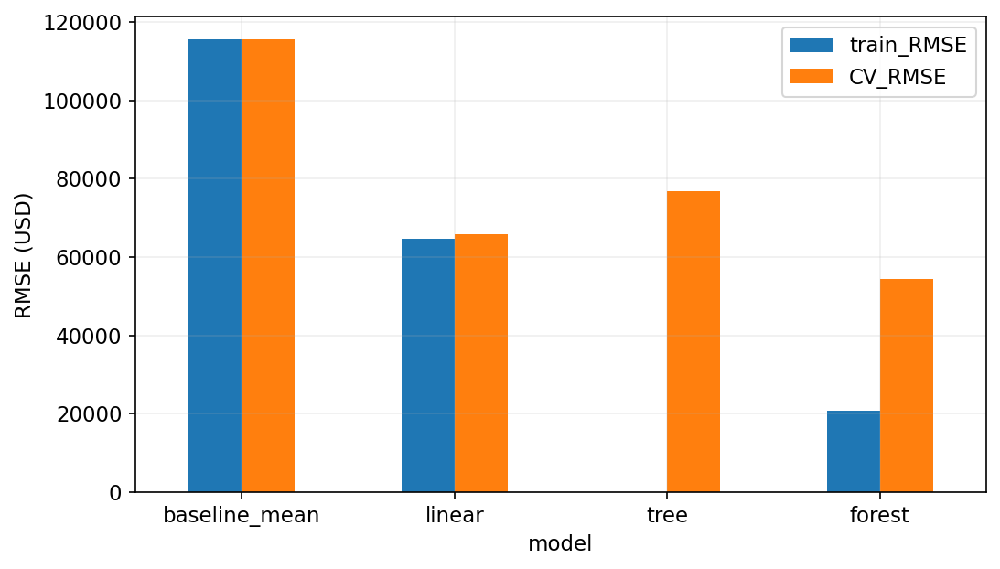

</div>
<div>

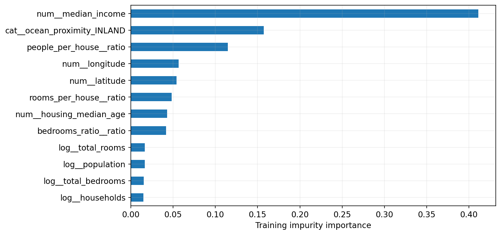

</div>
</div>

左：各折訓練與驗證 RMSE；右：森林使用的分裂重要度。
重要度受高基數與相關特徵影響，不能解讀為因果貢獻。

<!-- 講者提示：Notebook對照：程式 02-20、02-23；見本章 ipynb 首行的程式代碼。圖例與固定玩具例依各頁標示的資料與輸入解讀。Notebook 重跑會生成這兩張圖；依預設 fast 模式、當次環境解讀，不要求與教材10折數值一致。分群殘差另以開發集 OOF 預測分析，避免看完 test 再改模型。 -->

---
<!-- _class: figure -->
## Notebook 圖表：殘差與最終測試

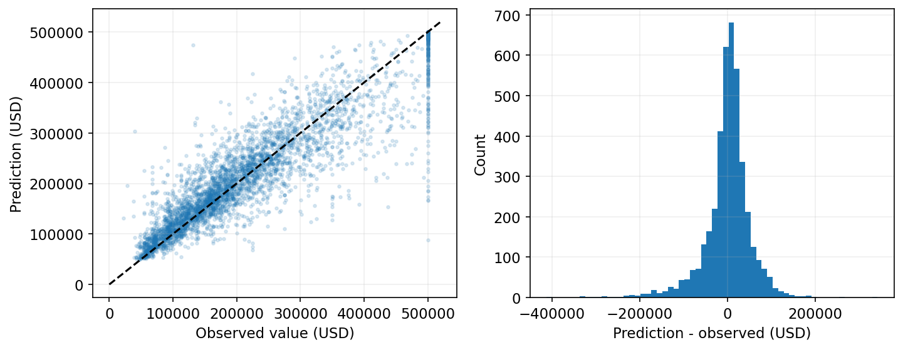

左：預測與真值偏離對角線；右：殘差採「預測減真實」。
Bootstrap 重抽固定模型的測試平方誤差，估計 RMSE 的抽樣區間。
它不包含重訓、搜尋、地理相依或未來漂移的全部不確定性。

<!-- 講者提示：Notebook對照：程式 02-26、02-25；見本章 ipynb 首行的程式代碼。圖例與固定玩具例依各頁標示的資料與輸入解讀。讀取 test 後不再調參。Notebook 另示範缺失率監測、未知類別與缺值的 API 檢查；輸入改變不自動等於效能已下降。只載入自己產生且可信的序列化模型。 -->
