<!-- _class: cover -->

# 第三週：分類與模型評估
## 混淆矩陣、決策閾值與錯誤分析

同一個模型，可以因為決策設定而產生不同的錯誤。

<!-- 講者提示：本檔160分鐘，加兩次10分鐘休息，共180分鐘。以辨識數字5為主案例，後半段回到0到9的多類別任務。 -->

---
## MNIST：影像也可以表示成特徵矩陣

<div class="columns">
<div>

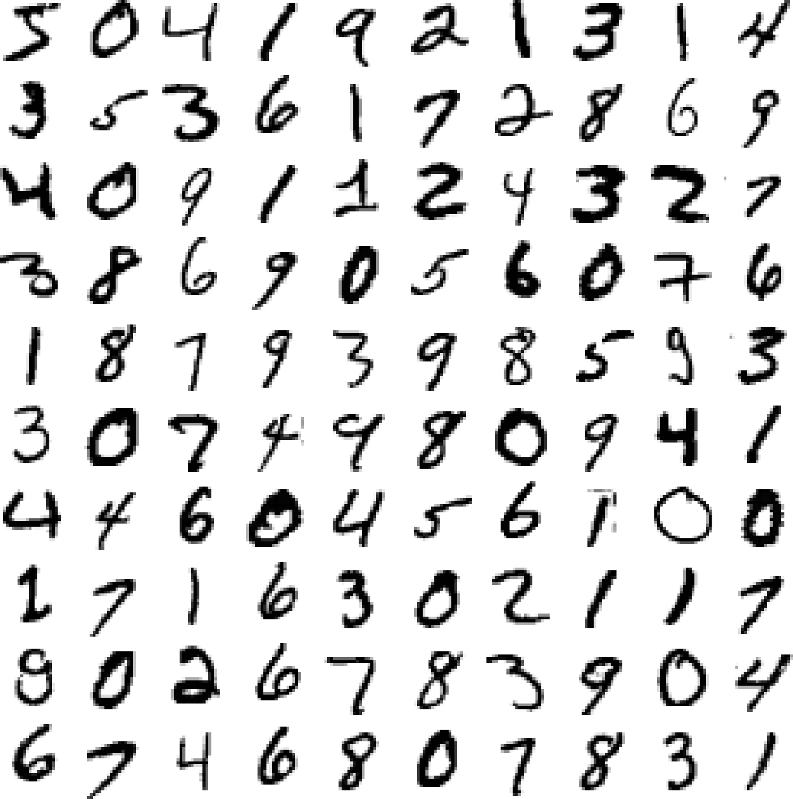

</div>
<div>

- 70,000 張手寫數字影像。
- 每張 $28\times28=784$ 個像素。
- 一張影像是一筆樣本。
- 標籤為 0 到 9。
- 教材保留前 60,000 張訓練、後 10,000 張測試。

**配套實作**：`programs/notebooks/03_分類與模型評估.ipynb`

</div>
</div>

<!-- notebook-companion-link -->
> 💻 **配套 Notebook**：[`03_分類與模型評估.ipynb`](../programs/notebooks/03_分類與模型評估.ipynb)。程式片段、實際圖表與表格可由此檔重現。

<!-- 講者提示：原圖展示不同書寫風格。像素值可以攤平成一列，但空間結構仍是影像的重要資訊。教材已提供固定訓練／測試分割，後續交叉驗證只在訓練部分進行。Notebook 07 對應 MNIST 二元分類、折外預測與錯誤分析。 -->

---
<!-- notebook-result-slide -->
<!-- _class: small -->
## 程式實驗與實際輸出

<div class="columns wide-left">
<div>

```python
y_oof = cross_val_predict(clf, X, y, cv=3)
ConfusionMatrixDisplay.from_predictions(y, y_oof)
```

**觀察**：折外預測產生的混淆矩陣可用於錯誤分析，最後測試集仍保留到決策完成後。

[開啟完整 Notebook](../programs/notebooks/03_分類與模型評估.ipynb)

</div>
<div>

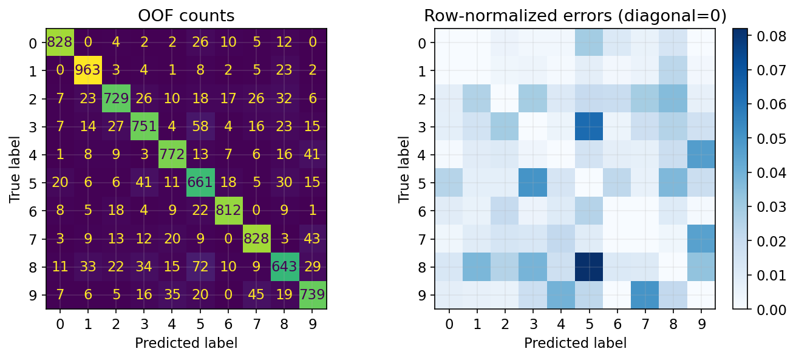

</div>
</div>

<!-- 講者提示：程式與圖均來自 programs/notebooks/03_分類與模型評估.ipynb 的已執行輸出；來源與改編界線見 Notebook。 -->
---
## 二元分類：先辨識「是不是 5」

$$y_i=\begin{cases}1,&\text{影像是數字 5}\\0,&\text{影像不是數字 5}\end{cases}$$

- 正類（positive）是我們指定關注的事件。
- 負類（negative）包含其餘九個數字。
- 訓練資料提供真實標籤，模型對新影像輸出分數或類別。

正類不代表「好」，負類也不代表「壞」。
本週的二元混淆矩陣都採同一個正類定義。

<!-- 講者提示：教材以SGDClassifier開始，SGD是訓練方式，不能直接當作sigmoid機率模型。下一頁明確以舊稿邏輯斯迴歸作另一種模型的補充。 -->

---
## 補充：邏輯斯迴歸把分數轉為機率估計

<div class="columns">
<div>

$$z=b+\mathbf w^\top\mathbf x$$
$$\hat p=\sigma(z)=\frac1{1+e^{-z}}$$

$\hat p$ 表示模型估計的正類機率。
當 $\hat p\geq t$，判為正類。

</div>
<div>

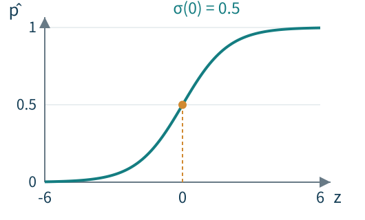

</div>
</div>

$t=0.5$ 是常見起點，未必適合每種錯誤代價。

> 💻 **邏輯斯迴歸與多類別實作**：`programs/notebooks/03_分類與模型評估.ipynb`

<!-- 講者提示：這頁是補充模型，不是說教材SGDClassifier預設會輸出機率。z可為任意實數，sigmoid落在0與1之間。機率估計仍需校準檢查，分數高低不等於實際正確率。Notebook 05 用 Iris 對應二元邏輯斯、多類別與決策區域。 -->

---
## 決策邊界：在特徵空間畫出判斷分界

<div class="columns wide-left">
<div>

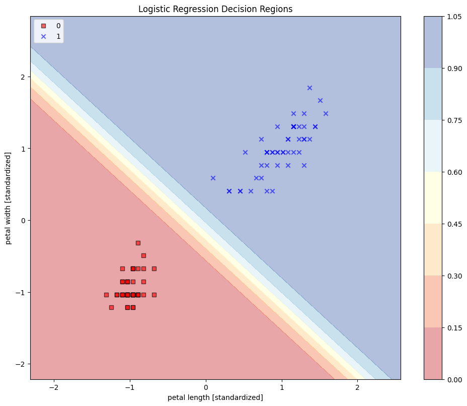

</div>
<div>

舊稿使用 Iris 的兩個花瓣特徵，並篩成兩類。

- 點：樣本及其真實類別。
- 背景顏色：模型估計的機率。
- 色彩交界：特定閾值下的邊界。

</div>
</div>

<!-- 講者提示：明確說這張圖不是MNIST。原稿只使用setosa與versicolor，排除virginica，因此不能把其高分推廣到全部三類。改閾值會移動決策邊界，不一定要重新訓練權重。 -->

---
## 訓練損失與分類正確率不同

二元交叉熵（此處使用自然對數）：

$$\ell(y,\hat p)=-\left[y\ln\hat p+(1-y)\ln(1-\hat p)\right]$$

| 真實 $y=1$ | $\hat p$ | 閾值 0.5 下分類 | 損失（約） |
|---|---:|---|---:|
| 樣本 A | 0.9 | 正確 | 0.105 |
| 樣本 B | 0.6 | 正確 | 0.511 |
| 樣本 C | 0.1 | 錯誤 | 2.303 |

相同的分類結果，仍可能有不同的機率估計與損失。

<!-- 講者提示：修正舊稿混用log底數的問題。這是不同預測情形的玩具示例，資料沒有用來宣稱模型品質。若輸出錯誤且非常有信心，損失會很大。實作需處理log0，但本課只講概念。 -->

---
<!-- _class: small -->

## 用未參與訓練的預測評估

```python
from sklearn.linear_model import SGDClassifier
from sklearn.model_selection import cross_val_predict

sgd_clf = SGDClassifier(random_state=42)
y_train_5 = (y_train == "5")
y_train_pred = cross_val_predict(
    sgd_clf, X_train, y_train_5, cv=3
)
```

- 每個 `y_train_pred[i]` 都來自**沒有用第 i 筆樣本訓練**的模型。
- 把折外預測（OOF）合併後，可計算混淆矩陣、precision、recall 與 F1。
- 調整模型或閾值後，仍需獨立的最終測試。

> 💻 **完整 MNIST 流程**：`programs/notebooks/03_分類與模型評估.ipynb`

<!-- 講者提示：若目前 y_train 為整數標籤，條件請改成 y_train == 5；以資料的實際 dtype 為準。OOF分數若被用來挑閾值，就不再是整個選擇程序的完全獨立評估。教材部分展示先縮放再CV，本課統一強調每折內Pipeline。 -->

---
## 類別不平衡：什麼都判成「不是 5」

教材訓練部分有 60,000 張影像，其中：

| 真實類別 | 筆數 | 比例 |
|---|---:|---:|
| 不是 5 | 54,579 | 90.965% |
| 是 5 | 5,421 | 9.035% |

若全部預測「不是 5」，accuracy 仍達 **90.965%**，
卻**一張 5 都找不到**。

<!-- 講者提示：這個基準的TP=0、FN=5421、TN=54579、FP=0，recall=0。precision因沒有正類預測而分母0，數學上未定義；軟體可能依設定回0並警告。不能以90%以上直接稱成效良好。 -->

---
## 混淆矩陣：列是真實，欄是預測

| 真實 ＼ 預測 | 負類：不是 5 | 正類：是 5 |
|---|---|---|
| **負類：不是 5** | TN 真負例：正確排除 | FP 偽正例：誤報 |
| **正類：是 5** | FN 偽負例：漏判 | TP 真正例：正確找到 |

- 第一個字母 T／F：這次預測是否正確。
- 第二個字母 P／N：**預測**為正類或負類。
- 各格合計等於評估樣本數，對角線是正確分類。

> 💻 **從矩陣到 ROC**：`programs/notebooks/03_分類與模型評估.ipynb`

<!-- 講者提示：舊稿s.50的列為預測、欄為實際，與主教材相反。本課全部統一成主教材方向，矩陣順序為[[TN,FP],[FN,TP]]。不要依格子位置死背而忽略標籤。 -->

---
## 教材的混淆矩陣

| 真實 ＼ 預測 | 不是 5 | 是 5 | 真實總數 |
|---|---:|---:|---:|
| 不是 5 | TN = 53,892 | FP = 687 | 54,579 |
| 是 5 | FN = 1,891 | TP = 3,530 | 5,421 |
| 預測總數 | 55,783 | 4,217 | 60,000 |

$$\mathrm{Accuracy}=\frac{TP+TN}{N}
=\frac{57{,}422}{60{,}000}\approx95.70\%$$

比全判負類的基準高，仍漏掉 1,891 張 5。

<!-- 講者提示：這是教材在60000筆訓練部分以交叉驗證產生的折外預測，不能標成10000筆獨立測試結果。確認四格、列合計與欄合計。 -->

---
## Precision 與 recall 的分母不同

$$\mathrm{Precision}=\frac{TP}{TP+FP}
=\frac{3{,}530}{4{,}217}\approx83.71\%$$

在**所有被模型判成 5** 的影像中，有多少真的是 5？

$$\mathrm{Recall}=\frac{TP}{TP+FN}
=\frac{3{,}530}{5{,}421}\approx65.12\%$$

在**所有真正的 5** 中，模型找回多少？

<!-- 講者提示：precision用精確率，recall用召回率或敏感度。不要把accuracy與precision都翻成準確率。讓學生用手指矩陣的正類欄與正類列，連結分母。 -->

---
## F1：精確率與召回率的調和平均

$$F_1=\frac{2PR}{P+R}
=\frac{2TP}{2TP+FP+FN}\approx0.733$$

- 當 precision 或 recall 其中之一很低，F1 也會受到限制。
- F1 沒有直接使用 TN，不能完整表達排除負類的能力。
- F1 不會自動反映誤報與漏判的實際代價。

分母為零時，應說明處理規則，不能默認數值都有定義。

<!-- 講者提示：教材精確值0.732517。P與R在公式使用0到1而非混用百分數。若任務非常在意負類，需一起報specificity、FPR或完整矩陣。 -->

---
<!-- _class: activity -->

## 活動 F：從四格算出三個分數

| 真實 ＼ 預測 | 不是 5 | 是 5 |
|---|---:|---:|
| 不是 5 | 70 | 10 |
| 是 5 | 5 | 15 |

請算 accuracy、precision、recall，再說明：

**85% accuracy 能不能證明模型已經足夠好？**

<!-- 講者提示：2分鐘算、2分鐘討論、1分鐘回饋。答案85%、60%、75%；F1=2/3可作加問。全負基準80%，仍需依漏判與誤報代價判斷可用性。本檔累計55分鐘，在此休息10分鐘。 -->

---
## 決策閾值控制哪些樣本被判成正類

$$\hat y=\mathbb{1}[s(\mathbf x)\geq t]$$

- $s(\mathbf x)$ 是模型分數，未必是機率。
- $t$ 越高，被判成正類的樣本通常越少。
- 在固定資料與分數下，升高閾值使 recall 不增加。
- Precision 常會上升，**但不保證單調增加**。

閾值選擇是決策設計的一部分，應使用驗證資料。

> 💻 **閾值實作**：`programs/notebooks/03_分類與模型評估.ipynb`。由 `decision_function`／機率分數掃描 threshold，再重算混淆矩陣與指標。

<!-- 講者提示：若移除的恰好是真正類，precision可能下降。模型權重固定不等於系統已完全定案，閾值仍會改變錯誤型態。分數0可能是某些決策函數的起點，0.5通常用於機率，不可通用。 -->

---
<!-- _class: figure -->

## 圖上的閾值如何改變誤報與漏判？

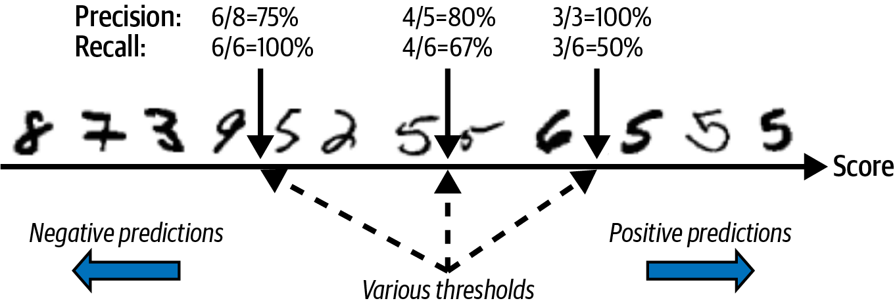

將閾值往右移，部分原本判成正類的影像改判成負類。
其中可能同時包含被排除的誤報，以及新產生的漏判。

<!-- 講者提示：依教材中間閾值precision4/5=80%、recall4/6≈67%；右側較高閾值precision3/3=100%、recall3/6=50%。逐張移動時precision可能先由4/5降到3/4，再上升，破除必然單調的想法。 -->

---
<!-- _class: small -->

## 用八筆分數追蹤每一次決策

| 樣本 | 模型分數 $s$ | 真實 $y$（是 5＝1） |
|---|---:|---:|
| A | 0.95 | 1 |
| B | 0.85 | 0 |
| C | 0.80 | 1 |
| D | 0.70 | 1 |
| E | 0.60 | 0 |
| F | 0.40 | 0 |
| G | 0.30 | 1 |
| H | 0.10 | 0 |

共 4 個正類、4 個負類。採用 **$s\geq t$ 判正類**。

<!-- 講者提示：分數只是課堂設計，雖介於0與1之間，不宣稱已校準為機率。請學生畫三條水平切線：0.8、0.5、0.2。之後所有toy曲線必須從這一表計算。 -->

---
<!-- _class: activity -->

## 活動 G：閾值不同，混淆矩陣也不同

| 閾值 $t$ | TP | FP | FN | TN | Precision | Recall |
|---|---:|---:|---:|---:|---:|---:|
| 0.8 | ？ | ？ | ？ | ？ | ？ | ？ |
| 0.5 | ？ | ？ | ？ | ？ | ？ | ？ |
| 0.2 | ？ | ？ | ？ | ？ | ？ | ？ |

哪個設定漏判最少？哪個設定誤報最少？
如果漏判的代價較高，你會如何說明選擇？

<!-- 講者提示：4分鐘算、2分鐘比較、2分鐘回饋。0.8:TP2 FP1 FN2 TN3 P2/3 R1/2；0.5:TP3 FP2 FN1 TN2 P3/5 R3/4；0.2:TP4 FP3 FN0 TN1 P4/7 R1。不能只說選最低閾值最好，仍需看誤報代價與處理容量。 -->

---
<!-- _class: figure -->

## 教材的 precision／recall 與閾值曲線

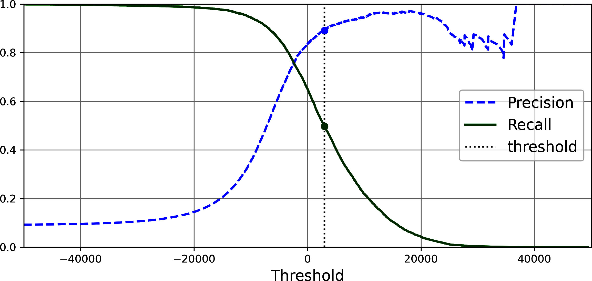

教材把 precision 調到約 **90%** 時，recall 只剩約 **48%**。
「精確率很高」仍須交代找回多少正類，以及判出了多少筆。

<!-- 講者提示：教材90%precision對應閾值約3370，這是SGD決策分數，不是0到1的機率。圖中標示3000附近，數值為視覺近似；精確90%結果在p.119。不能把這個數值搬到另一個模型。 -->

---
## ROC：真陽性率對偽陽性率

$$\mathrm{TPR}=\frac{TP}{TP+FN}=\mathrm{Recall}$$
$$\mathrm{FPR}=\frac{FP}{FP+TN}
=1-\underbrace{\frac{TN}{TN+FP}}_{\mathrm{Specificity}}$$

ROC 圖的橫軸是 FPR，縱軸是 TPR。

**FPR 的分母是所有真負類，不是所有正類預測。**
因此 FPR 不等於 $1-\mathrm{Precision}$。

> 💻 **PR／ROC／AUC**：`programs/notebooks/03_分類與模型評估.ipynb`

<!-- 講者提示：請學生回到矩陣指出FPR整列與precision整欄。specificity翻成特異度。TPR=1代表找到所有正類，FPR=1則代表所有負類都誤報。 -->

---
<!-- _class: figure -->

## 畫 ROC：排序分數，再逐步降低閾值

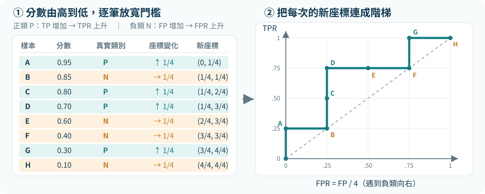

從 $t>0.95$ 的全判負類 $(0,0)$ 出發；每納入一個正類就向上，每納入一個負類就向右，最後到全判正類 $(1,1)$。

[概念參考：好豪筆記〈圖解 ROC 曲線〉](https://haosquare.com/roc-curve/)；圖表為本課依八筆示例重繪。

<!-- 講者提示：本例正類P=4、負類N=4，所以每個正類使TPR增加1/4，每個負類使FPR增加1/4。若多筆分數相同，必須把同分樣本一起移過閾值再計算座標，不能任意決定同分內部順序。 -->

---
## 八筆資料的 ROC 與 PR

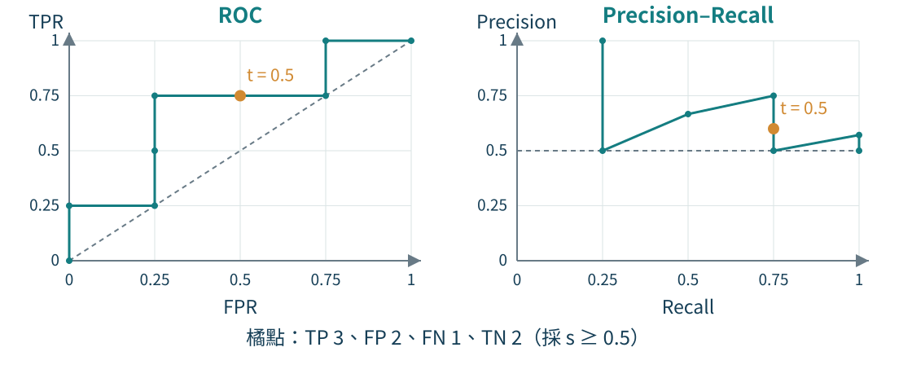

- 左下 $(0,0)$：閾值高於所有分數，全部判負類。
- 左上 $(0,1)$：所有正類都找到、沒有誤報，是理想位置。
- 右上 $(1,1)$：閾值低於所有分數，全部判正類。
- 對角線 $y=x$：無排序能力模型的平均參考線；曲線越靠左上越好。

<!-- 講者提示：每個點對應一個閾值，移動閾值不改變分數排序。ROC使用全部唯一分數及全負起點；PR從有正類預測的閾值開始，無正類預測時precision未定義。對角線是期望參考，不表示有限樣本每次都恰好AUC=0.5。圖中的虛線PR基準為正類比例0.5；折線連接供讀圖，不宣稱PR曲線面積等於average precision。 -->

---
<!-- _class: figure -->

## AUC 怎麼算：沿 FPR 把面積加起來

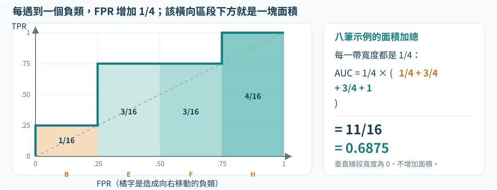

一般折線可用梯形公式：
$$\mathrm{AUC}=\sum_i (\mathrm{FPR}_i-\mathrm{FPR}_{i-1})\frac{\mathrm{TPR}_i+\mathrm{TPR}_{i-1}}{2}$$

本例是階梯線，四個寬度 $1/4$ 的長方形相加，得到 **AUC = 0.6875**。

<!-- 講者提示：文章以黎曼和說明「同一FPR下，TPR越高越好」；本頁落實為可計算的分帶面積。一般軟體多以相鄰ROC點做梯形積分；本例含垂直與水平階梯，垂直段寬度0，因此與圖中長方形加總一致。 -->

---
## 同一個 AUC，也能用正負配對驗算

| 正類樣本 | 分數 | 分數較低的負類 | 勝出配對 |
|---|---:|---|---:|
| A | 0.95 | B、E、F、H | 4 |
| C | 0.80 | E、F、H | 3 |
| D | 0.70 | E、F、H | 3 |
| G | 0.30 | H | 1 |
| **合計** |  |  | **11** |

八筆示例共有 $4\times4=16$ 個正負配對。
所以 $\mathrm{AUC}=11/16=0.6875$，與曲線下面積相同。

若正負樣本同分，該配對以 **0.5 次勝出**計算。

AUC 不會告訴你應採哪個閾值，也不代表機率已校準。

<!-- 講者提示：AUC的機率解讀是：隨機抽一個正類與一個負類，模型把正類排得更高的機率。這是排序能力，不是accuracy，也不是「預測有68.75%會正確」。隨機無辨識排序的期望AUC為0.5，單次有限樣本可能高或低。概念參考：https://haosquare.com/roc-curve/。 -->

---
## PR 與 ROC 關注的比較對象

| 圖 | 橫軸／縱軸 | 主要閱讀問題 |
|---|---|---|
| PR | Recall／Precision | 找回更多正類時，正類預測有多可信？ |
| ROC | FPR／TPR | 增加負類誤報比例時，能找回多少正類？ |

當正類稀少，PR 常更直接呈現正類預測的可用性。
無辨識排序的 PR 參考水準取決於**正類盛行比例**，不固定是 0.5。

<!-- 講者提示：比較不同資料集的PR時需看正類比例。ROC AUC較高不保證在關心的低FPR區域也較好，更不保證所選閾值的precision高。應同時報樣本分布與實際操作點。 -->

---
## 很小的 FPR，也可能帶來很多誤報

假設 10,000 筆資料中，只有 100 筆是正類。
某閾值的 TPR = 90%、FPR = 1%。

| 結果 | 計算 |
|---|---|
| TP | $100\times90\%=90$ |
| FP | $9{,}900\times1\%=99$ |
| Precision | $90/(90+99)\approx47.6\%$ |

召回率高、偽陽性率低，正類預測仍可能有一半左右是誤報。

<!-- 講者提示：這是比例推算，不是某真實資料實驗。全矩陣FN10、TN9801，accuracy98.91%；全負基準99%。用來說明單看accuracy或FPR都有不同盲點。 -->

---
## 教材的兩個分類器比較

<div class="columns wide-left">
<div>

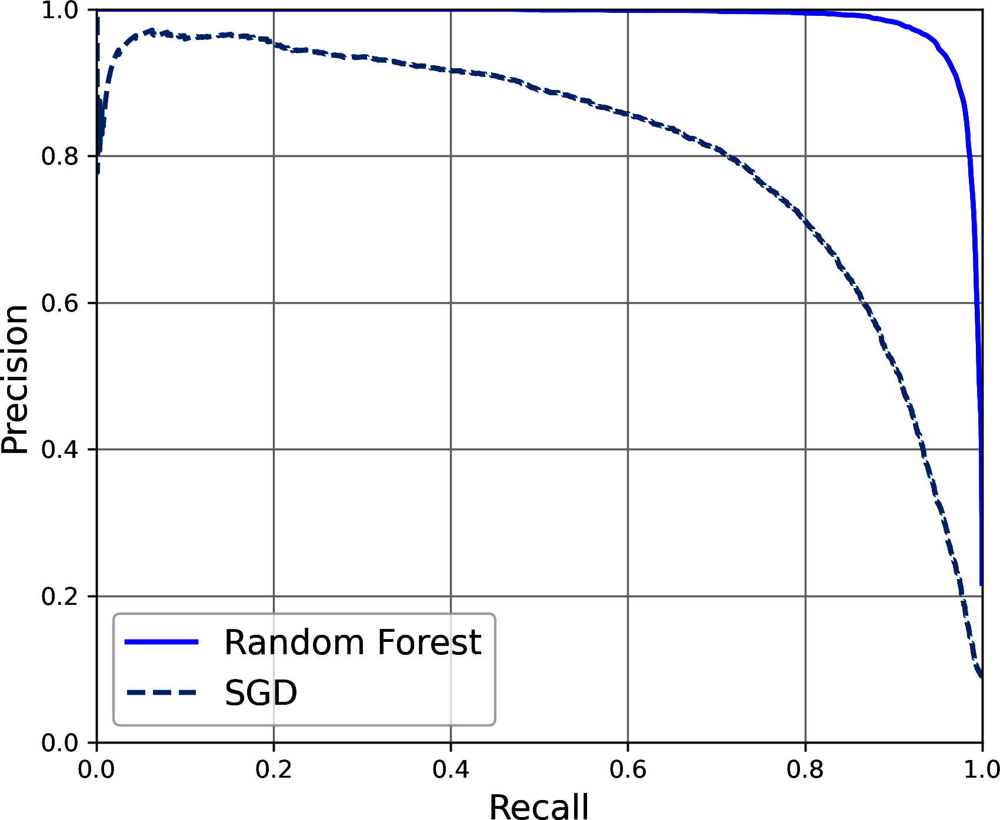

</div>
<div>

在這組教材資料與流程下，隨機森林的 PR 曲線優於 SGD。

比較時仍要固定：

- 相同任務與正類定義。
- 相同資料切分與評估流程。
- 關心的 recall 或 precision 區域。

</div>
</div>

<!-- 講者提示：不要從教材圖延伸成隨機森林普遍勝過線性模型。新任務可能有不同資料量、維度與成本限制。預測機率列需確認正類索引，不能永遠假設任意資料的第二欄就是關注類別。 -->

---
## 閾值選擇還要考慮處理成本

$$\text{錯誤總代價}=c_{FP}\,FP+c_{FN}\,FN$$

- $c_{FP}$：每次誤報的代價，可能是人工檢查時間。
- $c_{FN}$：每次漏判的代價，取決於任務後果。
- 可另設限制，例如每天最多處理 100 筆警示。

先在驗證資料比較可行操作點，設定確定後才做最終測試。

<!-- 講者提示：此式是假設每類錯誤有固定加總成本的簡化模型，真實情境可能不線性。成本比由任務提供，不能從F1自動推得。本檔累計110分鐘，在此休息10分鐘。 -->

---
## 多類別分類：每張影像選一個數字

MNIST 完整任務有 10 個互斥類別。

- 有些模型原生支援多類別。
- 也可組合多個二元分類器。
- 輸出最高分數的**類別標籤**，不要混淆索引與標籤。

例：類別順序是「貓、狗、鳥」，分數最大的索引為 2，
預測標籤是「鳥」，不是數字 2 這個語意。

<!-- 講者提示：本課使用多類別作multiclass的統一名稱，避免與多元迴歸混淆。教材classes_示例指出MNIST索引恰巧吻合數字標籤，其他資料不一定。 -->

---
## 一對其餘與一對一

| 策略 | 訓練內容 | $K$ 類的模型數 | MNIST 十類 |
|---|---|---:|---:|
| OvR | 某一類對所有其他類 | $K$ | 10 |
| OvO | 每兩個類別各訓練一個 | $K(K-1)/2$ | 45 |

- OvR 通常比較各類分數。
- OvO 通常整合兩兩分類結果，例如投票。
- 模型數較多，不一定代表總訓練時間按同樣比例增加。

<!-- 講者提示：每個OvO分類器只看那兩類資料，成本也和基本演算法有關。投票平手需明確規則；不直接把未校準的各分類器分數稱為可相加機率。 -->

---
## 補充：Softmax 與多類別目標

$$z_k=\mathbf w_k^\top\mathbf x+b_k\qquad
\hat p_k=\frac{e^{z_k}}{\sum_{j=1}^{K}e^{z_j}}$$

- 對每個類別產生一個分數，再轉成總和為 1 的機率估計。
- 互斥多類別通常選 $\arg\max_k\hat p_k$。
- 交叉熵可用獨熱標籤表示：$\ell=-\sum_k y_k\ln\hat p_k$。
- 許多實作接受整數類別標籤，不要求使用者手動做獨熱編碼。

> 💻 **Iris 多類別／Softmax**：`programs/notebooks/03_分類與模型評估.ipynb`

<!-- 講者提示：修正舊稿「0,1,2或A,B,C不能使用」的說法。是否需要one-hot是損失與API介面約定，與類別能不能表示不同。softmax用於互斥類別，多標籤常各用sigmoid。 -->

---
<!-- _class: figure -->

## 多類別混淆矩陣

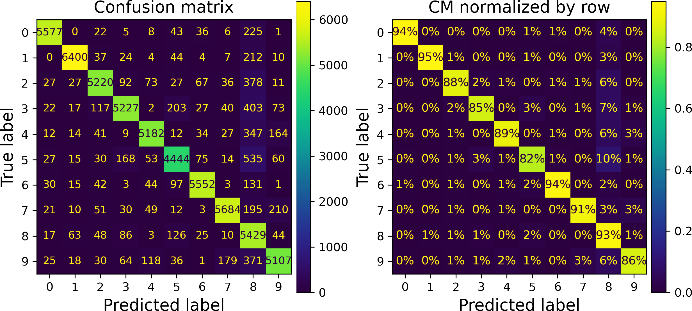

先看每類樣本量，再看各列流向哪些錯誤類別。

<!-- 講者提示：左圖顏色表示計數，較暗可能是樣本少或錯誤多；右圖每列加總100%，對角線是該類recall。圖內為教材實驗，不是本次重訓結果。下一頁用3類玩具數字拆解正規化。 -->

---
## 列正規化與欄正規化的分母

| 真實 ＼ 預測 | A | B | C | 真實總數 |
|---|---:|---:|---:|---:|
| A | 40 | 5 | 5 | 50 |
| B | 4 | 12 | 4 | 20 |
| C | 1 | 3 | 26 | 30 |

- 依列正規化：A 判成 A 為 $40/50=80\%$，是 A 的 recall。
- 依欄正規化：預測 A 中真 A 為 $40/45\approx88.9\%$，是 A 的 precision。
- 先去掉正確預測再正規化，分母變成**錯誤樣本數**。

<!-- 講者提示：教材p.128將正確預測設零權重再正規化，其百分比是錯誤的組成，不能說全類有那些百分比判錯。玩具例A誤判中5/10=50%流到B，但全A只有5/50=10%流到B。 -->

---
## 多類別分數如何平均？

| 平均方式 | 計算概念 | 解讀 |
|---|---|---|
| Macro | 每類各算分數，再等權平均 | 每類同等重要 |
| Weighted | 依每類真實樣本量加權 | 大類別影響較大 |
| Micro | 合併各類 TP／FP／FN 再計算 | 由整體樣本決定 |

單標籤多類別、涵蓋全部類別時，micro F1 等於 accuracy。
Macro F1 要先算每類 F1，再平均，不是先平均 P／R 再算 F1。

<!-- 講者提示：用上頁B只有20筆，示範等權與樣本權重的差異。教材在多標籤處介紹macro／weighted，這裡在錯誤分析後補充其跨類別應用，最後再延伸到多標籤。 -->

---
## 錯誤案例檢查：3 與 5 為何混淆？

<div class="columns">
<div>

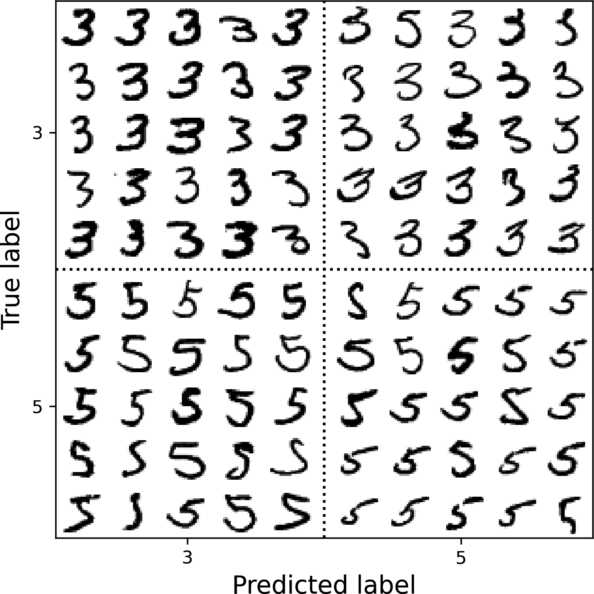

</div>
<div>

教材用真實類別與預測類別排列影像。

- 檢查書寫、位移與旋轉。
- 區分模糊標籤與模型錯誤。
- 提出特徵或前處理假設。
- 擴增資料只從訓練原圖產生。

**完整錯誤分析**：`programs/notebooks/03_分類與模型評估.ipynb`

</div>
</div>

<!-- 講者提示：原圖左上真3預3、右上真3預5、左下真5預3、右下真5預5。多看錯誤只能形成原因假說，改進仍須驗證。先分割原始樣本再做擴增，不能讓原圖與旋轉副本跨訓練和測試。 -->

---
## 多標籤分類：一筆樣本可以同時有多個答案

教材為數字影像建立兩個二元標籤：

| 數字 | 大數字（7、8、9） | 奇數 |
|---|---|---|
| 5 | 否 | 是 |
| 8 | 是 | 否 |
| 9 | 是 | 是 |

每個標籤可各自評估 precision、recall、F1。
這與「十個互斥數字中只能選一個」的多類別任務不同。

<!-- 講者提示：標籤之間可能有關聯，教材介紹ClassifierChain利用先前標籤預測，不在此實作。評估需定義要每個標籤好、平均好，還是整組答案完全正確。 -->

---
## 多輸出：一次預測多個目標

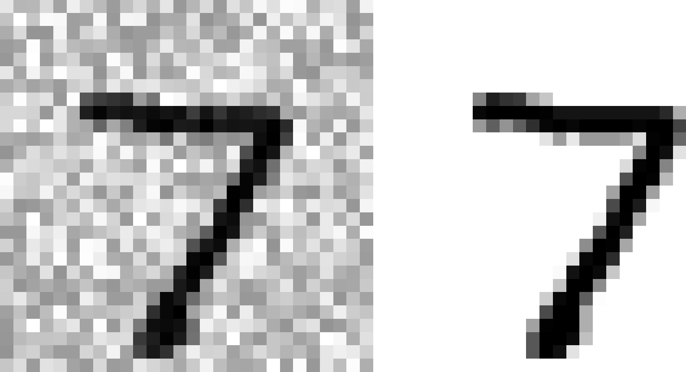

教材以雜訊影像作輸入、乾淨影像作目標，每個像素都是一個輸出。

- 若像素取離散灰階類別，可視為多輸出分類。
- 若直接預測連續強度，也可表述成多輸出迴歸。

<!-- 講者提示：圖為教材去噪示例的輸入與目標，未聲稱本次模型的輸出。教材也承認此例分類與迴歸界線取決於建模方式。要以輸出語意與損失來定義任務。 -->

---
<!-- _class: activity -->

## 活動 H：寫一份有決策依據的分類報告

使用前面的八筆示例。每次 FP 代價為 1，每次 FN 代價為 4。

1. 比較閾值 0.8、0.5、0.2 的總代價。
2. 若每批最多只能人工確認五筆正類預測，哪個設定可行？
3. 選閾值應用哪份資料？最終報告要保留哪些數字？
4. 若部署資料的正類比例下降，precision 可能如何改變？

**產出**：正類定義、混淆矩陣、閾值、指標與限制，各一句。

<!-- 講者提示：3分鐘計算、5分鐘撰寫、4分鐘互評。t0.8代價1+4*2=9，預測正類3；t0.5代價2+4*1=6，預測正類5；t0.2代價3+4*0=3，預測正類7。無容量限制選0.2；最多5筆時在三候選中選0.5。以驗證選閾值，獨立測試報N、類別比例、TP/FP/FN/TN、P/R/F1及業務限制。若TPR/FPR維持且正類比例下降，precision下降。8筆僅教學，不能用來證明部署成效。 -->

---
## 三週回顧：一份可信的機器學習報告

| 問題 | 報告至少要回答 |
|---|---|
| 資料代表誰？ | 觀察單位、時間、分布與限制 |
| 模型如何學？ | 特徵、目標、前處理與正則化 |
| 如何公平比較？ | 基準、訓練／驗證／測試與選擇程序 |
| 分數代表什麼？ | 分母、單位、閾值、錯誤與不確定性 |

後續依主教材 Ch.4 深入線性模型、梯度下降與正則化訓練。

<!-- 講者提示：請學生回到第一週的學習預警任務，說明會如何選擇正類、處理群組與時間、設定閾值。課後交三週整合的一頁設計，而非只交一個accuracy。 -->
