<!-- _class: cover -->
# 線性模型與最佳化

第 4 週｜從閉式解走到梯度下降與多項式模型

<!-- 講者提示：先讓學生說明本頁符號或圖形，再連結前後概念。圖表中的固定結果僅供讀圖，不能當作本班重跑結果。 -->

---
## 今天要能做的三件事

1. 從平方損失的偏微分，推導線性迴歸的閉式解。
2. 用矩陣表示多元迴歸，手算梯度更新並判讀學習率。
3. 用學習曲線區分欠擬合、過擬合與資料不足。

<!-- notebook-companion-link -->
> 💻 **配套 Notebook**：`programs/notebooks/04_線性模型與最佳化.ipynb`。程式片段、實際圖表與表格可由此檔重現。

<!-- 講者提示：Notebook對照：程式 04-01、04-02；見本章 ipynb 首行的程式代碼。先備：向量內積、平方、平均、訓練與驗證集；微分公式會逐步拆解。 -->

---
<!-- _class: small -->
## 本章概念如何串起來？

| 問題 | 方法與檢核 |
|---|---|
| 如何表示預測與誤差？ | 線性模型、殘差與平方損失 |
| 如何找到較佳參數？ | 閉式解、梯度、學習率與批次更新 |
| 如何判讀學習結果？ | 多項式特徵、學習曲線與偏差／變異診斷 |

同一條主線：定義目標函數、求解參數，再以未見資料檢查泛化。

<!-- 講者提示：閉式解與梯度法最小化同一平方損失；比較方法時先固定資料與評估標準。 -->

---
## 簡單線性迴歸：一個特徵預測一個數值

$$\hat y_i=b+wx_i$$

- $x_i$：第 $i$ 筆資料的特徵；$y_i$：觀察到的真實值。
- $\hat y_i$：模型預測；$b$：截距；$w$：斜率。
- $x$ 增加 1 單位，模型的預測值改變 $w$ 單位。

教材例子：生活滿意度 $=b+w\times$ 人均 GDP。

訓練時資料固定，調整 $b,w$ 以改善預測。

<!-- 講者提示：Notebook對照：程式 04-03；見本章 ipynb 首行的程式代碼。先問「要改的是資料，還是直線的參數？」斜率描述模型中的預測關係，不能直接解讀為因果效果。 -->

---
<!-- _class: small -->
## 數學符號：樣本、特徵與參數

| 符號 | 本章約定 |
|---|---|
| $m,\ i=1,\ldots,m$ | 樣本數與樣本索引 |
| $n,\ j=1,\ldots,n$ | 特徵數與特徵索引；$x_{ij}$ 是第 $i$ 筆的第 $j$ 個特徵 |
| $y_i,\hat y_i$ | 真實值與預測值；粗體 $\mathbf y,\hat{\mathbf y}$ 集合所有樣本 |
| $b,w_j$ | 截距與第 $j$ 個特徵的權重；單一特徵時簡寫為 $w$ |
| $\theta_0=b,\ \theta_j=w_j$ | $\boldsymbol\theta=(b,w_1,\ldots,w_n)^\top$ 是參數向量 |
| $k,\eta$ | 第 $k$ 次更新與學習率；$\boldsymbol\theta^{(k)}$ 的上標不是次方 |

帶帽的 $\hat{\boldsymbol\theta}$ 表示求得的最小平方解。

<!-- 講者提示：請學生指出 x_23 是哪一筆、哪一個特徵。參數向量長度為 n+1，因為包含截距。樣本統一下標 i、特徵下標 j；第 03 章的 t 保留作分類閾值，本章用 k 表示更新次數。 -->

---
<!-- _class: small -->
## 多元線性迴歸：特徵加權與矩陣表示

$$\hat y_i=b+\sum_{j=1}^{n}w_jx_{ij}
=\tilde{\mathbf x}_i^\top\boldsymbol\theta,
\qquad\tilde{\mathbf x}_i=(1,x_{i1},\ldots,x_{in})^\top$$

$$X=\begin{bmatrix}
1&x_{11}&\cdots&x_{1n}\\
\vdots&\vdots&&\vdots\\
1&x_{m1}&\cdots&x_{mn}
\end{bmatrix},\qquad\hat{\mathbf y}=X\boldsymbol\theta$$

$X$ 為 $m\times(n+1)$，$\boldsymbol\theta$ 為 $(n+1)\times1$，$\hat{\mathbf y}$ 為 $m\times1$。

每列是一筆樣本；首欄的 1 配合截距。多元迴歸以多個特徵預測**一個目標**。

<!-- 講者提示：Notebook對照：程式 04-03、04-08；見本章 ipynb 首行的程式代碼。先讀一列，再讀整個矩陣。原始特徵向量 x_i 不含截距，波浪號表示補入常數 1；定義 x_i0=1，之後 theta_0 的公式也可共用。X 在本章數學式均已包含全 1 欄，scikit-learn 程式會另行說明。本頁採用與正規方程維度一致的矩陣表示。 -->

---
## 訓練目標：讓所有殘差的平方平均最小

$$r_i=\hat y_i-y_i,\qquad
J(\boldsymbol\theta)=\operatorname{MSE}=\frac1m\sum_{i=1}^m r_i^2$$

$$J(\boldsymbol\theta)=\frac1m\|X\boldsymbol\theta-\mathbf y\|_2^2$$

殘差有正有負；平方使它們不互相抵銷，也會放大極端誤差。

本章殘差採「預測減真實」；$\operatorname{SSE}=mJ$，且 $J$ **沒有乘 $1/2$**。

<!-- 講者提示：Notebook對照：程式 04-03、04-06；見本章 ipynb 首行的程式代碼。統計教材也常定義殘差為真實減預測，平方損失相同，但微分必須保持符號一致。對固定資料且無正則化的最小平方問題，SSE、MSE 與半 MSE 的最小值位置相同，梯度尺度不同，使用同一學習率時步幅不同。訓練損失仍須搭配獨立評估。 -->

---
<!-- _class: figure -->
## 教材例子：帶有雜訊的直線資料

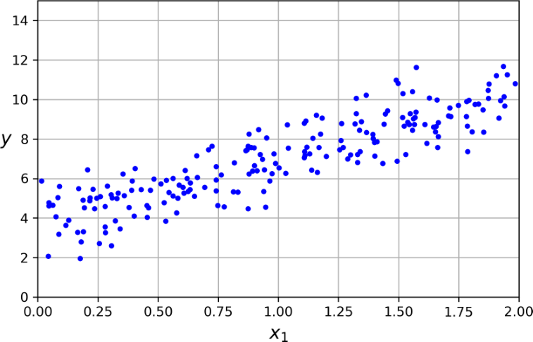

資料生成規則是 $y=4+3x+\text{noise}$；觀測點不會全部落在真實直線上。

<!-- 講者提示：Notebook對照：程式 04-04、04-03；見本章 ipynb 首行的程式代碼。圖例與固定玩具例依各頁標示的資料與輸入解讀。先讓學生說明本頁符號或圖形，再連結前後概念。圖表中的固定結果僅供讀圖，不能當作本班重跑結果。 -->

---
## 導數與偏導數：參數改變時，損失怎麼變？

$$f'(a)=\lim_{h\to0}\frac{f(a+h)-f(a)}{h}$$

導數描述局部斜率。$J(b,w)$ 有兩個參數，偏微分時固定另一個參數。

平方的微分要乘上內部函數的導數，這是**連鎖律**：

$$\frac{d}{du}[g(u)]^2=2g(u)g'(u)$$

例：$f(u)=(u-3)^2$，則 $f'(u)=2(u-3)$，所以 $f'(1)=-4$。

<!-- 講者提示：Notebook對照：程式 04-07；見本章 ipynb 首行的程式代碼。以割線逼近切線解釋極限，不要求證明極限定義。問 f'(1) 為負時，稍微增加 u 會使 f 增大或減小？答案減小。此處微分變數是參數，訓練資料視為常數。 -->

---
<!-- _class: small -->
## 平方損失的偏微分：截距與斜率

簡單迴歸中，$r_i=b+wx_i-y_i$，$J(b,w)=\frac1m\sum_i r_i^2$。

$$\begin{aligned}
\frac{\partial J}{\partial b}
&=\frac1m\sum_{i=1}^m 2r_i\frac{\partial r_i}{\partial b}
=\frac2m\sum_{i=1}^m r_i\\[6pt]
\frac{\partial J}{\partial w}
&=\frac1m\sum_{i=1}^m 2r_i\frac{\partial r_i}{\partial w}
=\frac2m\sum_{i=1}^m r_ix_i
\end{aligned}$$

因為 $\dfrac{\partial r_i}{\partial b}=1$，而 $\dfrac{\partial r_i}{\partial w}=x_i$。

**檢查：$r_i>0$ 表示高估還是低估？這一筆對截距梯度貢獻什麼符號？**

<!-- 講者提示：Notebook對照：程式 04-07；見本章 ipynb 首行的程式代碼。答案為高估、正號；往負梯度方向會降低截距。逐一指出平方帶出 2、內部函數帶出 1 或 x_i、平均帶出 1/m。若採 y-wx-b，對 b 微分必須帶負號；此處以 r_i=預測減真實統一推導。 -->

---
<!-- _class: small -->
## 簡單迴歸的閉式解：偏導數設為零

定義 $\bar x=\frac1m\sum_i x_i$、$\bar y=\frac1m\sum_i y_i$。

$$0=\sum_i(\hat b+\hat w x_i-y_i)
\quad\Longrightarrow\quad\hat b=\bar y-\hat w\bar x$$

代回斜率條件 $\sum_i x_i(\hat b+\hat w x_i-y_i)=0$：

$$0=\hat w\sum_i(x_i-\bar x)^2-\sum_i(x_i-\bar x)(y_i-\bar y)$$

$$\boxed{\hat w=\frac{\sum_i(x_i-\bar x)(y_i-\bar y)}{\sum_i(x_i-\bar x)^2}},
\qquad\boxed{\hat b=\bar y-\hat w\bar x}$$

$x_i$ 必須有變化，分母才大於零；配適直線通過 $(\bar x,\bar y)$。

<!-- 講者提示：Notebook對照：程式 04-07；見本章 ipynb 首行的程式代碼。先由 m b+w sum x-sum y=0 導出截距，再代回斜率條件。利用 sum(x_i-xbar)=sum(y_i-ybar)=0 化成置中形式，完整展開見末尾延伸閱讀。若 x 皆相同，截距與斜率無法各自唯一決定。平方損失為凸函數，本題的駐點是全域最小值。 -->

---
## 多元迴歸的偏導數：每個權重各算一次

$$r_i=b+\sum_{j=1}^n w_jx_{ij}-y_i,\qquad
\frac{\partial r_i}{\partial w_j}=x_{ij}$$

$$\frac{\partial J}{\partial w_j}
=\frac1m\sum_{i=1}^m 2r_i\frac{\partial r_i}{\partial w_j}
=\frac2m\sum_{i=1}^m r_ix_{ij}$$

截距令 $x_{i0}=1$、$\theta_0=b$；其餘 $\theta_j=w_j$。

把所有偏導數排成向量，就是梯度 $\nabla_{\boldsymbol\theta}J$。

<!-- 講者提示：Notebook對照：程式 04-08；見本章 ipynb 首行的程式代碼。固定其他權重，只看第 j 個權重改變時的影響。梯度有 n+1 個分量，包含截距。本頁補上連鎖律，再進入正規方程。 -->

---
<!-- _class: small -->
## 多元迴歸的平方損失與梯度

$$\begin{aligned}
J(\boldsymbol\theta)
&=\frac1m(X\boldsymbol\theta-\mathbf y)^\top(X\boldsymbol\theta-\mathbf y)\\
&=\frac1m\left(\boldsymbol\theta^\top X^\top X\boldsymbol\theta
-2\boldsymbol\theta^\top X^\top\mathbf y+\mathbf y^\top\mathbf y\right)
\end{aligned}$$

$X^\top X$ 是對稱矩陣；三項對參數微分分別為：

$$\nabla_{\boldsymbol\theta}J
=\frac1m\left(2X^\top X\boldsymbol\theta-2X^\top\mathbf y+\mathbf0\right)
=\frac2mX^\top(X\boldsymbol\theta-\mathbf y)$$

第 $j$ 個分量正是上一頁的 $\frac2m\sum_i r_ix_{ij}$。

<!-- 講者提示：Notebook對照：程式 04-08；見本章 ipynb 首行的程式代碼。先對照 (a-b)^2 的展開，再解釋兩個交叉項是相等的純量。對稱 A 滿足梯度 (theta^T A theta)=2A theta，線性項梯度是其係數，y^T y 不含參數所以為零。不熟矩陣微分者可直接用上一頁逐分量結果驗證，不要求死背規則。矩陣方向與本章 MSE 的 1/m 保持一致。 -->

---
## 從「梯度為零」得到正規方程

$$\nabla J(\hat{\boldsymbol\theta})=\mathbf0
\quad\Longrightarrow\quad
X^\top(X\hat{\boldsymbol\theta}-\mathbf y)=\mathbf0$$

$$\boxed{X^\top X\hat{\boldsymbol\theta}=X^\top\mathbf y}$$

若 $X$ 的欄彼此線性獨立，可寫成：

$$\hat{\boldsymbol\theta}=(X^\top X)^{-1}X^\top\mathbf y$$

線性迴歸的 MSE 為凸函數；滿欄秩時，最小平方解唯一。

<!-- 講者提示：Notebook對照：程式 04-03；見本章 ipynb 首行的程式代碼。正規方程在秩不足時仍成立，但反矩陣形式不能使用。先前簡單迴歸是 n=1 的特例。閉式解與梯度下降是在求解同一個最小平方目標；最小平方法指目標，並不專指反矩陣求解。一般程式優先用最小平方求解器。 -->

---
<!-- _class: figure -->
## 估計直線與資料生成直線不是同一條

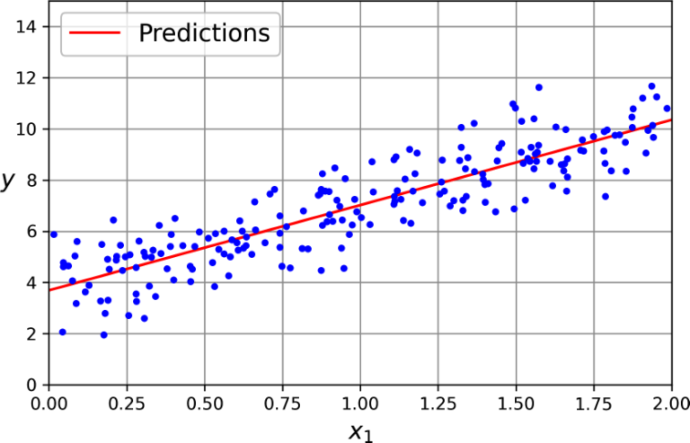

教材估計截距約 3.691、斜率約 3.330；有限樣本與雜訊會造成差異。

<!-- 講者提示：Notebook對照：程式 04-04、04-03；見本章 ipynb 首行的程式代碼。圖例與固定玩具例依各頁標示的資料與輸入解讀。先讓學生說明本頁符號或圖形，再連結前後概念。圖表中的固定結果僅供讀圖，不能當作本班重跑結果。 -->

---
## SVD 與偽反矩陣：處理共線與非方陣

$$X=U\Sigma V^\top,\qquad X^+=V\Sigma^+U^\top$$

$$\hat{\boldsymbol\theta}=X^+\mathbf y$$

把非零奇異值取倒數，近零值按數值容忍度處理。偽反矩陣可給出最小範數的最小平方解。

<!-- 講者提示：Notebook對照：程式 04-03、04-05；見本章 ipynb 首行的程式代碼。如果有多組參數同樣達到最小誤差，最小範數解是其中一組；不代表資料突然能識別每個係數。 -->

---
<!-- _class: small -->
## 程式：避免自己計算反矩陣

```python
import numpy as np
from sklearn.linear_model import LinearRegression
X = np.array([[0.], [1.], [2.]])
y = np.array([1., 3., 5.])
model = LinearRegression().fit(X, y)
print(model.intercept_, model.coef_)  # 1, [2]
print(model.predict([[3.]]))          # [7]
```

<!-- 講者提示：Notebook對照：程式 04-03；見本章 ipynb 首行的程式代碼。本程式中的X只放原始特徵，與前面數學式含常數欄的X不同。LinearRegression預設自己處理截距，不要再手動補一欄1。用三點案例驗算前面的閉式解，所得截距1、斜率2。 -->

---
<!-- _class: small -->
## 延伸閱讀：計算成本與資料維度

| 工作 | 主要影響 | 實務判斷 |
| --- | --- | --- |
| 形成與求解正規方程 | 約 $O(mn^2+n^3)$ | 特徵很多時昂貴 |
| SVD 最小平方 | 常見稠密情況約 $O(mn^2)$（$m\ge n$） | 數值穩健，仍受維度影響 |
| 對新資料預測 | 約 $O(mn)$ | 與訓練方法無關 |

<!-- 講者提示：這是忽略截距的量級描述；矩陣形狀、稀疏性、求解器會改變成本。可對照後續手算與實作的規模差異。 -->

---
<!-- _class: activity -->
## 手算：三個點能決定哪一條線？

資料為 $(0,1),(1,3),(2,5)$。

1. 寫出含截距的 $X$ 與 $\mathbf y$，用閉式解算 $\hat b,\hat w$。
2. 試算 $\boldsymbol\theta=(1,2)^\top$ 與 $(0,2)^\top$ 的 MSE。
3. 若新增特徵 $x_2=2x_1$，還能唯一決定兩個斜率嗎？

<!-- 講者提示：Notebook對照：程式 04-06；見本章 ipynb 首行的程式代碼。答案：X三列為[1,0]、[1,1]、[1,2]；xbar=1、ybar=3，斜率的分子4、分母2，w=2、b=1；兩者MSE為0、1。共線後只有w1+2w2=2能被決定，兩個係數不唯一。請留下X、參數與MSE三項計算作為檢核。 -->

---
<!-- _class: activity -->
## 閉式解與梯度下降如何銜接？

給定三筆資料 $(x,y)=(0,1),(1,3),(2,5)$：

- 最小平方解為 $\hat y=1+2x$，三筆殘差都是 $0$，所以 MSE 為 $0$。
- 若新增 $x_2=2x_1$，則只可確定 $w_1+2w_2=2$；係數不唯一。
- 梯度下降可找使 MSE 下降的參數；有完全共線特徵時，也不會憑空產生唯一係數。

<!-- 講者提示：先讓學生獨立檢核本頁的假設、公式與結論，再與相鄰的模型概念對照。 -->

---
<!-- _class: figure -->
## 梯度下降：根據目前斜率移動參數


參數位置決定損失；梯度指出上升最快方向，更新走向反方向。

<!-- 講者提示：Notebook對照：程式 04-10、04-09；見本章 ipynb 首行的程式代碼。圖例與固定玩具例依各頁標示的資料與輸入解讀。此處橫向位置代表參數，縱向代表損失。單一參數時，導數為正就稍微減少參數，導數為負就稍微增加參數。可用前面的 f(u)=(u-3)^2、u=1 檢查方向。這是局部方向，步長太大仍可能增加損失；一階近似說明見末尾延伸閱讀。 -->

---
<!-- _class: small -->
## 梯度更新：同一組更新前參數，同步調整

第 $k$ 步先算殘差 $r_i^{(k)}=b^{(k)}+w^{(k)}x_i-y_i$：

$$\begin{aligned}
b^{(k+1)}&=b^{(k)}-\eta\frac2m\sum_i r_i^{(k)}\\
w^{(k+1)}&=w^{(k)}-\eta\frac2m\sum_i r_i^{(k)}x_i
\end{aligned}$$

多元迴歸將所有參數合併成一次向量更新：

$$\boldsymbol\theta^{(k+1)}=\boldsymbol\theta^{(k)}
-\eta\frac2mX^\top\left(X\boldsymbol\theta^{(k)}-\mathbf y\right)$$

梯度決定局部方向與斜率，$\eta>0$ 控制步幅；本式每步使用全部訓練資料。

<!-- 講者提示：Notebook對照：程式 04-09、04-13、04-14；見本章 ipynb 首行的程式代碼。兩個更新式都使用更新前同一組 b、w，不可先改 b，再用新 b 計算 w 的梯度。Batch GD 中的 batch 在此指全部 m 筆資料。連結程式 theta -= eta * gradient，提醒學習率與參數初值是不同設定；線性 MSE 也可從零初始化。本章以 k 表示迭代索引。 -->

---
<!-- _class: figure -->
## 學習率太小：方向對，卻走得很慢

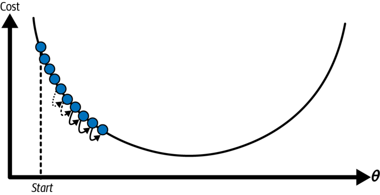

每一步的改善很有限；固定迭代次數下，可能還沒有接近最低點。

<!-- 講者提示：Notebook對照：程式 04-10、04-09；見本章 ipynb 首行的程式代碼。圖例與固定玩具例依各頁標示的資料與輸入解讀。先讓學生說明本頁符號或圖形，再連結前後概念。圖表中的固定結果僅供讀圖，不能當作本班重跑結果。 -->

---
<!-- _class: figure -->
## 學習率太大：可能越走越遠

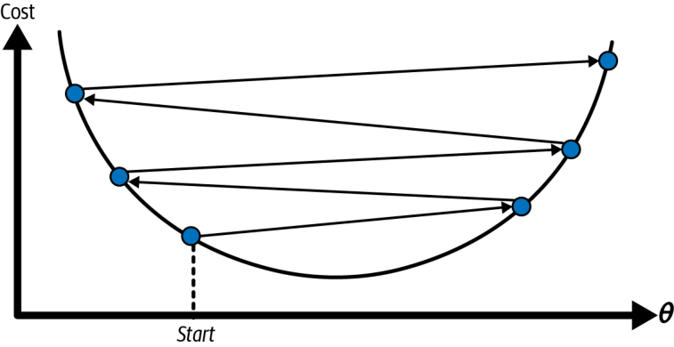

跨過谷底並不必然失敗；振盪幅度持續增大才是發散的重要訊號。

<!-- 講者提示：Notebook對照：程式 04-10、04-09；見本章 ipynb 首行的程式代碼。圖例與固定玩具例依各頁標示的資料與輸入解讀。先讓學生說明本頁符號或圖形，再連結前後概念。圖表中的固定結果僅供讀圖，不能當作本班重跑結果。 -->

---
<!-- _class: figure -->
## 一般損失曲面可能有局部低點與平臺

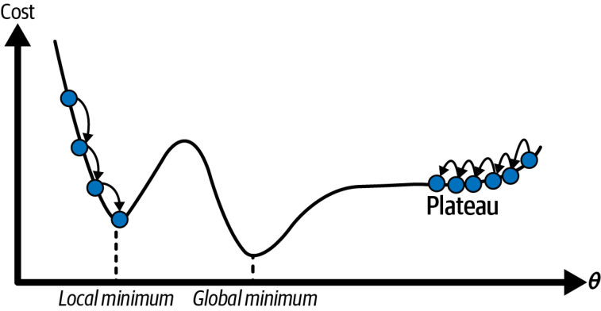

線性迴歸的 MSE 是凸函數；不要把本圖的非凸困難直接套到線性 MSE。

<!-- 講者提示：Notebook對照：程式 04-10；見本章 ipynb 首行的程式代碼。圖例與固定玩具例依各頁標示的資料與輸入解讀。秩不足時凸函數可有整片最小值。神經網路稍後才會遇到非凸問題。 -->

---
<!-- _class: figure -->
## 特徵尺度不同，會把等高線拉長

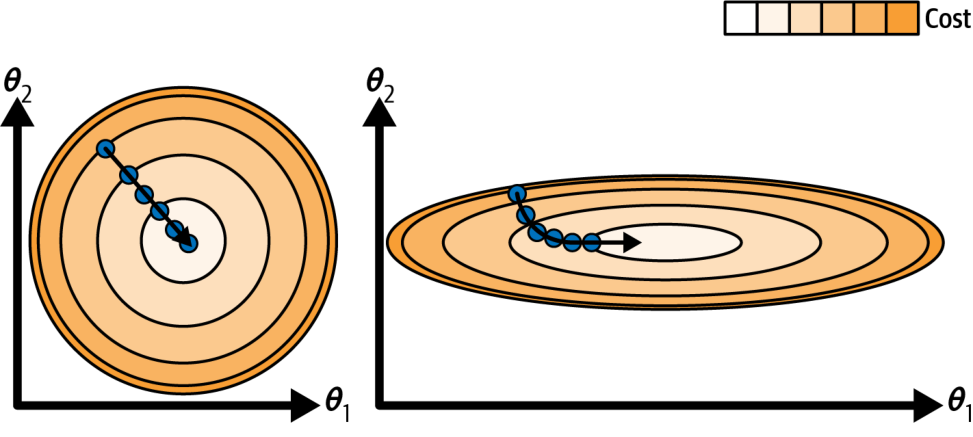

標準化常使更新路徑更有效率；縮放參數只從訓練資料估計。

<!-- 講者提示：Notebook對照：程式 04-11；見本章 ipynb 首行的程式代碼。圖例與固定玩具例依各頁標示的資料與輸入解讀。先讓學生說明本頁符號或圖形，再連結前後概念。圖表中的固定結果僅供讀圖，不能當作本班重跑結果。 -->

---
<!-- _class: activity -->
## 手算一次更新，檢查損失是否下降

令 $X=\begin{bmatrix}1&0\\1&1\end{bmatrix}$、$\mathbf y=(1,3)^\top$、$\boldsymbol\theta^{(0)}=(0,0)^\top$。

1. 計算殘差與梯度。
2. 設 $\eta=0.1$，更新參數。
3. 比較更新前、後的 MSE。

**繳交：殘差、梯度、新參數、兩次 MSE，並說明更新方向。**

<!-- 講者提示：Notebook對照：程式 04-13；見本章 ipynb 首行的程式代碼。先不揭示下一頁；若方向錯誤，請查殘差採預測減真實、梯度前的2/m與更新的負號。可加問：下降一次能否證明已找到最低點？不能。 -->

---
<!-- _class: small -->
## 手算解答：從殘差到新的預測

$$\mathbf r^{(0)}=X\boldsymbol\theta^{(0)}-\mathbf y
=\begin{bmatrix}-1\\-3\end{bmatrix},\qquad
\nabla J(\boldsymbol\theta^{(0)})
=\begin{bmatrix}1&1\\0&1\end{bmatrix}
\begin{bmatrix}-1\\-3\end{bmatrix}
=\begin{bmatrix}-4\\-3\end{bmatrix}$$

$$\boldsymbol\theta^{(1)}=
\begin{bmatrix}0\\0\end{bmatrix}-0.1\begin{bmatrix}-4\\-3\end{bmatrix}
=\begin{bmatrix}0.4\\0.3\end{bmatrix},\qquad
\hat{\mathbf y}^{(1)}=\begin{bmatrix}0.4\\0.7\end{bmatrix}$$

$$J(\boldsymbol\theta^{(0)})=\frac{1+9}{2}=5,\qquad
J(\boldsymbol\theta^{(1)})=\frac{(-0.6)^2+(-2.3)^2}{2}=2.825$$

這一步損失下降；梯度尚未為零，仍可繼續更新。

<!-- 講者提示：Notebook對照：程式 04-13；見本章 ipynb 首行的程式代碼。此例m=2，所以2/m=1。逐筆檢查新預測為0.4+0.3乘以x；兩筆仍低估，新的梯度為(-2.9,-2.3)。請學生對照純量公式得到同樣的b、w，確認矩陣只是把各筆貢獻集中計算。這是自編手算例，非模型實驗成效。 -->

---
<!-- _class: figure -->
## 同一資料，不同學習率的更新軌跡

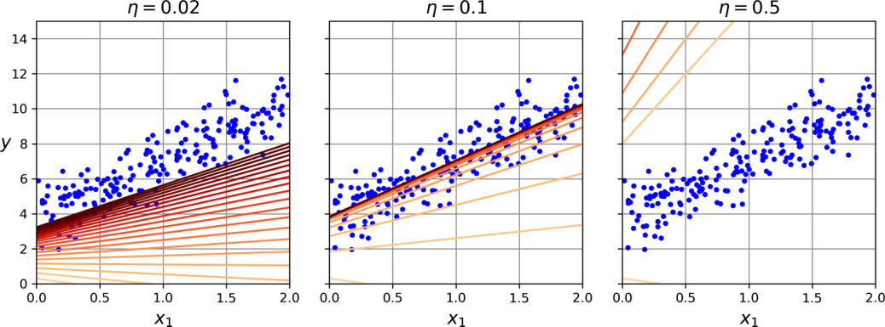

比較左、中、右的收斂速度與穩定性；一次走得遠不等於更快收斂。

**先預測**：固定資料與初值，學習率太小、適中、太大時，訓練 MSE 曲線各會如何變化？

<!-- 講者提示：Notebook對照：程式 04-12；見本章 ipynb 首行的程式代碼。圖例與固定玩具例依各頁標示的資料與輸入解讀。先讓學生說明本頁符號或圖形，再連結前後概念。圖表中的固定結果僅供讀圖，不能當作本班重跑結果。 -->

---

<!-- _class: small -->
## 用損失曲線核對學習率的收斂情形

<div class="columns wide-left">
<div>

固定 120 筆合成資料、特徵標準化、零初值與 60 次更新，只改學習率。

```python
for eta in (0.02, 0.30, 1.05):
    theta, loss = batch_gd(Z, y, eta)
```

橫軸為更新次數，縱軸為訓練 MSE（對數尺度）。本例 0.30 很快下降，0.02 較慢，1.05 持續增大。

這些數值只適用本例的資料尺度與損失；收斂不等於泛化良好。

參考程式：`programs/notebooks/04_線性模型與最佳化.ipynb`

</div>
<div>

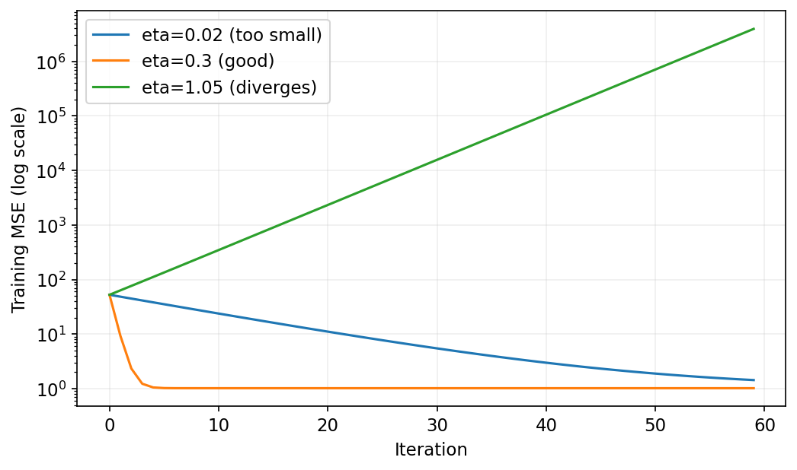

</div>
</div>

<!-- 講者提示：Z 是訓練特徵標準化後再加截距欄的矩陣；batch_gd 定義及完整迴圈見 04-09，每次梯度為 (2/m)Z.T@(Z@theta-y)。圖記錄各次更新前的 MSE。先讓學生用前面的更新軌跡預測曲線，再對照既有輸出，不能將 eta=0.30 推成所有任務的建議值。 -->

<!-- Notebook 對照：程式 04-03、04-09；以程式代碼定位配套 Notebook。 -->

---
<!-- _class: figure -->
## 隨機梯度：以一筆資料估計下降方向


每步便宜、帶有雜訊；即使接近最低點，固定學習率仍可能持續晃動。

<!-- 講者提示：Notebook對照：程式 04-16、04-15；見本章 ipynb 首行的程式代碼。圖例與固定玩具例依各頁標示的資料與輸入解讀。先讓學生說明本頁符號或圖形，再連結前後概念。圖表中的固定結果僅供讀圖，不能當作本班重跑結果。 -->

---
## SGD 的學習率可逐步衰減

$$\mathbf g^{(k)}=2\tilde{\mathbf x}_{i_k}
\left(\tilde{\mathbf x}_{i_k}^\top\boldsymbol\theta^{(k)}-y_{i_k}\right),
\qquad\eta_k=\frac{a}{k+c}$$

$i_k$ 是這一步選到的樣本，$k$ 是累計更新次數；$a,c>0$ 控制衰減。

先用較大步伐探索，後期用較小步伐穩定參數。每個 epoch 重新打亂資料，避免固定排序偏差。

<!-- 講者提示：Notebook對照：程式 04-15；見本章 ipynb 首行的程式代碼。單筆梯度保留平方微分的 2；若均勻抽樣，其期望等於全資料 MSE 梯度。實作常在每個 epoch 先洗牌再走過各筆，因此需區分隨機洗牌與每步獨立抽樣。k 跨 epoch 累計，不要每輪重設學習率。mini-batch 則取當批 B_k 的平均梯度：2/|B_k| 乘上各筆 tilde x_i r_i 的總和；最後不足整批時依實際筆數平均。 -->

---
<!-- _class: figure -->
## SGD 的前幾步：單筆改善不等於整體改善

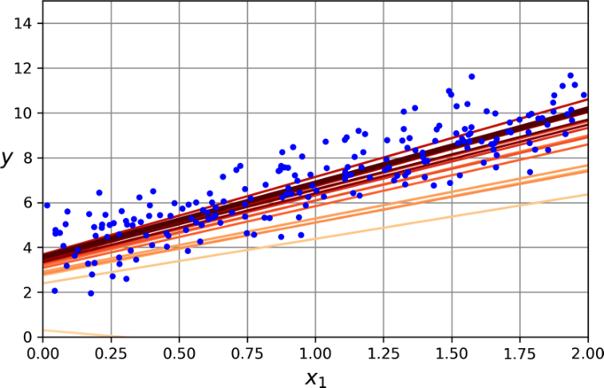

看整體損失趨勢，不要求每一步對全部樣本都變好。

<!-- 講者提示：Notebook對照：程式 04-16；見本章 ipynb 首行的程式代碼。圖例與固定玩具例依各頁標示的資料與輸入解讀。先讓學生說明本頁符號或圖形，再連結前後概念。圖表中的固定結果僅供讀圖，不能當作本班重跑結果。 -->

---
<!-- _class: figure -->
## Batch、SGD 與 Mini-batch 的路徑比較

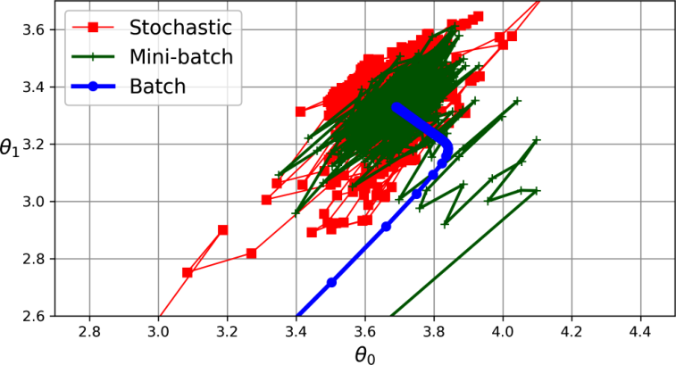

Mini-batch 在梯度雜訊與硬體效率間折衷；批次大小也會影響合適的學習率。

<!-- 講者提示：Notebook對照：程式 04-15、04-16；見本章 ipynb 首行的程式代碼。圖例與固定玩具例依各頁標示的資料與輸入解讀。先讓學生說明本頁符號或圖形，再連結前後概念。圖表中的固定結果僅供讀圖，不能當作本班重跑結果。 -->

---
<!-- _class: activity -->
## Batch、SGD、Mini-batch 怎麼選？

三者都沿同一個訓練目標更新參數，差別在每次估計梯度使用的樣本數：

| 方法 | 單次梯度資料 | 常見取捨 |
|---|---|---|
| Batch | 全部樣本 | 方向穩定，但單次更新較慢 |
| SGD | 一筆樣本 | 更新頻繁，梯度雜訊較大 |
| Mini-batch | 一小批樣本 | 計算效率與梯度穩定度折衷 |

比較時先固定資料切分、特徵縮放與評估指標。

<!-- 講者提示：先讓學生獨立檢核本頁的假設、公式與結論，再與相鄰的模型概念對照。 -->

---
<!-- _class: small -->
## 表 4-1：資料規模與可用訓練方式

| 方法 | 大樣本 m | 記憶體外 | 高維 n |
| --- | --- | --- | --- |
| 正規方程 | 快 | 不適合 | 慢 |
| SVD | 快 | 不適合 | 慢 |
| Batch GD | 慢 | 不適合 | 快 |
| SGD | 快 | 可 | 快 |
| Mini-batch GD | 快 | 可 | 快 |

<!-- 講者提示：Notebook對照：程式 04-15、04-17；見本章 ipynb 首行的程式代碼。快慢是教材相對比較；out-of-core 必須配合串流載入與增量前處理。 -->

---
<!-- _class: small -->
## 表 4-1：超參數、縮放與實作

| 方法 | 超參數數量 | 需要縮放 | 教材對應類別 |
| --- | --- | --- | --- |
| 正規方程 | 0 | 否 | 自行求解 |
| SVD | 0 | 否 | LinearRegression |
| Batch GD | 2 | 是 | 自行迭代 |
| SGD | 至少 2 | 是 | SGDRegressor |
| Mini-batch GD | 至少 2 | 是 | 自行迭代 |

<!-- 講者提示：Notebook對照：程式 04-15、04-17；見本章 ipynb 首行的程式代碼。2 指學習率與迭代控制等典型設定；不是 API 的全部參數數目。縮放「需要」是改善最佳化的實務需求。 -->

---
## fit、partial_fit 與 epoch 的差別

- `fit`：按估計器的訓練流程執行；不要假定重複呼叫會保留狀態。
- `partial_fit`：使用這次提供的資料繼續增量更新。
- epoch：走過訓練集一次；iteration：可能指一步或一次批次。
- 資料太大時，把縮放與分批讀取一起規劃。

<!-- 講者提示：Notebook對照：程式 04-17；見本章 ipynb 首行的程式代碼。先讓學生說明本頁符號或圖形，再連結前後概念。圖表中的固定結果僅供讀圖，不能當作本班重跑結果。 -->

---
<!-- _class: figure -->
## 資料是彎曲的，直線可能系統性失準

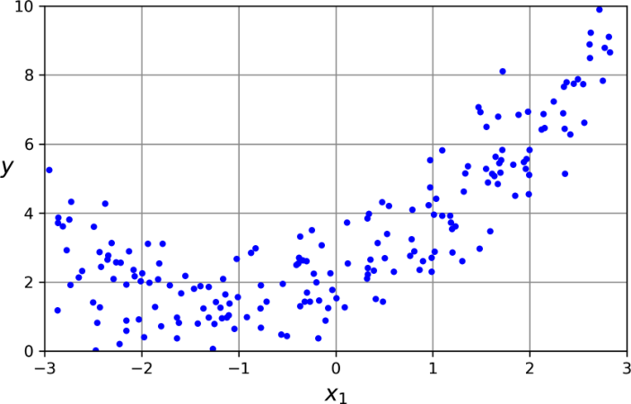

先考慮模型表達能力；把學習率調得更細，無法讓直線變成拋物線。

<!-- 講者提示：Notebook對照：程式 04-19、04-18；見本章 ipynb 首行的程式代碼。圖例與固定玩具例依各頁標示的資料與輸入解讀。先讓學生說明本頁符號或圖形，再連結前後概念。圖表中的固定結果僅供讀圖，不能當作本班重跑結果。 -->

---
<!-- _class: figure -->
## 多項式迴歸：先轉換特徵，再用線性模型

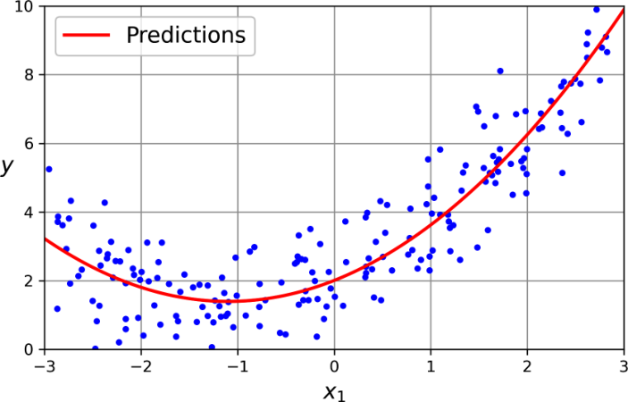

加入 $x^2$ 後，$\hat y=b+w_1x+w_2x^2$ 仍對參數呈線性。

<!-- 講者提示：Notebook對照：程式 04-19、04-18；見本章 ipynb 首行的程式代碼。圖例與固定玩具例依各頁標示的資料與輸入解讀。先讓學生說明本頁符號或圖形，再連結前後概念。圖表中的固定結果僅供讀圖，不能當作本班重跑結果。 -->

---
<!-- _class: small -->
## 多項式特徵也包含交互作用

兩個特徵做二次展開：$[x_1,x_2,x_1^2,x_1x_2,x_2^2]$。

```python
from sklearn.pipeline import make_pipeline
from sklearn.preprocessing import PolynomialFeatures, StandardScaler
poly = make_pipeline(PolynomialFeatures(2, include_bias=False),
                     StandardScaler(), LinearRegression())
```

維度與次數增加時，組合數成長很快。

<!-- 講者提示：Notebook對照：程式 04-19；見本章 ipynb 首行的程式代碼。先讓學生說明本頁符號或圖形，再連結前後概念。圖表中的固定結果僅供讀圖，不能當作本班重跑結果。 -->

---
<!-- _class: figure -->
## 模型階數：太簡單與太靈活的兩端

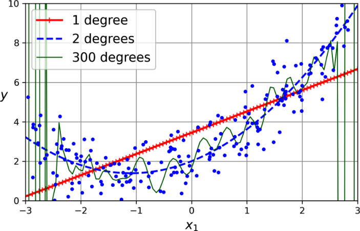

高次模型可緊貼訓練點，卻可能在點與點之間劇烈波動。

<!-- 講者提示：Notebook對照：程式 04-19、04-18；見本章 ipynb 首行的程式代碼。圖例與固定玩具例依各頁標示的資料與輸入解讀。先讓學生說明本頁符號或圖形，再連結前後概念。圖表中的固定結果僅供讀圖，不能當作本班重跑結果。 -->

---
<!-- _class: figure -->
## 學習曲線：訓練與驗證誤差都偏高

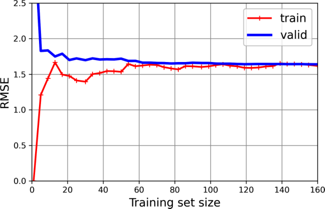

增加資料後仍停在相近高誤差：先檢查欠擬合，而非只蒐集更多資料。

<!-- 講者提示：Notebook對照：程式 04-18；見本章 ipynb 首行的程式代碼。圖例與固定玩具例依各頁標示的資料與輸入解讀。先讓學生說明本頁符號或圖形，再連結前後概念。圖表中的固定結果僅供讀圖，不能當作本班重跑結果。 -->

---
<!-- _class: figure -->
## 學習曲線：訓練很好，驗證落後

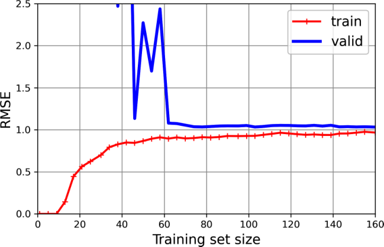

兩曲線有明顯差距時，可考慮更多資料、正則化或降低模型複雜度。

<!-- 講者提示：Notebook對照：程式 04-18；見本章 ipynb 首行的程式代碼。圖例與固定玩具例依各頁標示的資料與輸入解讀。先讓學生說明本頁符號或圖形，再連結前後概念。圖表中的固定結果僅供讀圖，不能當作本班重跑結果。 -->

---
<!-- _class: figure -->
## 偏差與變異：重複抽樣後會看到什麼？

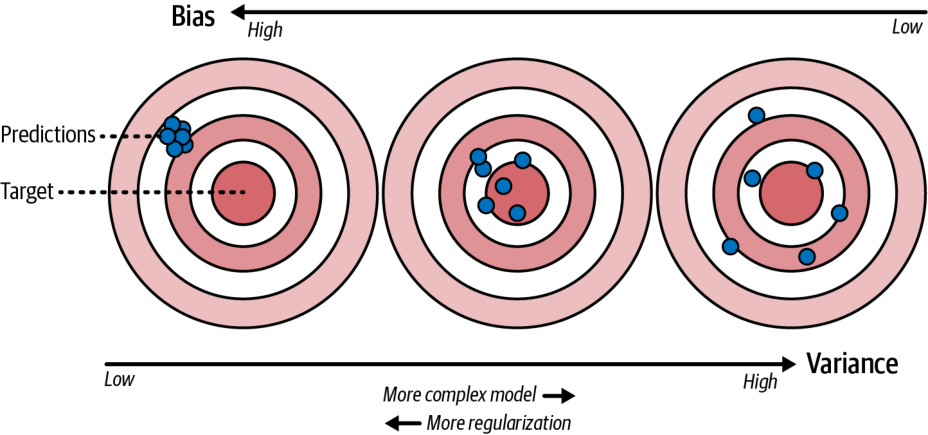

偏差關於平均預測偏離；變異關於不同訓練集的預測波動。

<!-- 講者提示：Notebook對照：程式 04-20；見本章 ipynb 首行的程式代碼。圖例與固定玩具例依各頁標示的資料與輸入解讀。平方誤差的偏差平方＋變異＋不可約雜訊分解需指定資料生成與期望；本圖為直覺，不是單次誤差的拆帳。 -->

---
<!-- _class: activity -->
## 診斷工作單：下一步該改什麼？

A：訓練 RMSE=8、驗證=8.5，資料增加後都不改善。

B：訓練 RMSE=1、驗證=9；加資料後差距縮小。

各提出一個主要假設、一個驗證方法與一個調整；不要只寫「調參」。

<!-- 講者提示：Notebook對照：程式 04-18；見本章 ipynb 首行的程式代碼。A 優先查欠擬合、特徵不足或雜訊，試更適合的特徵／模型並用 CV 比較。B 優先查高變異，試正則化或更多資料；也應檢查資料分布與洩漏。 -->

---
## 離堂檢核與課後延伸

1. MSE 的偏導數中，$2/m$ 與 $x_{ij}$ 各從哪裡來？
2. 閉式解與梯度下降求解什麼目標？共線時解是否唯一？
3. 梯度與學習率各負責什麼？多項式迴歸為何仍是線性模型？

課後：主教材 Ch.4 練習 1–6；延伸比較 SVD 與 SGD 的適用情境。

下一個進度：`05_正則化與機率分類`

<!-- 講者提示：答案：平方微分與平均帶出2/m，內部線性函數的導數帶出特徵值；兩種方法都最小化同一個MSE，共線時係數可能不唯一；梯度描述局部變化，eta決定步幅，多項式仍對未知係數線性。作業要求畫一張自己的學習曲線並解釋。 -->

---
<!-- _class: small -->
## 延伸閱讀：閉式解中的置中求和

利用 $\sum_i x_i=m\bar x$、$\sum_i y_i=m\bar y$：

$$\begin{aligned}
\sum_i(x_i-\bar x)(y_i-\bar y)
&=\sum_i x_iy_i-\bar x\sum_i y_i-\bar y\sum_i x_i+m\bar x\bar y\\
&=\sum_i x_iy_i-m\bar x\bar y\\[6pt]
\sum_i(x_i-\bar x)^2
&=\sum_i x_i^2-2\bar x\sum_i x_i+m\bar x^2\\
&=\sum_i x_i^2-m\bar x^2
\end{aligned}$$

因此 $\hat w=\dfrac{\sum_i x_iy_i-m\bar x\bar y}{\sum_i x_i^2-m\bar x^2}$，等於課堂上的置中形式。

<!-- 講者提示：Notebook對照：程式 04-07；見本章 ipynb 首行的程式代碼。課後閱讀。先從斜率條件 sum x_i(b+w x_i-y_i)=0，代入 b=ybar-w xbar，得到 w(sum x_i^2-m xbar^2)=sum x_i y_i-m xbar ybar，再用本頁兩個恆等式。可用三點 (0,1)、(1,3)、(2,5) 驗算兩種形式都得 w=2。本頁統一樣本索引與平均符號。 -->

---
<!-- _class: small -->
## 延伸閱讀：負梯度方向的一階近似

令目前梯度 $\mathbf g=\nabla J(\boldsymbol\theta)\ne\mathbf0$。
小幅改變參數 $\Delta\boldsymbol\theta$ 時：

$$J(\boldsymbol\theta+\Delta\boldsymbol\theta)
\approx J(\boldsymbol\theta)+\mathbf g^\top\Delta\boldsymbol\theta$$

選擇 $\Delta\boldsymbol\theta=-\eta\mathbf g$、$\eta>0$，則：

$$J(\boldsymbol\theta-\eta\mathbf g)
\approx J(\boldsymbol\theta)-\eta\mathbf g^\top\mathbf g
=J(\boldsymbol\theta)-\eta\|\mathbf g\|_2^2$$

梯度非零且步長足夠小時，損失會下降；步長太大時，不能靠這個近似保證。

<!-- 講者提示：Notebook對照：程式 04-14；見本章 ipynb 首行的程式代碼。課後閱讀，補充負梯度方向的理由。這是一階泰勒近似；對可微 J 且梯度非零，足夠小的正 eta 給出下降。線性 MSE 是二次函數，也可精確展開：更新後 J=更新前 J-eta||g||^2+eta^2||Xg||^2/m，最後正項說明過大步長可能增加損失。梯度為零不代表所有模型都已到最低點，線性 MSE 可用凸性判斷。 -->

---
<!-- _class: small -->
## Notebook 導讀：解析梯度與有限差分

對每個參數小幅往左右移，近似該方向的偏導數：

$$g_j\approx\frac{J(\boldsymbol\theta+h\mathbf e_j)-J(\boldsymbol\theta-h\mathbf e_j)}{2h}$$

- 用來驗算 $\frac2mX^\top(X\theta-y)$；不取代連鎖律推導。
- $h$ 太大近似不準，太小會受到浮點相消影響。
- Notebook 同時比較逐欄梯度、矩陣梯度與同步更新。

共線時檢查矩陣秩與條件數；浮點反矩陣不一定拋出例外，不能用「沒報錯」證明可逆。

<!-- 講者提示：Notebook對照：程式 04-05、04-07；見本章 ipynb 首行的程式代碼。單一變數閉式解、工作單多元矩陣與泰勒餘項都有程式驗算；標準化參數與原始參數使用不同座標，不直接逐項比較。 -->

---
<!-- _class: figure -->
## Notebook 圖表：更新次數與 epoch

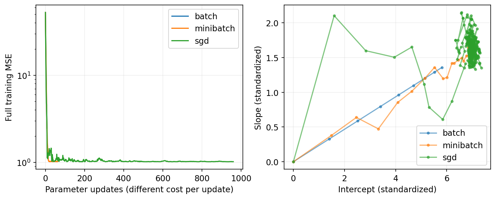

左：每次更新後的整體 MSE；右：參數路徑。每步使用的樣本量不同。
一次 epoch 看完一輪資料；`partial_fit` 每次只處理傳入那一塊。
Notebook 另保留 epoch 結尾圖，不能把兩種橫軸當相同運算成本。

<!-- 講者提示：Notebook對照：程式 04-16、04-17；見本章 ipynb 首行的程式代碼。圖例與固定玩具例依各頁標示的資料與輸入解讀。SGDRegressor的squared_error採半平方損失，手寫MSE梯度多一個2；相同eta不必產生相同路徑。手寫SGD使用衰減排程，mini-batch示例用固定步幅。不能以更新次數直接當執行時間。 -->

---
<!-- _class: figure -->
## Notebook 圖表：重複抽樣的偏差與變異

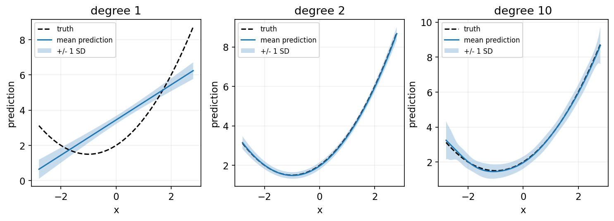

固定生成函數與雜訊，重抽 100 組訓練集；實線是平均預測，色帶是 ±1 標準差。

$$\mathbb E[(\hat f(x)-y)^2]=\operatorname{Bias}(x)^2+\operatorname{Var}(\hat f(x))+\sigma^2$$

<!-- 講者提示：Notebook對照：程式 04-20；見本章 ipynb 首行的程式代碼。圖例與固定玩具例依各頁標示的資料與輸入解讀。假設測試雜訊獨立、零均值，sigma²=1；本例已知生成函數，才能估計偏差。色帶不是信賴區間；單次train/test差距不能直接拆成偏差平方與變異。Notebook輸出每種階數的估計表。 -->
