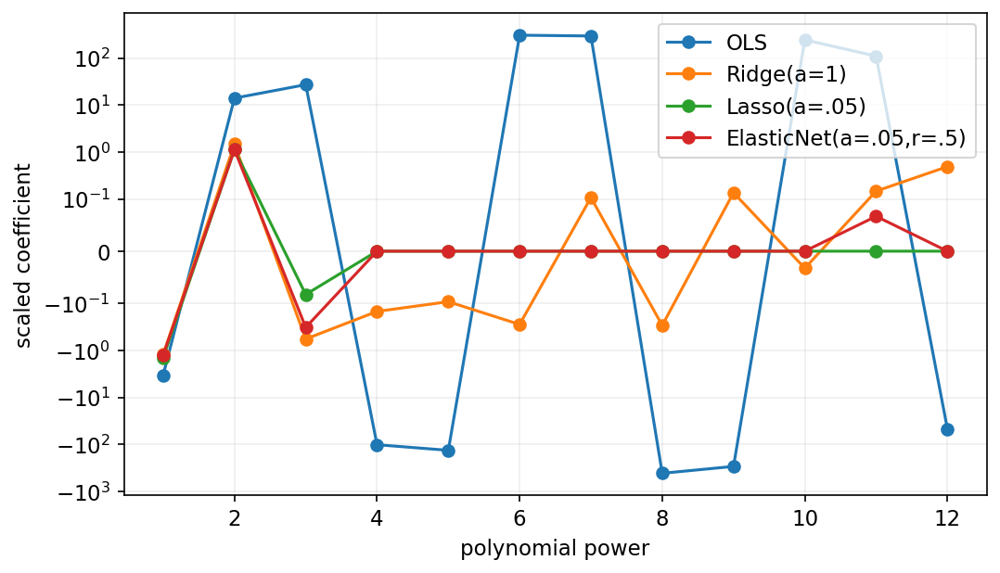
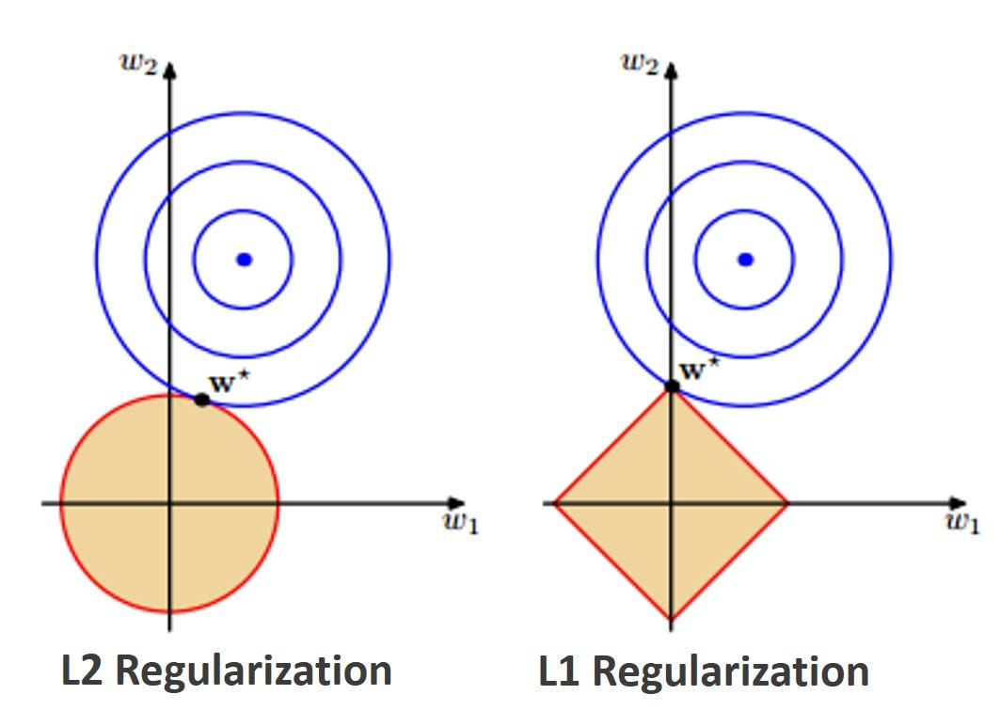
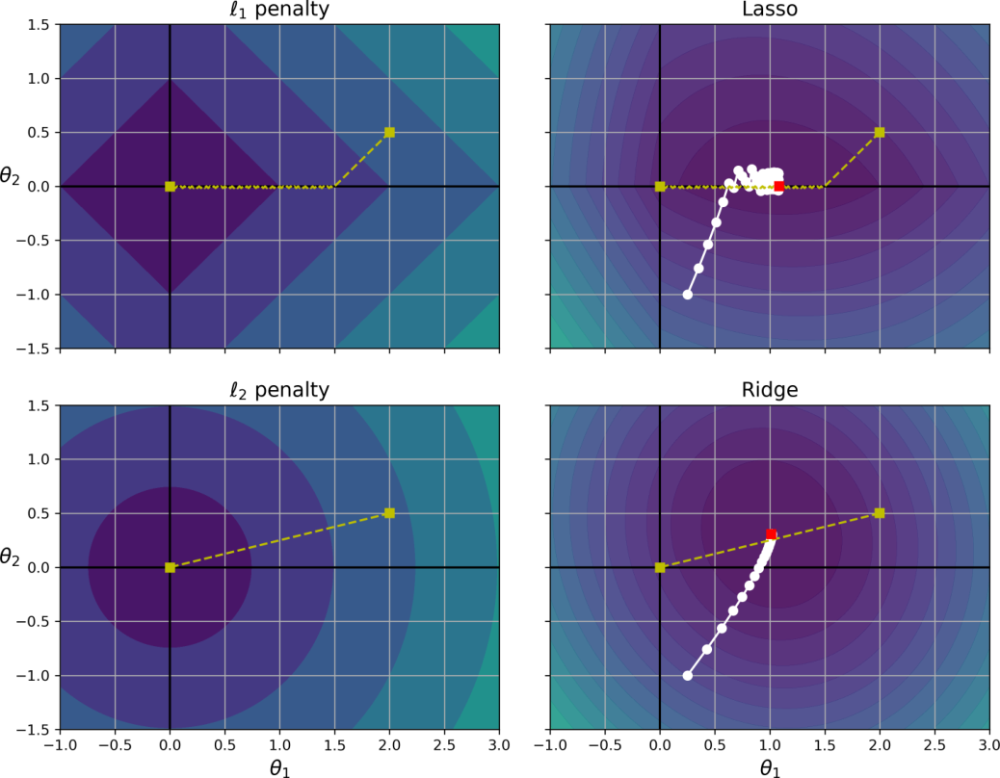
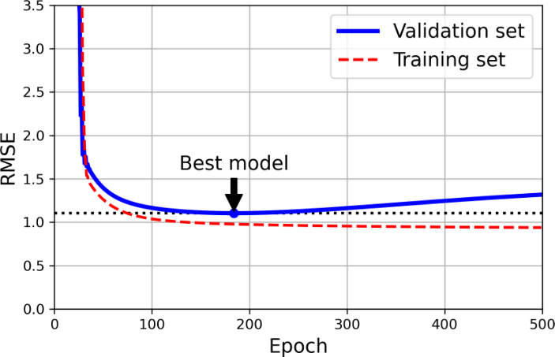
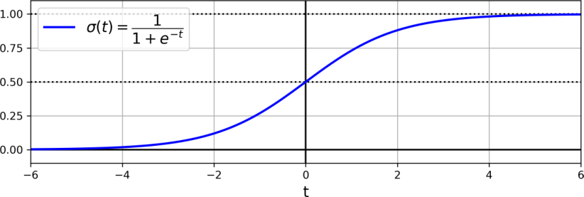
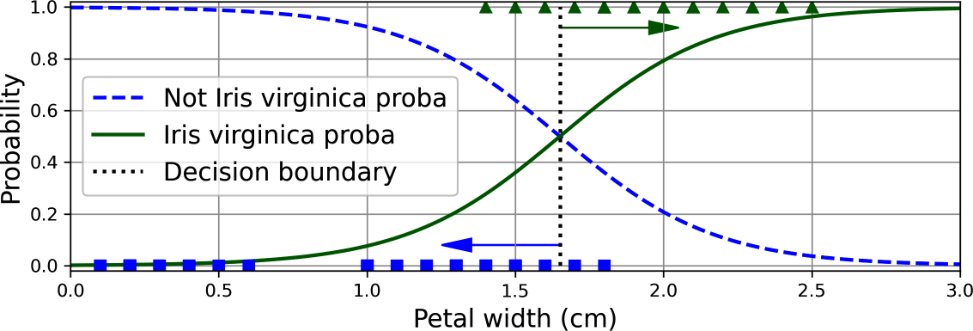
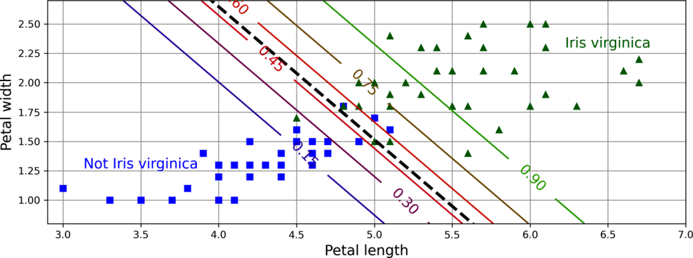
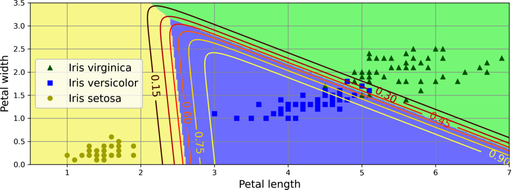

<!-- _class: cover -->
# 正則化與機率分類

第 5 週｜控制模型複雜度，理解機率、損失與決策

<!-- 講者提示：先讓學生說明本頁符號或圖形，再連結前後概念。圖表中的固定結果僅供讀圖，不能當作本班重跑結果。 -->

---
## 學習重點與成果

- Ridge、Lasso、Elastic Net：比較懲罰形式與係數變化。

- 早停、Logistic 與交叉熵：連接機率模型、損失與梯度。

- Softmax、多類別分類與選模：檢查機率輸出與泛化。

成果：能說明正則化、推導 $\hat p_i-y_i$ 的來源，區分訓練與決策。

<!-- notebook-companion-link -->
> 💻 **配套 Notebook**：`programs/notebooks/05_正則化與機率分類.ipynb`。程式片段、實際圖表與表格可由此檔重現。

<!-- 講者提示：數學符號承接第04章；比較正則化時要確認損失尺度、特徵縮放與截距是否受罰。程式實驗輸出以配套 Notebook 為準。 -->

<!-- Notebook 對照：程式 05-01、05-02；完整對照見本章 ipynb 開頭。 -->

---
<!-- notebook-result-slide -->
<!-- _class: small -->
## 程式實驗與實際輸出

<div class="columns wide-left">
<div>

```python
for alpha in alphas:
    Ridge(alpha=alpha).fit(X, y)
```

**觀察**：正則化強度改變係數大小；比較前要固定資料切分與特徵縮放流程。

參考程式：`programs/notebooks/05_正則化與機率分類.ipynb`

</div>
<div>



</div>
</div>

<!-- 講者提示：程式與圖為 programs/notebooks/05_正則化與機率分類.ipynb 的已執行輸出。 -->

<!-- Notebook 對照：程式 05-03；完整對照見本章 ipynb 開頭。圖例與小型實驗的資料、評估方式及適用範圍各自標示。 -->

---
## 正則化：把參數大小也放入訓練目標

$$J(\boldsymbol\theta)=\text{資料誤差}+\lambda\,\text{參數懲罰}$$

- 犧牲一點訓練擬合，限制不穩定的係數。
- 通常不懲罰截距；先縮放特徵，讓懲罰可比較。
- 強度由驗證集或交叉驗證選擇。

<!-- 講者提示：先讓學生說明本頁符號或圖形，再連結前後概念。圖表中的固定結果僅供讀圖，不能當作本班重跑結果。 -->

<!-- Notebook 對照：程式 05-03；完整對照見本章 ipynb 開頭。 -->

---
## L1 與 L2 正則化

$$J(\mathbf w,b)=\frac1m\sum_{i=1}^{m}(\hat y_i-y_i)^2+\lambda\Omega(\mathbf w)$$

| 方法 | 懲罰項 $\Omega(\mathbf w)$ | 常見效果 |
|---|---|---|
| Ridge／L2 | $\sum_j w_j^2$ | 縮小係數，通常不直接變為 0 |
| Lasso／L1 | $\sum_j\lvert w_j\rvert$ | 部分係數可能變為 0，形成稀疏解 |
| Elastic Net | L1 與 L2 的加權組合 | 結合兩類限制 |

$\lambda\geq0$ 是超參數。此處通常不懲罰截距 $b$。

<!-- 講者提示：先用幾何圖建立「限制係數大小」的直覺；後面的 Ridge、Lasso 與 Elastic Net 頁再比較懲罰形式與模型行為。 -->

<!-- Notebook 對照：程式 05-03、05-05；完整對照見本章 ipynb 開頭。 -->

---
## 正則化的幾何直覺

<div class="columns">
<div>



</div>
<div>

- 藍色等高線表示不同損失。
- 黃色區域是允許的係數範圍。
- L2 的限制邊界是圓。
- L1 的限制邊界有位於座標軸的角點，較容易出現零係數。

</div>
</div>

<!-- 講者提示：請學生先比較 L1 與 L2 約束區域，再連到後面的稀疏係數與收縮效果。 -->

<!-- Notebook 對照：程式 05-06；完整對照見本章 ipynb 開頭。圖例與小型實驗的資料、評估方式及適用範圍各自標示。 -->

---
## Ridge：平方懲罰讓係數平滑縮小

$$J_{\rm ridge}=\operatorname{MSE}(\boldsymbol\theta)+\frac\alpha m\sum_{j=1}^n\theta_j^2$$

$$\hat{\boldsymbol\theta}=(X^\top X+\alpha A)^{-1}X^\top\mathbf y,\quad A=\operatorname{diag}(0,1,\ldots,1)$$

$\alpha=0$ 回到無正則化；越大通常縮得越多。

<!-- 講者提示：截距位置為 0；α>0 通常改善病態問題。不要把「接近零」說成特徵已被完全移除。 -->

<!-- Notebook 對照：程式 05-03；完整對照見本章 ipynb 開頭。 -->

---
<!-- _class: figure -->
## Ridge 的強度如何改變直線與曲線？


比較左右兩組圖：正則化既能約束原始線性係數，也能約束多項式係數。

<!-- 講者提示：先讓學生說明本頁符號或圖形，再連結前後概念。圖表中的固定結果僅供讀圖，不能當作本班重跑結果。 -->

<!-- Notebook 對照：程式 05-06；完整對照見本章 ipynb 開頭。圖例與小型實驗的資料、評估方式及適用範圍各自標示。 -->

---
## Lasso：絕對值懲罰可以產生零係數

$$J_{\rm lasso}=\operatorname{MSE}(\boldsymbol\theta)+2\alpha\sum_{j=1}^n|\theta_j|$$

可得到稀疏參數；但高度相關特徵間，選擇結果可能不穩定。

<!-- 講者提示：不要把「被選中」直接解讀成因果或唯一重要因素。此處係數 2 是教材採用的損失尺度。 -->

<!-- Notebook 對照：程式 05-03；完整對照見本章 ipynb 開頭。 -->

---
<!-- _class: figure -->
## Lasso 在多項式模型中壓掉部分項


觀察模型變簡單的方式：可能使部分係數精確變成 0。

<!-- 講者提示：先讓學生說明本頁符號或圖形，再連結前後概念。圖表中的固定結果僅供讀圖，不能當作本班重跑結果。 -->

<!-- Notebook 對照：程式 05-06；完整對照見本章 ipynb 開頭。圖例與小型實驗的資料、評估方式及適用範圍各自標示。 -->

---
<!-- _class: figure -->
## L1 與 L2 的幾何：角點與圓滑邊界



L1 邊界在座標軸有角點，較容易使最優解落在某些係數為零的位置。

<!-- 講者提示：比較不同損失等高線碰到約束區域的位置；這是幾何直覺，不是所有資料必然稀疏的保證。 -->

<!-- Notebook 對照：程式 05-06、05-05；完整對照見本章 ipynb 開頭。圖例與小型實驗的資料、評估方式及適用範圍各自標示。 -->

---
## 零點不可微，仍可使用次梯度

$$g_j=\frac{\partial\operatorname{MSE}}{\partial\theta_j}+2\alpha s_j,\quad s_j\in\begin{cases}\{1\}&\theta_j>0\\{[-1,1]}&\theta_j=0\\\{-1\}&\theta_j<0\end{cases}$$

在零點選 $s_j=0$ 是合法代表；實際 Lasso 求解器也可用座標下降等方法。截距不加此項。

<!-- 講者提示：先讓學生說明本頁符號或圖形，再連結前後概念。圖表中的固定結果僅供讀圖，不能當作本班重跑結果。 -->

<!-- Notebook 對照：程式 05-06；完整對照見本章 ipynb 開頭。 -->

---
## Elastic Net：同時限制 L1 與 L2

$$J=\operatorname{MSE}+\lambda_1\|\mathbf w\|_1+\lambda_2\|\mathbf w\|_2^2$$

$\lambda_1$ 控制稀疏傾向，$\lambda_2$ 提供平滑收縮。混合比例 $r$ 越大，越偏向 Lasso。

<!-- 講者提示：下一頁說明不同 API 的正規化方式；跨模型的 alpha 不可直接視為同一尺度。 -->

<!-- Notebook 對照：程式 05-03；完整對照見本章 ipynb 開頭。 -->

---
<!-- _class: small -->
## 同叫 alpha，目標函數尺度可能不同

教材式 4-13：$\operatorname{MSE}+2r\alpha\|\mathbf w\|_1+\frac{(1-r)\alpha}{m}\|\mathbf w\|_2^2$。

scikit-learn `ElasticNet`：$\frac{\operatorname{MSE}}2+\alpha r\|\mathbf w\|_1+\frac{\alpha(1-r)}2\|\mathbf w\|_2^2$。

兩式的 L2 樣本數係數不同；實作與調參以使用的 API 目標為準，不能直接照搬同一個 $\alpha$。

<!-- 講者提示：Ridge 與 SGDRegressor 的懲罰尺度也不同。用通用 λ1、λ2 先理解，再對照實作定義。 -->

<!-- Notebook 對照：程式 05-04；完整對照見本章 ipynb 開頭。 -->

---
<!-- _class: small -->
## Ridge、Lasso、Elastic Net 如何選？

| 方法 | 主要效果 | 先考慮的情境 |
| --- | --- | --- |
| Ridge | 收縮，通常不產生零係數 | 多個特徵共同提供訊息 |
| Lasso | 稀疏化 | 需要少數特徵，並檢查穩定性 |
| Elastic Net | L1 與 L2 混合 | 特徵相關、又想保留稀疏性 |

<!-- 講者提示：先讓學生說明本頁符號或圖形，再連結前後概念。圖表中的固定結果僅供讀圖，不能當作本班重跑結果。 -->

<!-- Notebook 對照：程式 05-03、05-05；完整對照見本章 ipynb 開頭。 -->

---
<!-- _class: activity -->
## 正則化比較：係數會怎麼變？

同一組特徵與損失下，比較 $L_2$ 與 $L_1$ 懲罰：

- Ridge 加入 $\lambda\sum_j w_j^2$，傾向讓係數縮小，但通常不會直接變成零。
- Lasso 加入 $\lambda\sum_j |w_j|$，可能把部分係數壓成零。
- Elastic Net 結合兩者；比較前應縮放特徵，並說明截距是否受罰。

驗證集用於選擇 $\lambda$，測試集保留作最後評估。

<!-- 講者提示：先讓學生獨立檢核本頁的假設、公式與結論，再與相鄰的模型概念對照。 -->

---
<!-- _class: figure -->
## 早停：保留驗證表現最好的參數



訓練誤差繼續下降，不代表泛化繼續改善；測試集不可用來決定停止點。

<!-- 講者提示：先讓學生說明本頁符號或圖形，再連結前後概念。圖表中的固定結果僅供讀圖，不能當作本班重跑結果。 -->

<!-- Notebook 對照：程式 05-07；完整對照見本章 ipynb 開頭。圖例與小型實驗的資料、評估方式及適用範圍各自標示。 -->

---
## 早停需要「監看、耐心、保存、回復」

1. 每個 epoch 記錄訓練損失與驗證指標。
2. 指標需超過最小改善量；連續若干次未改善才停止。
3. 保存最佳參數，最後回復最佳版本。

`deepcopy` 可保存已學參數；`clone` 主要複製估計器設定。

<!-- 講者提示：本例展示最佳模型快照，不是含 break 的完整 patience 迴圈；也不能把每次小反彈都當成停止訊號。 -->

<!-- Notebook 對照：程式 05-07；完整對照見本章 ipynb 開頭。 -->

---
<!-- _class: small -->
## Logistic：先算分數，再轉成正類機率

符號定義：$\boldsymbol\theta=(b,w_1,\ldots,w_n)^\top$，$\tilde{\mathbf x}_i=(1,x_{i1},\ldots,x_{in})^\top$。

$$z_i=b+\sum_{j=1}^n w_jx_{ij}=\tilde{\mathbf x}_i^\top\boldsymbol\theta,
\qquad\hat p_i=\sigma(z_i)=\frac1{1+e^{-z_i}}$$

$$\hat y_i=\begin{cases}1&\hat p_i\ge t\\0&\hat p_i<t\end{cases}$$

$i$ 表示樣本，$j$ 表示特徵。$\hat p_i$ 是正類機率估計，$t$ 是決策閾值。

接下來先推導**無正則化**的訓練損失，最後才用閾值判類別。

<!-- 講者提示：X 每列為 tilde x_i 的轉置，含截距欄。常見 t=0.5，仍需依驗證資料與代價選擇。訓練梯度使用機率，不是經閾值切成0或1後的類別。樣本索引、參數與截距承接第04章。 -->

<!-- Notebook 對照：程式 05-08；完整對照見本章 ipynb 開頭。 -->

---
<!-- _class: figure -->
## Sigmoid 把任意實數映射到 0 與 1 之間



$z=0$ 對應 0.5；分數往正方向移動，正類估計機率上升。

<!-- 講者提示：先讓學生說明本頁符號或圖形，再連結前後概念。圖表中的固定結果僅供讀圖，不能當作本班重跑結果。 -->

<!-- Notebook 對照：程式 05-09；完整對照見本章 ipynb 開頭。圖例與小型實驗的資料、評估方式及適用範圍各自標示。 -->

---
## Sigmoid 的導數：外層與內層分開算

$$\begin{aligned}
\sigma'(z)
&=\frac{d}{dz}(1+e^{-z})^{-1}\\
&=-(1+e^{-z})^{-2}(-e^{-z})\\
&=\frac{e^{-z}}{(1+e^{-z})^2}
=\sigma(z)\bigl(1-\sigma(z)\bigr)
\end{aligned}$$

所以 $\dfrac{\partial\hat p_i}{\partial z_i}=\hat p_i(1-\hat p_i)$。

檢查：$z_i=0$ 時，$\hat p_i=0.5$，導數為 $0.25$。

<!-- 講者提示：第一個負號來自倒數的微分，第二個來自 e 的負 z 次方；相乘後為正。將 e^-z/(1+e^-z) 改寫為 1-1/(1+e^-z)，即可看出 sigma 乘 (1-sigma)。本頁以 LaTeX 展開完整連鎖律。 -->

<!-- Notebook 對照：程式 05-09；完整對照見本章 ipynb 開頭。 -->

---
## Bernoulli 概似：真實類別得到多少機率？

對二元標籤 $y_i\in\{0,1\}$：

$$P(y_i\mid\mathbf x_i;\boldsymbol\theta)
=\hat p_i^{y_i}(1-\hat p_i)^{1-y_i}$$

在樣本條件獨立的假設下，整份資料的概似為各筆相乘：

$$L(\boldsymbol\theta)=\prod_{i=1}^m
\hat p_i^{y_i}(1-\hat p_i)^{1-y_i}$$

最大化 $L$ 等同最小化 $-\frac1m\ln L$；取對數可將乘積變成加總。

<!-- 講者提示：分別代 y=1 與 y=0，結果是 p 與 1-p。觀察到的 y 固定，概似用來比較不同參數如何解釋資料。ln 是嚴格遞增函數，負號把最大化改成最小化，除以 m 只是平均。 -->

<!-- Notebook 對照：程式 05-09；完整對照見本章 ipynb 開頭。 -->

---
## 二元交叉熵：每筆損失與整體平均

$$\ell_i=-\left[y_i\ln\hat p_i+(1-y_i)\ln(1-\hat p_i)\right]$$

$$J(\boldsymbol\theta)=-\frac1m\ln L(\boldsymbol\theta)
=\frac1m\sum_{i=1}^m\ell_i$$

| 真實標籤 | 每筆損失 | 答對且機率高時 |
|---|---|---|
| $y_i=1$ | $-\ln\hat p_i$ | $\hat p_i$ 接近 1，損失接近 0 |
| $y_i=0$ | $-\ln(1-\hat p_i)$ | $\hat p_i$ 接近 0，損失接近 0 |

使用自然對數；$y_i=1$ 時，$\hat p_i=0.9$ 的損失約 $0.105$。

<!-- 講者提示：若 y=1 且 p=0.1，損失約 2.303，顯示自信地答錯代價大。有限實數分數的 sigmoid 理論上落在開區間 (0,1)；實作通常直接由 logits 計算穩定的交叉熵，避免浮點數四捨五入成 0 或 1。此處沒有正則化項。本頁統一採自然對數與平均損失。 -->

<!-- Notebook 對照：程式 05-08、05-09；完整對照見本章 ipynb 開頭。 -->

---
## 交叉熵先對預測機率微分

把 $y_i$ 視為常數，分開微分兩個對數項：

$$\begin{aligned}
\frac{\partial\ell_i}{\partial\hat p_i}
&=-\frac{y_i}{\hat p_i}
-(1-y_i)\frac{-1}{1-\hat p_i}\\[6pt]
&=-\frac{y_i}{\hat p_i}+\frac{1-y_i}{1-\hat p_i}\\[6pt]
&=\frac{\hat p_i-y_i}{\hat p_i(1-\hat p_i)}
\end{aligned}$$

第二項的內部函數 $1-\hat p_i$ 微分會帶出負號。

<!-- 講者提示：最後一步通分，分子為 -y_i(1-p_i)+(1-y_i)p_i=p_i-y_i。特別檢查第二項的兩個負號，不要先把 y 代成某個類別才推一般公式。本頁先對 p_i 與 z_i 微分，再接到權重。 -->

<!-- Notebook 對照：程式 05-09；完整對照見本章 ipynb 開頭。 -->

---
## 連鎖律：機率梯度如何變成分數梯度？

$$\begin{aligned}
\frac{\partial\ell_i}{\partial z_i}
&=\frac{\partial\ell_i}{\partial\hat p_i}
\frac{\partial\hat p_i}{\partial z_i}\\[6pt]
&=\frac{\hat p_i-y_i}{\hat p_i(1-\hat p_i)}
\;\hat p_i(1-\hat p_i)\\[6pt]
&=\boxed{\hat p_i-y_i}
\end{aligned}$$

這個化簡來自 **sigmoid 與二元交叉熵的組合**。

若 $y_i=1$、$\hat p_i<1$，分數梯度為負，下降更新會傾向提高該筆分數。

<!-- 講者提示：請學生圈出消去的 p_i(1-p_i)。若改用 sigmoid 加 MSE，對 z 的微分仍含 2(p-y)p(1-p)，不能直接套 p-y。最後一句指單筆樣本的梯度貢獻；多筆共用參數時，總更新不保證每筆損失都下降。 -->

<!-- Notebook 對照：程式 05-09；完整對照見本章 ipynb 開頭。 -->

---
## Logistic 梯度：形式像殘差，但預測已轉機率

$$\frac{\partial\ell_i}{\partial w_j}
=\frac{\partial\ell_i}{\partial z_i}\frac{\partial z_i}{\partial w_j}
=(\hat p_i-y_i)x_{ij}$$

$$\frac{\partial J}{\partial b}=\frac1m\sum_i(\hat p_i-y_i),\qquad
\nabla_{\boldsymbol\theta}J=\frac1mX^\top(\hat{\mathbf p}-\mathbf y)$$

單純 Logistic 的交叉熵是凸的；線性可分且無正則化時，有限的最優參數未必存在。

<!-- 講者提示：對 w_j 的內部導數為 x_ij，對 b 為 1；對 J 再將每筆梯度取平均。X 含常數欄，p 與 y 是 m 乘 1 向量，梯度為 n+1 乘 1。MSE 的 2 不在此式中，原因是兩種損失不同，不是任意省略常數。此處凸性限線性分數加交叉熵，未討論神經網路的非凸情況。 -->

<!-- Notebook 對照：程式 05-08、05-09；完整對照見本章 ipynb 開頭。 -->

---
<!-- _class: small -->
## 梯度下降：同樣的更新規則，不同的損失

先用更新前參數算 $\hat{\mathbf p}^{(k)}=\sigma(X\boldsymbol\theta^{(k)})$，再同步更新：

$$\boldsymbol\theta^{(k+1)}=\boldsymbol\theta^{(k)}
-\eta\frac1mX^\top(\hat{\mathbf p}^{(k)}-\mathbf y)$$

| 模型與訓練目標 | 梯度 |
|---|---|
| 線性迴歸搭配 MSE | $\frac2mX^\top(\hat{\mathbf y}-\mathbf y)$ |
| Logistic 搭配交叉熵 | $\frac1mX^\top(\hat{\mathbf p}-\mathbf y)$ |

以上皆未加正則化；閾值 $t$ 不參與這兩個訓練梯度。

<!-- 講者提示：k 是更新索引、eta 是學習率，與第 04 章相同。sigmoid 對向量逐元素套用。若目標另加 lambda/2 乘 ||w||^2，權重梯度要加 lambda w，截距不加；不可把本頁當成所有 LogisticRegression 設定的完整梯度。本頁使用平均損失，學習率需依目標尺度重新選擇。 -->

<!-- Notebook 對照：程式 05-08、05-09；完整對照見本章 ipynb 開頭。 -->

---
<!-- _class: activity -->
## 手算 Logistic 的第一次更新

$$X=\begin{bmatrix}1&0\\1&1\end{bmatrix},\qquad
\mathbf y=\begin{bmatrix}0\\1\end{bmatrix},\qquad
\boldsymbol\theta^{(0)}=\begin{bmatrix}0\\0\end{bmatrix}$$

1. 算出分數、機率與 $\hat{\mathbf p}^{(0)}-\mathbf y$。
2. 使用 $\eta=1$，求梯度與新參數。
3. 比較更新前後的平均交叉熵；再用 $t=0.5$ 比較 accuracy。

**提交：一組更新計算，以及「損失和 accuracy 是否一起改變」的說明。**

<!-- 講者提示：可用計算機，或提供sigma(0.25)約0.56218、ln 2約0.69315、ln(1+e^-0.25)約0.57594。使用大於等於閾值判正類。此eta只用於本例，不是通用建議。自編示例，非Notebook實驗成效。 -->

<!-- Notebook 對照：程式 05-09；完整對照見本章 ipynb 開頭。 -->

---
<!-- _class: small -->
## 手算解答：損失下降，accuracy 可以不變

$$\hat{\mathbf p}^{(0)}-\mathbf y=
\begin{bmatrix}0.5\\-0.5\end{bmatrix},\qquad
\nabla J=\frac12\begin{bmatrix}1&1\\0&1\end{bmatrix}
\begin{bmatrix}0.5\\-0.5\end{bmatrix}
=\begin{bmatrix}0\\-0.25\end{bmatrix}$$

$$\boldsymbol\theta^{(1)}=\begin{bmatrix}0\\0.25\end{bmatrix},\qquad
\hat{\mathbf p}^{(1)}=\begin{bmatrix}0.5\\\sigma(0.25)\end{bmatrix}
\approx\begin{bmatrix}0.5\\0.56218\end{bmatrix}$$

$$J^{(0)}=\ln2\approx0.69315,\qquad
J^{(1)}=\frac{\ln2+\ln(1+e^{-0.25})}{2}\approx0.63454$$

$t=0.5$ 時，兩次皆預測 $(1,1)^\top$，accuracy 都是 $50\%$。

<!-- 講者提示：第1筆機率未變，第2筆真實為1且機率提高，所以交叉熵降低。accuracy只看閾值後的類別，尚未改變。連結第03章「訓練損失與分類正確率不同」。讓學生指出截距梯度相消，斜率梯度不相消的原因。 -->

<!-- Notebook 對照：程式 05-09；完整對照見本章 ipynb 開頭。 -->

---
<!-- _class: figure -->
## Iris 案例：定義正類，才能解讀機率


教材以 Iris virginica 為正類；不是直接把花種編號當連續數字迴歸。

<!-- 講者提示：先讓學生說明本頁符號或圖形，再連結前後概念。圖表中的固定結果僅供讀圖，不能當作本班重跑結果。 -->

<!-- Notebook 對照：程式 05-08；完整對照見本章 ipynb 開頭。圖例與小型實驗的資料、評估方式及適用範圍各自標示。 -->

---
<!-- _class: figure -->
## 一個特徵的機率曲線與 0.5 決策界線



閾值改變會改變類別判定；模型的機率曲線本身未必改變。

<!-- 講者提示：先讓學生說明本頁符號或圖形，再連結前後概念。圖表中的固定結果僅供讀圖，不能當作本班重跑結果。 -->

<!-- Notebook 對照：程式 05-08；完整對照見本章 ipynb 開頭。圖例與小型實驗的資料、評估方式及適用範圍各自標示。 -->

---
<!-- _class: figure -->
## 兩個特徵的線性決策邊界



Logistic 對原始特徵的分數是線性的；加入非線性特徵後可得到彎曲邊界。

<!-- 講者提示：先讓學生說明本頁符號或圖形，再連結前後概念。圖表中的固定結果僅供讀圖，不能當作本班重跑結果。 -->

<!-- Notebook 對照：程式 05-11；完整對照見本章 ipynb 開頭。圖例與小型實驗的資料、評估方式及適用範圍各自標示。 -->

---
<!-- _class: activity -->
## 機率不是最後決策：比較兩個閾值

四筆真值為 `[1, 0, 1, 0]`，正類機率為 `[.8, .6, .4, .1]`。

1. 閾值 0.5 與 0.3 時，各算 TP、FP、FN、TN。
2. 需要減少漏報時會考慮哪個閾值？
3. 為什麼不能只看 accuracy？

<!-- 講者提示：0.5：TP=1,FP=1,FN=1,TN=1；0.3：TP=2,FP=1,FN=0,TN=1。低閾值此例降低漏報，但一般也可能增加誤報；應按成本與驗證資料選閾值。 -->

<!-- Notebook 對照：程式 05-10；完整對照見本章 ipynb 開頭。 -->

---
<!-- _class: activity -->
## 機率、閾值與損失是不同層次

若模型對正類輸出 $p=0.7$：

- 真實標籤為 $1$ 時，交叉熵為 $-\ln(0.7)\approx0.357$。
- 閾值 $0.5$ 會判為正類；閾值 $0.8$ 則判為負類。
- 改閾值只改分類決策，不會改變這筆資料的模型輸出機率或訓練交叉熵。

以驗證資料選閾值，並同時報告錯誤代價與分類指標。

<!-- 講者提示：先讓學生獨立檢核本頁的假設、公式與結論，再與相鄰的模型概念對照。 -->

---
## Softmax：每一類先得到自己的分數

$$z_{ic}=\tilde{\mathbf x}_i^\top\boldsymbol\theta_c,\qquad
\hat p_{ic}=\frac{\exp(z_{ic})}{\sum_{r=1}^K\exp(z_{ir})}$$

$$\hat y_i=\arg\max_c\hat p_{ic}=\arg\max_c z_{ic}$$

$c=1,\ldots,K$ 表示類別；每個類別各有一組參數 $\boldsymbol\theta_c$。

適用於互斥類別；同一筆可同時多標籤時，改用各標籤的 Sigmoid。

<!-- 講者提示：先讓學生說明本頁符號或圖形，再連結前後概念。圖表中的固定結果僅供讀圖，不能當作本班重跑結果。 -->

<!-- Notebook 對照：程式 05-12；完整對照見本章 ipynb 開頭。 -->

---
## 穩定的 Softmax：先減掉最大分數

$$\hat p_{ic}=\frac{e^{z_{ic}-a_i}}{\sum_{r=1}^K e^{z_{ir}-a_i}},\qquad a_i=\max_r z_{ir}$$

分數 $[1000,1001,1002]$ 與 $[-2,-1,0]$ 的 Softmax 相同。

直接計算大數的指數可能溢位；減常數不改變機率比。

<!-- 講者提示：結果約 [.090,.245,.665]。Softmax 對所有分數加同一常數不變，這也提示參數可有冗餘。 -->

<!-- Notebook 對照：程式 05-12；完整對照見本章 ipynb 開頭。 -->

---
## 多類別交叉熵：看正確類別拿到多少機率

$$J=-\frac1m\sum_{i=1}^m\sum_{c=1}^K y_{ic}\ln\hat p_{ic}$$

$$\nabla_{\boldsymbol\theta_c}J=\frac1m\sum_{i=1}^m
(\hat p_{ic}-y_{ic})\tilde{\mathbf x}_i$$

one-hot 真值只有正確類別是 1；其他是 0。

<!-- 講者提示：softmax 與交叉熵相搭配時梯度簡化成 p-y；不是每一類都各自獨立二元訓練。 -->

<!-- Notebook 對照：程式 05-12；完整對照見本章 ipynb 開頭。 -->

---
<!-- _class: figure -->
## Softmax 的三類決策區域



各區域選擇最高分數的類別；邊界上兩類分數相等，第三類仍可能更高。

<!-- 講者提示：先讓學生說明本頁符號或圖形，再連結前後概念。圖表中的固定結果僅供讀圖，不能當作本班重跑結果。 -->

<!-- Notebook 對照：程式 05-12；完整對照見本章 ipynb 開頭。圖例與小型實驗的資料、評估方式及適用範圍各自標示。 -->

---
<!-- _class: small -->
## 用 Pipeline 選正則化強度

```python
from sklearn.pipeline import make_pipeline
from sklearn.preprocessing import StandardScaler
from sklearn.linear_model import LogisticRegression
from sklearn.model_selection import GridSearchCV
pipe = make_pipeline(StandardScaler(),
                     LogisticRegression(max_iter=2000))
search = GridSearchCV(pipe, {"logisticregression__C":
                            [0.01, 0.1, 1, 10]}, cv=5)
search.fit(X_train, y_train)
```

<!-- 講者提示：X_train/y_train 必須是先切好的訓練集。C 越小正則化越強；這裡刻意不設定已改版的 multi_class 參數。 -->

<!-- Notebook 對照：程式 05-13；完整對照見本章 ipynb 開頭。 -->

---
<!-- _class: small -->
## 把分數、機率、類別與評估分開

| 層次 | 輸出 | 回答的問題 |
| --- | --- | --- |
| 分數 | decision_function | 相對偏向哪一類？ |
| 機率 | predict_proba | 模型估計的類別機率？ |
| 類別 | predict 或自訂閾值 | 現在要採取什麼決策？ |
| 評估 | log loss／混淆矩陣等 | 機率品質與決策效果如何？ |

<!-- 講者提示：機率校準與排序能力不同；選模、校準與測試必須有清楚資料角色。 -->

<!-- Notebook 對照：程式 05-10；完整對照見本章 ipynb 開頭。 -->

---
<!-- _class: activity -->
## 綜合實作：三類分類的完整流程

使用已有的 Iris 或其他小型分類資料。

1. 固定一次訓練／測試切分。
2. 在 Pipeline 內標準化，用 CV 比較四個 C。
3. 提交最佳 C、CV 指標、測試混淆矩陣與兩筆機率。
4. 離線替代：手算分數 `[0,1,2]` 的 Softmax 與類別 2 的損失。

<!-- 講者提示：離線答案 p 約 [.09003,.24473,.66524]，正類 index2 的損失 .40761。實作不要求特定 accuracy；評分在資料角色與解釋。 -->

<!-- Notebook 對照：程式 05-13；完整對照見本章 ipynb 開頭。 -->

---
## 離堂檢核：梯度、決策與泛化

- 係數小，不等於特徵沒有因果作用。
- 驗證集用來選 C 或早停後，就不是最終測試集。
- Softmax 機率加總為 1，不表示機率已經校準。
- 交叉熵下降，accuracy 不一定同時上升。

課後：Ch.4 練習 7–12；比較同一資料上 Ridge、Lasso 與 Elastic Net 的係數。

<!-- 講者提示：請學生各用一句自己的話改寫，再補問：交叉熵對z的梯度為何是p-y，哪個因子被消去？答案是機率梯度分母中的p(1-p)與sigmoid導數相消。Softmax機率加總1仍不代表已校準，需另做檢查。下一週改用規則式分割建立非線性模型。 -->

<!-- Notebook 對照：程式 05-13；完整對照見本章 ipynb 開頭。 -->

---
<!-- _class: small -->
## Notebook 導讀：懲罰、早停與評估範圍

| 實驗 | 要檢查的證據 |
|---|---|
| Ridge／Lasso 與幾何 | 同資料改 alpha；範數限制與預測曲線分開讀 |
| 早停 | 訓練／驗證曲線、最佳 epoch、還原後損失 |
| Sigmoid 與交叉熵 | 解析梯度＝中心差分；兩筆例子的 loss 下降 |
| Iris 邊界／Softmax | 全資料圖只說明幾何；正式成效另做 CV／test |

手算懲罰：$(2,0)$ 與 $(1,1)$ 的 L1 都是 2；L2 平方分別為 4、2。
早停與調 C 都使用驗證資訊，驗證集不能再當最終測試集。

<!-- 講者提示：Notebook 未使用外部資料下載，圖表以合成資料及套件內建 Iris 產生。 -->

<!-- Notebook 對照：程式 05-06、05-07、05-09；完整對照見本章 ipynb 開頭。 -->
