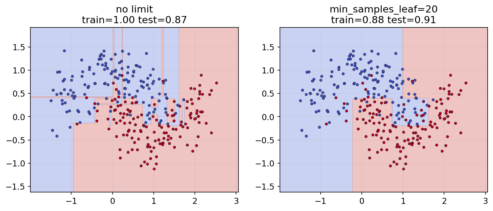
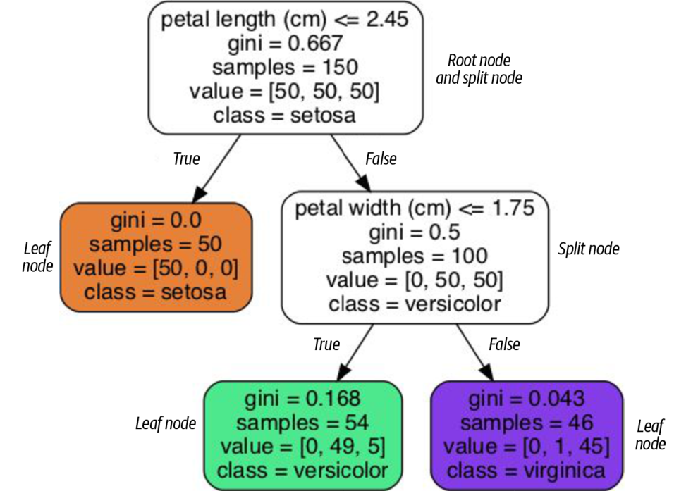
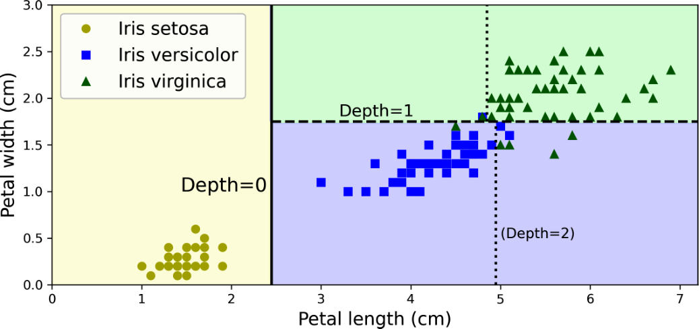
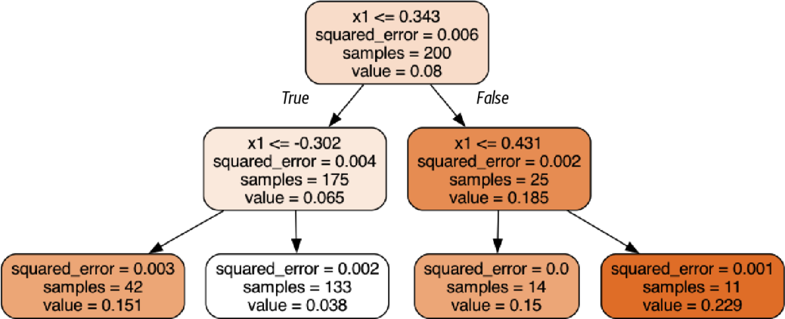
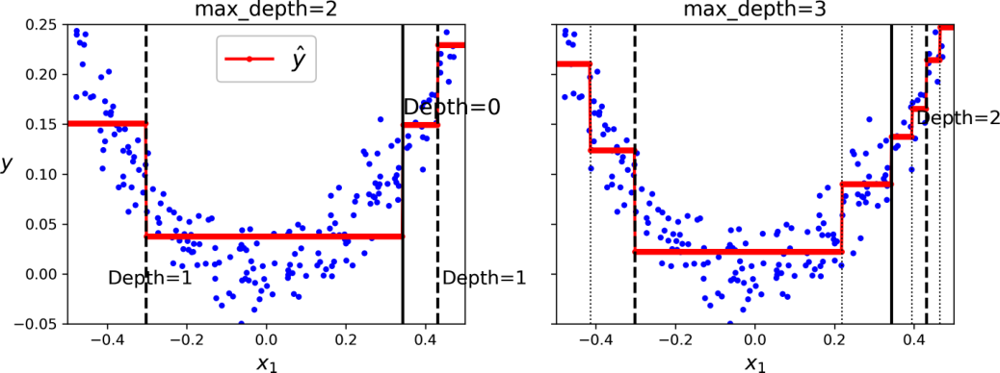
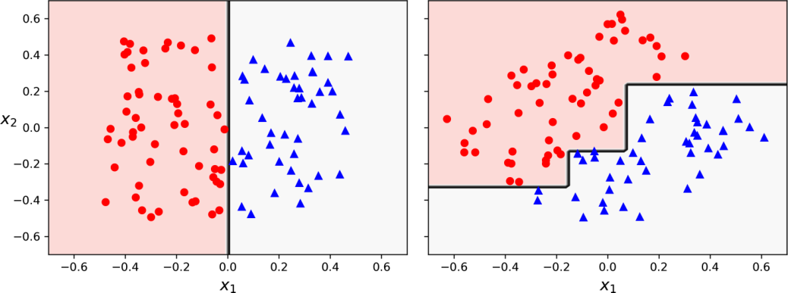
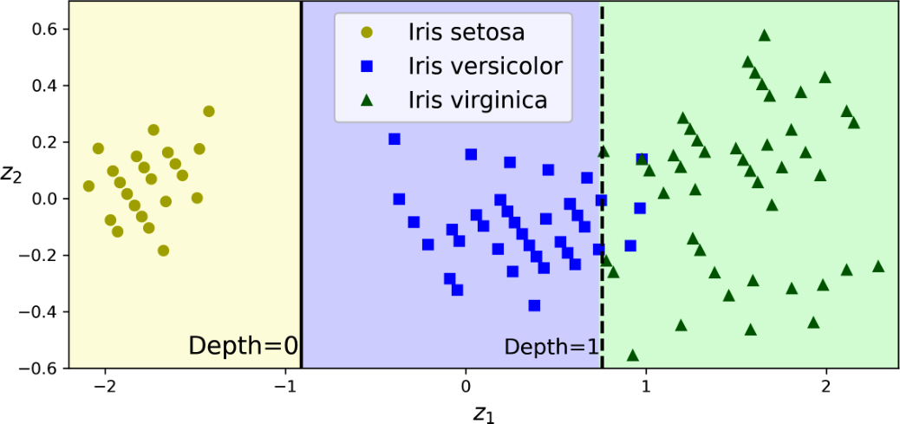

<!-- _class: cover -->
# 決策樹與SVM補充

第 6 週｜從可解釋的分割規則，走到模型邊界比較

課堂主線 180 分鐘（含兩次 10 分鐘休息）；「選讀」頁安排課後或替換同段內容

<!-- 講者提示：先讓學生說明本頁符號或圖形，再連結前後概念。圖表中的教材結果僅作來源示例，不能當作本班重跑結果。 -->

---
## 本週成果與三段安排

0–50 分：走訪決策樹、機率與不純度。

60–120 分：CART、正則化與迴歸樹。

130–180 分：穩定性、SVM 補充與模型比較。

能交付：一條預測路徑、一個分割計算，以及有理由的模型選擇。

<!-- notebook-companion-link -->
> 💻 **配套 Notebook**：[`06_決策樹與SVM補充.ipynb`](../programs/notebooks/06_決策樹與SVM補充.ipynb)。程式片段、實際圖表與表格可由此檔重現。

<!-- 講者提示：先讓學生說明本頁符號或圖形，再連結前後概念。圖表中的教材結果僅作來源示例，不能當作本班重跑結果。 -->

---
<!-- notebook-result-slide -->
<!-- _class: small -->
## 程式實驗與實際輸出

<div class="columns wide-left">
<div>

```python
DecisionTreeClassifier(max_depth=depth,
                       random_state=42).fit(X, y)
```

**觀察**：限制樹深會平滑決策邊界；是否改善泛化仍要看驗證結果。

[開啟完整 Notebook](../programs/notebooks/06_決策樹與SVM補充.ipynb)

</div>
<div>



</div>
</div>

<!-- 講者提示：程式與圖均來自 programs/notebooks/06_決策樹與SVM補充.ipynb 的已執行輸出；來源與改編界線見 Notebook。 -->
---
<!-- _class: figure -->
## 從根節點走到葉節點：Iris 決策樹



每次只回答一個特徵閾值問題；最終葉節點提供類別分布。

<!-- 講者提示：左支代表條件成立。圖中 samples 與 value 是教材訓練資料計數；不同版本 API 的 value 可能顯示比例。 -->

---
## 讀懂節點上的四種資訊

- 規則：例如花瓣長度是否小於等於 2.45 cm。
- `samples`：到達此節點的訓練樣本數。
- `value`：各類別的計數或比例，依顯示工具而異。
- `gini`：混雜程度；0 表示節點內只有一類。

<!-- 講者提示：先讓學生說明本頁符號或圖形，再連結前後概念。圖表中的教材結果僅作來源示例，不能當作本班重跑結果。 -->

---
<!-- _class: figure -->
## 樹把空間切成一塊一塊的區域



第一次分割作用於全區域；後續分割只作用於相應子區域。

<!-- 講者提示：先讓學生說明本頁符號或圖形，再連結前後概念。圖表中的教材結果僅作來源示例，不能當作本班重跑結果。 -->

---
## 葉節點的機率來自到達此處的樣本

若葉節點有 $[0,49,5]$ 共 54 筆，則

$$\hat p=(0,49/54,5/54)\approx(0,.907,.093)$$

輸出最多的類別；機率是區域內的訓練頻率估計，並非個體的確定性。

<!-- 講者提示：花瓣長 5、寬 1.5 的例子走到此葉。小葉的機率可能很極端且不穩定。 -->

---
<!-- _class: small -->
## 特徵型態與樹的資料準備

| 特徵型態 | 分割方式與準備 |
| --- | --- |
| 連續值 | 比較數值閾值；通常不需標準化 |
| 有序類別 | 編碼須保留原有順序，例如低、中、高 |
| 無序類別 | 通常先 one-hot；任意整數大小會引入假順序 |

scikit-learn 的一般決策樹不直接分割字串類別。部分設定支援缺失值，需確認模型與設定。

<!-- 講者提示：淺樹的白箱規則便於追蹤，但可讀性不等於因果解釋。缺失值的原生支援有 splitter／criterion 條件，預處理仍須放在訓練折內。API 依 sklearn 1.7 文件：https://scikit-learn.org/1.7/modules/tree.html -->

---
## Gini：隨機抽兩個標籤會多常不同？

$$G_i=1-\sum_{k=1}^K p_{i,k}^2$$

二元節點各一半時 $G=0.5$；單一類別時 $G=0$。

三類均等時 $G=2/3$，因此 Gini 的最大值不固定為 0.5。

<!-- 講者提示：先讓學生說明本頁符號或圖形，再連結前後概念。圖表中的教材結果僅作來源示例，不能當作本班重跑結果。 -->

---
## Entropy：標籤越難猜，資訊量越大

$$H_i=-\sum_{k:p_{i,k}>0}p_{i,k}\log_2p_{i,k}$$

約定 $0\log 0=0$。二元各一半時是 1 bit；單一類別是 0。

Gini 與 Entropy 常給出相近分割，但不保證完全相同。

<!-- 講者提示：先讓學生說明本頁符號或圖形，再連結前後概念。圖表中的教材結果僅作來源示例，不能當作本班重跑結果。 -->

---
<!-- _class: activity -->
## 手算：哪個節點比較純？

A 節點標籤數 `[4,0]`，B 為 `[2,2]`，C 為 `[3,1]`。

1. 各算 Gini 與 Entropy。
2. 用一句話解釋「純度」與「預測是否正確」的差別。

<!-- 講者提示：Gini：0、.5、.375；Entropy：0、1、.811278。純度只描述該節點訓練標籤，不能保證未來樣本正確。 -->

---
<!-- _class: small -->
## 建立一棵可閱讀的樹

```python
from sklearn.tree import DecisionTreeClassifier, export_text
tree = DecisionTreeClassifier(max_depth=2, random_state=42)
tree.fit(X_train, y_train)
print(export_text(tree, feature_names=feature_names))
proba = tree.predict_proba(X_test[:2])
```

先限制深度方便閱讀；正式選擇仍要比較驗證表現。

<!-- 講者提示：X_train 只放對應 feature_names 的欄位。類別機率欄順序查 classes_，不要假定標籤一定是 0,1,2。 -->

---
<!-- _class: activity -->
## 休息 10 分鐘

離開座位、休息眼睛。回來後先用一句話回答上一段的核心問題。

<!-- 講者提示：保留完整休息；不要用來補講延伸內容。 -->

---
## CART：挑選加權子節點不純度最小的分割

$$J(k,t_k)=\frac{m_L}{m}G_L+\frac{m_R}{m}G_R$$

在候選特徵 $k$ 與閾值 $t_k$ 中選最小值，再遞迴處理子節點。

這是貪婪的二元分割；每步最佳不代表整棵樹全域最佳。

<!-- 講者提示：先讓學生說明本頁符號或圖形，再連結前後概念。圖表中的教材結果僅作來源示例，不能當作本班重跑結果。 -->

---
<!-- _class: small -->
## 資訊增益與決策樹演算法

$$IG=H(\text{父})-\sum_c\frac{m_c}{m}H(c)$$

| 演算法 | 典型分割準則 | 需分清楚 |
| --- | --- | --- |
| ID3 | 資訊增益 | 偏好取值很多的屬性 |
| C4.5 | 增益比，校正分支資訊量 | 擴充 ID3，能處理連續屬性 |
| CART | 分類不純度或迴歸誤差 | 二元分割；不等於只准用 Gini |

`criterion="entropy"` 仍是 sklearn 的 CART 型二元樹，不會變成 ID3。

<!-- 講者提示：增益比為 IG 除以分支比例的 entropy；分母為零不作有效分割。原稿把 C4.5 和 ID3 的準則混寫，這裡分開。https://scikit-learn.org/1.7/modules/tree.html#tree-algorithms-id3-c4-5-c5-0-and-cart -->

---
## 訓練成本與預測成本

- 平衡樹深度約為 $\log_2m$，單筆預測約比較這麼多次。
- 教材估計訓練成本約 $O(nm\log m)$，$m$ 為樣本數、$n$ 為特徵數。
- 若樹極不平衡，預測需走過實際深度，不能一律套用對數時間。

一百萬筆資料的平衡樹約深 20 層；限制深度與候選特徵也能減少成本。

<!-- 講者提示：請學生用本頁的例子說明概念，再連結前後頁。 -->

---
<!-- _class: small -->
## 選讀｜手刻決策樹的遞迴流程

1. 檢查停止條件：標籤已純、到達深度上限或樣本太少。
2. 枚舉候選特徵與閾值，計算左右節點的加權不純度。
3. 保存最佳分割，分別對左右子集呼叫同一訓練程序。
4. 葉節點保存類別統計；預測時依規則逐層走訪。

可追讀 `03_Decision_Tree_from_scratch.py` 的 `fit`、`find_best_split`、`_get_prediction`，對照圖 5-1。

<!-- 講者提示：課後選讀或替換同段講解，不計入 180 分鐘課堂主線。實際檔案位於 programs/upstream/MachineLearning2025。手刻碼採 entropy；本頁保留演算法閱讀重點，並非將其視為已驗證的通用實作。 -->

---
<!-- _class: activity -->
## 算一次分割，不能只比較左右平均

父節點有 `[4,4]`，共 8 筆。

方案 A：左 `[3,0]`，右 `[1,4]`。
方案 B：左 `[2,2]`，右 `[2,2]`。

計算兩方案加權 Gini 與相對父節點的下降量。

<!-- 講者提示：父 Gini=.5。A 左0、右.32，加權3/8×0+5/8×.32=.2，下降.3；B 加權.5，下降0。分割應選A，注意權重是樣本數而非左右各半。 -->

---
<!-- _class: small -->
## 選讀｜原課程 80 筆資料的分割比較

父節點 `[40,40]`。A 分成 `[30,10]`、`[10,30]`；B 分成 `[20,40]`、`[20,0]`。

| 指標 | A | B |
| --- | ---: | ---: |
| 加權 Gini | 0.375 | 0.3333 |
| 加權 Entropy | 0.8113 | 0.6887 |
| 資訊增益 | 0.1887 | 0.3113 |

兩種準則都偏好 B。B 的左右權重為 60/80、20/80，不能各取一半。

<!-- 講者提示：課後選讀或替換同段講解，不計入 180 分鐘課堂主線。A 的左右各 40 筆。B 的純葉不會讓另一子節點也自動變純；檢查的是加權總和。 -->

---
<!-- _class: small -->
## 限制樹的成長：先控制葉節點有多少證據

| 參數 | 作用 | 加強正則化的方向 |
| --- | --- | --- |
| max_depth | 最大深度 | 調小 |
| min_samples_split | 允許分割的最少樣本數 | 調大 |
| min_samples_leaf | 葉節點最少樣本數 | 調大 |
| max_leaf_nodes | 葉節點數上限 | 調小 |

<!-- 講者提示：先讓學生說明本頁符號或圖形，再連結前後概念。圖表中的教材結果僅作來源示例，不能當作本班重跑結果。 -->

---
<!-- _class: small -->
## 其他停止條件與剪枝

| 設定 | 控制的內容 |
| --- | --- |
| min_weight_fraction_leaf | 葉節點最少權重占比 |
| min_impurity_decrease | 分割帶來的最小加權不純度下降 |
| max_features | 每次候選特徵數 |
| ccp_alpha | 後剪枝的成本複雜度強度；越大通常樹越小 |

預剪枝在生長時停止分割；後剪枝先長樹再移除子樹。兩者都要由訓練集內的驗證選擇。

<!-- 講者提示：非參數模型是參數數量不預先固定，不是沒有超參數。ccp_alpha 在訓練資料內用 CV 選擇。 -->

---
<!-- _class: figure -->
## 正則化前後：彎月資料的邊界


增加葉節點最少樣本數，可以減少為個別樣本切出的細碎區域。

<!-- 講者提示：先讓學生說明本頁符號或圖形，再連結前後概念。圖表中的教材結果僅作來源示例，不能當作本班重跑結果。 -->

---
## 迴歸樹：葉節點改成輸出數值平均

$$\hat y_{\rm node}=\frac1{m_{\rm node}}\sum_{i\in\rm node}y^{(i)}$$

在平方誤差目標下，葉內平均值最小化該葉的總平方殘差。

輸出通常是分段常數；不會自然外插出向上延伸的直線。

<!-- 講者提示：先讓學生說明本頁符號或圖形，再連結前後概念。圖表中的教材結果僅作來源示例，不能當作本班重跑結果。 -->

---
<!-- _class: figure -->
## 讀迴歸樹：追蹤規則與葉內平均



每個葉節點顯示預測平均值及其平方誤差；不再顯示類別 Gini。

<!-- 講者提示：先讓學生說明本頁符號或圖形，再連結前後概念。圖表中的教材結果僅作來源示例，不能當作本班重跑結果。 -->

---
## CART 迴歸目標：比較子節點的加權 MSE

$$J(k,t_k)=\frac{m_L}{m}\operatorname{MSE}_L+\frac{m_R}{m}\operatorname{MSE}_R$$

$$\operatorname{MSE}_{\rm node}=\frac1{m_{\rm node}}\sum_{i\in\rm node}(y^{(i)}-\hat y_{\rm node})^2$$

<!-- 講者提示：這裡平均與權重配合，使目標等同全部樣本的平方誤差平均。 -->

---
<!-- _class: figure -->
## 增加深度：階梯更細，表達能力更強



深度增加可降低訓練誤差，也可能開始追逐雜訊。

<!-- 講者提示：先讓學生說明本頁符號或圖形，再連結前後概念。圖表中的教材結果僅作來源示例，不能當作本班重跑結果。 -->

---
<!-- _class: figure -->
## 迴歸樹也需要正則化


限制最小葉樣本數，能減少尖銳、短促的階梯。

<!-- 講者提示：先讓學生說明本頁符號或圖形，再連結前後概念。圖表中的教材結果僅作來源示例，不能當作本班重跑結果。 -->

---
<!-- _class: activity -->
## 迴歸葉節點：為什麼預測平均值？

同一葉中的目標是 `[1, 2, 6]`。

比較預測 2、3、4 的 MSE，找出最佳值。

再討論：如果損失改成絕對誤差，最佳常數會改成什麼？

<!-- 講者提示：平均=3；三個 MSE 分別 17/3、14/3、17/3。絕對誤差以中位數2最小。這說明輸出規則取決於損失。 -->

---
<!-- _class: activity -->
## 休息 10 分鐘

離開座位、休息眼睛。回來後先用一句話回答上一段的核心問題。

<!-- 講者提示：保留完整休息；不要用來補講延伸內容。 -->

---
<!-- _class: figure -->
## 座標軸方向會影響樹的複雜度



樹的分割通常平行於特徵軸；旋轉資料後，原本簡單的斜線可能需很多階梯。

<!-- 講者提示：先讓學生說明本頁符號或圖形，再連結前後概念。圖表中的教材結果僅作來源示例，不能當作本班重跑結果。 -->

---
<!-- _class: figure -->
## PCA 旋轉後，樹可能更容易分割



縮放與旋轉不同：單調縮放通常保持排序，旋轉會改變分割方向。

<!-- 講者提示：若採 PCA，必須把 PCA 與樹一起放入交叉驗證；不可先對全資料 fit。 -->

---
<!-- _class: figure -->
## 相同資料重訓，也可能得到不同的樹


圖 5-9 使用相同資料重訓，隨機選擇可能改變規則；資料小幅變動也會放大差異。

固定 random_state 有助重現；下一週以多棵不同的樹降低變異。

<!-- 講者提示：先讓學生說明本頁符號或圖形，再連結前後概念。圖表中的教材結果僅作來源示例，不能當作本班重跑結果。 -->

---
## 補充 SVM：用間隔比較不同的分隔面

$$f(x)=w^Tx+b,\qquad\hat y=\operatorname{sign}(f(x))$$

線性可分時，將邊界兩側最近點的函數間隔規範為 $\pm1$，兩條支持超平面距離為 $2/\|w\|$。

<!-- 講者提示：y 使用 -1,+1；支持向量是影響邊界的樣本，不是所有資料平均。 -->

---
## 補充 SVM：軟間隔與 hinge loss

$$\min_{w,b}\frac12\|w\|^2+C\sum_i\max(0,1-y^{(i)}f(x^{(i)}))$$

$C$ 越大，越重視違反間隔的代價；越小，越容許違反以換取較大間隔。

特徵尺度會改變距離與懲罰，通常要先標準化。

<!-- 講者提示：hinge 非零不一定分類錯：位於正確側但在 margin 內也有損失。 -->

---
<!-- _class: small -->
## 補充 SVM：分對仍可能有損失

令 $u=yf(x)$，hinge loss 為 $\max(0,1-u)$，標籤 $y\in\{-1,+1\}$。

| $u$ | 預測與位置 | 損失 |
| --- | --- | ---: |
| 1.5 | 分對且超過間隔 | 0 |
| 0.4 | 分對但位於間隔內 | 0.6 |
| −0.5 | 分錯 | 1.5 |

軟間隔以鬆弛變數 $\xi_i\ge0$ 表示違反程度：$y_if(x_i)\ge1-\xi_i$。

<!-- 講者提示：請學生用本頁的例子說明概念，再連結前後頁。 -->

---
<!-- _class: small -->
## 補充 SVM：原始問題與對偶的關係

硬間隔：$\min\frac12\|w\|^2$，限制 $y_i(w^Tx_i+b)\ge1$。

對偶：$\max_a\sum_i a_i-\frac12\sum_{i,j}a_ia_jy_iy_jK(x_i,x_j)$。

限制 $a_i\ge0,\ \sum_i a_iy_i=0$；軟間隔再加 $a_i\le C$。

線性模型先用 $K(x_i,x_j)=x_i^Tx_j$；後面再以核函數替換內積。支持向量對應非零對偶係數。

<!-- 講者提示：先讓學生說明本頁符號或圖形，再連結前後概念。圖表中的教材結果僅作來源示例，不能當作本班重跑結果。 -->

---
## 選讀｜SVM 對偶如何得到預測函數

$$w=\sum_i a_i y_i x_i,\qquad f(x)=\sum_i a_i y_i K(x_i,x)+b$$

由拉格朗日函數對 $w,b$ 的一階條件，得到第一式與 $\sum_i a_i y_i=0$。

只有非零 $a_i$ 的支持向量參與預測；核技巧就在這個內積位置代入 $K$。

軟間隔中，$0<a_i<C$ 的點位於間隔邊界，可用來求 $b=y_i-\sum_j a_jy_jK(x_j,x_i)$。

<!-- 講者提示：課後選讀或替換同段講解，不計入 180 分鐘課堂主線。不要把所有支持向量都說成恰好落在 margin 上；a_i=C 的點可能違反間隔。 -->

---
## 補充 SVM：核函數與 RBF 的 gamma

$$K(x,z)=\phi(x)^T\phi(z),\qquad K_{\rm RBF}(x,z)=e^{-\gamma\|x-z\|^2}$$

核技巧以相似度取代顯式高維展開。$\gamma$ 越大，單點影響越局部，邊界可能更細碎。

<!-- 講者提示：gamma 與 C 需一起驗證；核 SVM 在大樣本時訓練成本可能高。 -->

---
<!-- _class: small -->
## 補充 SVM：多項式特徵與核技巧

對二維輸入，令 $\phi(x)=(x_1^2,\sqrt2x_1x_2,x_2^2)$，則

$$\phi(x)^T\phi(z)=(x^Tz)^2$$

$(1,1)$ 轉成 $(1,\sqrt2,1)$。XOR 可用 $x_1^2+x_2^2-2x_1x_2=0.5$ 分隔。

- 顯式展開：`PolynomialFeatures` 後接 `LinearSVC`。
- 核方法：`SVC(kernel="poly")`，直接算相似度。

展開方式、縮放與懲罰不同時，兩段程式不保證得到相同模型。

<!-- 講者提示：原稿公式已有 sqrt(2)，但 (1,1) 的映射數例寫成 (1,1,1)；正確為 (1,sqrt(2),1)。這裡統一公式與數例；RBF 與 polynomial 為主要範例，sigmoid kernel K(x,z)=tanh(γxᵀz+c) 僅列選讀，並非任意參數都給出有效的半正定核。 -->

---
<!-- _class: small -->
## 補充 SVM：多類別與模型比較

| 策略 | K 類需訓練的二元模型數 | 整合方式 |
| --- | ---: | --- |
| OvR，一對其餘 | $K$ | 比較各類分數 |
| OvO，一對一 | $K(K-1)/2$ | 成對比較後投票 |

`SVC` 採 OvO 訓練；`decision_function_shape="ovr"` 是分數輸出格式。

SVM 與 Logistic 都可能受離群點影響，須比較縮放、正則化與驗證結果。

<!-- 講者提示：https://scikit-learn.org/1.7/modules/generated/sklearn.svm.SVC.html 。避免沿用「SVM 不受離群點影響」的絕對說法。 -->

---
<!-- _class: small -->
## 選讀｜SVM 的次梯度與核參數實驗

$$J=\frac\lambda2\|w\|^2+\frac1m\sum_i\max(0,1-y_if_i)$$

$$\nabla_wJ=\lambda w-\frac1m\sum_{y_if_i<1}y_ix_i,\quad
\partial_bJ=-\frac1m\sum_{y_if_i<1}y_i$$

在折內標準化後，比較 `SVC(C=c, gamma=g)` 的 `c=[0.1,1,10]`、`g=[0.1,1,10]`。核的 `degree` 屬於 `SVC` 或 `PolynomialFeatures`，不是 `LinearSVC` 的參數。

<!-- 講者提示：課後選讀或替換同段講解，不計入 180 分鐘課堂主線。邊界 y_if_i=1 處取一個合法次梯度。若與 1/2||w||²+CΣhinge 比較，λ=1/(Cm)。不要混用總和與平均的學習率尺度。 -->

---
<!-- _class: small -->
## 三種分類模型的比較

| 模型 | 典型邊界 | 重要檢查 |
| --- | --- | --- |
| Logistic | 線性分數＋機率 | 正則化、校準、閾值 |
| SVM（補充） | 線性或核邊界 | 縮放、C、gamma；分數不等於機率 |
| 決策樹 | 軸平行分區 | 深度、葉樣本數、穩定性 |

<!-- 講者提示：先讓學生說明本頁符號或圖形，再連結前後概念。圖表中的教材結果僅作來源示例，不能當作本班重跑結果。 -->

---
<!-- _class: activity -->
## 比較實作：同一切分，兩種模型

使用同一份訓練與測試資料。

1. CV 比較樹深度 `[2,4,8,None]`。
2. 比較標準化 Logistic；八週版再加入標準化 SVM。
3. 除指標外，報告模型規則、錯誤案例與訓練時間。
4. 離線：解釋斜向邊界為何可能讓淺樹吃虧。

<!-- 講者提示：評分：同一資料切分、前處理在 CV 內、測試一次、有證據的邊界解釋。SVM 是補充，六週版移課後。 -->

---
## 離堂檢核與作業

1. CART 為何要依樣本數加權？
2. 為什麼葉節點很純，仍可能測試表現差？
3. 哪一種資料改動可能明顯改變樹的規則？

課後：Ch.5 練習 1–7；進階以多個抽樣子集比較樹的穩定性。

<!-- 講者提示：答案：各樣本權重一致；過度適配少量資料；資料抽樣／移除關鍵點／旋轉特徵。 -->
