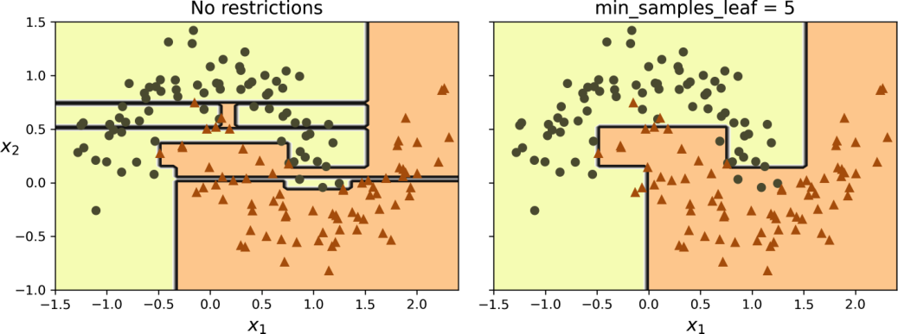
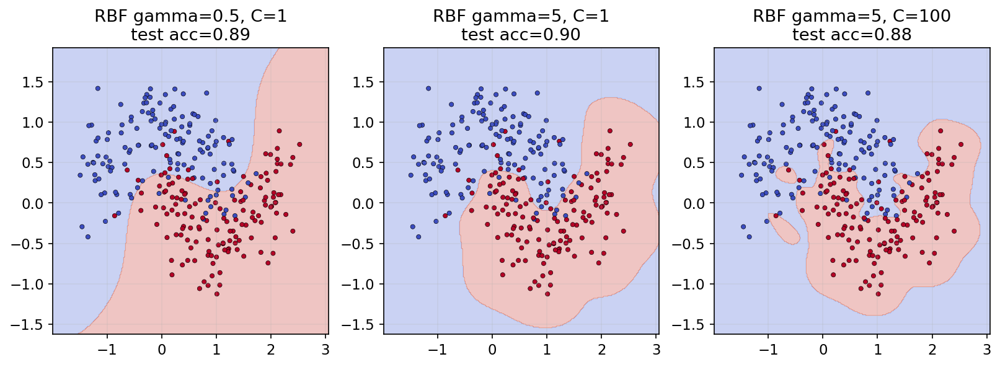

<!-- _class: cover -->
# 決策樹與支援向量機

第 6 週｜從可解釋的分割規則，走到最大間隔與非線性核方法

<!-- 講者提示：先讓學生說明本頁符號或圖形，再連結前後概念。圖表中的固定結果僅供讀圖，不能當作本班重跑結果。 -->

---
## 學習重點與成果

- 走訪決策樹、機率與不純度。

- CART、正則化與迴歸樹。

- 決策樹的穩定性與模型比較。

- SVM 的最大間隔、軟間隔、對偶問題與核方法。

能交付：一條預測路徑、一個分割計算，以及有理由的模型選擇。

<!-- notebook-companion-link -->
> 💻 **配套 Notebook**：`programs/notebooks/06_決策樹與SVM補充.ipynb`。程式片段、實際圖表與表格可由此檔重現。

<!-- 講者提示：先讓學生說明本頁符號或圖形，再連結前後概念。圖表中的固定結果僅供讀圖，不能當作本班重跑結果。 -->

<!-- Notebook 對照：程式 06-01、06-02；完整對照見本章 ipynb 開頭。 -->

---
<!-- _class: figure -->
## 從根節點走到葉節點：Iris 決策樹


每次只回答一個特徵閾值問題；最終葉節點提供類別分布。

<!-- 講者提示：左支代表條件成立。圖中 samples 與 value 是教材訓練資料計數；不同版本 API 的 value 可能顯示比例。 -->

<!-- Notebook 對照：程式 06-03；完整對照見本章 ipynb 開頭。圖例與小型實驗的資料、評估方式及適用範圍各自標示。 -->

---
## 讀懂節點上的四種資訊

- 規則：例如花瓣長度是否小於等於 2.45 cm。
- `samples`：到達此節點的訓練樣本數。
- `value`：各類別的計數或比例，依顯示工具而異。
- `gini`：混雜程度；0 表示節點內只有一類。

<!-- 講者提示：先讓學生說明本頁符號或圖形，再連結前後概念。圖表中的固定結果僅供讀圖，不能當作本班重跑結果。 -->

<!-- Notebook 對照：程式 06-03；完整對照見本章 ipynb 開頭。 -->

---
<!-- _class: figure -->
## 樹把空間切成一塊一塊的區域


第一次分割作用於全區域；後續分割只作用於相應子區域。

<!-- 講者提示：先讓學生說明本頁符號或圖形，再連結前後概念。圖表中的固定結果僅供讀圖，不能當作本班重跑結果。 -->

<!-- Notebook 對照：程式 06-08；完整對照見本章 ipynb 開頭。圖例與小型實驗的資料、評估方式及適用範圍各自標示。 -->

---
## 葉節點的機率來自到達此處的樣本

若葉節點有 $[0,49,5]$ 共 54 筆，則

$$\hat p=(0,49/54,5/54)\approx(0,.907,.093)$$

輸出最多的類別；機率是區域內的訓練頻率估計，並非個體的確定性。

<!-- 講者提示：花瓣長 5、寬 1.5 的例子走到此葉。小葉的機率可能很極端且不穩定。 -->

<!-- Notebook 對照：程式 06-03；完整對照見本章 ipynb 開頭。 -->

---
<!-- _class: small -->
## 特徵型態與樹的資料準備

| 特徵型態 | 分割方式與準備 |
| --- | --- |
| 連續值 | 比較數值閾值；通常不需標準化 |
| 有序類別 | 編碼須保留原有順序，例如低、中、高 |
| 無序類別 | 通常先 one-hot；任意整數大小會引入假順序 |

scikit-learn 的一般決策樹不直接分割字串類別。部分設定支援缺失值，需確認模型與設定。

<!-- 講者提示：淺樹的白箱規則便於追蹤，但可讀性不等於因果解釋。缺失值的原生支援有 splitter／criterion 條件，預處理仍須放在訓練折內。API 依 sklearn 1.7 文件：https://scikit-learn.org/1.7/modules/tree.html。 -->

<!-- Notebook 對照：程式 06-03；完整對照見本章 ipynb 開頭。 -->

---
## Gini：隨機抽兩個標籤會多常不同？

$$G_i=1-\sum_{k=1}^K p_{i,k}^2$$

二元節點各一半時 $G=0.5$；單一類別時 $G=0$。

三類均等時 $G=2/3$，因此 Gini 的最大值不固定為 0.5。

<!-- 講者提示：先讓學生說明本頁符號或圖形，再連結前後概念。圖表中的固定結果僅供讀圖，不能當作本班重跑結果。 -->

<!-- Notebook 對照：程式 06-04；完整對照見本章 ipynb 開頭。 -->

---
## Entropy：標籤越難猜，資訊量越大

$$H_i=-\sum_{k:p_{i,k}>0}p_{i,k}\log_2p_{i,k}$$

約定 $0\log 0=0$。二元各一半時是 1 bit；單一類別是 0。

Gini 與 Entropy 常給出相近分割，但不保證完全相同。

<!-- 講者提示：先讓學生說明本頁符號或圖形，再連結前後概念。圖表中的固定結果僅供讀圖，不能當作本班重跑結果。 -->

<!-- Notebook 對照：程式 06-04；完整對照見本章 ipynb 開頭。 -->

---
<!-- _class: activity -->
## 手算：哪個節點比較純？

A 節點標籤數 `[4,0]`，B 為 `[2,2]`，C 為 `[3,1]`。

1. 各算 Gini 與 Entropy。
2. 用一句話解釋「純度」與「預測是否正確」的差別。

<!-- 講者提示：Gini：0、.5、.375；Entropy：0、1、.811278。純度只描述該節點訓練標籤，不能保證未來樣本正確。 -->

<!-- Notebook 對照：程式 06-04；完整對照見本章 ipynb 開頭。 -->

---
<!-- _class: small -->
## 建立一棵可閱讀的樹

```python
from sklearn.tree import DecisionTreeClassifier, export_text
tree = DecisionTreeClassifier(max_depth=2, random_state=42)
tree.fit(X_train, y_train)
print(export_text(tree, feature_names=feature_names))
proba = tree.predict_proba(X_test[:2])
```

先限制深度方便閱讀；正式選擇仍要比較驗證表現。

<!-- 講者提示：X_train 只放對應 feature_names 的欄位。類別機率欄順序查 classes_，不要假定標籤一定是 0,1,2。 -->

<!-- Notebook 對照：程式 06-03；完整對照見本章 ipynb 開頭。 -->

---
<!-- _class: activity -->
## 分割計算：加權不純度

母節點有 $8$ 正例、$8$ 負例，Gini 不純度為 $1-(8/16)^2-(8/16)^2=0.5$。

若切成左節點 $(6,2)$、右節點 $(2,6)$：

- 每個子節點 Gini 都是 $1-(6/8)^2-(2/8)^2=0.375$。
- 加權子節點不純度是 $(8/16)0.375+(8/16)0.375=0.375$。
- 不純度下降 $0.5-0.375=0.125$；要與其他候選切點比較，不能只看單側。

<!-- 講者提示：先讓學生獨立檢核本頁的假設、公式與結論，再與相鄰的模型概念對照。 -->

---
## CART：挑選加權子節點不純度最小的分割

$$J(k,t_k)=\frac{m_L}{m}G_L+\frac{m_R}{m}G_R$$

在候選特徵 $k$ 與閾值 $t_k$ 中選最小值，再遞迴處理子節點。

這是貪婪的二元分割；每步最佳不代表整棵樹全域最佳。

<!-- 講者提示：先讓學生說明本頁符號或圖形，再連結前後概念。圖表中的固定結果僅供讀圖，不能當作本班重跑結果。 -->

<!-- Notebook 對照：程式 06-05、06-13；完整對照見本章 ipynb 開頭。 -->

---
<!-- _class: small -->
## 資訊增益與決策樹演算法

$$IG=H(\text{父})-\sum_c\frac{m_c}{m}H(c)$$

| 演算法 | 典型分割準則 | 需分清楚 |
| --- | --- | --- |
| ID3 | 資訊增益 | 偏好取值很多的屬性 |
| C4.5 | 增益比，校正分支資訊量 | 擴充 ID3，能處理連續屬性 |
| CART | 分類不純度或迴歸誤差 | 二元分割；不等於只准用 Gini |

`criterion="entropy"` 仍是 sklearn 的 CART 型二元樹，不會變成 ID3。

<!-- 講者提示：增益比為 IG 除以分支比例的 entropy；分母為零不作有效分割。ID3 使用資訊增益，C4.5 使用增益比，兩者分開說明。https://scikit-learn.org/1.7/modules/tree.html#tree-algorithms-id3-c4-5-c5-0-and-cart。 -->

<!-- Notebook 對照：程式 06-05、06-13；完整對照見本章 ipynb 開頭。 -->

---
## 訓練成本與預測成本

- 平衡樹深度約為 $\log_2m$，單筆預測約比較這麼多次。
- 教材估計訓練成本約 $O(nm\log m)$，$m$ 為樣本數、$n$ 為特徵數。
- 若樹極不平衡，預測需走過實際深度，不能一律套用對數時間。

一百萬筆資料的平衡樹約深 20 層；限制深度與候選特徵也能減少成本。

<!-- 講者提示：請學生用本頁的例子說明概念，再連結前後頁。 -->

<!-- Notebook 對照：程式 06-13；完整對照見本章 ipynb 開頭。 -->

---
<!-- _class: small -->
## 選讀｜手刻決策樹的遞迴流程

1. 檢查停止條件：標籤已純、到達深度上限或樣本太少。
2. 枚舉候選特徵與閾值，計算左右節點的加權不純度。
3. 保存最佳分割，分別對左右子集呼叫同一訓練程序。
4. 葉節點保存類別統計；預測時依規則逐層走訪。

可追讀 `03_Decision_Tree_from_scratch.py` 的 `fit`、`find_best_split`、`_get_prediction`，對照圖 5-1。

<!-- 講者提示：手刻碼採 entropy；本頁著重演算法閱讀，不將簡化程式視為已驗證的通用實作。 -->

<!-- Notebook 對照：程式 06-13；完整對照見本章 ipynb 開頭。 -->

---
<!-- _class: activity -->
## 算一次分割，不能只比較左右平均

父節點有 `[4,4]`，共 8 筆。

方案 A：左 `[3,0]`，右 `[1,4]`。
方案 B：左 `[2,2]`，右 `[2,2]`。

計算兩方案加權 Gini 與相對父節點的下降量。

<!-- 講者提示：父 Gini=.5。A 左0、右.32，加權3/8×0+5/8×.32=.2，下降.3；B 加權.5，下降0。分割應選A，注意權重是樣本數而非左右各半。 -->

<!-- Notebook 對照：程式 06-05、06-13；完整對照見本章 ipynb 開頭。 -->

---
<!-- _class: small -->
## 選讀｜80 筆資料的分割比較

父節點 `[40,40]`。A 分成 `[30,10]`、`[10,30]`；B 分成 `[20,40]`、`[20,0]`。

| 指標 | A | B |
| --- | ---: | ---: |
| 加權 Gini | 0.375 | 0.3333 |
| 加權 Entropy | 0.8113 | 0.6887 |
| 資訊增益 | 0.1887 | 0.3113 |

兩種準則都偏好 B。B 的左右權重為 60/80、20/80，不能各取一半。

<!-- 講者提示：A 的左右各 40 筆。B 的純葉不會讓另一子節點也自動變純；檢查的是加權總和。 -->

<!-- Notebook 對照：程式 06-13；完整對照見本章 ipynb 開頭。 -->

---
<!-- _class: small -->
## 限制樹的成長：先控制葉節點有多少證據

| 參數 | 作用 | 加強正則化的方向 |
| --- | --- | --- |
| max_depth | 最大深度 | 調小 |
| min_samples_split | 允許分割的最少樣本數 | 調大 |
| min_samples_leaf | 葉節點最少樣本數 | 調大 |
| max_leaf_nodes | 葉節點數上限 | 調小 |

<!-- 講者提示：先讓學生說明本頁符號或圖形，再連結前後概念。圖表中的固定結果僅供讀圖，不能當作本班重跑結果。 -->

<!-- Notebook 對照：程式 06-06；完整對照見本章 ipynb 開頭。 -->

---
<!-- _class: small -->
## 其他停止條件與剪枝

| 設定 | 控制的內容 |
| --- | --- |
| min_weight_fraction_leaf | 葉節點最少權重占比 |
| min_impurity_decrease | 分割帶來的最小加權不純度下降 |
| max_features | 每次候選特徵數 |
| ccp_alpha | 後剪枝的成本複雜度強度；越大通常樹越小 |

預剪枝在生長時停止分割；後剪枝先長樹再移除子樹。兩者都要由訓練集內的驗證選擇。

**先預測**：增加 `min_samples_leaf` 後，細碎區域與訓練 accuracy 會怎麼變？測試 accuracy 是否一定提高？

<!-- 講者提示：非參數模型是參數數量不預先固定，不是沒有超參數。ccp_alpha 在訓練資料內用 CV 選擇。 -->

<!-- Notebook 對照：程式 06-06；完整對照見本章 ipynb 開頭。 -->

---

<!-- _class: small -->
## 比較葉節點限制前後的彎月邊界

<div class="columns">
<div>



教材圖：增加葉節點最少樣本數，減少細碎區域。

</div>
<div>


Notebook 圖：同一切分，比較無限制與 `min_samples_leaf=20`。

</div>
</div>

點與背景色分別表示訓練標籤與模型預測；兩軸是合成特徵。限制後訓練 accuracy 較低，本次測試 accuracy 較高，不能只憑邊界較簡單宣稱泛化改善。

參考程式：`programs/notebooks/06_決策樹與SVM補充.ipynb`

<!-- 講者提示：前頁先預測限制的影響，再看圖上 train／test 數字。Notebook 實際比較 min_samples_leaf，不是 max_depth；核心片段為 DecisionTreeClassifier(min_samples_leaf=20, random_state=42).fit(Xmtr, ymtr)。左圖是教材實驗，右圖是另一次合成彎月切分，數字不可混用。右圖測試結果只描述既有這次比較，正式選超參數要在訓練資料內用驗證，不能反覆依測試集挑設定。 -->

<!-- Notebook 對照：程式 06-06；以程式代碼定位配套 Notebook。 -->

---
## 迴歸樹：葉節點改成輸出數值平均

$$\hat y_{\rm node}=\frac1{m_{\rm node}}\sum_{i\in\rm node}y^{(i)}$$

在平方誤差目標下，葉內平均值最小化該葉的總平方殘差。

輸出通常是分段常數；不會自然外插出向上延伸的直線。

<!-- 講者提示：先讓學生說明本頁符號或圖形，再連結前後概念。圖表中的固定結果僅供讀圖，不能當作本班重跑結果。 -->

<!-- Notebook 對照：程式 06-07；完整對照見本章 ipynb 開頭。 -->

---
<!-- _class: figure -->
## 讀迴歸樹：追蹤規則與葉內平均


每個葉節點顯示預測平均值及其平方誤差；不再顯示類別 Gini。

<!-- 講者提示：先讓學生說明本頁符號或圖形，再連結前後概念。圖表中的固定結果僅供讀圖，不能當作本班重跑結果。 -->

<!-- Notebook 對照：程式 06-08；完整對照見本章 ipynb 開頭。圖例與小型實驗的資料、評估方式及適用範圍各自標示。 -->

---
## CART 迴歸目標：比較子節點的加權 MSE

$$J(k,t_k)=\frac{m_L}{m}\operatorname{MSE}_L+\frac{m_R}{m}\operatorname{MSE}_R$$

$$\operatorname{MSE}_{\rm node}=\frac1{m_{\rm node}}\sum_{i\in\rm node}(y^{(i)}-\hat y_{\rm node})^2$$

<!-- 講者提示：這裡平均與權重配合，使目標等同全部樣本的平方誤差平均。 -->

<!-- Notebook 對照：程式 06-07；完整對照見本章 ipynb 開頭。 -->

---
<!-- _class: figure -->
## 增加深度：階梯更細，表達能力更強


深度增加可降低訓練誤差，也可能開始追逐雜訊。

<!-- 講者提示：先讓學生說明本頁符號或圖形，再連結前後概念。圖表中的固定結果僅供讀圖，不能當作本班重跑結果。 -->

<!-- Notebook 對照：程式 06-07；完整對照見本章 ipynb 開頭。圖例與小型實驗的資料、評估方式及適用範圍各自標示。 -->

---
<!-- _class: figure -->
## 迴歸樹也需要正則化


限制最小葉樣本數，能減少尖銳、短促的階梯。

<!-- 講者提示：先讓學生說明本頁符號或圖形，再連結前後概念。圖表中的固定結果僅供讀圖，不能當作本班重跑結果。 -->

<!-- Notebook 對照：程式 06-08；完整對照見本章 ipynb 開頭。圖例與小型實驗的資料、評估方式及適用範圍各自標示。 -->

---
<!-- _class: activity -->
## 迴歸葉節點：為什麼預測平均值？

同一葉中的目標是 `[1, 2, 6]`。

比較預測 2、3、4 的 MSE，找出最佳值。

再討論：如果損失改成絕對誤差，最佳常數會改成什麼？

<!-- 講者提示：平均=3；三個 MSE 分別 17/3、14/3、17/3。絕對誤差以中位數2最小。這說明輸出規則取決於損失。 -->

<!-- Notebook 對照：程式 06-07；完整對照見本章 ipynb 開頭。 -->

---
<!-- _class: activity -->
## 迴歸樹的葉節點為何用平均值？

葉節點含目標值 $2,4,9$，若以常數 $c$ 預測並最小化平方誤差：

$$L(c)=(2-c)^2+(4-c)^2+(9-c)^2$$

令導數 $L'(c)=6c-30=0$，得 $c=5$。平均值最小化葉內平方誤差；若改用絕對誤差，最佳常數通常是中位數 $4$。

<!-- 講者提示：先讓學生獨立檢核本頁的假設、公式與結論，再與相鄰的模型概念對照。 -->

---
<!-- _class: figure -->
## 座標軸方向會影響樹的複雜度


樹的分割通常平行於特徵軸；旋轉資料後，原本簡單的斜線可能需很多階梯。

<!-- 講者提示：先讓學生說明本頁符號或圖形，再連結前後概念。圖表中的固定結果僅供讀圖，不能當作本班重跑結果。 -->

<!-- Notebook 對照：程式 06-10、06-09；完整對照見本章 ipynb 開頭。圖例與小型實驗的資料、評估方式及適用範圍各自標示。 -->

---
<!-- _class: figure -->
## PCA 旋轉後，樹可能更容易分割


縮放與旋轉不同：單調縮放通常保持排序，旋轉會改變分割方向。

<!-- 講者提示：若採 PCA，必須把 PCA 與樹一起放入交叉驗證；不可先對全資料 fit。 -->

<!-- Notebook 對照：程式 06-10、06-09；完整對照見本章 ipynb 開頭。圖例與小型實驗的資料、評估方式及適用範圍各自標示。 -->

---
<!-- _class: figure -->
## 相同資料重訓，也可能得到不同的樹


圖 5-9 使用相同資料重訓，隨機選擇可能改變規則；資料小幅變動也會放大差異。

固定 random_state 有助重現；下一週以多棵不同的樹降低變異。

<!-- 講者提示：先讓學生說明本頁符號或圖形，再連結前後概念。圖表中的固定結果僅供讀圖，不能當作本班重跑結果。 -->

<!-- Notebook 對照：程式 06-10、06-09；完整對照見本章 ipynb 開頭。圖例與小型實驗的資料、評估方式及適用範圍各自標示。 -->

---
<!-- _class: lead -->
## 第二部分：支援向量機

SVM 是本週的正式教材。學習路徑由幾何直覺進入最佳化，再延伸至非線性核方法。

1. 超平面、距離與最大間隔。
2. 軟間隔、hinge loss 與懲罰權重 $C$。
3. 對偶問題、支持向量與核函數。

<!-- 講者提示：本段對應 source_pptx/03_SVM_DecistionTree_RandomForest.pptx 第 2–29 頁，重新組織為可完整教學的主線。 -->

---
## 超平面與特徵空間

輸入 $x\in\mathbb{R}^d$，線性分類邊界為

$$\mathcal P=\{x:w^Tx+b=0\},\qquad \hat y=\operatorname{sign}(w^Tx+b)$$

- $w$ 是超平面的法向量。
- $d=2$ 時邊界是直線，$d=3$ 時是平面，$d>3$ 時稱為超平面。
- 核 SVM 把 $x$ 映射為 $\phi(x)$，再於高維或無限維特徵空間尋找超平面。

`hyperplane` 是邊界，`feature space` 是映射後的空間。「hyper space」不是本單元的標準術語。

<!-- 講者提示：超平面的維度是 d-1。參考 scikit-learn SVM mathematical formulation：https://scikit-learn.org/stable/modules/svm.html#mathematical-formulation。 -->

---
## 函數間隔與幾何間隔

對標籤 $y_i\in\{-1,+1\}$ 與分數 $f(x)=w^Tx+b$：

$$\text{函數間隔}=y_if(x_i),\qquad
\text{幾何間隔}=\frac{y_if(x_i)}{\|w\|}$$

點 $x$ 到決策邊界的距離為

$$\operatorname{dist}(x,\mathcal P)=\frac{|w^Tx+b|}{\|w\|}$$

同時將 $(w,b)$ 乘上正常數不會改變邊界，卻會改變函數間隔。除以 $\|w\|$ 後才得到不受縮放影響的幾何距離。

<!-- 講者提示：可讓學生比較 (w,b) 與 (10w,10b)，決策面不變，函數間隔放大 10 倍。 -->

<!-- Notebook 對照：程式 06-14；完整對照見本章 ipynb 開頭。 -->

---
## 硬間隔 SVM 的目標函數

線性可分時，將最近點規範為 $y_if(x_i)=1$：

$$\min_{w,b}\frac12\|w\|^2
\quad\text{subject to}\quad y_i(w^Tx_i+b)\ge1$$

兩條間隔邊界是 $w^Tx+b=+1$ 與 $-1$，它們之間的寬度為

$$\frac{2}{\|w\|}$$

因此最小化 $\|w\|^2$ 等價於最大化間隔。達到等式的訓練點是支持向量。

<!-- 講者提示：決策邊界在 0，間隔邊界在 ±1。不要把「間隔寬度」說成點到決策面的單邊距離，單邊距離是 1/||w||。 -->

<!-- Notebook 對照：程式 06-14；完整對照見本章 ipynb 開頭。 -->

---
## 軟間隔：允許可控制的違規

$$\min_{w,b,\xi}\frac12\|w\|^2+C\sum_{i=1}^{m}\xi_i$$

$$\text{subject to}\quad y_i(w^T\phi(x_i)+b)\ge1-\xi_i,\qquad \xi_i\ge0$$

$\xi_i$ 記錄第 $i$ 點跨入間隔或跨過決策邊界的程度。$C$ 權衡間隔寬度與違規懲罰。

消去 $\xi_i$ 後，目標可寫成 hinge loss 形式：

$$\min_{w,b}\frac12\|w\|^2+C\sum_i\max(0,1-y_if(x_i))$$

<!-- 講者提示：軟間隔與 hinge 形式的對應為 xi_i=max(0,1-y_if_i)。原始論文：Cortes & Vapnik, 1995, https://doi.org/10.1007/BF00994018。 -->

<!-- Notebook 對照：程式 06-11、06-14；完整對照見本章 ipynb 開頭。 -->

---
<!-- _class: small -->
## 懲罰權重 $C$ 如何改變模型

| $C$ | 正則化力量 | 間隔與違規 | 常見風險 |
| --- | --- | --- | --- |
| 小 | 強 | 傾向較寬間隔，容許較多違規 | 過度平滑、欠擬合 |
| 大 | 弱 | 更重視單點懲罰，傾向縮窄間隔 | 邊界對雜訊敏感、過擬合 |

- $C$ 是全局懲罰尺度，不是單純的「準確率旋鈕」。
- `class_weight` 改變各類別的相對懲罰，`sample_weight` 可改變單筆樣本的相對懲罰。
- 特徵尺度會改變距離與 $\|w\|$，SVM 通常要在 Pipeline 內標準化。

<!-- 講者提示：scikit-learn 定義 C 的正則化強度與 C 成反比；class_weight[i] 會將第 i 類的 C 乘上對應權重。https://scikit-learn.org/stable/modules/generated/sklearn.svm.SVC.html。 -->

---
<!-- _class: small -->
## Hinge loss：分對仍可能有損失

令 $u=yf(x)$，hinge loss 為 $\ell(u)=\max(0,1-u)$。

| $u$ | 預測與位置 | $\ell(u)$ | $\xi$ |
| ---: | --- | ---: | ---: |
| 1.5 | 分對且超過間隔 | 0 | 0 |
| 1.0 | 位於間隔邊界 | 0 | 0 |
| 0.4 | 分對但位於間隔內 | 0.6 | 0.6 |
| 0 | 位於決策邊界 | 1 | 1 |
| −0.5 | 分錯 | 1.5 | 1.5 |

分類錯誤只看 $u<0$，hinge 還懲罰 $0<u<1$ 的「分對但不夠安全」樣本。

<!-- 講者提示：原始 PPTX 第 19–20 頁的三種狀態在此改為同一個 u 軸上的可驗算表格。 -->

<!-- Notebook 對照：程式 06-14；完整對照見本章 ipynb 開頭。 -->

---
<!-- _class: small -->
## 從原始問題建立拉格朗日函數

令 $\phi_i=\phi(x_i)$，並對軟間隔的兩組限制引入 $\alpha_i\ge0$ 與 $\mu_i\ge0$：

$$\begin{aligned}
L(w,b,\xi,\alpha,\mu)
=&\frac12\|w\|^2+C\sum_i\xi_i\\
&-\sum_i\alpha_i[y_i(w^T\phi_i+b)-1+\xi_i]
-\sum_i\mu_i\xi_i
\end{aligned}$$

原始問題對 $(w,b,\xi)$ 最小化。對偶問題改為對 $(\alpha,\mu)$ 最大化可保證的下界。

<!-- 講者提示：此處使用 phi_i=phi(x_i) 縮短公式。SVM 目標是凸二次規劃，對偶化後只留下樣本間內積。參考 Cortes & Vapnik 1995 與 https://scikit-learn.org/stable/modules/svm.html#svc。 -->

---
## 一階條件消去 $w$、$b$ 與 $\xi$

$$\frac{\partial L}{\partial w}=0
\quad\Rightarrow\quad
w=\sum_i\alpha_i y_i\phi(x_i)$$

$$\frac{\partial L}{\partial b}=0
\quad\Rightarrow\quad
\sum_i\alpha_i y_i=0$$

$$\frac{\partial L}{\partial\xi_i}=0
\quad\Rightarrow\quad
C-\alpha_i-\mu_i=0
\quad\Rightarrow\quad 0\le\alpha_i\le C$$

最後一個上界是軟間隔與硬間隔對偶問題的關鍵差異。

<!-- 講者提示：mu_i>=0 與 alpha_i+mu_i=C 同時給出 alpha_i<=C。原始 PPTX 第 14–16 頁展示了這組一階條件。 -->

---
<!-- _class: small -->
## SVM 的對偶問題

$$\max_{\alpha}\quad
\sum_i\alpha_i-\frac12\sum_{i,j}\alpha_i\alpha_jy_iy_jK(x_i,x_j)$$

$$\text{subject to}\quad 0\le\alpha_i\le C,\qquad \sum_i\alpha_i y_i=0$$

對偶二次項矩陣 $Q$ 的元素為 $Q_{ij}=y_iy_jK(x_i,x_j)$。對偶目標只通過內積比較樣本，所以可將 $\phi(x_i)^T\phi(x_j)$ 直接替換為 $K(x_i,x_j)$，不必顯式建立高維特徵。

<!-- 講者提示：scikit-learn 文件把同一對偶寫成最小化 1/2 alpha^T Q alpha - e^T alpha，與本頁最大化形式等價。https://scikit-learn.org/stable/modules/svm.html#svc。 -->

<!-- Notebook 對照：程式 06-14；完整對照見本章 ipynb 開頭。 -->

---
<!-- _class: small -->
## KKT 條件解釋哪些點會支撐邊界

| $\alpha_i$ | 典型位置 | 對預測的影響 |
| ---: | --- | --- |
| $0$ | 間隔外，$y_if_i>1$ | 不出現在核展開中 |
| $0<\alpha_i<C$ | 間隔邊界，$y_if_i=1$ | 支持向量，可用來求 $b$ |
| $\alpha_i=C$ | 可能位於間隔內或分類錯誤 | 支持向量，違規懲罰已達上界 |

$$f(x)=\sum_{i\in SV}\alpha_i y_iK(x_i,x)+b$$

只有 $\alpha_i>0$ 的支持向量出現在 `decision_function`。`dual_coef_` 儲存的是含標籤符號的對偶係數。

<!-- 講者提示：表格是非退化情況下的典型解釋。alpha_i=C 不代表一定分錯，它也可能只是位於間隔內。 -->

<!-- Notebook 對照：程式 06-14 以 support_vectors_、dual_coef_ 與 intercept_ 手算 decision_function。 -->

---
## 特徵映射與核技巧

$$\phi:\mathcal X\rightarrow\mathcal H,\qquad
K(x,z)=\langle\phi(x),\phi(z)\rangle_{\mathcal H}$$

在特徵空間 $\mathcal H$ 中使用線性超平面，映回原始輸入空間後可形成非線性邊界。

對有限訓練集，Gram 矩陣 $G_{ij}=K(x_i,x_j)$ 應為對稱半正定，才能對應內積幾何與凸對偶問題。

核技巧的重點是直接計算 $K(x,z)$，而不是先建立巨大的 $\phi(x)$。

<!-- 講者提示：原始 PPTX 第 24、26、27 頁使用二維映射三維的例子。scikit-learn 對偶式也明列 Q 為半正定矩陣：https://scikit-learn.org/stable/modules/svm.html#svc。 -->

---
<!-- _class: activity -->
## 多項式核的空間轉換影片

原始 PPTX 第 25 頁嵌入的 HD 影片：

### [SVM with polynomial kernel visualization (HD)](https://www.youtube.com/watch?v=OdlNM96sHio)

觀看時請記錄：

1. 原始二維資料為什麼無法用直線分開？
2. 新特徵 $z=x^2+y^2$ 如何將資料抬到三維？
3. 三維平面映回二維後，邊界變成什麼形狀？

<!-- 講者提示：影片作者 udiprod，2021 年 HD 重製版。影片說明使用 phi([x,y])=[x,y,x^2+y^2]。PPTX 內的原始關聯目標為 https://www.youtube.com/embed/OdlNM96sHio?feature=oembed。 -->

---
<!-- _class: small -->
## `SVC` 內建的四種核函數

| `kernel` | $K(x,z)$ | 主要參數 | 典型用法 |
| --- | --- | --- | --- |
| `linear` | $x^Tz$ | $C$ | 高維稀疏特徵、可解釋權重 |
| `poly` | $(\gamma x^Tz+r)^d$ | $C,\gamma,d,r$ | 指定階數的特徵交互 |
| `rbf` | $e^{-\gamma\|x-z\|^2}$ | $C,\gamma$ | 一般非線性邊界，常作為起點 |
| `sigmoid` | $\tanh(\gamma x^Tz+r)$ | $C,\gamma,r$ | 類似神經元激活，須特別驗證參數 |

scikit-learn 以 `degree=d`、`coef0=r` 與 `gamma=γ` 命名公式中的參數。

<!-- 講者提示：SVC 內建選項與公式來自 https://scikit-learn.org/stable/modules/svm.html#kernel-functions 與 https://scikit-learn.org/stable/modules/generated/sklearn.svm.SVC.html。 -->

---
<!-- _class: small -->
## 自訂與預計算核的延伸

| 核函數 | 公式或用法 | 適合情境 |
| --- | --- | --- |
| Laplacian | $e^{-\gamma\|x-z\|_1}$ | 希望使用 L1 差異，對特徵差異的反應與 RBF 不同 |
| $\chi^2$ | $e^{-\gamma\sum_j (x_j-z_j)^2/(x_j+z_j)}$ | 非負的頻數或直方圖特徵 |
| cosine | $x^Tz/(\|x\|\|z\|)$ | 方向比長度更重要的特徵 |
| precomputed | 直接提供 Gram 矩陣 | 已有可驗證的相似度或領域核 |

`SVC` 可接受 callable 或 `kernel="precomputed"`。自訂核必須對訓練與測試使用一致的 Gram 定義。

<!-- 講者提示：scikit-learn 的 pairwise_kernels 另列 additive_chi2、chi2、laplacian、cosine 等核，這些不是 SVC kernel 參數的內建字串，應以 callable 或 precomputed 方式傳入。https://scikit-learn.org/stable/modules/metrics.html#pairwise-metrics-affinities-and-kernels。 -->

---
<!-- _class: small -->
## 多項式特徵與核技巧

對二維輸入，令 $\phi(x)=(x_1^2,\sqrt2x_1x_2,x_2^2)$，則

$$\phi(x)^T\phi(z)=(x^Tz)^2$$

$(1,1)$ 轉成 $(1,\sqrt2,1)$。對 XOR 四點，可在特徵空間使用

$$-x_1^2+2x_1x_2-x_2^2+0.5=0$$

分開兩類。顯式展開可用 `PolynomialFeatures` 後接線性 SVM，核方法則使用 `SVC(kernel="poly")`。

<!-- 講者提示：上式可寫成 (x1-x2)^2=0.5。顯式展開與核方法若使用不同縮放、bias 特徵或懲罰，不保證得到完全相同的模型。 -->

<!-- Notebook 對照：程式 06-14 計算二次多項式核矩陣。 -->

---
## RBF 核的 $\gamma$ 決定影響範圍

$$K_{\rm RBF}(x,z)=\exp(-\gamma\|x-z\|^2),\qquad
\gamma=\frac{1}{2\sigma^2}$$

- $\gamma$ 小：相似度隨距離下降較慢，單點影響範圍較大，邊界通常較平滑。
- $\gamma$ 大：只有很靠近的點仍相似，邊界可能變得細碎。
- `gamma="scale"` 使用 $1/(d\operatorname{Var}(X))$，仍要與 $C$ 一起經交叉驗證比較。

特徵未縮放時，大數值特徵會主導 $\|x-z\|^2$，讓 $\gamma$ 難以解釋。

<!-- 講者提示：參考 https://scikit-learn.org/stable/modules/svm.html#parameters-of-the-rbf-kernel。官方建議以指數尺度的 C 與 gamma 網格開始搜尋。 -->

<!-- Notebook 對照：程式 06-11、06-14；完整對照見本章 ipynb 開頭。 -->

---
<!-- _class: figure -->
## $C$ 與 $\gamma$ 需要一起觀察



這次固定切分中，$(\gamma,C)=(5,100)$ 產生較細碎的邊界，測試正確率反而低於 $(5,1)$。單次測試分數只能解讀這次實驗，調參應改用訓練折內交叉驗證。

<!-- 講者提示：圖由 programs/notebooks/06_決策樹與SVM補充.ipynb 程式 06-11 實際產生。不從三個 test 分數中選最佳設定。 -->

<!-- Notebook 對照：程式 06-11；完整對照見本章 ipynb 開頭。 -->

---
<!-- _class: small -->
## 程式實作：核函數、$C$ 與 $\gamma$

```python
from sklearn.pipeline import make_pipeline
from sklearn.preprocessing import StandardScaler
from sklearn.svm import SVC

linear = make_pipeline(StandardScaler(), SVC(kernel="linear", C=1))
poly = make_pipeline(StandardScaler(), SVC(kernel="poly", degree=3,
                                            gamma="scale", coef0=1, C=1))
rbf = make_pipeline(StandardScaler(), SVC(kernel="rbf", gamma=0.5, C=1))
sigmoid = make_pipeline(StandardScaler(), SVC(kernel="sigmoid",
                                              gamma="scale", coef0=0, C=1))
```

以同一份交叉驗證切分比較模型，並在折內完成 `StandardScaler.fit`。多項式與 RBF 的邊界實驗已收錄在現有程式。

<!-- 講者提示：相關可執行程式已存在：programs/notebooks/06_決策樹與SVM補充.ipynb 程式 06-11、06-14；programs/upstream/MachineLearning2025/03_svm_kernel.py 包含顯式多項式特徵、poly kernel、RBF 與 C/gamma 組合。 -->

---
<!-- _class: small -->
## 多類別、分數與計算限制

| 主題 | `SVC` 的行為 | 教學重點 |
| --- | --- | --- |
| 多類別 | 內部訓練 OvO，共 $K(K-1)/2$ 個二元模型 | `decision_function_shape="ovr"` 只改變輸出形式 |
| 分數 | `decision_function` 與超平面距離成比例 | 分數不等於機率 |
| 規模 | 核 `SVC` 的 fit 時間至少隨樣本數二次成長 | 大樣本先考慮 `LinearSVC`、SGD 或核近似 |

SVM 並非天生不受離群點影響。$C$、核參數、縮放與權重都會改變邊界。

<!-- 講者提示：SVC API 說明 fit time 至少為樣本數的二次成長，可能在數萬筆以上就不實際。https://scikit-learn.org/stable/modules/generated/sklearn.svm.SVC.html。 -->

<!-- Notebook 對照：程式 06-12；完整對照見本章 ipynb 開頭。 -->

---
<!-- _class: small -->
## 選讀｜線性 SVM 的次梯度

$$J=\frac\lambda2\|w\|^2+\frac1m\sum_i\max(0,1-y_if_i)$$

$$\partial_wJ=\lambda w-\frac1m\sum_{y_if_i<1}y_ix_i,\qquad
\partial_bJ=-\frac1m\sum_{y_if_i<1}y_i$$

- $y_if_i>1$ 的點只留下正則化梯度。
- $y_if_i<1$ 的點會推動 $w,b$ 改變邊界。
- $y_if_i=1$ 處不可微，但可使用合法次梯度。

這是 plain hinge 的教學版。`LinearSVC` 的預設損失為 `squared_hinge`，與本頁更新式不完全相同。

<!-- 講者提示：邊界 y_if_i=1 處取一個合法次梯度。若與 1/2||w||²+CΣhinge 比較，λ=1/(Cm)。不要混用總和與平均的學習率尺度。 -->

<!-- Notebook 對照：程式 06-14 含單筆樣本的次梯度驗算。 -->

---
<!-- _class: small -->
## 三種分類模型的比較

| 模型 | 典型邊界 | 重要檢查 |
| --- | --- | --- |
| Logistic | 線性分數與機率 | 正則化、校準、閾值 |
| SVM | 原始空間的線性邊界，或核所得的非線性邊界 | 縮放、$C$、核參數，分數不等於機率 |
| 決策樹 | 軸平行分區 | 深度、葉樣本數、穩定性 |

<!-- 講者提示：同一份資料可能因特徵縮放、樣本量與邊界形狀而改變合適模型，不宜以單一表格直接宣告勝負。 -->

<!-- Notebook 對照：程式 06-12；完整對照見本章 ipynb 開頭。 -->

---
<!-- _class: activity -->
## 比較實作：同一切分，三種模型

使用同一份彎月資料與同一組交叉驗證切分。

1. 比較樹深度 `[2,4,8,None]`。
2. 比較 Pipeline 內標準化的 Logistic 與 RBF SVM。
3. 對 RBF SVM 比較 $C\in\{0.1,1,10\}$ 與 $\gamma\in\{0.1,1,10\}$。
4. 報告 CV 平均、標準差、訓練時間與一組錯誤案例。

<!-- 講者提示：評分證據包含同一切分、前處理放入 Pipeline、參數只用訓練折選擇，測試集只在最後評估一次。 -->

<!-- Notebook 對照：程式 06-11、06-12；完整對照見本章 ipynb 開頭。 -->

---
## 離堂檢核與作業

1. 為什麼決策樹的子節點不純度要依樣本數加權？
2. 請分別說明函數間隔與幾何間隔。
3. $C$ 從 1 增至 100 時，模型在懲罰什麼？為什麼不保證測試分數變好？
4. 對偶問題為什麼使核技巧成為可能？
5. RBF 核的 $\gamma$ 過大時，決策邊界會出現什麼風險？

課後：完成本章 Notebook 的樹深度與 SVM 參數比較，附上一張邊界圖與一段不超過 150 字的證據解釋。

<!-- 講者提示：第 2 題要提到 ||w||；第 4 題要提到對偶目標只含樣本間內積。 -->

<!-- Notebook 對照：程式 06-11、06-12；完整對照見本章 ipynb 開頭。 -->

---
<!-- _class: small -->
## Notebook 導讀：樹的幾何與 SVM 驗算

| 內容 | 可執行的檢查 |
|---|---|
| CART | 枚舉閾值、加權 Gini、遞迴停止及走訪預測 |
| 迴歸樹 | 節點平均、階梯曲線與葉樣本限制 |
| 旋轉／PCA | 比較座標與邊界，PCA 不保證使樹更簡單 |
| SVM | 間隔寬度、hinge loss、$C/\gamma$ 邊界、核加權與 `decision_function` |

幾何示意可使用全部訓練樣本。模型比較使用同一切分與 CV，不使用固定 test 數字反覆選參數。

<!-- 講者提示：現有 programs/notebooks/06_決策樹與SVM補充.ipynb 已含本次需要的程式範例，因此無需另建重複程式檔。 -->

<!-- Notebook 對照：程式 06-08、06-10、06-11、06-12、06-13、06-14。 -->

---
<!-- _class: small -->
## SVM 主要來源與延伸閱讀

- Cortes, C., & Vapnik, V. (1995). *Support-Vector Networks*. Machine Learning, 20, 273–297. [DOI](https://doi.org/10.1007/BF00994018)
- scikit-learn, [*Support Vector Machines: mathematical formulation and kernels*](https://scikit-learn.org/stable/modules/svm.html)
- scikit-learn, [`SVC` API](https://scikit-learn.org/stable/modules/generated/sklearn.svm.SVC.html)
- Udi Aharoni, [*SVM with polynomial kernel visualization (HD)*](https://www.youtube.com/watch?v=OdlNM96sHio)
- 原始教學素材：`source_pptx/03_SVM_DecistionTree_RandomForest.pptx`，第 2–29 頁。

<!-- 講者提示：對偶問題與軟間隔以原始論文與官方數學文件核對。核類型、C、gamma、class_weight、複雜度與多類別行為以當前 scikit-learn stable 文件核對。 -->
