<!-- _class: cover -->
# 集成學習與隨機森林

第 7 週｜多個模型如何互補，以及何時只是重複同一種錯誤

<!-- 講者提示：先讓學生說明本頁符號或圖形，再連結前後概念。圖表中的固定結果僅供讀圖，不能當作本班重跑結果。 -->

---
## 學習重點與成果

- 投票、Bagging、OOB、隨機森林。

- AdaBoost 與 Gradient Boosting。

- Histogram Boosting、Stacking 與比較實作。

成果：能區分平行抽樣、逐步修正與第二層學習。

<!-- notebook-companion-link -->
> 💻 **配套 Notebook**：`programs/notebooks/07_集成學習與隨機森林.ipynb`。程式片段、實際圖表與表格可由此檔重現。

<!-- 講者提示：先讓學生說明本頁符號或圖形，再連結前後概念。圖表中的固定結果僅供讀圖，不能當作本班重跑結果。 -->

<!-- Notebook 對照：程式 07-01、07-02；完整對照見本章 ipynb 開頭。 -->

---
<!-- notebook-result-slide -->
<!-- _class: small -->
## 程式實驗與實際輸出

<div class="columns wide-left">
<div>

```python
residual = y - model.predict(X)
next_tree.fit(X, residual)
```

**觀察**：平方損失下，每一棵新樹擬合目前殘差，集成預測逐步修正。

參考程式：`programs/notebooks/07_集成學習與隨機森林.ipynb`

</div>
<div>

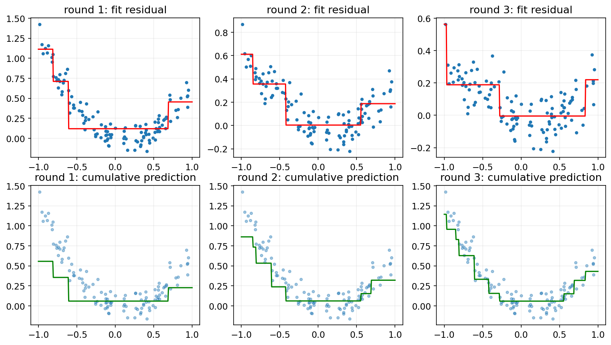

</div>
</div>

<!-- 講者提示：程式與圖為 programs/notebooks/07_集成學習與隨機森林.ipynb 的已執行輸出。 -->

<!-- Notebook 對照：程式 07-09；完整對照見本章 ipynb 開頭。圖例與小型實驗的資料、評估方式及適用範圍各自標示。 -->

---
<!-- _class: figure -->
## 投票分類器：不同模型提供不同觀點

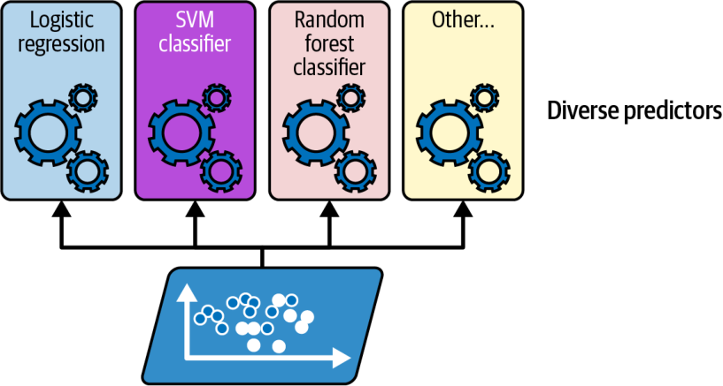

同一份訓練資料可交給不同演算法；有差異的錯誤才可能互補。

<!-- 講者提示：先讓學生說明本頁符號或圖形，再連結前後概念。圖表中的固定結果僅供讀圖，不能當作本班重跑結果。 -->

<!-- Notebook 對照：程式 07-03、07-05；完整對照見本章 ipynb 開頭。圖例與小型實驗的資料、評估方式及適用範圍各自標示。 -->

---
<!-- _class: figure -->
## 硬投票：每個模型先投一個類別

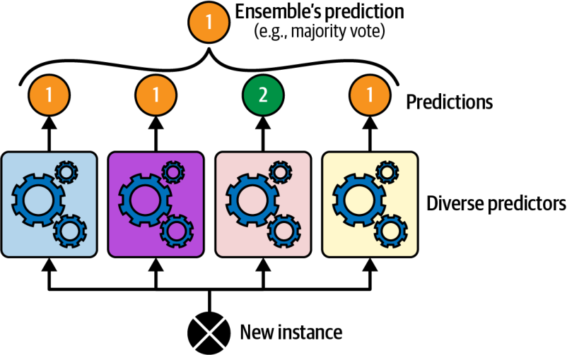

多數決易理解，但不使用模型對類別的信心差異。

<!-- 講者提示：先讓學生說明本頁符號或圖形，再連結前後概念。圖表中的固定結果僅供讀圖，不能當作本班重跑結果。 -->

<!-- Notebook 對照：程式 07-03、07-05；完整對照見本章 ipynb 開頭。圖例與小型實驗的資料、評估方式及適用範圍各自標示。 -->

---
## 軟投票：先平均機率，再選最大值

$$\hat p_k(x)=\frac{\sum_jw_j\hat p_{j,k}(x)}{\sum_jw_j},\qquad\hat y=\arg\max_k\hat p_k(x)$$

需要各模型提供可比較的類別機率；過度自信的模型可能扭曲平均。

<!-- 講者提示：權重不能用測試集調。機率欄順序需對齊各類別。 -->

<!-- Notebook 對照：程式 07-03；完整對照見本章 ipynb 開頭。 -->

---
<!-- _class: figure -->
## 大數法則的前提：錯誤不能完全同步

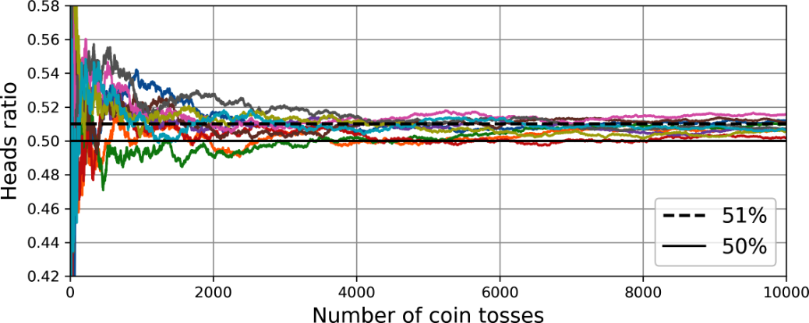

許多略優於隨機的判斷可累積優勢；高度相關的模型會限制集成收益。

<!-- 講者提示：拋硬幣例子是獨立性直覺，不代表真實分類器條件完全成立。 -->

<!-- Notebook 對照：程式 07-05；完整對照見本章 ipynb 開頭。圖例與小型實驗的資料、評估方式及適用範圍各自標示。 -->

---
<!-- _class: activity -->
## 同樣三個模型，硬投票與軟投票會相同嗎？

正類機率依序為 `[0.51, 0.51, 0.01]`。

1. 等權硬投票的預測是什麼？
2. 等權軟投票的預測是什麼？
3. 若第三個模型嚴重失準，平均機率可能有什麼問題？

<!-- 講者提示：硬投票兩票正類，選1；平均約.343，軟投票選0。第三模型過度自信可能支配平均，需看校準與獨立驗證。 -->

<!-- Notebook 對照：程式 07-03；完整對照見本章 ipynb 開頭。 -->

---
<!-- _class: small -->
## 投票分類器的機率條件

```python
from sklearn.ensemble import VotingClassifier
vote = VotingClassifier(
    estimators=[("lr", lr_pipeline), ("rf", forest),
                ("svc", svc_pipeline)], voting="soft")
vote.fit(X_train, y_train)
pred = vote.predict(X_test)
```

`lr_pipeline`、`svc_pipeline` 含折內縮放；SVC 需先設 `probability=True`。硬投票可改 `voting="hard"`。

<!-- 講者提示：本段接既有三個未擬合估計器。VotingClassifier 擬合複本，讀取已訓練模型用 named_estimators_。機率校準品質仍需另查。 -->

<!-- Notebook 對照：程式 07-03；完整對照見本章 ipynb 開頭。 -->

---
<!-- _class: figure -->
## Bagging：每個模型用不同抽樣資料訓練


有放回抽樣稱 Bagging；無放回抽樣稱 Pasting。最終做分類投票或迴歸平均。

<!-- 講者提示：先讓學生說明本頁符號或圖形，再連結前後概念。圖表中的固定結果僅供讀圖，不能當作本班重跑結果。 -->

<!-- Notebook 對照：程式 07-05、07-04；完整對照見本章 ipynb 開頭。圖例與小型實驗的資料、評估方式及適用範圍各自標示。 -->

---
<!-- _class: figure -->
## 很多棵不同的樹，邊界通常更平滑

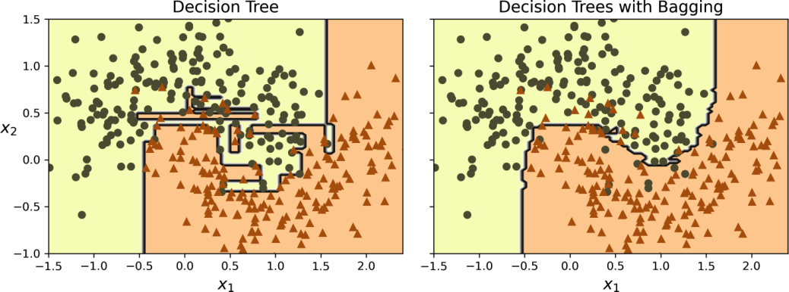

集成主要降低變異；如果每棵樹的錯誤幾乎一樣，改善有限。

<!-- 講者提示：先讓學生說明本頁符號或圖形，再連結前後概念。圖表中的固定結果僅供讀圖，不能當作本班重跑結果。 -->

<!-- Notebook 對照：程式 07-04；完整對照見本章 ipynb 開頭。圖例與小型實驗的資料、評估方式及適用範圍各自標示。 -->

---
## 袋外 OOB：這棵樹沒看過哪些樣本？

$$P(\text{某樣本未被抽到})=\left(1-\frac1m\right)^m\approx e^{-1}\approx0.368$$

每筆資料只由「沒有抽到它」的樹預測，形成 OOB 評估。

OOB 可輔助驗證；若反覆據此調參，仍需獨立最終測試。

<!-- 講者提示：36.8% 是每棵 bootstrap 樹的期望未抽中比例；不是永久保留同一個36.8%的測試集。 -->

<!-- Notebook 對照：程式 07-04、07-05；完整對照見本章 ipynb 開頭。 -->

---
<!-- _class: small -->
## Bagging 與 OOB 的實作對照

```python
from sklearn.ensemble import BaggingClassifier
from sklearn.tree import DecisionTreeClassifier
bag = BaggingClassifier(DecisionTreeClassifier(),
    n_estimators=200, bootstrap=True, oob_score=True,
    random_state=42)
bag.fit(X_train, y_train)
print(bag.oob_score_)
```

`bootstrap=False` 改為 Pasting，此時停用 OOB。基模型可輸出機率時，sklearn Bagging 平均機率再選類別。

<!-- 講者提示：請學生用本頁的例子說明概念，再連結前後頁。 -->

<!-- Notebook 對照：程式 07-04；完整對照見本章 ipynb 開頭。 -->

---
<!-- _class: small -->
## 資料與特徵，都可以隨機抽樣

| 做法 | 樣本 | 特徵 |
| --- | --- | --- |
| Bagging／Pasting | 抽部分樣本 | 可用全部 |
| Random subspaces | 全部樣本 | 抽部分特徵 |
| Random patches | 抽部分樣本 | 抽部分特徵 |
| Random forest | 通常 bootstrap | 每個分割點抽候選特徵 |

<!-- 講者提示：先讓學生說明本頁符號或圖形，再連結前後概念。圖表中的固定結果僅供讀圖，不能當作本班重跑結果。 -->

<!-- Notebook 對照：程式 07-04、07-05；完整對照見本章 ipynb 開頭。 -->

---
## Random Forest 與 Extra Trees 的差別

- 隨機森林：每個節點只在部分候選特徵中找最佳分割。
- Extra Trees：額外隨機化候選切割閾值。
- 額外隨機化可能降低相關性，也可能增加偏差。
- **Boosting 是另一種集成策略**，不是隨機森林的別名。

<!-- 講者提示：先讓學生說明本頁符號或圖形，再連結前後概念。圖表中的固定結果僅供讀圖，不能當作本班重跑結果。 -->

<!-- Notebook 對照：程式 07-06；完整對照見本章 ipynb 開頭。 -->

---
<!-- _class: small -->
## 森林的隨機性與重要度計算

`RandomForestClassifier(n_estimators=200, max_features="sqrt", random_state=42)` 在每個節點抽候選特徵。

特徵 $k$ 的貢獻：累加使用它的節點之

$$\frac{m_t}{m}\left(I_t-\frac{m_L}{m_t}I_L-\frac{m_R}{m_t}I_R\right)$$

森林再彙整各樹結果並正規化，得到 `feature_importances_`。一般森林與 Extra Trees 的 bootstrap 預設也不同，比較時應寫明設定。

<!-- 講者提示：加權資料以權重和取代樣本數。沒有任何有效分割時，重要度可能全零。原始程式的標準化保留作比較，不是樹模型的必要條件。 -->

<!-- Notebook 對照：程式 07-06；完整對照見本章 ipynb 開頭。 -->

---
<!-- _class: figure -->
## 特徵重要度：哪些像素參與較多有效分割？

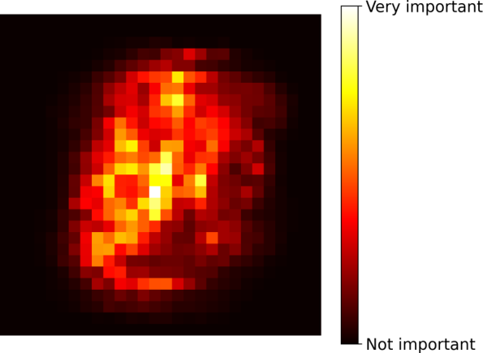

不純度重要度可做探索；高基數特徵或相關特徵會影響其解讀。

<!-- 講者提示：補充：在獨立驗證集用 permutation importance 交叉檢查；重要度不等於因果效果。 -->

<!-- Notebook 對照：程式 07-06、07-02；完整對照見本章 ipynb 開頭。圖例與小型實驗的資料、評估方式及適用範圍各自標示。 -->

---
<!-- _class: activity -->
## Bagging 與隨機森林的差別

兩者都以 bootstrap 樣本訓練多棵樹，再整合預測。

- Bagging 的主要隨機性來自資料重抽樣。
- 隨機森林還在每次分割時隨機選取候選特徵，降低樹之間的相關性。
- OOB 評估使用沒有進入某棵樹 bootstrap 樣本的資料；它不是獨立測試集。

若各棵樹犯同一種錯，增加樹數也無法完全消除系統性偏差。

<!-- 講者提示：先讓學生獨立檢核本頁的假設、公式與結論，再與相鄰的模型概念對照。 -->

---
## Boosting：新模型接著處理前面的不足

AdaBoost：提高難分樣本的相對權重。

Gradient Boosting：朝目前損失的負梯度方向加入新模型。

訓練具有先後依賴；這與可平行訓練的 Bagging 不同。

<!-- 講者提示：先讓學生說明本頁符號或圖形，再連結前後概念。圖表中的固定結果僅供讀圖，不能當作本班重跑結果。 -->

<!-- Notebook 對照：程式 07-09；完整對照見本章 ipynb 開頭。 -->

---
<!-- _class: figure -->
## AdaBoost 的權重更新流程

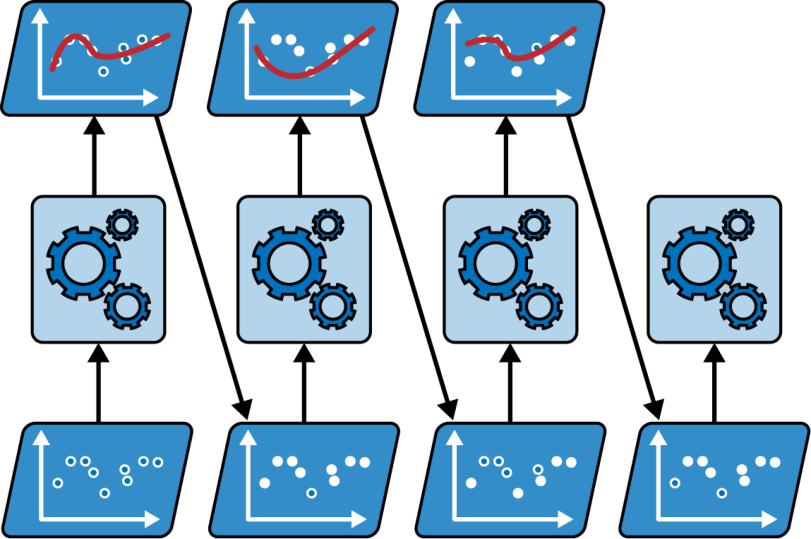

先訓練、再計算加權錯誤、調整樣本權重，重複得到多個加權模型。

<!-- 講者提示：先讓學生說明本頁符號或圖形，再連結前後概念。圖表中的固定結果僅供讀圖，不能當作本班重跑結果。 -->

<!-- Notebook 對照：程式 07-08、07-07；完整對照見本章 ipynb 開頭。圖例與小型實驗的資料、評估方式及適用範圍各自標示。 -->

---
<!-- _class: figure -->
## 後續分類器更注意先前的難分樣本

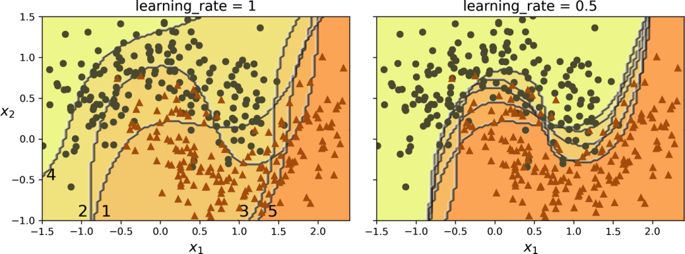

教材用 RBF-SVM 展示權重效果；實務入門常用淺決策樹。

<!-- 講者提示：先讓學生說明本頁符號或圖形，再連結前後概念。圖表中的固定結果僅供讀圖，不能當作本班重跑結果。 -->

<!-- Notebook 對照：程式 07-08；完整對照見本章 ipynb 開頭。圖例與小型實驗的資料、評估方式及適用範圍各自標示。 -->

---
## AdaBoost：加權錯誤率與模型權重

$$r_j=\frac{\sum_iw_i\mathbf1[\hat y_j^{(i)}\ne y^{(i)}]}{\sum_iw_i},\qquad\alpha_j=\eta\log\frac{1-r_j}{r_j}$$

這裡是教材的二元「只增加錯分權重」寫法；$r_j<0.5$ 時模型權重為正。

<!-- 講者提示：別把另一種對稱正負更新的 1/2 log 係數混入此式。多類 SAMME 還有 log(K-1) 項；本頁專講二元。 -->

<!-- Notebook 對照：程式 07-07、07-08；完整對照見本章 ipynb 開頭。 -->

---
## AdaBoost：更新樣本權重，再做加權投票

$$w_i\leftarrow\begin{cases}w_i&\hat y_j^{(i)}=y^{(i)}\\w_i e^{\alpha_j}&\hat y_j^{(i)}\ne y^{(i)}\end{cases},\quad w_i\leftarrow\frac{w_i}{\sum_lw_l}$$

$$\hat y(x)=\arg\max_k\sum_j\alpha_j\mathbf1[\hat y_j(x)=k]$$

<!-- 講者提示：先讓學生說明本頁符號或圖形，再連結前後概念。圖表中的固定結果僅供讀圖，不能當作本班重跑結果。 -->

<!-- Notebook 對照：程式 07-07、07-08；完整對照見本章 ipynb 開頭。 -->

---
<!-- _class: activity -->
## 手算 AdaBoost 的第一輪

四筆資料初始權重皆為 $1/4$，第一個模型只錯一筆，$\eta=1$。

1. 算 $r$、$\alpha$。
2. 更新並正規化後，錯分與正確樣本權重各多少？
3. 若錯誤標籤一直被加權，可能發生什麼事？

<!-- 講者提示：r=.25，α=ln3≈1.0986；錯分先乘3成.75，總和1.5，正規化後錯分.5，其餘各1/6。標籤雜訊可能被持續放大。 -->

<!-- Notebook 對照：程式 07-07；完整對照見本章 ipynb 開頭。 -->

---
## 選讀｜手刻 AdaBoost 為何多了二分之一

若採 $y,h(x)\in\{-1,+1\}$ 編碼，權重可用下式對稱更新：

$$a=\tfrac12\log\frac{1-r}{r},\qquad w_i'\propto w_i e^{-a y_i h(x_i)}$$

答對乘 $e^{-a}$，答錯乘 $e^a$，錯／對權重比增為 $e^{2a}$。

教材只放大錯分者，令 $\alpha=2a$，因此正規化後權重相同。前頁 $r=1/4$ 時，兩種寫法都得到錯分者 $1/2$、其餘各 $1/6$。

<!-- 講者提示：此比較令學習率為1，且每輪採相同弱分類器。r=0 時應停止或保護數值；r≥.5 時須檢查弱分類器，不盲目套對數。 -->

<!-- Notebook 對照：程式 07-07、07-08；完整對照見本章 ipynb 開頭。 -->

---
## Gradient Boosting：平方損失時學殘差

$$F_0(x)=\bar y,\quad r_i=y_i-F_{t-1}(x_i),\quad F_t(x)=F_{t-1}(x)+\eta h_t(x)$$

新樹 $h_t$ 擬合殘差。一般損失則擬合負梯度，不一定等於 $y-\hat y$。

<!-- 講者提示：原書圖展示逐棵樹累加的直覺；此處以常數起點寫出常見完整流程。 -->

<!-- Notebook 對照：程式 07-09；完整對照見本章 ipynb 開頭。 -->

---
<!-- _class: figure -->
## 逐棵加入：左邊學殘差，右邊累加預測


從第一列往下看：每一輪針對剩餘誤差，修正目前集成。

<!-- 講者提示：此圖有三列；可在 Marp 預覽 放大檢視，逐列指向殘差與累加結果。 -->

<!-- Notebook 對照：程式 07-09；完整對照見本章 ipynb 開頭。圖例與小型實驗的資料、評估方式及適用範圍各自標示。 -->

---
<!-- _class: figure -->
## 圖 6-9 放大：第 1 輪殘差與累加

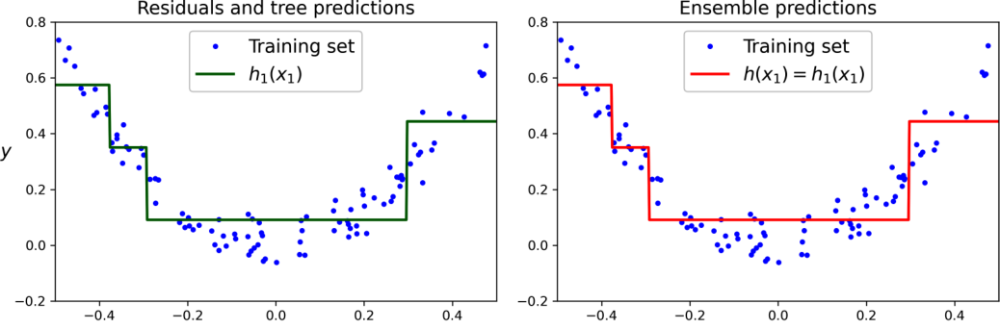

第一棵樹直接擬合目標，建立初始集成。

<!-- 講者提示：先讓學生說明本頁符號或圖形，再連結前後概念。圖表中的固定結果僅供讀圖，不能當作本班重跑結果。 -->

<!-- Notebook 對照：程式 07-09；完整對照見本章 ipynb 開頭。圖例與小型實驗的資料、評估方式及適用範圍各自標示。 -->

---
<!-- _class: figure -->
## 圖 6-9 放大：第 2 輪殘差與累加

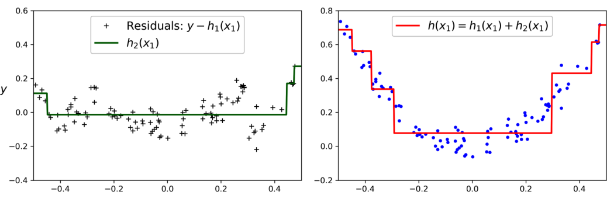

第二棵樹擬合第一棵留下的殘差，再加回原預測。

<!-- 講者提示：先讓學生說明本頁符號或圖形，再連結前後概念。圖表中的固定結果僅供讀圖，不能當作本班重跑結果。 -->

<!-- Notebook 對照：程式 07-09；完整對照見本章 ipynb 開頭。圖例與小型實驗的資料、評估方式及適用範圍各自標示。 -->

---
<!-- _class: figure -->
## 圖 6-9 放大：第 3 輪殘差與累加

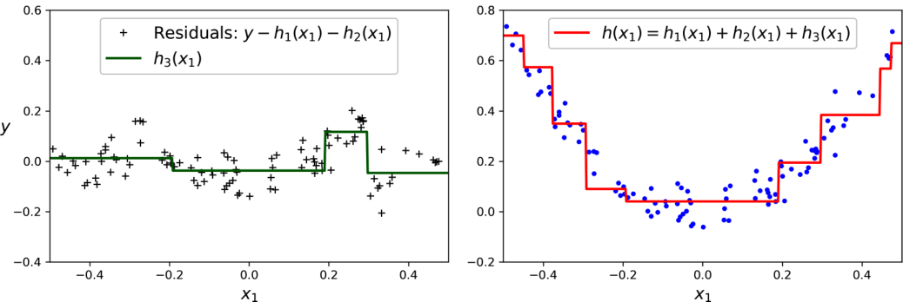

第三棵樹再修正剩餘殘差；模型逐步改善但仍需驗證。

<!-- 講者提示：先讓學生說明本頁符號或圖形，再連結前後概念。圖表中的固定結果僅供讀圖，不能當作本班重跑結果。 -->

<!-- Notebook 對照：程式 07-09；完整對照見本章 ipynb 開頭。圖例與小型實驗的資料、評估方式及適用範圍各自標示。 -->

---
<!-- _class: figure -->
## 學習率較小，通常需要更多棵樹

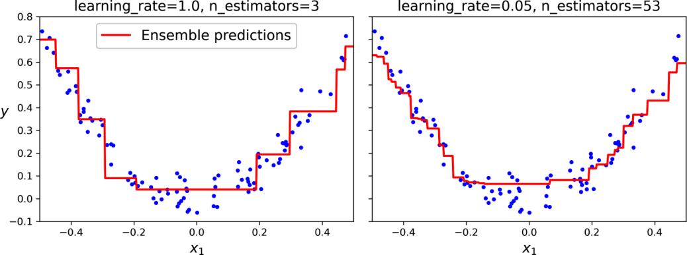

樹數與 learning_rate 要一起調整；更多樹並非永遠更好。

<!-- 講者提示：先讓學生說明本頁符號或圖形，再連結前後概念。圖表中的固定結果僅供讀圖，不能當作本班重跑結果。 -->

<!-- Notebook 對照：程式 07-12、07-09；完整對照見本章 ipynb 開頭。圖例與小型實驗的資料、評估方式及適用範圍各自標示。 -->

---
## Boosting 的停止條件與隨機化

- `n_estimators`：最多加入幾個模型。
- `learning_rate`：每個新模型的影響幅度。
- `n_iter_no_change`：驗證指標無改善的容忍次數。
- `subsample < 1`：每輪只用部分訓練樣本，形成隨機梯度提升。

<!-- 講者提示：教材例子的最佳53棵是該次結果，並非所有資料固定用53棵。 -->

<!-- Notebook 對照：程式 07-09、07-12；完整對照見本章 ipynb 開頭。 -->

---
<!-- _class: activity -->
## Boosting 為何要逐輪加入模型？

以平方損失為例，第一個模型預測 $\hat y_1$ 後，下一輪可學殘差 $r=y-\hat y_1$：

$$\hat y_2=\hat y_1+\eta h_2(x)$$

其中 $h_2$ 近似前一輪殘差，$\eta$ 控制修正幅度。Boosting 是逐步修正既有模型；與 Bagging 的平行、獨立訓練不同。

<!-- 講者提示：先讓學生獨立檢核本頁的假設、公式與結論，再與相鄰的模型概念對照。 -->

---
## Histogram Gradient Boosting：先把連續值分箱

把連續特徵轉成有限分箱，再從箱邊界找分割，減少候選切點。

適合較大表格資料；可處理缺失值，類別特徵要明確指定或提供正確資料型態。

未知類別、資料洩漏與驗證切分仍需處理。

<!-- 講者提示：不要把一般 ordinal 整數編碼自動視為原生類別處理；版本與 categorical_features 設定要確認。 -->

<!-- Notebook 對照：程式 07-11、07-12；完整對照見本章 ipynb 開頭。 -->

---
<!-- _class: small -->
## GBRT 與 HGB 的參數不能直接互抄

| 控制項目 | GradientBoostingRegressor | HistGradientBoostingRegressor |
| --- | --- | --- |
| 最多輪數 | `n_estimators` | `max_iter` |
| 早停開關 | 設 `n_iter_no_change` | `early_stopping=True` |
| 每輪樣本抽樣 | `subsample` | 無相同的參數 |
| 分箱 | 無此步驟 | `max_bins`，會損失數值精度 |

類別與缺失值處理也不同。XGBoost、LightGBM、CatBoost 與 YDF 留作課後比較，先用相同切分與指標建立基準。

<!-- 講者提示：https://scikit-learn.org/1.7/modules/generated/sklearn.ensemble.HistGradientBoostingRegressor.html 。n_iter_no_change 表示 patience，與 early_stopping 開關不同。 -->

<!-- Notebook 對照：程式 07-11、07-12；完整對照見本章 ipynb 開頭。 -->

---
<!-- _class: figure -->
## Stacking：讓第二層模型學會如何組合

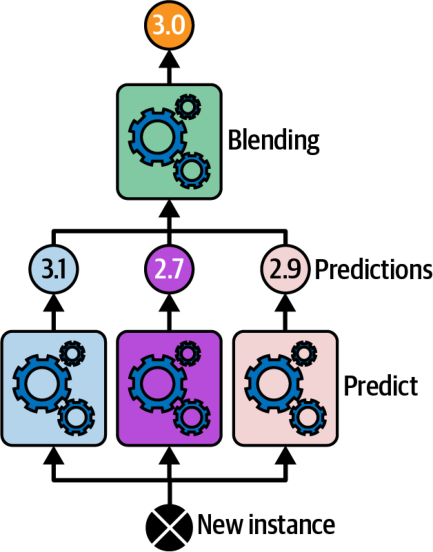

第一層輸出成為第二層特徵；blender 可學到不同模型的適用情況。

<!-- 講者提示：先讓學生說明本頁符號或圖形，再連結前後概念。圖表中的固定結果僅供讀圖，不能當作本班重跑結果。 -->

<!-- Notebook 對照：程式 07-10、07-12；完整對照見本章 ipynb 開頭。圖例與小型實驗的資料、評估方式及適用範圍各自標示。 -->

---
<!-- _class: figure -->
## 用折外預測建立第二層訓練資料

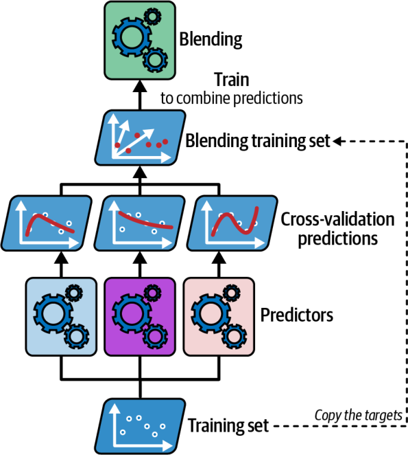

每列的基模型預測，都來自未看過該列標籤的折內模型；用這些預測訓練 blender。

<!-- 講者提示：教材以 cross_val_predict 取得 OOF 預測。第二層訓練完，再以全部訓練集重訓基模型供推論。 -->

<!-- Notebook 對照：程式 07-10、07-12；完整對照見本章 ipynb 開頭。圖例與小型實驗的資料、評估方式及適用範圍各自標示。 -->

---
<!-- _class: figure -->
## 多層 Stacking：多個 blender 還可再組合

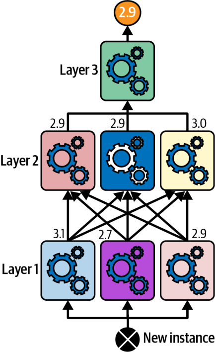

本圖展示推論時的三層組合；增加層數也增加訓練成本、延遲與洩漏控制的難度。

<!-- 講者提示：這張是多層推論架構，不是折外切分圖。每一層的訓練特徵都要以適當的樣本外方式產生，不能直接用記住答案的訓練預測。 -->

<!-- Notebook 對照：程式 07-10、07-12；完整對照見本章 ipynb 開頭。圖例與小型實驗的資料、評估方式及適用範圍各自標示。 -->

---
## Stacking 洩漏：看似完美的訓練特徵

錯誤流程：基模型先 fit 全訓練集，再用它對同一批資料的預測訓練 blender。

高容量基模型可能記住答案；第二層學到的組合方式無法泛化。

正確流程：折外預測（OOF）或獨立保留集。

<!-- 講者提示：時間序列與分組資料的 OOF 也必須遵守時間／群組切分，不能任意 KFold。 -->

<!-- Notebook 對照：程式 07-10；完整對照見本章 ipynb 開頭。 -->

---
<!-- _class: small -->
## Stacking 的訓練與推論介面

```python
from sklearn.ensemble import StackingClassifier
stack = StackingClassifier(
    estimators=[("lr", lr_pipeline), ("rf", forest)],
    final_estimator=LogisticRegression(), cv=5)
stack.fit(X_train, y_train)
pred = stack.predict(X_test)
```

`cv=5` 用來建立第二層的折外特徵；仍需外層驗證評估整個模型。推論使用在完整訓練集重訓的基模型，再交由第二層組合。

<!-- 講者提示：LogisticRegression 與前面估計器需先建立。前處理跟著每個基模型放入 Pipeline；cv 不是最終成效報告。 -->

<!-- Notebook 對照：程式 07-10、07-12；完整對照見本章 ipynb 開頭。 -->

---
<!-- _class: small -->
## 表 6-1：投票方法的適用條件與案例

| 方法 | 教材使用條件 | 教材案例 |
| --- | --- | --- |
| Hard voting | 類別較平衡；模型強且多樣 | 垃圾郵件、情緒、疾病分類 |
| Soft voting | 機率模型；信心資訊有價值 | 醫療診斷、信用風險、假新聞 |

<!-- 講者提示：案例只說明可研究的用途，不代表方法已達到部署或專業決策要求。 -->

<!-- Notebook 對照：程式 07-03；完整對照見本章 ipynb 開頭。 -->

---
<!-- _class: small -->
## 表 6-1：抽樣集成的適用條件與案例

| 方法 | 教材使用條件 | 教材案例 |
| --- | --- | --- |
| Bagging | 結構或半結構資料；高變異模型 | 金融風險、電商推薦 |
| Pasting | 結構或半結構資料；希望增加多樣性 | 顧客分群、蛋白質分類 |

<!-- 講者提示：原表pasting提及更獨立的模型；無放回抽樣本身不保證模型誤差獨立。顧客分群案例不代表BaggingClassifier可直接無監督分群。 -->

<!-- Notebook 對照：程式 07-04；完整對照見本章 ipynb 開頭。 -->

---
<!-- _class: small -->
## 表 6-1：隨機樹的適用條件與案例

| 方法 | 教材使用條件 | 教材案例 |
| --- | --- | --- |
| Random forest | 高維結構資料；可能有雜訊特徵 | 顧客流失、基因資料、詐欺偵測 |
| Extra Trees | 大型多特徵資料；重視速度與降低變異 | 即時詐欺偵測、感測資料分析 |

<!-- 講者提示：即時任務仍需另外量測延遲；不能只憑演算法名稱承諾即時。 -->

<!-- Notebook 對照：程式 07-06；完整對照見本章 ipynb 開頭。 -->

---
<!-- _class: small -->
## 表 6-1：Boosting 的適用條件與案例

| 方法 | 教材使用條件 | 教材案例 |
| --- | --- | --- |
| AdaBoost | 中小型、低雜訊；弱學習器如樹樁 | 信用評分、異常偵測、預測維護 |
| Gradient Boosting | 中大型表格；願意投入調參 | 房價、風險評估、需求預測 |

<!-- 講者提示：弱學習器可讀不代表整個集成同樣容易解釋。 -->

<!-- Notebook 對照：程式 07-09；完整對照見本章 ipynb 開頭。 -->

---
<!-- _class: small -->
## 表 6-1：HGB 與 Stacking 的條件與案例

| 方法 | 教材使用條件 | 教材案例 |
| --- | --- | --- |
| Histogram GB | 大型表格；重視速度與規模 | 點擊率、排序、廣告競價 |
| Stacking | 複雜高維；組合多樣模型 | 推薦、自動駕駛決策、競賽 |

<!-- 講者提示：完整保留原表十種方法、條件與案例，並補上使用界線。不同排序目標不一定由sklearn一般分類器直接實現。 -->

<!-- Notebook 對照：程式 07-10、07-11；完整對照見本章 ipynb 開頭。 -->

---
<!-- _class: activity -->
## 綜合比較：單樹、森林與提升樹

固定資料切分與評估指標，比較：

1. 單棵淺樹。
2. 隨機森林（例如 200 棵）。
3. Gradient Boosting 或 Histogram GB。

提交訓練／CV 表現、運行時間與錯誤案例；離線組畫出三種訓練流程並說明資料角色。

<!-- 講者提示：不需要巨大搜尋；每個模型先比較2–3組設定。森林評估可附OOB，但最終測試不能用來選設定。 -->

<!-- Notebook 對照：程式 07-11；完整對照見本章 ipynb 開頭。 -->

---
## 離堂檢核：辨認三種「下一個模型」

- Bagging：下一個模型用另一份抽樣資料。
- Boosting：下一個模型根據目前錯誤或梯度訓練。
- Stacking：第二層模型學習組合折外預測。

課後：Ch.6 練習 1–9；用錯誤重疊率解釋投票是否有效。

<!-- 講者提示：要求學生判斷「重複同一模型同一種子100次」能否形成有效多樣性，答案通常不能。 -->

<!-- Notebook 對照：程式 07-11；完整對照見本章 ipynb 開頭。 -->

---
<!-- _class: small -->
## Notebook 導讀：抽樣、加權與第二層評估

| 方法 | Notebook 提供的證據 |
|---|---|
| 投票／Bagging | 個別預測、抽樣次數矩陣及 OOB 比例 |
| AdaBoost | 每輪錯誤率、alpha、樣本權重；兩種寫法相等 |
| Gradient Boosting | 殘差、累加預測、驗證誤差隨棵數變化 |
| Stacking | 折外特徵形狀、blender 擬合分數及獨立保留集 |

預先生成的 OOF 表格不能直接拿去做普通 CV，宣稱整條流程已獨立驗證。
要評估完整 stacking，外折內仍需重做第一層訓練與 OOF。

<!-- 講者提示：多層 stacking 圖用來對照特徵形狀與一層實作；深層堆疊需逐層維持樣本外預測。 -->

<!-- Notebook 對照：程式 07-05、07-08、07-12；完整對照見本章 ipynb 開頭。 -->
