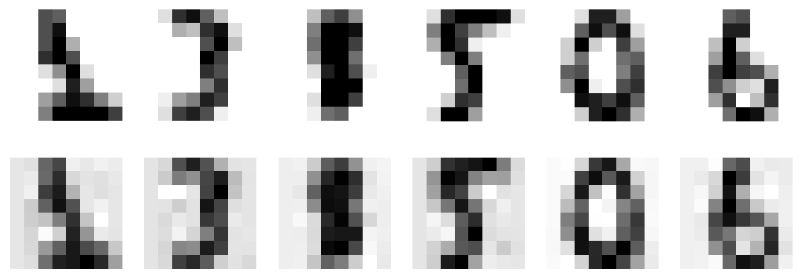

<!-- _class: cover -->
# 降維與資料表示

第 8 週｜壓縮什麼、保留什麼，以及圖形能說明什麼

<!-- 講者提示：先讓學生說明本頁符號或圖形，再連結前後概念。圖表中的固定結果僅供讀圖，不能當作本班重跑結果。 -->

---
## 學習重點與成果

- 非監督學習從未標註資料找結構，常見任務包含分群、異常偵測、降維與生成。

- 維度災難、投影、PCA／SVD、保留維度與壓縮。

- 隨機投影、LLE、LDA、t-SNE、UMAP 與結果解讀。

成果：能做 PCA、解釋變異比例，並辨識視覺化的限制。

<!-- notebook-companion-link -->
> 💻 **配套 Notebook**：`programs/notebooks/08_降維與資料表示.ipynb`。程式片段、實際圖表與表格可由此檔重現。

<!-- 講者提示：先讓學生說明本頁符號或圖形，再連結前後概念。圖表中的固定結果僅供讀圖，不能當作本班重跑結果。 -->

<!-- Notebook 對照：程式 08-01、08-02；完整對照見本章 ipynb 開頭。 -->

---
<!-- _class: figure -->
## 維度增加：大部分空間可能靠近邊界


高維空間的距離與密度直覺，不能直接套用二維經驗。

<!-- 講者提示：先讓學生說明本頁符號或圖形，再連結前後概念。圖表中的固定結果僅供讀圖，不能當作本班重跑結果。 -->

<!-- Notebook 對照：程式 08-10、08-03；完整對照見本章 ipynb 開頭。圖例與小型實驗的資料、評估方式及適用範圍各自標示。 -->

---
## 維度災難帶來三個問題

- 要維持相似的資料密度，所需樣本可能大幅增加。
- 距離變得較不具區辨力，近鄰與分群更難。
- 特徵過多增加計算、雜訊與過擬合風險。

降維可能幫助，但也可能丟掉預測所需訊息。

<!-- 講者提示：先讓學生說明本頁符號或圖形，再連結前後概念。圖表中的固定結果僅供讀圖，不能當作本班重跑結果。 -->

<!-- Notebook 對照：程式 08-03；完整對照見本章 ipynb 開頭。 -->

---
## 高維空間靠近邊界的機率

在 $[0,1]^n$ 均勻抽一個點，離任一邊界小於 $\delta$ 的機率為

$$P=1-(1-2\delta)^n,\qquad 0<\delta<\tfrac12$$

令 $\delta=0.001$：二維約 0.4%；一萬維已超過 99.999999%。

這是均勻分布的幾何示例。真實資料若集中在低維結構附近，所需樣本量可能小得多。

<!-- 講者提示：請學生用本頁的例子說明概念，再連結前後頁。 -->

<!-- Notebook 對照：程式 08-03、08-10；完整對照見本章 ipynb 開頭。 -->

---
<!-- _class: figure -->
## 投影：資料是否接近某個低維子空間？


把三維點投影到平面；若偏離平面的變化很小，損失可能有限。

<!-- 講者提示：先讓學生說明本頁符號或圖形，再連結前後概念。圖表中的固定結果僅供讀圖，不能當作本班重跑結果。 -->

<!-- Notebook 對照：程式 08-10；完整對照見本章 ipynb 開頭。圖例與小型實驗的資料、評估方式及適用範圍各自標示。 -->

---
<!-- _class: figure -->
## 在投影平面建立新的座標


主成分通常是原始特徵的線性組合，不等同刪掉幾個原始欄位。

<!-- 講者提示：先讓學生說明本頁符號或圖形，再連結前後概念。圖表中的固定結果僅供讀圖，不能當作本班重跑結果。 -->

<!-- Notebook 對照：程式 08-10；完整對照見本章 ipynb 開頭。圖例與小型實驗的資料、評估方式及適用範圍各自標示。 -->

---
<!-- _class: figure -->
## Swiss roll：彎曲流形無法靠平面直接攤開


資料內在可能接近二維，但嵌在三維且彎曲；線性投影會重疊。

<!-- 講者提示：先讓學生說明本頁符號或圖形，再連結前後概念。圖表中的固定結果僅供讀圖，不能當作本班重跑結果。 -->

<!-- Notebook 對照：程式 08-10、08-08；完整對照見本章 ipynb 開頭。圖例與小型實驗的資料、評估方式及適用範圍各自標示。 -->

---
<!-- _class: figure -->
## 攤開流形：保留局部鄰近關係


流形學習假設資料集中在低維結構附近；真實資料未必符合。

<!-- 講者提示：先讓學生說明本頁符號或圖形，再連結前後概念。圖表中的固定結果僅供讀圖，不能當作本班重跑結果。 -->

<!-- Notebook 對照：程式 08-10、08-08；完整對照見本章 ipynb 開頭。圖例與小型實驗的資料、評估方式及適用範圍各自標示。 -->

---
<!-- _class: figure -->
## 降維之後，分類邊界不一定更簡單


某些目標在流形座標容易分，其他目標卻可能更難；要看任務。

<!-- 講者提示：先讓學生說明本頁符號或圖形，再連結前後概念。圖表中的固定結果僅供讀圖，不能當作本班重跑結果。 -->

<!-- Notebook 對照：程式 08-10；完整對照見本章 ipynb 開頭。圖例與小型實驗的資料、評估方式及適用範圍各自標示。 -->

---
<!-- _class: figure -->
## PCA：選擇投影後變異最大的方向


第一主成分保留最多變異；後續方向與前面正交，再保留剩餘變異。

<!-- 講者提示：先讓學生說明本頁符號或圖形，再連結前後概念。圖表中的固定結果僅供讀圖，不能當作本班重跑結果。 -->

<!-- Notebook 對照：程式 08-10；完整對照見本章 ipynb 開頭。圖例與小型實驗的資料、評估方式及適用範圍各自標示。 -->

---
## PCA 的兩個等價觀點

1. 在正交線性投影中，最大化保留的變異。
2. 在固定維度下，最小化平方重建誤差。

先中心化資料；標準化是否適合，要依單位與任務判斷。

變異大不代表對標籤更有預測力。

<!-- 講者提示：PCA 類別會中心化但不自動把所有特徵縮成單位變異。 -->

<!-- Notebook 對照：程式 08-04、08-10；完整對照見本章 ipynb 開頭。 -->

---
<!-- _class: activity -->
## 先猜方向，再計算

資料點為 $(-2,-2),(-1,-1),(1,1),(2,2)$。

1. 哪條線能完整保留資料？
2. 投影到 x 軸與投影到對角線，哪個重建誤差小？
3. 若只留下「最大變異」，是否一定保留分類訊息？

<!-- 講者提示：主方向為 (1,1)/√2，對角線重建誤差0；x軸投影丟掉 y 變化。若標籤由小變異方向決定，PCA可能丟掉關鍵訊息。 -->

<!-- Notebook 對照：程式 08-04；完整對照見本章 ipynb 開頭。 -->

---
<!-- _class: activity -->
## PCA 投影的幾何檢核

資料先中心化，再尋找最大化投影變異的單位方向 $w$：

$$z_i=(x_i-\bar x)^\top w,\qquad \|w\|_2=1$$

第一主成分保留最大的單一方向變異；第二主成分必須與第一個正交。若特徵單位不同，先判斷是否需要標準化，不能只看圖形是否分開。

<!-- 講者提示：先讓學生獨立檢核本頁的假設、公式與結論，再與相鄰的模型概念對照。 -->

---
## PCA 的 SVD 寫法與矩陣形狀

$$X_c=X-\mathbf1\mu^T=U\Sigma V^T$$

$V$ 的欄為主成分方向。令 $W_d=[v_1,\ldots,v_d]\in\mathbb R^{n\times d}$。

$$Z=X_cW_d\in\mathbb R^{m\times d}$$

<!-- 講者提示：NumPy 返回 Vt，sklearn components_ 每列一個主成分；不要把轉置方向混用。 -->

<!-- Notebook 對照：程式 08-04、08-11；完整對照見本章 ipynb 開頭。 -->

---
<!-- _class: small -->
## 從共變異矩陣推導第一主成分

$$C=\frac1{m-1}X_c^TX_c,\qquad\max_{\|w\|=1} w^TCw$$

$$\mathcal L(w,\lambda)=w^TCw-\lambda(w^Tw-1)\Rightarrow Cw=\lambda w$$

選最大特徵值對應的單位特徵向量；後續方向依特徵值排序。

<!-- 講者提示：限制 ||w||=1 避免把方向任意放大；最大特徵值等於此方向的樣本變異。 -->

<!-- Notebook 對照：程式 08-04；完整對照見本章 ipynb 開頭。 -->

---
<!-- _class: small -->
## 共變異特徵值與奇異值的關係

$$X_c=U\Sigma V^T,\qquad C=\frac{X_c^TX_c}{m-1}
=V\frac{\Sigma^T\Sigma}{m-1}V^T$$

所以 $\lambda_j=s_j^2/(m-1)$，資料矩陣的奇異值為 $s_j=\sqrt{(m-1)\lambda_j}$。

對非零 $s_j$，$u_j=X_cv_j/s_j$。只取 $\sqrt{\lambda_j}$ 會讓 $U$ 的欄長度不對。

SVD 可分解一般矩陣；要用它求 PCA 主成分，先中心化資料。

<!-- 講者提示：若由 covariance 的特徵值直接開根號，可得到投影方向，但不能據此宣稱 U 已正交正規；零奇異值也不可直接相除。 -->

<!-- Notebook 對照：程式 08-04、08-11；完整對照見本章 ipynb 開頭。 -->

---
## 手算例：同一條線的共變異矩陣

前段四點已中心化，$C=\frac{10}{3}\begin{bmatrix}1&1\\1&1\end{bmatrix}$。

特徵值為 $20/3$ 與 $0$；第一方向為 $(1,1)^T/\sqrt2$。

第一主成分保留 100% 變異；主成分符號反轉不改變子空間。

<!-- 講者提示：XTX 每項10，樣本共變異分母3；若用分母m，特徵值尺度改變但方向與變異比例不變。 -->

<!-- Notebook 對照：程式 08-04；完整對照見本章 ipynb 開頭。 -->

---
<!-- _class: small -->
## 選讀｜手刻 PCA 與函式庫的比較

```python
Xc = X - X.mean(axis=0)
eigenvalues, V = np.linalg.eigh(np.cov(Xc, rowvar=False))
order = np.argsort(eigenvalues)[::-1]
W = V[:, order[:2]]
Z = Xc @ W
U, s, Vt = np.linalg.svd(Xc, full_matrices=False)
```

兩邊需使用相同的中心化／標準化資料；比較解釋變異與重建誤差。符號翻轉、重複特徵值造成的旋轉不代表算錯。

<!-- 講者提示：NumPy 已匯入為 np。前兩方向位於相同主子空間時可比較 W@W.T；截斷處若有重複特徵值，最佳子空間也可能不唯一。 -->

<!-- Notebook 對照：程式 08-04、08-11；完整對照見本章 ipynb 開頭。 -->

---
<!-- _class: small -->
## 選讀｜3×2 矩陣 SVD 手算

$$A=\begin{pmatrix}-1&1\\0&-1\\1&1\end{pmatrix},\qquad
A^TA=\begin{pmatrix}2&0\\0&3\end{pmatrix}$$

按奇異值遞減排序，精簡分解 $A=U\Sigma V^T$ 可取

$$U=\begin{pmatrix}1/\sqrt3&-1/\sqrt2\\-1/\sqrt3&0\\1/\sqrt3&1/\sqrt2\end{pmatrix},\quad
\Sigma=\begin{pmatrix}\sqrt3&0\\0&\sqrt2\end{pmatrix},\quad
V^T=\begin{pmatrix}0&1\\1&0\end{pmatrix}$$

檢查 $U^TU=V^TV=I_2$，再乘回 $A$。一般矩陣的 SVD 不要求先中心化；用於 PCA 時才先中心化。

<!-- 講者提示：AAᵀ 的特徵值為 3、2、0；精簡 SVD 只保留此例的兩個非零奇異值，完整 U 可再補 (1,2,1)/sqrt(6) 作第三欄。成對改變 U、V 對應欄的正負號仍是有效分解。 -->

<!-- Notebook 對照：程式 08-11；完整對照見本章 ipynb 開頭。 -->

---
## 解釋變異比例與保留維度

$$\rho_j=\frac{\lambda_j}{\sum_l\lambda_l},\qquad d=\min\left\{q:\sum_{j=1}^q\rho_j\ge\tau\right\}$$

例如 $\tau=0.95$ 保留 95% 變異；它不是保證保留 95% 分類正確率。

<!-- 講者提示：先讓學生說明本頁符號或圖形，再連結前後概念。圖表中的固定結果僅供讀圖，不能當作本班重跑結果。 -->

<!-- Notebook 對照：程式 08-05；完整對照見本章 ipynb 開頭。 -->

---
<!-- _class: figure -->
## 用累積曲線選 d：壓縮與保真之間的折衷


教材 MNIST 例子約需 154 個維度保留 95% 變異；數字會隨資料與前處理而變。

<!-- 講者提示：先讓學生說明本頁符號或圖形，再連結前後概念。圖表中的固定結果僅供讀圖，不能當作本班重跑結果。 -->

<!-- Notebook 對照：程式 08-06；完整對照見本章 ipynb 開頭。圖例與小型實驗的資料、評估方式及適用範圍各自標示。 -->

---
<!-- _class: small -->
## PCA 程式：先切分，再學投影

```python
from sklearn.decomposition import PCA
pca = PCA(n_components=0.95, svd_solver="full")
Z_train = pca.fit_transform(X_train)
Z_test = pca.transform(X_test)
X_rebuilt = pca.inverse_transform(Z_test)
print(pca.n_components_)
print(pca.explained_variance_ratio_.sum())
```

<!-- 講者提示：這段未標準化；如需縮放應用 Pipeline。若為CV，PCA也須放入Pipeline逐折fit。 -->

<!-- Notebook 對照：程式 08-06；完整對照見本章 ipynb 開頭。 -->

---
## 逆投影：重建時要把平均值加回去

$$\hat X=ZW_d^T+\mathbf1\mu^T$$

教材式 7-3 的簡寫 $X_{\rm recovered}=X_{d\text{-proj}}W_d^T$，對應中心化座標。

丟掉的維度通常無法完整找回；inverse transform 不代表無損。

**先預測**：保留 95% 變異，是否等於每張圖保留 95% 像素，或重建與原圖完全相同？

<!-- 講者提示：先讓學生說明本頁符號或圖形，再連結前後概念。圖表中的固定結果僅供讀圖，不能當作本班重跑結果。 -->

<!-- Notebook 對照：程式 08-06；完整對照見本章 ipynb 開頭。 -->

---

<!-- _class: small -->
## 用未參與擬合的數字核對 PCA 重建

<div class="columns wide-left">
<div>

使用 digits 的 8×8 影像；只用訓練集擬合 PCA，選擇保留至少 95% 訓練變異的維度。

```python
pca = PCA(n_components=0.95).fit(Xtr)
Zte = pca.transform(Xte)
rebuilt = pca.inverse_transform(Zte)
```

每欄是同一個測試樣本：上排原圖，下排重建。仍像數字不代表無損，也不保證分類 accuracy 不變。

參考程式：`programs/notebooks/08_降維與資料表示.ipynb`

</div>
<div>



</div>
</div>

<!-- 講者提示：Xtr、Xte 是 Notebook 已切分的訓練與測試影像矩陣，各有64個像素特徵。此頁接前面的重建公式，均值由訓練資料估計，不能在 Xte 重新 fit。這是 digits 圖；下一頁教材使用 MNIST，兩者解析度與資料不同。分類品質的比較在後面的 PCA 維度與分類器驗證段落進行，不能用此靜態圖挑最終模型。 -->

<!-- Notebook 對照：程式 08-06；以程式代碼定位配套 Notebook。 -->

---
<!-- _class: figure -->
## 圖像壓縮：重建仍像數字，但細節已減少


同時看圖與量化重建 MSE；下游辨識表現也要單獨評估。

<!-- 講者提示：先讓學生說明本頁符號或圖形，再連結前後概念。圖表中的固定結果僅供讀圖，不能當作本班重跑結果。 -->

<!-- Notebook 對照：程式 08-06；完整對照見本章 ipynb 開頭。圖例與小型實驗的資料、評估方式及適用範圍各自標示。 -->

---
<!-- _class: small -->
## PCA 的計算選項

| 方法 | 適合情境 | 代價或條件 |
| --- | --- | --- |
| 完整 SVD PCA | 中小型資料、精確分解 | 需儲存主要矩陣 |
| Randomized PCA | 只需少量主成分 | 近似解，設定 random_state |
| Incremental PCA | 資料無法一次放入記憶體 | 分批 partial_fit；批次需夠大 |
| memmap | 磁碟映射大陣列 | 降低一次載入需求，仍有 I/O 成本 |

<!-- 講者提示：先讓學生說明本頁符號或圖形，再連結前後概念。圖表中的固定結果僅供讀圖，不能當作本班重跑結果。 -->

<!-- Notebook 對照：程式 08-11；完整對照見本章 ipynb 開頭。 -->

---
<!-- _class: small -->
## 選讀｜分批 PCA 的訓練與固定投影

```python
from sklearn.decomposition import IncrementalPCA
ipca = IncrementalPCA(n_components=20)
for X_batch in training_batches:
    ipca.partial_fit(X_batch)
Z_train = ipca.transform(X_train)
Z_test = ipca.transform(X_test)
```

先完成各批次擬合，再統一轉換。批次數量須足夠支持保留維度；更新投影後，下游模型也須重訓。

<!-- 講者提示：示例要求各訓練批次至少20筆。磁碟 memmap 只是資料存取方式，不是另一種降維演算法。PCA 會中心化，不會自動標準化。 -->

<!-- Notebook 對照：程式 08-11；完整對照見本章 ipynb 開頭。 -->

---
<!-- _class: small -->
## PCA 維度與分類器一起驗證

```python
from sklearn.pipeline import Pipeline
from sklearn.model_selection import GridSearchCV
from sklearn.linear_model import LogisticRegression
pipe = Pipeline([("pca", PCA()),
                 ("clf", LogisticRegression(max_iter=1000))])
search = GridSearchCV(pipe, {"pca__n_components": [2, 10, 30]},
                      cv=3, scoring="accuracy")
search.fit(X_train, y_train)
```

以 digits 的 64 維像素為例。比較未降維基準；每個驗證折重新 fit PCA，避免投影偷看驗證集。

<!-- 講者提示：PCA 已於前頁匯入。不要先把全 X_train 做 PCA 再拿 Z_train 交叉驗證；若要標準化，也加入 Pipeline。此處僅示範程式結構。 -->

<!-- Notebook 對照：程式 08-07；完整對照見本章 ipynb 開頭。 -->

---
<!-- _class: activity -->
## 實作：壓縮率與辨識品質是否一起變好？

對已備妥的 digits 資料，比較 2、10、30 個主成分。

記錄：變異比例、重建 MSE、分類 CV 指標、運行時間。

離線：若特徵值是 `[8, 1.5, 0.5]`，保留 90% 至少需要幾維？

<!-- 講者提示：離線答案2維，累積95%；1維只有80%。實作需同切分，同一分類器，PCA放CV內。不要只憑二維散點好看就說模型較好。 -->

<!-- Notebook 對照：程式 08-05、08-07；完整對照見本章 ipynb 開頭。 -->

---
<!-- _class: activity -->
## 解釋變異比例怎麼算？

若三個主成分的特徵值為 $6,3,1$：

- 總變異為 $6+3+1=10$。
- 前兩個主成分的累積解釋變異比例為 $(6+3)/10=0.9$。
- 保留 $90\%$ 變異不表示所有樣本距離或標籤資訊都保留 $90\%$。

降維效果仍要用下游任務與保留資料檢查。

<!-- 講者提示：先讓學生獨立檢核本頁的假設、公式與結論，再與相鄰的模型概念對照。 -->

---
## 隨機投影：不用先找到主方向

$$Z=XP,\qquad P_{ij}\sim\mathcal N(0,1/d)$$

用隨機矩陣近似保留有限點集間的距離，計算便宜；不以最大化變異為目標。

<!-- 講者提示：先讓學生說明本頁符號或圖形，再連結前後概念。圖表中的固定結果僅供讀圖，不能當作本班重跑結果。 -->

<!-- Notebook 對照：程式 08-09、08-11；完整對照見本章 ipynb 開頭。 -->

---
<!-- _class: small -->
## Johnson–Lindenstrauss 維度界線

$$d\ge\frac{4\log m}{\varepsilon^2/2-\varepsilon^3/3},\quad0<\varepsilon<1$$

以足夠高的目標維度，讓平方距離大致維持在原距離的 $(1\pm\varepsilon)$ 範圍。

這是保守理論界，不保證比原始維度更小；不是「任何高維都可壓成 2D」。

<!-- 講者提示：教材以5000點、epsilon=.1得到約7300維。整數取法依工具；若要求嚴格下界應上取整。 -->

<!-- Notebook 對照：程式 08-09、08-11；完整對照見本章 ipynb 開頭。 -->

---
## 稀疏隨機投影：大部分矩陣元素為零

令非零機率為 $r$，非零元素取 $\pm1/\sqrt{dr}$，各占 $r/2$。

可減少儲存與乘法成本；教材常用 $r=1/\sqrt n$。

偽反矩陣可做近似重建，但投影已丟失資訊，不能期待還原全部細節。

<!-- 講者提示：先讓學生說明本頁符號或圖形，再連結前後概念。圖表中的固定結果僅供讀圖，不能當作本班重跑結果。 -->

<!-- Notebook 對照：程式 08-09、08-11；完整對照見本章 ipynb 開頭。 -->

---
<!-- _class: figure -->
## LLE：用鄰居重建每個點，再保持重建關係


- 先找局部鄰域權重，再尋找能維持這些權重的低維座標。
- `n_neighbors` 小時著重很局部的結構，可能產生碎片；數值大時較平滑，也可能抹掉局部細節。
- `reconstruction_error_` 衡量 LLE 目標值，不等於分類品質或所有鄰居都正確保留。

<!-- 講者提示：source_pptx/04_DimensionReduction.pptx 第 35 頁比較 n_neighbors。Notebook 08-08 以相同資料比較重建誤差與近鄰保留率。 -->

<!-- Notebook 對照：程式 08-08、08-12；完整對照見本章 ipynb 開頭。圖例與小型實驗的資料、評估方式及適用範圍各自標示。 -->

---
## LLE 第一步：找到局部重建權重

$$\min_W\sum_i\left\|x_i-\sum_jw_{ij}x_j\right\|^2$$

限制：不是鄰居則 $w_{ij}=0$；每列 $\sum_jw_{ij}=1$。

權重描述局部幾何；鄰居數太少或太多都可能破壞結構。

<!-- 講者提示：先讓學生說明本頁符號或圖形，再連結前後概念。圖表中的固定結果僅供讀圖，不能當作本班重跑結果。 -->

<!-- Notebook 對照：程式 08-12；完整對照見本章 ipynb 開頭。 -->

---
## LLE 第二步：保持權重，移動低維座標

$$\min_Z\sum_i\left\|z_i-\sum_jw_{ij}z_j\right\|^2$$

需加中心化與尺度限制，例如 $Z^T\mathbf1=0$、$Z^TZ=I$，排除全部點縮成零的退化解。

<!-- 講者提示：W 已固定；與第一步不同，此時求的是 Z。尺度限制的常數 convention 可不同。 -->

<!-- Notebook 對照：程式 08-12；完整對照見本章 ipynb 開頭。 -->

---
<!-- _class: figure -->
## 同一資料用不同降維方法，圖形可能很不同


MDS 著重距離；Isomap 著重沿流形的路徑距離；t-SNE 強調局部鄰近。

<!-- 講者提示：先讓學生說明本頁符號或圖形，再連結前後概念。圖表中的固定結果僅供讀圖，不能當作本班重跑結果。 -->

<!-- Notebook 對照：程式 08-12；完整對照見本章 ipynb 開頭。圖例與小型實驗的資料、評估方式及適用範圍各自標示。 -->

---
<!-- _class: small -->
## 其他方法與解讀界線

| 方法 | 保留／使用的資訊 | 注意 |
| --- | --- | --- |
| MDS | 點間距離 | 大樣本成本高 |
| Isomap | 近鄰圖的最短路徑距離 | 鄰居圖錯接會失真 |
| t-SNE | 局部相似度 | 群間距離與群大小不宜直接解釋 |
| UMAP | 近鄰圖與低維嵌入 | `n_neighbors`、`min_dist` 與距離度量會改變圖形 |
| LDA | 標籤導向可分性 | 監督式降維，需防標籤洩漏 |

<!-- 講者提示：先讓學生說明本頁符號或圖形，再連結前後概念。圖表中的固定結果僅供讀圖，不能當作本班重跑結果。 -->

<!-- Notebook 對照：程式 08-12；完整對照見本章 ipynb 開頭。 -->

---
<!-- _class: small -->
## LDA：使用標籤選擇投影方向

Fisher 的方向以類別中心的分離，對照類內的散布：

$$\max_w\frac{w^TS_Bw}{w^TS_Ww}$$

$S_B$ 是類間散布，$S_W$ 是類內散布。若有 $K$ 類、$n$ 個特徵，最多取得 $\min(n,K-1)$ 個判別維度。

PCA 最大化整體變異，並不要求高斯分布；LDA 的高斯生成分類解釋另假設類內高斯及共用共變異。

<!-- 講者提示：https://scikit-learn.org/1.7/modules/lda_qda.html 。類內散布奇異時要考慮正則化或適當 solver。LDA 使用標籤，因此必須在每個訓練折內 fit。 -->

<!-- Notebook 對照：程式 08-12；完整對照見本章 ipynb 開頭。 -->

---
## t-SNE：相似度不是原始距離的等比例縮圖

$$\operatorname{KL}(P\|Q)=\sum_{i\ne j}p_{ij}\log\frac{p_{ij}}{q_{ij}}$$

高維相似度以局部尺度建立；低維使用厚尾分布。Perplexity 調整有效鄰域尺度。

不同隨機種子、perplexity 與初始化可能得到不同圖。二維群間距離、群面積與空白區域不能直接當成原始空間的尺度。

<!-- 講者提示：source_pptx/04_DimensionReduction.pptx 第 36–45 頁。原始論文：https://www.jmlr.org/papers/v9/vandermaaten08a.html。 -->

<!-- Notebook 對照：程式 08-12；完整對照見本章 ipynb 開頭。 -->

---
<!-- _class: small -->
## 選讀｜t-SNE 相似度與困惑度

$$p_{j|i}=\frac{e^{-\|x_i-x_j\|^2/(2\sigma_i^2)}}{\sum_{k\ne i}e^{-\|x_i-x_k\|^2/(2\sigma_i^2)}},\quad
p_{ij}=\frac{p_{j|i}+p_{i|j}}{2m}$$

$$q_{ij}=\frac{(1+\|z_i-z_j\|^2)^{-1}}{\sum_{k\ne l}(1+\|z_k-z_l\|^2)^{-1}}$$

$\operatorname{Perp}(P_i)=2^{-\sum_jp_{j|i}\log_2p_{j|i}}$ 控制有效鄰域尺度，再調整 $\sigma_i$ 使其接近設定值。

高斯用來定義局部相似度，不表示整份資料必須服從高斯分布。

<!-- 講者提示：令 p_ii=q_ii=0。梯度為 ∂KL/∂z_i=4Σ_{j≠i}(p_ij−q_ij)(z_i−z_j)/(1+||z_i−z_j||²)，用梯度更新低維座標。這不能保證全域距離、中心或所有遠點順序不變。原始文獻：https://www.jmlr.org/papers/v9/vandermaaten08a.html。 -->

<!-- Notebook 對照：程式 08-12；完整對照見本章 ipynb 開頭。 -->

---
<!-- _class: small -->
## PCA、LLE、t-SNE 與 UMAP 的實驗安排

- 壓縮／預測：用 PCA 的變異、重建誤差與下游驗證指標。
- 流形：Swiss roll 比較 LLE 的不同 `n_neighbors`，觀察錯接與局部重建。
- 視覺化：比較 t-SNE 的 perplexity，以及 UMAP 的 `n_neighbors`、`min_dist`。

```python
from umap import UMAP
Z_umap = UMAP(n_neighbors=15, min_dist=0.1,
              n_components=2, random_state=42).fit_transform(X)
```

先 PCA 可減少嵌入成本，代價是先丟掉一些資訊。這些方法的二維圖都需要多組參數與種子檢查。

<!-- 講者提示：source_pptx 第 44–46 頁。UMAP 以近鄰圖近似流形；n_neighbors 控制局部／整體權衡，min_dist 控制低維點可聚集的程度。官方說明：https://umap-learn.readthedocs.io/en/latest/parameters.html。 -->

<!-- Notebook 對照：程式 08-07、08-08、08-12；完整對照見本章 ipynb 開頭。 -->

---
## 離堂檢核與作業

1. PCA 是選原始欄位，還是建立新座標？
2. 為什麼重建時要加回平均值？
3. t-SNE 上兩群相距兩倍，能否說原始距離也兩倍？
4. UMAP 的 `n_neighbors` 與 `min_dist` 分別控制什麼？

課後：Ch.7 練習 1–10；對同一資料呈現壓縮、視覺化與預測三種評估。

<!-- 講者提示：答案：線性組合新座標；PCA 在中心化資料操作；不能；n_neighbors 控制局部／較整體的鄰域尺度，min_dist 控制低維點可聚集的緊密程度。LDA 需用標籤，所以不是無監督方法。 -->

<!-- Notebook 對照：程式 08-07；完整對照見本章 ipynb 開頭。 -->

---
<!-- _class: small -->
## Notebook 導讀：降維圖與數值怎麼核對

| 實驗 | 檢查證據 |
|---|---|
| 平面投影、角度與變異 | 投影座標、重建點、最大變異方向 |
| SVD 與分批 PCA | 乘回原矩陣；完成擬合後才 transform |
| LLE、LDA、t-SNE、UMAP | 權重和為 1；標籤用途；困惑度；近鄰與最小距離參數 |
| 隨機投影 | 平方距離比與 $1\pm\varepsilon$ |

Notebook 使用 8×8 digits 示範數字壓縮，評估結果以該實驗輸出為準。
降維須放入交叉驗證流程；重建改善不保證分類改善。

<!-- 講者提示：每個程式格與原圖的精確對照見 Notebook 開頭及 programs/SLIDE_NOTEBOOK_MAP_05_25.md。 -->

<!-- Notebook 對照：程式 08-10、08-11、08-12；完整對照見本章 ipynb 開頭。 -->
