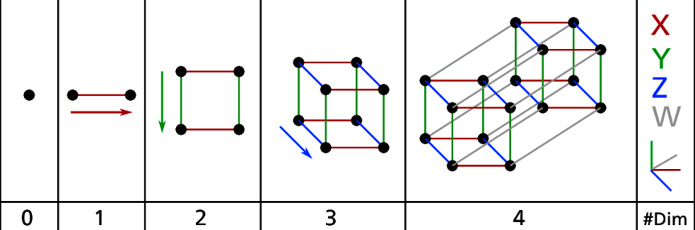
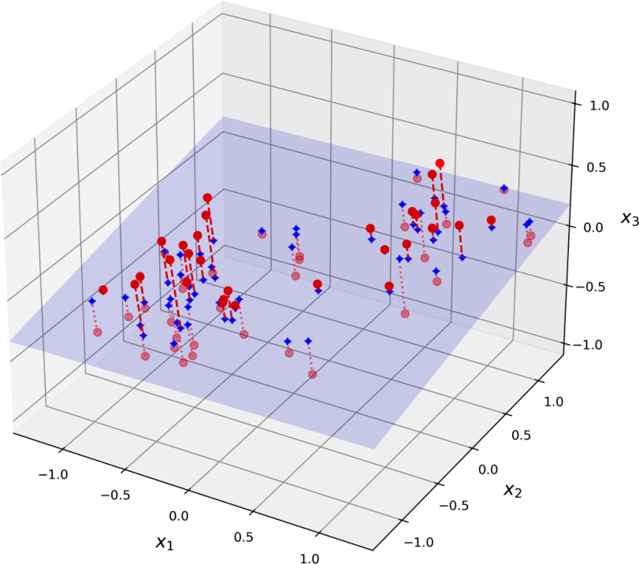
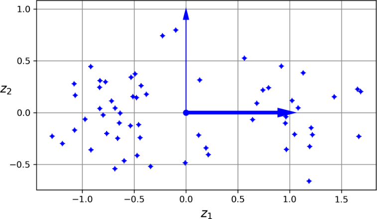
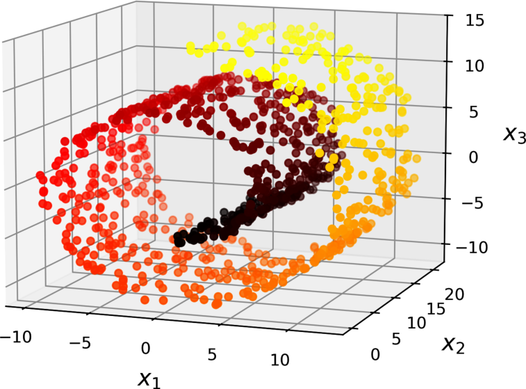
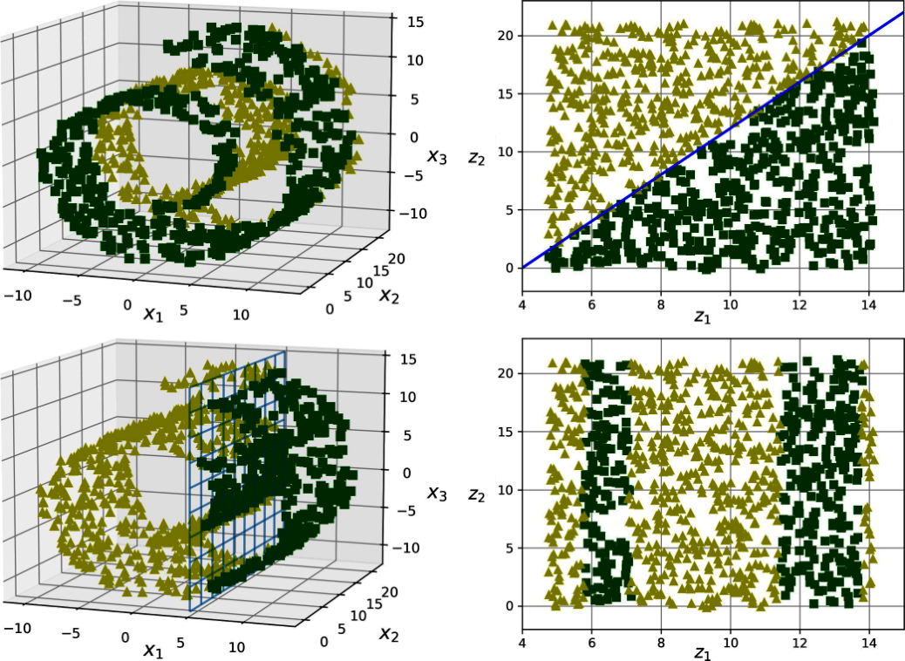
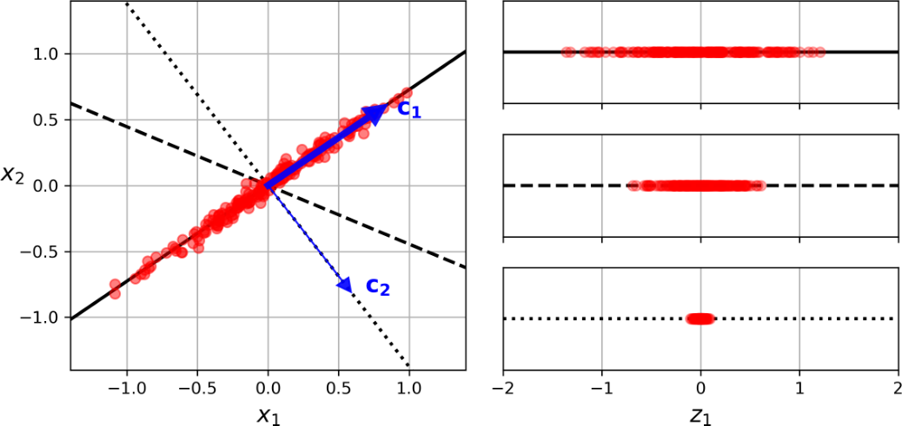
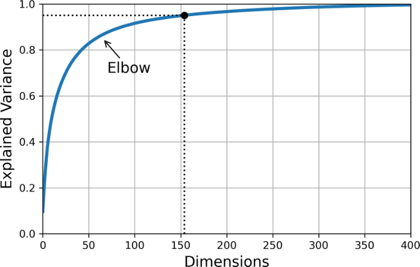
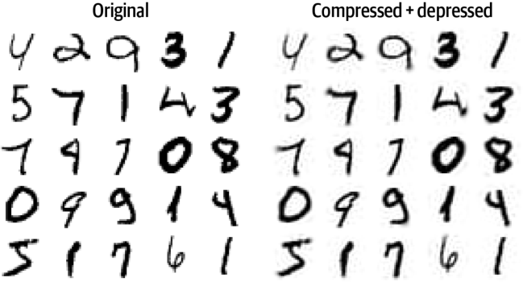
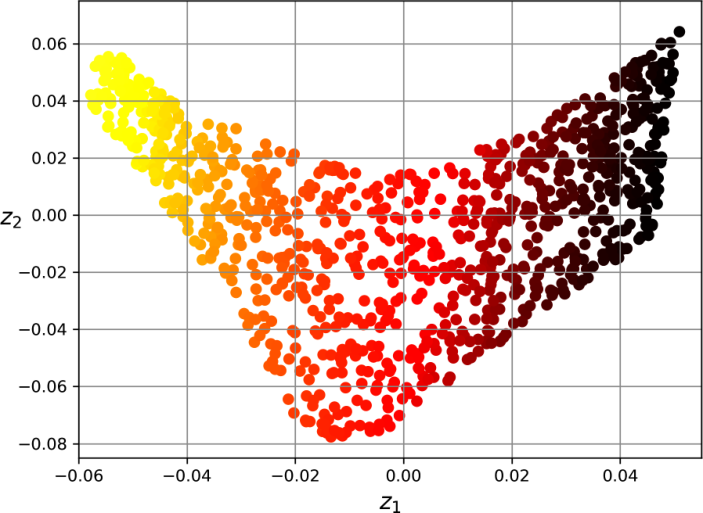
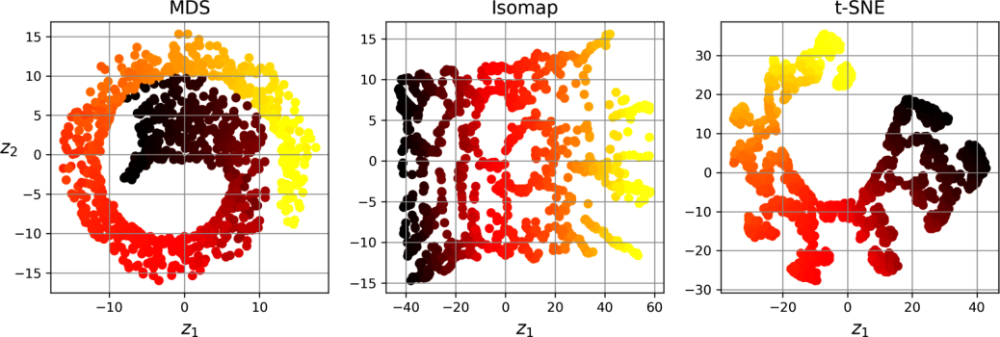

<!-- _class: cover -->
<!-- _footer: "主教材 Ch.7 pp.221–244；舊稿 04 s.1–46" -->
<!-- meta: minutes=1; core6=yes; block=0; source=主教材 Ch.7 pp.221–244 -->
# 降維與資料表示

第 8 週｜壓縮什麼、保留什麼，以及圖形能說明什麼

後續八週課程｜每週 180 分鐘（含兩次 10 分鐘休息）

<!-- 講者提示：先讓學生說明本頁符號或圖形，再連結前後概念。圖表中的教材結果僅作來源示例，不能當作本班重跑結果。 -->

---

<!-- _footer: "主教材 Ch.7 pp.221–244" -->
<!-- meta: minutes=1; core6=yes; block=0; source=主教材 Ch.7 pp.221–244 -->
## 本週成果與三段安排

0–50 分：維度災難、投影、PCA 幾何。

60–120 分：矩陣推導、保留維度、壓縮與實作。

130–180 分：隨機投影、流形方法與結果解讀。

成果：能做 PCA、解釋變異比例，並辨識視覺化的限制。

<!-- 講者提示：先讓學生說明本頁符號或圖形，再連結前後概念。圖表中的教材結果僅作來源示例，不能當作本班重跑結果。 -->

---

<!-- _class: figure -->
<!-- _footer: "主教材 Ch.7 p.222，圖 7-1" -->
<!-- meta: minutes=3; core6=yes; block=0; source=主教材 Ch.7 p.222，圖 7-1 -->
## 維度增加：大部分空間可能靠近邊界



高維空間的距離與密度直覺，不能直接沿用二維經驗。

<!-- 講者提示：先讓學生說明本頁符號或圖形，再連結前後概念。圖表中的教材結果僅作來源示例，不能當作本班重跑結果。 -->

---

<!-- _footer: "主教材 Ch.7 pp.222–223" -->
<!-- meta: minutes=5; core6=yes; block=0; source=主教材 Ch.7 pp.222–223 -->
## 維度災難帶來三個問題

- 要維持相似的資料密度，所需樣本可能大幅增加。
- 距離變得較不具區辨力，近鄰與分群更難。
- 特徵過多增加計算、雜訊與過擬合風險。

降維可能幫助，但也可能丟掉預測所需訊息。

<!-- 講者提示：先讓學生說明本頁符號或圖形，再連結前後概念。圖表中的教材結果僅作來源示例，不能當作本班重跑結果。 -->

---

<!-- _class: figure -->
<!-- _footer: "主教材 Ch.7 p.224，圖 7-2" -->
<!-- meta: minutes=3; core6=yes; block=0; source=主教材 Ch.7 p.224，圖 7-2 -->
## 投影：資料是否接近某個低維子空間？



把三維點投影到平面；若偏離平面的變化很小，損失可能有限。

<!-- 講者提示：先讓學生說明本頁符號或圖形，再連結前後概念。圖表中的教材結果僅作來源示例，不能當作本班重跑結果。 -->

---

<!-- _class: figure -->
<!-- _footer: "主教材 Ch.7 p.224，圖 7-3" -->
<!-- meta: minutes=3; core6=yes; block=0; source=主教材 Ch.7 p.224，圖 7-3 -->
## 在投影平面建立新的座標



主成分通常是原始特徵的線性組合，不等同刪掉幾個原始欄位。

<!-- 講者提示：先讓學生說明本頁符號或圖形，再連結前後概念。圖表中的教材結果僅作來源示例，不能當作本班重跑結果。 -->

---

<!-- _class: figure -->
<!-- _footer: "主教材 Ch.7 p.225，圖 7-4" -->
<!-- meta: minutes=3; core6=yes; block=0; source=主教材 Ch.7 p.225，圖 7-4 -->
## Swiss roll：彎曲流形無法靠平面直接攤開



資料內在可能接近二維，但嵌在三維且彎曲；線性投影會重疊。

<!-- 講者提示：先讓學生說明本頁符號或圖形，再連結前後概念。圖表中的教材結果僅作來源示例，不能當作本班重跑結果。 -->

---

<!-- _class: figure -->
<!-- _footer: "主教材 Ch.7 p.225，圖 7-5" -->
<!-- meta: minutes=3; core6=yes; block=0; source=主教材 Ch.7 p.225，圖 7-5 -->
## 攤開流形：保留局部鄰近關係


流形學習假設資料集中在低維結構附近；真實資料未必符合。

<!-- 講者提示：先讓學生說明本頁符號或圖形，再連結前後概念。圖表中的教材結果僅作來源示例，不能當作本班重跑結果。 -->

---

<!-- _class: figure -->
<!-- _footer: "主教材 Ch.7 p.227，圖 7-6" -->
<!-- meta: minutes=3; core6=yes; block=0; source=主教材 Ch.7 p.227，圖 7-6 -->
## 降維之後，分類邊界不一定更簡單



某些目標在流形座標容易分，其他目標卻可能更難；要看任務。

<!-- 講者提示：先讓學生說明本頁符號或圖形，再連結前後概念。圖表中的教材結果僅作來源示例，不能當作本班重跑結果。 -->

---

<!-- _class: figure -->
<!-- _footer: "主教材 Ch.7 p.228，圖 7-7" -->
<!-- meta: minutes=3; core6=yes; block=0; source=主教材 Ch.7 p.228，圖 7-7 -->
## PCA：選擇投影後變異最大的方向



第一主成分保留最多變異；後續方向與前面正交，再保留剩餘變異。

<!-- 講者提示：先讓學生說明本頁符號或圖形，再連結前後概念。圖表中的教材結果僅作來源示例，不能當作本班重跑結果。 -->

---

<!-- _footer: "主教材 Ch.7 pp.227–228；舊稿 04 s.4–8" -->
<!-- meta: minutes=5; core6=yes; block=0; source=主教材 Ch.7 pp.227–228；舊稿 04 s.4–8 -->
## PCA 的兩個等價觀點

1. 在正交線性投影中，最大化保留的變異。
2. 在固定維度下，最小化平方重建誤差。

先中心化資料；標準化是否適合，要依單位與任務判斷。

變異大不代表對標籤更有預測力。

<!-- 講者提示：PCA 類別會中心化但不自動把所有特徵縮成單位變異。 -->

---

<!-- _class: activity -->
<!-- _footer: "主教材 Ch.7 pp.221–244" -->
<!-- meta: minutes=17; core6=yes; block=0; source=主教材 Ch.7 pp.221–244 -->
## 先猜方向，再計算

資料點為 $(-2,-2),(-1,-1),(1,1),(2,2)$。

1. 哪條線能完整保留資料？
2. 投影到 x 軸與投影到對角線，哪個重建誤差小？
3. 若只留下「最大變異」，是否一定保留分類訊息？

<!-- 講者提示：主方向為 (1,1)/√2，對角線重建誤差0；x軸投影丟掉 y 變化。若標籤由小變異方向決定，PCA可能丟掉關鍵訊息。 -->

---

<!-- _class: activity -->
<!-- _footer: "主教材 Ch.7 pp.221–244" -->
<!-- meta: minutes=10; core6=yes; block=-1; source=主教材 Ch.7 pp.221–244 -->
## 休息 10 分鐘

離開座位、休息眼睛。回來後先用一句話回答上一段的核心問題。

<!-- 講者提示：保留完整休息；不要用來補講延伸內容。 -->

---

<!-- _footer: "主教材 Ch.7 pp.229–230，式 7-1、7-2" -->
<!-- meta: minutes=5; core6=yes; block=1; source=主教材 Ch.7 pp.229–230，式 7-1、7-2 -->
## PCA 的 SVD 寫法與矩陣形狀

$$X_c=X-\mathbf1\mu^T=U\Sigma V^T$$

$V$ 的欄為主成分方向。令 $W_d=[v_1,\ldots,v_d]\in\mathbb R^{n\times d}$。

$$Z=X_cW_d\in\mathbb R^{m\times d}$$

<!-- 講者提示：NumPy 返回 Vt，sklearn components_ 每列一個主成分；不要把轉置方向混用。 -->

---

<!-- _class: small -->
<!-- _footer: "舊稿 04 s.9–14；主教材 Ch.7 pp.228–229（推導補充）" -->
<!-- meta: minutes=5; core6=no; block=1; source=舊稿 04 s.9–14；主教材 Ch.7 pp.228–229（推導補充） -->
## 從共變異矩陣推導第一主成分

$$C=\frac1{m-1}X_c^TX_c,\qquad\max_{\|w\|=1} w^TCw$$

$$\mathcal L(w,\lambda)=w^TCw-\lambda(w^Tw-1)\Rightarrow Cw=\lambda w$$

選最大特徵值對應的單位特徵向量；後續方向依特徵值排序。

<!-- 講者提示：限制 ||w||=1 避免把方向任意放大；最大特徵值等於此方向的樣本變異。 -->

---

<!-- _footer: "教學自製數例；舊稿 04 s.13–23" -->
<!-- meta: minutes=5; core6=yes; block=1; source=教學自製數例；舊稿 04 s.13–23 -->
## 手算例：同一條線的共變異矩陣

前段四點已中心化，$C=\frac{10}{3}\begin{bmatrix}1&1\\1&1\end{bmatrix}$。

特徵值為 $20/3$ 與 $0$；第一方向為 $(1,1)^T/\sqrt2$。

第一主成分保留 100% 變異；主成分符號反轉不改變子空間。

<!-- 講者提示：XTX 每項10，樣本共變異分母3；若用分母m，特徵值尺度改變但方向與變異比例不變。 -->

---

<!-- _footer: "主教材 Ch.7 pp.230–231；舊稿 04 s.15–24" -->
<!-- meta: minutes=5; core6=yes; block=1; source=主教材 Ch.7 pp.230–231；舊稿 04 s.15–24 -->
## 解釋變異比例與保留維度

$$\rho_j=\frac{\lambda_j}{\sum_l\lambda_l},\qquad d=\min\left\{q:\sum_{j=1}^q\rho_j\ge\tau\right\}$$

例如 $\tau=0.95$ 保留 95% 變異；它不是保證保留 95% 分類正確率。

<!-- 講者提示：先讓學生說明本頁符號或圖形，再連結前後概念。圖表中的教材結果僅作來源示例，不能當作本班重跑結果。 -->

---

<!-- _class: figure -->
<!-- _footer: "主教材 Ch.7 p.232，圖 7-8" -->
<!-- meta: minutes=3; core6=yes; block=1; source=主教材 Ch.7 p.232，圖 7-8 -->
## 用累積曲線選 d：壓縮與保真之間的折衷



教材 MNIST 例子約需 154 個維度保留 95% 變異；數字會隨資料與前處理而變。

<!-- 講者提示：先讓學生說明本頁符號或圖形，再連結前後概念。圖表中的教材結果僅作來源示例，不能當作本班重跑結果。 -->

---

<!-- _class: small -->
<!-- _footer: "主教材 Ch.7 pp.231–233；舊稿 04 s.15–24" -->
<!-- meta: minutes=5; core6=yes; block=1; source=主教材 Ch.7 pp.231–233；舊稿 04 s.15–24 -->
## PCA 程式：先切分，再學投影

```python
from sklearn.decomposition import PCA
pca = PCA(n_components=0.95, svd_solver="full")
Z_train = pca.fit_transform(X_train)
Z_test = pca.transform(X_test)
X_rebuilt = pca.inverse_transform(Z_test)
print(pca.n_components_)
print(pca.explained_variance_ratio_.sum())
```

<!-- 講者提示：這段未標準化；如需縮放應用 Pipeline。若為CV，PCA也須放入Pipeline逐折fit。 -->

---

<!-- _footer: "主教材 Ch.7 p.234，式 7-3（補明中心化）" -->
<!-- meta: minutes=5; core6=yes; block=1; source=主教材 Ch.7 p.234，式 7-3（補明中心化） -->
## 逆投影：重建時要把平均值加回去

$$\hat X=ZW_d^T+\mathbf1\mu^T$$

教材式 7-3 的簡寫 $X_{\rm recovered}=X_{d\text{-proj}}W_d^T$，對應中心化座標。

丟掉的維度通常無法完整找回；inverse transform 不代表無損。

<!-- 講者提示：先讓學生說明本頁符號或圖形，再連結前後概念。圖表中的教材結果僅作來源示例，不能當作本班重跑結果。 -->

---

<!-- _class: figure -->
<!-- _footer: "主教材 Ch.7 p.234，圖 7-9" -->
<!-- meta: minutes=3; core6=yes; block=1; source=主教材 Ch.7 p.234，圖 7-9 -->
## 圖像壓縮：重建仍像數字，但細節已減少



同時看圖與量化重建 MSE；下游辨識表現也要單獨評估。

<!-- 講者提示：先讓學生說明本頁符號或圖形，再連結前後概念。圖表中的教材結果僅作來源示例，不能當作本班重跑結果。 -->

---

<!-- _class: small -->
<!-- _footer: "主教材 Ch.7 pp.233–235；舊稿 04 s.25–29" -->
<!-- meta: minutes=5; core6=yes; block=1; source=主教材 Ch.7 pp.233–235；舊稿 04 s.25–29 -->
## PCA 的計算選項

| 方法 | 適合情境 | 代價或條件 |
| --- | --- | --- |
| 完整 SVD PCA | 中小型資料、精確分解 | 需儲存主要矩陣 |
| Randomized PCA | 只需少量主成分 | 近似解，設定 random_state |
| Incremental PCA | 資料無法一次放入記憶體 | 分批 partial_fit；批次需夠大 |
| memmap | 磁碟映射大陣列 | 降低一次載入需求，仍有 I/O 成本 |

<!-- 講者提示：先讓學生說明本頁符號或圖形，再連結前後概念。圖表中的教材結果僅作來源示例，不能當作本班重跑結果。 -->

---

<!-- _class: activity -->
<!-- _footer: "主教材 Ch.7 pp.221–244" -->
<!-- meta: minutes=19; core6=yes; block=1; source=主教材 Ch.7 pp.221–244 -->
## 實作：壓縮率與辨識品質是否一起變好？

對已備妥的 digits 資料，比較 2、10、30 個主成分。

記錄：變異比例、重建 MSE、分類 CV 指標、運行時間。

離線：若特徵值是 `[8, 1.5, 0.5]`，保留 90% 至少需要幾維？

<!-- 講者提示：離線答案2維，累積95%；1維只有80%。實作需同切分，同一分類器，PCA放CV內。不要只憑二維散點好看就說模型較好。 -->

---

<!-- _class: activity -->
<!-- _footer: "主教材 Ch.7 pp.221–244" -->
<!-- meta: minutes=10; core6=yes; block=-1; source=主教材 Ch.7 pp.221–244 -->
## 休息 10 分鐘

離開座位、休息眼睛。回來後先用一句話回答上一段的核心問題。

<!-- 講者提示：保留完整休息；不要用來補講延伸內容。 -->

---

<!-- _footer: "主教材 Ch.7 pp.235–237" -->
<!-- meta: minutes=6; core6=yes; block=2; source=主教材 Ch.7 pp.235–237 -->
## 隨機投影：不用先找到主方向

$$Z=XP,\qquad P_{ij}\sim\mathcal N(0,1/d)$$

用隨機矩陣近似保留有限點集間的距離，計算便宜；不以最大化變異為目標。

<!-- 講者提示：先讓學生說明本頁符號或圖形，再連結前後概念。圖表中的教材結果僅作來源示例，不能當作本班重跑結果。 -->

---

<!-- _class: small -->
<!-- _footer: "主教材 Ch.7 p.235；JL 引理補充" -->
<!-- meta: minutes=6; core6=no; block=2; source=主教材 Ch.7 p.235；JL 引理補充 -->
## Johnson–Lindenstrauss 維度界線

$$d\ge\frac{4\log m}{\varepsilon^2/2-\varepsilon^3/3},\quad0<\varepsilon<1$$

以足夠高的目標維度，讓平方距離大致維持在原距離的 $(1\pm\varepsilon)$ 範圍。

這是保守理論界，不保證比原始維度更小；不是「任何高維都可壓成 2D」。

<!-- 講者提示：教材以5000點、epsilon=.1得到約7300維。整數取法依工具；若要求嚴格下界應上取整。 -->

---

<!-- _footer: "主教材 Ch.7 pp.236–238" -->
<!-- meta: minutes=6; core6=no; block=2; source=主教材 Ch.7 pp.236–238 -->
## 稀疏隨機投影：大部分矩陣元素為零

令非零機率為 $r$，非零元素取 $\pm1/\sqrt{dr}$，各占 $r/2$。

可減少儲存與乘法成本；教材常用 $r=1/\sqrt n$。

偽反矩陣可做近似重建，但投影已丟失資訊，不能期待還原全部細節。

<!-- 講者提示：先讓學生說明本頁符號或圖形，再連結前後概念。圖表中的教材結果僅作來源示例，不能當作本班重跑結果。 -->

---

<!-- _class: figure -->
<!-- _footer: "主教材 Ch.7 p.239，圖 7-10" -->
<!-- meta: minutes=4; core6=yes; block=2; source=主教材 Ch.7 p.239，圖 7-10 -->
## LLE：用鄰居重建每個點，再保持重建關係



先找局部鄰域權重，再尋找能維持這些權重的低維座標。

<!-- 講者提示：先讓學生說明本頁符號或圖形，再連結前後概念。圖表中的教材結果僅作來源示例，不能當作本班重跑結果。 -->

---

<!-- _footer: "主教材 Ch.7 p.240，式 7-4；舊稿 04 s.32–35" -->
<!-- meta: minutes=5; core6=no; block=2; source=主教材 Ch.7 p.240，式 7-4；舊稿 04 s.32–35 -->
## LLE 第一步：找到局部重建權重

$$\min_W\sum_i\left\|x_i-\sum_jw_{ij}x_j\right\|^2$$

限制：不是鄰居則 $w_{ij}=0$；每列 $\sum_jw_{ij}=1$。

權重描述局部幾何；鄰居數太少或太多都可能破壞結構。

<!-- 講者提示：先讓學生說明本頁符號或圖形，再連結前後概念。圖表中的教材結果僅作來源示例，不能當作本班重跑結果。 -->

---

<!-- _footer: "主教材 Ch.7 p.240，式 7-5；退化解限制補充" -->
<!-- meta: minutes=5; core6=no; block=2; source=主教材 Ch.7 p.240，式 7-5；退化解限制補充 -->
## LLE 第二步：保持權重，移動低維座標

$$\min_Z\sum_i\left\|z_i-\sum_jw_{ij}z_j\right\|^2$$

需加中心化與尺度限制，例如 $Z^T\mathbf1=0$、$Z^TZ=I$，排除全部點縮成零的退化解。

<!-- 講者提示：W 已固定；與第一步不同，此時求的是 Z。尺度限制的常數 convention 可不同。 -->

---

<!-- _class: figure -->
<!-- _footer: "主教材 Ch.7 p.242，圖 7-11" -->
<!-- meta: minutes=4; core6=yes; block=2; source=主教材 Ch.7 p.242，圖 7-11 -->
## 同一資料用不同降維方法，圖形可能很不同



MDS 著重距離；Isomap 著重沿流形的路徑距離；t-SNE 強調局部鄰近。

<!-- 講者提示：先讓學生說明本頁符號或圖形，再連結前後概念。圖表中的教材結果僅作來源示例，不能當作本班重跑結果。 -->

---

<!-- _class: small -->
<!-- _footer: "主教材 Ch.7 p.241；舊稿 04 s.30–45" -->
<!-- meta: minutes=5; core6=yes; block=2; source=主教材 Ch.7 p.241；舊稿 04 s.30–45 -->
## 其他方法與解讀界線

| 方法 | 保留／使用的資訊 | 注意 |
| --- | --- | --- |
| MDS | 點間距離 | 大樣本成本高 |
| Isomap | 近鄰圖的最短路徑距離 | 鄰居圖錯接會失真 |
| t-SNE | 局部相似度 | 群間距離與群大小不宜直接解釋 |
| LDA | 標籤導向可分性 | 監督式降維，需防標籤洩漏 |

<!-- 講者提示：先讓學生說明本頁符號或圖形，再連結前後概念。圖表中的教材結果僅作來源示例，不能當作本班重跑結果。 -->

---

<!-- _footer: "舊稿 04 s.36–46（補充）" -->
<!-- meta: minutes=5; core6=no; block=2; source=舊稿 04 s.36–46（補充） -->
## 補充 t-SNE：相似度不是原始距離的等比例縮圖

$$\operatorname{KL}(P\|Q)=\sum_{i\ne j}p_{ij}\log\frac{p_{ij}}{q_{ij}}$$

高維相似度以局部尺度建立；低維使用厚尾分布。Perplexity 調整有效鄰域尺度。

不同隨機種子與設定可能得到不同圖；UMAP 可作課後比較，不以單張圖確認真實群數。

<!-- 講者提示：不在本週強迫安裝 UMAP。若進一步教其演算法，需另讀原始文獻與套件說明。 -->

---

<!-- _footer: "主教材 Ch.7 pp.221–244" -->
<!-- meta: minutes=4; core6=yes; block=2; source=主教材 Ch.7 pp.221–244 -->
## 離堂檢核與作業

1. PCA 是選原始欄位，還是建立新座標？
2. 為什麼重建時要加回平均值？
3. t-SNE 上兩群相距兩倍，能否說原始距離也兩倍？

課後：Ch.7 練習 1–9；對同一資料呈現壓縮、視覺化與預測三種評估。

<!-- 講者提示：答案：線性組合新座標；PCA在中心化資料操作；不能。LDA需用標籤，所以不是無監督方法。 -->
