<!-- _class: cover -->
# 分群與表示應用

第 9 週｜K-means、GMM、階層式分群、DBSCAN 與表示應用

<!-- 講者提示：先讓學生說明本頁符號或圖形，再連結前後概念。圖表中的固定結果僅供讀圖，不能當作本班重跑結果。 -->

---
## 學習重點與成果

- 分群任務、K-means 目標、初始化與群數判斷。

- GMM／EM 的軟分群，以及階層式分群的樹狀結構。

- DBSCAN 的密度連通、影像分割與少量標註應用。

成果：能依資料形狀與任務選擇分群方法，並以程式檢查結果與限制。

<!-- notebook-companion-link -->
> 💻 **配套 Notebook**：`programs/notebooks/09_分群與表示應用.ipynb`。程式片段、實際圖表與表格可由此檔重現。

<!-- 講者提示：先讓學生說明本頁符號或圖形，再連結前後概念。圖表中的固定結果僅供讀圖，不能當作本班重跑結果。 -->

<!-- Notebook 對照：程式 09-01、09-02；完整對照見本章 ipynb 開頭。 -->

---
<!-- notebook-result-slide -->
<!-- _class: small -->
## 程式實驗與實際輸出

<div class="columns wide-left">
<div>

```python
km = KMeans(n_clusters=k, n_init=10)
score = silhouette_score(X, km.fit_predict(X))
```

**觀察**：inertia 會隨 k 下降，輪廓分數提供另一個群內緊密與群間分離的角度。

參考程式：`programs/notebooks/09_分群與表示應用.ipynb`

</div>
<div>

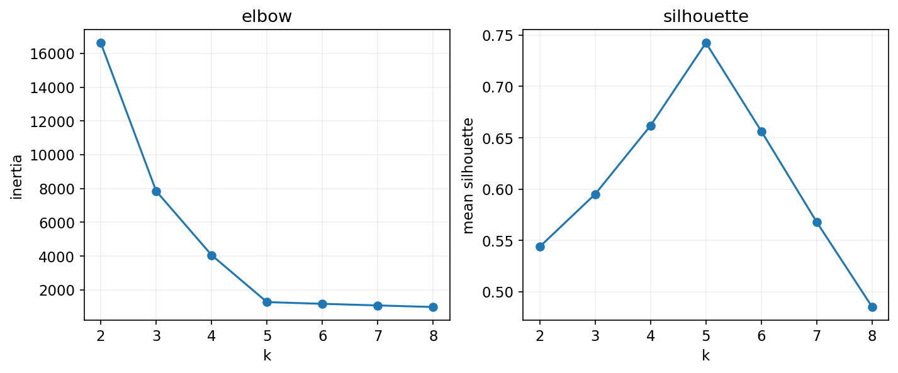

</div>
</div>

<!-- 講者提示：程式與圖為 programs/notebooks/09_分群與表示應用.ipynb 的已執行輸出。 -->

<!-- Notebook 對照：程式 09-05；完整對照見本章 ipynb 開頭。圖例與小型實驗的資料、評估方式及適用範圍各自標示。 -->

---
<!-- _class: figure -->
## 沒有標籤時，資料自己呈現什麼結構？


分類用已知答案學習；分群先依特徵相似性找結構，群編號不是已知類別。

<!-- 講者提示：先讓學生說明本頁符號或圖形，再連結前後概念。圖表中的固定結果僅供讀圖，不能當作本班重跑結果。 -->

<!-- Notebook 對照：程式 09-09；完整對照見本章 ipynb 開頭。圖例與小型實驗的資料、評估方式及適用範圍各自標示。 -->

---
## 分群可用於哪些任務？

- 探索顧客、文件或行為的相似群體。
- 推薦同群使用者偏好的內容，或縮小相似影像的搜尋候選集。
- 影像顏色量化與資料摘要。
- 建立距離型特徵，供後續分類或迴歸。
- 挑選代表樣本標註，協助半監督學習。

推薦與搜尋還需要排序與成效驗證；距離所有中心都遠，可作異常候選訊號。

<!-- 講者提示：群名需事後依特徵與業務解釋，不要只用群號就推斷人群本質。 -->

<!-- Notebook 對照：程式 09-07、09-11；完整對照見本章 ipynb 開頭。 -->

---
<!-- _class: figure -->
## K-means：把點指派給最近的中心

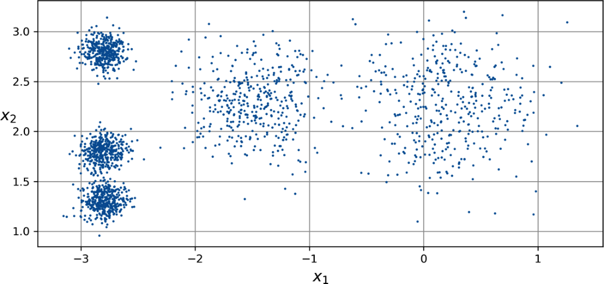

先指定 k；模型交替估計中心位置與樣本所屬群。

<!-- 講者提示：先讓學生說明本頁符號或圖形，再連結前後概念。圖表中的固定結果僅供讀圖，不能當作本班重跑結果。 -->

<!-- Notebook 對照：程式 09-04、09-09；完整對照見本章 ipynb 開頭。圖例與小型實驗的資料、評估方式及適用範圍各自標示。 -->

---
<!-- _class: figure -->
## 最近中心形成 Voronoi 分區

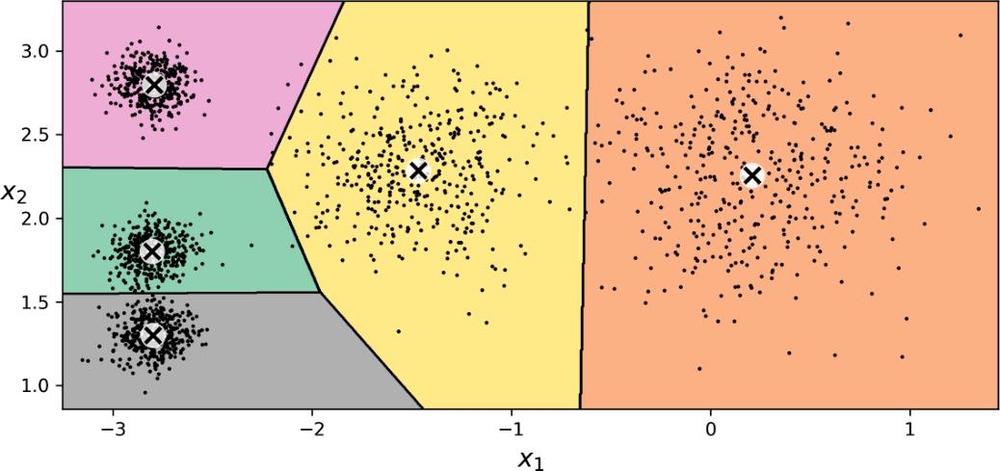

邊界由等距位置決定；中心的改變會改變整個分區。

<!-- 講者提示：先讓學生說明本頁符號或圖形，再連結前後概念。圖表中的固定結果僅供讀圖，不能當作本班重跑結果。 -->

<!-- Notebook 對照：程式 09-04、09-09；完整對照見本章 ipynb 開頭。圖例與小型實驗的資料、評估方式及適用範圍各自標示。 -->

---
## 目標函數：最小化群內平方距離

$$I=\sum_{i=1}^m\|x_i-\mu_{c_i}\|^2$$

$c_i$ 是第 i 筆的群編號；$\mu_{c_i}$ 是該群中心。

K-means 的慣性（inertia）越小，表示同一個 k 下群內更緊密。

<!-- 講者提示：必須同一資料、同一縮放比較。k增加時inertia自然不增，所以不能只選最低inertia。 -->

<!-- Notebook 對照：程式 09-03、09-09；完整對照見本章 ipynb 開頭。 -->

---
## 兩步交替：指派與更新

$$c_i\leftarrow\arg\min_j\|x_i-\mu_j\|^2$$

$$\mu_j\leftarrow\frac1{|C_j|}\sum_{i\in C_j}x_i$$

直到指派或中心移動足夠小；空群需由實作重新初始化等策略處理。

<!-- 講者提示：先讓學生說明本頁符號或圖形，再連結前後概念。圖表中的固定結果僅供讀圖，不能當作本班重跑結果。 -->

<!-- Notebook 對照：程式 09-03、09-09；完整對照見本章 ipynb 開頭。 -->

---
<!-- _class: figure -->
## 觀察迭代：中心移動，群邊界跟著改變

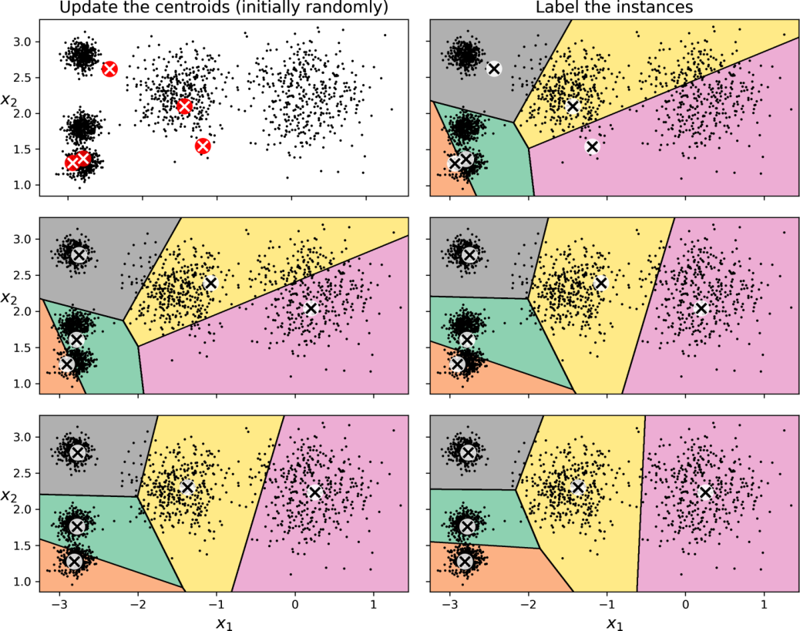

每步固定另一部分再改善目標；可收斂到局部解，不保證全域最佳。

<!-- 講者提示：先讓學生說明本頁符號或圖形，再連結前後概念。圖表中的固定結果僅供讀圖，不能當作本班重跑結果。 -->

<!-- Notebook 對照：程式 09-09；完整對照見本章 ipynb 開頭。圖例與小型實驗的資料、評估方式及適用範圍各自標示。 -->

---
<!-- _class: activity -->
## 手算一維 K-means 的兩步

資料 `[0, 1, 4, 5]`，初始中心 `[0, 4]`。

1. 指派各點到最近中心。
2. 更新兩個平均中心。
3. 算更新前、後的 inertia，再看是否還會改群。

<!-- 講者提示：初始兩群[0,1]、[4,5]，inertia=2；中心更新為.5、4.5，inertia=1；指派不變。 -->

<!-- Notebook 對照：程式 09-03；完整對照見本章 ipynb 開頭。 -->

---
## 群編號沒有天然大小與固定語義

同一個合理分群，某次叫群 0，另一次可能叫群 2。

比較兩次分群時，不能直接把群編號當真實標籤計算 accuracy。

有外部標籤時，可用對編號置換不敏感的指標，例如 ARI；外部標籤仍不等於唯一正確分群。

<!-- 講者提示：先讓學生說明本頁符號或圖形，再連結前後概念。圖表中的固定結果僅供讀圖，不能當作本班重跑結果。 -->

<!-- Notebook 對照：程式 09-03、09-09；完整對照見本章 ipynb 開頭。 -->

---
<!-- _class: small -->
## K-means 的群號、距離與分數

```python
from sklearn.cluster import KMeans
km = KMeans(n_clusters=5, n_init=10, random_state=42)
labels = km.fit_predict(X_train)
new_labels = km.predict(X_new)
distances = km.transform(X_new)
```

`labels_` 是訓練群號；`cluster_centers_` 是中心；`inertia_` 是訓練平方距離和。`score(X)` 回傳負 inertia，並非分類 accuracy。

<!-- 講者提示：transform 的 shape 是新樣本數×5。這些距離不會自動加總成1，也不是 GMM 的後驗機率。 -->

<!-- Notebook 對照：程式 09-09；完整對照見本章 ipynb 開頭。 -->

---
<!-- _class: activity -->
## K-means 一輪更新的兩個步驟

給定中心 $c_1,c_2$，先把每筆資料指派到最近中心，再以群內平均更新中心：

$$a_i=\arg\min_k\|x_i-c_k\|^2,\qquad c_k=\frac{1}{|C_k|}\sum_{i\in C_k}x_i$$

指派步驟固定中心，更新步驟固定群號；兩步都不增加群內平方和，但結果仍可能依初始化而不同。

<!-- 講者提示：先讓學生獨立檢核本頁的假設、公式與結論，再與相鄰的模型概念對照。 -->

---
<!-- _class: figure -->
## 不同初始化，可能得到不同局部解

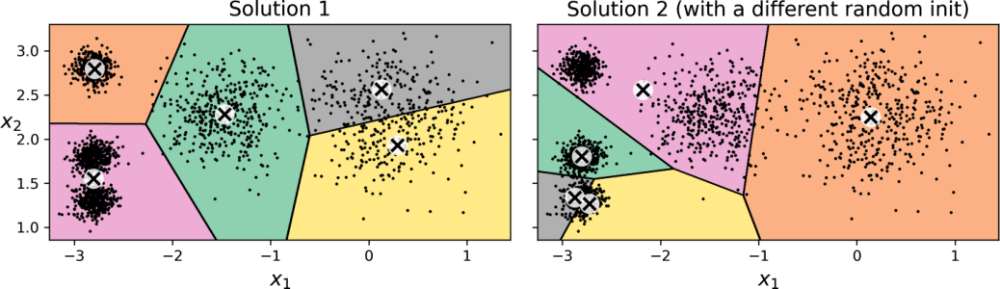

重複啟動並比較 inertia；固定 random_state 方便重現。

<!-- 講者提示：先讓學生說明本頁符號或圖形，再連結前後概念。圖表中的固定結果僅供讀圖，不能當作本班重跑結果。 -->

<!-- Notebook 對照：程式 09-09、09-04；完整對照見本章 ipynb 開頭。圖例與小型實驗的資料、評估方式及適用範圍各自標示。 -->

---
## K-means++ 與多次初始化

K-means++ 讓後續初始中心傾向遠離已選中心，降低一開始擠在一起的風險。

`n_init` 控制重跑次數；教學明確寫出數值，避免依賴版本預設。

```python
from sklearn.cluster import KMeans
KMeans(n_clusters=5, init="k-means++",
       n_init=10, random_state=42)
```

<!-- 講者提示：kmeans++只是改善初始化，仍不是全域最優保證。 -->

<!-- Notebook 對照：程式 09-04、09-09；完整對照見本章 ipynb 開頭。 -->

---
## K-means++ 的抽樣機率

先均勻隨機選第一個中心。令 $D_i$ 為第 $i$ 點到最近已選中心的距離：

$$P(\text{選第 }i\text{ 點})=\frac{D_i^2}{\sum_jD_j^2}$$

例如距離為 `[0,1,3]`，抽樣機率為 `[0,0.1,0.9]`；較遠的點較容易入選，但不是每次都選最遠者。

先備中心可直接交給 `init=centers, n_init=1`；一般 K-means++ 仍可配多次重啟。

<!-- 講者提示：sklearn 採 greedy k-means++ 變體；此頁說明原始抽樣原理。若剩餘距離皆零，不能再從此公式選不同位置。 -->

<!-- Notebook 對照：程式 09-09；完整對照見本章 ipynb 開頭。 -->

---
## 加速方式：避開多餘距離，或改用小批次

- Elkan：利用三角不等式與距離界線，減少重算；不保證每份資料都更快。
- MiniBatchKMeans：每次用小批次更新中心。
- 分批方法更省記憶體與時間，但 inertia 可能稍差。
- Lloyd 每輪約需 $O(mkn)$；總成本還乘上迭代與重啟次數。
- 資料超過記憶體時可分批 `partial_fit`；需自行安排初始化與批次。

<!-- 講者提示：距離界線方法可能增加額外記憶體；不要把所有加速方法都說成更省記憶體。 -->

<!-- Notebook 對照：程式 09-09；完整對照見本章 ipynb 開頭。 -->

---
<!-- _class: figure -->
## k 選錯：可能切碎一群，或合併不同群


左圖 k=3 合併了部分結構；右圖 k=8 切出更多小群。先問切法是否符合分析任務。

<!-- 講者提示：先讓學生說明本頁符號或圖形，再連結前後概念。圖表中的固定結果僅供讀圖，不能當作本班重跑結果。 -->

<!-- Notebook 對照：程式 09-09、09-05；完整對照見本章 ipynb 開頭。圖例與小型實驗的資料、評估方式及適用範圍各自標示。 -->

---
<!-- _class: figure -->
## 肘部法：找 inertia 改善開始遞減的位置

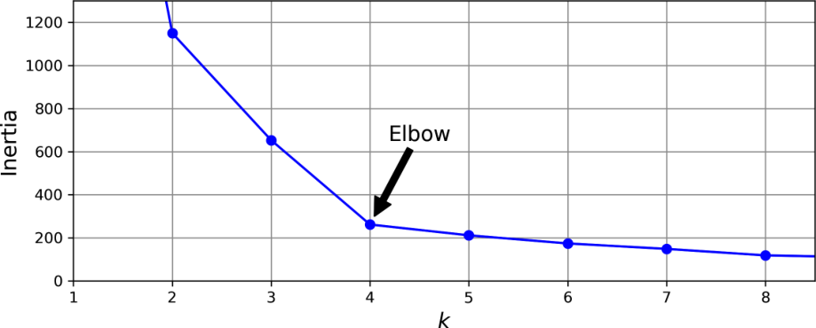

inertia 隨 k 增加而下降；肘部可能不明顯，也可能不只一個，不能只選最小 inertia。

<!-- 講者提示：先讓學生說明本頁符號或圖形，再連結前後概念。圖表中的固定結果僅供讀圖，不能當作本班重跑結果。 -->

<!-- Notebook 對照：程式 09-05；完整對照見本章 ipynb 開頭。圖例與小型實驗的資料、評估方式及適用範圍各自標示。 -->

---
<!-- _class: figure -->
## 平均輪廓分數：把群內與群外距離一起比較

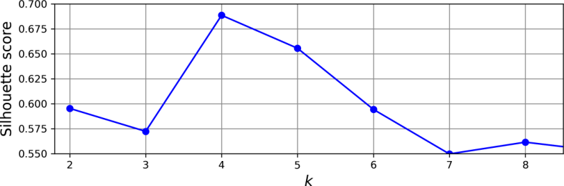

此圖最高值在 k=4；它與 inertia 的肘部可能給出不同線索，下一頁拆解計算公式。

<!-- 講者提示：先讓學生說明本頁符號或圖形，再連結前後概念。圖表中的固定結果僅供讀圖，不能當作本班重跑結果。 -->

<!-- Notebook 對照：程式 09-05、09-10；完整對照見本章 ipynb 開頭。圖例與小型實驗的資料、評估方式及適用範圍各自標示。 -->

---
<!-- _class: small -->
## 輪廓係數：群內近，群外遠

$$s_i=\frac{b_i-a_i}{\max(a_i,b_i)}$$

$a_i$：與同群其他點的平均距離。

$b_i$：到每個其他群的平均距離中，最小的一個。

越接近 1 通常越清楚；接近 0 在邊界；負值可能指派不佳。

<!-- 講者提示：b不是到最近單點的距離。單點群慣例給0；計算需至少2群且群數小於樣本數。 -->

<!-- Notebook 對照：程式 09-05、09-10；完整對照見本章 ipynb 開頭。 -->

---
<!-- _class: figure -->
## 輪廓圖：不要只看整體平均

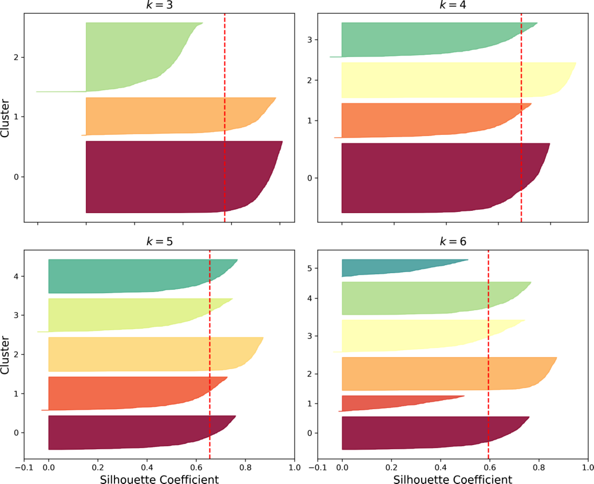

每群的寬度、負值與大小不均也值得檢查；虛線是整體平均參考。

<!-- 講者提示：先讓學生說明本頁符號或圖形，再連結前後概念。圖表中的固定結果僅供讀圖，不能當作本班重跑結果。 -->

<!-- Notebook 對照：程式 09-10；完整對照見本章 ipynb 開頭。圖例與小型實驗的資料、評估方式及適用範圍各自標示。 -->

---
<!-- _class: activity -->
## 手算輪廓係數，並質疑平均值

某點 $a=2,b=5$；另一點 $a=4,b=3$。

1. 各算輪廓係數。
2. 若平均很高但少數群很多負值，能直接宣布分群成功嗎？
3. 若一群只有一個樣本，為何需特別處理？

<!-- 講者提示：兩點分別 .6、-.25。應看每群分布與業務意義；單點群的a沒有同群其他點可平均，常設s=0。 -->

<!-- Notebook 對照：程式 09-05、09-10；完整對照見本章 ipynb 開頭。 -->

---
<!-- _class: figure -->
## K-means 的限制：橢圓、密度與群大小差異

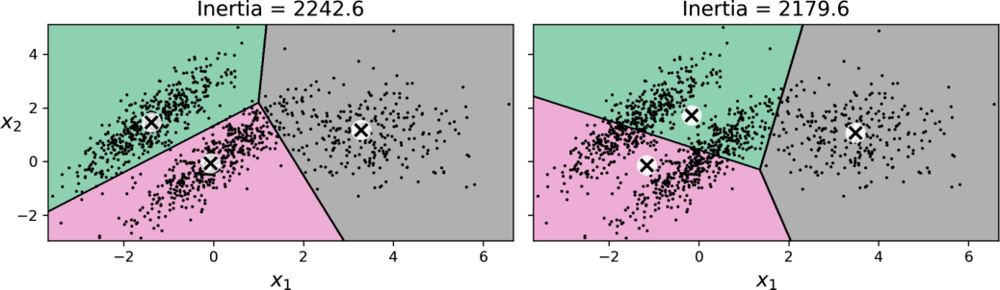

K-means 偏好近似等向、相近尺度的群；複雜形狀不宜硬套最近中心。

<!-- 講者提示：先讓學生說明本頁符號或圖形，再連結前後概念。圖表中的固定結果僅供讀圖，不能當作本班重跑結果。 -->

<!-- Notebook 對照：程式 09-06；完整對照見本章 ipynb 開頭。圖例與小型實驗的資料、評估方式及適用範圍各自標示。 -->

---
## 縮放之前，先定義什麼叫「相似」

收入、年齡、次數的單位不同，歐氏距離可能被大尺度欄位主導。

標準化是一個選擇；若某欄本來就應更重要，可以明確設定權重並驗證。

分群結果是「特徵、距離、演算法、超參數」共同決定的。

<!-- 講者提示：先讓學生說明本頁符號或圖形，再連結前後概念。圖表中的固定結果僅供讀圖，不能當作本班重跑結果。 -->

<!-- Notebook 對照：程式 09-06、09-10；完整對照見本章 ipynb 開頭。 -->

---
<!-- _class: activity -->
## 選群數：輪廓係數的意義

對單筆樣本，$a$ 是同群平均距離，$b$ 是最近其他群的平均距離：

$$s=\frac{b-a}{\max(a,b)}$$

例如 $a=2,b=5$，則 $s=(5-2)/5=0.6$。接近 $1$ 表示更靠近本群；接近 $0$ 表示位於邊界。群數選擇仍需結合任務意義與群大小。

<!-- 講者提示：先讓學生獨立檢核本頁的假設、公式與結論，再與相鄰的模型概念對照。 -->

---
<!-- _class: figure -->
## 用 K-means 做顏色量化與影像分割

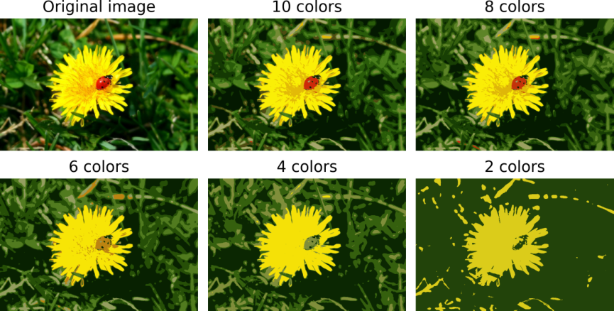

把每個像素的 RGB 當三維點，以群中心顏色取代原色；少量顏色能形成簡化影像。

<!-- 講者提示：這是依顏色分組，不是理解物件。小物件可能被合併到背景顏色，教材瓢蟲就是例子。 -->

<!-- Notebook 對照：程式 09-07；完整對照見本章 ipynb 開頭。圖例與小型實驗的資料、評估方式及適用範圍各自標示。 -->

---
<!-- _class: small -->
## 顏色、語意與實例分割

| 任務 | 一個區域的意義 | 例子 |
| --- | --- | --- |
| 顏色分割 | 類似顏色 | 瓢蟲的紅色、葉片的綠色 |
| 語意分割 | 同一物件類型 | 所有行人像素同屬「行人」 |
| 實例分割 | 同一個物件 | 行人 A、行人 B 分開標記 |

RGB K-means 只做顏色分組。小物件即使顏色醒目，也可能因像素太少被併入其他顏色群。

<!-- 講者提示：請學生用本頁的例子說明概念，再連結前後頁。 -->

<!-- Notebook 對照：程式 09-07；完整對照見本章 ipynb 開頭。 -->

---
<!-- _class: small -->
## 影像轉換的陣列形狀

```python
# image: (height, width, 3)，數值尺度需一致
pixels = image.reshape(-1, 3)
km = KMeans(n_clusters=8, n_init=10, random_state=42)
labels = km.fit_predict(pixels)
segmented = km.cluster_centers_[labels].reshape(image.shape)
```

群中心代表典型顏色；此流程未利用像素位置與空間連續性。

<!-- 講者提示：高解析影像可先抽樣訓練或MiniBatch；不要把浮點0–1與整數0–255混用。 -->

<!-- Notebook 對照：程式 09-07；完整對照見本章 ipynb 開頭。 -->

---
## 把距離轉成新的特徵表示

$$\phi(x)=[\|x-\mu_1\|,\ldots,\|x-\mu_k\|]$$

`KMeans.transform(X)` 得到每筆對各中心的距離；可交給後續監督模型。

中心也屬於學到的前處理，必須只從訓練資料建立。

<!-- 講者提示：距離表示不一定比原始特徵好，應對照無分群轉換的基準。 -->

<!-- Notebook 對照：程式 09-11；完整對照見本章 ipynb 開頭。 -->

---
## 只有 50 個標籤：先標哪些資料？

直接使用前 50 筆有標籤資料作基準；公平比較時也可重複隨機抽樣 50 筆。

另一個方法：先把未標註訓練集分成 50 群，每群選最靠近中心的樣本交由人標註。

群數不需要等於類別數；一個數字類別可能有多種書寫樣貌。

<!-- 講者提示：先讓學生說明本頁符號或圖形，再連結前後概念。圖表中的固定結果僅供讀圖，不能當作本班重跑結果。 -->

<!-- Notebook 對照：程式 09-08、09-11；完整對照見本章 ipynb 開頭。 -->

---
<!-- _class: figure -->
## 代表樣本：每群挑一張最接近中心的圖

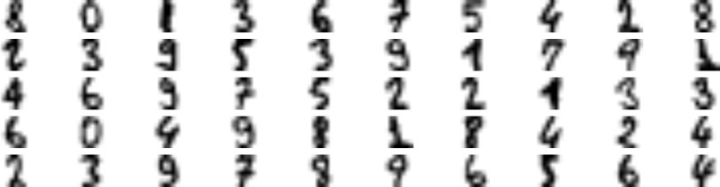

人類只標這些代表樣本；群中心本身是平均向量，未必是一張真實圖。

<!-- 講者提示：先讓學生說明本頁符號或圖形，再連結前後概念。圖表中的固定結果僅供讀圖，不能當作本班重跑結果。 -->

<!-- Notebook 對照：程式 09-11；完整對照見本章 ipynb 開頭。圖例與小型實驗的資料、評估方式及適用範圍各自標示。 -->

---
<!-- _class: small -->
## 代表樣本與標籤傳播的陣列操作

```python
dist = km.fit_transform(X_unlabeled_train)
representative_idx = dist.argmin(axis=0)
# 逐張人工標註代表樣本，取得 y_representative
pseudo_y = y_representative[km.labels_]
own_dist = dist[np.arange(len(dist)), km.labels_]
```

每群依 `own_dist` 的中位數保留較近的一半，重新訓練分類器。群號不是類別答案，不可直接當成 `y`。

<!-- 講者提示：本段 km 需先設為 KMeans(n_clusters=50,n_init=10,random_state=42)。np 需匯入；y_representative 是長度50的 NumPy 整數陣列。每次重分群須重新對齊代表樣本，不能抄原 notebook 的標籤陣列。 -->

<!-- Notebook 對照：程式 09-08、09-11；完整對照見本章 ipynb 開頭。 -->

---
<!-- _class: small -->
## 教材少量標註實驗：每一步改變了什麼？

| 策略 | 教材測試 accuracy | 解讀 |
| --- | --- | --- |
| 前 50 筆有標籤 | 75.8% | 少標籤基準 |
| 50 個代表樣本 | 83.4% | 標註選樣策略 |
| 傳播給全群 | 86.9% | 增加偽標籤訓練資料 |
| 只傳播給較近的一半 | 88.4% | 降低遠端錯誤傳播 |

<!-- 講者提示：完整標籤教材基準約90.9%。數字是特定digits切分的結果，不能當成普遍改善幅度或因果證明。 -->

<!-- Notebook 對照：程式 09-08、09-11；完整對照見本章 ipynb 開頭。 -->

---
## 標籤傳播需要「群內標籤一致」的假設

若某群混合不同真實類別，代表樣本的標籤可能傳錯整群。

可只使用靠近中心的樣本，或保留人工複核的不確定區域。

教材的 98.9% 是保留下來的「偽標籤正確率」，不是分類器測試 accuracy；真實無標籤資料無法直接知道此值。

`LabelPropagation`／`LabelSpreading` 使用相似圖；`SelfTrainingClassifier` 則反覆加入高信心偽標籤。

<!-- 講者提示：这些是不同方法，不要把教材的中心標籤傳播當作LabelPropagation API的內部算法。 -->

<!-- Notebook 對照：程式 09-08、09-11；完整對照見本章 ipynb 開頭。 -->

---
## 主動學習：讓模型提出下一筆標註需求

1. 使用目前標籤訓練模型。
2. 從未標註資料找出不確定、分歧或資訊量高的樣本。
3. 交由人類標註，再重新訓練。
4. 記錄標註成本與獨立驗證的改善。

<!-- 講者提示：uncertainty sampling可用最大類別機率最低或entropy最高。不要把測試標籤用來挑樣本。 -->

<!-- Notebook 對照：程式 09-11；完整對照見本章 ipynb 開頭。 -->

---
<!-- _class: activity -->
## 實作與報告：群數不是一個神奇答案

對小型資料比較 k=2 到 8，畫 inertia 與 silhouette。

挑兩個候選 k，逐群報告大小、中心、代表樣本與可能意義。

離線組：對「收入×購買次數」的顧客群提出縮放與命名方案，列出不能推論的事情。

<!-- 講者提示：評分在多種證據與限制：不能只給最佳k；不得直接把群命名成好／壞客戶而無定義。 -->

<!-- Notebook 對照：程式 09-08、09-11；完整對照見本章 ipynb 開頭。 -->

---
<!-- _class: lead -->
## 第二部分：不只 K-means

K-means 用最近中心形成硬分區，但來源簡報也包含三種不同結構假設：

1. GMM：以多個機率分布描述資料，提供軟分群。
2. 階層式分群：逐步合併或分割，保留群之間的樹狀關係。
3. DBSCAN：由高密度區域擴張，可標出雜訊。

<!-- 講者提示：本段完整涵蓋 source_pptx/05_Clustering.pptx 第 12–27 頁。第 10 週再深入機率模型、異常分數與選模。 -->

---
<!-- _class: small -->
## GMM：每個群是一個高斯成分

$$p(x)=\sum_{k=1}^{K}\pi_k\,\mathcal N(x\mid\mu_k,\Sigma_k),
\qquad \pi_k\ge0,\quad\sum_k\pi_k=1$$

- $\pi_k$ 是第 $k$ 個成分的混合權重。
- $\mu_k$ 決定位置，$\Sigma_k$ 決定橢圓的尺度、方向與特徵關聯。
- 樣本對各成分的責任值 $r_{ik}=P(z_i=k\mid x_i)$ 可介於 0 與 1。

K-means 給每筆資料一個最近中心；GMM 同時估計群形狀、相對權重與軟歸屬。

<!-- 講者提示：對應來源 PPTX 第 12–14、16–17 頁。GMM 是密度模型；高斯成分編號仍沒有天然語義。 -->

---
<!-- _class: small -->
## EM：在責任值與參數之間交替

E-step 使用目前參數計算責任值：

$$r_{ik}=\frac{\pi_k\mathcal N(x_i\mid\mu_k,\Sigma_k)}
{\sum_j\pi_j\mathcal N(x_i\mid\mu_j,\Sigma_j)}$$

M-step 以責任值作為權重更新參數：

$$N_k=\sum_i r_{ik},\quad
\pi_k=\frac{N_k}{m},\quad
\mu_k=\frac{1}{N_k}\sum_i r_{ik}x_i$$

$$\Sigma_k=\frac{1}{N_k}\sum_i r_{ik}(x_i-\mu_k)(x_i-\mu_k)^T$$

每輪不降低對數似然，但仍可能停在局部解；初始化、`n_init` 與數值正則化都重要。

<!-- 講者提示：來源 PPTX 第 15–18 頁。PPTX 的「E-step 把實例分到群」應改成軟責任值；不是先做硬指派再更新。 -->

---
<!-- _class: small -->
## GMM 程式：軟歸屬、密度與成分數

```python
from sklearn.mixture import GaussianMixture

gm = GaussianMixture(n_components=3, covariance_type="full",
                     n_init=5, reg_covar=1e-6,
                     random_state=42).fit(X)
labels = gm.predict(X)          # 最大責任值的成分
prob = gm.predict_proba(X)      # shape: (n_samples, 3)
log_density = gm.score_samples(X)
bic = gm.bic(X)                # 同一資料下越小越好
```

`covariance_type` 可選 `full`、`tied`、`diag`、`spherical`。限制越強，參數越少，但未必能表達傾斜或不同方向的橢圓群。

<!-- 講者提示：程式 09-12；來源 PPTX 第 19–20 頁。官方 API：https://scikit-learn.org/stable/modules/generated/sklearn.mixture.GaussianMixture.html。 -->

---
## 階層式分群：保留每次合併的歷史

- 凝聚式由每筆資料各自成群開始，每輪合併最接近的兩群。
- 分割式由一個大群開始，逐步切開；本課程程式以凝聚式為主。
- $n$ 筆資料一開始有 $n(n-1)/2$ 個成對距離。
- 樹狀圖的合併高度代表當次使用的群間不相似度。

在樹狀圖選擇切割高度，就能得到不同群數。這個高度是分析決策，不是資料自動給出的唯一答案。

<!-- 講者提示：對應來源 PPTX 第 21–23 頁。樹狀圖的葉順序不代表額外的一維特徵大小。 -->

---
<!-- _class: small -->
## Linkage 決定兩群之間怎麼量距離

| Linkage | 兩群距離的定義 | 常見特性 |
| --- | --- | --- |
| single | 所有跨群點對的最小距離 | 可連出長鏈，對橋接點敏感 |
| complete | 所有跨群點對的最大距離 | 偏好較緊密的群 |
| average | 所有跨群點對距離的平均 | 介於 single 與 complete |
| Ward | 選擇使群內平方和增加最少的合併 | 適用歐氏距離，偏好較緊密群 |

距離度量、縮放與 linkage 共同決定樹。不同設定得到不同群階層，應以任務與穩定性檢查。

<!-- 講者提示：來源 PPTX 第 22 頁。SciPy linkage 文件：https://docs.scipy.org/doc/scipy/reference/generated/scipy.cluster.hierarchy.linkage.html。 -->

---
<!-- _class: small -->
## 階層式分群程式：畫樹再切群

```python
from scipy.cluster.hierarchy import linkage, dendrogram
from sklearn.cluster import AgglomerativeClustering

Z = linkage(X, method="ward", metric="euclidean")
dendrogram(Z, truncate_mode="lastp", p=20)

hc = AgglomerativeClustering(n_clusters=3,
                             linkage="ward")
labels = hc.fit_predict(X)
```

`Z` 的每列記錄被合併的兩群、合併距離與新群樣本數。大型資料的完整距離與樹可能很昂貴，可先抽樣或使用結構限制。

<!-- 講者提示：程式 09-13。SciPy dendrogram：https://docs.scipy.org/doc/scipy/reference/generated/scipy.cluster.hierarchy.dendrogram.html；sklearn AgglomerativeClustering：https://scikit-learn.org/stable/modules/generated/sklearn.cluster.AgglomerativeClustering.html。 -->

---
<!-- _class: small -->
## DBSCAN：核心點把高密度區域連起來

對每個點建立半徑 $\varepsilon$ 的鄰域：

- 核心點：鄰域內至少有 `min_samples` 筆，包含自己。
- 邊界點：自身不是核心點，但落在某核心點的鄰域內。
- 雜訊點：既不是核心點，也不屬於任何核心點的鄰域；scikit-learn 標為 `-1`。

相鄰核心點會把密度可達的區域擴張成同一群。DBSCAN 不必先指定群數，並可找出非球形群。

<!-- 講者提示：對應來源 PPTX 第 24–25、27 頁。邊界點可能鄰近兩群；實作的擴張順序可影響其最終群號，但核心結構較穩定。 -->

---
<!-- _class: small -->
## $\varepsilon$ 與 `min_samples` 控制密度門檻

| 參數變化 | 常見結果 |
| --- | --- |
| $\varepsilon$ 太小 | 群被切碎，許多點成為雜訊 |
| $\varepsilon$ 太大 | 不同群可能連在一起 |
| `min_samples` 增加 | 核心點門檻提高，更多點可能成為邊界或雜訊 |

- 先縮放特徵，否則大尺度欄位會主導鄰域。
- 可用第 $k$ 近鄰距離曲線尋找候選 $\varepsilon$，仍需檢查群形狀與業務意義。
- 密度差異很大的群、很高維資料或不合適的距離度量都可能失敗。

<!-- 講者提示：官方文件指出 sklearn 實作在 eps 很大、min_samples 很低時，最壞記憶體成本可達 O(n²)。https://scikit-learn.org/stable/modules/generated/sklearn.cluster.DBSCAN.html。 -->

---
<!-- _class: small -->
## DBSCAN 程式：彎月資料與雜訊標記

```python
from sklearn.cluster import DBSCAN
from sklearn.datasets import make_moons
from sklearn.preprocessing import StandardScaler

X, _ = make_moons(n_samples=300, noise=0.08,
                  random_state=42)
X = StandardScaler().fit_transform(X)
db = DBSCAN(eps=0.24, min_samples=5).fit(X)
labels = db.labels_
n_clusters = len(set(labels) - {-1})
n_noise = (labels == -1).sum()
```

`core_sample_indices_` 指出核心樣本。DBSCAN 沒有原生 `predict`；若要處理新點，需另訂最近核心點、拒絕門檻或改用其他模型。

<!-- 講者提示：程式 09-14；原始參考程式 programs/upstream/MachineLearning2025/05_Clustering_DBSCAN.py。來源 PPTX 第 26–27 頁。 -->

---
## 離堂檢核與後續銜接

1. k 增加時 inertia 下降，為何還不能直接選最大 k？
2. GMM 的責任值與 K-means 群號有何差異？
3. single、complete 與 Ward linkage 各用什麼準則合併？
4. DBSCAN 如何區分核心點、邊界點與雜訊？

第 10 週將深入 GMM 選模、異常分數、DBSCAN 新點處理與其他密度方法。課後：Ch.8 練習 1–5。

<!-- 講者提示：答案：複雜度增加自然改善；責任值是每成分機率式軟歸屬；分別用最小距離、最大距離、群內平方和增量；依 eps 鄰域與 min_samples 判斷。 -->

<!-- Notebook 對照：程式 09-05、09-12、09-13、09-14；完整對照見本章 ipynb 開頭。 -->

---
<!-- _class: small -->
## Notebook 導讀：從群中心走到標註策略

| 輸出 | 要解釋的現象 |
|---|---|
| Lloyd 迭代、不同初始中心與 k | inertia 下降仍可能停在局部解 |
| 每群輪廓圖 | 平均以外的負值與群大小 |
| 50 張代表數字與部分傳播 | 標記預算、群內一致性、可信範圍 |
| 距離特徵 Pipeline、標註候選索引 | 每折重 fit；測試集不參與挑選 |
| GMM、階層樹、DBSCAN | 軟責任值；合併高度；核心、邊界與雜訊 |

Notebook 使用內建 digits／flower 與合成資料。
顏色量化不等於語意分割；單次代表樣本結果不保證優於隨機標記。

<!-- 講者提示：課後程式導讀。原圖數值保留來源，程式提供同概念實驗。 -->

<!-- Notebook 對照：程式 09-09～09-14；完整對照見本章 ipynb 開頭。 -->
