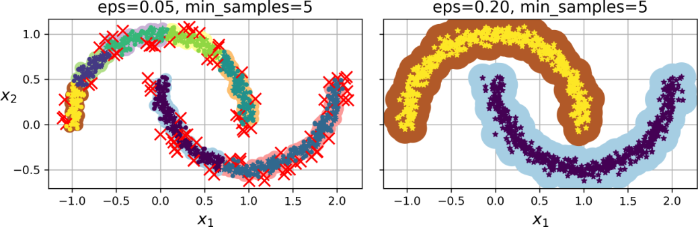
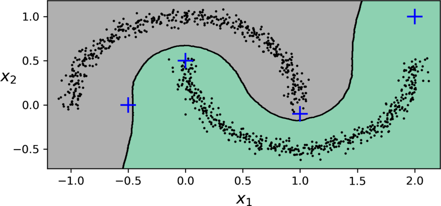
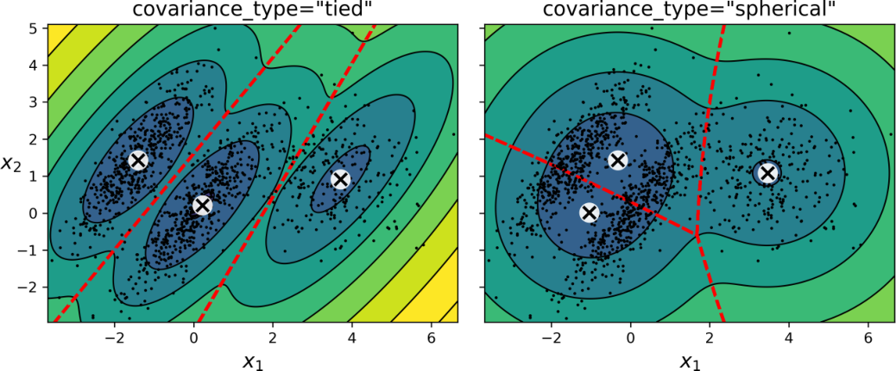
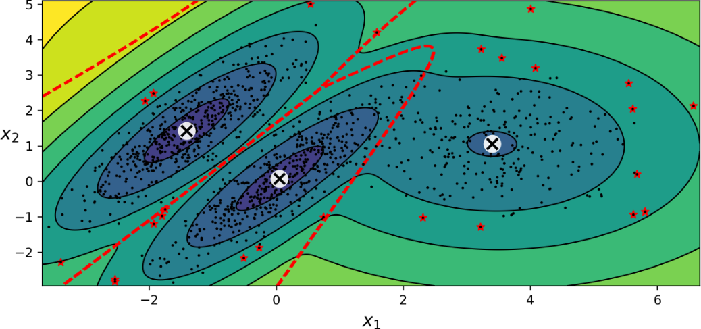
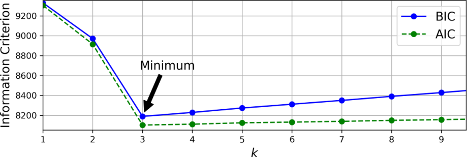
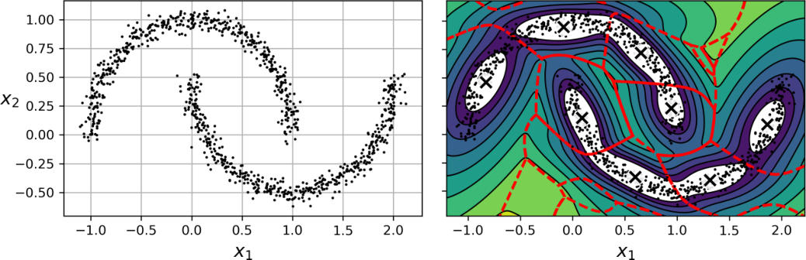

<!-- _class: cover -->
<!-- _footer: "主教材 Ch.8 pp.265–282；舊稿 05 s.12–27" -->
<!-- meta: minutes=2; core6=yes; block=0; source=主教材 Ch.8 pp.265–282 -->
# 密度分群與機率模型

第 10 週｜DBSCAN、Gaussian Mixture、EM 與異常偵測

後續八週課程｜每週 180 分鐘（含兩次 10 分鐘休息）

<!-- 講者提示：先讓學生說明本頁符號或圖形，再連結前後概念。圖表中的教材結果僅作來源示例，不能當作本班重跑結果。 -->

---

<!-- _footer: "主教材 Ch.8 pp.265–282" -->
<!-- meta: minutes=1; core6=yes; block=0; source=主教材 Ch.8 pp.265–282 -->
## 本週成果與三段安排

0–50 分：密度鄰域、DBSCAN 與其他分群方法。

60–120 分：GMM、EM 與機率密度。

130–180 分：異常偵測、AIC／BIC、模型比較。

成果：能分清楚群機率、密度、異常分數與判定閾值。

<!-- 講者提示：先讓學生說明本頁符號或圖形，再連結前後概念。圖表中的教材結果僅作來源示例，不能當作本班重跑結果。 -->

---

<!-- _footer: "主教材 Ch.8 p.265；舊稿 05 s.24–27" -->
<!-- meta: minutes=4; core6=yes; block=0; source=主教材 Ch.8 p.265；舊稿 05 s.24–27 -->
## DBSCAN：密集區域透過核心點連成一群

$\varepsilon$ 鄰域：距離不超過 eps 的所有點。

- 核心點：鄰域樣本數（包含自己）至少 `min_samples`。
- 邊界點：不是核心，但位於某個核心點的鄰域。
- 雜訊點：不是核心，且不在任何核心點的鄰域。

<!-- 講者提示：群透過核心點鏈連接；不要用邊界點當橋把兩個群串起來。 -->

---

<!-- _class: figure -->
<!-- _footer: "主教材 Ch.8 p.266，圖 8-13" -->
<!-- meta: minutes=3; core6=yes; block=0; source=主教材 Ch.8 p.266，圖 8-13 -->
## 改變 eps：同一資料會從破碎變成連續



eps 太小可能切出大量小群與雜訊；太大可能把原本分開的群合併。

<!-- 講者提示：先讓學生說明本頁符號或圖形，再連結前後概念。圖表中的教材結果僅作來源示例，不能當作本班重跑結果。 -->

---

<!-- _class: small -->
<!-- _footer: "主教材 Ch.8 pp.265–266" -->
<!-- meta: minutes=4; core6=yes; block=0; source=主教材 Ch.8 pp.265–266 -->
## 讀取 DBSCAN 結果

```python
from sklearn.cluster import DBSCAN
db = DBSCAN(eps=0.2, min_samples=5).fit(X)
labels = db.labels_                 # -1 表示雜訊
core_indices = db.core_sample_indices_
core_points = db.components_
```

先決定距離與特徵尺度，再選 eps；不同尺度不能共用同一數值。

<!-- 講者提示：先讓學生說明本頁符號或圖形，再連結前後概念。圖表中的教材結果僅作來源示例，不能當作本班重跑結果。 -->

---

<!-- _class: activity -->
<!-- _footer: "主教材 Ch.8 pp.265–282" -->
<!-- meta: minutes=17; core6=yes; block=0; source=主教材 Ch.8 pp.265–282 -->
## 手算鄰域：誰是核心，誰是雜訊？

一維點 `[0, .1, .2, .4, 2.0]`，eps=.21、min_samples=3。

1. 列出每點鄰域數（包含自己）。
2. 判定核心、邊界與雜訊。
3. 如果 min_samples 增加為 4，結果如何？

<!-- 講者提示：鄰域數 [3,3,4,2,1]；0,.1,.2為核心，.4邊界，2雜訊。改4後只有.2核心，0,.1,.4均在其鄰域為邊界，2仍雜訊。 -->

---

<!-- _footer: "主教材 Ch.8 pp.266–267" -->
<!-- meta: minutes=4; core6=yes; block=0; source=主教材 Ch.8 pp.266–267 -->
## DBSCAN 沒有原生 predict，延伸要另訂規則

`fit_predict` 是對參與分群的資料給群號。

新點可用核心點訓練近鄰分類器，但那是額外的分類規則。

只用近鄰會把很遠的點也分到某群；需要最大距離拒絕機制。

<!-- 講者提示：先讓學生說明本頁符號或圖形，再連結前後概念。圖表中的教材結果僅作來源示例，不能當作本班重跑結果。 -->

---

<!-- _class: figure -->
<!-- _footer: "主教材 Ch.8 p.267，圖 8-14" -->
<!-- meta: minutes=3; core6=yes; block=0; source=主教材 Ch.8 p.267，圖 8-14 -->
## 新點的延伸分類：距離過遠應拒絕



圖中的分類邊界來自後加的近鄰模型，不是 DBSCAN 自己的 predict。

<!-- 講者提示：先讓學生說明本頁符號或圖形，再連結前後概念。圖表中的教材結果僅作來源示例，不能當作本班重跑結果。 -->

---

<!-- _class: small -->
<!-- _footer: "主教材 Ch.8 pp.267–268；舊稿 05 s.21–27" -->
<!-- meta: minutes=4; core6=yes; block=0; source=主教材 Ch.8 pp.267–268；舊稿 05 s.21–27 -->
## 密度與階層方法：結構假設不同

| 方法 | 主要概念 | 限制 |
| --- | --- | --- |
| DBSCAN | 核心點連接、辨識雜訊 | 不同密度群可能難共用 eps |
| HDBSCAN | 考慮多尺度密度結構 | 仍需設定與評估 |
| Agglomerative | 由小群逐步合併 | 連結方式與距離影響結果 |
| BIRCH | 壓縮群摘要形成樹 | 適合大資料，仍受維度影響 |

<!-- 講者提示：先讓學生說明本頁符號或圖形，再連結前後概念。圖表中的教材結果僅作來源示例，不能當作本班重跑結果。 -->

---

<!-- _footer: "舊稿 05 s.21–23（補充）" -->
<!-- meta: minutes=4; core6=no; block=0; source=舊稿 05 s.21–23（補充） -->
## 階層式分群補充：連結方式決定合併順序

Single linkage：兩群最近點的距離，容易形成鏈狀。

Complete linkage：兩群最遠點距離，偏向緊密群。

Average linkage：跨群點對距離的平均。

Ward：選增加群內平方誤差最少的合併，搭配歐氏幾何。

<!-- 講者提示：樹狀圖高度是合併準則值；不同linkage的高度不一定可直接比較。 -->

---

<!-- _class: small -->
<!-- _footer: "主教材 Ch.8 pp.268–269" -->
<!-- meta: minutes=4; core6=no; block=0; source=主教材 Ch.8 pp.268–269 -->
## 其他分群方法：保留教材的完整概覽

| 方法 | 做法 | 需注意 |
| --- | --- | --- |
| Mean-shift | 移動視窗到局部高密度位置 | bandwidth影響大；大資料成本高 |
| Affinity propagation | 訊息交換選代表樣本 | 不先指定k，但仍有偏好等參數 |
| Spectral clustering | 相似圖降維後再分群 | 圖與相似度設定、樣本規模 |

<!-- 講者提示：不把這些簡介當成熟练操作要求；六週版課後閱讀。 -->

---

<!-- _class: activity -->
<!-- _footer: "主教材 Ch.8 pp.265–282" -->
<!-- meta: minutes=10; core6=yes; block=-1; source=主教材 Ch.8 pp.265–282 -->
## 休息 10 分鐘

離開座位、休息眼睛。回來後先用一句話回答上一段的核心問題。

<!-- 講者提示：保留完整休息；不要用來補講延伸內容。 -->

---

<!-- _footer: "主教材 Ch.8 pp.269–270；舊稿 05 s.12–18" -->
<!-- meta: minutes=6; core6=yes; block=1; source=主教材 Ch.8 pp.269–270；舊稿 05 s.12–18 -->
## GMM：先選一個成分，再從該高斯分布取樣

$$P(z=j)=\pi_j,\qquad x\mid z=j\sim\mathcal N(\mu_j,\Sigma_j)$$

$$p(x)=\sum_{j=1}^k\pi_j\mathcal N(x\mid\mu_j,\Sigma_j),\quad\sum_j\pi_j=1$$

每個成分有權重、中心與共變異；群可以是不同方向、大小的橢圓。

<!-- 講者提示：先讓學生說明本頁符號或圖形，再連結前後概念。圖表中的教材結果僅作來源示例，不能當作本班重跑結果。 -->

---

<!-- _class: small -->
<!-- _footer: "主教材 Ch.8 pp.269–273；舊稿 05 s.12–20（公式補充）" -->
<!-- meta: minutes=5; core6=no; block=1; source=主教材 Ch.8 pp.269–273；舊稿 05 s.12–20（公式補充） -->
## 多變量高斯：平均與共變異各控制什麼？

$$\mathcal N(x\mid\mu,\Sigma)=\frac{\exp[-\tfrac12(x-\mu)^T\Sigma^{-1}(x-\mu)]}{(2\pi)^{n/2}|\Sigma|^{1/2}}$$

$\mu$ 控制中心；$\Sigma$ 控制各方向的寬度與相關性。

完整共變異須可逆；實務加小的對角正則項避免退化。

<!-- 講者提示：共變異過小可使密度非常高，混合模型似然可能退化；reg_covar與適當模型容量很重要。 -->

---

<!-- _class: figure -->
<!-- _footer: "主教材 Ch.8 p.272，圖 8-15" -->
<!-- meta: minutes=4; core6=yes; block=1; source=主教材 Ch.8 p.272，圖 8-15 -->
## GMM 同時給群邊界與密度等高線


橢圓形密度符合此合成資料；這是模型假設適合資料的例子。

<!-- 講者提示：先讓學生說明本頁符號或圖形，再連結前後概念。圖表中的教材結果僅作來源示例，不能當作本班重跑結果。 -->

---

<!-- _footer: "主教材 Ch.8 pp.270–271；舊稿 05 s.18–20（展開公式）" -->
<!-- meta: minutes=5; core6=yes; block=1; source=主教材 Ch.8 pp.270–271；舊稿 05 s.18–20（展開公式） -->
## EM 的 E-step：每個成分分擔多少責任？

$$r_{ij}=P(z_i=j\mid x_i)=\frac{\pi_j\mathcal N(x_i\mid\mu_j,\Sigma_j)}{\sum_l\pi_l\mathcal N(x_i\mid\mu_l,\Sigma_l)}$$

每列責任值加總為 1；點可部分屬於多個成分，稱為軟指派。

<!-- 講者提示：E-step不是重新亂猜標籤；是依目前參數計算後驗責任值。 -->

---

<!-- _footer: "主教材 Ch.8 pp.270–271；舊稿 05 s.18–20（展開公式）" -->
<!-- meta: minutes=5; core6=yes; block=1; source=主教材 Ch.8 pp.270–271；舊稿 05 s.18–20（展開公式） -->
## EM 的 M-step：用責任值重新估計參數

$$N_j=\sum_i r_{ij},\quad\pi_j=\frac{N_j}{m},\quad\mu_j=\frac{\sum_i r_{ij}x_i}{N_j}$$

$$\Sigma_j=\frac1{N_j}\sum_i r_{ij}(x_i-\mu_j)(x_i-\mu_j)^T$$

高責任值的樣本對該成分影響較大；反覆 E、M 直到收斂。

<!-- 講者提示：先讓學生說明本頁符號或圖形，再連結前後概念。圖表中的教材結果僅作來源示例，不能當作本班重跑結果。 -->

---

<!-- _class: activity -->
<!-- _footer: "主教材 Ch.8 pp.265–282" -->
<!-- meta: minutes=21; core6=yes; block=1; source=主教材 Ch.8 pp.265–282 -->
## 手算軟指派與更新

E-step：兩成分權重皆 .5，某點的密度為 .2 與 .05；責任值各多少？

M-step：資料 `[0,2]`，成分 A 的責任值 `[.8,.2]`。計算 $N_A$、新權重、平均與變異。

<!-- 講者提示：E：[.8,.2]。M：N=1、π=.5、μ=.4；變異=.8×.16+.2×2.56=.64。另一成分責任值[.2,.8]，平均1.6、變異.64。 -->

---

<!-- _class: small -->
<!-- _footer: "主教材 Ch.8 pp.270–271" -->
<!-- meta: minutes=5; core6=yes; block=1; source=主教材 Ch.8 pp.270–271 -->
## 收斂不等於找到全域最優

EM 可卡在不好的局部解；使用多次初始化並比較最終似然。

```python
from sklearn.mixture import GaussianMixture
gm = GaussianMixture(n_components=3, n_init=10,
                     covariance_type="full", random_state=42)
gm.fit(X_train)
print(gm.converged_, gm.n_iter_)
```

<!-- 講者提示：沒有收斂時檢查max_iter、tol、尺度、初始值與退化共變異，不要忽略警告直接報結果。 -->

---

<!-- _class: small -->
<!-- _footer: "主教材 Ch.8 p.273" -->
<!-- meta: minutes=5; core6=yes; block=1; source=主教材 Ch.8 p.273 -->
## 限制共變異：容量與成本的折衷

| covariance_type | 可表示的形狀 | 共變異參數數量 |
| --- | --- | --- |
| full | 每群任意橢圓 | 每群 $n(n+1)/2$ |
| tied | 所有群共用同一橢圓 | 全部共用 $n(n+1)/2$ |
| diag | 每群軸平行橢圓 | 每群 n |
| spherical | 每群球形、大小可不同 | 每群 1 |

<!-- 講者提示：尚未加均值和混合權重参數。full成本較高，資料少時更可能不穩。 -->

---

<!-- _class: figure -->
<!-- _footer: "主教材 Ch.8 p.273，圖 8-16" -->
<!-- meta: minutes=4; core6=yes; block=1; source=主教材 Ch.8 p.273，圖 8-16 -->
## tied 與 spherical：限制形狀會改變結果



不同共變異假設讓模型更簡單；是否值得，要看擬合與驗證證據。

<!-- 講者提示：先讓學生說明本頁符號或圖形，再連結前後概念。圖表中的教材結果僅作來源示例，不能當作本班重跑結果。 -->

---

<!-- _class: activity -->
<!-- _footer: "主教材 Ch.8 pp.265–282" -->
<!-- meta: minutes=10; core6=yes; block=-1; source=主教材 Ch.8 pp.265–282 -->
## 休息 10 分鐘

離開座位、休息眼睛。回來後先用一句話回答上一段的核心問題。

<!-- 講者提示：保留完整休息；不要用來補講延伸內容。 -->

---

<!-- _footer: "主教材 Ch.8 pp.271–272" -->
<!-- meta: minutes=4; core6=yes; block=2; source=主教材 Ch.8 pp.271–272 -->
## 機率、密度與生成：三個 API 回答不同問題

- `predict_proba(X)`：每筆屬於各成分的後驗機率。
- `score_samples(X)`：每筆的對數機率密度。
- `sample(n)`：從學到的混合分布生成新樣本。

密度可大於 1；區域機率需要對該區域積分，不能把密度當成單點機率。

<!-- 講者提示：連續分布下精確單點的機率為0；高密度表示附近單位體積聚集較多機率。 -->

---

<!-- _class: figure -->
<!-- _footer: "主教材 Ch.8 p.274，圖 8-17" -->
<!-- meta: minutes=2; core6=yes; block=2; source=主教材 Ch.8 p.274，圖 8-17 -->
## 低密度異常：先估分數，再選閾值



教材用第 2 百分位作閾值，約標出 2% 的訓練樣本；這不是偵測成功率。

<!-- 講者提示：先讓學生說明本頁符號或圖形，再連結前後概念。圖表中的教材結果僅作來源示例，不能當作本班重跑結果。 -->

---

<!-- _class: small -->
<!-- _footer: "主教材 Ch.8 pp.274–275" -->
<!-- meta: minutes=4; core6=yes; block=2; source=主教材 Ch.8 pp.274–275 -->
## 異常閾值如何決定？

```python
log_density = gm.score_samples(X_train)
threshold = np.percentile(log_density, 2)
flag = gm.score_samples(X_new) < threshold
```

比例應由可接受誤報、漏報與可複核量決定；用有標註驗證資料校準更有依據。

<!-- 講者提示：異常不一定是錯誤或詐欺；模型也可能因分布轉移把正常新族群評為低密度。 -->

---

<!-- _class: figure -->
<!-- _footer: "主教材 Ch.8 p.276，圖 8-18" -->
<!-- meta: minutes=2; core6=yes; block=2; source=主教材 Ch.8 p.276，圖 8-18 -->
## Likelihood：固定資料，比較不同參數


機率密度是固定參數看 x；似然是固定已觀測 x 看參數，後者不必對參數積分為 1。

<!-- 講者提示：先讓學生說明本頁符號或圖形，再連結前後概念。圖表中的教材結果僅作來源示例，不能當作本班重跑結果。 -->

---

<!-- _footer: "主教材 Ch.8 pp.276–277" -->
<!-- meta: minutes=4; core6=no; block=2; source=主教材 Ch.8 pp.276–277 -->
## 最大似然與 MAP：從乘積改成對數和

$$\ell(\theta)=\sum_i\log p(x_i\mid\theta),\qquad\hat\theta_{\rm MLE}=\arg\max_\theta\ell(\theta)$$

MAP 再加入先驗：最大化 $\ell(\theta)+\log p(\theta)$。

對數是單調的，最大化位置不變；也能避免許多小數連乘下溢。

<!-- 講者提示：先讓學生說明本頁符號或圖形，再連結前後概念。圖表中的教材結果僅作來源示例，不能當作本班重跑結果。 -->

---

<!-- _footer: "主教材 Ch.8 p.275，式 8-2" -->
<!-- meta: minutes=4; core6=yes; block=2; source=主教材 Ch.8 p.275，式 8-2 -->
## AIC 與 BIC：擬合收益要付出複雜度代價

$$\operatorname{AIC}=2p-2\log\hat{\mathcal L},\qquad\operatorname{BIC}=p\log m-2\log\hat{\mathcal L}$$

$p$ 是自由參數數量，$m$ 是樣本數；同一資料與可比較模型之間越小越好。

不要用 K-means 的 inertia 直接選橢圓 GMM。

<!-- 講者提示：先讓學生說明本頁符號或圖形，再連結前後概念。圖表中的教材結果僅作來源示例，不能當作本班重跑結果。 -->

---

<!-- _footer: "主教材 Ch.8 p.275；教學自製數例" -->
<!-- meta: minutes=3; core6=yes; block=2; source=主教材 Ch.8 p.275；教學自製數例 -->
## 數例：比較兩個 GMM 的複雜度代價

同樣 $m=100$：A 有 $p=5,\ell=-100$；B 有 $p=8,\ell=-96$。

AIC：A=210、B=208，偏好 B。

BIC：A≈223.03、B≈228.84，偏好 A。

準則可能不一致；BIC 在此對參數增加的懲罰更大。

<!-- 講者提示：分數是相對選擇，不能稱作預測正確率。不要跨不同資料轉換與不同樣本集直接比。 -->

---

<!-- _class: figure -->
<!-- _footer: "主教材 Ch.8 p.277，圖 8-19" -->
<!-- meta: minutes=2; core6=yes; block=2; source=主教材 Ch.8 p.277，圖 8-19 -->
## 同時搜尋成分數與共變異假設



圖例展示不同 k 的準則；真正比較時也可納入 covariance_type。

<!-- 講者提示：先讓學生說明本頁符號或圖形，再連結前後概念。圖表中的教材結果僅作來源示例，不能當作本班重跑結果。 -->

---

<!-- _footer: "主教材 Ch.8 p.278" -->
<!-- meta: minutes=3; core6=yes; block=2; source=主教材 Ch.8 p.278 -->
## Bayesian GMM：給成分上限，讓權重收縮

`BayesianGaussianMixture` 可使不必要成分的權重接近零。

`n_components` 是上限；先驗、初始化與資料仍會影響有效成分數。

它不保證自動找到唯一、真實的群數。

<!-- 講者提示：先讓學生說明本頁符號或圖形，再連結前後概念。圖表中的教材結果僅作來源示例，不能當作本班重跑結果。 -->

---

<!-- _class: figure -->
<!-- _footer: "主教材 Ch.8 p.278，圖 8-20" -->
<!-- meta: minutes=2; core6=yes; block=2; source=主教材 Ch.8 p.278，圖 8-20 -->
## 彎月資料：多個高斯也可能切出很多小橢圓



密度估計可以有用途，但得到八個成分不代表資料語義上有八群。

<!-- 講者提示：先讓學生說明本頁符號或圖形，再連結前後概念。圖表中的教材結果僅作來源示例，不能當作本班重跑結果。 -->

---

<!-- _class: small -->
<!-- _footer: "主教材 Ch.8 pp.279–280" -->
<!-- meta: minutes=3; core6=yes; block=2; source=主教材 Ch.8 pp.279–280 -->
## 異常與新穎偵測方法概覽

| 方法 | 主要訊號 | 假設或注意 |
| --- | --- | --- |
| EllipticEnvelope／Fast-MCD | 穩健橢圓範圍 | 正常資料近單一高斯 |
| Isolation Forest | 較少分割即可隔離 | 適合比較稀有、容易隔離的點 |
| LOF | 相對鄰居的局部密度 | 新資料用途需正確模式 |
| One-class SVM | 學正常資料的邊界 | 縮放、核與超參數影響大 |

<!-- 講者提示：新穎偵測通常假定訓練資料較乾淨；異常偵測不要求完全乾淨。LOF用novelty=True後只對新資料評估，勿混用訓練分數。 -->

---

<!-- _footer: "主教材 Ch.8 pp.280–281" -->
<!-- meta: minutes=3; core6=yes; block=2; source=主教材 Ch.8 pp.280–281 -->
## 用重建誤差找異常：接回上一週的 PCA

$$e_i=\frac1n\|x_i-\operatorname{inverse\_transform}(\operatorname{transform}(x_i))\|^2$$

在正常資料表示下難以重建的點，可能有較高誤差。

先用訓練／驗證資料設定閾值；正常但罕見的樣本也可能被標出。

<!-- 講者提示：重建誤差是另一種分數，不是GMM密度；若異常恰好落在保留的子空間，PCA也可能偵測不到。 -->

---

<!-- _class: activity -->
<!-- _footer: "主教材 Ch.8 pp.265–282" -->
<!-- meta: minutes=12; core6=yes; block=2; source=主教材 Ch.8 pp.265–282 -->
## 選模工作單：形狀、機率與用途一起決定

A：兩條彎月且有少數孤立點。
B：方向不同的橢圓群，需要每點的群機率。
C：高維表格資料，要篩出待人工複核的少數樣本。

各選一個起點、兩個超參數或假設檢查，以及一個失敗風險。

<!-- 講者提示：A先DBSCAN/HDBSCAN，查尺度eps密度；B GMM，查k/covariance；C可試IsolationForest等，查閾值、標註評估與分布轉移。不是唯一正解，要說出理由。 -->

---

<!-- _footer: "主教材 Ch.8 pp.265–282" -->
<!-- meta: minutes=2; core6=yes; block=2; source=主教材 Ch.8 pp.265–282 -->
## 離堂檢核與作業

1. 邊界點可以把兩個核心群串成一群嗎？
2. 責任值與機率密度有何差別？
3. 設定 2% 閾值，是否代表能抓到 98% 異常？

課後：Ch.8 練習 6–13；比較 K-means、DBSCAN 與 GMM 的失敗案例。

<!-- 講者提示：答案：不可透過非核心邊界點延伸；责任值是成分后验且每列和1，密度是單位体积量；完全不是，需真实标签评估。 -->
