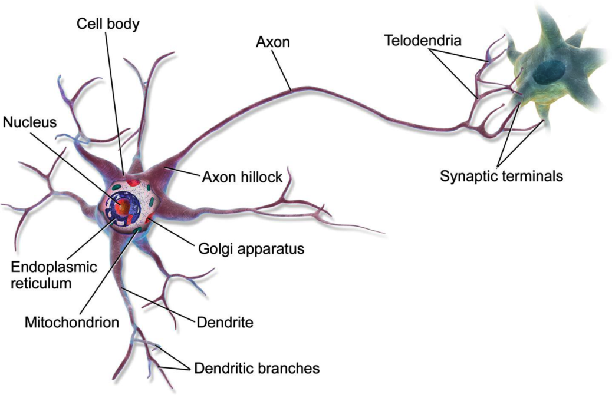
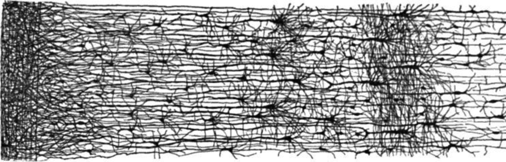
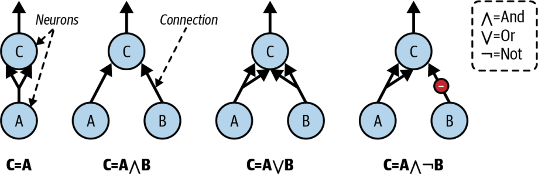
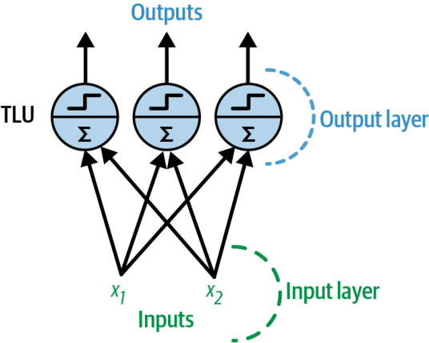
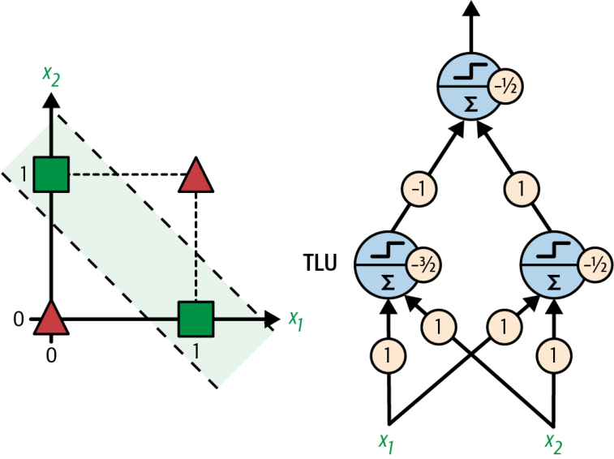
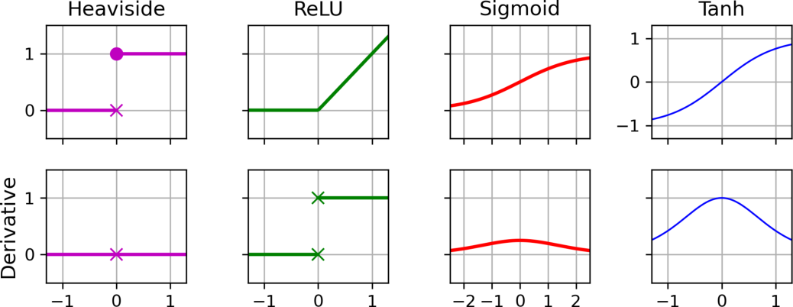
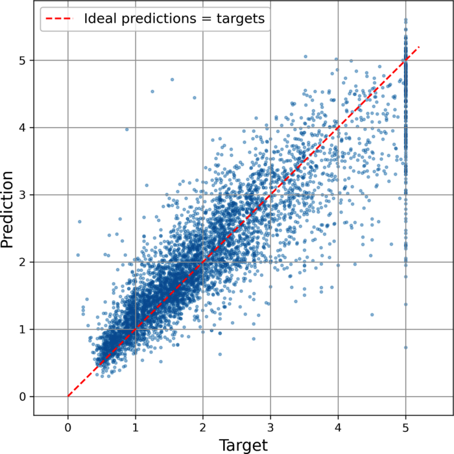
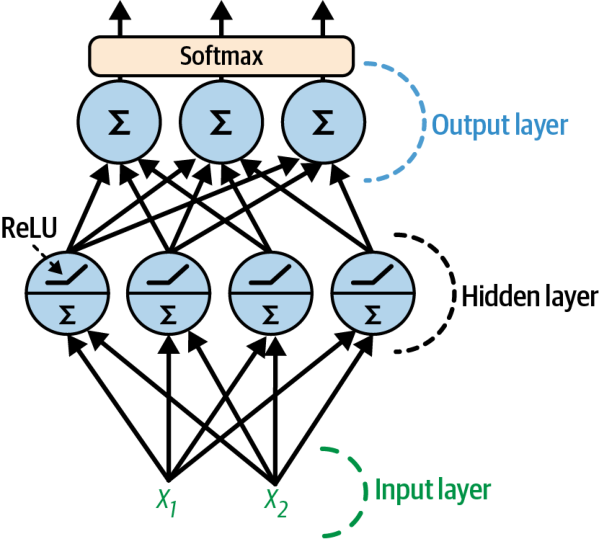

<!-- _class: cover -->
<!-- _footer: "主教材 Ch.9 pp.285–315；舊稿 06 s.1–38" -->
<!-- meta: minutes=1; core6=yes; block=0; source=主教材 Ch.9 pp.285–315 -->
# 人工神經網路入門

第 11 週｜從 Perceptron 到 MLP，走完一次前向與反向傳播

後續八週課程｜每週 180 分鐘（含兩次 10 分鐘休息）

<!-- 講者提示：先讓學生說明本頁符號或圖形，再連結前後概念。圖表中的教材結果僅作來源示例，不能當作本班重跑結果。 -->

---

<!-- _footer: "主教材 Ch.9 pp.285–315" -->
<!-- meta: minutes=1; core6=yes; block=0; source=主教材 Ch.9 pp.285–315 -->
## 本週成果與節奏

0–50 分：人工神經元、Perceptron、XOR 與 MLP。

60–120 分：非線性、鏈式法則與反向傳播。

130–180 分：迴歸／分類架構、訓練與調參。

成果：能列出網路形狀、手算梯度，完成小型 MLP 比較。

<!-- 講者提示：先讓學生說明本頁符號或圖形，再連結前後概念。圖表中的教材結果僅作來源示例，不能當作本班重跑結果。 -->

---

<!-- _class: figure -->
<!-- _footer: "主教材 Ch.9 p.288，圖 9-1" -->
<!-- meta: minutes=3; core6=yes; block=0; source=主教材 Ch.9 p.288，圖 9-1 -->
## 從生物神經元得到啟發



人工神經元是數學模型；樹突、細胞體與軸突提供概念類比，不等於完整腦科學模擬。

<!-- 講者提示：先讓學生說明本頁符號或圖形，再連結前後概念。圖表中的教材結果僅作來源示例，不能當作本班重跑結果。 -->

---

<!-- _class: figure -->
<!-- _footer: "主教材 Ch.9 p.289，圖 9-2" -->
<!-- meta: minutes=3; core6=yes; block=0; source=主教材 Ch.9 p.289，圖 9-2 -->
## 很多單元組合，形成更複雜的處理



連接方式與權重決定訊息如何傳遞；學習是根據資料調整這些參數。

<!-- 講者提示：先讓學生說明本頁符號或圖形，再連結前後概念。圖表中的教材結果僅作來源示例，不能當作本班重跑結果。 -->

---

<!-- _class: figure -->
<!-- _footer: "主教材 Ch.9 p.289，圖 9-3" -->
<!-- meta: minutes=3; core6=yes; block=0; source=主教材 Ch.9 p.289，圖 9-3 -->
## 人工神經元可組合簡單邏輯



AND、OR、NOT 等邏輯可由不同連接與閾值表達；先觀察輸入如何決定輸出。

<!-- 講者提示：先讓學生說明本頁符號或圖形，再連結前後概念。圖表中的教材結果僅作來源示例，不能當作本班重跑結果。 -->

---

<!-- _class: figure -->
<!-- _footer: "主教材 Ch.9 p.290，圖 9-4" -->
<!-- meta: minutes=3; core6=yes; block=0; source=主教材 Ch.9 p.290，圖 9-4 -->
## TLU：加權和，加偏置，再套階躍函數


輸入可以是實數；使用階躍時，輸出仍是離散的 0/1 或 −1/+1。

<!-- 講者提示：先讓學生說明本頁符號或圖形，再連結前後概念。圖表中的教材結果僅作來源示例，不能當作本班重跑結果。 -->

---

<!-- _footer: "主教材 Ch.9 pp.291–292，式 9-1、9-2" -->
<!-- meta: minutes=4; core6=yes; block=0; source=主教材 Ch.9 pp.291–292，式 9-1、9-2 -->
## 階躍函數與單層輸出

$$\operatorname{step}(z)=\begin{cases}0&z<0\\1&z\ge0\end{cases},\quad\operatorname{sgn}(z)=\begin{cases}-1&z<0\\0&z=0\\1&z>0\end{cases}$$

$f(X)=\phi(XW+b)$。

$X:m\times n$，$W:n\times q$，$b:q$；偏置廣播到每列，輸出為 $m\times q$。

<!-- 講者提示：另一常見階躍符號用-1/+1；必須與目標編碼和更新規則一致。 -->

---

<!-- _class: figure -->
<!-- _footer: "主教材 Ch.9 p.291，圖 9-5" -->
<!-- meta: minutes=3; core6=yes; block=0; source=主教材 Ch.9 p.291，圖 9-5 -->
## Perceptron 層：每個輸出都看所有輸入



全連接層有一組輸入到輸出的權重；偏置可視為固定輸入 1 的連接。

<!-- 講者提示：先讓學生說明本頁符號或圖形，再連結前後概念。圖表中的教材結果僅作來源示例，不能當作本班重跑結果。 -->

---

<!-- _footer: "主教材 Ch.9 p.293，式 9-3；舊稿 06 s.6–9" -->
<!-- meta: minutes=4; core6=yes; block=0; source=主教材 Ch.9 p.293，式 9-3；舊稿 06 s.6–9 -->
## Perceptron 學習規則：答錯才修正

$$w_{i,j}\leftarrow w_{i,j}+\eta(y_j-\hat y_j)x_i$$

偏置同樣更新，等價令對應輸入為 1。線性可分資料可收斂到分隔面，但不保證最大間隔，也不直接輸出機率。

<!-- 講者提示：先讓學生說明本頁符號或圖形，再連結前後概念。圖表中的教材結果僅作來源示例，不能當作本班重跑結果。 -->

---

<!-- _class: figure -->
<!-- _footer: "主教材 Ch.9 p.295，圖 9-6" -->
<!-- meta: minutes=3; core6=yes; block=0; source=主教材 Ch.9 p.295，圖 9-6 -->
## XOR：一條線不夠，但組合多個單元可以



相同輸入位元輸出 0；不同輸出 1。隱藏層先建立中間邏輯特徵。

<!-- 講者提示：先讓學生說明本頁符號或圖形，再連結前後概念。圖表中的教材結果僅作來源示例，不能當作本班重跑結果。 -->

---

<!-- _class: small -->
<!-- _footer: "主教材 Ch.9 pp.294–295；舊稿 06 s.10–12" -->
<!-- meta: minutes=4; core6=yes; block=0; source=主教材 Ch.9 pp.294–295；舊稿 06 s.10–12 -->
## XOR 真值表：把每一列實際走過網路

| A | B | A OR B | A AND B | XOR |
| --- | --- | --- | --- | --- |
| 0 | 0 | 0 | 0 | 0 |
| 0 | 1 | 1 | 0 | 1 |
| 1 | 0 | 1 | 0 | 1 |
| 1 | 1 | 1 | 1 | 0 |

<!-- 講者提示：XOR=(A OR B) AND NOT(A AND B)。教材網路兩個隱藏節點可分別表示AND與OR，再做抑制組合。 -->

---

<!-- _class: activity -->
<!-- _footer: "主教材 Ch.9 pp.285–315" -->
<!-- meta: minutes=15; core6=yes; block=0; source=主教材 Ch.9 pp.285–315 -->
## 手算 XOR 網路的四組輸入

$h_1=\operatorname{step}(A+B-1.5)$，$h_2=\operatorname{step}(A+B-.5)$。

$\hat y=\operatorname{step}(-h_1+h_2-.5)$。

代入四組輸入，確認輸出與真值表一致。再說明隱藏層增加了什麼能力。

<!-- 講者提示：00：h=[0,0]→0；01/10：[0,1]→1；11：[1,1]→0。隱藏層非線性組合把不可線性分的原始問題轉成可分表示。 -->

---

<!-- _class: figure -->
<!-- _footer: "主教材 Ch.9 p.295，圖 9-7" -->
<!-- meta: minutes=3; core6=yes; block=0; source=主教材 Ch.9 p.295，圖 9-7 -->
## MLP：輸入、隱藏層與輸出層


前饋網路的訊號向前流動；每層產生下一層的特徵表示。

<!-- 講者提示：先讓學生說明本頁符號或圖形，再連結前後概念。圖表中的教材結果僅作來源示例，不能當作本班重跑結果。 -->

---

<!-- _class: activity -->
<!-- _footer: "主教材 Ch.9 pp.285–315" -->
<!-- meta: minutes=10; core6=yes; block=-1; source=主教材 Ch.9 pp.285–315 -->
## 休息 10 分鐘

離開座位、休息眼睛。回來後先用一句話回答上一段的核心問題。

<!-- 講者提示：保留完整休息；不要用來補講延伸內容。 -->

---

<!-- _footer: "主教材 Ch.9 p.299；舊稿 06 s.22" -->
<!-- meta: minutes=5; core6=yes; block=1; source=主教材 Ch.9 p.299；舊稿 06 s.22 -->
## 沒有非線性，堆再多層也會折成一層

$$f(g(x))=(xW_1+b_1)W_2+b_2=x(W_1W_2)+(b_1W_2+b_2)$$

因此需要非線性激活函數，才能讓深度帶來新的表達能力。

<!-- 講者提示：先讓學生說明本頁符號或圖形，再連結前後概念。圖表中的教材結果僅作來源示例，不能當作本班重跑結果。 -->

---

<!-- _class: figure -->
<!-- _footer: "主教材 Ch.9 p.299，圖 9-8" -->
<!-- meta: minutes=3; core6=yes; block=1; source=主教材 Ch.9 p.299，圖 9-8 -->
## Sigmoid、tanh、ReLU 與它們的導數



Sigmoid／tanh 的飽和區梯度很小；ReLU 的負半軸梯度為零。

<!-- 講者提示：先讓學生說明本頁符號或圖形，再連結前後概念。圖表中的教材結果僅作來源示例，不能當作本班重跑結果。 -->

---

<!-- _footer: "主教材 Ch.9 pp.298–299；舊稿 06 s.23–24" -->
<!-- meta: minutes=5; core6=yes; block=1; source=主教材 Ch.9 pp.298–299；舊稿 06 s.23–24 -->
## 激活函數：用公式連結曲線與梯度

$$\sigma(z)=\frac1{1+e^{-z}},\quad\sigma\prime(z)=\sigma(z)(1-\sigma(z))$$

$$\tanh\prime(z)=1-\tanh^2(z),\quad\operatorname{ReLU}(z)=\max(0,z)$$

ReLU 在 $z>0$ 導數為 1，$z<0$ 為 0；零點採實作約定。

<!-- 講者提示：可微不是說所有點都必須嚴格可微；ReLU在零點可使用次梯度約定。 -->

---

<!-- _footer: "主教材 Ch.9 pp.296–298；舊稿 06 s.14–20" -->
<!-- meta: minutes=5; core6=yes; block=1; source=主教材 Ch.9 pp.296–298；舊稿 06 s.14–20 -->
## 一次訓練步驟要分清楚四件事

1. 前向：計算各層輸出，保存中間值。
2. 損失：比較預測與真值。
3. 反向：用鏈式法則計算每個參數的梯度。
4. 更新：optimizer 根據梯度調整參數。

<!-- 講者提示：教材有時用backprop廣義指整個訓練過程；本課狹義指反向算梯度，並把參數更新分開，以免把backprop等同GD。 -->

---

<!-- _footer: "主教材 Ch.9 pp.297–298；舊稿 06 s.14–20（推導補充）" -->
<!-- meta: minutes=5; core6=yes; block=1; source=主教材 Ch.9 pp.297–298；舊稿 06 s.14–20（推導補充） -->
## 鏈式法則：沿路相乘，分支相加

$$\frac{\partial L}{\partial w}=\frac{\partial L}{\partial a}\frac{\partial a}{\partial z}\frac{\partial z}{\partial w}$$

$z=wx+b$、$a=\sigma(z)$。先計算靠近損失的梯度，再往前傳。

一個參數若影響多條路徑，將各路徑貢獻相加。

<!-- 講者提示：先讓學生說明本頁符號或圖形，再連結前後概念。圖表中的教材結果僅作來源示例，不能當作本班重跑結果。 -->

---

<!-- _footer: "教學自製數例；舊稿 06 s.14–20" -->
<!-- meta: minutes=5; core6=yes; block=1; source=教學自製數例；舊稿 06 s.14–20 -->
## 手算範例：一個 Sigmoid 神經元

$x=2,w=.5,b=0,y=1$，$L=\frac12(a-y)^2$。

$$z=1,\quad a=\sigma(1)\approx.731059,\quad L\approx.036165$$

$$\frac{\partial L}{\partial z}=(a-y)a(1-a)\approx-.052877$$

<!-- 講者提示：使用平方損失是為手算鏈式法則；正式分類通常用交叉熵。 -->

---

<!-- _class: activity -->
<!-- _footer: "主教材 Ch.9 pp.285–315" -->
<!-- meta: minutes=22; core6=yes; block=1; source=主教材 Ch.9 pp.285–315 -->
## 接續手算：把梯度傳給權重與偏置

沿用 $\partial L/\partial z\approx-.052877$、$x=2$。

1. 求 $\partial L/\partial w$、$\partial L/\partial b$。
2. 用學習率 0.1 更新 $w,b$。
3. 重算預測，判斷損失是否下降。

<!-- 講者提示：dw=-.105754，db=-.052877；w=.5105754，b=.0052877；新z≈1.0264385，a≈.736225，L≈.034789。梯度不是新參數，須另做更新。 -->

---

<!-- _class: small -->
<!-- _footer: "主教材 Ch.9 pp.297–298；舊稿 06 s.14–20（矩陣補充）" -->
<!-- meta: minutes=5; core6=no; block=1; source=主教材 Ch.9 pp.297–298；舊稿 06 s.14–20（矩陣補充） -->
## 多層網路的形狀與反向遞迴

$$Z^{(l)}=A^{(l-1)}W^{(l)}+b^{(l)},\quad A^{(l)}=\phi_l(Z^{(l)})$$

$$\delta^{(l)}=(\delta^{(l+1)}W^{(l+1)T})\odot\phi_l\prime(Z^{(l)})$$

$$\nabla_{W^{(l)}}L=A^{(l-1)T}\delta^{(l)}$$

本頁 $\delta$ 定義為平均損失對 Z 的梯度，已包含批次平均因子。

<!-- 講者提示：偏置梯度為沿樣本軸加總δ。若δ定義為未平均逐樣本梯度，權重梯度須再除m，兩種寫法不能重複除。 -->

---

<!-- _footer: "主教材 Ch.9 pp.298–299；舊稿 06 s.21、25" -->
<!-- meta: minutes=5; core6=yes; block=1; source=主教材 Ch.9 pp.298–299；舊稿 06 s.21、25 -->
## 初始化：打破隱藏神經元的對稱

同層神經元若具有完全一樣的權重與偏置，收到相同梯度後仍會一樣。

隨機初始化權重讓它們學不同表示；偏置常可設為 0。

多層小導數相乘會讓梯度消失；初始化尺度、激活與網路深度需一起考慮。

<!-- 講者提示：先讓學生說明本頁符號或圖形，再連結前後概念。圖表中的教材結果僅作來源示例，不能當作本班重跑結果。 -->

---

<!-- _class: activity -->
<!-- _footer: "主教材 Ch.9 pp.285–315" -->
<!-- meta: minutes=10; core6=yes; block=-1; source=主教材 Ch.9 pp.285–315 -->
## 休息 10 分鐘

離開座位、休息眼睛。回來後先用一句話回答上一段的核心問題。

<!-- 講者提示：保留完整休息；不要用來補講延伸內容。 -->

---

<!-- _class: small -->
<!-- _footer: "主教材 Ch.9 p.303，表 9-1（上）" -->
<!-- meta: minutes=4; core6=yes; block=2; source=主教材 Ch.9 p.303，表 9-1（上） -->
## 表 9-1：迴歸 MLP 的典型架構（1/2）

| 項目 | 教材典型值 |
| --- | --- |
| 隱藏層數 | 依問題，常見 1–5 |
| 每隱藏層神經元 | 依問題，常見 10–100 |
| 輸出神經元 | 每個目標維度 1 個 |
| 隱藏層激活 | ReLU |

<!-- 講者提示：範圍只是入門參考，不是最佳架構規則。 -->

---

<!-- _class: small -->
<!-- _footer: "主教材 Ch.9 pp.302–303，表 9-1（下）" -->
<!-- meta: minutes=4; core6=yes; block=2; source=主教材 Ch.9 pp.302–303，表 9-1（下） -->
## 表 9-1：輸出範圍與損失（2/2）

| 需求 | 輸出激活／損失 |
| --- | --- |
| 任意實數 | 線性輸出 |
| 非負／正值 | ReLU／softplus |
| 有界範圍 | Sigmoid／tanh，配合目標縮放 |
| 迴歸損失 | MSE；有離群值可考慮 Huber |

<!-- 講者提示：這是一般網路設計。MLPRegressor不能任意指定輸出激活或Huber；不能把表中的每個選項都當成此API支援。 -->

---

<!-- _class: figure -->
<!-- _footer: "主教材 Ch.9 p.302，圖 9-9" -->
<!-- meta: minutes=2; core6=yes; block=2; source=主教材 Ch.9 p.302，圖 9-9 -->
## MLP 迴歸：預測與真值散點



越接近對角線越好；還要看高目標值、殘差與單位。教材 RMSE 約 0.53 是該次實驗結果。

<!-- 講者提示：資料目標以10萬美元為單位。原書文字把比較模型寫classifier可能是筆誤；此處不照抄。 -->

---

<!-- _class: small -->
<!-- _footer: "主教材 Ch.9 pp.300–301；舊稿 06 s.26–27" -->
<!-- meta: minutes=3; core6=yes; block=2; source=主教材 Ch.9 pp.300–301；舊稿 06 s.26–27 -->
## 用 scikit-learn 建立小型迴歸 MLP

```python
from sklearn.neural_network import MLPRegressor
from sklearn.pipeline import make_pipeline
from sklearn.preprocessing import StandardScaler
reg = make_pipeline(StandardScaler(), MLPRegressor(
    hidden_layer_sizes=(50, 50), early_stopping=True,
    max_iter=300, random_state=42))
reg.fit(X_train, y_train)
```

<!-- 講者提示：片段假定已有訓練資料；早停預設內部分割，StandardScaler在外層訓練集fit。嚴格比較可另設完全獨立驗證與手動前處理。 -->

---

<!-- _class: small -->
<!-- _footer: "主教材 Ch.9 p.304，表 9-2；舊稿 06 s.28–32" -->
<!-- meta: minutes=3; core6=yes; block=2; source=主教材 Ch.9 p.304，表 9-2；舊稿 06 s.28–32 -->
## 表 9-2：分類的輸出層與損失

共通設定：隱藏層通常 1–5 層，依任務調整。

| 任務 | 輸出個數 | 激活 | 損失 |
| --- | --- | --- | --- |
| 二元 | 1 | Sigmoid | 二元交叉熵 |
| 多標籤 | 每標籤 1 | 各自 Sigmoid | 各標籤二元交叉熵 |
| 互斥多類別 | 每類 1 | Softmax | 多類別交叉熵 |

<!-- 講者提示：原表共享隱藏層通常1–5層，此處見上一架構表。二類也能用2輸出softmax，但單輸出sigmoid更直接。 -->

---

<!-- _class: figure -->
<!-- _footer: "主教材 Ch.9 p.304，圖 9-10" -->
<!-- meta: minutes=2; core6=yes; block=2; source=主教材 Ch.9 p.304，圖 9-10 -->
## 分類 MLP：隱藏層 ReLU，輸出層 Softmax



對互斥多類別產生總和為 1 的機率；這些機率仍可能過度自信。

<!-- 講者提示：先讓學生說明本頁符號或圖形，再連結前後概念。圖表中的教材結果僅作來源示例，不能當作本班重跑結果。 -->

---

<!-- _class: figure -->
<!-- _footer: "主教材 Ch.9 p.306，圖 9-11" -->
<!-- meta: minutes=2; core6=yes; block=2; source=主教材 Ch.9 p.306，圖 9-11 -->
## Fashion MNIST：由像素到服飾類別


每張 28×28 灰階圖可攤成 784 個特徵；10 種類別比單純數字更有外觀變異。

<!-- 講者提示：先讓學生說明本頁符號或圖形，再連結前後概念。圖表中的教材結果僅作來源示例，不能當作本班重跑結果。 -->

---

<!-- _footer: "主教材 Ch.9 pp.301–308" -->
<!-- meta: minutes=3; core6=yes; block=2; source=主教材 Ch.9 pp.301–308 -->
## 訓練損失、驗證分數與測試指標不能混用

- MLPRegressor 的 `score` 是 $R^2$；RMSE 需另算。
- MLPClassifier 的 `score` 是 accuracy；log loss 另算。
- `loss_curve_` 記錄最佳化損失，可能包含正則化項。
- 早停監控的是內部驗證分數，不是最終測試結果。

<!-- 講者提示：此處對照本機sklearn版本；MSE loss的常數尺度及正則化會使loss值不等於RMSE。 -->

---

<!-- _footer: "主教材 Ch.9 pp.307–308；舊稿 06 s.33–38（延伸界線）" -->
<!-- meta: minutes=3; core6=no; block=2; source=主教材 Ch.9 pp.307–308；舊稿 06 s.33–38（延伸界線） -->
## 教材案例提醒：高信心可能仍然答錯

教材 Fashion MNIST 約 90% accuracy 的模型，對不少錯誤仍給出接近 100% 的機率。

檢查錯誤案例與校準；一般框架可考慮 label smoothing。

scikit-learn 的 MLP 不直接提供完整的 label smoothing、dropout 或 TensorBoard 訓練介面。

<!-- 講者提示：將label smoothing/dropout/TensorBoard留作後續深度學習框架課，不要求本週安裝框架。 -->

---

<!-- _class: small -->
<!-- _footer: "主教材 Ch.9 pp.308–312" -->
<!-- meta: minutes=3; core6=yes; block=2; source=主教材 Ch.9 pp.308–312 -->
## 調參次序：先讓模型學得動，再增加容量

| 檢查 | 可調項目 | 看什麼證據 |
| --- | --- | --- |
| 資料尺度與切分 | StandardScaler、資料角色 | 是否洩漏、分布是否不同 |
| 最佳化 | 學習率、batch size、optimizer | 收斂曲線、警告、時間 |
| 容量 | 隱藏層數、每層神經元 | 訓練與驗證差距 |
| 正則化 | alpha、早停 | 是否減少驗證誤差 |

<!-- 講者提示：學習率與batch size互相影響；更大更深不保證較好。不同任務須保留簡單模型基準。 -->

---

<!-- _footer: "主教材 Ch.9 pp.308–312" -->
<!-- meta: minutes=3; core6=no; block=2; source=主教材 Ch.9 pp.308–312 -->
## 深度、寬度與遷移學習

較深網路可重複組合中間特徵，某些函數可比淺層表示更有效率。

過窄的中間層可能形成資訊瓶頸；過多參數則增加訓練與資料需求。

遷移學習重用已有表示；本週先完成小型 MLP，後續再進入 PyTorch 與 GPU。

<!-- 講者提示：萬能近似定理需要適當條件，不能用來保證有限資料、特定訓練算法一定學得好。 -->

---

<!-- _class: activity -->
<!-- _footer: "主教材 Ch.9 pp.285–315" -->
<!-- meta: minutes=16; core6=yes; block=2; source=主教材 Ch.9 pp.285–315 -->
## 綜合實作：小型 MLP 與簡單模型比較

用已備妥的 digits，小型 MLP `(32,)` 與 `(32,16)` 各跑一次；與標準化 Logistic 比較。

提交：資料切分、accuracy、log loss、訓練時間、兩個錯誤案例。

離線組：10 輸入→50 隱藏→3 輸出的網路，列出各矩陣形狀並計算參數數目。

<!-- 講者提示：離線：W1=10×50,b1=50,W2=50×3,b2=3；總703。批次X=m×10，隱藏m×50，輸出m×3。評分在流程、形狀與解釋，不在達到某特定分數。 -->

---

<!-- _footer: "主教材 Ch.9 pp.285–315" -->
<!-- meta: minutes=2; core6=yes; block=2; source=主教材 Ch.9 pp.285–315 -->
## 離堂檢核：把八週串回同一個學習流程

1. Backprop 計算什麼？Optimizer 改變什麼？
2. 二元、多類別、多標籤的輸出為何不同？
3. 為何深度模型仍需與簡單基準比較？

課後：Ch.9 練習 2–9；練習 1 的 playground 與練習 10 大型資料作延伸。

<!-- 講者提示：答案：梯度／參數；標籤互斥性不同；需要確認額外複雜度有實際泛化收益。 -->
