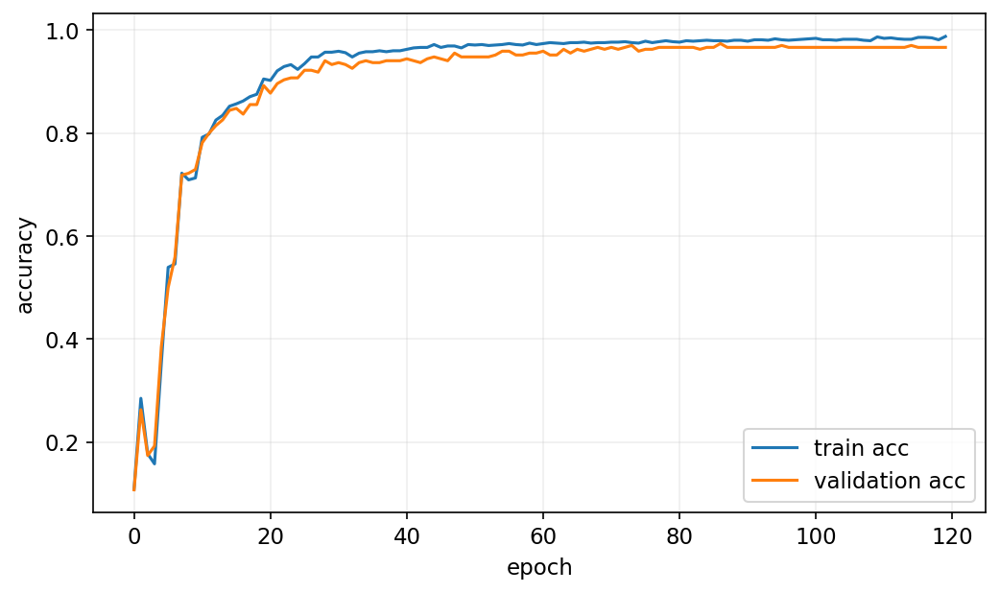

<!-- _class: cover -->
# 人工神經網路入門

第 11 週｜從 Perceptron 到 MLP，走完一次前向與反向傳播

課堂主線 180 分鐘（含兩次 10 分鐘休息）；「選讀」頁安排課後或替換同段內容

<!-- 講者提示：先讓學生說明本頁符號或圖形，再連結前後概念。圖表中的教材結果僅作來源示例，不能當作本班重跑結果。 -->

---
## 本週成果與節奏

0–50 分：人工神經元、Perceptron、XOR 與 MLP。

60–120 分：非線性、鏈式法則與反向傳播。

130–180 分：迴歸／分類架構、訓練與調參。

成果：能列出網路形狀、手算梯度，完成小型 MLP 比較。

<!-- notebook-companion-link -->
> 💻 **配套 Notebook**：[`11_人工神經網路入門.ipynb`](../programs/notebooks/11_人工神經網路入門.ipynb)。程式片段、實際圖表與表格可由此檔重現。

<!-- 講者提示：先讓學生說明本頁符號或圖形，再連結前後概念。圖表中的教材結果僅作來源示例，不能當作本班重跑結果。 -->

---
<!-- notebook-result-slide -->
<!-- _class: small -->
## 程式實驗與實際輸出

<div class="columns wide-left">
<div>

```python
net.step(X_batch, y_batch, lr=0.5)
validation_acc = mean(net.predict(X_val) == y_val)
```

**觀察**：同時畫訓練與驗證曲線，才能區分尚未學會與已開始過度擬合。

[開啟完整 Notebook](../programs/notebooks/11_人工神經網路入門.ipynb)

</div>
<div>



</div>
</div>

<!-- 講者提示：程式與圖均來自 programs/notebooks/11_人工神經網路入門.ipynb 的已執行輸出；來源與改編界線見 Notebook。 -->
---
## 神經網路的發展與適用條件

- 1943 年的邏輯神經元、1957 年的 Perceptron，先建立簡單計算模型。
- 多層網路與反向傳播讓中間表示可以由資料學習。
- 大量資料、矩陣計算能力與訓練方法的改善，使更大模型變得可行。

能表示複雜函數，不保證容易訓練，也不保證小型表格資料勝過線性模型或森林。後續再討論預訓練、遷移學習與 Transformer。

<!-- 講者提示：保留歷史動機，不將舊稿「局部最佳幾乎等於全域最佳」當成對所有網路的保證。 -->

---
<!-- _class: figure -->
## 從生物神經元得到啟發


人工神經元是數學模型；樹突、細胞體與軸突提供概念類比，不等於完整腦科學模擬。

<!-- 講者提示：先讓學生說明本頁符號或圖形，再連結前後概念。圖表中的教材結果僅作來源示例，不能當作本班重跑結果。 -->

---
<!-- _class: figure -->
## 很多單元組合，形成更複雜的處理


連接方式與權重決定訊息如何傳遞；學習是根據資料調整這些參數。

<!-- 講者提示：先讓學生說明本頁符號或圖形，再連結前後概念。圖表中的教材結果僅作來源示例，不能當作本班重跑結果。 -->

---
<!-- _class: figure -->
## 人工神經元可組合簡單邏輯


AND、OR、NOT 等邏輯可由不同連接與閾值表達；先觀察輸入如何決定輸出。

<!-- 講者提示：先讓學生說明本頁符號或圖形，再連結前後概念。圖表中的教材結果僅作來源示例，不能當作本班重跑結果。 -->

---
<!-- _class: figure -->
## TLU：加權和，加偏置，再套階躍函數


輸入可以是實數；使用階躍時，輸出仍是離散的 0/1 或 −1/+1。

<!-- 講者提示：先讓學生說明本頁符號或圖形，再連結前後概念。圖表中的教材結果僅作來源示例，不能當作本班重跑結果。 -->

---
## 階躍函數與單層輸出

$$\operatorname{step}(z)=\begin{cases}0&z<0\\1&z\ge0\end{cases},\quad\operatorname{sgn}(z)=\begin{cases}-1&z<0\\0&z=0\\1&z>0\end{cases}$$

$f(X)=\phi(XW+b)$。

$X:m\times n$，$W:n\times q$，$b:q$；偏置廣播到每列，輸出為 $m\times q$。

<!-- 講者提示：另一常見階躍符號用-1/+1；必須與目標編碼和更新規則一致。 -->

---
<!-- _class: figure -->
## Perceptron 層：每個輸出都看所有輸入


全連接層有一組輸入到輸出的權重；偏置可視為固定輸入 1 的連接。

<!-- 講者提示：先讓學生說明本頁符號或圖形，再連結前後概念。圖表中的教材結果僅作來源示例，不能當作本班重跑結果。 -->

---
## Perceptron 學習規則：答錯才修正

$$w_{i,j}\leftarrow w_{i,j}+\eta(y_j-\hat y_j)x_i$$

偏置同樣更新，等價令對應輸入為 1。線性可分資料可收斂到分隔面，但不保證最大間隔，也不直接輸出機率。

<!-- 講者提示：先讓學生說明本頁符號或圖形，再連結前後概念。圖表中的教材結果僅作來源示例，不能當作本班重跑結果。 -->

---
## Perceptron 的學習限制

- 固定線性可分訓練資料時，經典更新可找到某個分隔面。
- 線性不可分時可能持續修正，實作需限制訓練輪數。
- 階躍函數幾乎處處導數為零，不能直接對它做一般梯度下降。

Perceptron 的錯分更新是一套學習規則；可微激活與損失，才讓後面的 MLP 能用反向傳播訓練。

<!-- 講者提示：請學生用本頁的例子說明概念，再連結前後頁。 -->

---
<!-- _class: figure -->
## XOR：一條線不夠，但組合多個單元可以


相同輸入位元輸出 0；不同輸出 1。隱藏層先建立中間邏輯特徵。

<!-- 講者提示：先讓學生說明本頁符號或圖形，再連結前後概念。圖表中的教材結果僅作來源示例，不能當作本班重跑結果。 -->

---
<!-- _class: small -->
## XOR 真值表：把每一列實際走過網路

| A | B | A OR B | A AND B | XOR |
| --- | --- | --- | --- | --- |
| 0 | 0 | 0 | 0 | 0 |
| 0 | 1 | 1 | 0 | 1 |
| 1 | 0 | 1 | 0 | 1 |
| 1 | 1 | 1 | 1 | 0 |

<!-- 講者提示：XOR=(A OR B) AND NOT(A AND B)。教材網路兩個隱藏節點可分別表示AND與OR，再做抑制組合。 -->

---
<!-- _class: activity -->
## 手算 XOR 網路的四組輸入

$h_1=\operatorname{step}(A+B-1.5)$，$h_2=\operatorname{step}(A+B-.5)$。

$\hat y=\operatorname{step}(-h_1+h_2-.5)$。

代入四組輸入，確認輸出與真值表一致。再說明隱藏層增加了什麼能力。

<!-- 講者提示：00：h=[0,0]→0；01/10：[0,1]→1；11：[1,1]→0。隱藏層非線性組合把不可線性分的原始問題轉成可分表示。 -->

---
<!-- _class: figure -->
## MLP：輸入、隱藏層與輸出層


前饋網路的訊號向前流動；每層產生下一層的特徵表示。

<!-- 講者提示：先讓學生說明本頁符號或圖形，再連結前後概念。圖表中的教材結果僅作來源示例，不能當作本班重跑結果。 -->

---
<!-- _class: activity -->
## 休息 10 分鐘

離開座位、休息眼睛。回來後先用一句話回答上一段的核心問題。

<!-- 講者提示：保留完整休息；不要用來補講延伸內容。 -->

---
## 沒有非線性，堆再多層也會折成一層

$$f(g(x))=(xW_1+b_1)W_2+b_2=x(W_1W_2)+(b_1W_2+b_2)$$

因此需要非線性激活函數，才能讓深度帶來新的表達能力。

<!-- 講者提示：先讓學生說明本頁符號或圖形，再連結前後概念。圖表中的教材結果僅作來源示例，不能當作本班重跑結果。 -->

---
<!-- _class: figure -->
## Sigmoid、tanh、ReLU 與它們的導數


Sigmoid／tanh 的飽和區梯度很小；ReLU 的負半軸梯度為零。

<!-- 講者提示：先讓學生說明本頁符號或圖形，再連結前後概念。圖表中的教材結果僅作來源示例，不能當作本班重跑結果。 -->

---
## 激活函數：用公式連結曲線與梯度

$$\sigma(z)=\frac1{1+e^{-z}},\quad\sigma\prime(z)=\sigma(z)(1-\sigma(z))$$

$$\tanh\prime(z)=1-\tanh^2(z),\quad\operatorname{ReLU}(z)=\max(0,z)$$

ReLU 在 $z>0$ 導數為 1，$z<0$ 為 0；零點採實作約定。

<!-- 講者提示：可微不是說所有點都必須嚴格可微；ReLU在零點可使用次梯度約定。 -->

---
<!-- _class: small -->
## 選讀｜Leaky ReLU、ELU 與平滑激活

| 函數 | 定義 | 觀察重點 |
| --- | --- | --- |
| Leaky ReLU | $\max(\alpha z,z)$，$0<\alpha<1$ | 負半軸仍有小斜率 |
| ELU | $z>0$ 用 $z$，否則 $\alpha(e^z-1)$ | 負值區平滑且會飽和 |
| Softplus | $\log(1+e^z)$ | 平滑、嚴格正值的輸出 |
| GELU | $z\Phi(z)$ | 用標準常態累積函數作平滑門控 |

函數形狀會影響梯度；是否改善訓練仍需比較驗證結果與成本。

<!-- 講者提示：課後選讀或替換同段講解，不計入 180 分鐘課堂主線。Softplus 在大正數可用 logaddexp(0,z) 穩定計算。這些函數不能全數直接傳給 sklearn MLP 的 activation 參數。 -->

---
## 選讀｜Swish 與 Mish 的門控形式

$$\operatorname{Swish}(z)=z\sigma(\beta z),\qquad
\operatorname{Mish}(z)=z\tanh(\operatorname{softplus}(z))$$

$\beta=1$ 的 Swish 也稱 SiLU。兩者都允許部分負值，並以平滑函數調整輸入幅度。

閱讀原課程的激活函數與導數圖，選 $z=-2,0,2$ 比較函數值及局部斜率；不要只因函數較新就判定更適合資料。

<!-- 講者提示：課後選讀或替換同段講解，不計入 180 分鐘課堂主線。 -->

---
## 一次訓練步驟要分清楚四件事

1. 前向：計算各層輸出，保存中間值。
2. 損失：比較預測與真值。
3. 反向：用鏈式法則計算每個參數的梯度。
4. 更新：optimizer 根據梯度調整參數。

<!-- 講者提示：教材有時用backprop廣義指整個訓練過程；本課狹義指反向算梯度，並把參數更新分開，以免把backprop等同GD。 -->

---
## 鏈式法則：沿路相乘，分支相加

$$\frac{\partial L}{\partial w}=\frac{\partial L}{\partial a}\frac{\partial a}{\partial z}\frac{\partial z}{\partial w}$$

$z=wx+b$、$a=\sigma(z)$。先計算靠近損失的梯度，再往前傳。

一個參數若影響多條路徑，將各路徑貢獻相加。

<!-- 講者提示：先讓學生說明本頁符號或圖形，再連結前後概念。圖表中的教材結果僅作來源示例，不能當作本班重跑結果。 -->

---
## 手算範例：一個 Sigmoid 神經元

$x=2,w=.5,b=0,y=1$，$L=\frac12(a-y)^2$。

$$z=1,\quad a=\sigma(1)\approx.731059,\quad L\approx.036165$$

$$\frac{\partial L}{\partial z}=(a-y)a(1-a)\approx-.052877$$

<!-- 講者提示：使用平方損失是為手算鏈式法則；正式分類通常用交叉熵。 -->

---
<!-- _class: activity -->
## 接續手算：把梯度傳給權重與偏置

沿用 $\partial L/\partial z\approx-.052877$、$x=2$。

1. 求 $\partial L/\partial w$、$\partial L/\partial b$。
2. 用學習率 0.1 更新 $w,b$。
3. 重算預測，判斷損失是否下降。

<!-- 講者提示：dw=-.105754，db=-.052877；w=.5105754，b=.0052877；新z≈1.0264385，a≈.736225，L≈.034789。梯度不是新參數，須另做更新。 -->

---
<!-- _class: small -->
## 多層網路的形狀與反向遞迴

$$Z^{(l)}=A^{(l-1)}W^{(l)}+b^{(l)},\quad A^{(l)}=\phi_l(Z^{(l)})$$

$$\delta^{(l)}=(\delta^{(l+1)}W^{(l+1)T})\odot\phi_l\prime(Z^{(l)})$$

$$\nabla_{W^{(l)}}L=A^{(l-1)T}\delta^{(l)}$$

本頁 $\delta$ 定義為平均損失對 Z 的梯度，已包含批次平均因子。

<!-- 講者提示：偏置梯度為沿樣本軸加總δ。若δ定義為未平均逐樣本梯度，權重梯度須再除m，兩種寫法不能重複除。 -->

---
## 梯度消失與梯度爆炸

多層鏈式法則會連乘權重與激活導數。Sigmoid 的導數最多 $1/4$；若只看十層激活部分：

$$(1/4)^{10}\approx9.54\times10^{-7}$$

這只示範縮小效應，完整梯度還包含權重與分支加總。過大的乘積也可能使梯度爆炸。

檢查各層梯度與損失，再調整激活、初始化與學習率；ReLU 並不保證消除所有梯度問題。

<!-- 講者提示：死亡 ReLU 是長期落在負半軸，導數為零。梯度裁剪主要限制爆炸，不能直接解決梯度消失。 -->

---
## 初始化：打破隱藏神經元的對稱

同層神經元若具有完全一樣的權重與偏置，收到相同梯度後仍會一樣。

隨機初始化權重讓它們學不同表示；偏置常可設為 0。

多層小導數相乘會讓梯度消失；初始化尺度、激活與網路深度需一起考慮。

<!-- 講者提示：先讓學生說明本頁符號或圖形，再連結前後概念。圖表中的教材結果僅作來源示例，不能當作本班重跑結果。 -->

---
<!-- _class: activity -->
## 休息 10 分鐘

離開座位、休息眼睛。回來後先用一句話回答上一段的核心問題。

<!-- 講者提示：保留完整休息；不要用來補講延伸內容。 -->

---
<!-- _class: small -->
## 表 9-1：迴歸 MLP 的典型架構（1/2）

| 項目 | 教材典型值 |
| --- | --- |
| 隱藏層數 | 依問題，常見 1–5 |
| 每隱藏層神經元 | 依問題，常見 10–100 |
| 輸出神經元 | 每個目標維度 1 個 |
| 隱藏層激活 | ReLU |

<!-- 講者提示：範圍只是入門參考，不是最佳架構規則。 -->

---
<!-- _class: small -->
## 表 9-1：輸出範圍與損失（2/2）

| 需求 | 輸出激活／損失 |
| --- | --- |
| 任意實數 | 線性輸出 |
| 非負／正值 | ReLU／softplus |
| 有界範圍 | Sigmoid／tanh，配合目標縮放 |
| 迴歸損失 | MSE；有離群值可考慮 Huber |

<!-- 講者提示：這是一般網路設計。MLPRegressor不能任意指定輸出激活或Huber；不能把表中的每個選項都當成此API支援。 -->

---
<!-- _class: figure -->
## MLP 迴歸：預測與真值散點


越接近對角線越好；還要看高目標值、殘差與單位。教材 RMSE 約 0.53；目標單位為十萬美元，約相當於 5.3 萬美元，並非本次重跑結果。

<!-- 講者提示：資料目標以10萬美元為單位。原書文字把比較模型寫classifier可能是筆誤；此處不照抄。 -->

---
<!-- _class: small -->
## 用 scikit-learn 建立小型迴歸 MLP

```python
from sklearn.neural_network import MLPRegressor
from sklearn.pipeline import make_pipeline
from sklearn.preprocessing import StandardScaler
reg = make_pipeline(StandardScaler(), MLPRegressor(
    hidden_layer_sizes=(50, 50), early_stopping=True,
    max_iter=300, random_state=42))
reg.fit(X_train, y_train)
```

<!-- 講者提示：片段假定已有訓練資料；早停預設內部分割，StandardScaler在外層訓練集fit。嚴格比較可另設完全獨立驗證與手動前處理。 -->

---
<!-- _class: small -->
## 表 9-2：分類的輸出層與損失

共通設定：隱藏層通常 1–5 層，依任務調整。

| 任務 | 輸出個數 | 激活 | 損失 |
| --- | --- | --- | --- |
| 二元 | 1 | Sigmoid | 二元交叉熵 |
| 多標籤 | 每標籤 1 | 各自 Sigmoid | 各標籤二元交叉熵 |
| 互斥多類別 | 每類 1 | Softmax | 多類別交叉熵 |

<!-- 講者提示：原表共享隱藏層通常1–5層，此處見上一架構表。二類也能用2輸出softmax，但單輸出sigmoid更直接。 -->

---
<!-- _class: figure -->
## 分類 MLP：隱藏層 ReLU，輸出層 Softmax


對互斥多類別產生總和為 1 的機率；這些機率仍可能過度自信。

<!-- 講者提示：先讓學生說明本頁符號或圖形，再連結前後概念。圖表中的教材結果僅作來源示例，不能當作本班重跑結果。 -->

---
## Softmax 與交叉熵的輸出梯度

$$p_k=\frac{e^{z_k-\max_jz_j}}{\sum_j e^{z_j-\max_lz_l}},\qquad
L=-\sum_k y_k\log p_k$$

當 $\sum_k y_k=1$，對單筆資料 $\partial L/\partial z_k=p_k-y_k$。

批次平均損失的梯度再除以批次樣本數。這是特定激活與損失配對的結果，不能套用到所有輸出層。

<!-- 講者提示：y 可為 one-hot 或總和為1的軟標籤。log-softmax 可避免先算很小的 p 再 log。 -->

---
<!-- _class: small -->
## 選讀｜原 MNIST 手刻網路的損失配對

原程式 `NeuralNetMLP`：784 輸入、50 個 Sigmoid 隱藏單元、10 個各自 Sigmoid 輸出。

若 $L=m^{-1}\sum_{i,k}(a_{ik}-y_{ik})^2$，則

$$\delta_{ik}=\frac2m(a_{ik}-y_{ik})a_{ik}(1-a_{ik})$$

這組輸出不保證總和為 1。改成 Softmax＋交叉熵時，前向、損失與反向梯度要一起改，不能只換輸出激活。

<!-- 講者提示：課後選讀或替換同段講解，不計入 180 分鐘課堂主線。原碼權重 shape 是（輸出數,輸入數），前向用 x@weight.T；本投影片矩陣式採（輸入數,輸出數）。原碼的評估 MSE 與 backward 平均的尺度也要對齊；本次未修改程式。 -->

---
<!-- _class: figure -->
## Fashion MNIST：由像素到服飾類別


每張 28×28 灰階圖可攤成 784 個特徵；10 種類別比單純數字更有外觀變異。

<!-- 講者提示：先讓學生說明本頁符號或圖形，再連結前後概念。圖表中的教材結果僅作來源示例，不能當作本班重跑結果。 -->

---
<!-- _class: small -->
## 分類 MLP 的訓練與預測流程

```python
from sklearn.neural_network import MLPClassifier
from sklearn.pipeline import make_pipeline
from sklearn.preprocessing import MinMaxScaler
clf = make_pipeline(MinMaxScaler(), MLPClassifier(
    hidden_layer_sizes=(100, 50), early_stopping=True,
    max_iter=200, random_state=42))
clf.fit(X_train, y_train)
pred, proba = clf.predict(X_test), clf.predict_proba(X_test)
```

影像先攤平；類別標籤用一維整數。預測仍經過同一 Pipeline，避免漏掉縮放。

<!-- 講者提示：資料由教師先備妥。小型示範用 digits；Fashion MNIST 用784維，digits用64維。模型大小是教學改編，並非書中300、100。原書p.307的 mlp_clf.predict(X_new) 略過已建立的縮放 Pipeline，因此不沿用其過度自信數字作本示例結論。 -->

---
## 訓練損失、驗證分數與測試指標不能混用

- MLPRegressor 的 `score` 是 $R^2$；RMSE 需另算。
- MLPClassifier 的 `score` 是 accuracy；log loss 另算。
- `loss_curve_` 記錄最佳化損失，可能包含正則化項。
- 早停監控的是內部驗證分數，不是最終測試結果。

<!-- 講者提示：此處對照本機sklearn版本；MSE loss的常數尺度及正則化會使loss值不等於RMSE。 -->

---
## Epoch、批次與早停的資料角色

一個 epoch 看完訓練資料一次。1,000 筆資料、batch size=128，若保留尾批，每個 epoch 有 8 次更新。

`max_iter` 對 SGD／Adam 訓練表示最大 epoch 數；batch size 影響每次更新的樣本數。

`early_stopping=True` 在傳入的訓練資料內留出驗證部分，依分數改善與耐心值停止。最終測試集只在選模完成後使用。

<!-- 講者提示：注意原手刻 minibatch_generator 丟掉不足一批的尾批。Pipeline 的 scaler 先在傳入訓練集 fit，MLP 才做內部早停切分；若需嚴格獨立早停驗證，應先切出驗證資料並使用可控訓練迴圈。 -->

---
## 教材案例提醒：高信心可能仍然答錯

教材報告測試 accuracy 約 87.1%，並展示高信心錯誤；但示例預測略過縮放 Pipeline，不能直接歸因於模型的校準問題。

先確認訓練與預測使用相同前處理，再檢查錯誤案例、log loss 與校準；一般框架可考慮 label smoothing。

scikit-learn 的 MLP 不直接提供完整的 label smoothing、dropout 或 TensorBoard 訓練介面。

<!-- 講者提示：將label smoothing/dropout/TensorBoard留作後續深度學習框架課，不要求本週安裝框架。 -->

---
<!-- _class: small -->
## 調參次序：先讓模型學得動，再增加容量

| 檢查 | 可調項目 | 看什麼證據 |
| --- | --- | --- |
| 資料尺度與切分 | StandardScaler、資料角色 | 是否洩漏、分布是否不同 |
| 最佳化 | 學習率、batch size、optimizer | 收斂曲線、警告、時間 |
| 容量 | 隱藏層數、每層神經元 | 訓練與驗證差距 |
| 正則化 | alpha、早停 | 是否減少驗證誤差 |

<!-- 講者提示：學習率與batch size互相影響；更大更深不保證較好。不同任務須保留簡單模型基準。 -->

---
## 深度、寬度與遷移學習

較深網路可重複組合中間特徵，某些函數可比淺層表示更有效率。

過窄的中間層可能形成資訊瓶頸；過多參數則增加訓練與資料需求。

遷移學習重用已有表示；本週先完成小型 MLP，後續再進入 PyTorch 與 GPU。

<!-- 講者提示：萬能近似定理需要適當條件，不能用來保證有限資料、特定訓練算法一定學得好。 -->

---
<!-- _class: small -->
## 學習率、批次與參數量的調整

- 每層參數數量為 $(n_{\rm in}+1)n_{\rm out}$。784→300→100→10 共 **266,610** 個參數。
- 學習率太小進展慢，太大可能震盪；先以對數尺度比較候選值。
- 大批次可減少每個 epoch 的更新次數，但吞吐量與泛化未必一起改善。
- 改變 batch size 或 optimizer 後，要重新檢查學習率與驗證曲線。

同寬隱藏層是合理起點，不必每層都縮成金字塔；瓶頸也可能刻意用來學壓縮表示。

<!-- 講者提示：計數為235500+30100+1010。sklearn 的 learning_rate_init 供 SGD／Adam；learning_rate 排程參數主要供 SGD。不是每個參數都對所有 solver 有效。 -->

---
## 選讀｜學習率範圍測試

短暫試跑時，從小學習率開始，以固定倍率增加，記錄「學習率對損失」：

$$\eta_t=\eta_0q^t,\qquad q=(\eta_{\rm end}/\eta_0)^{1/T}$$

觀察快速下降與開始發散的區域，選較保守的候選值，再以驗證集確認。正式訓練須重設模型與最佳化器狀態。

試跑是選參數的工具，不能把「發散點的一半」當成所有模型通用的最佳值。

<!-- 講者提示：課後選讀或替換同段講解，不計入 180 分鐘課堂主線。以框架可控的 training loop 或 callback 實作；不要假設改 sklearn 的 learning_rate_init 就會同步重設已存在的 Adam 內部狀態。 -->

---
## 選讀｜Dropout 的訓練與推論

訓練時以機率 $p$ 暫時遮掉部分隱藏激活，讓模型減少依賴固定幾個單元。常見 inverted dropout：

$$\tilde a=\frac{r\odot a}{1-p},\qquad r_j\sim\operatorname{Bernoulli}(1-p)$$

所以 $E[\tilde a_j]=a_j$；一般推論關閉隨機遮罩，直接使用完整激活。

Dropout 不是永久刪除神經元；比例需驗證，也不保證提升固定百分比。sklearn MLP 沒有 Dropout 層設定。

<!-- 講者提示：課後選讀或替換同段講解，不計入 180 分鐘課堂主線。p 必須小於1。一般 dropout 與 MC dropout 的推論用途不同；此處僅介紹一般訓練正則化。 -->

---
<!-- _class: small -->
## 選讀｜訓練紀錄、早停與模型回復

| 工具／步驟 | 保存或觀察的內容 |
| --- | --- |
| 訓練紀錄 | 每輪 train loss、validation loss／指標與學習率 |
| TensorBoard | 讀取各次實驗的 event files，比較曲線與模型圖 |
| Checkpoint | 保存驗證最佳的參數，供停止後回復 |
| 重載檢查 | 同時保存前處理、類別順序與模型設定，核對預測 |

早停控制何時結束，Checkpoint 決定保留哪一版模型。測試指標不作反覆選版本的依據。

<!-- 講者提示：課後選讀或替換同段講解，不計入 180 分鐘課堂主線。為每次實驗使用不同的 run 目錄。介面可換框架，資料角色與最佳模型回復的原則相同。 -->

---
<!-- _class: small -->
## 選讀｜Keras 舊案例與後續 PyTorch 的銜接

| 舊案例 | 核心概念 | 後續閱讀 |
| --- | --- | --- |
| Sequential、回歸／分類 | 逐層前向、損失、更新、評估 | Ch.10 基本模型與訓練迴圈 |
| Functional、Subclassing | 自訂前向圖，多輸入／多輸出 | Ch.10 自訂 Module |
| Wide & Deep | 原始特徵支路與深層特徵串接 | Ch.10 非序列模型 |
| 搜尋、保存與 callbacks | 驗證選參數、保存最佳狀態 | Ch.10 調參及模型保存 |

Keras 的舊 API 不作本週必跑環境。先完成 sklearn MLP；框架實作與深層訓練接在書中 Ch.10、11。

<!-- 講者提示：課後選讀或替換同段講解，不計入 180 分鐘課堂主線。多輸出可用 L=αL_main+(1−α)L_aux 組合任務損失，不等於單一 Softmax 的互斥類別。這是閱讀導引，未把 Ch.10–11 完整框架課程塞入 ANN 入門。 -->

---
<!-- _class: activity -->
## 綜合實作：小型 MLP 與簡單模型比較

用已備妥的 digits，小型 MLP `(32,)` 與 `(32,16)` 各跑一次；與標準化 Logistic 比較。

提交：資料切分、accuracy、log loss、訓練時間、兩個錯誤案例。

離線組：10 輸入→50 隱藏→3 輸出的網路，列出各矩陣形狀並計算參數數目。

<!-- 講者提示：離線：W1=10×50,b1=50,W2=50×3,b2=3；總703。批次X=m×10，隱藏m×50，輸出m×3。評分在流程、形狀與解釋，不在達到某特定分數。 -->

---
## 離堂檢核：把八週串回同一個學習流程

1. Backprop 計算什麼？Optimizer 改變什麼？
2. 二元、多類別、多標籤的輸出為何不同？
3. 為何深度模型仍需與簡單基準比較？

課後：Ch.9 練習 2–9；練習 1 的 playground 與練習 10 大型資料作延伸。

<!-- 講者提示：答案：梯度／參數；標籤互斥性不同；需要確認額外複雜度有實際泛化收益。 -->
