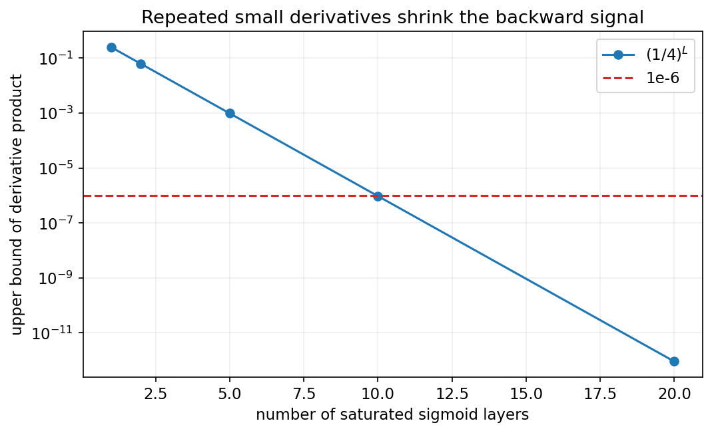
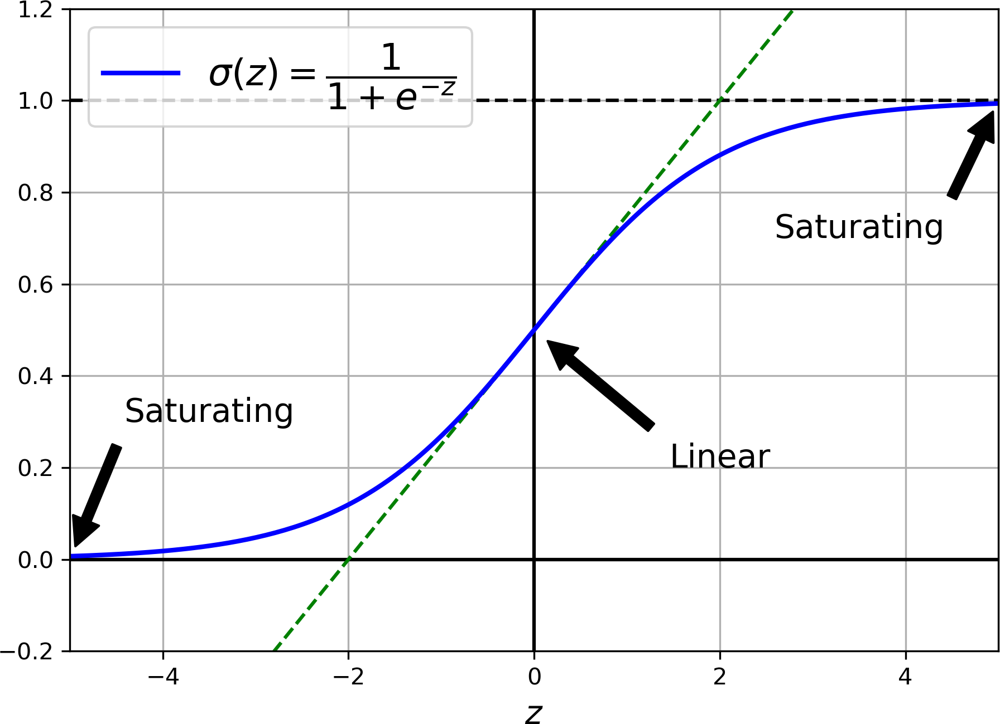
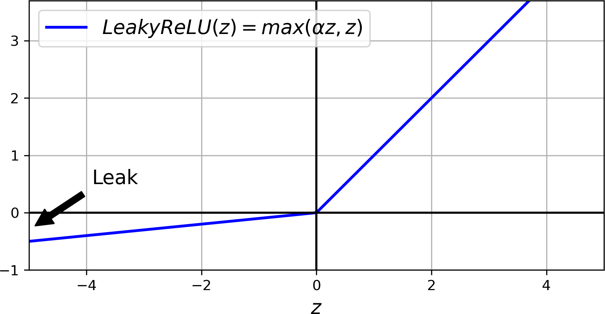
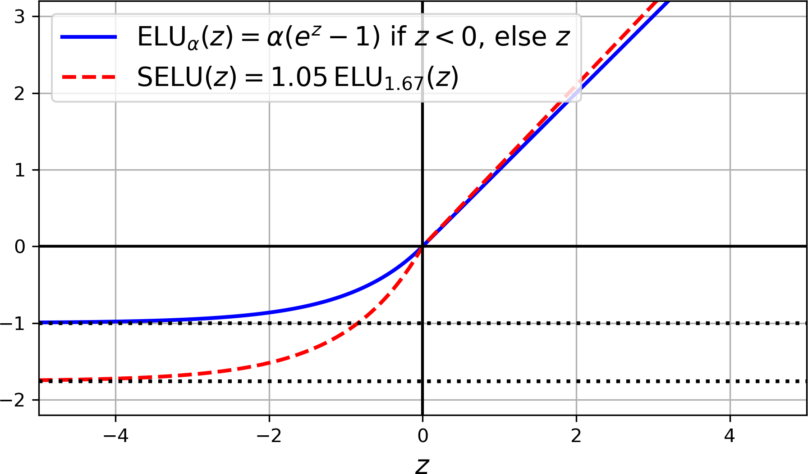
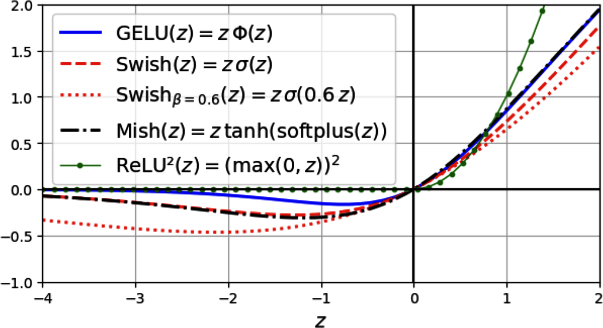
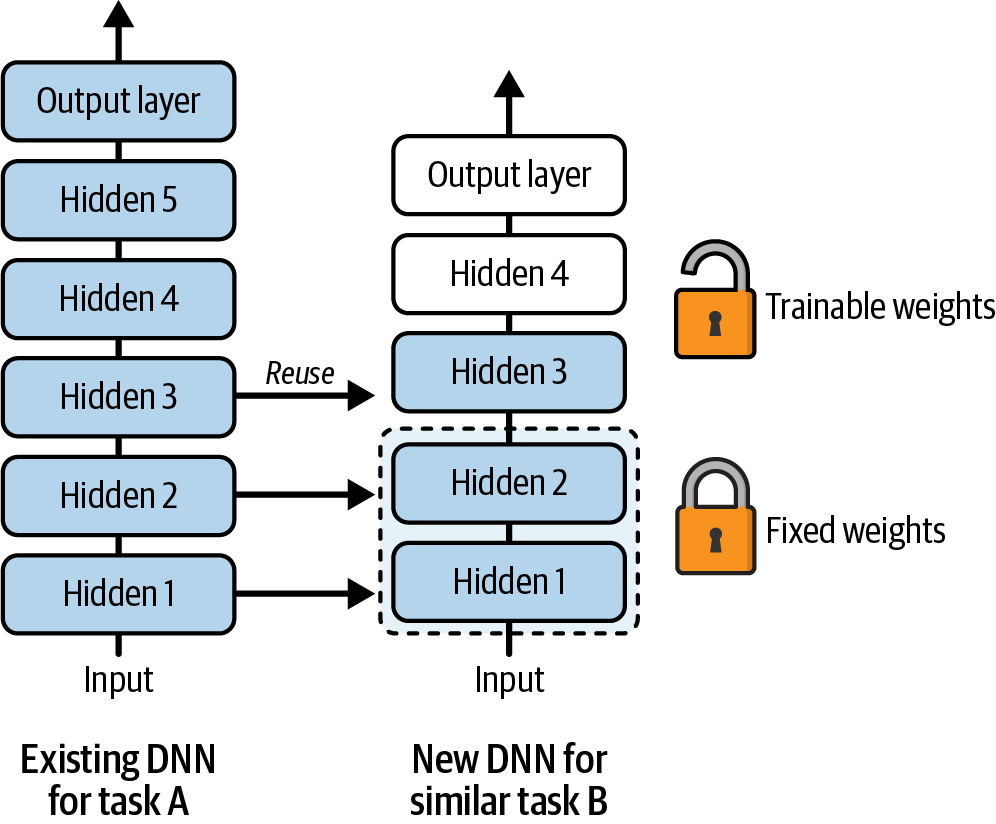
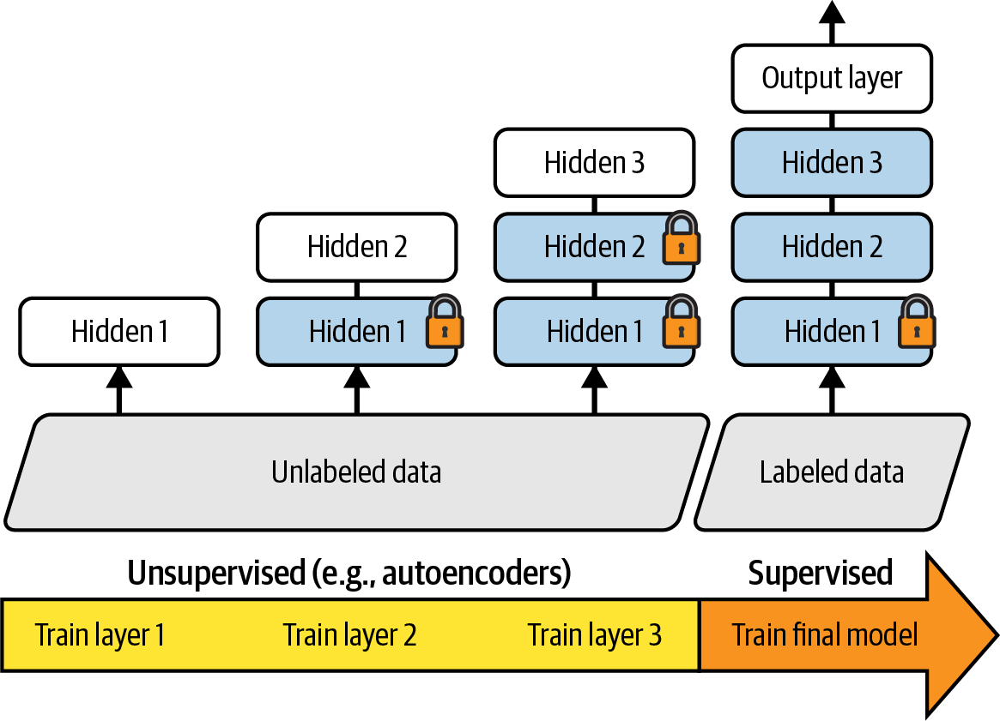

<!-- _class: cover -->
# 深層神經網路訓練
## 梯度穩定與遷移學習

書本第 11 章（上）｜含第 10 章必要的 PyTorch 銜接

180 分鐘，含兩次 10 分鐘休息

<!-- 來源：book/CHAPTER 11 Training Deep Neural Networks.pdf，印刷 pp.363–388（PDF pp.1–26）。第10章銜接為本課教學改編。 -->

---
## 本次成果與節奏

- **0–50 分**：讀懂 PyTorch 訓練步驟，解釋梯度與初始化。
- **60–120 分**：比較激活函數，手算 BatchNorm 與 LayerNorm。
- **130–180 分**：梯度裁剪、遷移學習與實驗設計。

成果：能指出訓練流程的錯誤，並用證據選擇改善方法。

「選讀」頁可課後閱讀，或替換同段講解。程式以讀碼為主。

<!-- notebook-companion-link -->
> 💻 **配套 Notebook**：`programs/notebooks/12_深層神經網路訓練_梯度與遷移.ipynb`。程式片段、實際圖表與表格可由此檔重現。

<!-- 講者提示：建議前段50分鐘，中段60分鐘，末段50分鐘，另有20分鐘休息。未具PyTorch環境者可完成所有手算與診斷活動。 -->

---
<!-- notebook-result-slide -->
<!-- _class: small -->
## 程式實驗與實際輸出

<div class="columns wide-left">
<div>

```python
clipped = g * min(1, max_norm / norm(g))
```

**觀察**：13 的梯度範數裁剪為 5；圖顯示多層小導數連乘會快速縮小反向訊號。

參考程式：`programs/notebooks/12_深層神經網路訓練_梯度與遷移.ipynb`

</div>
<div>



</div>
</div>

<!-- 講者提示：程式與圖均來自 programs/notebooks/12_深層神經網路訓練_梯度與遷移.ipynb 的已執行輸出；來源與改編界線見 Notebook。 -->
---
<!-- _class: small -->
## 課程位置：ANN、PyTorch 與深層訓練

| 書本章節 | 問題 | 本課銜接 |
| --- | --- | --- |
| Ch.9 人工神經網路 | 網路如何表示函數、計算梯度？ | 已有 `11_人工神經網路入門.md` |
| Ch.10 PyTorch | 如何建立模型、迭代訓練與評估？ | 先補本章範例需要的操作 |
| Ch.11 深層訓練 | 加深以後，如何穩定、加速與泛化？ | 本份及下一份的主線 |

前一份的激活、Dropout 等選讀是預告；本次補上原理與操作。

<!-- 來源：book/CHAPTER 09 Introduction to Artificial Neural Networks.pdf；CHAPTER 10 Building Neural Networks with PyTorch.pdf；CHAPTER 11 Training Deep Neural Networks.pdf。第10章的自訂Module、多輸入輸出、Optuna與部署不在這段銜接內。 -->

---
<!-- _class: small -->
## PyTorch 銜接：資料形狀與角色

本章沿用 Fashion MNIST：28×28 灰階影像、10 個互斥類別。

| 物件 | 形狀／型態 | 角色 |
| --- | --- | --- |
| `X_batch` | `[B, 1, 28, 28]` 浮點數 | 前處理後的影像 |
| `y_batch` | `[B]`，`torch.long` | 0–9 的類別索引 |
| `model(X_batch)` | `[B, 10]` 浮點數 | 未正規化的 logits |
| `DataLoader` | 逐批回傳 `(X_batch, y_batch)` | 訓練可打散，驗證固定 |

訓練集學參數，驗證集選設定，測試集留到最後。

<!-- 來源：Ch.10 PDF pp.20–23、30–35；教學改編。B為批次大小。資料縮放參數只能由訓練資料估計；本章範例假設train_loader、valid_loader與device已備妥，不要求現場下載。 -->

---
<!-- _class: small -->
## PyTorch 銜接：最小分類模型

```python
import torch
from torch import nn

device = torch.device("cpu")  # 讀碼與小型示範可用 CPU
model = nn.Sequential(
    nn.Flatten(), nn.Linear(784, 100), nn.ReLU(),
    nn.Linear(100, 10)
).to(device)
loss_fn = nn.CrossEntropyLoss()
optimizer = torch.optim.SGD(model.parameters(), lr=0.01)
```

`CrossEntropyLoss` 直接接 logits，模型末端不另加 Softmax。

<!-- 來源：Ch.10 PDF pp.15–20、32–35；網路縮小為教學改編。nn.Linear權重排列為[輸出數,輸入數]，前向等價X@W.T+b。lr=0.01是示範設定，不是通用最佳值。 -->

---
<!-- _class: small -->
## 選讀｜Keras 舊例：輸出與損失要一起看

Keras 原 Notebook（`programs/upstream/MachineLearning2025/06_neural_nets_with_keras.ipynb`）：搜尋 `sparse_categorical_crossentropy`。

```python
# 原碼摘錄：最後一層（cell 43）與訓練設定（cell 54）
keras.layers.Dense(10, activation="softmax")
model.compile(loss="sparse_categorical_crossentropy",
              optimizer="sgd", metrics=["accuracy"])
```

舊例輸出機率配對交叉熵；本課 PyTorch 輸出 logits 配對 `CrossEntropyLoss`。

換框架時，要連同輸出層、損失函數與標籤格式一起檢查。

<!-- 來源：programs/upstream/MachineLearning2025/06_neural_nets_with_keras.ipynb，cell 43、54（從0起算）。為兩處原碼摘錄，非可獨立執行的一段完整模型；Keras模型輸入[B,28,28]，本課PyTorch輸入[B,1,28,28]，攤平後皆784維。此Notebook開頭是舊版handson-ml2第10章，不能當成本機book第10章PyTorch內容。原Notebook含舊環境設定，這裡供概念對照，不要求另裝TensorFlow。 -->

---
<!-- _class: small -->
## PyTorch 銜接：一次批次更新

```python
model.train()
for X_batch, y_batch in train_loader:
    X_batch = X_batch.to(device)
    y_batch = y_batch.to(device)
    optimizer.zero_grad(set_to_none=True)
    logits = model(X_batch)
    loss = loss_fn(logits, y_batch)
    loss.backward()
    optimizer.step()
```

`backward()` 計算並累積梯度，`step()` 才更新參數。

<!-- 來源：Ch.10 PDF pp.8–10、20–21、33–34。假設沿用前頁模型及已備妥DataLoader。清除梯度放在每批前，避免忘記清除造成非預期累積。正式使用時包在epoch迴圈內。 -->

---
<!-- _class: small -->
## PyTorch 銜接：驗證與訓練模式

```python
model.eval()
loss_sum, n = 0.0, 0
with torch.no_grad():
    for X_batch, y_batch in valid_loader:
        X_batch, y_batch = X_batch.to(device), y_batch.to(device)
        loss = loss_fn(model(X_batch), y_batch)
        loss_sum += loss.item() * len(y_batch)
        n += len(y_batch)
val_loss = loss_sum / n
```

`eval()` 切換 BN／Dropout 行為，`no_grad()` 關閉梯度紀錄。

<!-- 來源：Ch.10 PDF pp.21–23、35–36；Ch.11 pp.378、409。兩者用途不同，不能互相取代。平均損失依樣本數加權，避免尾批較小時被高估；下一epoch須重新model.train()。 -->

---
<!-- _class: activity -->
## 讀碼檢核：哪一步需要修正？

1. 在 `CrossEntropyLoss` 前先做 Softmax。
2. 每批只呼叫 `backward()`，整堂課都沒清除梯度。
3. 用 `no_grad()` 驗證，卻忘記 `model.eval()`。
4. 每個 epoch 用測試 accuracy 決定是否換模型。

兩人一組，各選一項說明「會發生什麼」及「如何改」。

<!-- 來源：Ch.10訓練及評估流程；自編活動，建議5分鐘。答案：1直接餵logits；2除非有意設計梯度累積，否則每批清除；3BN仍更新統計、Dropout仍開啟；4改用驗證集，測試只作最終評估。 -->

---
<!-- _class: small -->
## 選讀｜手刻 MLP：前向、反向與參數更新

開啟手刻 MNIST 原程式（`programs/upstream/MachineLearning2025/06_ANN_from_Scratch_MNIST.py`）：`train()`，L265–276。

```python
# 原碼摘錄；上方已完成forward()與backward()
model.weight_h -= learning_rate * d_loss__d_w_h
model.bias_h -= learning_rate * d_loss__d_b_h
model.weight_out -= learning_rate * d_loss__d_w_out
model.bias_out -= learning_rate * d_loss__d_b_out
```

四行就是基本 SGD 更新，對照本課的 `optimizer.step()`。

原模型採 Sigmoid＋平方損失，不能只換成 Softmax 卻沿用原反向公式。

<!-- 來源：06_ANN_from_Scratch_MNIST.py L104–172、250–290，更新段為原碼摘錄。PyTorch的backward由autograd處理，原碼由NeuralNetMLP.backward手算。原backward以樣本數平均、評估MSE以樣本及類別平均，尺度相差類別數；compute_mse_and_acc另有mse/i的批次計數問題，所以不把原評估輸出當正確基準。本次保留原檔，只選更新段講解；完整執行會下載MNIST並啟動繪圖。 -->

---
## 深層網路的四個訓練困難

- **梯度不穩定**：前面層學不到，或參數更新突然失控。
- **標註資料不足**：大模型很快記住少量訓練樣本。
- **訓練太慢**：有梯度，卻需要很多次更新。
- **泛化不足**：訓練誤差下降，驗證誤差反而上升。

先判斷問題類型，再選方法；同一現象可能有多種原因。

<!-- 來源：Ch.11 pp.363–364（PDF pp.1–2）。下一份處理最佳化速度與正則化，本份先處理梯度與資料重用。 -->

---
<!-- _class: figure -->
## 圖 11-1：Sigmoid 飽和與小梯度



輸入落在曲線兩端時，輸出幾乎不變，導數接近 0。

<!-- 來源：Ch.11 圖11-1，p.365（PDF p.3），原始內嵌影像。補充：source_pptx/06_Artificial Neural Networks.pptx s.21。請學生先找z=0與兩端的斜率差異。 -->

---
## 梯度為何會消失或爆炸？

$$\delta^{(l)}=\left(\delta^{(l+1)}W^{(l+1)T}\right)\odot\phi_l'(Z^{(l)})$$

反向傳播跨越多層時，反覆乘上權重與激活導數。

僅看十層 Sigmoid 導數的上界：$(1/4)^{10}\approx9.54\times10^{-7}$。

這個數字示範縮小效應。完整梯度還取決於權重、分支與資料。

<!-- 來源：Ch.11 pp.364–365；連結既有11投影片的鏈式法則。矩陣慣例沿用前課XW，與PyTorch儲存的weight轉置相對應。不能只看一層或只看激活就判定所有梯度消失。 -->

---
<!-- _class: small -->
## 表 11-1：初始化尺度與激活函數

$\mathrm{fan}_{in}$ 是輸入數，$\mathrm{fan}_{out}$ 是輸出數。

| 初始化 | 書中配對 | 常態分布的變異數 $\sigma^2$ |
| --- | --- | --- |
| Glorot／Xavier | 線性、tanh、sigmoid、softmax | $2/(\mathrm{fan}_{in}+\mathrm{fan}_{out})$ |
| He／Kaiming | ReLU 及書中列出的變體 | $2/\mathrm{fan}_{in}$ |
| LeCun | SELU | $1/\mathrm{fan}_{in}$ |

若用均勻分布 $U(-r,r)$，則 $r=\sqrt{3\sigma^2}$。

<!-- 來源：Ch.11 表11-1、式11-1，p.366（PDF p.4），中文可編輯改寫。書中He列亦含ELU/GELU/Swish/Mish/SwiGLU/ReLU2，是起始指南；Leaky ReLU斜率與不同gain需調整。注意API的std是標準差，不能直接填變異數。 -->

---
<!-- _class: activity -->
## 初始化手算：100 個輸入、50 個輸出

| 方法 | $\sigma^2$ | 標準差 $\sigma$ |
| --- | --- | --- |
| Glorot | $2/(100+50)$ | ？ |
| He | $2/100$ | ？ |
| LeCun | $1/100$ | ？ |

如果把同一個隨機值填滿整層權重，是否已經打破對稱？

<!-- 來源：Ch.11式11-1及練習1–3；自編數值，建議5分鐘。答案：約0.11547、0.14142、0.1。全層使用同一個抽樣值仍具對稱性，各神經元需獨立抽樣；偏置通常可全為0。 -->

---
<!-- _class: small -->
## PyTorch：隱藏層與輸出層分開初始化

```python
# 沿用前面的784→100→10模型
nn.init.kaiming_normal_(model[1].weight, nonlinearity="relu")
nn.init.zeros_(model[1].bias)
nn.init.xavier_normal_(model[3].weight)
nn.init.zeros_(model[3].bias)
```

隱藏層接 ReLU，輸出層提供 logits，兩者的角色不同。

不要在每個 epoch 重做初始化，否則會清除已學到的參數。

<!-- 來源：Ch.11 pp.366–368。程式使用明確初始化API，不依賴Linear預設或直接操作.data。輸出層可再縮小初始尺度作比較；這裡維持簡單可讀。 -->

---
<!-- _class: small -->
## 選讀｜手刻 MLP 的初始化尺度

原程式的 `__init__`（`programs/upstream/MachineLearning2025/06_ANN_from_Scratch_MNIST.py`）：L94–102。

```python
# 原碼摘錄：scale是標準差
rng = np.random.RandomState(random_seed)
self.weight_h = rng.normal(
    loc=0.0, scale=0.1, size=(num_hidden, num_features))
self.bias_h = np.zeros(num_hidden)
```

原模型 784 個輸入、50 個隱藏單元，固定 $\sigma=0.1$。
Glorot 對此層給 $\sigma=\sqrt{2/(784+50)}\approx0.049$。

兩者不同：初始化尺度應連同激活函數、層寬與深度比較。

<!-- 來源：06_ANN_from_Scratch_MNIST.py L90–102、175；book Ch.11表11-1。此段位於類別方法中，self/random_seed/num_hidden/num_features均為原上下文物件。原模型用Sigmoid，不能直接宣稱把它改成He就會更好。提問：固定scale在每層輸入數不同時會如何影響前向訊號？ -->

---
<!-- _class: activity -->
## 休息 10 分鐘

回來後討論：換成 ReLU，是否就不會遇到梯度問題？

<!-- 講者提示：前段50分鐘結束。答案是否定的，接續死亡ReLU與激活配對。 -->

---
<!-- _class: figure -->
## 圖 11-2：Leaky ReLU 保留負半軸斜率



$\operatorname{LeakyReLU}(z)=\max(\alpha z,z)$，通常 $0<\alpha<1$。

<!-- 來源：Ch.11 圖11-2，p.369（PDF p.7）。先說明死亡ReLU：某單元對訓練資料持續收到負輸入，輸出與局部導數皆為0。小斜率減輕此問題，不保證整網梯度穩定。 -->

---
<!-- _class: small -->
## ReLU 變體與初始化配對

| 激活 | 負半軸怎麼處理？ | PyTorch |
| --- | --- | --- |
| ReLU | 設為 0 | `nn.ReLU()` |
| Leaky ReLU | 固定斜率 $\alpha$ | `nn.LeakyReLU(0.2)` |
| PReLU | 斜率也是待學參數 | `nn.PReLU()` |
| RReLU | 訓練時抽樣斜率，推論固定 | `nn.RReLU()` |

Leaky ReLU 的 He 變異數可調為 $2/[(1+\alpha^2)\mathrm{fan}_{in}]$。

原程式：Leaky ReLU 與導數（`programs/upstream/MachineLearning2025/06_Activation_functions.py`）（L30–34），比較 `alpha=0.05` 與本頁的 `0.2`。

<!-- 來源：Ch.11 pp.368–370。nn.init.kaiming_normal_(weight,a=0.2,nonlinearity="leaky_relu")。PReLU增加參數，仍可能過擬合；原書研究排名不作普遍保證。 -->

---
<!-- _class: figure -->
## 圖 11-3：ELU 與 SELU



ELU 允許負值並逐漸飽和；SELU 再調整整體尺度。

<!-- 來源：Ch.11 圖11-3，p.371（PDF p.9）。ELU(z)=z（z≥0），α(exp(z)−1)（z<0）；α=1時一階導數於0連續。負半軸導數非零但可能很小，不能解讀成完全消除梯度消失。 -->

---
## SELU 自我正規化的條件

- 使用連續堆疊的全連接隱藏層，並採用 SELU。
- 輸入先標準化，隱藏權重使用 **LeCun normal**。
- 避免任意混入 BN、LN 或一般 Dropout 後仍宣稱自我正規化。
- 需要 Dropout 時，搭配保留分布特性的 `nn.AlphaDropout`。

這是一組有條件的設計，不能只把 ReLU 名稱改成 SELU。

<!-- 來源：Ch.11 pp.371–372、409。LeCun常態std=1/sqrt(fan_in)。自我正規化有數學假設與架構條件；不是任意有限寬網路的零均值單位變異數保證。 -->

---
<!-- _class: figure -->
## 圖 11-4：平滑激活函數的差異



比較負半軸、零點附近與大正值區域；曲線不同會改變梯度。

<!-- 來源：Ch.11 圖11-4，p.373（PDF p.11）；pp.372–375。前課只列定義，本頁加入原圖比較。原圖部分曲線相近，不可由外觀推論模型準確率排名。 -->

---
<!-- _class: small -->
## GELU、SiLU、Mish 與 ReLU²

| 函數 | 定義 | 實作／提醒 |
| --- | --- | --- |
| GELU | $z\Phi(z)$ | `nn.GELU()`，$\Phi$ 為標準常態 CDF |
| SiLU／Swish（$\beta=1$） | $z\sigma(z)$ | `nn.SiLU()` |
| Mish | $z\tanh(\log(1+e^z))$ | `nn.Mish()` |
| ReLU² | $\max(0,z)^2$ | 正值越大，導數也越大 |

比較驗證表現與運算成本；較平滑不等於一定較準。

<!-- 來源：Ch.11式11-3與pp.372–375。ReLU²在0的一階導數連續，但仍有負區零梯度與對大值敏感的問題。指數與softplus應使用穩定函式實作。 -->

---
<!-- _class: small -->
## 選讀｜激活函數：把公式對到原始碼

開啟激活函數原程式（`programs/upstream/MachineLearning2025/06_Activation_functions.py`）：L42–66，假設已匯入 NumPy 與 `erf`。

```python
# 原碼摘錄，保留原函數之間的呼叫關係
def gelu(x):
    return 0.5 * x * (1 + erf(x / np.sqrt(2)))
def swish(x):
    return x * sigmoid(x)
def mish(x):
    return x * tanh(softplus(x))
```

對照同檔的導數，在 $x=-2,0,2$ 判斷哪些位置仍能傳遞梯度。

<!-- 來源：06_Activation_functions.py L11–66原函數摘錄。sigmoid/tanh/softplus由同檔定義；完整繪圖還需SciPy、Matplotlib及本機msjh.ttc字型，原檔import就執行繪圖，不建議為取函數直接import整檔。原softplus=log(1+exp(x))在大正數可能overflow，可改np.logaddexp(0,x)作延伸，但本頁忠實展示原碼。取x∈[-5,5]理解圖形，不宣稱原式對任意輸入皆穩定。 -->

---
<!-- _class: small -->
## 選讀｜SwiGLU 的形狀與門控

將線性層輸出分成兩半，逐元素相乘：

$$z=[z_1,z_2],\qquad h=(z_1\sigma(z_1))\odot z_2$$

```python
import torch.nn.functional as F
projection = nn.Linear(100, 200)
z1, z2 = projection(x).chunk(2, dim=-1)  # x: [B,100]
h = F.silu(z1) * z2                     # h: [B,100]
```

前層輸出要加倍，分割後才得到需要的 100 維表示。

<!-- 來源：Ch.11 pp.373–375；β=1的教學例。若使用一般β，Swishβ(z)=z*sigmoid(β*z)，並不等於F.silu(β*z)，後者多乘了β。原書該程式敘述需區別，這裡使用β=1避免混淆。 -->

---
<!-- _class: small -->
## BatchNorm：先算批次統計，再學尺度

對一個特徵，批次內有 $m$ 筆值：

$$\mu_B=\frac1m\sum_i x_i,\qquad \sigma_B^2=\frac1m\sum_i(x_i-\mu_B)^2$$
$$\hat x_i=\frac{x_i-\mu_B}{\sqrt{\sigma_B^2+\epsilon}},\qquad z_i=\gamma\hat x_i+\beta$$

$\mu_B,\sigma_B^2$ 來自本批資料；$\gamma,\beta$ 透過梯度學習。

<!-- 來源：Ch.11式11-4，pp.375–377；source_pptx/07_Convolutional Neural Networks.pptx s.36。此處正規化指Normalization，與Regularization正則化區別。保留gamma/beta，避免把BN說成固定把所有輸出永遠變成均值0變異數1。 -->

---
<!-- _class: activity -->
## BatchNorm 手算：四筆資料的一個特徵

本批輸入 $[2,4,4,6]$，先忽略很小的 $\epsilon$。

1. 算出平均數與變異數，分母使用 4。
2. 計算四個標準化值。
3. 令 $\gamma=2,\beta=1$，計算最終輸出。

這四個值是「四筆樣本的同一特徵」，每一列代表一個人。

<!-- 來源：Ch.11式11-4；數字取自10_Attention.pptx s.53再改作BN軸向比較，建議6分鐘。μ=4、var=2，標準化[-1.4142,0,0,1.4142]，輸出[-1.8284,1,1,3.8284]。稍後LN使用相同數字但資料軸不同。 -->

---
<!-- _class: small -->
## BatchNorm 的訓練與推論

| 狀態 | 正規化統計來源 | 是否更新移動統計？ |
| --- | --- | --- |
| `model.train()` | 當前批次 | 是 |
| `model.eval()` | 已保存的 running mean／variance | 否 |

PyTorch 的 BN momentum $m$ 表示新資料權重：

$$\mu_{run,new}=(1-m)\mu_{run,old}+m\mu_B$$

小批次的統計可能不穩定；`eval()` 不會刪除已學到的 $\gamma,\beta$。

<!-- 來源：Ch.11 pp.377–380；https://docs.pytorch.org/docs/2.14/generated/torch.nn.BatchNorm1d.html 。以上假設track_running_stats=True。訓練前向用分母N的批次變異數，running_var的更新使用無偏估計。BN的momentum與optimizer的momentum慣例不同。 -->

---
<!-- _class: small -->
## PyTorch：Linear、BatchNorm、ReLU

```python
model_bn = nn.Sequential(
    nn.Flatten(),
    nn.Linear(784, 100, bias=False),
    nn.BatchNorm1d(100),
    nn.ReLU(),
    nn.Linear(100, 10)
).to(device)
```

本例在激活前放 BN，線性層省略重複偏置。輸入先完成前處理。

<!-- 來源：Ch.11 pp.378–380，改小為100個隱藏單元。也可比較激活後BN，但勿同時改許多因素。換模型須建立新optimizer；BN後bias平移可由beta表達。對[B,C]輸入，訓練的每特徵統計須有多於1個值，尾批大小1應處理。 -->

---
<!-- _class: small -->
## BN 的統計軸：向量與影像

| 輸入 | 模組 | 每組統計涵蓋哪些值？ |
| --- | --- | --- |
| `[B,C]` | `BatchNorm1d(C)` | 同一特徵的 B 筆樣本 |
| `[B,C,L]` | `BatchNorm1d(C)` | 同一通道的 B×L 個值 |
| `[B,C,H,W]` | `BatchNorm2d(C)` | 同一通道的 B×H×W 個值 |

BN 的可學參數是每通道一個 $\gamma$ 與一個 $\beta$。

影像不必先攤平才能使用正規化，模組要配合資料形狀。

<!-- 來源：Ch.11 p.380（PDF p.18）。3D影像可用BatchNorm3d，作口頭延伸。RGB若只正規化輸入通道，可學參數共6個，running statistics不算梯度學得的參數。 -->

---
<!-- _class: small -->
## LayerNorm：每筆資料自己算統計

對一筆樣本的特徵向量 $h=[h_1,\ldots,h_d]$：

$$\mu=\frac1d\sum_jh_j,\qquad \sigma^2=\frac1d\sum_j(h_j-\mu)^2$$
$$\operatorname{LN}(h)_j=\gamma_j\frac{h_j-\mu}{\sqrt{\sigma^2+\epsilon}}+\beta_j$$

`nn.LayerNorm(d)` 正規化最後一個維度，訓練與推論都用本筆統計。

<!-- 來源：Ch.11 p.381（PDF p.19）；source_pptx/10_Attention.pptx s.52。沒有BN式跨批次running mean。若指定多個維度，正規化的是末端這些維度；在[B,T,D]配LayerNorm(D)就是每個token各算一次。 -->

---
<!-- _class: activity -->
## LayerNorm 手算：一筆資料的四個特徵

Attention 舊稿的例子：$h=[2,4,4,6]$。

$\mu=4$，$\sigma^2=2$，初始 $\gamma_j=1,\beta_j=0$：

$$\operatorname{LN}(h)\approx[-1.4142,0,0,1.4142]$$

與剛才 BN 使用相同數字，但這次是一筆樣本的四個特徵。

若批次裡加入另一筆樣本，這筆的 LN 結果會改變嗎？

<!-- 來源：source_pptx/10_Attention.pptx s.53；Ch.11 p.381。建議4分鐘。答案：不會，若這筆特徵與gamma/beta不變，LN不跨樣本統計；BN訓練時則通常會受影響。忽略epsilon是手算近似。 -->

---
<!-- _class: small -->
## BatchNorm 與 LayerNorm 比較

| 比較項目 | BN（以 `[B,D]` 為例） | LN（以 `LayerNorm(D)` 為例） |
| --- | --- | --- |
| 統計方向 | 每一欄跨樣本 | 每一列跨特徵 |
| 依賴其他樣本 | 訓練時會 | 不會 |
| 推論統計 | 通常用移動估計 | 即時計算 |
| 小批次限制 | 統計可能不穩定 | 不依賴批次大小 |
| 常見情境 | CNN／批次訓練 | 序列、Transformer等 |

兩者都可學縮放和平移，需依架構與資料驗證選擇。

<!-- 來源：Ch.11 pp.375–382，綜合比較。BN可在推論時合併到相鄰線性/卷積運算；LN統計依輸入而變，一般不能像固定BN統計那樣直接折疊。不要沿用p.414將LN一概折疊的說法。 -->

---
<!-- _class: activity -->
## 休息 10 分鐘

回來後思考：如果梯度已經非常大，應在訓練的哪一步處理？

<!-- 講者提示：中段60分鐘結束；接續裁剪位置、遷移與活動。 -->

---
## 梯度裁剪：限制一次更新的梯度

按範數裁剪：

$$g_{clip}=g\min\left(1,\frac{c}{\lVert g\rVert_2}\right)$$

例如 $g=[3,4]$、$c=1$，範數為 5，裁剪後為 $[0.6,0.8]$。

按值裁剪至 $[-1,1]$ 則得到 $[1,1]$，可能改變方向。

裁剪抑制過大梯度，不能把消失的梯度放大回來。

<!-- 來源：Ch.11 p.382（PDF p.20），自編簡化數例。clip_grad_norm_(model.parameters())把所給參數的梯度視為串接後的整體向量計算總範數，不是各層各自裁到1。零梯度時不需縮放。 -->

---
<!-- _class: small -->
## 梯度裁剪放在 backward 與 step 之間

```python
optimizer.zero_grad(set_to_none=True)
logits = model(X_batch)
loss = loss_fn(logits, y_batch)
loss.backward()
grad_norm = nn.utils.clip_grad_norm_(
    model.parameters(), max_norm=1.0)
optimizer.step()
```

回傳值可記錄裁剪前的總範數；頻繁裁剪時仍需檢查學習率與資料。

<!-- 來源：Ch.11 p.382；本片段接入前面的batch迴圈，X/y已在device。NaN不是單純裁剪就能修復；先查非法輸入、不穩定運算與損失。混合精度時需先unscale，此處為一般浮點訓練，不延伸AMP。 -->

---
<!-- _class: figure -->
## 圖 11-5：重用已學到的特徵



重用較底層的表示，替換符合新任務的輸出層，再逐步微調。

<!-- 來源：Ch.11 圖11-5，p.383（PDF p.21）。舊任務與新任務相近時可先嘗試較多重用層；跨領域仍需比較，不能保證正向遷移。 -->

---
<!-- _class: small -->
## 遷移學習：凍結與解凍的順序

| 階段 | 重用層 | 新輸出層 | 原因 |
| --- | --- | --- | --- |
| 先學新任務 | 凍結 | 訓練 | 避免隨機輸出層破壞原特徵 |
| 局部微調 | 解凍靠近輸出的部分 | 訓練 | 讓高階特徵適應新資料 |
| 再評估 | 視資料量與驗證結果解凍更多 | 訓練 | 兼顧適應能力與過擬合 |

解凍時通常降低學習率，並確認 optimizer 包含新解凍的參數。

<!-- 來源：Ch.11 pp.383–386。凍結requires_grad只控制參數梯度，不會自動把BN/Dropout切成eval。使用含BN的預訓練骨幹時，要另決定是否固定running statistics。 -->

---
<!-- _class: small -->
## 書中範例：Fashion MNIST 的任務 A 與 B

| 任務 | 可用資料 | 輸出 |
| --- | --- | --- |
| A：先學 8 類服飾 | 不含 T-shirt/top 與 Pullover | 8 個 logits |
| B：區分 T-shirt 與 Pullover | 只有 20 張有標註影像 | 1 個 logit |

從 A 複製隱藏層，在 B 換成二元分類輸出。

B 的損失使用 `BCEWithLogitsLoss`，標籤需轉成 0／1 浮點數。

<!-- 來源：Ch.11 pp.384–385（PDF pp.22–23）。positive=T-shirt/top，negative=Pullover。20張是訓練標註數，不是測試集大小。下一頁假設model_A為已訓練的Sequential、末層輸入100。 -->

---
<!-- _class: small -->
## PyTorch：複製骨幹，先只訓練新頭

```python
import copy
backbone = copy.deepcopy(model_A[:-1])
for p in backbone.parameters():
    p.requires_grad_(False)
model_B = nn.Sequential(backbone, nn.Linear(100, 1)).to(device)
loss_B = nn.BCEWithLogitsLoss()
optimizer_B = torch.optim.AdamW(
    model_B[1].parameters(), lr=1e-3, weight_decay=1e-4)
# 批次內：logits_B = model_B(X_batch).squeeze(-1)
# loss = loss_B(logits_B, y_binary.float())
```

用深複製保護任務 A 的參數；本例骨幹不含 BN／Dropout。

<!-- 來源：Ch.11 pp.385–386；optimizer是教學選擇。model_A架構為784→100→100→100→8且已訓練，X_batch是兩類影像，y_binary已重編碼0/1。此段是前提明確的讀碼片段，非獨立訓練程式。 -->

---
<!-- _class: small -->
## PyTorch：解凍後建立分組學習率

```python
for p in model_B[0].parameters():
    p.requires_grad_(True)
optimizer_B = torch.optim.AdamW([
    {"params": model_B[0].parameters(), "lr": 1e-5},
    {"params": model_B[1].parameters(), "lr": 1e-4},
], weight_decay=1e-4)
```

本例讓骨幹慢慢調整，新頭較快適應；數值仍要用驗證集選擇。

重建 optimizer 會重設其內部狀態，這是新的微調階段。

<!-- 來源：Ch.11 pp.384–386、406，教學改編。不是只把requires_grad設True就保證原optimizer更新新參數。本例全解凍以簡化示範，實際可先只解凍最上方隱藏層。 -->

---
## 書中成效：為何 92.5% 不能直接當保證？

教材展示任務 B 從 **71.6%** 提升至 **92.5%**。

但作者隨後明說：他嘗試了許多設定，刻意挑出改善大的案例。

改變類別或隨機種子後，改善可能縮小、消失，甚至反轉。

課堂比較應固定切分、報告多次結果，並保留從零訓練的基準。

<!-- 來源：Ch.11 p.386（PDF p.24）。兩數均為書中示例，非本次實驗。這段是教材刻意揭露選擇性報告的教學安排，不可只引用成功數字；小型全連接網路的遷移成效也未必像大型CNN/Transformer。 -->

---
<!-- _class: figure -->
## 舊稿補充：圖片描述的預訓練 Encoder


先重用 CNN 的影像表示，再讓 Decoder 學習文字描述。

凍結特徵擷取器與微調部分層，是兩個可分別比較的策略。

<!-- 來源：source_pptx/11_Image Captioning.pptx s.3原圖、s.5/12/16概念；與機器學習-08-Image Captioning.pptx對應內容重複，只計一次。原圖保留其來源標記。這裡只補充遷移用途，不要求先學CNN/RNN或沿用舊Inception API。 -->

---
<!-- _class: figure -->
## 圖 11-6：無監督預訓練的想法



圖示為早期逐層預訓練；今日也可先整體訓練表示，再接上任務輸出。

<!-- 來源：Ch.11 圖11-6，p.387（PDF p.25）；pp.386–387。大量無標註資料可先學重建等任務，再用少量標註做監督微調。不要把歷史逐層RBM流程當成所有現代預訓練標準。 -->

---
## 輔助任務與自監督預訓練

想做文章分類，但標註很少，可以先用大量文本練習填空：

> 「這件外套非常＿＿，適合冬天穿。」

遮住的原字由資料本身提供答案，模型先學語言表示。

之後替換任務輸出，用分類標註微調。預訓練與新任務越相關，越值得比較。

<!-- 來源：Ch.11 p.388（PDF p.26），改寫遮詞例；source_pptx/LLM.pptx s.16–17補充預訓練/微調用途。預訓練資料不納入用於最終評估的保留集；實務還需記錄資料來源與重複樣本。 -->

---
<!-- _class: activity -->
## 小組設計：只有少量服飾標註時

已有相關的預訓練分類器，每組設計三種比較：

1. 小網路從零訓練。
2. 凍結預訓練骨幹，只訓練新頭。
3. 在第二組基礎上解凍，使用較小學習率。

提交：固定切分、各組可訓練參數、比較指標與失敗判準。

離線組：用矩陣形狀和訓練步驟說明三種策略，不需執行訓練。

<!-- 來源：Ch.11 pp.384–388，自編活動，建議12分鐘。驗收：三組使用同樣驗證資料，至少記錄validation loss、accuracy與時間；說明凍結參數和BN狀態分開處理。不承諾遷移一定勝出。 -->

---
## 離堂檢核：方法與問題要配對

1. He 初始化主要想維持什麼？能否保證整段訓練穩定？
2. 為何同一組 $[2,4,4,6]$ 可以是 BN 或 LN 的例子？
3. 凍結參數與呼叫 `eval()` 有何不同？
4. 裁剪梯度為何要放在 `backward()` 之後？

課後：書本第 11 章練習 1–4；下一份接續最佳化與正則化。

<!-- 來源：Ch.11 pp.365–388、414。答案：信號/梯度尺度，非保證；統計軸不同；requires_grad控制參數梯度，eval控制層行為；要先有梯度才能裁剪，且須在更新前。 -->
