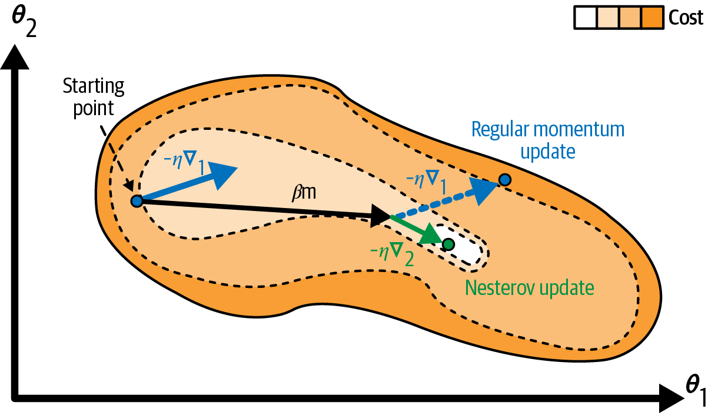
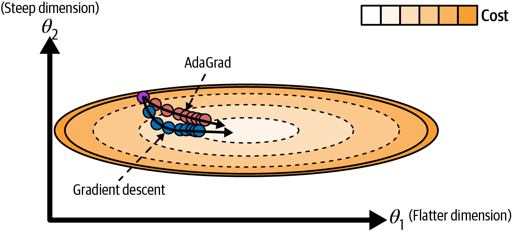
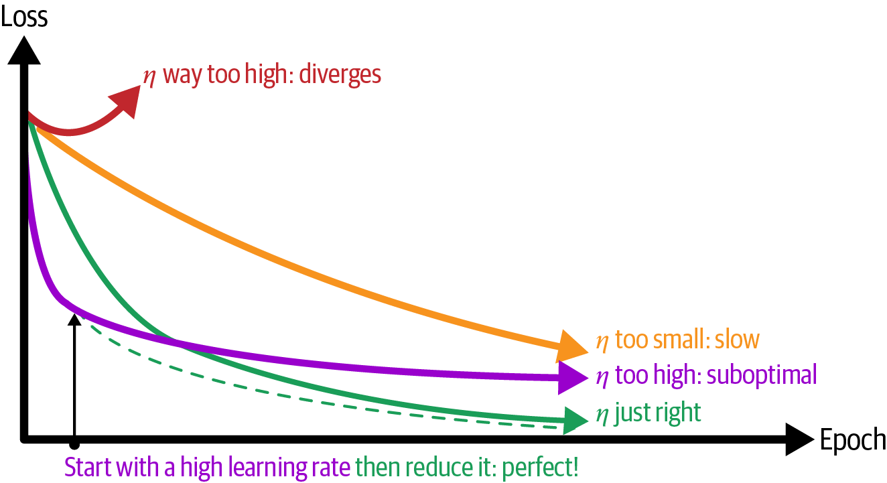
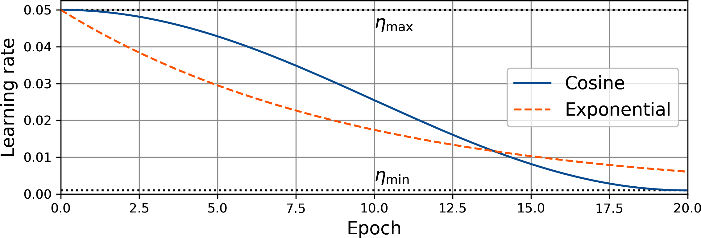
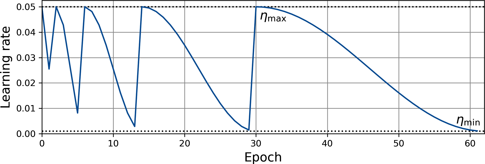
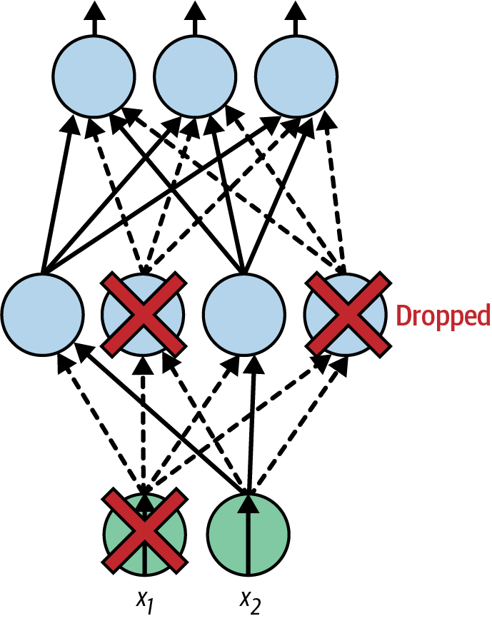

<!-- _class: cover -->
# 深層神經網路訓練
## 最佳化與正則化

書本第 11 章（下）｜學得更快，也要泛化得更好

180 分鐘，含兩次 10 分鐘休息

<!-- 來源：book/CHAPTER 11 Training Deep Neural Networks.pdf，印刷pp.389–415（PDF pp.27–53）。接續12_深層神經網路訓練_梯度與遷移.md。 -->

---
## 本次成果與節奏

- **0–50 分**：Momentum、Nesterov、AdaGrad、RMSProp 與 Adam。
- **60–120 分**：AdamW、方法比較、學習率排程與診斷。
- **130–180 分**：正則化、Dropout、完整實驗設計。

成果：能手算參數更新、標出 scheduler 的位置，並規劃公平比較。

「選讀」安排課後或替換同段講解。範例數據會標明是否為教材結果。

<!-- 講者提示：兩次休息各10分鐘；主線共160分鐘。較長程式以讀碼為主，課後才做完整訓練。本份共用torch、nn、model、loss_fn、optimizer、DataLoader等上一份已介紹物件。 -->

---
## 梯度、最佳化器與排程的分工

- `loss.backward()`：目前參數該往哪個方向調整？
- `optimizer.step()`：結合梯度與歷史狀態，實際調整多少？
- `scheduler.step()`：下一個階段使用什麼學習率？
- 驗證與早停：目前模型是否值得繼續訓練？

同樣的梯度，換一個 optimizer，更新量可能不同。

<!-- 來源：Ch.11 pp.389–404，銜接Ch.10訓練迴圈。不要把排程和optimizer的逐參數自適應縮放混為一談。 -->

---
## Momentum：累積前幾步的方向

令 $g_t=\nabla_\theta L(\theta_t)$，$v_0=0$：

$$v_t=\beta v_{t-1}-\eta g_t,\qquad\theta_{t+1}=\theta_t+v_t$$

持續同向的梯度會累積；來回變動的部分可互相抵銷。

$\beta$ 越大，歷史影響越久，也可能跨過最低點後持續震盪。

<!-- 來源：Ch.11式11-5，pp.389–390。採書中含學習率的速度v記號，和後面Adam的一階矩m分開。PyTorch SGD動量buffer慣例不同，此手算以固定lr、零初始速度解釋。 -->

---
<!-- _class: activity -->
## Momentum 手算：連續兩次相同梯度

設 $\theta_0=1$，$v_0=0$，$\eta=0.1$，$\beta=0.9$，兩步梯度均為 2。

| 步驟 | 速度 $v$ | 更新後的 $\theta$ |
| --- | --- | --- |
| 第 1 步 | $0.9\times0-0.1\times2=-0.2$ | $0.8$ |
| 第 2 步 | ？ | ？ |

若使用沒有 Momentum 的 SGD，兩步後參數是多少？

<!-- 來源：Ch.11式11-5，自編數例，建議5分鐘。答案v2=-0.38、theta2=0.42；SGD為0.6。常梯度下極限速度=-ηg/(1-β)，但真實梯度在變，不能把理論倍數當成實際訓練加速倍數。 -->

---
<!-- _class: figure -->
## 圖 11-7：Nesterov 提前看動量方向



概念上先看 $\theta_t+\beta v_{t-1}$ 附近的坡度，再修正更新。

<!-- 來源：Ch.11圖11-7，p.391（PDF p.29）、式11-6。圖是幾何示意，不是本班實驗軌跡；靠近谷底時前看梯度有機會提早煞車。 -->

---
<!-- _class: small -->
## Nesterov 的更新式與 PyTorch

$$v_t=\beta v_{t-1}-\eta\nabla L(\theta_t+\beta v_{t-1})$$
$$\theta_{t+1}=\theta_t+v_t$$

```python
optimizer = torch.optim.SGD(
    model.parameters(), lr=0.01,
    momentum=0.9, nesterov=True)
```

使用內建 optimizer 即可，不需手動把模型參數先挪到「前看點」。

<!-- 來源：Ch.11式11-6，pp.390–391。PyTorch使用等價重參數化的更新形式，不應逐行把此教學速度式當作其內部buffer定義。lr為示範值。 -->

---
<!-- _class: figure -->
## 圖 11-8：AdaGrad 對各方向調整步幅



累積梯度較大的座標，後續更新會縮得更多，讓路徑改變。

<!-- 來源：Ch.11圖11-8，p.393（PDF p.31）；pp.392–393。圖為拉長碗形的示意；與輸入標準化的作用不同，自適應方法也不表示可以忽略資料尺度。 -->

---
<!-- _class: small -->
## AdaGrad：累積梯度平方

$$s_t=s_{t-1}+g_t^2,\qquad
\theta_{t+1}=\theta_t-\eta\frac{g_t}{\sqrt{s_t}+\epsilon}$$

平方、開根號與除法都逐座標進行。

若第一步 $g=[1,10]$，$s_0=0$、$\eta=0.1$，忽略 $\epsilon$：

$s_1=[1,100]$，兩個座標的更新量都約為 $-0.1$。

累積量不斷增加，後期可能縮得太小而停滯。

<!-- 來源：Ch.11式11-7，pp.392–393；自編數例。這是有效步幅逐座標縮放，不是外部排程器直接改全域η。 -->

---
## RMSProp：保留較近的梯度尺度

$$s_t=\alpha s_{t-1}+(1-\alpha)g_t^2$$
$$\theta_{t+1}=\theta_t-\eta\frac{g_t}{\sqrt{s_t}+\epsilon}$$

用指數移動平均，減少早期的大梯度永久壓低後續步幅。

`torch.optim.RMSprop(model.parameters(), lr=0.001, alpha=0.9)`

<!-- 來源：Ch.11式11-8，pp.393–394。alpha=0.9沿書中示例明確指定，不宣稱是PyTorch預設。此處不加momentum，也不使用centered變體，以便對照公式。 -->

---
<!-- _class: small -->
## Adam：一階矩與二階原點矩

$$m_t=\beta_1m_{t-1}+(1-\beta_1)g_t$$
$$s_t=\beta_2s_{t-1}+(1-\beta_2)g_t^2$$

$m_t$ 追蹤梯度方向，$s_t$ 追蹤梯度平方的尺度。

兩者從 0 開始，需要偏差修正，避免早期估計偏向 0。

二階原點矩是 $E[g^2]$，不等於中心化變異數 $E[(g-E[g])^2]$。

<!-- 來源：Ch.11式11-9，p.394；以正梯度m改寫，後續參數用減號。書中把二階矩稱uncentered variance，此處精確區別。不能混用書中的負m記號與本頁更新減號。 -->

---
<!-- _class: small -->
## Adam：偏差修正與更新

$$\hat m_t=\frac{m_t}{1-\beta_1^t},\qquad
\hat s_t=\frac{s_t}{1-\beta_2^t}$$
$$\theta_{t+1}=\theta_t-\eta\frac{\hat m_t}{\sqrt{\hat s_t}+\epsilon}$$

```python
optimizer = torch.optim.Adam(
    model.parameters(), lr=1e-3, betas=(0.9, 0.999))
```

「自適應」仍需要選擇全域學習率，並查看驗證結果。

<!-- 來源：Ch.11式11-9，pp.394–395。t從1開始，m0=s0=0。epsilon通常很小但不能任意省略於實作；此處公式與常見PyTorch Adam慣例一致。 -->

---
<!-- _class: activity -->
## Adam 手算：第一步為何需要修正？

設 $g_1=2$，$m_0=s_0=0$，$\beta_1=0.9$，$\beta_2=0.999$。

1. 求 $m_1$ 與 $s_1$。
2. 求 $\hat m_1$ 與 $\hat s_1$。
3. $\eta=0.001$，忽略極小的 $\epsilon$，參數改變多少？

最後說明：梯度為 2，為什麼更新量不直接等於 $-0.002$？

<!-- 來源：Ch.11式11-9，自編活動，建議6分鐘。答案0.2、0.004，修正為2、4，更新-0.001。這是第一步單座標且初始狀態0的例子，不代表Adam永遠只看梯度正負。 -->

---
<!-- _class: activity -->
## 休息 10 分鐘

回來後比較：使用 Adam 時，L2 懲罰與 weight decay 是否相同？

<!-- 講者提示：前段50分鐘結束。 -->

---
<!-- _class: small -->
## Adam 的變體：改動了哪個部分？

| 方法 | 主要改動 | 適合檢查的問題 |
| --- | --- | --- |
| AdaMax | 以衰減後的最大絕對梯度縮放 | Adam 不穩定時的比較選項 |
| NAdam | 結合 Adam 與 Nesterov 想法 | 更新方向與收斂速度 |
| AdamW | 將權重衰減與梯度自適應分開 | 模型泛化與權重控制 |

三者都需要用同一資料切分與預算比較，沒有通用第一名。

<!-- 來源：Ch.11 pp.395–396。AdaMax遞推u_t=max(β2*u_prev,abs(g_t))。PyTorch類名為Adamax、NAdam、AdamW，注意大小寫。 -->

---
## AdamW：分開處理權重衰減

將 Adam 更新方向記為 $u_t$：

$$\theta_{t+1}=(1-\eta\lambda)\theta_t-\eta u_t$$

衰減直接縮小權重，不進入一階、二階矩的梯度估計。

對一般 SGD（無動量），加入 $\frac\lambda2\lVert\theta\rVert^2$ 可得到相同形式。

對 Adam，將 $\lambda\theta$ 加入梯度會連帶影響自適應尺度，因此不同。

<!-- 來源：Ch.11 p.396、405；https://docs.pytorch.org/docs/2.14/generated/torch.optim.AdamW.html 。明確限定無動量SGD的等價推導，不把momentum耦合L2與完全解耦衰減一概視為相同。對beta/bias可另分組，不一定都衰減。 -->

---
<!-- _class: small -->
## 表 11-2：最佳化器比較（1/2）

| 方法 | 書中收斂速度評等 | 書中收斂品質評等 |
| --- | --- | --- |
| SGD | 低 | 高 |
| SGD＋Momentum | 中 | 高 |
| SGD＋Nesterov | 中 | 高 |
| AdaGrad | 中 | 低，可能太早停滯 |

這是作者的質性摘要，沒有共同資料集上的時間或分數單位。

<!-- 來源：Ch.11表11-2，p.398（PDF p.36），原表一/二/三星轉寫低/中/高。保留表中對SGD品質的評等，不解讀成每個資料集SGD一定更好。 -->

---
<!-- _class: small -->
## 表 11-2：最佳化器比較（2/2）

| 方法 | 書中收斂速度評等 | 書中收斂品質評等 |
| --- | --- | --- |
| RMSProp | 中 | 中或高 |
| Adam | 中 | 中或高 |
| AdaMax | 中 | 中或高 |
| NAdam | 中 | 中或高 |
| AdamW | 中 | 中或高 |

課堂比較還要記錄實際時間、驗證損失與多次實驗變異。

<!-- 來源：Ch.11表11-2，p.398（PDF p.36），中文可編輯表格。表的低/中/高對應作者原表星級，不能當成實測保證。 -->

---
<!-- _class: small -->
## 選讀｜二階資訊與稀疏模型

Hessian 描述損失曲率，$n$ 個參數的完整矩陣有 $n^2$ 個元素。

一百萬參數若以 float32 儲存完整 Hessian，僅矩陣就約 **4 TB**。

- 近似曲率方法如 Shampoo，試圖降低直接處理完整矩陣的成本。
- L1 懲罰與剪枝可促進稀疏，但零值多不保證一般硬體推論更快。

需要另測記憶體、支援的運算與端到端延遲。

<!-- 來源：Ch.11 p.397，Hessian容量為自編十進位估算10^12×4 bytes。僅介紹方法動機，不要求安裝外部optimizer。稀疏加速取決於結構化程度、儲存格式與硬體實作。 -->

---
<!-- _class: figure -->
## 圖 11-9：固定學習率的取捨



太小前進慢，太大可能震盪或發散；接近好解後通常需要更細的步幅。

<!-- 來源：Ch.11圖11-9，p.399（PDF p.37）；pp.398–399。先請學生逐條解讀曲線，再引入排程，圖中成效不是本班測量。 -->

---
## 指數衰減：每輪乘上一個比例

$$\eta_t=\eta_0\gamma^t$$

$\eta_0=0.01,\gamma=0.9$，十次衰減後約為 $0.00349$。

```python
scheduler = torch.optim.lr_scheduler.ExponentialLR(
    optimizer, gamma=0.9)
# 每個 epoch 完成 optimizer 更新後，再 scheduler.step()
```

衰減太快，仍可能在學好之前就讓步幅過小。

<!-- 來源：Ch.11 p.399。t是step呼叫次數，本例每epoch一次。初始lr在optimizer建立時設定，不能只改公式而忘了實際optimizer。 -->

---
<!-- _class: figure -->
## 圖 11-10：餘弦退火



$$\eta_t=\eta_{min}+\frac{\eta_{max}-\eta_{min}}2
\left[1+\cos\left(\frac{t\pi}{T_{max}}\right)\right]$$

從高學習率平滑降至低學習率，需要先指定排程長度。

<!-- 來源：Ch.11圖11-10、式11-10，p.400（PDF p.38）。t=0最大，t=Tmax最小。若每epoch呼叫一次，Tmax以epoch計；若每更新呼叫一次，單位改成更新次數。 -->

---
<!-- _class: small -->
## 依表現降學習率：ReduceLROnPlateau

```python
scheduler = torch.optim.lr_scheduler.ReduceLROnPlateau(
    optimizer, mode="min", patience=2, factor=0.5)
# 每輪先訓練，再計算完整驗證損失 val_loss
scheduler.step(val_loss)
```

驗證損失停滯一段時間，才降低學習率；監控 accuracy 則用 `mode="max"`。

降低學習率不等於早停，可以先繼續觀察是否改善。

<!-- 來源：Ch.11 p.401。patience=2容忍兩次不改善，超過後觸發，另受threshold/cooldown等設定影響。不要把每batch loss直接當成完整validation loss；永遠不傳test loss。 -->

---
<!-- _class: small -->
## Warmup：開始幾輪逐步提高學習率

```python
optimizer = torch.optim.AdamW(model.parameters(), lr=1e-3)
warmup = torch.optim.lr_scheduler.LinearLR(
    optimizer, start_factor=0.1, end_factor=1.0, total_iters=3)
cosine = torch.optim.lr_scheduler.CosineAnnealingLR(
    optimizer, T_max=17, eta_min=1e-5)
scheduler = torch.optim.lr_scheduler.SequentialLR(
    optimizer, schedulers=[warmup, cosine], milestones=[3])
```

20 輪示例：先暖身 3 輪，再接 17 輪餘弦排程，每輪訓練後 `step()`。

<!-- 來源：Ch.11 pp.401–403；https://docs.pytorch.org/docs/2.14/optim.html 。warmup示例修正為optimizer先step，scheduler後step，避免原書p.402在epoch開始先step的時序疑義。此段替換其他scheduler，不要同時使用OneCycleLR。 -->

---
<!-- _class: figure -->
## 圖 11-11：餘弦退火與暖重啟



學習率週期性回升，再重新下降；可讓後面的週期逐漸加長。

「重啟」指學習率排程，通常保留模型權重。

<!-- 來源：Ch.11圖11-11，p.403（PDF p.41）、p.404。CosineAnnealingWarmRestarts(optimizer,T_0=2,T_mult=2,eta_min=...)；不能誤當重新隨機初始化模型，也不保證一定跳出所有壞區域。 -->

---
<!-- _class: small -->
## 1cycle：在訓練預算內先升後降

```python
scheduler = torch.optim.lr_scheduler.OneCycleLR(
    optimizer, max_lr=1e-3, epochs=20,
    steps_per_epoch=len(train_loader), pct_start=0.3)
# 每批 loss.backward() 之後：
optimizer.step()
scheduler.step()
```

每批更新後呼叫一次；`max_lr` 是峰值，不是每一步都使用的值。

總更新步數要與實際訓練一致，避免少跑或多跑排程。

<!-- 來源：Ch.11 p.404；https://docs.pytorch.org/docs/2.14/generated/torch.optim.lr_scheduler.OneCycleLR.html 。此段替換其他scheduler，預設為兩階段cosine、上升比例0.3；與書中原始三階段線性描述有差異，可用three_phase=True/anneal_strategy='linear'作延伸。optimizer須已建立，不在迴圈內重建。 -->

---
<!-- _class: small -->
## Scheduler 呼叫時機總表

| 排程 | 本課呼叫頻率 | 傳入的資訊 |
| --- | --- | --- |
| ExponentialLR | 每 epoch 訓練後 | `step()` |
| CosineAnnealingLR | 每 epoch 訓練後 | `step()`；T_max 同單位 |
| LinearLR／SequentialLR | 每 epoch 訓練後 | `step()` |
| CosineAnnealingWarmRestarts | 本例每 epoch 後 | `step()`；週期同單位 |
| ReduceLROnPlateau | 完成驗證後 | `step(val_loss)` |
| OneCycleLR | 每個 optimizer 更新後 | `step()` |

<!-- 來源：Ch.11 pp.399–404與PyTorch optim官方文件。排程可以採不同單位，但參數必須一致；這張表限定本課示例。重啟也可傳fractional epoch，作進階延伸。 -->

---
<!-- _class: small -->
## 選讀｜舊 mini-batch 範例的排程計數

[開啟 GD 原 Notebook](../programs/upstream/MachineLearning2025/01_batchgradientDescent.ipynb)：cell 0，搜尋 `mini_gradient_descent`。

```python
# 原碼每輪都從iteration=0開始：eta = learning_schedule(iteration)
# 教學修正版：放在原本epoch內的mini-batch迴圈
step = epoch * n_batches_per_epoch + iteration
eta = learning_schedule(step)
gradients = 2 / len(xi) * xi.T @ (xi @ theta - yi)
theta = theta - eta * gradients
```

原排程是 `200 / (t + 1000)`。用累積步數，才不會每輪回到初始學習率。

<!-- 來源：01_batchgradientDescent.ipynb cell 0的learning_schedule與mini_gradient_descent。原SGD已用epoch*m+iteration，mini-batch卻只用iteration；本頁標示為修正版，原檔不變。xi/yi/theta均沿用原迴圈變數；改len(xi)使不足整批時梯度仍按實際樣本數平均。修正用於原本平滑衰減目的，並非說所有週期性重升都錯；刻意warm restart是另一種排程。 -->

---
<!-- _class: activity -->
## 診斷活動：排程為什麼失去作用？

A：設定 `T_max=20`，想每輪下降一次，實際卻每批都呼叫。

B：OneCycle 設定每輪 100 步，但每個 epoch 只 `step()` 一次。

C：每個 epoch 都重新建立 optimizer，Momentum 一直沒累積。

D：用驗證 accuracy，卻把 Plateau 的 `mode` 設為 `min`。

提交：各挑兩項，說明應改的位置與預期改善。

<!-- 來源：Ch.11排程與optimizer概念，自編活動，建議8分鐘。答案：A統一單位；B每optimizer update step一次；Coptimizer建在epoch迴圈外；D改max。可畫epoch/batch兩層迴圈在白板標位置，無環境亦可做。 -->

---
<!-- _class: activity -->
## 休息 10 分鐘

回來後思考：train loss 下降、validation loss 上升時，下一步要看什麼？

<!-- 講者提示：中段60分鐘結束。 -->

---
## 正則化：用驗證集判斷是否改善泛化

- 早停：保留驗證表現較好的訓練版本。
- L1／L2／weight decay：限制參數大小或促進稀疏。
- Dropout：訓練時擾動隱藏表示，減少過度依賴少數特徵。
- 資料擴增：提供合理變化，維持任務標籤的意義。

先排除切分錯誤、前處理不一致與標籤問題，再調整正則化強度。

<!-- 來源：Ch.11 pp.405–409；source_pptx/02_Validation and Regularization.pptx s.10–14；06_Artificial Neural Networks.pptx s.33–35；07_Convolutional Neural Networks.pptx s.37。舊稿Regularization統一譯為正則化，Normalization譯為正規化。 -->

---
<!-- _class: small -->
## L1、L2 與手動加入懲罰

$$L_{total}=L_{data}+\lambda_1\sum_j|w_j|+\frac{\lambda_2}{2}\sum_jw_j^2$$

L1 促進稀疏，L2 限制權重尺度。懲罰哪些參數需明確指定。

```python
# 示範只懲罰Sequential內Linear層的權重
weights = [m.weight for m in model.modules()
           if isinstance(m, nn.Linear)]
l2 = sum(w.square().sum() for w in weights)
loss = loss_fn(logits, y_batch) + 0.5 * 1e-4 * l2
```

[舊例：Lasso／Ridge 與係數比較](../programs/upstream/MachineLearning2025/02_Regularization_Regression.ipynb)（cell 3–7）；觀察係數如何隨 `alpha` 改變。

<!-- 來源：Ch.11 pp.405–406；舊02 PPTX s.10–14。這是手動L2方案，optimizer的weight_decay應設0以避免重複懲罰。係數含1/2使梯度為λw；若不寫1/2，梯度係數為2λ，不能直接把超參數視為相同。 -->

---
<!-- _class: small -->
## AdamW 分組：只衰減本例的線性權重

```python
linear_weights = [m.weight for m in model.modules()
                  if isinstance(m, nn.Linear)]
weight_ids = {id(p) for p in linear_weights}
other_params = [p for p in model.parameters()
                if id(p) not in weight_ids]
optimizer = torch.optim.AdamW([
    {"params": linear_weights, "weight_decay": 1e-4},
    {"params": other_params, "weight_decay": 0.0},
], lr=1e-3)
```

本例是沒有共享權重的 MLP；BN／LN 參數與偏置落在第二組。

<!-- 來源：Ch.11 p.406的parameter groups概念，改以模組型別及參數id分類。不能只搜尋名字含bn，因Sequential的BN可能只有數字名稱。此方案替換上一頁手動L2，不同時套用；一般共享權重模型還需去重。 -->

---
<!-- _class: small -->
## 早停與最佳參數回復

每輪完整驗證後，改善才保存。停止後回到最佳版本。

```python
import copy
# epoch迴圈之前：best_loss, stale = float("inf"), 0
if val_loss < best_loss:
    best_loss, stale = val_loss, 0
    best_state = copy.deepcopy(model.state_dict())
else:
    stale += 1
# stale達耐心值時結束epoch迴圈
# 訓練結束：model.load_state_dict(best_state)
```

要續訓時，另保存 optimizer、scheduler、epoch 與前處理設定。

<!-- 來源：Ch.11 p.405銜接Ch.10 PDF pp.40–41。此片段不是獨立完整迴圈；假設val_loss有限且第一輪成功建立best_state。deepcopy避免最佳狀態隨後續訓練改變；若只回復推論模型，不必回復optimizer，但續訓必須保留對應狀態。 -->

---
<!-- _class: small -->
## 選讀｜原早停範例：保存後要回復哪一版？

[開啟多項式早停 Notebook](../programs/upstream/MachineLearning2025/02_Polynomial_Regression_Early_stopping.ipynb)：cell 3–7。

| 原程式位置 | 實際行為 | 讀碼時要修正的觀念 |
| --- | --- | --- |
| cell 3–4 | 用名為 test 的資料挑最佳 epoch | 這份資料實際扮演驗證集 |
| cell 4 | `best_model = deepcopy(lin_reg)` | 已保存當時最佳參數 |
| cell 5 | 用 `lin_reg.predict(...)` | 仍是最後一輪模型 |
| cell 7 | 重訓到 `best_epoch+1` | 不保證重現已保存的參數 |

應直接用已保存的 `best_model`；最終測試另留未參與選模的資料。

<!-- 來源：02_Polynomial_Regression_Early_stopping.ipynb cell 3–7（0起算）。原迴圈沒有patience/break，執行完2000輪後才挑最佳epoch，因此主要示範最佳版本選擇，非當場提早終止。讀碼題：指出cell5/7的模型與cell4最佳快照之差，不需重跑50次多項式。原資料生成為二次含雜訊資料，正規化只fit train，該步可保留。 -->

---
<!-- _class: small -->
## 選讀｜Keras callback：停止與回復最佳權重

[原 Keras Notebook](../programs/upstream/MachineLearning2025/06_neural_nets_with_keras.ipynb)：cell 107–108，搜尋 `restore_best_weights`。

```python
# cell 108原碼摘錄：model與checkpoint_cb已在前面建立
early_stopping_cb = keras.callbacks.EarlyStopping(
     patience=10, restore_best_weights=True)
history = model.fit(X_train, y_train, epochs=100,
                     validation_data=(X_valid, y_valid),
                     callbacks=[checkpoint_cb, early_stopping_cb])
```

`patience` 決定等待多久，`restore_best_weights` 決定結束時回復哪一版。

<!-- 來源：06_neural_nets_with_keras.ipynb cell 107–108，原碼換行整理。這段是房價迴歸模型，前頁Fashion MNIST模型不可直接混用。cell107示範ModelCheckpoint(save_best_only=True)後load_model，cell108加入EarlyStopping。預設監控val_loss；是舊Keras來源對照，不是本課PyTorch可直接執行程式，也不代表optimizer狀態隨最佳權重一起回復。 -->

---
<!-- _class: figure -->
## 圖 11-12：Dropout 的隨機遮罩



每次訓練前向暫時遮掉一部分激活，下次可能換成另一組。

<!-- 來源：Ch.11圖11-12，p.408（PDF p.46）；source_pptx/06_Artificial Neural Networks.pptx s.34–35。圖的虛線代表當次被遮蔽，不是永久剪枝；一般不遮分類任務的輸出logits。 -->

---
<!-- _class: activity -->
## Dropout 手算：為什麼要除以保留率？

$$\tilde a=\frac{r\odot a}{1-p},\qquad r_j\sim\operatorname{Bernoulli}(1-p)$$

$a=[2,4,6,8]$，$p=0.5$，這次遮罩 $r=[1,0,1,0]$。

1. 計算訓練時的輸出。
2. 一般 `eval()` 時輸出是什麼？
3. 解釋為何 $E[\tilde a_j]=a_j$。

<!-- 來源：Ch.11 pp.408–409，自編活動，建議5分鐘。答案[4,0,12,0]，eval為[2,4,6,8]；E[r]=1-p。期望相同不表示每次輸出的總和或分布完全相同。p須小於1，此公式才可除以保留率。 -->

---
<!-- _class: small -->
## PyTorch：Dropout 與評估公平性

```python
model_drop = nn.Sequential(
    nn.Flatten(), nn.Linear(784, 100), nn.ReLU(),
    nn.Dropout(p=0.2), nn.Linear(100, 10)
).to(device)
```

- 訓練用 `train()`，一般驗證用 `eval()` 與 `no_grad()`。
- 比較 train／validation loss 時，兩邊都可另用 eval 模式重算。
- Dropout 過強可能欠擬合，比例需驗證。

<!-- 來源：Ch.11 p.409；06 ANN PPTX s.34–35。舊稿1–2%改善為特定研究情境，不作本課成效保證。此模型須重新建立optimizer；不要拿model_drop的梯度卻step舊model的optimizer。SELU則另考慮AlphaDropout。 -->

---
<!-- _class: small -->
## MC Dropout：保留遮罩，多次預測

普通推論關閉 Dropout；MC Dropout 讓 Dropout 保持隨機，平均多次機率。

$$\bar p_k=\frac1T\sum_{t=1}^{T}p_k^{(t)}$$

例如某類三次得到 $[0.2,0.5,0.8]$，平均為 0.5，變動很大。

先將每次 logits 轉成機率，再平均；平均 logits 通常不等價。

<!-- 來源：Ch.11 pp.410–412。三次數字是自編示意，正式估計可增加T；平均0.5、以T作分母的std約0.245。變動提供不確定性線索，不是自動校準的可信區間，也不保證總能改善accuracy。 -->

---
<!-- _class: small -->
## 選讀｜MC Dropout 只打開需要的層

```python
model_drop.eval()
for module in model_drop.modules():
    if isinstance(module, nn.Dropout):
        module.train()
with torch.no_grad():
    probs = torch.stack([
        model_drop(X_new).softmax(dim=-1) for _ in range(30)])
mean_p = probs.mean(dim=0)
std_p = probs.std(dim=0, unbiased=False)
model_drop.eval()  # 使用完回復一般推論
```

<!-- 來源：Ch.11 pp.410–412，改寫成逐次抽樣以便讀碼。X_new已在device；模型已用Dropout訓練。本片段適用nn.Dropout，非AlphaDropout/Dropout2d通用切換。不能直接model.train()把BN統計也打開，且不能每次前向重設同一seed造成相同遮罩。 -->

---
## Max-norm：限制每個神經元的權重範數

更新參數後，對每個神經元的輸入權重向量做：

$$w\leftarrow w\min\left(1,\frac{r}{\lVert w\rVert_2}\right)$$

$w=[3,4]$、上限 $r=2$，調整後是 $[1.2,1.6]$。

Max-norm 限制**權重**，梯度裁剪限制**梯度**，插入位置不同。

<!-- 來源：Ch.11 pp.412–413；自編手算。零向量不需縮放。原書敘述有row/column混用，對PyTorch Linear的[out,in]權重應沿dim=1求每列範數。 -->

---
<!-- _class: small -->
## 選讀｜只對 Linear 權重施加 Max-norm

```python
# 緊接optimizer.step()之後
with torch.no_grad():
    for layer in model.modules():
        if isinstance(layer, nn.Linear):
            w = layer.weight
            norms = w.norm(dim=1, keepdim=True)
            scale = (2.0 / norms.clamp_min(1e-8)).clamp(max=1.0)
            w.mul_(scale)
```

每一列對應一個輸出神經元，不對一維的 BN／LN 參數套用此程式。

<!-- 來源：Ch.11 p.413，限制在Linear的安全教學改寫。使用clamp max=1只縮小超界列，與書中所有非bias參數一律dim=1相比，避免BN/LN參數維度錯誤。不是呼叫clip_grad_norm_。 -->

---
<!-- _class: small -->
## 舊稿補充：資料擴增要保留標籤意義

| 變化 | 可考慮的任務 | 應先檢查的風險 |
| --- | --- | --- |
| 小幅平移、裁切 | 物件分類 | 關鍵物件是否被切掉？ |
| 左右翻轉 | 部分自然影像 | 文字、左右方向是否影響標籤？ |
| 亮度、對比變化 | 光照可能改變的影像 | 是否破壞顏色判別資訊？ |
| 小角度旋轉 | 容許姿態改變的物件 | 旋轉是否改變類別？ |

先切分原始樣本，再只對訓練集擴增，避免近乎相同影像跨集合。

<!-- 來源：source_pptx/07_Convolutional Neural Networks.pptx s.37；連結Ch.11正則化。表格為教學改寫，未引用舊稿外部部落格內容。驗證/測試前處理固定，除非另定義測試時擴增協定。 -->

---
<!-- _class: small -->
## 表 11-3：深層網路的起始設定

| 項目 | 書中建議起點 |
| --- | --- |
| 權重初始化 | He |
| 激活 | 較淺用 ReLU，較深可比較 Swish |
| 正規化 | 淺層可不用，深層可比較 BN／LN |
| 正則化 | 早停，需要時加 weight decay |
| Optimizer | Nesterov SGD 或 AdamW |
| 學習率排程 | 依驗證表現調整或 1cycle |

<!-- 來源：Ch.11表11-3，pp.413–414（PDF pp.51–52）。這是作者的起始指南，不是唯一標準。配合task/domain選預訓練模型；遇SELU等特殊架構須另外配對。 -->

---
<!-- _class: activity -->
## 綜合實驗：每次只回答一個比較問題

固定 Fashion MNIST 的切分、前處理、epoch 上限與記錄方式。

| 比較 | 保持相同 | 主要觀察 |
| --- | --- | --- |
| SGD＋Nesterov vs AdamW | 網路、資料、搜尋預算 | 驗證損失與實際時間 |
| 固定學習率 vs 1cycle | optimizer與網路 | 到達相近驗證表現的時間 |
| 無 Dropout vs 有 Dropout | 其餘已選定設定 | 泛化差距與收斂變化 |

各 optimizer 可在相同預算內各自選學習率，避免只給某組有利設定。

<!-- 來源：Ch.11整章，自編綜合實驗，課堂用10分鐘規劃，完整執行作課後。不能同時換深度/初始化/optimizer後將差異歸因單一方法；保留基準與多個隨機種子。 -->

---
<!-- _class: small -->
## 實驗提交與離線替代

提交一張結果表與兩張曲線，至少包含：

- 設定、隨機種子、資料切分與前處理。
- 每輪 train／validation loss、學習率與時間。
- 最佳驗證版本、錯誤案例、改善與未改善的解釋。

沒有環境：提交訓練迴圈流程，標出清梯度、裁剪、更新、排程及驗證位置。

驗收看比較是否公平、證據能否支持結論，不以達到特定分數評分。

<!-- 來源：Ch.11實驗原則；自編活動驗收。測試集只在選定最終設定後使用，所有實測欄位由學生填入，不預造訓練結果。 -->

---
<!-- _class: small -->
## 選讀｜原 Keras 的 TensorBoard 訓練紀錄

[開啟原 Notebook](../programs/upstream/MachineLearning2025/06_neural_nets_with_keras.ipynb)：cell 112–116，搜尋 `get_run_logdir`。

```python
# 原碼摘錄：model、資料與checkpoint_cb均已備妥
run_logdir = get_run_logdir()
tensorboard_cb = keras.callbacks.TensorBoard(run_logdir)
history = model.fit(X_train, y_train, epochs=30,
                    validation_data=(X_valid, y_valid),
                    callbacks=[checkpoint_cb, tensorboard_cb])
```

每次實驗分開目錄；先記錄設定，再比較 loss、val_loss 與訓練時間。

<!-- 來源：06_neural_nets_with_keras.ipynb cell113、116，原碼合併摘錄。get_run_logdir原實作精度到秒，同秒啟動兩次可能同目錄，可另加實驗名稱或唯一識別；此頁不要求啟動服務。TensorBoard只是呈現記錄，不能自行讓不同切分/預算的實驗變得公平。對照本課PyTorch逐epoch記錄，不將Keras callback直接傳給PyTorch。 -->

---
<!-- _class: small -->
## 課後延伸：書中 CIFAR10 深層網路實驗

第 11 章練習 8：用 20 個隱藏層、每層 100 個單元觀察訓練困難。

1. He＋SiLU，搭配 NAdam 與早停，重新搜尋學習率。
2. 加 BN 比較，再以符合條件的 SELU＋LeCun normal 比較。
3. 嘗試 AlphaDropout、MC Dropout 與 1cycle，分開記錄影響。

CIFAR10 為 32×32 彩色影像，攤平是 3,072 維，輸出 10 個 logits。

<!-- 來源：Ch.11練習8 a–g，p.415（PDF p.53）。資料50,000訓練/10,000測試，驗證由訓練資料切出。20層是刻意放大問題，不是推薦的影像最佳架構。SELU/AlphaDropout的MC版本要特別實作，不能直接套前面只切nn.Dropout的片段。 -->

---
<!-- _class: small -->
## 選讀｜強化學習 PDF：Q-table 與神經網路

| 表示方法 | 如何得到各動作的 Q 值？ | 與本章的關係 |
| --- | --- | --- |
| Q-table | 依離散狀態查表，每個狀態保存動作值 | 表格更新不用反向傳播 |
| 神經網路近似 | 輸入狀態特徵，由網路輸出動作值 | 訓練會用到梯度與 optimizer |

舊 PDF 以迷宮 Q-table 為主，並把 DQN 列為未來擴充。

狀態空間很大時可考慮函數近似；DQN 還需要本章以外的訓練設計。

<!-- 來源：source_pptx/12_強化學習.pdf pp.12、20，中文可編輯比較表。原PDF為20張影像頁，已全份目視檢查。p.12原圖的maze軸標籤有歧義，保留查表概念而不直接貼圖。Q-table不能直接表示連續狀態，可先離散化或改函數近似；DQN完整內容留到book Ch.19，不宣稱舊PDF已提供深層訓練實作。 -->

---
## 離堂檢核：以證據選方法

1. Adam 為何仍需要調整學習率？
2. Dropout 開啟時的 train loss，為何不宜直接和 eval loss 比？
3. Gradient clipping 與 Max-norm 分別在哪個位置執行？
4. 為何只展示一次最好成績，不能證明新方法比較好？

課後：第 11 章練習 5–7，並選練習 8 的一組變因設計實驗。

<!-- 來源：Ch.11 pp.394–415。答案：全域尺度仍控制更新；訓練有隨機遮罩與縮放、評估無；backward後step前裁剪梯度，step後限制權重；有隨機變異和選擇性報告，需公平預算、固定資料與多次結果。 -->
