<!-- _class: cover -->
# 卷積神經網路：影像特徵與架構

## 卷積、池化與深層視覺模型

書本第 12 章

<!-- 來源／講者提示：自編章節導入 -->

---
## 學習重點與成果

- 卷積與張量尺寸，手算一個濾波器。
- 池化、CNN 與資料增強。
- 經典架構比較、殘差連接與讀碼。

成果：能算輸出尺寸與參數量，說明 CNN 如何利用影像的空間結構。

<!-- notebook-companion-link -->
> 💻 **配套 Notebook**：`programs/notebooks/14_卷積神經網路_影像特徵與架構.ipynb`。本檔提供公式驗算、機制實驗與結果圖；框架片段及完整模型案例另依頁面說明閱讀。

<!-- 來源／講者提示：書本 Ch.12，PDF pp.1–37。 -->

<!-- Notebook 對照：程式 14-01、14-02；完整對照見本章 ipynb 開頭。 -->

---
<!-- notebook-result-slide -->
<!-- _class: small -->
## 程式實驗與實際輸出

<div class="columns wide-left">
<div>

```python
Y[i, j] = sum(X[i:i+2, j:j+2] * K)
```

**觀察**：程式輸出與投影片手算相同：[[0, -1], [-1, 1]]。

參考程式：`programs/notebooks/14_卷積神經網路_影像特徵與架構.ipynb`

</div>
<div>

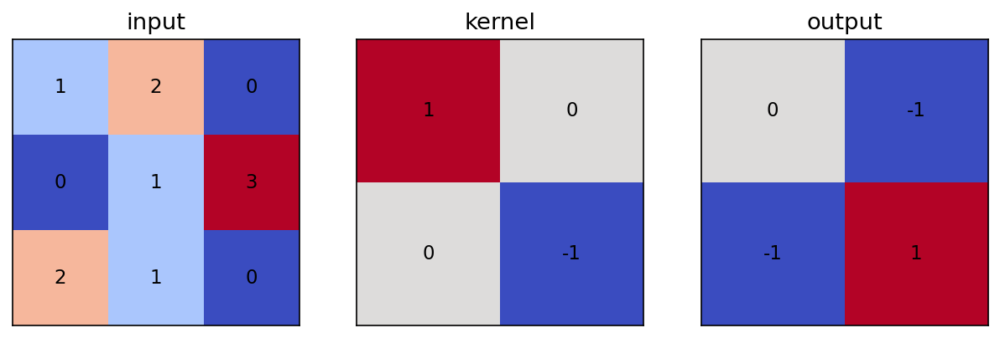

</div>
</div>

<!-- 講者提示：程式與圖為 programs/notebooks/14_卷積神經網路_影像特徵與架構.ipynb 的已執行輸出。 -->

<!-- Notebook 對照：程式 14-04；完整對照見本章 ipynb 開頭。圖例與小型實驗的資料、評估方式及適用範圍各自標示。 -->

---
## 影像分類的輸入與輸出

輸入是一批影像，輸出是每張影像的類別分數。

| 物件 | PyTorch 常見形狀 |
| --- | --- |
| 灰階影像 | `[B, 1, H, W]` |
| RGB 影像 | `[B, 3, H, W]` |
| 十類分類 logits | `[B, 10]` |

空間相鄰的像素往往有關，直接攤平會丟掉這項結構提示。

<!-- 來源／講者提示：書本 Ch.12，PDF pp.1–9 -->

<!-- Notebook 對照：程式 14-05；完整對照見本章 ipynb 開頭。 -->

---
## MLP 與 CNN 的銜接

延伸練習：用本章 Notebook 比較全連接層與卷積層處理影像結構的方式。

- 找到輸入攤平與第一個全連接層。
- MLP 的不同像素位置各有權重；CNN 讓同一濾波器掃過各位置。
- 此處用 PyTorch autograd 處理反向傳播。

討論：邊緣從影像左側移到右側時，哪些參數可以共用？

<!-- 講者提示：本頁只作結構對照；Sigmoid 與 MSE 並非本章分類設計。 -->

<!-- Notebook 對照：程式 14-05；完整對照見本章 ipynb 開頭。 -->

---
## 視覺皮質帶來的設計啟發

視覺皮質中的神經元可能對局部區域與特定圖樣產生反應。

CNN 借用局部連接與分層表示的想法，但不等於完整模擬生物視覺。

較低層常回應邊緣或紋理，較高層可組合成任務相關的複雜特徵。

<!-- 來源／講者提示：書本 Ch.12，PDF pp.2–3 -->

---
<!-- _class: figure -->
## 局部感受野

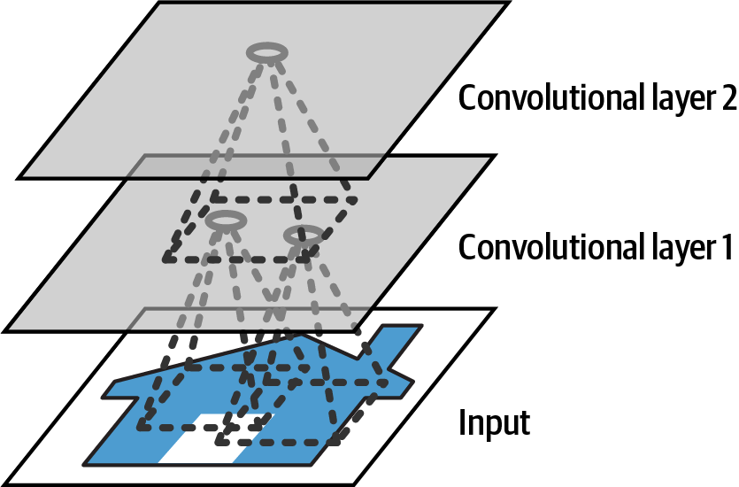

單一輸出位置先看輸入的一小塊；堆疊多層後，可整合更大範圍。

<!-- 來源／講者提示：書本 Ch.12，PDF 4，圖 12-2。此圖用於機制解說，不代表課堂重跑結果。 -->

<!-- Notebook 對照：程式 14-05；完整對照見本章 ipynb 開頭。圖例與小型實驗的資料、評估方式及適用範圍各自標示。 -->

---
## 參數共用的效果

假設輸入為 $32\times32\times3$，輸出有 16 個通道。

| 第一層設計 | 含偏置的參數量 |
| --- | --- |
| 全連接到 16 個神經元 | $(32×32×3+1)×16=49,168$ |
| 16 個 $3×3$ 卷積核 | $(3×3×3+1)×16=448$ |

兩者輸出結構不同；此處比較參數共用，不宣稱功能等價。

<!-- 來源／講者提示：書本 Ch.12，PDF pp.3–9；自編尺寸例。 -->

<!-- Notebook 對照：程式 14-03、14-05；完整對照見本章 ipynb 開頭。 -->

---
<!-- _class: figure -->
## 濾波器與特徵圖

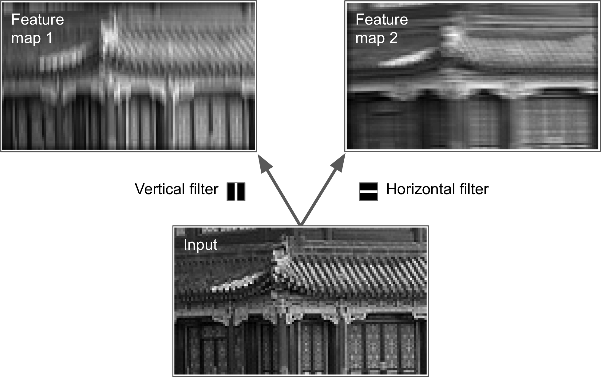

同一張影像可經不同濾波器產生不同回應；訓練會學出濾波器權重。

<!-- 來源／講者提示：書本 Ch.12，PDF 6，圖 12-5。此圖用於機制解說，不代表課堂重跑結果。 -->

<!-- Notebook 對照：程式 14-05；完整對照見本章 ipynb 開頭。圖例與小型實驗的資料、評估方式及適用範圍各自標示。 -->

---
<!-- _class: activity -->
## 卷積手算：一個位置

輸入小區塊與濾波器：

$$X=\begin{bmatrix}1&2&0\\0&1&3\\2&1&0\end{bmatrix},\quad K=\begin{bmatrix}1&0\\0&-1\end{bmatrix}$$

左上角輸出：$1×1+2×0+0×0+1×(-1)=0$。

移動一步，右上角是多少？此例 stride=1、無 padding、bias=0。

<!-- 來源／講者提示：自編數例，依Ch.12 pp.3–8。深度學習Conv2d實際用互相關慣例，不翻轉kernel。答案右上=-1、左下=-1、右下=1。 -->

<!-- Notebook 對照：程式 14-03、14-04、14-05；完整對照見本章 ipynb 開頭。 -->

---
## 卷積手算：完整輸出

$$Y=\begin{bmatrix}0&-1\\-1&1\end{bmatrix}$$

- 同一組 $K$ 在四個位置重複使用。
- 加上 bias 時，每個輸出位置加同一個通道偏置。
- ReLU 會把負值設為 0，得到不同的特徵表示。

<!-- 來源／講者提示：自編數例解答；同上。 -->

<!-- Notebook 對照：程式 14-03、14-04、14-05；完整對照見本章 ipynb 開頭。 -->

---
<!-- _class: figure -->
## Padding 保留邊界附近的資訊

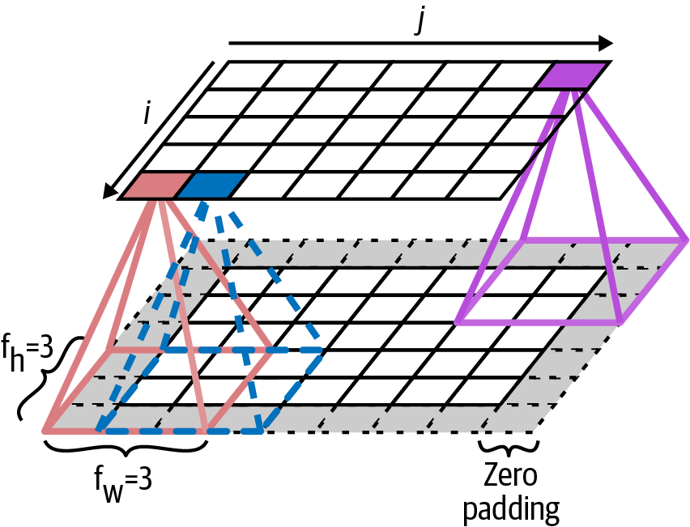

補零讓濾波器能處理邊界，也能控制輸出大小。補零不會創造新的觀測資訊。

<!-- 來源／講者提示：書本 Ch.12，PDF 5，圖 12-3。此圖用於機制解說，不代表課堂重跑結果。 -->

<!-- Notebook 對照：程式 14-05；完整對照見本章 ipynb 開頭。圖例與小型實驗的資料、評估方式及適用範圍各自標示。 -->

---
## 輸出尺寸公式

$$H_{out}=\left\lfloor\frac{H+2P-D(K-1)-1}{S}\right\rfloor+1$$

$K$：kernel size，$S$：stride，$P$：padding，$D$：dilation。

例：$H=32,K=3,S=2,P=1,D=1$，輸出高度為 16。

寬度同樣計算；輸出通道數由濾波器個數決定。

<!-- 來源／講者提示：書本 Ch.12，PDF pp.5–12；公式為標準離散尺寸計算。 -->

<!-- Notebook 對照：程式 14-05；完整對照見本章 ipynb 開頭。 -->

---
<!-- _class: figure -->
## 多個通道如何合成輸出

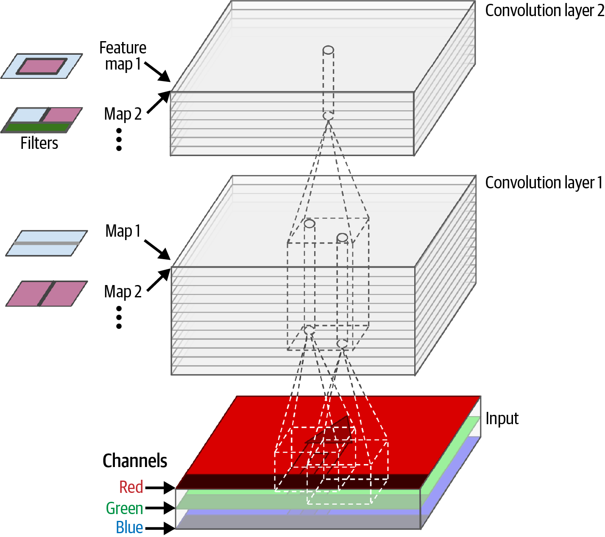

每個輸出通道的卷積核都跨越所有輸入通道，先加總再加偏置。

<!-- 來源／講者提示：書本 Ch.12，PDF 7，圖 12-6。此圖用於機制解說，不代表課堂重跑結果。 -->

<!-- Notebook 對照：程式 14-05；完整對照見本章 ipynb 開頭。圖例與小型實驗的資料、評估方式及適用範圍各自標示。 -->

---
<!-- _class: small -->
## Conv2d 的形狀檢查

```python
import torch
from torch import nn
X = torch.randn(8, 3, 32, 32)
conv = nn.Conv2d(3, 16, kernel_size=3, stride=2, padding=1)
Y = conv(X)
print(Y.shape)  # 預期 torch.Size([8, 16, 16, 16])
print(conv.weight.shape)  # 預期 [16, 3, 3, 3]
```

第一個 16 是輸出通道；batch 大小不影響參數量。

<!-- 來源／講者提示：書本 Ch.12，PDF pp.9–12；程式依作者 12_deep_computer_vision_with_cnns.ipynb Cells 20–43 節錄或教學改寫，非完整獨立訓練腳本。 -->

<!-- Notebook 對照：程式 14-05；完整對照見本章 ipynb 開頭。 -->

---
<!-- _class: activity -->
## 讀碼練習：影像軸的順序

資料常見 `[B, H, W, C]`；Conv2d 需要 `[B, C, H, W]`。

```python
X_nchw = X_nhwc.permute(0, 3, 1, 2)
```

`reshape` 改變形狀卻不等於交換軸。

請用一個 $2×3$ 的小矩陣說明 `reshape` 與 `transpose` 的差別。

<!-- 來源／講者提示：書本 Ch.12，PDF pp.9–10；作者Cells20–24；X_nhwc為已載入影像。 -->

<!-- Notebook 對照：程式 14-05；完整對照見本章 ipynb 開頭。 -->

---
<!-- _class: figure -->
## Max pooling

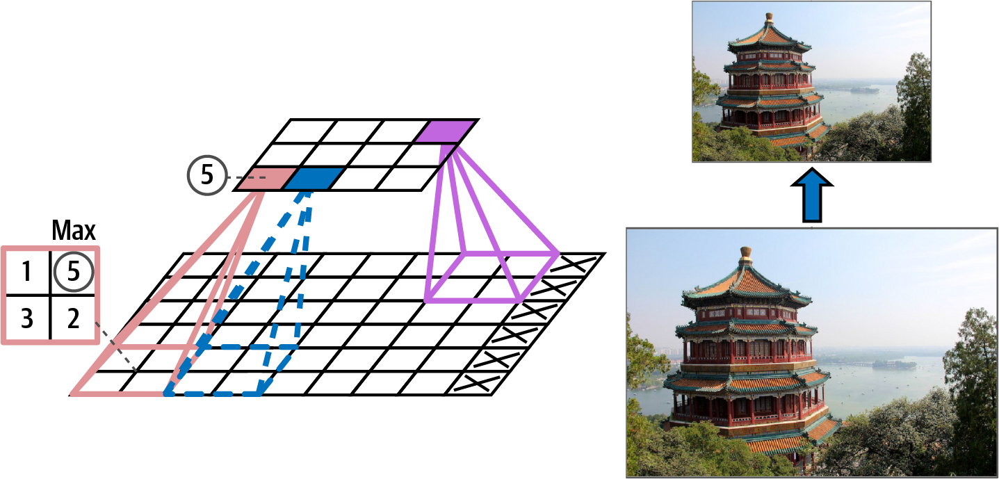

每個小區域取最大值，縮小空間尺寸；一般不含可學習參數。

<!-- 來源／講者提示：書本 Ch.12，PDF 13，圖 12-9。此圖用於機制解說，不代表課堂重跑結果。 -->

<!-- Notebook 對照：程式 14-03、14-05；完整對照見本章 ipynb 開頭。圖例與小型實驗的資料、評估方式及適用範圍各自標示。 -->

---
## 池化與平移的關係

| 操作 | 作用 | 代價 |
| --- | --- | --- |
| Max pooling | 保留局部最強回應 | 細節與位置資訊減少 |
| Average pooling | 整合區域平均回應 | 尖銳特徵可能被稀釋 |
| Global average pooling | 每通道壓成一個值 | 難保留精確座標 |

小幅平移可能得到相近結果；CNN 不保證對所有平移完全不變。

<!-- 來源／講者提示：書本 Ch.12，PDF pp.13–17 -->

<!-- Notebook 對照：程式 14-05；完整對照見本章 ipynb 開頭。 -->

---
<!-- _class: small -->
## Pooling 的 PyTorch 實作

```python
X = torch.randn(8, 16, 32, 32)
local = nn.MaxPool2d(kernel_size=2, stride=2)(X)
global_avg = nn.AdaptiveAvgPool2d(1)(X)
print(local.shape)       # 預期 [8,16,16,16]
print(global_avg.shape)  # 預期 [8,16,1,1]
```

兩者保留通道數，改變的是空間尺寸。

<!-- 來源／講者提示：書本 Ch.12，PDF pp.15–17；程式依作者 12_deep_computer_vision_with_cnns.ipynb Cells 44–61（教學改寫） 節錄或教學改寫，非完整獨立訓練腳本。 -->

<!-- Notebook 對照：程式 14-05；完整對照見本章 ipynb 開頭。 -->

---
<!-- _class: figure -->
## 分類 CNN 的典型組成

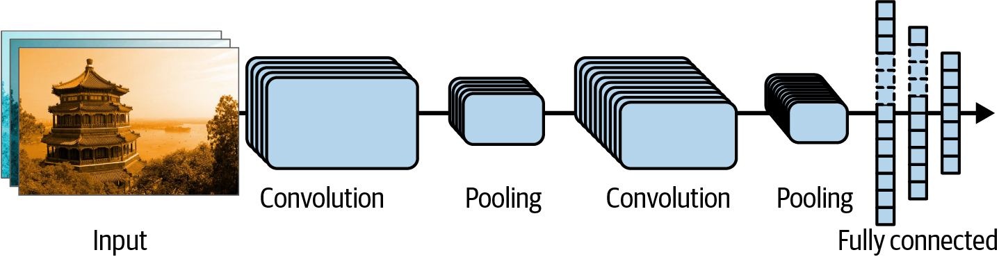

卷積與池化抽取特徵，最後把特徵轉成類別 logits。

<!-- 來源／講者提示：書本 Ch.12，PDF 18，圖 12-12。此圖用於機制解說，不代表課堂重跑結果。 -->

<!-- Notebook 對照：程式 14-06；完整對照見本章 ipynb 開頭。圖例與小型實驗的資料、評估方式及適用範圍各自標示。 -->

---
<!-- _class: small -->
## 小型 CNN：先追蹤每一層尺寸

```python
model = nn.Sequential(
    nn.Conv2d(1, 16, 3, padding=1), nn.ReLU(),
    nn.MaxPool2d(2),
    nn.Conv2d(16, 32, 3, padding=1), nn.ReLU(),
    nn.AdaptiveAvgPool2d(1), nn.Flatten(),
    nn.Linear(32, 10))
logits = model(torch.randn(4, 1, 28, 28))
```

尺寸依序為 28×28、14×14、14×14、1×1；logits 為 `[4,10]`。

<!-- 來源／講者提示：書本 Ch.12，PDF pp.17–20；程式依作者 12_deep_computer_vision_with_cnns.ipynb Cell 64（簡化改寫） 節錄或教學改寫，非完整獨立訓練腳本。 -->

<!-- Notebook 對照：程式 14-06；完整對照見本章 ipynb 開頭。 -->

---
## 分類損失與評估

```python
loss_fn = nn.CrossEntropyLoss()
loss = loss_fn(logits, y.long())
```

- logits 不先經過 Softmax；此損失內部完成所需計算。
- `y` 是 `[B]` 的類別整數，不是 `[B,10]` 的機率。
- 評估使用 `model.eval()` 與 `torch.no_grad()`。
- 同時看混淆矩陣，檢查哪些類別容易混淆。

<!-- 來源／講者提示：書本 Ch.12，PDF pp.19–20；y為目前batch標籤。 -->

<!-- Notebook 對照：程式 14-06、14-07；完整對照見本章 ipynb 開頭。 -->

---
## LeNet-5 與 AlexNet

| 模型 | 主要教學重點 |
| --- | --- |
| LeNet-5 | 小影像、卷積與下採樣交替 |
| AlexNet | 更大影像、ReLU、Dropout、資料增強 |

架構表要一起讀輸入尺寸、通道數、kernel 與 stride。

層數增加只是其中一項變化，不能把效果全歸因於「更深」。

<!-- 來源／講者提示：書本 Ch.12，PDF pp.21–23，表12-1、12-2；補充07_Convolutional Neural Networks.pptx架構段。 -->

<!-- Notebook 對照：程式 14-06；完整對照見本章 ipynb 開頭。 -->

---
<!-- _class: figure -->
## 資料增強改變訓練影像

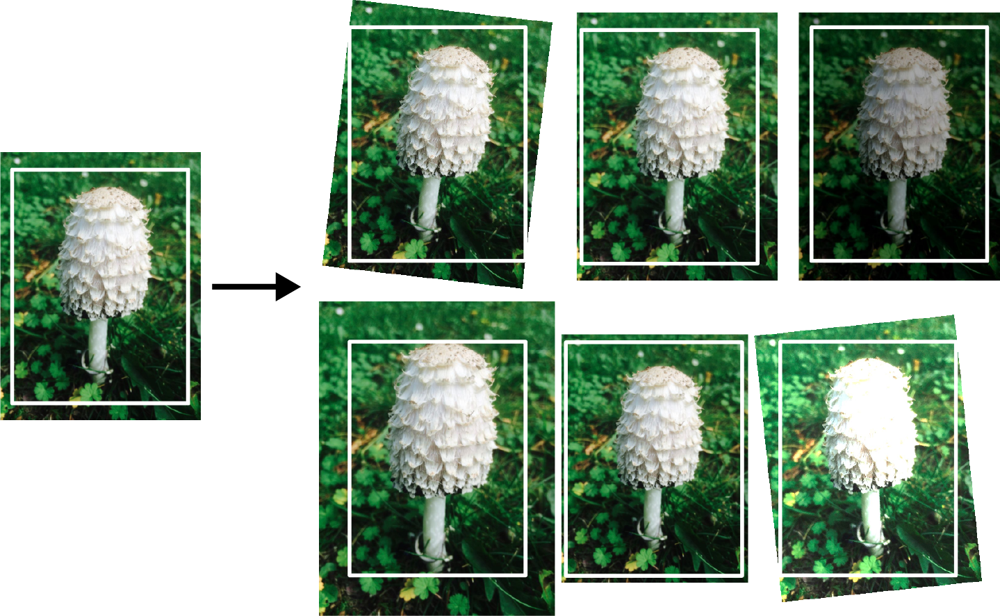

裁切、翻轉或顏色變化應保留標籤語意；驗證與測試採固定前處理。

<!-- 來源／講者提示：書本 Ch.12，PDF 23，圖 12-13。此圖用於機制解說，不代表課堂重跑結果。 -->

<!-- Notebook 對照：程式 14-07；完整對照見本章 ipynb 開頭。圖例與小型實驗的資料、評估方式及適用範圍各自標示。 -->

---
<!-- _class: activity -->
## 增強的標籤檢查

| 任務 | 水平翻轉通常可行？ |
| --- | --- |
| 貓狗分類 | 通常可，但要看資料 |
| 文字或數字辨識 | 可能改變字形與答案 |
| 物件定位 | 可以，但框座標也要變 |

活動：為醫學左右側判讀設計增強規則，說明哪些變換需排除。

<!-- 來源／講者提示：書本 Ch.12，PDF pp.22–23；自編教學判斷題，需依實際標註定義。 -->

<!-- Notebook 對照：程式 14-07；完整對照見本章 ipynb 開頭。 -->

---
<!-- _class: figure -->
## Inception 的平行分支

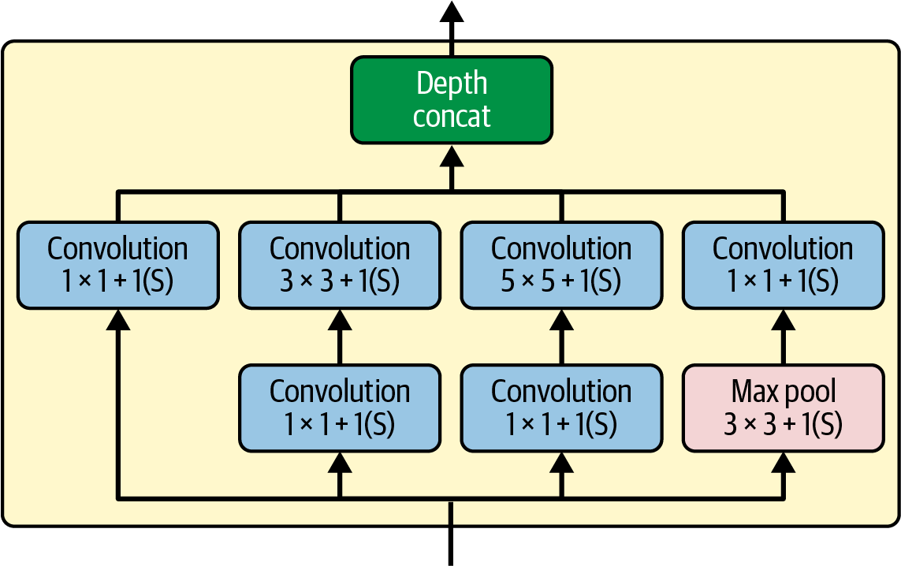

不同卷積核與池化分支擷取不同尺度；1×1 卷積可先調整通道數。

<!-- 來源／講者提示：書本 Ch.12，PDF 24，圖 12-14。此圖用於機制解說，不代表課堂重跑結果。 -->

<!-- Notebook 對照：程式 14-06；完整對照見本章 ipynb 開頭。圖例與小型實驗的資料、評估方式及適用範圍各自標示。 -->

---
## 1×1 卷積的計算量例子

在同一空間尺寸上，把 256 通道變成 128 通道：

| 作法（忽略 bias） | 每位置乘加項數 |
| --- | --- |
| 直接 3×3 卷積 | $3×3×256×128=294,912$ |
| 1×1 降至 32，再 3×3 | $256×32+3×3×32×128=45,056$ |

瓶頸層降低成本，也限制中間表示的寬度。

<!-- 來源／講者提示：書本 Ch.12，PDF pp.24–27；自編計算。 -->

<!-- Notebook 對照：程式 14-06；完整對照見本章 ipynb 開頭。 -->

---
<!-- _class: figure -->
## Residual learning

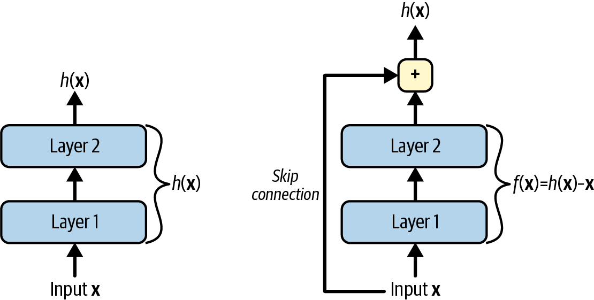

殘差分支學 $F(x)$，輸出為 $x+F(x)$，讓訊息和梯度能沿捷徑傳遞。

<!-- 來源／講者提示：書本 Ch.12，PDF 28，圖 12-16。此圖用於機制解說，不代表課堂重跑結果。 -->

<!-- Notebook 對照：程式 14-06；完整對照見本章 ipynb 開頭。圖例與小型實驗的資料、評估方式及適用範圍各自標示。 -->

---
## 殘差相加的尺寸條件

- 高度、寬度與通道數都要一致才能逐元素相加。
- stride 改變尺寸時，捷徑也要配合下採樣。
- 通道不同時，可用 1×1 projection。

讀碼：作者 `ResidualUnit` 的使用方式何時會進入 projection 分支？

<!-- 來源／講者提示：書本 Ch.12，PDF pp.28–31、41–42；作者Cell74僅檢查stride>1，其ResNet34呼叫設計在改通道時同時改stride；任意重用類別時須另檢查通道。 -->

<!-- Notebook 對照：程式 14-06；完整對照見本章 ipynb 開頭。 -->

---
<!-- _class: small -->
## 殘差連接：一般化的尺寸判斷

```python
# __init__ 內的捷徑分支；主分支須產生同樣的輸出尺寸
if stride != 1 or in_channels != out_channels:
    skip = nn.Conv2d(in_channels, out_channels, 1,
                     stride=stride, bias=False)
else:
    skip = nn.Identity()
# forward: return torch.relu(main(X) + skip(X))
```

額外檢查通道數，避免將類別移用到其他架構時相加失敗。

<!-- 來源／講者提示：書本 Ch.12，PDF pp.41–42；程式依作者 12_deep_computer_vision_with_cnns.ipynb Cell 74（教學改寫） 節錄或教學改寫，非完整獨立訓練腳本。 -->

<!-- Notebook 對照：程式 14-06；完整對照見本章 ipynb 開頭。 -->

---
<!-- _class: figure -->
## Depthwise separable convolution

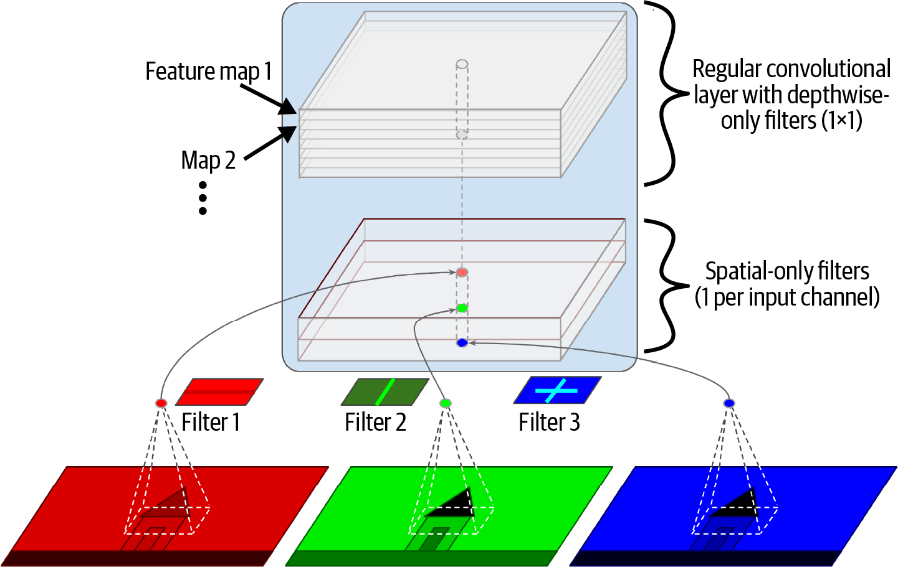

先逐通道做空間卷積，再用 1×1 卷積混合通道；兩部分分工。

<!-- 來源／講者提示：書本 Ch.12，PDF 32，圖 12-20。此圖用於機制解說，不代表課堂重跑結果。 -->

<!-- Notebook 對照：程式 14-06；完整對照見本章 ipynb 開頭。圖例與小型實驗的資料、評估方式及適用範圍各自標示。 -->

---
## 一般卷積與可分離卷積

忽略 bias，$K=3,C_{in}=32,C_{out}=64$。

| 作法 | 參數量 |
| --- | --- |
| 一般卷積 | $3²×32×64=18,432$ |
| Depthwise + pointwise | $3²×32+32×64=2,336$ |

參數較少不代表所有硬體都同倍加速，仍須量測延遲。

<!-- 來源／講者提示：書本 Ch.12，PDF pp.31–33；自編計算，補充Xception與MobileNet。 -->

<!-- Notebook 對照：程式 14-06；完整對照見本章 ipynb 開頭。 -->

---
<!-- _class: figure -->
## Squeeze-and-Excitation

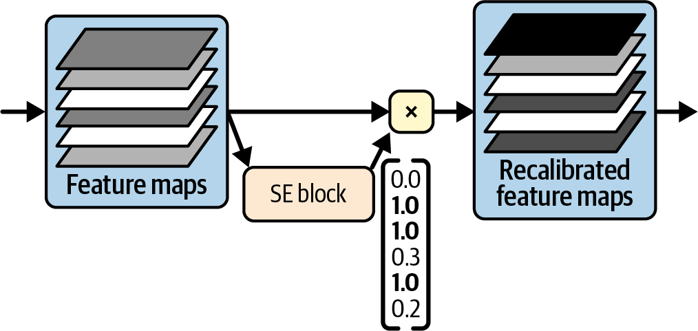

用全域資訊估計每個通道的重要程度，再調整特徵圖的強弱。

<!-- 來源／講者提示：書本 Ch.12，PDF 34，圖 12-22。此圖用於機制解說，不代表課堂重跑結果。 -->

<!-- Notebook 對照：程式 14-06；完整對照見本章 ipynb 開頭。圖例與小型實驗的資料、評估方式及適用範圍各自標示。 -->

---
## 其他 CNN 架構的設計焦點

| 架構 | 重點 |
| --- | --- |
| VGG | 重複小卷積核，架構規律但模型可能很大 |
| DenseNet | 連接先前多層特徵，增加特徵重用 |
| MobileNet／EfficientNet | 考慮運算、寬度、深度與解析度 |
| ConvNeXt | 以現代訓練與架構設計改良CNN |

<!-- 來源／講者提示：書本 Ch.12，PDF pp.35–38；作概念比較，不當作即時排行榜。 -->

<!-- Notebook 對照：程式 14-06；完整對照見本章 ipynb 開頭。 -->

---
<!-- _class: activity -->
## 課堂活動：小影像分類設計

兩人一組完成下列練習：

1. 寫出輸入、兩個卷積層與分類頭的形狀。
2. 算第一層參數量，提出一個合理資料增強。
3. 指定基準模型與評估資料切分。
4. 交付一張尺寸表與一項可能失敗的情況。

<!-- 來源／講者提示：自編活動，對應Ch.12卷積、增強與架構章節。 -->

<!-- Notebook 對照：程式 14-06、14-07；完整對照見本章 ipynb 開頭。 -->

---
## 離堂檢核

1. 為何輸出通道數不等於輸入 RGB 的 3？
2. 32×32 輸入、3×3 kernel、stride=2、padding=1，輸出多大？
3. 殘差相加時，哪些軸必須一致？
4. 池化對分類與定位有何不同影響？

<!-- 來源／講者提示：自編檢核。答案：濾波器數可設計；16×16；非batch的C/H/W；分類可容忍局部位移但定位需要空間細節。 -->

<!-- Notebook 對照：程式 14-06；完整對照見本章 ipynb 開頭。 -->

---
<!-- _class: small -->
## 課後程式與延伸閱讀

- 作者第 12 章 Notebook（`12_deep_computer_vision_with_cnns.ipynb`）：先執行 Setup，再定位本課指定區段。
- 本章 Notebook：比較全連接與卷積的感受野、參數量與輸出形狀。

執行前確認資料、套件與運算資源。

<!-- 來源／講者提示：來源：作者 notebook 固定 commit 47eba45aacc85feae51ba7db68dd1ca66cb25e0a；Cell 編號從 0 起算。範例片段以讀碼為主，完整依賴見 notebook。 -->

<!-- Notebook 對照：程式 14-06；完整對照見本章 ipynb 開頭。 -->

---
<!-- _class: small -->
## Notebook 導讀：可執行的機制與驗收

| 實驗 | 驗收證據 |
|---|---|
| NCHW 多通道互相關 | 手算相同；各通道貢獻相加 |
| Padding、ReLU、pooling | 尺寸、特徵圖與平移差異 |
| Inception／Residual／Depthwise／SE | 串接軸、投影尺寸、參數量、通道門值 |
| 合成影像增強 | 影像前後與標籤語意檢查 |

NumPy 實作驗證構件前向與公式；大型架構圖用於設計閱讀。
未訓練構件的分類損失只檢查計算流程，不作模型成效。

<!-- 講者提示：NumPy CPU 小型實驗用來核對公式、形狀與流程，不代表完整模型成效。 -->

<!-- Notebook 對照：程式 14-05、14-06、14-07；完整對照見本章 ipynb 開頭。 -->
