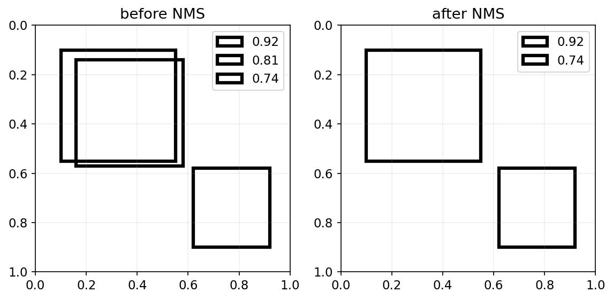
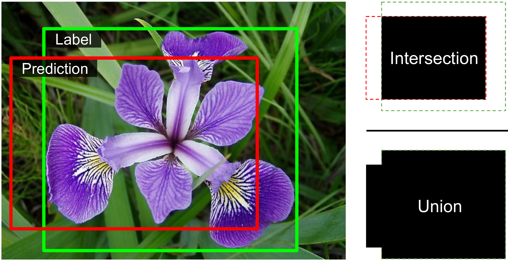
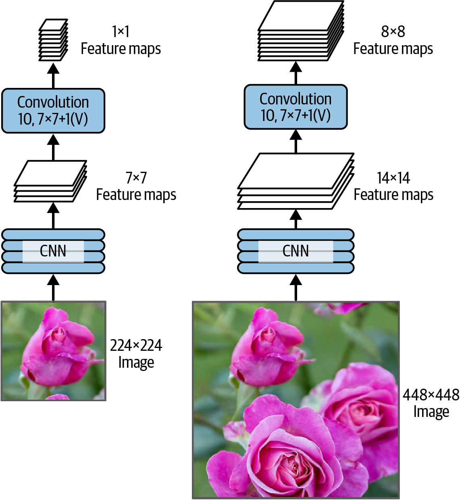
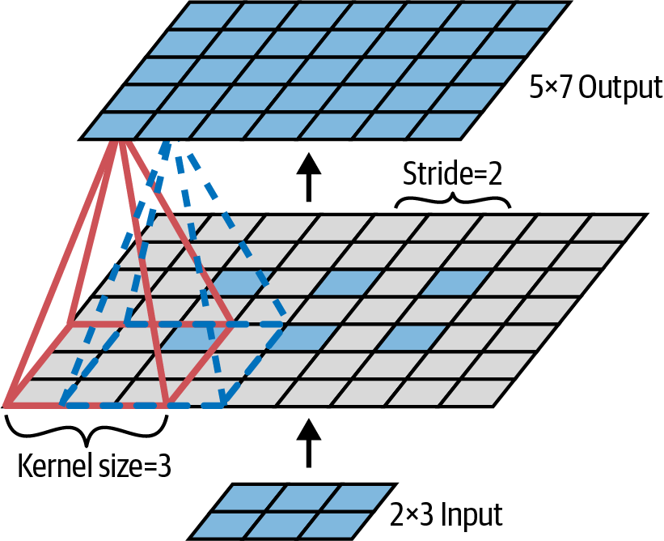
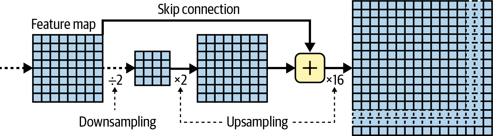

<!-- _class: cover -->
# 電腦視覺：遷移學習與偵測分割

## 預訓練、定位、偵測、追蹤與分割

書本第 12 章

建議 180 分鐘，含活動與休息

<!-- 來源／講者提示：自編章節導入 -->

---
## 學習成果與課堂安排

- 0–50 分：模型選擇、記憶體與預訓練。
- 60–110 分：定位、IoU、偵測與 mAP。
- 120–180 分：追蹤、分割與實作設計。

成果：能依輸出需求選任務，設計公平的模型比較。

<!-- notebook-companion-link -->
> 💻 **配套 Notebook**：`programs/notebooks/15_電腦視覺_遷移學習與偵測分割.ipynb`。程式片段、實際圖表與表格可由此檔重現。

<!-- 來源／講者提示：書本 Ch.12，PDF pp.37–66；兩次10分鐘休息。 -->

---
<!-- notebook-result-slide -->
<!-- _class: small -->
## 程式實驗與實際輸出

<div class="columns wide-left">
<div>

```python
for i in argsort(scores)[::-1]:
    if all(iou(boxes[i], boxes[j]) < .5 for j in keep): keep.append(i)
```

**觀察**：NMS 保留高分框並移除與它高度重疊的候選；閾值本身是任務設定。

參考程式：`programs/notebooks/15_電腦視覺_遷移學習與偵測分割.ipynb`

</div>
<div>



</div>
</div>

<!-- 講者提示：程式與圖均來自 programs/notebooks/15_電腦視覺_遷移學習與偵測分割.ipynb 的已執行輸出；來源與改編界線見 Notebook。 -->
---
## 影像任務的輸出差異

| 任務 | 模型要輸出什麼 |
| --- | --- |
| 分類 | 整張圖的類別 |
| 分類與定位 | 類別與一個框 |
| 物件偵測 | 多個框、類別、信心分數 |
| 物件追蹤 | 跨影格維持物件ID |
| 語意分割 | 每個像素的類別 |

<!-- 來源／講者提示：書本 Ch.12，PDF pp.48–64 -->

---
## 模型選擇的比較表

| 條件 | 應比較的項目 |
| --- | --- |
| 行動裝置 | 延遲、模型大小、耗電 |
| 少量標註 | 預訓練是否適合目標領域 |
| 大量小物件 | 解析度與特徵圖細節 |
| 批次服務 | 吞吐量與峰值記憶體 |

書中 TorchVision 表格是教材版本的比較，課堂不當作最新排行榜。

<!-- 來源／講者提示：書本 Ch.12，PDF pp.37–40，表12-3 -->

---
## 推論與訓練的記憶體

- 權重以外，還有中間 activation、梯度與 optimizer 狀態。
- 訓練通常需保留反向傳播所需的中間量。
- 輸入解析度、batch size 與特徵通道數都影響記憶體。
- 可逆網路 RevNet 嘗試重建部分 activation，以額外運算換空間。

<!-- 來源／講者提示：書本 Ch.12，PDF pp.38–41 -->

---
<!-- _class: small -->
## 預訓練模型與前處理成對使用

```python
import torchvision
weights = torchvision.models.ConvNeXt_Base_Weights.IMAGENET1K_V1
model = torchvision.models.convnext_base(weights=weights)
preprocess = weights.transforms()
model.eval()
X = preprocess(images)  # images：已載入且格式符合前處理的影像
```

尺寸、裁切與標準化須符合權重設定；不要套用另一模型的平均值。

作者程式：Cells 78、82（`12_deep_computer_vision_with_cnns.ipynb`）

<!-- 來源／講者提示：書本 Ch.12，PDF pp.42–44；程式依作者 12_deep_computer_vision_with_cnns.ipynb Cells 78、82 節錄或教學改寫，非完整獨立訓練腳本。 -->

---
## 預訓練類別與目標類別

```python
class_names = weights.meta["categories"]
```

- ImageNet 的標籤集合不會自動等於本次課程的類別。
- 預測「最像哪個既有類別」不代表模型能辨認新的類別。
- 修改分類頭後，至少要訓練新分類頭。

<!-- 來源／講者提示：書本 Ch.12，PDF pp.42–48；作者Cells78–104。 -->

---
<!-- _class: small -->
## 遷移學習：凍結主幹與更換分類頭

```python
for p in model.parameters():
    p.requires_grad = False
in_features = model.classifier[2].in_features
model.classifier[2] = nn.Linear(in_features, 102)
optimizer = torch.optim.AdamW(
    model.classifier[2].parameters(), lr=1e-3)
```

沿用前份 `from torch import nn`；此例對應 Flowers102。先訓練頭，再評估是否解凍部分主幹。

作者程式：Cells 92–104（`12_deep_computer_vision_with_cnns.ipynb`）

<!-- 來源／講者提示：書本 Ch.12，PDF pp.44–48；程式依作者 12_deep_computer_vision_with_cnns.ipynb Cells 92–104 節錄或教學改寫，非完整獨立訓練腳本。 -->

---
## 凍結參數與 train／eval

`requires_grad=False` 只停止該參數的梯度計算。

- `train()`／`eval()` 控制 Dropout 與 BatchNorm 的行為。
- 主幹若含 BatchNorm，凍結權重後仍可能更新 running statistics。
- 微調時分開決定：哪些參數更新？哪些模組採推論行為？

驗證集用於調整策略，測試集留到最後一次評估。

<!-- 來源／講者提示：書本 Ch.12，PDF pp.44–48；銜接Ch.11遷移學習。 -->

---
## 定位需要額外的監督訊號

同一主幹可以接兩個頭：分類 logits 與四個框座標。

$$L=L_{class}+\lambda L_{box}$$

先約定框格式，例如 $(x_{min},y_{min},x_{max},y_{max})$。

框的單位可為像素或正規化座標，預測、標註與評估必須一致。

<!-- 來源／講者提示：書本 Ch.12，PDF pp.48–51；作者Cell106 FlowerLocator。 -->

---
<!-- _class: figure -->
## IoU：框的交集與聯集



IoU 衡量預測框與真實框重疊程度；類別答對仍可能定位不準。

<!-- 來源／講者提示：書本 Ch.12，PDF 51，圖 12-24。圖為教材原圖，非本次實驗結果。 -->

---
<!-- _class: activity -->
## IoU 手算

兩框面積各為 100，交集面積為 60。

$$IoU=\frac{60}{100+100-60}=\frac{3}{7}\approx0.429$$

若評估要求 IoU ≥ 0.5，這個框符合定位條件嗎？

答案：不符合。實際偵測還需要類別正確與一對一配對。

<!-- 來源／講者提示：自編數例；Ch.12 PDF p.51。 -->

---
## 滑動視窗的重複運算

在不同位置與尺度裁切影像，再逐一分類，會重複計算大量重疊區域。

全卷積網路讓整張圖共享特徵計算。

偵測器還必須學會框的位置與大小，不能只把分類結果貼在視窗中心。

<!-- 來源／講者提示：書本 Ch.12，PDF pp.52–56 -->

---
<!-- _class: figure -->
## 全卷積網路處理不同尺寸



把全連接運算轉成等效卷積後，可在較大輸入上得到空間分布的輸出。

<!-- 來源／講者提示：書本 Ch.12，PDF 56，圖 12-26。圖為教材原圖，非本次實驗結果。 -->

---
## YOLO 的偵測流程

- 單次前向傳播產生一批候選框、類別與分數。
- 依實作進行信心篩選與重複框處理。
- 常見 NMS 保留高分框，移除高度重疊的同類候選。

YOLO 有多代架構；本課依書中與作者 Notebook 所示版本閱讀。

<!-- 來源／講者提示：書本 Ch.12，PDF pp.56–60；不把某一代的anchor或NMS設計推成所有版本共通。 -->

---
<!-- _class: activity -->
## NMS 手算

同一類別的框 A、B、C，分數為 0.9、0.8、0.7。

| 框對 | IoU |
| --- | --- |
| A、B | 0.8 |
| A、C | 0.1 |

設 NMS 閾值 0.5：先保留 A，再移除 B，保留 C。

擁擠場景中，兩個不同物件也可能高度重疊。

<!-- 來源／講者提示：自編例；Ch.12 PDF pp.56–60。 -->

---
## Precision、Recall 與 AP

- 先固定 IoU 閾值與配對規則。
- 降低信心門檻，通常會收進更多預測。
- Precision 看預測中有多少正確，Recall 看真物件找回多少。
- AP 概括一個類別的 precision–recall 曲線。

同一個真物件的重複框不能各算一次正確偵測。

<!-- 來源／講者提示：書本 Ch.12，PDF pp.58–60；Notebook Extra Material mAP。 -->

---
## mAP 的定義要寫清楚

| 指標寫法 | 比較範圍 |
| --- | --- |
| AP@0.5 | IoU=0.5 下某類別的 AP |
| mAP@0.5 | 在類別間平均 |
| mAP@0.5:0.95 | 再跨一組 IoU 閾值平均 |

報告時同時列資料集、類別集合、IoU 範圍與評估程式。

<!-- 來源／講者提示：書本 Ch.12，PDF pp.58–60；不同基準可能也對尺度與max detections有不同設定。 -->

---
## 偵測程式導讀

作者 Notebook：Object Detection（`12_deep_computer_vision_with_cnns.ipynb`）

定位 Cells 125–131：模型載入、影像輸入、結果解讀。

讀碼任務：找出框座標、類別 ID 與信心分數，說明各自對應什麼。

完整推論需下載套件與權重；課堂可先閱讀輸出結構。

<!-- 來源／講者提示：程式：Ch12作者Notebook Cells125–131；未聲稱本次執行。 -->

---
## 物件追蹤與身分切換

偵測回答「這一影格有哪些物件」，追蹤還要把不同影格的物件配對。

常用線索：運動預測、框重疊、外觀特徵。

遮擋或相似外觀可能造成 ID switch。

活動：兩人交錯行走時，僅用最近中心距離會出現什麼問題？

<!-- 來源／講者提示：書本 Ch.12，PDF pp.60–61；作者Object Tracking Cells132–133。 -->

---
<!-- _class: figure -->
## 語意分割的像素標籤


輸出是一張類別圖；同一類的不同個體，在語意分割中可能共用標籤。

<!-- 來源／講者提示：書本 Ch.12，PDF 62，圖 12-27。圖為教材原圖，非本次實驗結果。 -->

---
## 語意、實例與全景分割

| 任務 | 人物 A 與人物 B | 背景區域 |
| --- | --- | --- |
| 語意分割 | 同為「人」 | 像素類別 |
| 實例分割 | 各自有 ID | 常只處理物件 |
| 全景分割 | 各自有 ID | 也有完整區域類別 |

先依標註需求選任務，才選模型與指標。

<!-- 來源／講者提示：書本 Ch.12，PDF pp.61–64；全景分割為任務對照補充。 -->

---
<!-- _class: figure -->
## 轉置卷積與上採樣



轉置卷積可以學習放大特徵圖；它不是一般卷積的數學反函數。

<!-- 來源／講者提示：書本 Ch.12，PDF 63，圖 12-28。圖為教材原圖，非本次實驗結果。 -->

---
<!-- _class: figure -->
## 跳接保留細節



高層語意與低層空間資訊一起使用，有助於恢復邊界與細小區域。

<!-- 來源／講者提示：書本 Ch.12，PDF 64，圖 12-29。圖為教材原圖，非本次實驗結果。 -->

---
## 其他卷積層的用途

| 類型 | 主要用途 |
| --- | --- |
| Conv1d | 時間或一維訊號 |
| Conv3d | 影片、體積資料 |
| Dilated convolution | 增加感受野而不直接下採樣 |
| Grouped convolution | 控制通道之間的連接 |

維度選擇依資料結構，不只依資料是否能轉成矩陣。

<!-- 來源／講者提示：書本 Ch.12，PDF pp.63–64 -->

---
<!-- _class: activity -->
## 課堂活動：校園垃圾辨識

20 分鐘：分類、偵測或分割，哪個才符合需求？

1. 若要統計垃圾件數，需要什麼輸出？
2. 若要估計垃圾覆蓋面積，需要什麼標註？
3. 如何依拍攝日期或場景切分，避免相似照片洩漏？
4. 交付任務定義、標註樣例與兩項評估指標。

<!-- 來源／講者提示：自編整合活動。 -->

---
## 離堂檢核

- 預訓練權重為何要搭配自己的 transforms？
- IoU 很高是否代表類別一定正確？
- 重複框為何會影響 precision？
- 語意分割能否直接回答「有幾個人」？

<!-- 來源／講者提示：自編檢核。答案：輸入分布一致；否；重複框可能為FP；不一定，需實例區分。 -->

---
<!-- _class: small -->
## 課後程式與延伸閱讀

- 作者第 12 章 Notebook（`12_deep_computer_vision_with_cnns.ipynb`）：先執行 Setup，再定位本課指定區段。
- 舊稿 `11_Image Captioning.pptx` s.6–16：CNN encoder 與遷移學習；圖片描述延伸至第 16 章。

程式來源依教材核對版本標示；執行前確認資料、套件與運算資源。

<!-- 來源／講者提示：來源：作者 notebook 固定 commit 47eba45aacc85feae51ba7db68dd1ca66cb25e0a；Cell 編號從 0 起算。範例片段以讀碼為主，完整依賴見 notebook。 -->
