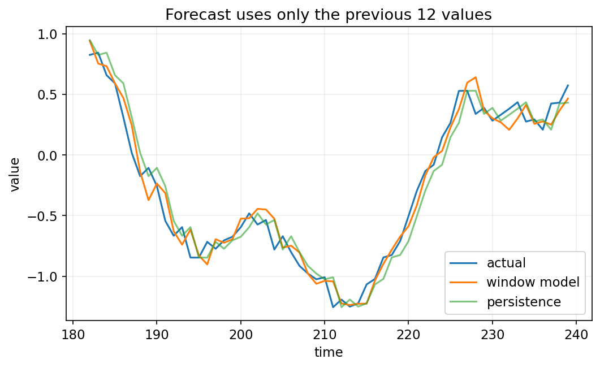
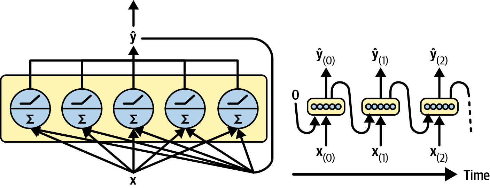
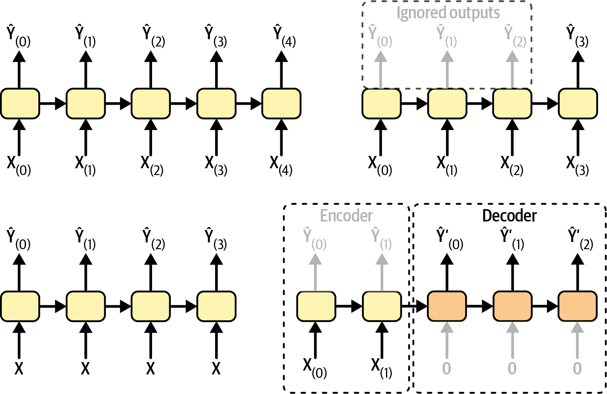
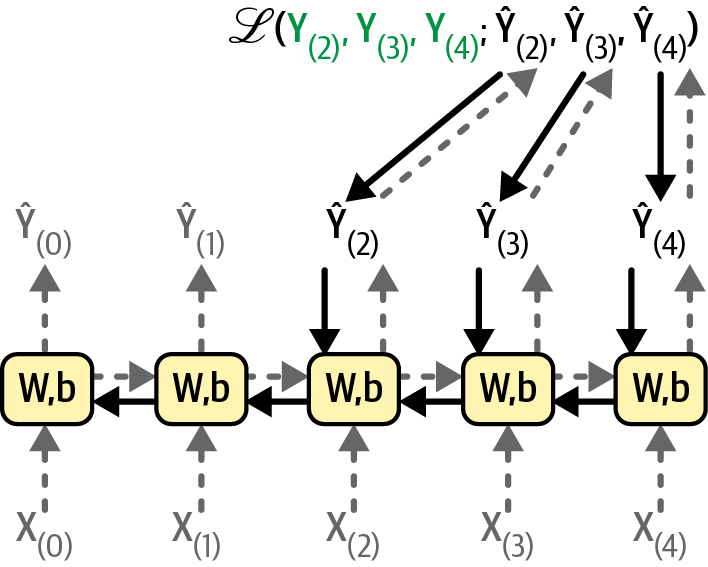
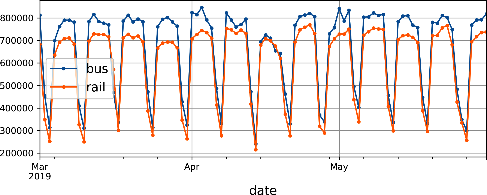
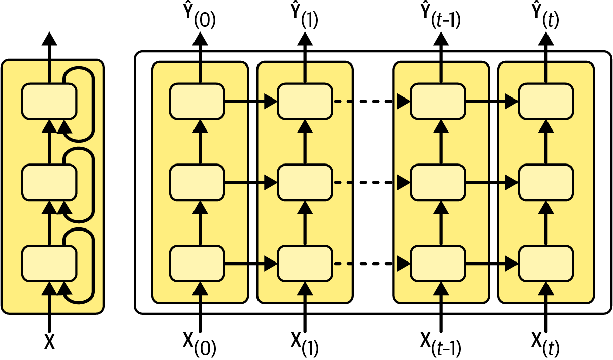
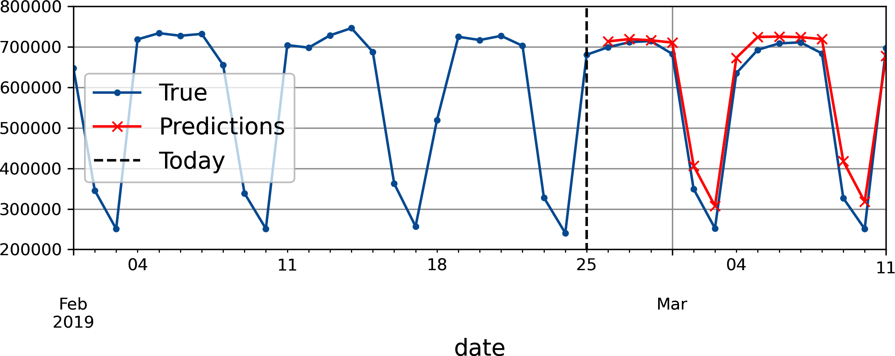
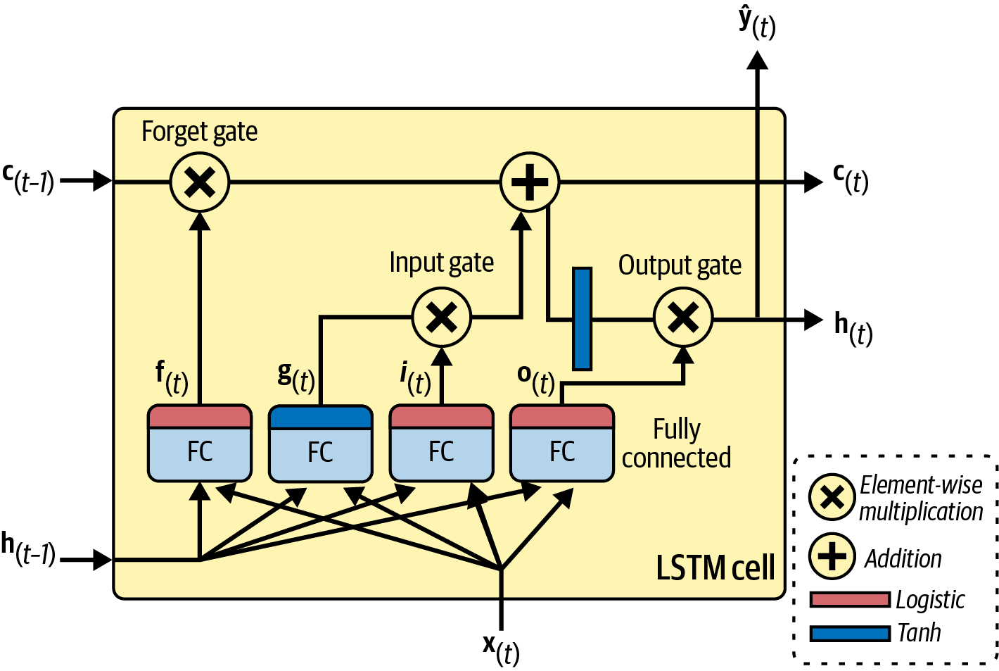
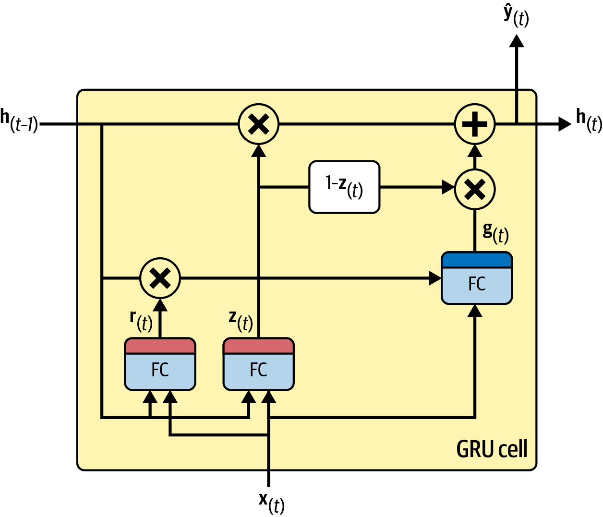
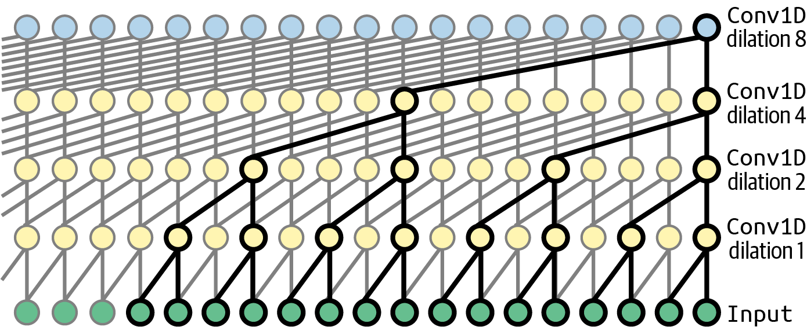

<!-- _class: cover -->
# 序列模型：RNN 與時間序列預測

## 循環狀態、LSTM、GRU 與一維卷積

書本第 13 章

建議 180 分鐘，含活動與休息

<!-- 來源／講者提示：自編章節導入 -->

---
## 學習成果與課堂安排

- 0–50 分：循環狀態、展開與時間序列基準。
- 60–110 分：資料視窗、RNN 與多步預測。
- 120–180 分：LSTM、GRU、因果卷積與實驗設計。

成果：能建立不偷看未來的預測流程，並追蹤序列張量尺寸。

<!-- notebook-companion-link -->
> 💻 **配套 Notebook**：`programs/notebooks/16_序列模型_RNN與時間序列預測.ipynb`。程式片段、實際圖表與表格可由此檔重現。

<!-- 來源／講者提示：書本 Ch.13，PDF pp.1–42；兩次10分鐘休息。 -->

---
<!-- notebook-result-slide -->
<!-- _class: small -->
## 程式實驗與實際輸出

<div class="columns wide-left">
<div>

```python
X[t] = series[t-12:t]
y[t] = series[t]
```

**觀察**：視窗模型只讀過去 12 點；圖同時保留 persistence 基準，避免只看單一模型。

參考程式：`programs/notebooks/16_序列模型_RNN與時間序列預測.ipynb`

</div>
<div>



</div>
</div>

<!-- 講者提示：程式與圖均來自 programs/notebooks/16_序列模型_RNN與時間序列預測.ipynb 的已執行輸出；來源與改編界線見 Notebook。 -->
---
<!-- _class: figure -->
## 循環層沿時間重用參數



同一組權重處理每個時間步，隱藏狀態攜帶先前資訊。

<!-- 來源／講者提示：書本 Ch.13，PDF 3，圖 13-2。圖為教材原圖，非本次實驗結果。 -->

---
## RNN 的狀態更新

$$h_t=\tanh(W_xx_t+W_hh_{t-1}+b)$$

$x_t$：目前輸入；$h_{t-1}$：前一步狀態。

序列較長不會直接增加這層的參數量，卻會增加展開後的計算與記憶體。

<!-- 來源／講者提示：書本 Ch.13，PDF pp.2–5 -->

---
<!-- _class: activity -->
## 循環狀態手算

設純量 $h_0=0,W_x=1,W_h=0.5,b=0$，輸入為 $[1,0]$。

$$h_1=\tanh(1)\approx0.762$$
$$h_2=\tanh(0+0.5×0.762)\approx0.363$$

第二步輸入為 0，為何狀態仍不為 0？

<!-- 來源／講者提示：自編數例；先前輸入透過隱藏狀態影響結果。 -->

---
<!-- _class: figure -->
## 四種序列輸入與輸出



情感分類、逐步預測、音樂生成與翻譯，需要不同的輸出對齊方式。

<!-- 來源／講者提示：書本 Ch.13，PDF 6，圖 13-4。圖為教材原圖，非本次實驗結果。 -->

---
## Hidden state 與 output

- 簡單 RNN 可把隱藏狀態直接當逐步輸出。
- LSTM 同時維持 hidden state 與 cell state。
- sequence-to-vector 常取最後有效時間步，再接任務頭。
- 變長序列的「最後一步」要排除 padding。

<!-- 來源／講者提示：書本 Ch.13，PDF pp.4–7 -->

---
<!-- _class: figure -->
## Backpropagation through time



把時間步展開成計算圖；同一參數收到不同時間步的梯度並加總。

<!-- 來源／講者提示：書本 Ch.13，PDF 7，圖 13-5。圖為教材原圖，非本次實驗結果。 -->

---
<!-- _class: figure -->
## 時間序列的季節性



芝加哥運量有日期相關的規律；模型應與簡單的週期性基準比較。

<!-- 來源／講者提示：書本 Ch.13，PDF 9，圖 13-6。圖為教材原圖，非本次實驗結果。 -->

---
## 先建立樸素基準

| 方法 | 明天的預測 |
| --- | --- |
| Persistence | 今天的值 |
| 季節性 naive | 上週同一天的值 |
| 移動平均 | 最近一段時間平均 |

畫原始序列、落後 7 天的序列與差值，再決定模型需要學什麼。

<!-- 來源／講者提示：書本 Ch.13，PDF pp.8–13 -->

---
## ARMA、ARIMA 與 SARIMA

| 成分 | 作用 |
| --- | --- |
| AR | 使用過去的觀測值 |
| MA | 使用過去的預測誤差 |
| I | 以差分處理部分非平穩性 |
| Seasonal | 描述固定週期的結構 |

這裡 MA 指移動平均模型的誤差項，不等於直接做滑動平均平滑。

<!-- 來源／講者提示：書本 Ch.13，PDF pp.13–16 -->

---
## 時間切分與洩漏

先依時間切出訓練、驗證與測試，再建立可使用的歷史視窗。

- 標準化只用訓練期估計統計量。
- 預測當下無法知道的特徵，不可出現在輸入。
- 回測每個時間點，只使用當時已取得的資料。

驗證窗可以引用邊界前已知的歷史，但標籤必須落在驗證期。

<!-- 來源／講者提示：書本 Ch.13，PDF pp.16–18、23–29；自編資料洩漏檢核。 -->

---
<!-- _class: small -->
## 單步預測的滑動視窗

```python
def make_window(series, i, window_length):
    end = i + window_length
    X = series[i:end]
    y = series[end]
    return X, y
# 例：series 有 10 筆，window_length=4，可建 6 筆樣本
```

輸入 `[時間, 特徵]`；DataLoader 加上 batch 軸後為 `[B,T,F]`。

作者程式：Cell 48（簡化）（`13_processing_sequences_using_rnns_and_cnns.ipynb`）

<!-- 來源／講者提示：書本 Ch.13，PDF pp.16–18；程式依作者 13_processing_sequences_using_rnns_and_cnns.ipynb Cell 48（簡化） 節錄或教學改寫，非完整獨立訓練腳本。 -->

---
## 線性基準與公平比較

把過去 56 天攤平後接一個線性層，也能產生預測。

比較時固定：資料區間、輸入視窗、預測範圍、評估單位。

若原始資料除以一百萬，MAE 也在縮放後單位；報告時換回人次。

<!-- 來源／講者提示：書本 Ch.13，PDF pp.18–20；作者Cell52。 -->

---
<!-- _class: small -->
## RNN 的張量形狀

```python
import torch
from torch import nn
X = torch.randn(8, 56, 1)
rnn = nn.RNN(1, 32, batch_first=True)
outputs, h_n = rnn(X)
head = nn.Linear(32, 1)
y_pred = head(outputs[:, -1])
```

outputs `[8,56,32]`，h_n `[1,8,32]`，預測 `[8,1]`。

作者程式：Cells 58–64（改寫）（`13_processing_sequences_using_rnns_and_cnns.ipynb`）

<!-- 來源／講者提示：書本 Ch.13，PDF pp.19–23；程式依作者 13_processing_sequences_using_rnns_and_cnns.ipynb Cells 58–64（改寫） 節錄或教學改寫，非完整獨立訓練腳本。 -->

---
<!-- _class: figure -->
## 深層 RNN 的兩種深度



沿時間展開與堆疊循環層是不同方向；增加層數後，每一步的運算也增加。

<!-- 來源／講者提示：書本 Ch.13，PDF 22，圖 13-10。圖為教材原圖，非本次實驗結果。 -->

---
## 多變量預測的可用性

輸入可以包含公車運量、鐵路運量與日曆資訊。

| 特徵 | 預測明日時通常可得？ |
| --- | --- |
| 明天星期幾 | 可以 |
| 明天真實運量 | 不可以 |
| 明天天氣 | 可用預報，不能偷用事後實測 |

新增特徵後仍以相同的預測日期做比較。

<!-- 來源／講者提示：書本 Ch.13，PDF pp.23–24；自編可用性例。 -->

---
<!-- _class: figure -->
## 遞迴式多步預測



先預測下一步，再把預測值放回視窗；誤差可能一路傳播。

<!-- 來源／講者提示：書本 Ch.13，PDF 25，圖 13-11。圖為教材原圖，非本次實驗結果。 -->

---
## 多步預測的三種設計

| 方式 | 輸出 | 需要注意 |
| --- | --- | --- |
| 遞迴 | 反覆產生1步 | 誤差累積 |
| 直接多輸出 | 一次產生H步 | 各步的難度不同 |
| Seq2seq | 每個時間步都產生未來H步 | 標籤對齊與因果性 |

<!-- 來源／講者提示：書本 Ch.13，PDF pp.24–29 -->

---
<!-- _class: small -->
## 遞迴預測的時間軸

```python
# model(X) 輸出 [B,1]；X 是 [B,T,1]
model.eval()
with torch.no_grad():
    for _ in range(14):
        y_one = model(X)
        X = torch.cat([X, y_one.unsqueeze(1)], dim=1)
predictions = X[:, -14:, 0]
```

`unsqueeze(1)` 加的是時間軸；改成 0 會把 batch 軸弄錯。

作者程式：Cell 80（`13_processing_sequences_using_rnns_and_cnns.ipynb`）

<!-- 來源／講者提示：書本 Ch.13，PDF pp.24–26；程式依作者 13_processing_sequences_using_rnns_and_cnns.ipynb Cell 80 節錄或教學改寫，非完整獨立訓練腳本。 -->

---
<!-- _class: activity -->
## Seq2seq 預測的標籤對齊

每個輸入時間步，都輸出接下來 H 步的預測。

| 輸入位置 | 當步目標（H=3） |
| --- | --- |
| t=0 | 時間1、2、3 |
| t=1 | 時間2、3、4 |
| t=2 | 時間3、4、5 |

輸出可為 `[B,T,3]`；第 t 步的狀態仍只能使用時間≤t的資訊。

<!-- 來源／講者提示：書本 Ch.13，PDF pp.27–29；自編H=3對齊表，作者Cells87–102。 -->

---
## 評估多步預測

- 分別列出 horizon 1、7、14 的 MAE。
- 同時看逐日誤差與多個回測起點的平均。
- 真實值與預測值必須對齊同一日期。
- 整段平均較低，仍可能掩蓋尖峰或假日失敗。

<!-- 來源／講者提示：書本 Ch.13，PDF pp.24–29；自編評估規格。 -->

---
## 長序列訓練的困難

梯度反覆穿越時間步，可能消失或爆炸。

- Gradient clipping 限制過大的更新訊號。
- LayerNorm 協助控制每步表示的尺度。
- 截斷 BPTT 限制反向傳播長度，但也限制遠距信用分配。
- 記憶門控針對長期資訊保留提供較好的路徑。

<!-- 來源／講者提示：書本 Ch.13，PDF pp.29–32 -->

---
<!-- _class: figure -->
## LSTM 的記憶路徑



遺忘門、輸入門、輸出門控制 cell state 如何保留、更新與讀出。

<!-- 來源／講者提示：書本 Ch.13，PDF 32，圖 13-12。圖為教材原圖，非本次實驗結果。 -->

---
## LSTM 的核心更新

$$c_t=f_t\odot c_{t-1}+i_t\odot\widetilde c_t$$
$$h_t=o_t\odot\tanh(c_t)$$

門值在 0 到 1 之間；保留與更新可以逐座標調整。

LSTM 能改善長期學習，仍不保證任意長度都能記住。

<!-- 來源／講者提示：書本 Ch.13，PDF pp.31–35 -->

---
<!-- _class: activity -->
## LSTM 門值手算

設 $c_{t-1}=0.8,f_t=0.9,i_t=0.2,\widetilde c_t=-0.5$。

$$c_t=0.9×0.8+0.2×(-0.5)=0.62$$

若 $o_t=0.5$，$h_t=0.5\tanh(0.62)\approx0.276$。

比較把遺忘門改成 0 時會發生什麼事。

<!-- 來源／講者提示：自編門控數例。遺忘門0時c=-0.1。 -->

---
<!-- _class: figure -->
## GRU 的精簡門控



GRU 使用更新與重設機制，不另外維持一份獨立 cell state。

<!-- 來源／講者提示：書本 Ch.13，PDF 35，圖 13-13。圖為教材原圖，非本次實驗結果。 -->

---
<!-- _class: small -->
## RNN、LSTM、GRU 的介面差異

```python
lstm = nn.LSTM(3, 32, batch_first=True)
gru = nn.GRU(3, 32, batch_first=True)
X = torch.randn(8, 56, 3)
out_lstm, (h_n, c_n) = lstm(X)
out_gru, h_n_gru = gru(X)
```

LSTM 回傳 hidden 與 cell；兩者逐步輸出皆為 `[8,56,32]`。

作者程式：Cells 107、112（`13_processing_sequences_using_rnns_and_cnns.ipynb`）

<!-- 來源／講者提示：書本 Ch.13，PDF pp.31–36；程式依作者 13_processing_sequences_using_rnns_and_cnns.ipynb Cells 107、112 節錄或教學改寫，非完整獨立訓練腳本。 -->

---
## 一維卷積處理序列

Conv1d 在時間軸套用共享濾波器。

PyTorch 輸入通常為 `[B,C,T]`，與 RNN 的 `[B,T,F]` 不同。

因果預測只能使用現在與過去；置中的 padding 可能讓模型看到未來。

<!-- 來源／講者提示：書本 Ch.13，PDF pp.36–40 -->

---
<!-- _class: small -->
## 因果卷積只在左側補值

```python
import torch.nn.functional as F
class CausalConv1d(nn.Conv1d):
    def forward(self, X):
        left = (self.kernel_size[0] - 1) * self.dilation[0]
        return super().forward(F.pad(X, (left, 0)))
# 建構時 padding=0，避免再做對稱補值
```

用 dilation 增加感受野，仍須維持時間方向。

作者程式：Cell 123（`13_processing_sequences_using_rnns_and_cnns.ipynb`）

<!-- 來源／講者提示：書本 Ch.13，PDF pp.38–40；程式依作者 13_processing_sequences_using_rnns_and_cnns.ipynb Cell 123 節錄或教學改寫，非完整獨立訓練腳本。 -->

---
<!-- _class: figure -->
## WaveNet 的擴張卷積



逐層增加 dilation，讓有限層數涵蓋更長歷史；輸出仍維持因果性。

<!-- 來源／講者提示：書本 Ch.13，PDF 39，圖 13-14。圖為教材原圖，非本次實驗結果。 -->

---
<!-- _class: activity -->
## 課堂實作：兩週運量預測

20 分鐘規劃，完整訓練課後進行。

1. 建立週期性 naive、線性模型與一個 GRU。
2. 使用同一時間切分，預測未來 14 天。
3. 交付 horizon 誤差表與預測日期對齊示例。
4. 指出一個不應放入模型的未來特徵。

<!-- 來源／講者提示：自編實作；作者Exercises含雙運量預測、Bach音樂、QuickDraw與音訊分類，選讀不同任務對齊。 -->

---
## 離堂檢核

- hidden state 與模型參數有何不同？
- 為何 RNN 的輸入不能任意打亂時間順序？
- 遞迴預測為何可能越往後越差？
- 因果卷積應在哪一側 padding？

<!-- 來源／講者提示：自編檢核。參數跨樣本共用，state依序列而變；時間依賴；誤差回饋；左側。 -->

---
<!-- _class: small -->
## 課後程式與延伸閱讀

- 作者第 13 章 Notebook（`13_processing_sequences_using_rnns_and_cnns.ipynb`）：先執行 Setup，再定位本課指定區段。
- 舊稿 `08_Recurrent Neural Networks.pptx`：循環狀態、LSTM 與序列任務；文字部分留到下一份。

程式來源依教材核對版本標示；執行前確認資料、套件與運算資源。

<!-- 來源／講者提示：來源：作者 notebook 固定 commit 47eba45aacc85feae51ba7db68dd1ca66cb25e0a；Cell 編號從 0 起算。範例片段以讀碼為主，完整依賴見 notebook。 -->
