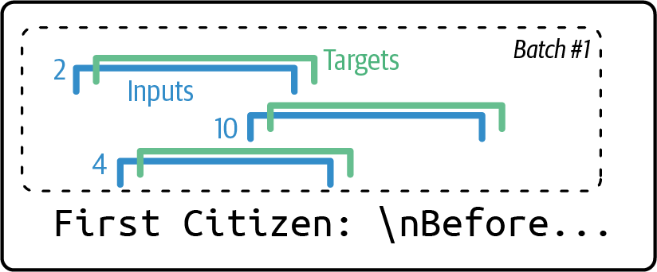
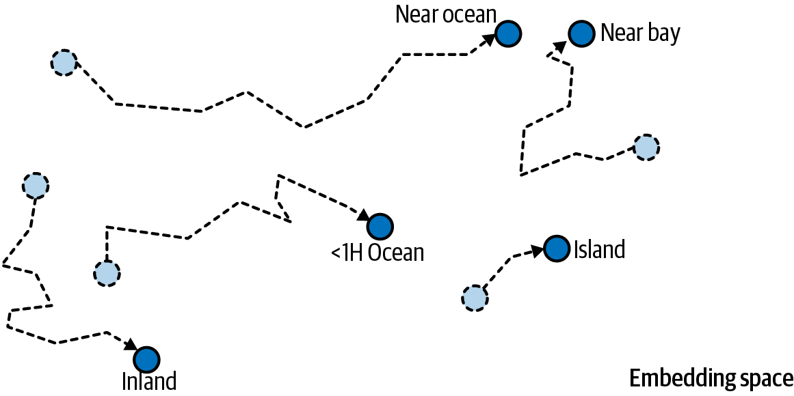
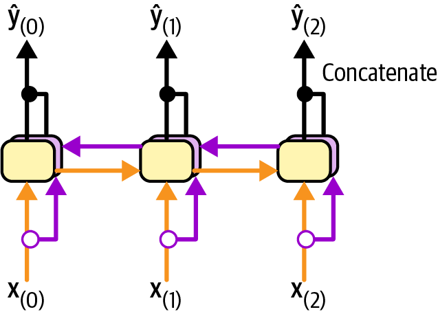
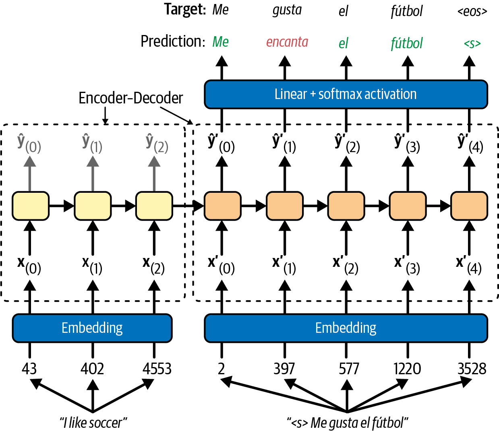
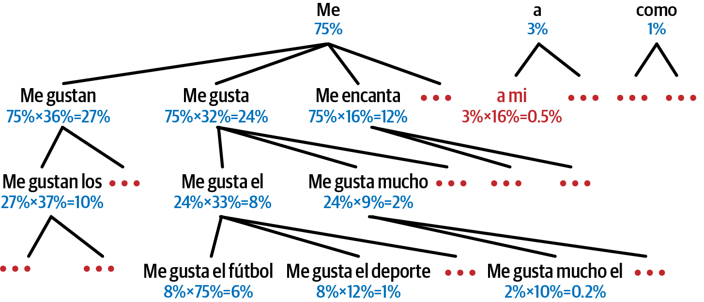
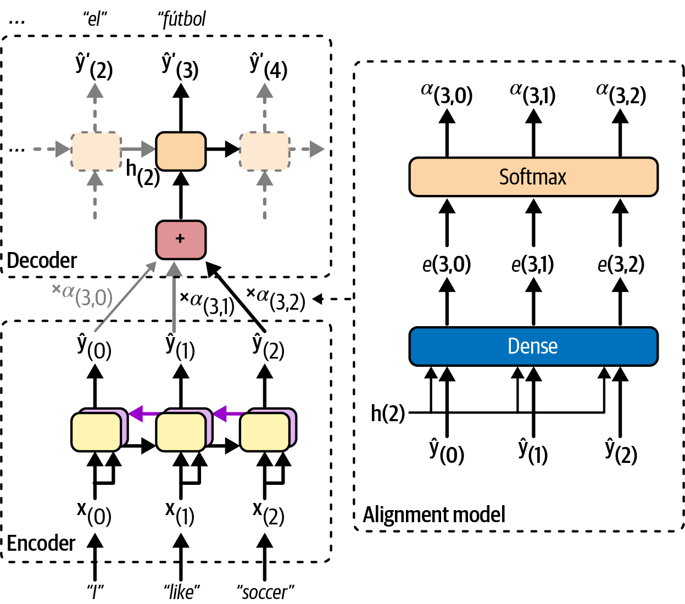
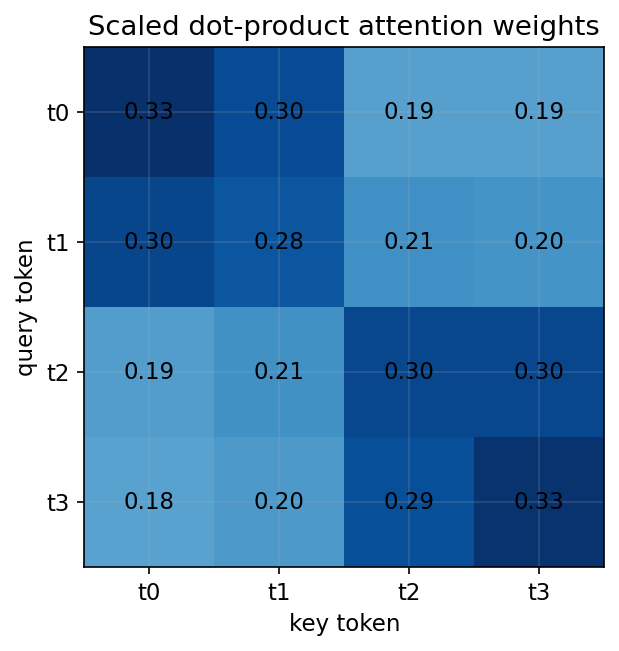

<!-- _class: cover -->
# 自然語言處理：詞嵌入與注意力

## 字元生成、情感分析與序列翻譯

書本第 14 章

<!-- 來源／講者提示：自編章節導入 -->

---
## 學習重點與成果

- 字元語言模型與 embeddings。
- tokenizer、情感分類與預訓練。
- 翻譯、beam search 與 attention。

成果：能對齊輸入與標籤，解釋 tokenizer、padding 與注意力的作用。

<!-- notebook-companion-link -->
> 💻 **配套 Notebook**：`programs/notebooks/17_自然語言處理_詞嵌入與注意力.ipynb`。本檔提供公式驗算、機制實驗與結果圖；框架片段及完整模型案例另依頁面說明閱讀。

<!-- 來源／講者提示：書本 Ch.14，PDF pp.1–52。 -->

<!-- Notebook 對照：程式 17-01、17-02；完整對照見本章 ipynb 開頭。 -->

---
## 字元語言模型的任務

給定前面的字元，預測下一個字元的機率分布。

例：「機器學」後面可能接「習」。

訓練目標來自文字本身，不需逐字額外人工標註，但資料選擇仍影響結果。

生成時，把已產生的字元放回模型，逐步延長序列。

<!-- 來源／講者提示：書本 Ch.14，PDF pp.2–6 -->

<!-- Notebook 對照：程式 17-05；完整對照見本章 ipynb 開頭。 -->

---
<!-- _class: figure -->
## 輸入與目標相差一個位置



每個輸入視窗對應向右位移一格的目標；最後一個字元也有下一步標籤。

<!-- 來源／講者提示：書本 Ch.14，PDF 5，圖 14-1。此圖用於機制解說，不代表課堂重跑結果。 -->

<!-- Notebook 對照：程式 17-05；完整對照見本章 ipynb 開頭。圖例與小型實驗的資料、評估方式及適用範圍各自標示。 -->

---
<!-- _class: activity -->
## 字元視窗手算

原始序列：`A B C D E`，視窗長度 4。

| 位置 | 1 | 2 | 3 | 4 |
| --- | --- | --- | --- | --- |
| 輸入 | A | B | C | D |
| 目標 | B | C | D | E |

分類頭在每個位置輸出 vocab_size 個 logits。

<!-- 來源／講者提示：自編例；對應Ch14 pp.3–6。 -->

<!-- Notebook 對照：程式 17-05；完整對照見本章 ipynb 開頭。 -->

---
<!-- _class: figure -->
## Embedding 是可學習的查表



token ID 只用來查位置；數字 ID 的大小不代表語意遠近。

<!-- 來源／講者提示：書本 Ch.14，PDF 7，圖 14-2。此圖用於機制解說，不代表課堂重跑結果。 -->

<!-- Notebook 對照：程式 17-03、17-05；完整對照見本章 ipynb 開頭。圖例與小型實驗的資料、評估方式及適用範圍各自標示。 -->

---
<!-- _class: small -->
## Embedding 的輸入與輸出

```python
import torch
from torch import nn
embed = nn.Embedding(5, 3)
ids = torch.tensor([[3, 2], [0, 2]])
E = embed(ids)
print(E.shape)  # 預期 [2, 2, 3]
```

五個 token，各自對應三維向量；重複 ID 會查到同一列參數。

<!-- 來源／講者提示：書本 Ch.14，PDF pp.6–9；程式依作者 14_nlp_with_rnns_and_attention.ipynb Cell 39 節錄或教學改寫，非完整獨立訓練腳本。 -->

<!-- Notebook 對照：程式 17-03、17-05；完整對照見本章 ipynb 開頭。 -->

---
## One-hot、詞袋與詞向量

| 表示 | 保留什麼 |
| --- | --- |
| 單一 token 的 one-hot | token 身分 |
| 文件的 bag-of-words | 詞頻，通常忽略順序 |
| 序列 embeddings | 每個位置的稠密向量 |

Word2Vec 的 CBOW 與 Skip-gram 利用上下文學詞向量；本章也會端到端學 embeddings。

<!-- 講者提示：明確區分 token one-hot 與文件層級表示。 -->

<!-- Notebook 對照：程式 17-05；完整對照見本章 ipynb 開頭。 -->

---
<!-- _class: small -->
## Char-RNN 的模型結構

```python
# X: [B,T] 的 token IDs
embedding = nn.Embedding(vocab_size, 10)
gru = nn.GRU(10, 128, num_layers=2, batch_first=True)
head = nn.Linear(128, vocab_size)
outputs, states = gru(embedding(X))
logits = head(outputs).permute(0, 2, 1)
```

logits `[B,V,T]`，可搭配 `[B,T]` 目標使用 CrossEntropyLoss。

<!-- 來源／講者提示：書本 Ch.14，PDF pp.9–11；程式依作者 14_nlp_with_rnns_and_attention.ipynb Cell 42（結構節錄） 節錄或教學改寫，非完整獨立訓練腳本。 -->

<!-- Notebook 對照：程式 17-06；完整對照見本章 ipynb 開頭。 -->

---
## Temperature 與抽樣

$$p_i=\frac{\exp(z_i/T)}{\sum_j\exp(z_j/T)},\qquad T>0$$

- 較小的 $T$ 讓高分 token 更集中。
- 較大的 $T$ 使分布更平坦。
- Greedy 每次選最大值，與隨機抽樣是不同策略。

溫度提高可能增加多樣性，也可能降低連貫性。

<!-- 來源／講者提示：書本 Ch.14，PDF pp.11–13 -->

<!-- Notebook 對照：程式 17-06；完整對照見本章 ipynb 開頭。 -->

---
## Stateful RNN 的資料順序

跨 batch 延續 hidden state 時，每個 batch 位置須接續同一段序列。

- 不任意 shuffle 連續批次。
- 狀態需適時 `detach()`，限制反向傳播範圍。
- 換文件或獨立序列時，重設狀態。

一般獨立視窗訓練則可打亂視窗，兩種做法不可混用。

<!-- 來源／講者提示：程式：作者Cells55–72的stateful補充，銜接Ch14字元生成。 -->

<!-- Notebook 對照：程式 17-06；完整對照見本章 ipynb 開頭。 -->

---
## 情感分類的標籤單位

IMDB 範例對每篇評論預測正面或負面。

同一句出現「好」不必然代表正面，例如「好失望」。

先建立詞袋基準，再比較能利用順序的模型。

評估時檢查否定、反諷、長評論與領域轉移。

<!-- 來源／講者提示：書本 Ch.14，PDF pp.13–15、34–35；後三類為教學測例。 -->

<!-- Notebook 對照：程式 17-05；完整對照見本章 ipynb 開頭。 -->

---
## 三種子詞 tokenizer

| 方法 | 核心想法 | 閱讀重點 |
| --- | --- | --- |
| BPE／byte-level BPE | 反覆合併常見相鄰片段 | 位元組基底可處理更廣字元 |
| WordPiece | 依訓練準則建立子詞表 | 特殊token與子詞延續記號 |
| Unigram | 從候選子詞機率模型縮減詞表 | 可有不同切分可能 |

<!-- 來源／講者提示：書本 Ch.14，PDF pp.14–21，表14-1；各實作的訓練準則與解碼行為需依tokenizer設定。 -->

<!-- Notebook 對照：程式 17-05；完整對照見本章 ipynb 開頭。 -->

---
<!-- _class: small -->
## Tokenizer 必須搭配預訓練模型

```python
from transformers import AutoTokenizer
tokenizer = AutoTokenizer.from_pretrained("bert-base-uncased")
batch = tokenizer(["A good movie", "Not good"],
                  padding=True, truncation=True,
                  max_length=128, return_tensors="pt")
print(batch["input_ids"].shape)
print(batch["attention_mask"])
```

英文模型僅作介面示範；中文任務須另選適合語言的模型與評估資料。

<!-- 來源／講者提示：書本 Ch.14，PDF pp.20–22；程式依作者 14_nlp_with_rnns_and_attention.ipynb Cell 125（改寫） 節錄或教學改寫，非完整獨立訓練腳本。 -->

<!-- Notebook 對照：程式 17-05；完整對照見本章 ipynb 開頭。 -->

---
## Padding 與截斷

- Padding 讓同一 batch 的序列長度一致。
- Attention mask 標出真正 token 與補值位置。
- 截斷會丟掉文字，可能連否定或結論也一起刪掉。
- `padding_idx` 停止某列 embedding 更新，不等於 RNN 自動忽略 padding。

<!-- 來源／講者提示：書本 Ch.14，PDF pp.21–25 -->

<!-- Notebook 對照：程式 17-05、17-06；完整對照見本章 ipynb 開頭。 -->

---
<!-- _class: small -->
## Packed sequence 避免讀入尾端補值

```python
from torch.nn.utils.rnn import pack_padded_sequence
lengths = batch["attention_mask"].sum(dim=1)
E = embedding(batch["input_ids"])
packed = pack_padded_sequence(
    E, lengths.cpu(), batch_first=True, enforce_sorted=False)
outputs, h_n = gru(packed)
```

此用法假設有效 token 在前、右側 padding，且各長度大於 0。

<!-- 來源／講者提示：書本 Ch.14，PDF pp.23–25；程式依作者 14_nlp_with_rnns_and_attention.ipynb Cell 137（節錄） 節錄或教學改寫，非完整獨立訓練腳本。 -->

<!-- Notebook 對照：程式 17-06；完整對照見本章 ipynb 開頭。 -->

---
## 情感分類頭的損失與形狀

GRU 的句子表示接一個線性輸出，得到每句的正面 logit。

```python
# logits 與 labels 都是 [B,1]
loss_fn = nn.BCEWithLogitsLoss()
loss = loss_fn(logits, labels.float())
proba_positive = logits.sigmoid()
```

訓練損失接原始 logits；只有要解讀機率時才做 Sigmoid。

<!-- 來源／講者提示：書本 Ch.14，PDF pp.22–25；作者SentimentAnalysisModel Cells134–139的教學節錄。 -->

<!-- Notebook 對照：程式 17-05、17-06；完整對照見本章 ipynb 開頭。 -->

---
<!-- _class: figure -->
## 雙向 RNN 的上下文



已知完整評論時可讀左右兩側；即時逐步預測未來時不能偷讀尚未到來的內容。

<!-- 來源／講者提示：書本 Ch.14，PDF 25，圖 14-4。此圖用於機制解說，不代表課堂重跑結果。 -->

<!-- Notebook 對照：程式 17-06；完整對照見本章 ipynb 開頭。圖例與小型實驗的資料、評估方式及適用範圍各自標示。 -->

---
## POS tagging 的逐 token 標籤

範例句：`The quick brown fox jumps`。

| token | The | quick | brown | fox | jumps |
| --- | --- | --- | --- | --- | --- |
| Penn 標籤 | DT | JJ | JJ | NN | VBZ |

一個詞拆成多個子詞後，要約定標籤如何對齊與哪些位置忽略損失。

<!-- 講者提示：在 Penn Treebank 標籤中，jumps 是第三人稱單數現在式 VBZ；與 UD 粗標籤不同。 -->

<!-- Notebook 對照：程式 17-05、17-06；完整對照見本章 ipynb 開頭。 -->

---
## Stemming、lemmatization 與任務需求

- Stemming 以規則裁切字形，結果未必是字典詞。
- Lemmatization 常結合詞性還原詞元。
- 預訓練語言模型通常使用配套 tokenizer，不任意先做 stemming。

討論：若先刪除所有標點，情感或對話任務可能失去哪些訊號？

<!-- 來源／講者提示：補充：09_POS tagging.pptx詞幹、詞形還原與spaCy段落；Ch14 tokenizer原則。 -->

<!-- Notebook 對照：程式 17-05；完整對照見本章 ipynb 開頭。 -->

---
## 預訓練表示的兩個層次

| 表示 | 同一 token 在不同句子 |
| --- | --- |
| 靜態 embedding | 通常查到同一向量 |
| 上下文化表示 | 隨上下文改變 |

可凍結預訓練模型當特徵抽取器，也可微調部分或全部參數。

<!-- 來源／講者提示：書本 Ch.14，PDF pp.27–29；作者Cells143–160。 -->

<!-- Notebook 對照：程式 17-05、17-06；完整對照見本章 ipynb 開頭。 -->

---
## Task-specific class、Trainer 與 pipeline

| 工具 | 幫忙處理什麼 |
| --- | --- |
| AutoModelForSequenceClassification | 預訓練主幹與分類頭 |
| Trainer | 訓練、評估、儲存與紀錄 |
| pipeline | 封裝前處理與推論 |

方便的介面仍需正確標籤、資料切分與評估指標。

<!-- 來源／講者提示：書本 Ch.14，PDF pp.29–34；作者Cells161–186。 -->

<!-- Notebook 對照：程式 17-05；完整對照見本章 ipynb 開頭。 -->

---
## 偏差與公平性檢查

- 把人名、性別或地區詞替換後，比較預測是否不合理改變。
- 分群檢查錯誤率，不只看總準確率。
- 確認模型支援的語言與訓練領域。
- 將測例、結果與限制一起記錄，避免把分數當作人的評價。

<!-- 來源／講者提示：書本 Ch.14，PDF pp.34–35；自編教學測試流程。 -->

<!-- Notebook 對照：程式 17-07；完整對照見本章 ipynb 開頭。 -->

---
<!-- _class: figure -->
## Encoder–decoder 翻譯



Encoder 摘要來源句；decoder 依來源表示與已產生的目標文字預測下一詞。

<!-- 來源／講者提示：書本 Ch.14，PDF 36，圖 14-5。此圖用於機制解說，不代表課堂重跑結果。 -->

<!-- Notebook 對照：程式 17-07；完整對照見本章 ipynb 開頭。圖例與小型實驗的資料、評估方式及適用範圍各自標示。 -->

---
## Teacher forcing 的位移

目標句：`<bos> I am a student <eos>`。

| 訓練角色 | token 序列 |
| --- | --- |
| Decoder 輸入 | `<bos> I am a student` |
| 監督標籤 | `I am a student <eos>` |

推論沒有標準答案可餵入，必須使用先前產生的 token。

<!-- 來源／講者提示：書本 Ch.14，PDF pp.36–42 -->

<!-- Notebook 對照：程式 17-07；完整對照見本章 ipynb 開頭。 -->

---
## 翻譯的固定向量瓶頸

長句的許多資訊若都壓在一個固定向量，可能難以保留。

先改進資料分桶、遮罩與解碼，再比較 attention。

翻譯評估可用自動指標輔助，仍需檢查漏譯、專有名詞與否定語意。

<!-- 來源／講者提示：書本 Ch.14，PDF pp.42–45；最後一句為自編評估任務。 -->

<!-- Notebook 對照：程式 17-07；完整對照見本章 ipynb 開頭。 -->

---
<!-- _class: figure -->
## Beam search 保留多條候選



每步保留若干較高分的部分句子；寬度越大，計算與記憶體成本越高。

<!-- 來源／講者提示：書本 Ch.14，PDF 44，圖 14-7。此圖用於機制解說，不代表課堂重跑結果。 -->

<!-- Notebook 對照：程式 17-07；完整對照見本章 ipynb 開頭。圖例與小型實驗的資料、評估方式及適用範圍各自標示。 -->

---
<!-- _class: activity -->
## Greedy 不一定選到整句高機率

自編例：第一步 A=0.6，B=0.4。

- A 後面最佳續接的條件機率為 0.5，路徑機率 $0.6×0.5=0.30$。
- B 後面最佳續接為 0.9，路徑機率 $0.4×0.9=0.36$。

Greedy 先選 A，可能錯過 B 路徑；beam search 也不保證全域最佳。

<!-- 來源／講者提示：自編數例；Ch14 pp.43–45。實際以log probability避免連乘下溢，並注意長度偏好。 -->

<!-- Notebook 對照：程式 17-07；完整對照見本章 ipynb 開頭。 -->

---
<!-- _class: figure -->
## Attention 動態讀取來源序列



每個輸出時間步對來源位置分配不同權重，再組合成當步 context。

<!-- 來源／講者提示：書本 Ch.14，PDF 46，圖 14-8。此圖用於機制解說，不代表課堂重跑結果。 -->

<!-- Notebook 對照：程式 17-03、17-04、17-07；完整對照見本章 ipynb 開頭。圖例與小型實驗的資料、評估方式及適用範圍各自標示。 -->

---
## 注意力的三個步驟

$$e_{tj}=\operatorname{score}(h_t,s_j),\quad \alpha_{tj}=\operatorname{softmax}_j(e_{tj})$$
$$c_t=\sum_j\alpha_{tj}s_j$$

1. 比較目前 decoder 狀態與各來源狀態。
2. 沿來源位置做 Softmax。
3. 用權重加總來源 value。

<!-- 來源／講者提示：書本 Ch.14，PDF pp.45–50；加性與點積score皆可。 -->

<!-- Notebook 對照：程式 17-03、17-04、17-07；完整對照見本章 ipynb 開頭。 -->

---
<!-- _class: activity -->
## 注意力加權平均手算

若權重為 $[0.2,0.3,0.5]$，values 為 $[1,0],[0,2],[2,2]$：

$$c=0.2[1,0]+0.3[0,2]+0.5[2,2]=[1.2,1.6]$$

注意力權重是本次計算的分配；高權重不能單獨證明因果重要性。

**先判斷**：若矩陣每列是一個 query、每欄是一個來源位置，Softmax 應沿哪個方向計算？

<!-- 來源／講者提示：自編數例；對應Ch14 attention。 -->

<!-- Notebook 對照：程式 17-07；完整對照見本章 ipynb 開頭。 -->

---

<!-- _class: small -->
## 從固定 token 向量核對注意力權重

<div class="columns wide-left">
<div>

四個 token 為「我、喜歡、機器、學習」。Q 每列是查詢向量，K 每列是來源向量；本例都使用同一組手設三維向量。

```python
scores = Q @ K.T / np.sqrt(3)
weights = np.exp(scores - scores.max(1, keepdims=True))
weights /= weights.sum(1, keepdims=True)
```

橫軸為 key，縱軸為 query。沿每列歸一，未四捨五入的列和為 1；高權重不是因果重要性。

參考程式：`programs/notebooks/17_自然語言處理_詞嵌入與注意力.ipynb`

</div>
<div>



</div>
</div>

<!-- 講者提示：承接注意力三步與加權平均，這是score的一種縮放點積數值例，不是上一頁給定[.2,.3,.5]權重的同一組計算。t0至t3依序為我、喜歡、機器、學習；Q=K=E，E有4列3欄。Softmax先扣每列最大值避免溢位，sum(axis=1)沿key位置計算。圖中兩位小數的列和可能偏離1；手設向量未由文本模型訓練，圖不驗證語意理解或翻譯品質。 -->

<!-- Notebook 對照：程式 17-03、17-04；以程式代碼定位配套 Notebook。 -->

---
## 程式導讀：Luong attention

作者 Notebook（`14_nlp_with_rnns_and_attention.ipynb`）：Cells 210–214。

- 找到 decoder outputs 與 encoder outputs 的矩陣乘法。
- 說明 Softmax 沿哪一軸計算。
- 檢查來源 padding 是否被遮罩。
- 追蹤 context 與 decoder 表示串接後的維度。

<!-- 來源／講者提示：程式：作者Ch14 attention區段。補充10_Attention.pptx s.3–12的固定context瓶頸。 -->

<!-- Notebook 對照：程式 17-07；完整對照見本章 ipynb 開頭。 -->

---
<!-- _class: activity -->
## 課堂活動：可重現的情感分類比較

練習：設計詞袋與 GRU 的比較表。

固定切分，記錄 tokenizer、長度、padding 與評估方式。

交付：兩種表示的資料形狀，以及包含否定、長句、領域差異的 6 個測例。

課後選讀：POS tagging 或英西翻譯，說明標籤對齊方式的差異。

<!-- 來源／講者提示：自編活動。 -->

<!-- Notebook 對照：程式 17-07；完整對照見本章 ipynb 開頭。 -->

---
## 離堂檢核

- token ID 的數字大小能表示語意距離嗎？
- `padding_idx` 是否讓 RNN 自動跳過補值？
- 訓練與推論的 decoder 輸入有何差異？
- Attention 為何不必只依賴最後一個 encoder state？

<!-- 來源／講者提示：自編檢核。答案：否；否；真實前詞vs生成前詞；可讀所有來源位置。 -->

<!-- Notebook 對照：程式 17-07；完整對照見本章 ipynb 開頭。 -->

---
<!-- _class: small -->
## 課後程式與延伸閱讀

- 作者第 14 章 Notebook（`14_nlp_with_rnns_and_attention.ipynb`）：先執行 Setup，再定位本課指定區段。

執行前確認資料、套件與運算資源。

<!-- 來源／講者提示：來源：作者 notebook 固定 commit 47eba45aacc85feae51ba7db68dd1ca66cb25e0a；Cell 編號從 0 起算。範例片段以讀碼為主，完整依賴見 notebook。 -->

<!-- Notebook 對照：程式 17-07；完整對照見本章 ipynb 開頭。 -->

---
<!-- _class: small -->
## Notebook 導讀：可執行的機制與驗收

| 對照內容 | 程式證據 |
|---|---|
| Token 位移、embedding、padding | lookup＝one-hot 乘表；有效長度 |
| Char-RNN、雙向與 stateful | 序列軸、反向上下文、跨批狀態 |
| Teacher forcing、greedy／beam | 輸入標籤位移；路徑機率 0.30／0.36 |
| Luong attention | 來源遮罩、加權和 $[1.2,1.6]$、串接維度 |

第一個範例是手工詞向量的 self-attention；第二個是 encoder–decoder 的 cross-attention。
小詞表／一輪 BPE 與分組表不等於預訓練 tokenizer 或公平性研究。

<!-- 講者提示：NumPy CPU 小型實驗用來核對公式、形狀與流程，不代表完整模型成效。 -->

<!-- Notebook 對照：程式 17-05、17-06、17-07；完整對照見本章 ipynb 開頭。 -->
