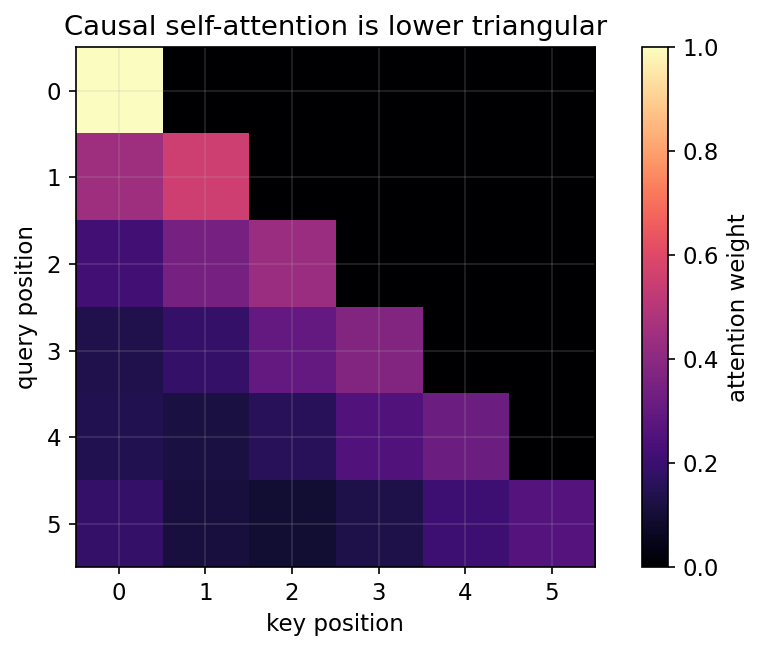
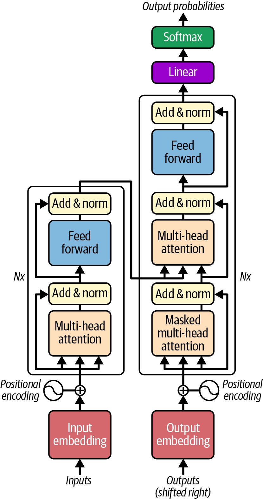
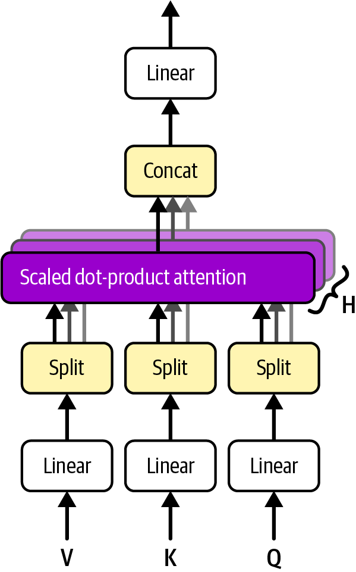
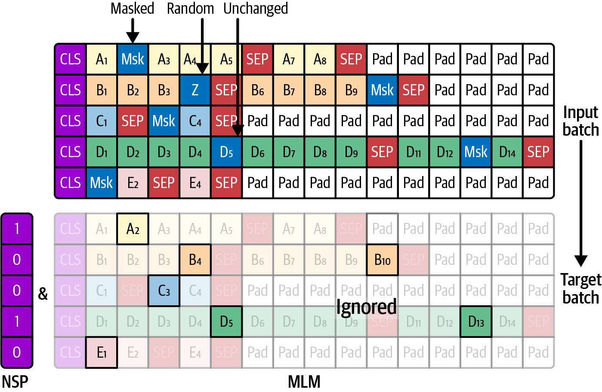
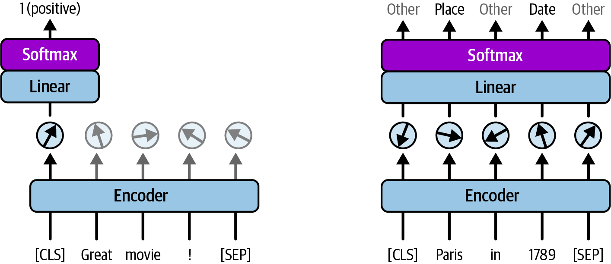
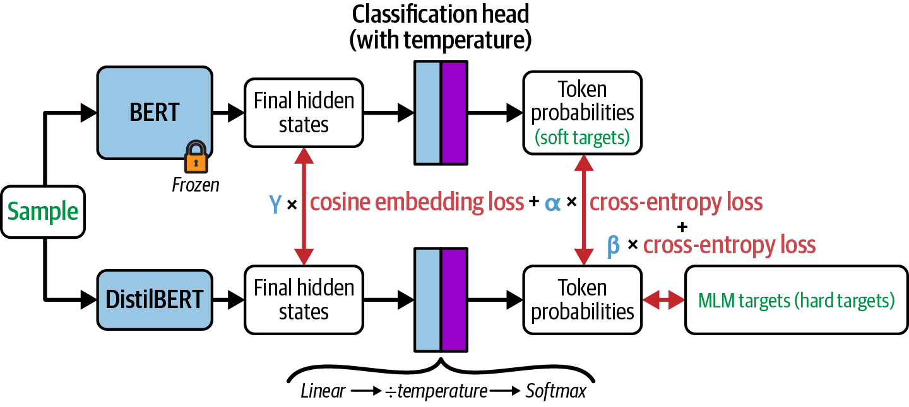

<!-- _class: cover -->
# Transformer：注意力架構與預訓練

## 位置、遮罩、多頭注意力與 BERT

書本第 15 章

<!-- 來源／講者提示：自編章節導入 -->

---
## 學習重點與成果

- Transformer 結構、位置資訊與 Q／K／V。
- 多頭注意力、遮罩、殘差與翻譯。
- BERT 預訓練、微調與模型比較。

成果：能手算小型注意力，追蹤維度並辨識未來資訊洩漏。

<!-- notebook-companion-link -->
> 💻 **配套 Notebook**：`programs/notebooks/18_Transformer_注意力架構與預訓練.ipynb`。本檔提供公式驗算、機制實驗與結果圖；框架片段及完整模型案例另依頁面說明閱讀。

<!-- 來源／講者提示：書本 Ch.15，PDF pp.1–33。 -->

<!-- Notebook 對照：程式 18-01、18-02；完整對照見本章 ipynb 開頭。 -->

---
<!-- notebook-result-slide -->
<!-- _class: small -->
## 程式實驗與實際輸出

<div class="columns wide-left">
<div>

```python
scores[future_mask] = -inf
weights = softmax(scores)
```

**觀察**：遮罩後未來位置的注意力總量為 0，權重矩陣呈下三角。

參考程式：`programs/notebooks/18_Transformer_注意力架構與預訓練.ipynb`

</div>
<div>



</div>
</div>

<!-- 講者提示：程式與圖為 programs/notebooks/18_Transformer_注意力架構與預訓練.ipynb 的已執行輸出。 -->

<!-- Notebook 對照：程式 18-04；完整對照見本章 ipynb 開頭。圖例與小型實驗的資料、評估方式及適用範圍各自標示。 -->

---
## 三種 Transformer 家族

| 架構 | 可見上下文 | 常見任務 |
| --- | --- | --- |
| Encoder-only | 左右兩側 | 分類、抽取 |
| Decoder-only | 目前與先前位置 | 逐 token 生成 |
| Encoder–decoder | 來源全文與目標前綴 | 翻譯、摘要 |

家族名稱描述資訊流，不直接代表模型大小或品質。

<!-- 來源／講者提示：書本 Ch.15，PDF pp.1–5、18、33、63–65 -->

<!-- Notebook 對照：程式 18-05；完整對照見本章 ipynb 開頭。 -->

---
<!-- _class: figure-tall -->
## 原始 Transformer 的完整架構

<div class="columns">
<div>



</div>
<div>

- 左側 encoder 讀取來源序列。
- 右側 decoder 讀取位移後的目標前綴。
- 中間 cross-attention 接收 encoder 的表示。
- 兩側都有殘差、正規化與 FFN。

</div>
</div>

<!-- 來源／講者提示：書本 Ch.15，PDF pp.5–7，圖15-3；保留原圖，右側依資訊流補充中文導讀。 -->

<!-- Notebook 對照：程式 18-05；完整對照見本章 ipynb 開頭。圖例與小型實驗的資料、評估方式及適用範圍各自標示。 -->

---
## 序列沒有循環，仍需要位置資訊

Self-attention 本身依內容配對，不能單靠 token 集合知道順序。

常見方式：可學習位置向量，或固定 sin／cos 編碼。

把位置向量與 token embedding 相加時，兩者最後一維必須相同。

<!-- 來源／講者提示：書本 Ch.15，PDF pp.8–9；10_Attention.pptx s.38–48。 -->

<!-- Notebook 對照：程式 18-03、18-05；完整對照見本章 ipynb 開頭。 -->

---
<!-- _class: small -->
## 可學習位置向量

```python
class PositionalEmbedding(nn.Module):
    def __init__(self, max_length, d_model):
        super().__init__()
        self.pos = nn.Parameter(torch.randn(max_length, d_model) * 0.02)
    def forward(self, X):
        return X + self.pos[:X.size(1)]
```

使用 `torch` 與 `torch.nn`；X 為 `[B,T,D]`。輸入長度不可超過表長。

<!-- 來源／講者提示：書本 Ch.15，PDF pp.8–9；程式依作者 15_transformers_for_nlp_and_chatbots.ipynb Cell 31（移除Dropout以聚焦位置） 節錄或教學改寫，非完整獨立訓練腳本。 -->

<!-- Notebook 對照：程式 18-05；完整對照見本章 ipynb 開頭。 -->

---
## 固定位置編碼的概念

$$PE_{p,2i}=\sin\!\left(p/10000^{2i/d}\right)$$
$$PE_{p,2i+1}=\cos\!\left(p/10000^{2i/d}\right)$$

每個維度使用不同頻率；位置 0 的偶數維為 0、奇數維為 1。

可以計算更長位置，不代表模型一定能可靠泛化到更長序列。

<!-- 來源／講者提示：書本 Ch.15，PDF pp.8–9；作者Extra Material Fixed Positional Encodings。 -->

<!-- Notebook 對照：程式 18-03、18-05；完整對照見本章 ipynb 開頭。 -->

---
## Q、K、V 的分工

- Query：目前位置要尋找的特徵。
- Key：各候選位置用來比對的特徵。
- Value：實際加權整合的內容。

Self-attention 的三者來自同一序列的不同線性投影；cross-attention 的來源不同。

<!-- 來源／講者提示：書本 Ch.15，PDF pp.9–14；補充10_Attention.pptx s.22–35。 -->

<!-- Notebook 對照：程式 18-05；完整對照見本章 ipynb 開頭。 -->

---
## Scaled dot-product attention

$$\operatorname{Attention}(Q,K,V)=\operatorname{softmax}\!\left(\frac{QK^\top}{\sqrt{d_k}}\right)V$$

| 矩陣 | 單一 head 的形狀 |
| --- | --- |
| Q、K、V | $L_q×d_k$、$L_k×d_k$、$L_k×d_v$ |
| Scores、輸出 | $L_q×L_k$、$L_q×d_v$ |

Softmax 沿 key 位置計算。

<!-- 來源／講者提示：書本 Ch.15，PDF pp.9–13，式15-1。 -->

<!-- Notebook 對照：程式 18-05；完整對照見本章 ipynb 開頭。 -->

---
<!-- _class: activity -->
## 點積注意力手算

令 $q=[1,0]$，$k_1=[1,0],k_2=[0,1]$，$d_k=2$。

分數為 $[1/\sqrt2,0]$，Softmax 約為 $[0.670,0.330]$。

若 $v_1=[2,0],v_2=[0,4]$，輸出約為 $[1.340,1.320]$。

活動：交換兩個 value 後，分數與輸出各會如何改變？

<!-- 來源／講者提示：自編數例。分數不變，輸出改為[0.660,2.680]。 -->

<!-- Notebook 對照：程式 18-05；完整對照見本章 ipynb 開頭。 -->

---
<!-- _class: small -->
## 四行看懂 attention 核心

```python
import torch.nn.functional as F
scores = Q @ K.transpose(-2, -1) / Q.size(-1)**0.5
scores = scores.masked_fill(blocked_mask, -torch.inf)
weights = F.softmax(scores, dim=-1)
context = weights @ V
```

此自寫程式的 blocked_mask=True 表示禁止關注；每列至少保留一個有效 key。

<!-- 來源／講者提示：書本 Ch.15，PDF pp.9–14；程式依作者 15_transformers_for_nlp_and_chatbots.ipynb Cell 35（節錄） 節錄或教學改寫，非完整獨立訓練腳本。 -->

<!-- Notebook 對照：程式 18-05；完整對照見本章 ipynb 開頭。 -->

---
<!-- _class: figure -->
## 多頭注意力分別學習不同投影



每個 head 產生一組 context，串接後再經輸出投影。

<!-- 來源／講者提示：書本 Ch.15，PDF 11，圖 15-4。此圖用於機制解說，不代表課堂重跑結果。 -->

<!-- Notebook 對照：程式 18-05；完整對照見本章 ipynb 開頭。圖例與小型實驗的資料、評估方式及適用範圍各自標示。 -->

---
## 多頭的維度追蹤

設 $B=2,L=10,d_{model}=64,h=4$。

| 階段 | 形狀 |
| --- | --- |
| 投影後 | `[2,10,64]` |
| 拆分 head | `[2,4,10,16]` |
| 每頭分數 | `[2,4,10,10]` |
| 合併後 | `[2,10,64]` |

$64$ 必須可被 $4$ 整除。

<!-- 來源／講者提示：書本 Ch.15，PDF pp.10–14；自編尺寸。 -->

<!-- Notebook 對照：程式 18-05；完整對照見本章 ipynb 開頭。 -->

---
## 兩種遮罩處理不同問題

| 遮罩 | 禁止看什麼 |
| --- | --- |
| Padding mask | 為湊 batch 長度而增加的補值 |
| Causal mask | 當前 token 之後的位置 |

翻譯 decoder 還要在 cross-attention 中排除來源端 padding。

不同 API 的布林 mask 意義可能相反，不能直接套用同一變數。

<!-- 來源／講者提示：書本 Ch.15，PDF pp.14–18；作者Cell46；自寫MHA與nn.Transformer的True=block，F.scaled_dot_product_attention布林True=allow。 -->

<!-- Notebook 對照：程式 18-03、18-04、18-05；完整對照見本章 ipynb 開頭。 -->

---
<!-- _class: activity -->
## Causal mask 手算

四個位置，1 表示允許關注：

$$\begin{bmatrix}1&0&0&0\\1&1&0&0\\1&1&1&0\\1&1&1&1\end{bmatrix}$$

訓練時可平行計算所有位置，但每個位置只能用自己的前綴。

<!-- 來源／講者提示：自編矩陣；對應Ch15 decoder遮罩。 -->

<!-- Notebook 對照：程式 18-03、18-04、18-05；完整對照見本章 ipynb 開頭。 -->

---
## Feed-forward network 與殘差

FFN 對每個位置套用同一組非線性轉換。

$$FFN(x)=W_2\,\phi(W_1x+b_1)+b_2$$

Attention 混合不同位置的資訊；FFN 轉換每個位置內的特徵。

殘差連接要求輸入與輸出的 $d_{model}$ 一致。

<!-- 來源／講者提示：書本 Ch.15，PDF pp.14–16 -->

<!-- Notebook 對照：程式 18-05；完整對照見本章 ipynb 開頭。 -->

---
<!-- _class: activity -->
## LayerNorm 手算：四維例子

對單一 token 向量 $[2,4,4,6]$：

平均 $\mu=4$，變異數 $\sigma^2=(4+0+0+4)/4=2$。

忽略 $\epsilon$ 且 $\gamma=1,\beta=0$，結果約為
$[-1.414,0,0,1.414]$。

不是跨整個 batch 計算這組統計量。

<!-- 來源／講者提示：補充：10_Attention.pptx s.52–53；Ch15 pp.14–16。 -->

<!-- Notebook 對照：程式 18-05；完整對照見本章 ipynb 開頭。 -->

---
## Pre-norm 與 post-norm

原始架構把 norm 放在殘差相加之後；其他設計可放在子層之前。

| 設計 | 簡化表示 |
| --- | --- |
| Post-norm | $LN(x+F(x))$ |
| Pre-norm | $x+F(LN(x))$ |

讀碼時確認 norm 的位置，不因都叫 Transformer 就假設相同。

<!-- 來源／講者提示：書本 Ch.15，PDF pp.14–16；變體為架構對照。 -->

<!-- Notebook 對照：程式 18-05；完整對照見本章 ipynb 開頭。 -->

---
<!-- _class: small -->
## 翻譯 Transformer 的遮罩位置

```python
# src、tgt 都已加上 token 與位置 embeddings
model = nn.Transformer(d_model=64, nhead=4,
                       num_encoder_layers=2, num_decoder_layers=2,
                       batch_first=True)
output = model(src, tgt, tgt_mask=causal_blocked,
               src_key_padding_mask=src_pad,
               tgt_key_padding_mask=tgt_pad,
               memory_key_padding_mask=src_pad)
```

src_pad、tgt_pad 中 True 表示 padding；tgt 需使用位移後的目標前綴。

<!-- 來源／講者提示：書本 Ch.15，PDF pp.16–18；程式依作者 15_transformers_for_nlp_and_chatbots.ipynb Cell 46（簡化） 節錄或教學改寫，非完整獨立訓練腳本。 -->

<!-- Notebook 對照：程式 18-05；完整對照見本章 ipynb 開頭。 -->

---
## Encoder-only 模型與 BERT

BERT 用雙向上下文學表示，常用於分類與資訊抽取。

預訓練先學通用語言表示，微調再對應任務標籤。

只用 encoder 並不等於沒有任務頭；不同任務的輸出形狀不同。

<!-- 來源／講者提示：書本 Ch.15，PDF pp.18–27 -->

<!-- Notebook 對照：程式 18-06；完整對照見本章 ipynb 開頭。 -->

---
<!-- _class: figure -->
## BERT 的預訓練目標



MLM 預測選中的 token；原始 BERT 也使用 NSP 判斷句子配對。

<!-- 來源／講者提示：書本 Ch.15，PDF 21，圖 15-5。此圖用於機制解說，不代表課堂重跑結果。 -->

<!-- Notebook 對照：程式 18-06；完整對照見本章 ipynb 開頭。圖例與小型實驗的資料、評估方式及適用範圍各自標示。 -->

---
## MLM 的遮蔽規則

原始 BERT 選約 15% token 作預測目標。

在被選中的位置中：約 80% 換成 `[MASK]`、10% 換隨機 token、10% 保持原字。

損失只計算被選中的位置；未換掉的目標仍需預測。

這是原始設計，後續模型可採不同訓練配方。

<!-- 來源／講者提示：書本 Ch.15，PDF pp.19–22 -->

<!-- Notebook 對照：程式 18-06；完整對照見本章 ipynb 開頭。 -->

---
<!-- _class: small -->
## 小型 BERT：區分隨機初始化與預訓練

```python
from transformers import BertConfig, BertForMaskedLM
config = BertConfig(vocab_size=30522, hidden_size=128,
                    num_hidden_layers=2, num_attention_heads=4,
                    intermediate_size=512, max_position_embeddings=128)
model = BertForMaskedLM(config)
```

這會建立隨機權重，尚未懂語言；`from_pretrained(...)` 才會載入既有權重。

<!-- 來源／講者提示：書本 Ch.15，PDF pp.19–22；程式依作者 15_transformers_for_nlp_and_chatbots.ipynb Cell 57（簡化） 節錄或教學改寫，非完整獨立訓練腳本。 -->

<!-- Notebook 對照：程式 18-05、18-06；完整對照見本章 ipynb 開頭。 -->

---
<!-- _class: figure -->
## 分類頭與逐 token 任務頭



句子分類輸出每句一組標籤；NER 或 POS 則要對齊每個有效 token。

<!-- 來源／講者提示：書本 Ch.15，PDF 24，圖 15-7。此圖用於機制解說，不代表課堂重跑結果。 -->

<!-- Notebook 對照：程式 18-06；完整對照見本章 ipynb 開頭。圖例與小型實驗的資料、評估方式及適用範圍各自標示。 -->

---
## 問答任務的輸出設計

| 任務 | 輸出 |
| --- | --- |
| 句子分類 | 一個類別 |
| Token classification | 每個token一個類別 |
| 抽取式問答 | 答案開始與結束位置 |
| 多選問答 | 每個候選答案的分數 |

抽取式問答通常從提供的文本找片段，與自由生成回答不同。

<!-- 來源／講者提示：書本 Ch.15，PDF pp.22–27 -->

<!-- Notebook 對照：程式 18-06；完整對照見本章 ipynb 開頭。 -->

---
<!-- _class: figure -->
## DistilBERT 的知識蒸餾



學生同時學任務訊號與教師行為；壓縮模型需重新衡量品質與成本。

<!-- 來源／講者提示：書本 Ch.15，PDF 28，圖 15-9。此圖用於機制解說，不代表課堂重跑結果。 -->

<!-- Notebook 對照：程式 18-07；完整對照見本章 ipynb 開頭。圖例與小型實驗的資料、評估方式及適用範圍各自標示。 -->

---
## Encoder 模型的改良方向

| 模型 | 教材中的主要改良 |
| --- | --- |
| RoBERTa | 調整資料量與訓練配方，移除NSP |
| ALBERT | 分解embedding與跨層參數共用 |
| ELECTRA | 辨識被替換的token |
| DeBERTa | 分開處理內容與位置資訊 |

<!-- 來源／講者提示：書本 Ch.15，PDF pp.27–33；補充ModernBERT等後續模型為架構延伸，不列即時效能排名。 -->

<!-- Notebook 對照：程式 18-07；完整對照見本章 ipynb 開頭。 -->

---
<!-- _class: activity -->
## 課堂活動：找出注意力錯誤

檢查下列三個設計：

1. Softmax 沿 batch 軸。
2. Decoder 訓練時可以看到目標下一個 token。
3. Cross-attention 使用 decoder 的輸出當 Q，encoder 輸出當 K／V。

交付：前兩者的修正與第三者的尺寸表。

<!-- 來源／講者提示：自編活動。前兩者錯誤；第三者是常見正確資訊流。 -->

<!-- Notebook 對照：程式 18-05；完整對照見本章 ipynb 開頭。 -->

---
## 離堂檢核

- 自注意力與交叉注意力的 Q／K／V 分別來自哪裡？
- 為何有 causal mask 仍可平行訓練？
- BERT 的 15% 與 80% 的母數分別是什麼？
- 建立 config 是否等於載入預訓練知識？

<!-- 來源／講者提示：自編檢核；15%=候選token，80%=被選中token；config不含學好權重。 -->

<!-- Notebook 對照：程式 18-05；完整對照見本章 ipynb 開頭。 -->

---
<!-- _class: small -->
## 課後程式與延伸閱讀

- 作者第 15 章 Notebook（`15_transformers_for_nlp_and_chatbots.ipynb`）：先執行 Setup，再定位本課指定區段。

執行前確認資料、套件與運算資源。

<!-- 來源／講者提示：來源：作者 notebook 固定 commit 47eba45aacc85feae51ba7db68dd1ca66cb25e0a；Cell 編號從 0 起算。範例片段以讀碼為主，完整依賴見 notebook。 -->

<!-- Notebook 對照：程式 18-07；完整對照見本章 ipynb 開頭。 -->

---
<!-- _class: small -->
## Notebook 導讀：可執行的機制與驗收

| 實驗 | 驗收證據 |
|---|---|
| Encoder／decoder 與多頭 | Q/K/V 形狀、FFN、殘差、norm |
| Causal 與 padding mask | 改未來不改過去；padding 權重為零 |
| MLM、分類、token 與 QA 頭 | 受監督位置、輸出形狀、合法 span |
| 蒸餾 | 固定教師分布、學生 KL 下降 |

權重隨機或只優化玩具 logits；不稱為已預訓練 BERT／DistilBERT。
完整模型 API 仍作讀碼；小型實驗提供可核對的公式與資料流。

<!-- 講者提示：NumPy CPU 小型實驗用來核對公式、形狀與流程，不代表完整模型成效。 -->

<!-- Notebook 對照：程式 18-05、18-06、18-07；完整對照見本章 ipynb 開頭。 -->
