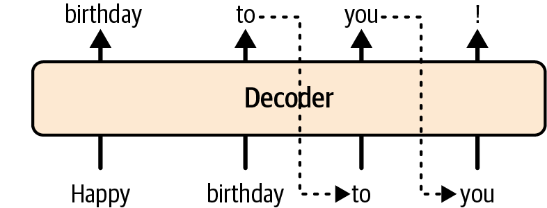
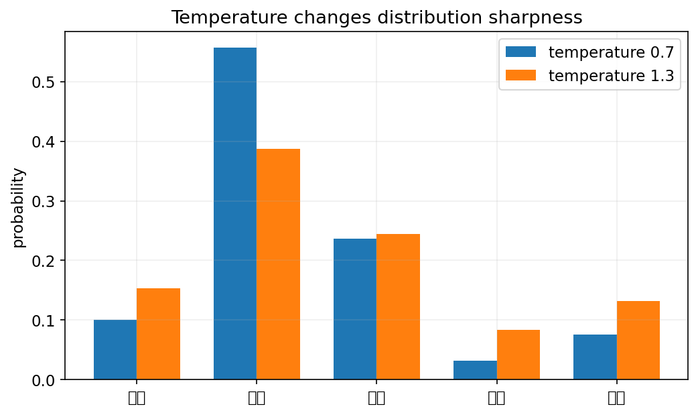
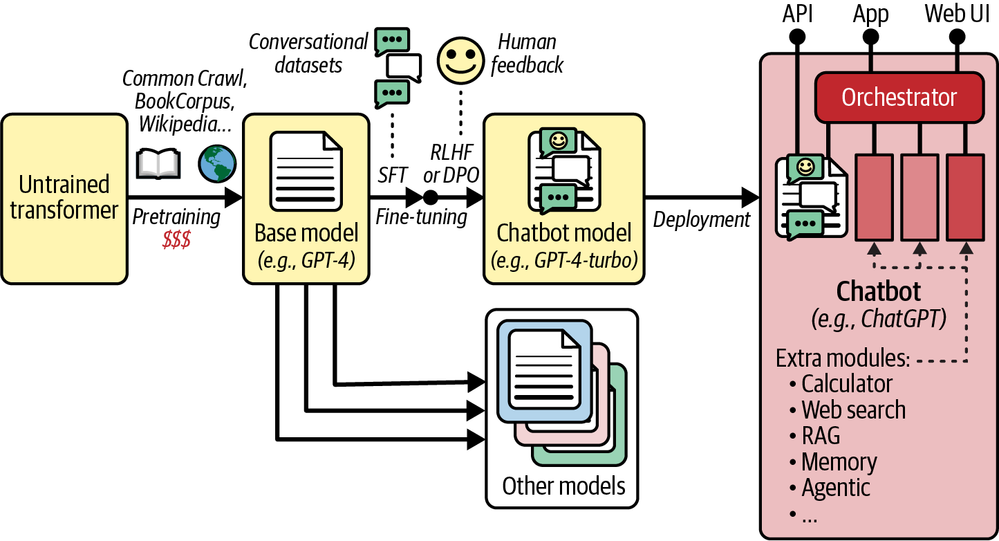

<!-- _class: cover -->
# 大型語言模型：生成與聊天系統

## Decoder、SFT、偏好學習與工具整合

書本第 15 章

<!-- 來源／講者提示：自編章節導入 -->

---
## 學習重點與成果

- 自迴歸生成、GPT 與提示。
- SFT、RLHF、DPO 與程式導讀。
- RAG、工具與完整聊天系統。

成果：分辨模型訓練與應用系統，設計有證據的回答評估。

<!-- notebook-companion-link -->
> 💻 **配套 Notebook**：`programs/notebooks/19_大型語言模型_生成與聊天系統.ipynb`。本檔提供公式驗算、機制實驗與結果圖；框架片段及完整模型案例另依頁面說明閱讀。

<!-- 來源／講者提示：書本 Ch.15，PDF pp.33–66。 -->

<!-- Notebook 對照：程式 19-01、19-02；完整對照見本章 ipynb 開頭。 -->

---
<!-- _class: figure -->
## Decoder-only 逐 token 生成



下一個 token 依賴既有前綴；訓練時同時學每個位置的下一步。

<!-- 來源／講者提示：書本 Ch.15，PDF 33，圖 15-12。此圖用於機制解說，不代表課堂重跑結果。 -->

<!-- Notebook 對照：程式 19-05；完整對照見本章 ipynb 開頭。圖例與小型實驗的資料、評估方式及適用範圍各自標示。 -->

---
## 語言模型的機率分解

$$p(x_1,\ldots,x_T)=\prod_{t=1}^{T}p(x_t\mid x_{<t})$$

訓練最大化真實 token 的對數機率；生成則依模型分布選 token。

語句流暢只表示接續合理，不保證事實正確。

<!-- 來源／講者提示：書本 Ch.15，PDF pp.33–38 -->

<!-- Notebook 對照：程式 19-05；完整對照見本章 ipynb 開頭。 -->

---
## GPT-1、GPT-2、GPT-3 的閱讀重點

| 世代 | 本章用來說明的概念 |
| --- | --- |
| GPT-1 | 語言預訓練後做任務微調 |
| GPT-2 | 較大模型與提示式任務表達 |
| GPT-3 | 大規模模型與in-context learning |

依書中的歷史案例學方法；不用歷史模型尺寸推定今日服務能力。

<!-- 來源／講者提示：書本 Ch.15，PDF pp.34–38；LLM.pptx與執行大型語言模型.pptx補充。 -->

<!-- Notebook 對照：程式 19-05；完整對照見本章 ipynb 開頭。 -->

---
<!-- _class: small -->
## 小模型生成：明確限制輸出長度

```python
from transformers import AutoTokenizer, AutoModelForCausalLM
tok = AutoTokenizer.from_pretrained("gpt2")
lm = AutoModelForCausalLM.from_pretrained("gpt2").eval()
inputs = tok("Machine learning is", return_tensors="pt")
with torch.no_grad():
    ids = lm.generate(**inputs, max_new_tokens=30,
                      do_sample=False, pad_token_id=tok.eos_token_id)
print(tok.decode(ids[0], skip_special_tokens=True))
```

需先 `import torch`，首次下載權重需網路；英文 GPT-2 用於理解生成介面。

<!-- 來源／講者提示：書本 Ch.15，PDF pp.38–41；程式依作者 15_transformers_for_nlp_and_chatbots.ipynb Cells 70–73（簡化） 節錄或教學改寫，非完整獨立訓練腳本。 -->

<!-- Notebook 對照：程式 19-03、19-05；完整對照見本章 ipynb 開頭。 -->

---
## 生成參數的效果

| 參數 | 控制內容 |
| --- | --- |
| max_new_tokens | 最多新增多少token |
| do_sample | 是否依分布抽樣 |
| temperature | 分布集中程度 |
| top_k／top_p | 抽樣候選集合 |

固定模型、提示與種子，才能比較單一設定的影響。

**先預測**：固定 logits，只降低正溫度，最高機率詞的排序會變嗎？分布較集中是否等於每次抽到相同詞？

<!-- 來源／講者提示：書本 Ch.15，PDF pp.38–41、48–50 -->

<!-- Notebook 對照：程式 19-03、19-04、19-05；完整對照見本章 ipynb 開頭。 -->

---

<!-- _class: small -->
## 固定 logits 時，temperature 如何改變分布？

<div class="columns wide-left">
<div>

五個候選詞為資料、模型、學習、風險、答案；固定 logits=[1.2, 2.4, 1.8, 0.4, 1.0]，只改正溫度。

```python
z = logits / temperature
p = np.exp(z - z.max())
p /= p.sum()
```

橫軸為候選詞，縱軸為機率。0.7 比 1.3 更集中在「模型」，排序不變；抽樣仍可能不同，greedy 則挑最大值。

參考程式：`programs/notebooks/19_大型語言模型_生成與聊天系統.ipynb`

</div>
<div>



</div>
</div>

<!-- 講者提示：本圖是手設logits經Softmax的分布，不是語言模型生成文字的實測品質；是top-k／top-p截斷之前的機率。正溫度改變尖銳程度，不改變logits排序。Notebook probs(temp)包住此運算；抽樣函式sample_top_k接收temp與k，再自行計算分布。不要以低溫直接推論答案正確。 -->

<!-- Notebook 對照：程式 19-03、19-04；以程式代碼定位配套 Notebook。 -->

---
## Prompting 與微調

- Zero-shot：用任務指示與必要背景說明需求。
- Few-shot：在上下文中提供少量輸入／輸出示例。
- 微調：以訓練改變參數，成本與資料需求不同。

Few-shot 在一般推論中不更新權重；也會占用上下文空間。

<!-- 來源／講者提示：書本 Ch.15，PDF pp.37–41、48–50；LLM.pptx s.16–30。 -->

<!-- Notebook 對照：程式 19-05；完整對照見本章 ipynb 開頭。 -->

---
## 可檢查的提示範例

> 請依下列課程規則回答學生問題。列出支持答案的規則編號。若資料不足，指出缺少的資訊。輸出含「答案」與「依據」兩欄。

- 提供明確任務與來源範圍。
- 設定輸出格式與資料不足時的行為。
- 準備一組固定問題評估，不只看一次成功案例。

<!-- 來源／講者提示：自編教學提示；呼應Ch15 prompting、LLM.pptx精確語言與測試變體。 -->

<!-- Notebook 對照：程式 19-05；完整對照見本章 ipynb 開頭。 -->

---
## 模型載入與資源估算

書中另使用 Mistral-7B 說明較大模型與對話。

70 億參數若只用每參數 2 bytes 儲存，權重約需 14 GB。

這還不含 KV cache、activation、runtime 與訓練狀態。

模型存取條件與套件介面可能變動，先閱讀對應模型頁與 Notebook Setup。

<!-- 來源／講者提示：書本 Ch.15，PDF pp.41–45；估算使用十進位GB，非完整記憶體需求。 -->

<!-- Notebook 對照：程式 19-05；完整對照見本章 ipynb 開頭。 -->

---
## Base model 與聊天模型

| 模型 | 主要學到什麼 |
| --- | --- |
| Base model | 大量文字中的接續分布 |
| Instruction／chat model | 回答指示與對話格式 |

聊天需要角色、輪次邊界與訓練相容的模板；不能只把任何模型包成聊天室。

<!-- 來源／講者提示：書本 Ch.15，PDF pp.45–51 -->

<!-- Notebook 對照：程式 19-05；完整對照見本章 ipynb 開頭。 -->

---
## 對話歷史與 context window

- 每一輪需要組成模型能理解的輸入。
- 上下文長度是有限資源；歷史與新回答都占空間。
- 摘要或截斷可能移除必要條件。
- 重新整理歷史後，仍需保留問題與引用來源的關係。

<!-- 來源／講者提示：書本 Ch.15，PDF pp.45–50 -->

<!-- Notebook 對照：程式 19-05；完整對照見本章 ipynb 開頭。 -->

---
<!-- _class: figure -->
## 聊天模型的訓練階段



預訓練先學語言分布，再透過監督微調與偏好學習調整回答行為。

<!-- 來源／講者提示：書本 Ch.15，PDF 50，圖 15-17。此圖用於機制解說，不代表課堂重跑結果。 -->

<!-- Notebook 對照：程式 19-06；完整對照見本章 ipynb 開頭。圖例與小型實驗的資料、評估方式及適用範圍各自標示。 -->

---
## SFT：用示範回答教模型

訓練樣本包含 prompt 與示範答案。

常將 prompt 與 padding 的 loss 遮掉，聚焦答案 token。

- 檢查角色標記與答案邊界。
- 去除重複或矛盾標註。
- 驗證集不要出現同題不同包裝的近重複資料。

<!-- 來源／講者提示：書本 Ch.15，PDF pp.50–51、55–57 -->

<!-- Notebook 對照：程式 19-06；完整對照見本章 ipynb 開頭。 -->

---
## RLHF 與 DPO 的差異

| 方法 | 偏好資料如何進入訓練 |
| --- | --- |
| RLHF常見流程 | 先學reward model，再用RL更新policy |
| DPO | 直接用chosen／rejected回答計算損失 |

兩者都需要清楚的偏好準則，並關注對參考模型的偏離。

<!-- 來源／講者提示：書本 Ch.15，PDF pp.51–55 -->

<!-- Notebook 對照：程式 19-06；完整對照見本章 ipynb 開頭。 -->

---
## DPO 損失的意義

$$\delta(y)=\log p_\theta(y\mid x)-\log p_{ref}(y\mid x)$$
$$L=-\log\sigma\!\left(\beta[\delta(y_c)-\delta(y_r)]\right)$$

$y_c$ 是偏好回答，$y_r$ 是較不偏好的回答。

相對於參考模型，增加 chosen 的相對優勢，會讓此損失下降。

<!-- 來源／講者提示：書本 Ch.15，PDF pp.52–55，式15-2。 -->

<!-- Notebook 對照：程式 19-06；完整對照見本章 ipynb 開頭。 -->

---
<!-- _class: activity -->
## DPO 手算

設 $\delta(y_c)=0.4,\delta(y_r)=-0.2,\beta=1$。

差值為 0.6，$L=-\log\sigma(0.6)\approx0.437$。

若兩者沒有相對差異，$L=-\log0.5\approx0.693$。

偏好是標註準則的選擇，不能一律視為客觀真理。

<!-- 來源／講者提示：自編DPO數例；Ch15 pp.52–55。 -->

<!-- Notebook 對照：程式 19-06；完整對照見本章 ipynb 開頭。 -->

---
<!-- _class: small -->
## 答案 log probability 的位移

```python
import torch.nn.functional as F
next_ids = input_ids[:, 1:]
logp = F.log_softmax(logits[:, :-1], dim=-1)
chosen_logp = logp.gather(-1, next_ids.unsqueeze(-1)).squeeze(-1)
answer_logp = (chosen_logp * answer_mask[:, 1:]).sum(dim=-1)
```

answer_mask 需排除 prompt 與 padding，並與位移後 target 對齊。

<!-- 來源／講者提示：書本 Ch.15，PDF pp.53–55；程式依作者 15_transformers_for_nlp_and_chatbots.ipynb Cells 117–124（教學改寫） 節錄或教學改寫，非完整獨立訓練腳本。 -->

<!-- Notebook 對照：程式 19-06；完整對照見本章 ipynb 開頭。 -->

---
## TRL 訓練流程導讀

作者 Notebook（`15_transformers_for_nlp_and_chatbots.ipynb`）：Cells 133–151。

1. 檢查 SFT 資料欄位與文字模板。
2. 定位 SFTConfig／SFTTrainer 的設定。
3. 檢查偏好資料的 chosen、rejected 與 prompt。
4. 說明 DPO 使用哪個參考模型。

完整訓練是課後 GPU 選做；先完成資料檢查再啟動。

<!-- 來源／講者提示：程式：作者Ch15 TRL區段，需對應版本套件與完整前置儲存路徑。 -->

<!-- Notebook 對照：程式 19-06；完整對照見本章 ipynb 開頭。 -->

---
## 完整聊天系統的組成

模型之外，還需要：

- 對話與提示的組織。
- 檢索、計算與其他工具。
- 工具結果的驗證與錯誤處理。
- 可追溯的資料來源與評估紀錄。

回答失敗可能發生在任一環節，不一定只靠更大模型解決。

<!-- 來源／講者提示：書本 Ch.15，PDF pp.57–63 -->

<!-- Notebook 對照：程式 19-07；完整對照見本章 ipynb 開頭。 -->

---
## RAG 的工作流程

1. 將問題轉成可檢索的查詢。
2. 從文件找出相關片段。
3. 把片段與來源放入模型上下文。
4. 生成回答並檢查引用是否支持說法。

檢索到不相關或過期片段，仍可能得到流暢的錯誤答案。

<!-- 來源／講者提示：書本 Ch.15，PDF pp.58–60；LLM.pptx s.31–32。 -->

<!-- Notebook 對照：程式 19-07；完整對照見本章 ipynb 開頭。 -->

---
## 工具呼叫與程式執行的邊界

模型可以提出結構化工具請求；應用程式檢查後才執行。

| 步驟 | 應用程式負責的檢查 |
| --- | --- |
| 接收請求 | 工具名稱、參數型別 |
| 執行前 | 使用者授權與資料範圍 |
| 回傳後 | 錯誤、單位、來源與可信度 |

工具輸出或文件文字不是新的系統指令。

<!-- 來源／講者提示：書本 Ch.15，PDF pp.58–62；自編工具邊界教學。 -->

<!-- Notebook 對照：程式 19-07；完整對照見本章 ipynb 開頭。 -->

---
## MCP 與結構化生成

MCP 提供工具與資料能力的連接方式；實際能力由 server 與應用程式決定。

結構化生成限制輸出的格式，例如 JSON 欄位與型別。

格式正確不等於事實正確，也不等於工具執行已獲授權。

<!-- 來源／講者提示：書本 Ch.15，PDF pp.60–62；只講書中概念，不綁定即時協定版本。 -->

<!-- Notebook 對照：程式 19-07；完整對照見本章 ipynb 開頭。 -->

---
## 框架與執行環境的分工

| 層次 | 書中列舉 | 用途 |
| --- | --- | --- |
| 應用流程 | LangChain／LangGraph等 | 組合模型、狀態與工具 |
| 使用介面 | LM Studio／Ollama等 | 載入與互動 |
| 推論後端 | llama.cpp等 | 執行模型計算 |

<!-- 來源／講者提示：書本 Ch.15，PDF pp.62–63；是教材中的角色分類，產品功能可能跨層，不作安裝建議。 -->

<!-- Notebook 對照：程式 19-07；完整對照見本章 ipynb 開頭。 -->

---
## Encoder–decoder 的 text-to-text 任務

T5 把翻譯、摘要與分類都表示成文字輸入與文字輸出。

| 模型／變體 | 教材重點 |
| --- | --- |
| T5 | 片段遮蔽與統一文字任務 |
| mT5／ByT5 | 多語言／位元組表示 |
| FLAN-T5／UL2 | 指令調整／混合預訓練目標 |
| BART | 去噪式encoder–decoder預訓練 |

<!-- 來源／講者提示：書本 Ch.15，PDF pp.63–65；ByT5仍有位元組編碼，不把「免子詞切分」誤寫成完全沒有離散輸入。 -->

<!-- Notebook 對照：程式 19-07；完整對照見本章 ipynb 開頭。 -->

---
<!-- _class: activity -->
## 課堂活動：課程規則問答

根據提供的兩頁規則，設計 RAG 測試。

- 4 題可直接查到，2 題需跨段整合，2 題資料不足。
- 每題列出正確答案、支持片段與可接受的拒答。
- 比較無檢索與有檢索，分開評估檢索與生成錯誤。

交付：8 題測試表；不以回答長度當品質指標。

<!-- 來源／講者提示：自編活動，對應Ch15 pp.57–63。 -->

<!-- Notebook 對照：程式 19-07；完整對照見本章 ipynb 開頭。 -->

---
## 離堂檢核

- Few-shot 與 SFT 哪個會更新權重？
- DPO 的參考模型扮演什麼角色？
- JSON 格式正確為何仍需檢查內容？
- RAG 失敗應先查哪些環節？

<!-- 來源／講者提示：自編檢核。SFT更新；比較相對logprob並限制偏離；格式不保證真實；資料、檢索、提示、回答引用。 -->

<!-- Notebook 對照：程式 19-07；完整對照見本章 ipynb 開頭。 -->

---
<!-- _class: small -->
## 課後程式與延伸閱讀

- 作者第 15 章 Notebook（`15_transformers_for_nlp_and_chatbots.ipynb`）：先執行 Setup，再定位本課指定區段。

執行前確認資料、套件與運算資源。

<!-- 來源／講者提示：來源：作者 notebook 固定 commit 47eba45aacc85feae51ba7db68dd1ca66cb25e0a；Cell 編號從 0 起算。範例片段以讀碼為主，完整依賴見 notebook。 -->

<!-- Notebook 對照：程式 19-07；完整對照見本章 ipynb 開頭。 -->

---
<!-- _class: small -->
## Notebook 導讀：可執行的機制與驗收

| 實驗 | 可核對的證據 |
|---|---|
| 條件轉移與 top-p | 前綴更新、EOS／長度上限、重正規化 |
| SFT 與 DPO | 回答位移／遮罩；手算損失約 0.437 |
| 本地 RAG 與工具介面 | 檢索文件 ID、原文引用、結構化參數 |
| 模板與資源估算 | 示例對話格式；僅權重的 GiB |

固定 logits 抽樣與自迴歸生成分開展示；玩具損失不代表完成 LLM 訓練。
RAG 使用內嵌虛構課規；外部模型、TRL、MCP 仍是架構讀碼案例。

<!-- 講者提示：NumPy CPU 小型實驗用來核對公式、形狀與流程，不代表完整模型成效。 -->

<!-- Notebook 對照：程式 19-05、19-06、19-07；完整對照見本章 ipynb 開頭。 -->
