<!-- _class: cover -->
# 視覺與多模態 Transformer

## ViT、CLIP 與圖文生成

書本第 16 章

建議 180 分鐘，含活動與休息

<!-- 來源／講者提示：自編章節導入 -->

---
## 學習成果與課堂安排

- 0–50 分：影像 token、ViT 與視覺架構。
- 60–110 分：自監督表示、CLIP 與對比學習。
- 120–180 分：多模態融合、圖片描述與評估。

成果：能追蹤 patch 形狀，分辨圖文比對與圖文生成。

<!-- notebook-companion-link -->
> 💻 **配套 Notebook**：`programs/notebooks/20_視覺與多模態Transformer.ipynb`。程式片段、實際圖表與表格可由此檔重現。

<!-- 來源／講者提示：書本 Ch.16，PDF pp.1–50；兩次10分鐘休息。 -->

---
<!-- notebook-result-slide -->
<!-- _class: small -->
## 程式實驗與實際輸出

<div class="columns wide-left">
<div>

```python
similarity = normalize(image_emb) @ normalize(text_emb).T
```

**觀察**：圖文嵌入先正規化，再以餘弦相似度比較；分數只在同一模型空間內有意義。

參考程式：`programs/notebooks/20_視覺與多模態Transformer.ipynb`

</div>
<div>

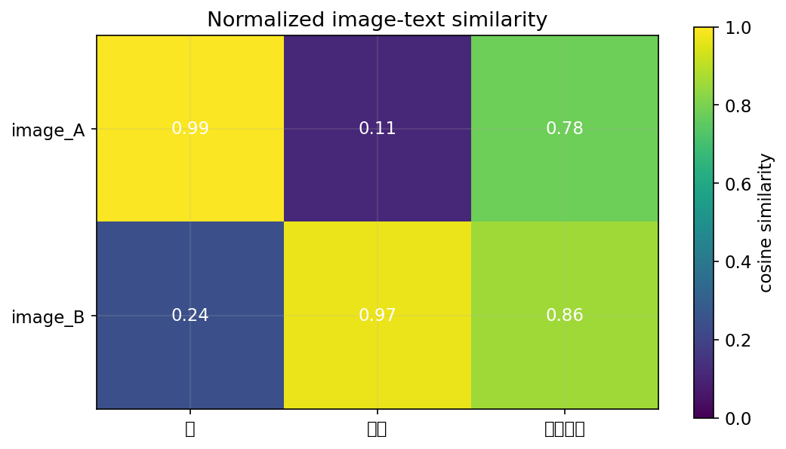

</div>
</div>

<!-- 講者提示：程式與圖均來自 programs/notebooks/20_視覺與多模態Transformer.ipynb 的已執行輸出；來源與改編界線見 Notebook。 -->
---
## 視覺注意力的早期脈絡

圖片描述可用 CNN 取得影像區域特徵，再由 RNN 逐詞生成。

Attention 讓不同詞讀取不同區域，而非只用一個固定向量。

視覺化有助觀察行為，但不能只看熱區就認定模型推理正確。

<!-- 來源／講者提示：書本 Ch.16，PDF pp.3–4；補充11_Image Captioning.pptx s.3–5、20–25。 -->

---
<!-- _class: figure -->
## DETR：用集合預測做偵測

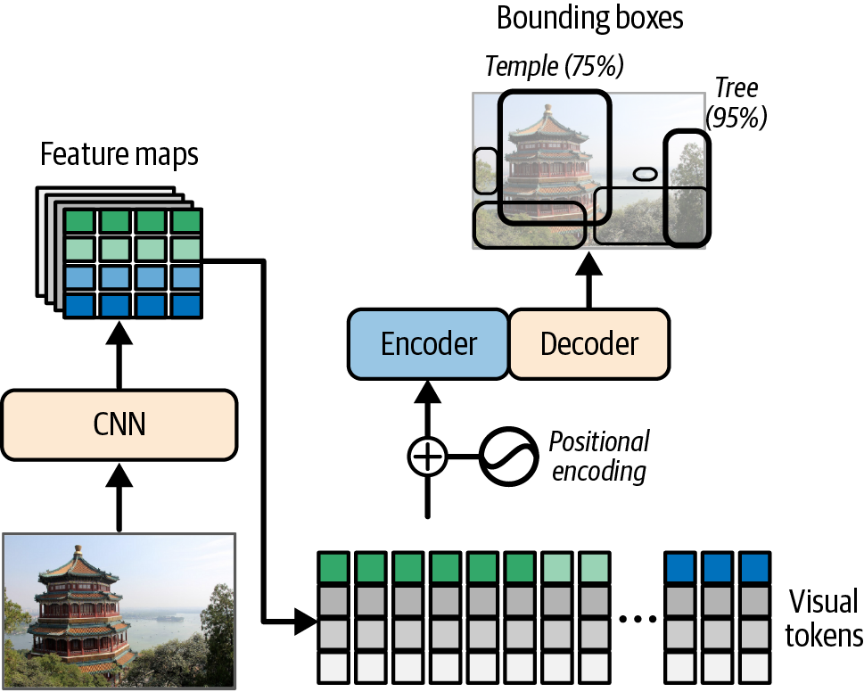

影像特徵與 object queries 共同產生一組物件預測，訓練需配對預測與標註。

<!-- 來源／講者提示：書本 Ch.16，PDF 5，圖 16-2。圖為教材原圖，非本次實驗結果。 -->

---
## DETR 的配對概念

一張圖可能只有三個物件，模型卻有固定數量的輸出槽。

- 以一對一配對決定哪些輸出負責哪些標註。
- 其餘槽學「沒有物件」。
- 分類損失與框損失共同訓練。

Object query 是可學習的查詢，不是預先知道的物件名稱。

<!-- 來源／講者提示：書本 Ch.16，PDF pp.4–5 -->

---
<!-- _class: figure -->
## ViT 把影像切成 token 序列

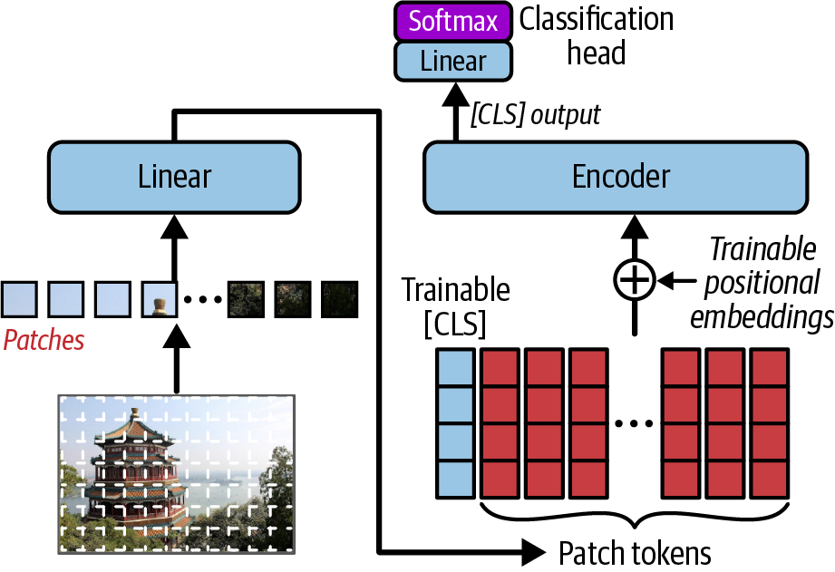

每個 patch 先映射成向量，加入位置資訊，再交給 Transformer encoder。

<!-- 來源／講者提示：書本 Ch.16，PDF 6，圖 16-3。圖為教材原圖，非本次實驗結果。 -->

---
<!-- _class: activity -->
## Patch 數量手算

224×224 的 RGB 影像，patch 為 16×16。

- 每邊 14 個 patch，共 $14²=196$ 個。
- 每個 patch 攤平為 $16×16×3=768$ 維。
- 加上 CLS token 後，序列長度為 197。

Patch 的原始維度與模型 embedding 維度可相同，也可不同。

<!-- 來源／講者提示：自編尺寸計算，對應Ch16 pp.5–10。 -->

---
<!-- _class: small -->
## 以 Conv2d 完成 patch embedding

```python
import torch
from torch import nn
patchify = nn.Conv2d(3, 192, kernel_size=16, stride=16)
X = torch.randn(2, 3, 224, 224)
tokens = patchify(X).flatten(2).transpose(1, 2)
print(tokens.shape)  # 預期 [2, 196, 192]
```

kernel 與 stride 相同，產生不重疊 patches；需先處理不能整除的影像尺寸。

作者程式：Cell 20（簡化）（`16_vision_and_multimodal_transformers.ipynb`）

<!-- 來源／講者提示：書本 Ch.16，PDF pp.5–10；程式依作者 16_vision_and_multimodal_transformers.ipynb Cell 20（簡化） 節錄或教學改寫，非完整獨立訓練腳本。 -->

---
## ViT 的模型結構導讀

作者 Notebook（`16_vision_and_multimodal_transformers.ipynb`）：Cells 20–22。

找到 patch embedding、CLS token、position embedding、encoder 與分類頭。

若影像解析度改變，patch 數與位置表也會改變，不能只修改輸入大小。

課堂先做隨機張量的形狀檢查，微調則使用作者後續 pretrained 範例。

<!-- 來源／講者提示：程式：Ch16 Cells20–39。 -->

---
<!-- _class: figure -->
## DeiT 的蒸餾 token

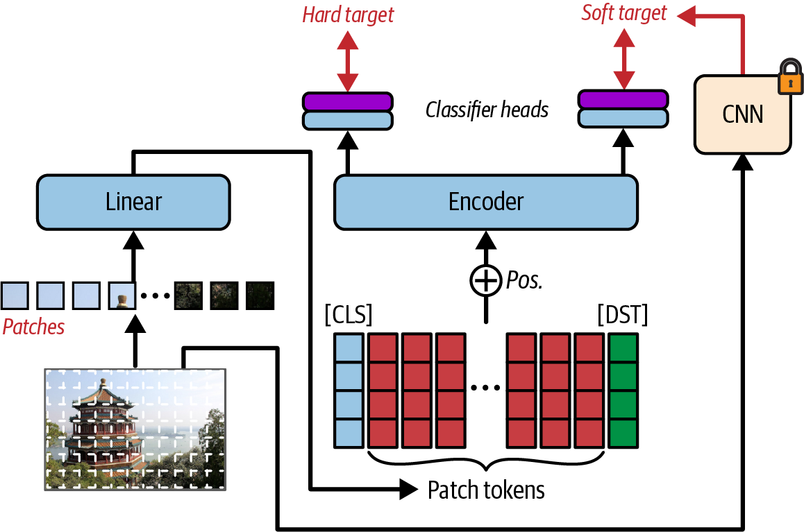

以教師模型提供額外監督；蒸餾讓學生能利用教師行為改善資料使用。

<!-- 來源／講者提示：書本 Ch.16，PDF 11，圖 16-4。圖為教材原圖，非本次實驗結果。 -->

---
<!-- _class: figure -->
## PVT 的金字塔表示

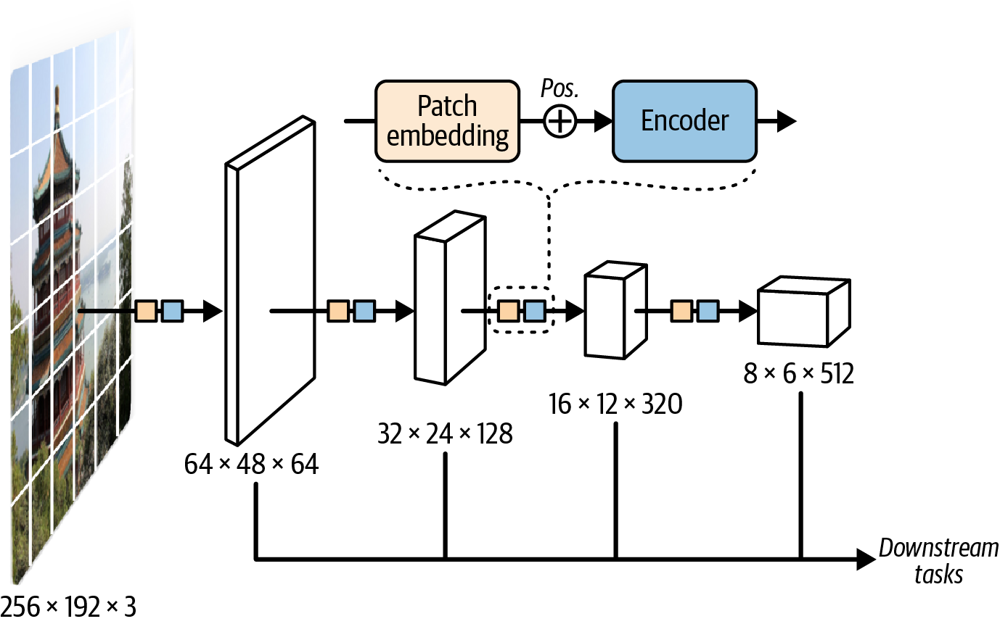

逐層改變空間解析度，產生適合密集預測的多尺度特徵。

<!-- 來源／講者提示：書本 Ch.16，PDF 12，圖 16-5。圖為教材原圖，非本次實驗結果。 -->

---
<!-- _class: figure -->
## Swin 的視窗注意力

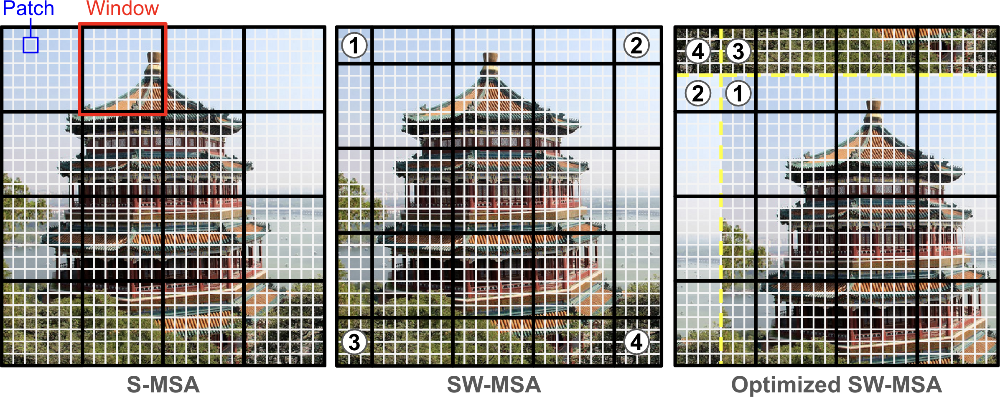

先限制在局部視窗內，再透過位移視窗讓不同區域交換資訊。

<!-- 來源／講者提示：書本 Ch.16，PDF 14，圖 16-6。圖為教材原圖，非本次實驗結果。 -->

---
## 全域與視窗注意力的成本

設影像共有 $N$ 個 token，每個視窗有 $M$ 個 token。

| 注意力方式 | 分數矩陣元素總數量級 |
| --- | --- |
| 全域 | $N²$ |
| 固定大小局部視窗 | $NM$ |

固定視窗大小時，局部注意力的分數成本隨 token 數近似線性增加。

<!-- 來源／講者提示：書本 Ch.16，PDF pp.11–15；忽略head與batch係數。 -->

---
<!-- _class: figure -->
## DINO 的自蒸餾

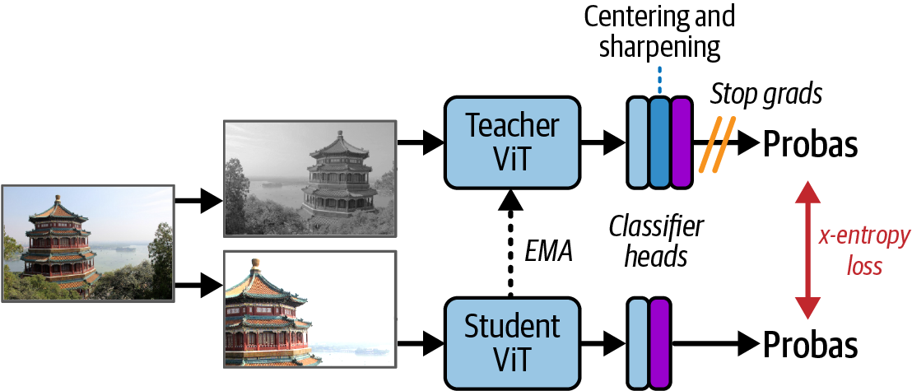

不同視角的學生與教師輸出互相對齊；教師通常以學生參數的移動平均更新。

<!-- 來源／講者提示：書本 Ch.16，PDF 16，圖 16-7。圖為教材原圖，非本次實驗結果。 -->

---
## 自監督表示與 attention 圖

作者 DINO 範例（`16_vision_and_multimodal_transformers.ipynb`）：Cells 40–45。

讀取 attention tensor 前，先確認 query 與 key 軸。

作者 Cell 44 使用 patch-to-CLS 的切片；不能直接標成 CLS-to-patch。

熱區是分析線索，不等於經過像素標註評估的完整分割器。

<!-- 來源／講者提示：書本 Ch.16，PDF pp.15–18；作者Cell44明確註記方向，教材保留此區別。 -->

---
## 其他視覺 Transformer 的路線

| 路線 | 教材例子 |
| --- | --- |
| 遮蔽影像學習 | BEiT、MAE、SimMIM |
| 大規模自監督表示 | DINO系列、iBOT |
| 減少token計算 | 合併、裁剪、選取patch |
| 擴大訓練 | 模型、資料與訓練配方共同調整 |

模型名稱很多，先辨認改的是資料、目標或架構。

<!-- 來源／講者提示：書本 Ch.16，PDF pp.18–20 -->

---
## 多模態的四種關係

| 問題 | 例子 |
| --- | --- |
| 對齊 | 找出與句子最相符的圖片 |
| 融合 | 同時看圖片與問題作答 |
| 生成 | 依圖片產生描述 |
| 條件生成 | 依文字產生影像 |

模態不同，不代表所有任務都需要同一種模型。

<!-- 來源／講者提示：書本 Ch.16，PDF pp.21–34 -->

---
## VideoBERT 與 ViLBERT

- VideoBERT 把影片與語言轉成可共同建模的序列。
- ViLBERT 分別處理視覺與文字，再以 co-attention 交換資訊。
- 預訓練可包含遮蔽 token 與跨模態配對目標。

讀圖時找出：哪些層只處理單一模態？哪些層讓兩者互動？

<!-- 來源／講者提示：書本 Ch.16，PDF pp.22–28 -->

---
<!-- _class: figure -->
## CLIP 的圖文對比學習

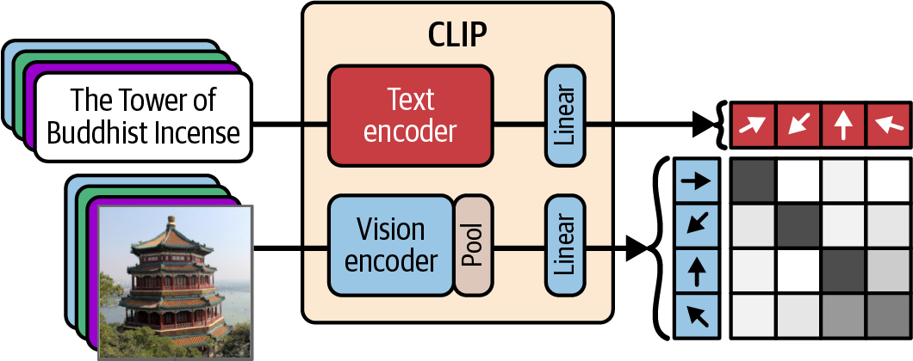

同一 batch 中，真實圖文配對拉近；其他配對作為對比訊號。

<!-- 來源／講者提示：書本 Ch.16，PDF 30，圖 16-13。圖為教材原圖，非本次實驗結果。 -->

---
## CLIP 的相似度矩陣

三張圖與三段配對文字，產生 3×3 相似度矩陣。

對角線是正配對；每列做圖找文，每欄做文找圖。

$$s_{ij}=\frac{u_i^\top v_j}{\tau}$$

此處 $u,v$ 已做長度正規化；溫度影響分數差異。

<!-- 來源／講者提示：書本 Ch.16，PDF pp.28–33；公式為教材對比學習概念的簡化記號。 -->

---
## Zero-shot 分類依賴候選文字

把類別寫成文字描述，再與影像向量比較。

「這是一張貓的照片」與「這是一張狗的照片」形成候選。

- 模板和語言會影響結果。
- 加入或刪除候選類別，正規化分數可能改變。
- 分數最高不表示模型能可靠辨認所有未知類別。

<!-- 來源／講者提示：書本 Ch.16，PDF pp.30–33 -->

---
<!-- _class: small -->
## CLIP 推論介面

```python
from transformers import pipeline
classifier = pipeline("zero-shot-image-classification",
                      model="openai/clip-vit-base-patch32")
result = classifier(image, candidate_labels=["cat", "dog", "bird"],
                    hypothesis_template="This is a photo of a {}.")
```

image 是已載入的 PIL RGB 影像；需下載模型。先比較不同文字模板，不重新訓練。

作者程式：Cell 49（改寫）（`16_vision_and_multimodal_transformers.ipynb`）

<!-- 來源／講者提示：書本 Ch.16，PDF pp.30–33；程式依作者 16_vision_and_multimodal_transformers.ipynb Cell 49（改寫） 節錄或教學改寫，非完整獨立訓練腳本。 -->

---
## DALL·E 與 DALL·E 2 的差異

教材以這兩個模型說明文字生成影像的不同路線：

- DALL·E：把文字與離散影像碼放入生成模型。
- DALL·E 2：利用 CLIP 表示連接文字條件與影像生成。

圖文對齊提供語意條件，生成器仍需學影像分布。

<!-- 來源／講者提示：書本 Ch.16，PDF pp.33–34；生成機制延伸至Ch18。 -->

---
<!-- _class: figure -->
## Perceiver 的 latent bottleneck

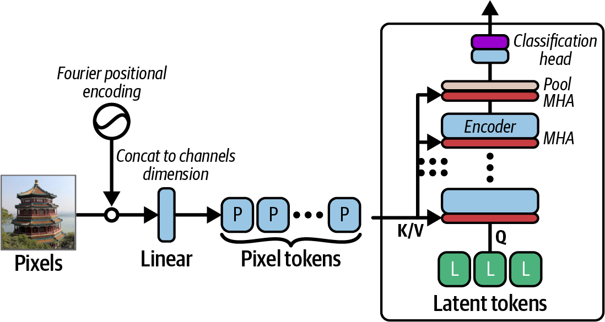

大量輸入先透過 cross-attention 進入較短的 latent 序列，再在 latent 中計算。

<!-- 來源／講者提示：書本 Ch.16，PDF 35，圖 16-15。圖為教材原圖，非本次實驗結果。 -->

---
## Perceiver IO 的輸出查詢

Perceiver IO 再利用 output queries 從 latent 讀出所需結果。

同一個 latent 表示可對應不同輸出形狀，例如類別或密集預測。

- 輸入長度與 latent 長度不必相同。
- 輸出位置可以用查詢指定。
- 成本仍含跨輸入與 latent 的注意力運算。

<!-- 來源／講者提示：書本 Ch.16，PDF pp.34–40；作者FourierPositionalEncoding與Perceiver區段。 -->

---
<!-- _class: figure -->
## Flamingo 的交錯圖文輸入

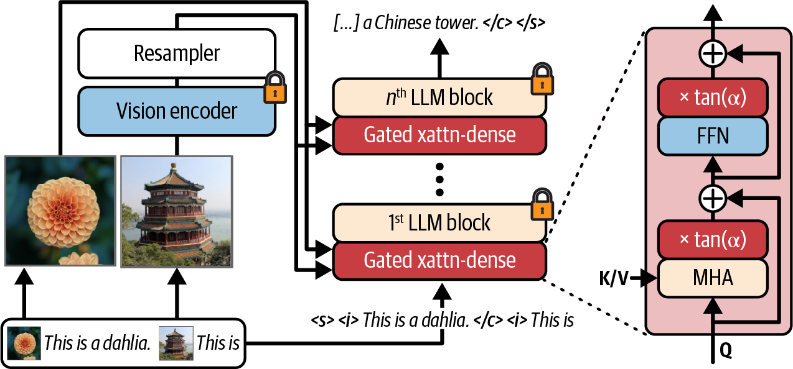

用視覺表示與語言模型互動，處理文字與圖片交錯的上下文。

<!-- 來源／講者提示：書本 Ch.16，PDF 41，圖 16-17。圖為教材原圖，非本次實驗結果。 -->

---
## BLIP 與 BLIP-2 的銜接

BLIP 結合圖文理解與生成，也用 captioning／filtering 改善圖文配對資料。

BLIP-2 進一步重用凍結的視覺與語言主幹，用 Q-Former 學兩者之間的連接。

兩者都處理圖文任務，但資料處理與可訓練模組的設計不同。

<!-- 來源／講者提示：書本 Ch.16，PDF pp.42–47 -->

---
<!-- _class: figure -->
## BLIP-2 的 Q-Former

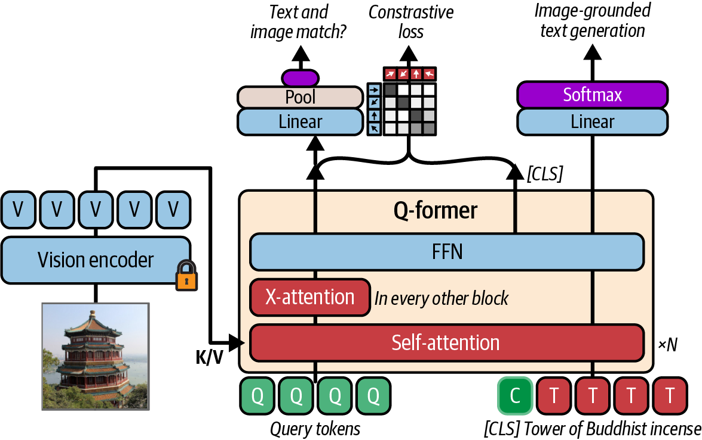

以較小的連接模組把視覺資訊整理成語言模型可使用的表示。

<!-- 來源／講者提示：書本 Ch.16，PDF 43，圖 16-18。圖為教材原圖，非本次實驗結果。 -->

---
## BLIP-2 的兩階段學習

1. 先讓可學習 query 與視覺特徵互動，學會有用的圖文表示。
2. 再將 query 表示映射至語言模型輸入空間。

凍結大型主幹可減少要更新的參數，但前向計算仍需要資源。

作者 Cells 73–75 提供讀圖生成文字範例，完整模型需較多記憶體。

<!-- 來源／講者提示：書本 Ch.16，PDF pp.42–47 -->

---
## 舊稿圖片描述程式的閱讀路線

`11_Image Captioning.pptx` s.14–25 提供：

| 部分 | 要追蹤的資料 |
| --- | --- |
| Vocabulary／Dataset | token字典、影像與caption配對 |
| CNN encoder | 區域特徵或整張圖特徵 |
| RNN decoder | 位移後的文字、hidden state |
| Attention | 每一步對影像區域的加權 |

與 BLIP-2 比較哪些部分預訓練、哪些部分需任務資料。

<!-- 來源／講者提示：補充：11_Image Captioning.pptx s.14–25；重複中文檔為同主題來源，不另當課程順序。 -->

---
## 其他多模態任務的分類

| 任務方向 | 書中例子 |
| --- | --- |
| 文件與版面 | LayoutLM |
| 視覺定位與問答 | GLIP、LLaVA、PaLI、Qwen-VL |
| 多模態對齊 | ImageBind |
| 語音翻譯 | SeamlessM4T |
| 動作或影片 | RT-2、EMO |

此表定位研究問題，不將書中的版本或能力描述當即時排名。

<!-- 來源／講者提示：書本 Ch.16，PDF pp.47–49；其他命名模型採選讀。 -->

---
## 多模態評估：看得見與推測的差別

同一張桌面照片可能讓模型「補出」不存在的物件。

- 分開評估物件、數量、空間關係與文字辨識。
- 把遮擋、低解析度與看不清楚的情況列入測試。
- 讓回答指出可見證據與不確定部分。

照片中的文字也可能是惡意指令，應當作待分析內容。

<!-- 來源／講者提示：自編評估活動，銜接Ch16多模態應用。 -->

---
<!-- _class: activity -->
## 課堂活動：圖片檢索與描述

20 分鐘，使用教師提供的 6 張圖片與 6 段描述。

1. 設計 CLIP 圖文配對的正確答案表。
2. 加入一段容易混淆的描述，說明評估方法。
3. 為生成式描述另定「捏造物件」與「漏掉物件」檢查。

交付：兩種任務的輸出與指標，不能只比較文字是否好看。

<!-- 來源／講者提示：自編活動。 -->

---
## 離堂檢核

- 224×224、patch16 的 token 數是多少？
- CLIP 是否會直接產生完整描述句？
- 短 latent 序列為何有助降低成本？
- 為何 attention 熱區不能取代完整正確性驗證？

<!-- 來源／講者提示：自編檢核；196，加CLS為197；CLIP比對；避免對全部輸入反覆self-attention；權重不等於因果證據。 -->

---
<!-- _class: small -->
## 課後程式與延伸閱讀

- 作者第 16 章 Notebook（`16_vision_and_multimodal_transformers.ipynb`）：先執行 Setup，再定位本課指定區段。
- 舊稿 `11_Image Captioning.pptx` 與 `機器學習-08-Image Captioning.pptx`：CNN／RNN 圖片描述與 attention。

程式來源依教材核對版本標示；執行前確認資料、套件與運算資源。

<!-- 來源／講者提示：來源：作者 notebook 固定 commit 47eba45aacc85feae51ba7db68dd1ca66cb25e0a；Cell 編號從 0 起算。範例片段以讀碼為主，完整依賴見 notebook。 -->
