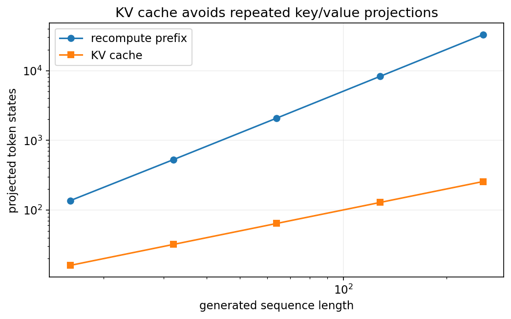
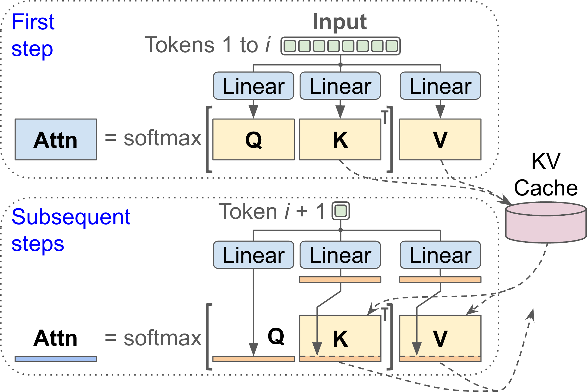
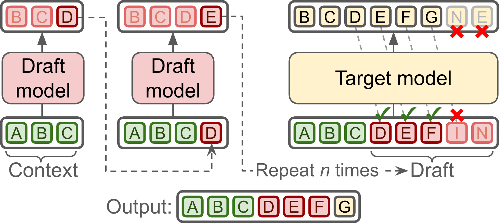
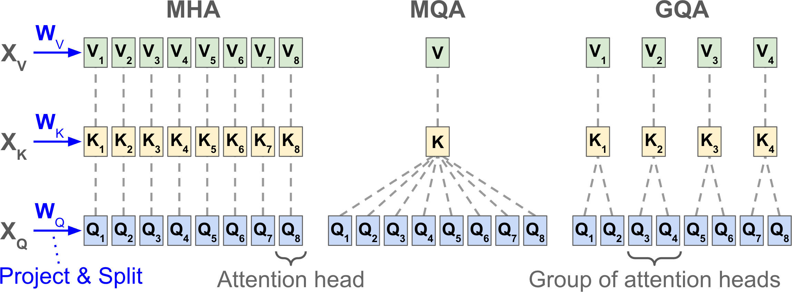
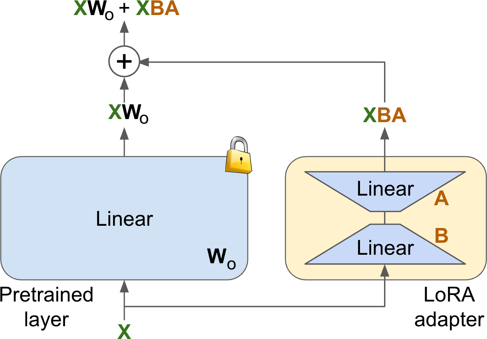
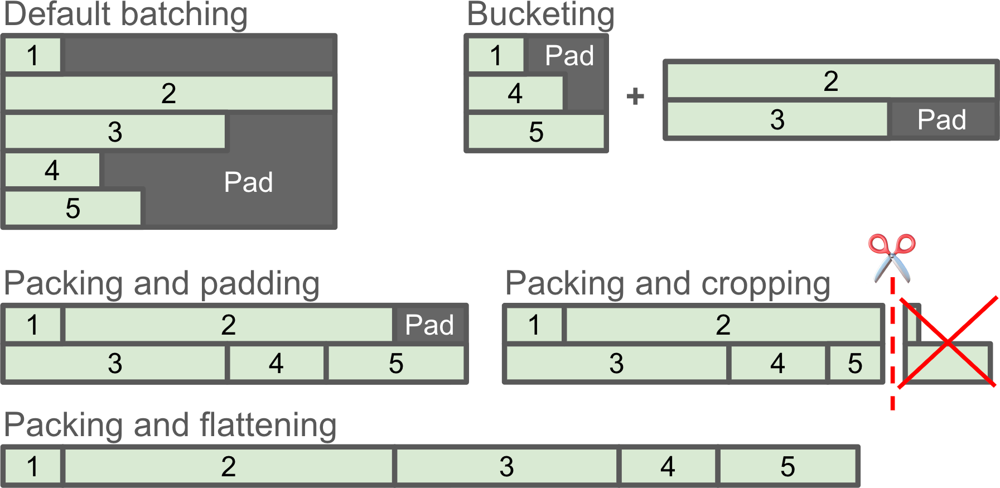

<!-- _class: cover -->
# Transformer 加速：推論與參數高效微調

## KV cache、注意力成本、LoRA 與訓練記憶體

書本第 17 章

建議 180 分鐘，含活動與休息

<!-- 來源／講者提示：自編章節導入 -->

---
## 教材範圍與學習成果

本地第 17 章 PDF 是兩頁導讀；完整章節在作者網站。

[作者公開線上章節](https://ageron.github.io/homlp/HOMLP_Chapter_17.pdf)

本課依導讀與作者 Notebook 展開：解碼加速、注意力、MoE、PEFT 與平行訓練。

成果：能辨認瓶頸，說明速度、記憶體與品質的取捨。

<!-- notebook-companion-link -->
> 💻 **配套 Notebook**：`programs/notebooks/21_Transformer加速_推論與參數高效微調.ipynb`。程式片段、實際圖表與表格可由此檔重現。

<!-- 來源／講者提示：書本：本地Ch17 pp.1–2；線上版PDF共65頁，正文由第5頁起。 -->

---
<!-- notebook-result-slide -->
<!-- _class: small -->
## 程式實驗與實際輸出

<div class="columns wide-left">
<div>

```python
lora_params = r * (d_in + d_out)
full_params = d_in * d_out
```

**觀察**：r=8、d=4096 時，LoRA 訓練 65,536 個參數，約為完整矩陣的 0.391%。

參考程式：`programs/notebooks/21_Transformer加速_推論與參數高效微調.ipynb`

</div>
<div>



</div>
</div>

<!-- 講者提示：程式與圖均來自 programs/notebooks/21_Transformer加速_推論與參數高效微調.ipynb 的已執行輸出；來源與改編界線見 Notebook。 -->
---
## 課堂安排與量測對象

- 0–50 分：prefill、decode、KV cache 與推測解碼。
- 60–110 分：稀疏／近似注意力、共享投影與 MoE。
- 120–180 分：LoRA、記憶體管理與實驗設計。

兩次休息各 10 分鐘。速度報告要列硬體、dtype、batch 與序列長度。

<!-- 來源／講者提示：自編教學安排；作者Ch17 Notebook結構。 -->

---
## 先辨認瓶頸

| 現象 | 優先量測 |
| --- | --- |
| 等很久才出第一字 | prefill時間與提示長度 |
| 後續輸出很慢 | 每token解碼延遲 |
| 多人同時用就變慢 | batching、吞吐與排隊 |
| 訓練記憶體不足 | 權重、梯度、狀態與activation |

降低參數量與改善執行方式，解決的成本項可能不同。

<!-- 來源／講者提示：自編瓶頸表；本地Ch17導讀與作者Notebook加速分類。 -->

---
<!-- _class: figure -->
## KV cache 重用先前的投影



只計算新 token 的 query，並把新 key／value 接到快取尾端。

<!-- 來源／講者提示：書本：線上Ch17 PDF 7，圖 17-1。圖為教材原圖，非本次實驗結果。 -->

---
## 為何不必快取全部 Q

因果模型新增 token 時，先前位置的表示不需受未來 token 改變。

要產生新位置的輸出，需要它自己的 Q 與所有可見的 K／V。

Cache 減少重複計算，但序列越長，保存的 K／V 仍持續成長。

<!-- 來源／講者提示：書本：本地Ch17導讀；程式：作者Cell18 use_cache對照；線上圖17-1。 -->

---
<!-- _class: activity -->
## KV cache 記憶體手算

估算：$2×B×L×N_{layers}×H_{kv}×d_{head}×bytes$。

例：$B=1,L=4096,N=32,H_{kv}=8,d=128$，每值 2 bytes。

共 $536,870,912$ bytes，約 512 MiB。

這只計 K／V 儲存；未含權重、allocator 與其他張量。

<!-- 來源／講者提示：自編尺寸估算；2代表K和V。 -->

---
<!-- _class: small -->
## Cache 的功能比較

```python
# model、inputs 已依作者 Cell18 載入與tokenize
model.eval()
with torch.no_grad():
    for enabled in (False, True):
        ids = model.generate(**inputs, max_new_tokens=50,
                             do_sample=False, use_cache=enabled)
        print(enabled, ids.shape)
```

先確認同條件下輸出，再量測速度；第一次載入或編譯不要混入穩態時間。

作者程式：Cell 18（改寫）（`17_speeding_up_transformers.ipynb`）

<!-- 來源／講者提示：書本 Ch.17，PDF 本地pp.1–2；作者KV Caching；程式依作者 17_speeding_up_transformers.ipynb Cell 18（改寫） 節錄或教學改寫，非完整獨立訓練腳本。 -->

---
<!-- _class: figure -->
## 推測解碼先提案再驗證



小模型提出一段候選，大模型批次驗證；能接受多少 token 影響效益。

<!-- 來源／講者提示：書本：線上Ch17 PDF 10，圖 17-2。圖為教材原圖，非本次實驗結果。 -->

---
## Greedy 與抽樣的驗證不同

Greedy 可逐位置比較目標模型的最佳 token，第一個不符後重新接續。

抽樣版本需依接受率與修正分布處理，不能只比 argmax。

相同分布的保證取決於正確的演算法、tokenizer 與設定。

低接受率時，提案成本可能抵銷節省。

<!-- 來源／講者提示：程式：作者Cell20 assistant_model；本地Ch17推測解碼導讀，圖17-2為greedy教學。 -->

---
## 平行生成與動態批次

| 方法 | 想降低的等待 |
| --- | --- |
| 多token提案／平行解碼 | 每次只產生一token的序列依賴 |
| Dynamic batching | 多個請求分別執行的低利用率 |
| In-flight batching | 等待整批最長序列結束的空轉 |

不同請求的長度會變，排程也會影響延遲分布。

<!-- 來源／講者提示：書本：線上Ch17 pp.12–14導讀；自行整理方法角色。 -->

---
## 注意力分數的平方成本

若 $L=8192$，單一 head 的完整分數有 $L²=67,108,864$ 個值。

只用 FP16 保存它約需 128 MiB；多個 head 與 batch 還要乘上去。

不一定每種 kernel 都真的建立完整矩陣，這正是實作最佳化的切入點。

<!-- 來源／講者提示：自編成本計算；本地Ch17 attention導讀。 -->

---
## 稀疏注意力：限制可見位置

| 模式 | 連接方式 |
| --- | --- |
| 局部／擴張 | 看鄰近位置或間隔位置 |
| 全域token | 讓指定位置連到整段 |
| 隨機連接 | 增加遠距訊息路徑 |
| 內容路由 | 依內容把相似token分組 |

<!-- 來源／講者提示：程式：作者BigBird Cells22–24；書本本地Ch17 sparse attention導讀，線上章節sparse目錄。 -->

---
## 近似注意力的不同路線

| 路線 | 書中例子 |
| --- | --- |
| Hashing 分組 | Reformer |
| 低秩投影 | Linformer |
| Kernel 特徵近似 | Performer |

近似會改變計算方式或結果，應與原始注意力比較品質、誤差與實際成本。

<!-- 來源／講者提示：程式：作者Cells25–45；Linformer為線上章節低秩注意力補充。 -->

---
## Performer 的重排概念

若 $\operatorname{softmax}$ kernel 可用特徵映射近似，則可先算

$$\phi(Q)\bigl(\phi(K)^\top V\bigr)$$

避免先形成完整 $L×L$ 矩陣，但仍需對應的正規化分母。

特徵數、近似誤差與數值穩定性是實驗的一部分。

<!-- 來源／講者提示：程式：作者Cells29–45，隨機特徵推導；此式省略分母並在文字明示。 -->

---
<!-- _class: figure -->
## MHA、MQA 與 GQA



減少 K／V 的 head 數，讓多個 query heads 共用投影與快取。

<!-- 來源／講者提示：書本：線上Ch17 PDF 36，圖 17-11。圖為教材原圖，非本次實驗結果。 -->

---
## 共享 K／V 的尺寸比較

設 query heads 為 8，每頭 64 維。

| 方法 | K／V heads | 每token的K與V元素數 |
| --- | --- | --- |
| MHA | 8 | $2×8×64=1024$ |
| GQA | 2 | $2×2×64=256$ |
| MQA | 1 | $2×1×64=128$ |

這是 K／V 快取比較，不代表整個模型同倍縮小。

<!-- 來源／講者提示：自編計算；作者Cells48、50。 -->

---
<!-- _class: small -->
## GQA 的讀碼尺寸

```python
import torch
import torch.nn.functional as F
Q = torch.randn(2, 8, 10, 64)
K = torch.randn(2, 2, 10, 64)
V = torch.randn(2, 2, 10, 64)
Y = F.scaled_dot_product_attention(Q, K, V, enable_gqa=True)
```

預期 Y 為 `[2,8,10,64]`；需支援 GQA 的版本與 backend，此例未加因果遮罩。

作者程式：Cell 50（縮小張量）（`17_speeding_up_transformers.ipynb`）

<!-- 來源／講者提示：書本 Ch.17，PDF 本地pp.1–2；作者Sharing Projections；程式依作者 17_speeding_up_transformers.ipynb Cell 50（縮小張量） 節錄或教學改寫，非完整獨立訓練腳本。 -->

---
## MLA 與潛在快取（選讀）

把 key／value 所需資訊壓到較小的 latent 表示，再配合投影使用。

與 MQA／GQA 直接共用 head 的方式不同。

評估時同時追蹤快取尺寸與重建／投影的運算成本。

<!-- 來源／講者提示：書本：線上Ch17圖17-12與共享投影段；選讀概念，不提供未驗證實作。 -->

---
## FlashAttention 的重點

以分塊計算與 online Softmax，減少 GPU 記憶體讀寫與大型中間矩陣。

數學上仍計算完整注意力；浮點誤差可能與其他 kernel 不同。

作者 Notebook 的 Python 範例用來理解原理，不是高效 GPU kernel。

<!-- 來源／講者提示：程式：作者Cells51–57；Cell54指出toy實作只處理長度可整除block的情況。 -->

---
## 分塊 Softmax 的穩定性

直接計算 $\exp(s)$ 可能溢位，因此先減去目前最大值。

跨區塊合併時，需同步調整先前累積的分母與加權和。

若只把每塊各自 Softmax 後串接，總和與完整 Softmax 不一致。

<!-- 來源／講者提示：程式：作者flash_attention Cell53；自編錯誤辨識題。 -->

---
## MoE 的稀疏啟用

Router 對每個 token 選少數 experts，常用來替換 FFN。

- 總參數量可大於每次實際啟用的參數量。
- Expert 分配不均會造成部分裝置忙碌、部分閒置。
- 跨裝置傳送 token 帶來通訊成本。

「啟用少」不代表所有權重都不用存放。

<!-- 來源／講者提示：書本：本地Ch17 MoE導讀；線上章節MoE段。作者Notebook此標題下實際接LoRA，無完整MoE實作。 -->

---
## MoE 的訓練問題（選讀）

容量限制、負載平衡與 router 穩定性都影響結果。

可用負載相關的輔助損失或其他平衡策略，避免 token 全擠到少數 experts。

報告總參數、啟用參數、延遲與通訊量，比只列參數總數更有意義。

<!-- 來源／講者提示：書本：線上Ch17 MoE目錄所列挑戰；自行整理觀察項目。 -->

---
<!-- _class: figure -->
## LoRA 的低秩參數更新



凍結原權重，以兩個較小矩陣描述新增的權重變化。

<!-- 來源／講者提示：書本：線上Ch17 PDF 51，圖 17-15。圖為教材原圖，非本次實驗結果。 -->

---
<!-- _class: activity -->
## LoRA 的參數量手算

$$W^{\prime}=W+\frac{\alpha}{r}BA$$

$W$ 為 4096×4096；若 $r=8$，A 與 B 共需
$4096×8+8×4096=65,536$ 個參數。

完整 W 有 16,777,216 個參數，新增部分約為其 0.39%。

低秩更新節省可訓練參數與 optimizer 狀態；仍要載入主幹。

<!-- 來源／講者提示：自編數例；作者Cell59 PEFT配置。 -->

---
<!-- _class: small -->
## PEFT：指定要加 LoRA 的模組

```python
from peft import LoraConfig, get_peft_model
config = LoraConfig(r=16, lora_alpha=32,
                    target_modules=["q_proj", "v_proj"],
                    lora_dropout=0.05, bias="none",
                    task_type="CAUSAL_LM")
peft_model = get_peft_model(model, config)
peft_model.print_trainable_parameters()
```

model 是相容的已載入因果語言模型；模組名稱須與模型實際結構一致。

作者程式：Cell 59（節錄）（`17_speeding_up_transformers.ipynb`）

<!-- 來源／講者提示：書本 Ch.17，PDF 本地pp.1–2；作者LoRA實作；程式依作者 17_speeding_up_transformers.ipynb Cell 59（節錄） 節錄或教學改寫，非完整獨立訓練腳本。 -->

---
## Adapters 與其他 PEFT 方法

| 方法 | 訓練的位置 |
| --- | --- |
| Adapter | 插入的小型模組 |
| LoRA | 權重更新的低秩分支 |
| Prompt／prefix tuning | 可學習的連續提示表示 |

與人工 few-shot prompting 不同：這些方法包含參數訓練。

<!-- 來源／講者提示：書本：本地Ch17 PEFT導讀；作者LoRA段延伸比較。 -->

---
## Activation checkpointing

只保存部分中間結果，在反向傳播時重算其他部分。

優點：降低 activation 記憶體。
代價：增加前向重算時間。

不是儲存模型檔案的 checkpoint；也不會自動減少 optimizer 狀態。

<!-- 來源／講者提示：書本：本地Ch17 activation checkpointing導讀。 -->

---
<!-- _class: figure -->
## Packing 與 bucketing 減少補值



Packing 串接短序列，bucketing 把相近長度分組；兩者仍須維持正確遮罩。

<!-- 來源／講者提示：書本：線上Ch17 PDF 55，圖 17-16。圖為教材原圖，非本次實驗結果。 -->

---
## Packing 的文件邊界

兩段獨立文件放入同一序列後，要依訓練目標處理文件邊界。

若不希望彼此影響，需 block attention 與適當位置／標籤遮罩。

只拼接 token 卻保留普通 causal mask，第二段就可能讀到第一段。

<!-- 來源／講者提示：自編資料處理檢核；本地Ch17 sequence packing導讀。 -->

---
## Gradient accumulation

多個 microbatch 累積梯度後才更新一次參數。

4 個各 8 筆的 microbatch，名義 effective batch 為 32。

損失的縮放與最後不足一組的資料都要處理。

有 BatchNorm、Dropout 或不等長 token 時，不保證與一次大 batch 完全等價。

<!-- 來源／講者提示：程式：作者Cell63；原例100batch可被4整除，課堂擴充討論尾組。 -->

---
<!-- _class: small -->
## 累積梯度：處理最後不足一組

```python
# 示範每個microbatch樣本數相同，loss是batch平均
for start in range(0, len(batches), 4):
    group = batches[start:start + 4]
    optimizer.zero_grad()
    for X, y in group:
        loss = criterion(model(X), y) / len(group)
        loss.backward()
    optimizer.step()
```

batches 是可索引的小型教學資料；不等樣本數時需依實際樣本數加權。

作者程式：Cell 63（修正尾組的教學改寫）（`17_speeding_up_transformers.ipynb`）

<!-- 來源／講者提示：書本 Ch.17，PDF 本地pp.1–2；作者Gradient Accumulation；程式依作者 17_speeding_up_transformers.ipynb Cell 63（修正尾組的教學改寫） 節錄或教學改寫，非完整獨立訓練腳本。 -->

---
## 平行訓練的切分方式

| 方式 | 切分什麼 | 主要代價 |
| --- | --- | --- |
| Data parallel | 每台處理不同樣本 | 梯度同步 |
| Tensor parallel | 同一層的張量運算 | 層內通訊 |
| Pipeline parallel | 不同層放不同裝置 | pipeline空轉與排程 |
| 狀態分片 | 參數／梯度／optimizer狀態 | 蒐集與同步 |

<!-- 來源／講者提示：書本：本地Ch17 parallelism導讀；線上章節平行訓練段。 -->

---
<!-- _class: activity -->
## 課堂活動：兩種瓶頸的方案

20 分鐘，分別處理：

A. 推論長對話越來越占記憶體。
B. 微調時反向傳播發生記憶體不足。

每題選兩種方法，指出減少哪項成本、增加哪項成本，以及如何驗證答案品質。

交付：固定硬體與輸入條件的比較表，不填尚未量測的倍速。

<!-- 來源／講者提示：自編活動。 -->

---
## 離堂檢核

- KV cache 為何會隨對話長度增加？
- GQA 改變的是所有參數還是特定投影？
- FlashAttention 是否必然使用近似注意力？
- LoRA 與 gradient accumulation 分別節省什麼？

<!-- 來源／講者提示：自編檢核；快取位置增加；K/V共享；否；可訓練狀態與單次activation峰值。 -->

---
<!-- _class: small -->
## 課後程式與延伸閱讀

- 作者第 17 章 Notebook（`17_speeding_up_transformers.ipynb`）：先執行 Setup，再定位本課指定區段。
- 舊稿 `10_Attention.pptx` s.71 的 Reformer 作概念銜接；完整章節以作者線上補充與 Notebook 為主。

程式來源依教材核對版本標示；執行前確認資料、套件與運算資源。

<!-- 來源／講者提示：來源：作者 notebook 固定 commit 47eba45aacc85feae51ba7db68dd1ca66cb25e0a；Cell 編號從 0 起算。範例片段以讀碼為主，完整依賴見 notebook。 -->
