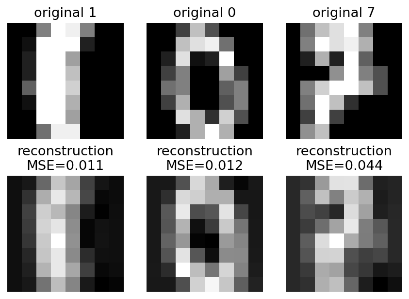
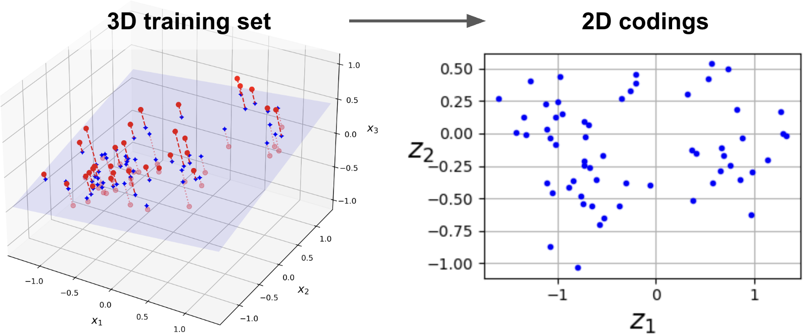
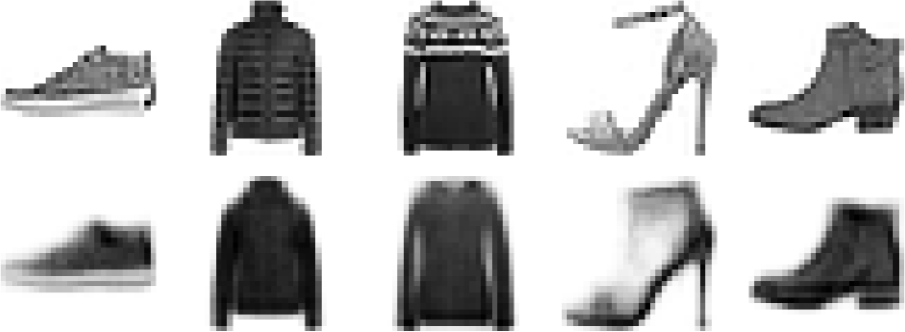
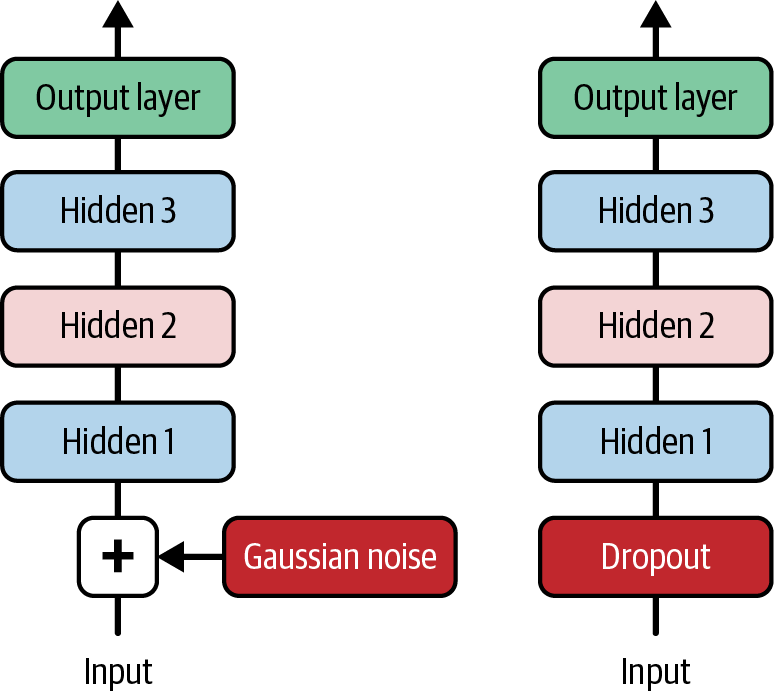
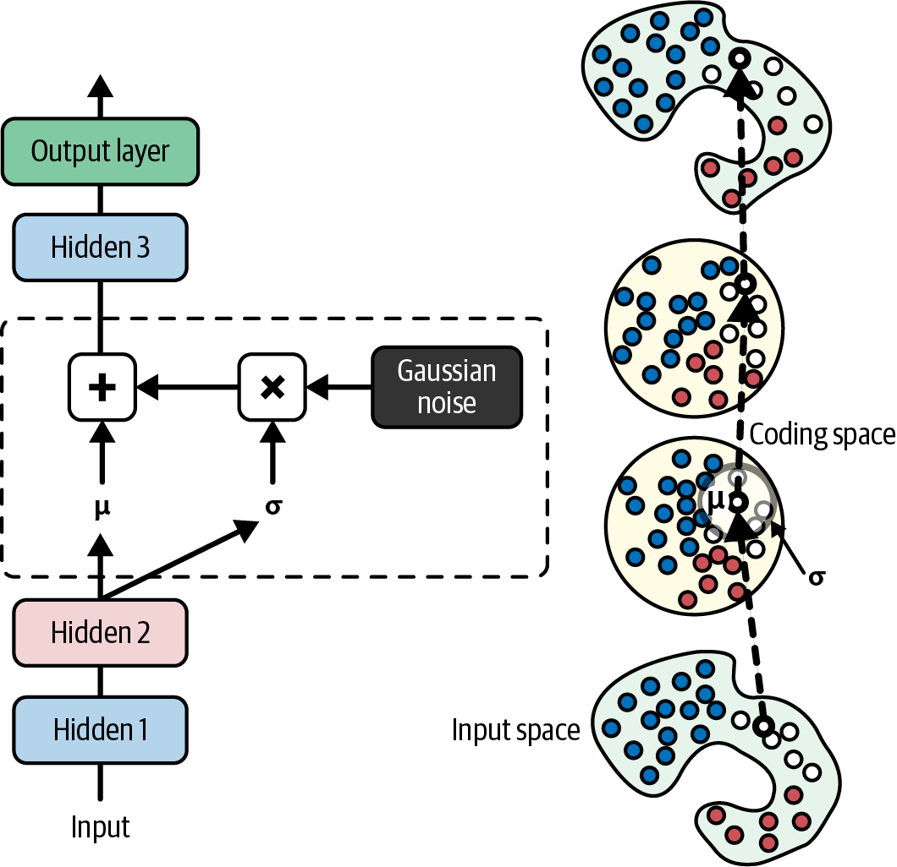
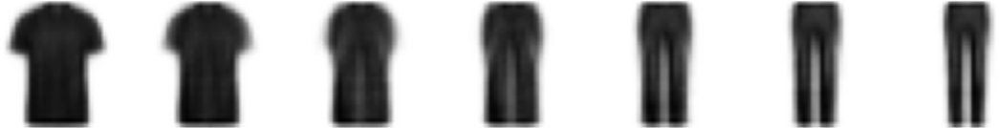
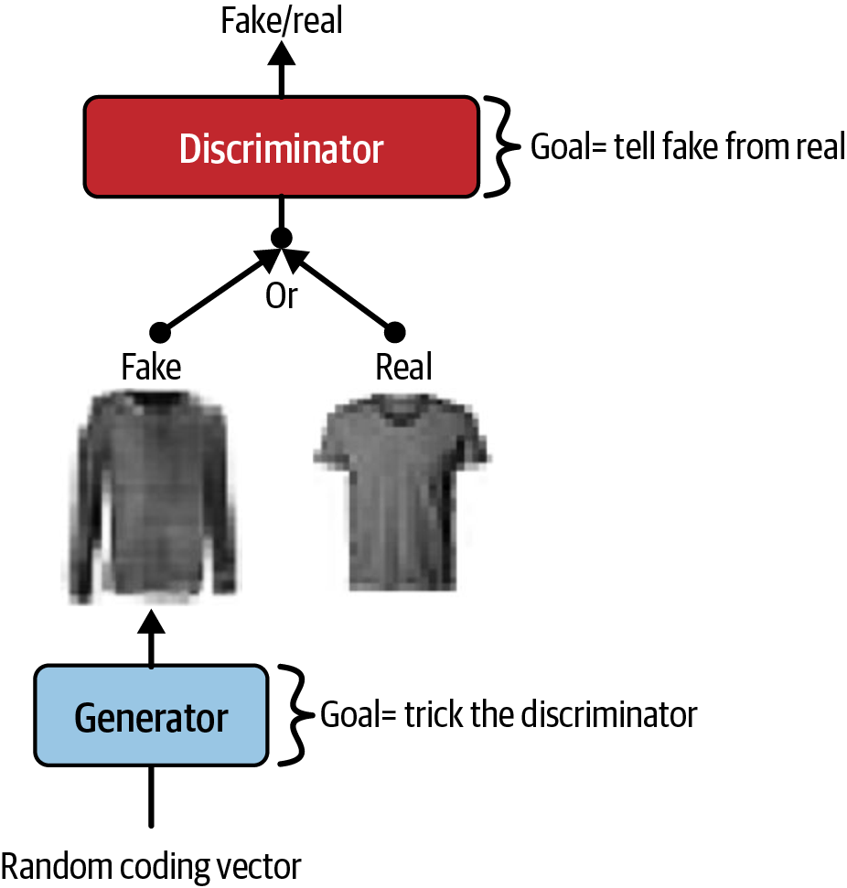
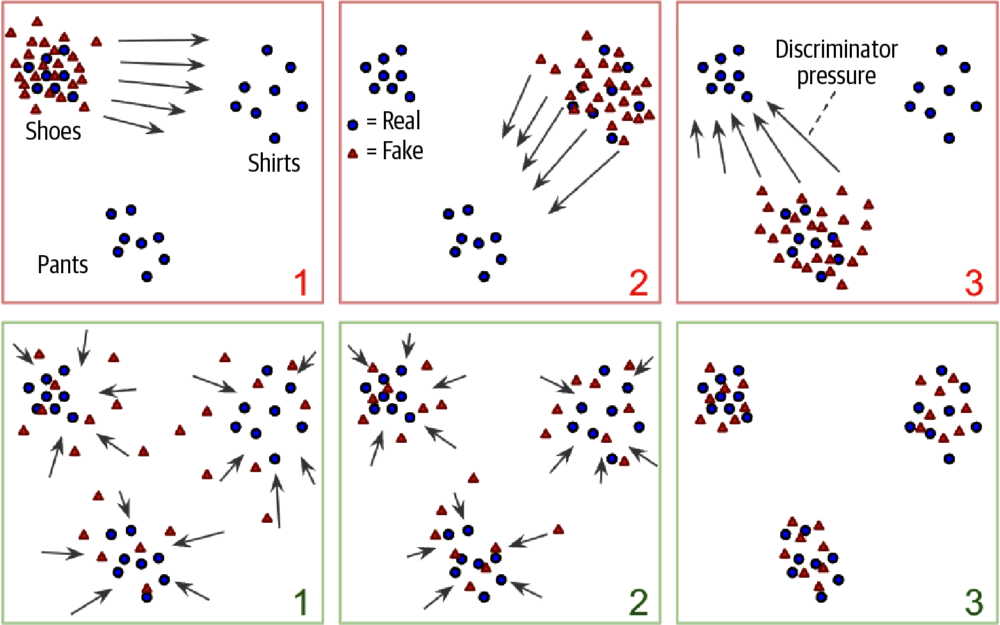
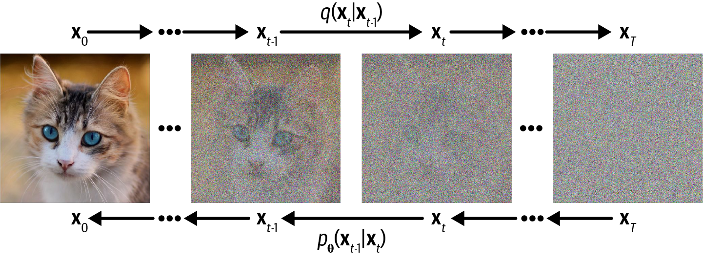
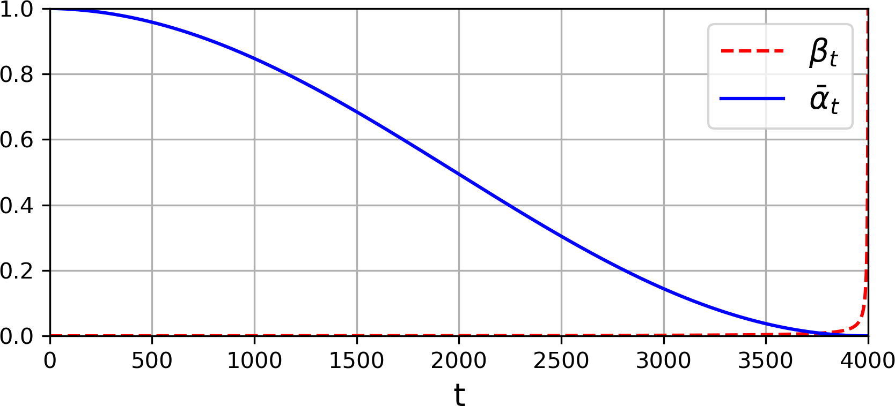

<!-- _class: cover -->
# 生成模型：自編碼器、GAN 與擴散

## 表示學習、潛在空間與影像生成

書本第 18 章

建議 240 分鐘，含活動與休息

<!-- 來源／講者提示：自編章節導入 -->

---
## 學習成果與課堂安排

本份可分兩次各 120 分鐘，總計含兩次 10 分鐘休息。

- 前半：表示學習、AE、去噪、稀疏與 VAE。
- 後半：離散表示、GAN、擴散與條件生成。

成果：能區分重建與生成，寫出主要損失，解讀生成失敗的原因。

<!-- notebook-companion-link -->
> 💻 **配套 Notebook**：`programs/notebooks/22_生成模型_自編碼器GAN與擴散.ipynb`。程式片段、實際圖表與表格可由此檔重現。

<!-- 來源／講者提示：書本 Ch.18，PDF pp.1–46；大模型訓練安排課後選做。 -->

---
<!-- notebook-result-slide -->
<!-- _class: small -->
## 程式實驗與實際輸出

<div class="columns wide-left">
<div>

```python
Z = encoder(X)
X_hat = decoder(Z)
```

**觀察**：線性欠完備自編碼器的教學對照使用 PCA；重建誤差揭示壓縮會捨棄資訊。

參考程式：`programs/notebooks/22_生成模型_自編碼器GAN與擴散.ipynb`

</div>
<div>



</div>
</div>

<!-- 講者提示：程式與圖均來自 programs/notebooks/22_生成模型_自編碼器GAN與擴散.ipynb 的已執行輸出；來源與改編界線見 Notebook。 -->
---
## 重建與生成的差別

| 任務 | 輸入 | 輸出 |
| --- | --- | --- |
| 重建 | 一筆真實資料 | 對原資料的近似 |
| 去噪 | 受干擾資料 | 乾淨資料的近似 |
| 生成 | 潛在樣本或噪聲 | 新的資料樣本 |

重建誤差很小，不代表隨便抽一個潛在向量也能得到合理樣本。

<!-- 來源／講者提示：書本 Ch.18，PDF pp.1–6、21–26 -->

---
## Autoencoder 的表示學習

$$z=f_\theta(x),\qquad\hat x=g_\phi(z)$$

Encoder 壓縮或轉換資料；decoder 從表示重建輸入。

需要瓶頸、噪聲或其他限制，避免只學會沒有用途的複製。

標籤可以就是輸入本身，但評估仍須使用未參與訓練的資料。

<!-- 來源／講者提示：書本 Ch.18，PDF pp.3–6 -->

---
<!-- _class: figure -->
## 線性 Autoencoder 與 PCA



適當條件下，線性瓶頸模型學到與 PCA 相同的主要子空間；座標軸不必相同。

<!-- 來源／講者提示：書本 Ch.18，PDF 6，圖 18-2。圖為教材原圖，非本次實驗結果。 -->

---
## 與本地 PCA 程式的連結

MachineLearning2025：PCA from scratch（`programs/upstream/MachineLearning2025/04_PCA_from_scratch.py`）

- 找到中心化／標準化、協方差矩陣、特徵分解與投影。
- 線性 AE 使用 MSE、沒有非線性，瓶頸維度設為相同。
- 必須在相同前處理與資料尺度下比較重建誤差。

PCA 主成分可變號，AE 也可能使用不同基底；不要直接要求 latent 值逐格相同。

<!-- 來源／講者提示：補充：本地PCA檔17–40行；Ch18 pp.5–6。原檔產生10筆資料，註解的100筆不作依據；繪圖需另處理字型。 -->

---
## SVD 程式的可用部分與限制

MachineLearning2025：SVD_Decomposition（`programs/upstream/MachineLearning2025/04_SVD_from_scratch.py`）

可讀 `fit()` 的中心化與主方向、`transform()` 的投影。

原檔用協方差特徵值的平方根命名 `sigma`；資料矩陣的奇異值應為 $\sqrt{(n-1)\lambda}$。

本課用它對照主子空間，不把原檔 U／sigma 直接當標準 SVD 結果。

<!-- 來源／講者提示：補充：04_SVD_from_scratch.py 第20–37行，協方差除以n-1，U因此未採標準正交尺度；未修改原程式。 -->

---
<!-- _class: small -->
## 線性 AE 的最小結構

```python
import torch
from torch import nn
encoder = nn.Linear(3, 2)
decoder = nn.Linear(2, 3)
autoencoder = nn.Sequential(encoder, decoder)
X = torch.randn(8, 3)
loss = nn.MSELoss()(autoencoder(X), X)
```

這只示範模型與損失；需訓練收斂後才能與 PCA 比較。

作者程式：Cell 22（教學改寫）（`18_autoencoders_gans_and_diffusion_models.ipynb`）

<!-- 來源／講者提示：書本 Ch.18，PDF pp.5–6；程式依作者 18_autoencoders_gans_and_diffusion_models.ipynb Cell 22（教學改寫） 節錄或教學改寫，非完整獨立訓練腳本。 -->

---
## Stacked AE 的瓶頸

多層非線性 encoder 與 decoder 可學彎曲的低維表示。

書中 Fashion MNIST 使用 784 維像素與 32 維編碼。

若用 Sigmoid 輸出，資料與目標應配合 0 到 1 的範圍。

瓶頸太小可能丟失重要細節，太大則容易記住輸入。

<!-- 來源／講者提示：書本 Ch.18，PDF pp.6–9；作者Cell33。 -->

---
<!-- _class: figure -->
## 重建圖要與原圖成對檢查



觀察哪些細節消失、哪些類別重建較差；平均 MSE 無法完整描述視覺品質。

<!-- 來源／講者提示：書本 Ch.18，PDF 9，圖 18-4。圖為教材原圖，非本次實驗結果。 -->

---
## AE 異常偵測的假設

用正常資料訓練後，異常資料可能出現較大的重建誤差。

但模型也可能把某些異常重建得很好。

- 用獨立驗證資料選閾值。
- 分別評估漏報與誤報。
- 在新領域重新檢查誤差分布。

<!-- 來源／講者提示：書本 Ch.18，PDF pp.9–10 -->

---
<!-- _class: activity -->
## 重建誤差閾值活動

正常驗證資料的重建誤差為 0.01、0.02、0.02、0.03。

自編異常測例為 0.025、0.08。

若閾值設 0.04，會漏掉哪個異常？

答案：0.025。調低閾值也可能把正常樣本誤報，應比較完整代價。

<!-- 來源／講者提示：自編數例；不把四筆驗證樣本當真實閾值估計方法。 -->

---
## 表示視覺化與無監督預訓練

- 先用 encoder 產生 latent，再用 t-SNE 等方法視覺化。
- 視覺上分群漂亮，不保證分類或生成品質。
- 可重用 encoder 做下游任務，再以少量標籤微調。
- 比較隨機初始化與預訓練，使用相同資料切分。

<!-- 來源／講者提示：書本 Ch.18，PDF pp.10–12 -->

---
## Tied weights 與逐層預訓練

Tied weights 讓 decoder 使用 encoder 權重的轉置，減少自由參數。

Greedy layerwise pretraining 每次先學一層，再堆疊微調。

現代訓練不一定需要逐層預訓練；本節用來理解表示學習的歷史與限制。

<!-- 來源／講者提示：書本 Ch.18，PDF pp.12–15；作者Cell55 TiedAutoencoder。 -->

---
## 卷積 Autoencoder

影像 encoder 用卷積與下採樣，decoder 用上採樣或轉置卷積。

需核對最後輸出的通道與高寬是否等於重建目標。

轉置卷積不是資訊的逆運算，下採樣時遺失的細節只能由模型估計。

<!-- 來源／講者提示：書本 Ch.18，PDF pp.14–16 -->

---
<!-- _class: figure -->
## Denoising AE 的訓練配對



輸入加入噪聲或 dropout，目標仍是乾淨的原始影像。

<!-- 來源／講者提示：書本 Ch.18，PDF 16，圖 18-9。圖為教材原圖，非本次實驗結果。 -->

---
## 去噪任務的實作檢查

```python
noisy = (clean + 0.2 * torch.randn_like(clean)).clamp(0, 1)
pred = autoencoder(noisy)
loss = nn.MSELoss()(pred, clean)
```

若把 noisy 同時當目標，模型學的任務就變了。

訓練噪聲的型態不一定涵蓋真實感測器的噪聲。

<!-- 來源／講者提示：書本 Ch.18，PDF pp.16–17；依作者Cells68–77改寫。clean為0到1影像。 -->

---
## 稀疏 AE 的約束

即使 latent 維度較大，也可限制多數神經元平均活化很低。

常見做法：L1 活化懲罰，或對平均活化加 KL 懲罰。

目標活化率 $\rho$ 與觀測平均 $\hat\rho_j$ 應使用一致定義。

<!-- 來源／講者提示：書本 Ch.18，PDF pp.17–21 -->

---
## 稀疏懲罰的 KL 形式

$$KL(\rho\Vert\hat\rho_j)=\rho\log\frac{\rho}{\hat\rho_j}+(1-\rho)\log\frac{1-\rho}{1-\hat\rho_j}$$

把各 latent 單元的懲罰加總，再乘權重加入重建損失。

程式需避免平均活化正好為 0 或 1，否則對數可能無限大。

<!-- 來源／講者提示：書本 Ch.18，PDF pp.18–21；作者Cell81使用clamp。 -->

---
<!-- _class: figure -->
## VAE 學習潛在分布



Encoder 輸出平均與變異數，再抽樣 latent；decoder 用 latent 重建。

<!-- 來源／講者提示：書本 Ch.18，PDF 22，圖 18-12。圖為教材原圖，非本次實驗結果。 -->

---
## Reparameterization trick

$$z=\mu(x)+\sigma(x)\odot\epsilon,\qquad\epsilon\sim\mathcal N(0,I)$$

把隨機性放在 $\epsilon$，保留對 $\mu,\sigma$ 的可微運算。

通常輸出 log variance，再用 $\exp(0.5\,logvar)$ 得到標準差。

<!-- 來源／講者提示：書本 Ch.18，PDF pp.21–24 -->

---
<!-- _class: small -->
## VAE 的抽樣

```python
def sample_codings(mean, logvar):
    std = torch.exp(0.5 * logvar)
    noise = torch.randn_like(std)
    return mean + std * noise
```

把 log variance 當標準差直接使用會改變分布。此函式的輸出形狀與 mean 相同。

作者程式：Cell 92（節錄）（`18_autoencoders_gans_and_diffusion_models.ipynb`）

<!-- 來源／講者提示：書本 Ch.18，PDF pp.22–24；程式依作者 18_autoencoders_gans_and_diffusion_models.ipynb Cell 92（節錄） 節錄或教學改寫，非完整獨立訓練腳本。 -->

---
## VAE 的重建與 KL 平衡

$$L=L_{recon}+\beta D_{KL}(q_\phi(z\mid x)\Vert p(z))$$

- 重建項鼓勵保留輸入資訊。
- KL 項讓 latent 分布靠近先驗。
- 各項按 pixel、latent 或 batch 加總／平均會改變相對尺度。

比較 $\beta$ 前，先固定 reduction 的方式。

<!-- 來源／講者提示：書本 Ch.18，PDF pp.23–25；作者Cell93將KL除以784以配合像素平均MSE。 -->

---
<!-- _class: activity -->
## 標準常態先驗的 KL

$$KL=\frac12\sum_j\left(\mu_j^2+\sigma_j^2-\log\sigma_j^2-1\right)$$

當 $\mu=0,\sigma=1$，KL 為 0。

自編一維例：$\mu=1,\sigma=1$ 時，KL=0.5。

KL 越小不表示重建必然越好。

<!-- 來源／講者提示：書本 Ch.18，PDF pp.24–25；自編數例。 -->

---
## 從先驗生成與重建的不同

重建：先經 encoder 得到與特定輸入有關的 latent。

生成：從先驗抽樣，再交給 decoder。

```python
with torch.no_grad():
    z = torch.randn(8, latent_dim, device=device)
    images = vae.decode(z)
```

<!-- 來源／講者提示：書本 Ch.18，PDF pp.25–26；需已有訓練VAE、latent_dim、device，完整作者Cells96–103。 -->

---
<!-- _class: figure -->
## Latent interpolation



在兩個潛在向量之間插值，再解碼成影像；效果取決於學到的空間結構。

<!-- 來源／講者提示：書本 Ch.18，PDF 26，圖 18-14。圖為教材原圖，非本次實驗結果。 -->

---
## 離散 VAE 與 Gumbel-Softmax

離散 latent 可表示為 code IDs，便於與 token 模型串接。

直接 argmax 不可微；Gumbel-Softmax 用平滑近似提供梯度。

`hard=True` 可讓前向採離散 one-hot，反向使用近似梯度。

程式函式名是 `F.gumbel_softmax`。

<!-- 來源／講者提示：書本 Ch.18，PDF pp.26–28；修正書中一次gumble拼字；作者Cells104–113並註記MPS特定版本處理。 -->

---
## VQ-VAE 的 codebook

Encoder 產生連續表示，選最近的 codebook 向量交給 decoder。

訓練需處理 codebook 學習、encoder commitment 與不可微選取。

之後可把影像轉成離散 token，再用 Transformer 學 token 序列分布。

<!-- 來源／講者提示：書本 Ch.18，PDF pp.28–30 -->

---
<!-- _class: figure -->
## GAN 的兩個模型



Generator 產生樣本，discriminator 分辨真實與生成資料；兩者交替更新。

<!-- 來源／講者提示：書本 Ch.18，PDF 31，圖 18-15。圖為教材原圖，非本次實驗結果。 -->

---
## GAN 的訓練目標

令 D 輸出「真實」機率：

$$L_D=-\mathbb E_x\log D(x)-\mathbb E_z\log(1-D(G(z)))$$
$$L_G=-\mathbb E_z\log D(G(z))$$

第二式採常用 non-saturating generator loss，避免初期梯度過弱。

<!-- 來源／講者提示：書本 Ch.18，PDF pp.30–34；作者Cell116交替更新。 -->

---
<!-- _class: small -->
## 訓練 D 時隔開 generator 梯度

```python
fake = generator(z).detach()
p_real = discriminator(real)
p_fake = discriminator(fake)
loss_d = bce(p_real, torch.ones_like(p_real)) + bce(
    p_fake, torch.zeros_like(p_fake))
optimizer_d.zero_grad()
loss_d.backward()
optimizer_d.step()
```

此片段假設 D 已含 Sigmoid、bce=nn.BCELoss()；改用 logits 時搭配 BCEWithLogitsLoss。

作者程式：Cell 116（節錄）（`18_autoencoders_gans_and_diffusion_models.ipynb`）

<!-- 來源／講者提示：書本 Ch.18，PDF pp.32–34；程式依作者 18_autoencoders_gans_and_diffusion_models.ipynb Cell 116（節錄） 節錄或教學改寫，非完整獨立訓練腳本。 -->

---
## 訓練 G 時仍須通過 D

更新 generator 時，loss 必須能經由 discriminator 回傳到 generator。

不能對 `generator(z)` 做 detach，也不能把整段 D 放在 no_grad。

可暫時停止 D 參數的梯度，但要保留 D 對輸入的運算圖。

<!-- 來源／講者提示：書本 Ch.18，PDF pp.32–34；作者Cell116的兩個更新階段比較。 -->

---
<!-- _class: figure -->
## Mode collapse



生成器可能反覆產生少數樣式；單張看起來逼真，整體仍缺乏多樣性。

<!-- 來源／講者提示：書本 Ch.18，PDF 35，圖 18-17。圖為教材原圖，非本次實驗結果。 -->

---
## GAN 的不穩定與 DCGAN

- G 與 D 強弱失衡，會改變彼此的學習訊號。
- 損失上下波動不一定直接等於影像品質。
- DCGAN 用卷積結構適應影像生成。
- 固定一組 latent，比較不同 epoch 的樣本與多樣性。

<!-- 來源／講者提示：書本 Ch.18，PDF pp.34–36；作者Cells120–123。 -->

---
<!-- _class: figure -->
## 擴散模型的正向與反向過程



正向逐步加入噪聲；模型學習反向去噪，生成時從噪聲開始。

<!-- 來源／講者提示：書本 Ch.18，PDF 37，圖 18-18。圖為教材原圖，非本次實驗結果。 -->

---
## 任意時間步的加噪公式

$$x_t=\sqrt{\bar\alpha_t}x_0+\sqrt{1-\bar\alpha_t}\epsilon$$
$$\alpha_t=1-\beta_t,\qquad\bar\alpha_t=\prod_{s=1}^{t}\alpha_s$$

一次抽出 $\epsilon$ 就能取得指定時間步的含噪樣本，不需逐步模擬所有前序步驟。

<!-- 來源／講者提示：書本 Ch.18，PDF pp.36–40，式18-6；t從1起、alpha_bar_0=1的慣例。 -->

---
<!-- _class: figure -->
## 噪聲排程與剩餘訊號



排程決定每個時間步有多少訊號與噪聲；$\bar\alpha_t$ 越小，原圖成分越少。

<!-- 來源／講者提示：書本 Ch.18，PDF 39，圖 18-19。圖為教材原圖，非本次實驗結果。 -->

---
<!-- _class: small -->
## 擴散訓練的輸入與標籤

```python
def forward_diffusion(x0, alpha_bar):
    eps = torch.randn_like(x0)
    xt = alpha_bar.sqrt() * x0 + (1 - alpha_bar).sqrt() * eps
    return xt, eps
# 訓練目標：loss = mse(model(xt, t), eps)
```

alpha_bar 須可broadcast至影像，例如 `[B,1,1,1]`；標籤是未縮放的 eps。

作者程式：Cells 130–135（改寫）（`18_autoencoders_gans_and_diffusion_models.ipynb`）

<!-- 來源／講者提示：書本 Ch.18，PDF pp.39–41；程式依作者 18_autoencoders_gans_and_diffusion_models.ipynb Cells 130–135（改寫） 節錄或教學改寫，非完整獨立訓練腳本。 -->

---
## 去噪網路需要知道時間

同樣的像素值，在輕微噪聲與幾乎純噪聲階段有不同意義。

U-Net 類架構結合下採樣、上採樣與跨尺度跳接，再加入 time embedding。

輸出形狀通常與輸入影像相同，用來預測噪聲。

<!-- 來源／講者提示：書本 Ch.18，PDF pp.40–41；作者Cells140–144。 -->

---
## DDPM 與 DDIM 取樣

| 方法 | 閱讀重點 |
| --- | --- |
| DDPM | 依反向排程逐步更新，通常含隨機噪聲 |
| DDIM | 可採較少步數，調整隨機程度 |

少步數與品質之間的取捨要實際量測。跳步取樣需使用相容的係數，不能只跳過迴圈。

<!-- 來源／講者提示：書本 Ch.18，PDF pp.41–43；作者Cells145–150作概念導讀，未把其簡化variance直接當所有DDIM scheduler公式。 -->

---
## Latent diffusion 與條件生成

先以 autoencoder 壓縮影像，再在 latent 空間做擴散。

文字或影像表示可作條件，引導生成內容。

應用包含文字生圖、inpainting 與 outpainting。

生成品質同時受到壓縮器、去噪器、條件與取樣設定影響。

<!-- 來源／講者提示：書本 Ch.18，PDF pp.43–44 -->

---
## 生成程式的閱讀路線

作者 Notebook（`18_autoencoders_gans_and_diffusion_models.ipynb`）

- Cells 91–113：VAE 與離散 latent。
- Cells 114–123：GAN／DCGAN。
- Cells 124–152：加噪、U-Net、取樣與 Diffusers。
- Cells 153 起：flow matching，屬 Notebook 額外選讀。

完整影像生成可能需要下載大型權重；先用小張量檢查資料流。

<!-- 來源／講者提示：程式：作者Ch18；課堂未自動執行模型下載或訓練。 -->

---
<!-- _class: activity -->
## 課堂活動：生成模型比較

20 分鐘，選 AE、VAE、GAN 與 diffusion 各一種。

建立表格：訓練輸入、目標、主要損失、生成起點與一種失敗模式。

交付兩份評估：單張品質，以及整批樣本的多樣性。

資料與生成圖片需標註來源，避免把合成結果當真實觀測。

<!-- 來源／講者提示：自編活動。 -->

---
## 離堂檢核

- 線性 AE 何時能與 PCA 子空間比較？
- VAE 為何要控制潛在分布？
- 訓練 G 時為何不能切斷經過 D 的梯度？
- 擴散訓練的噪聲目標與含噪輸入有何不同？

<!-- 來源／講者提示：自編檢核。線性/MSE/相同前處理與最適化；支援先驗抽樣；G需梯度；eps是未縮放噪聲而xt含訊號與縮放噪聲。 -->

---
<!-- _class: small -->
## 課後程式與延伸閱讀

- 作者第 18 章 Notebook（`18_autoencoders_gans_and_diffusion_models.ipynb`）：先執行 Setup，再定位本課指定區段。
- 舊稿的 PCA／SVD 與神經網路作基礎銜接；生成模型主線依書本與作者第 18 章。
- PCA（`programs/upstream/MachineLearning2025/04_PCA_from_scratch.py`）、SVD（`programs/upstream/MachineLearning2025/04_SVD_from_scratch.py`）：比較投影與非線性表示。

程式來源依教材核對版本標示；執行前確認資料、套件與運算資源。

<!-- 來源／講者提示：來源：作者 notebook 固定 commit 47eba45aacc85feae51ba7db68dd1ca66cb25e0a；Cell 編號從 0 起算。範例片段以讀碼為主，完整依賴見 notebook。 -->
