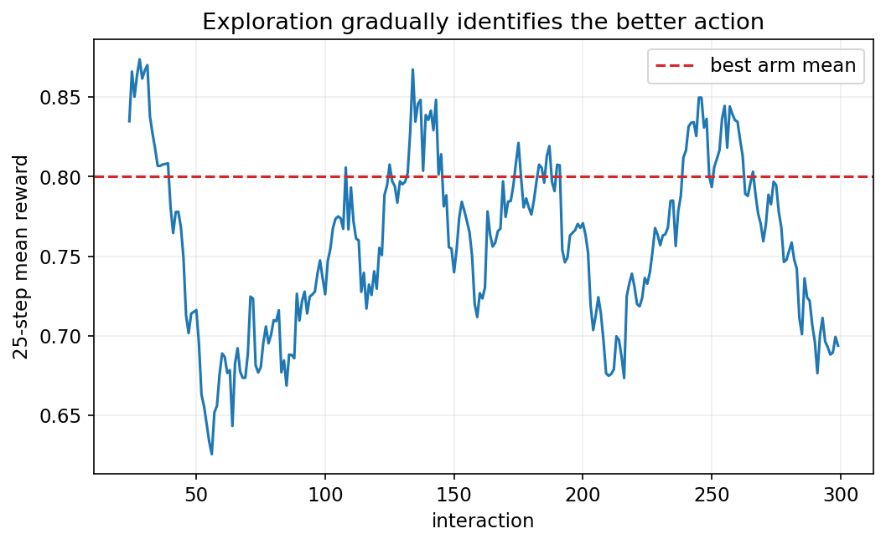
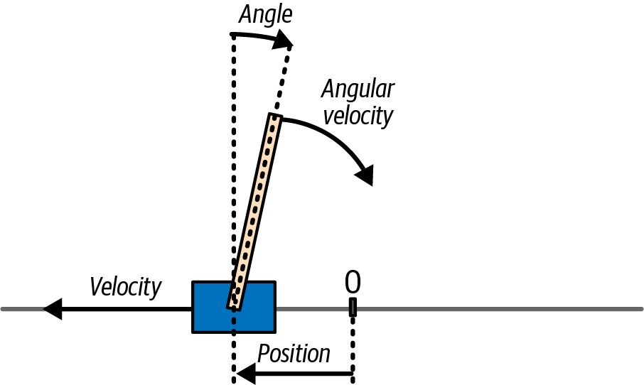
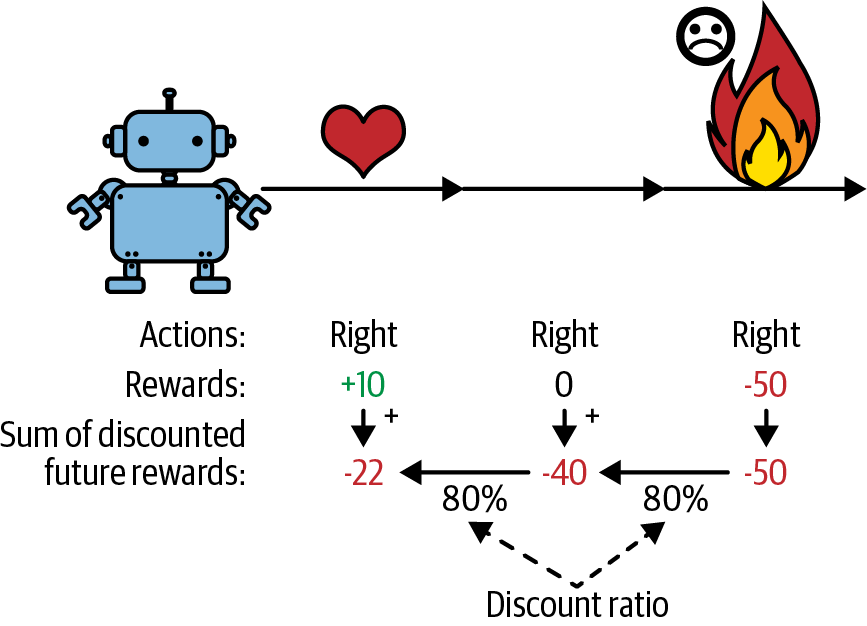
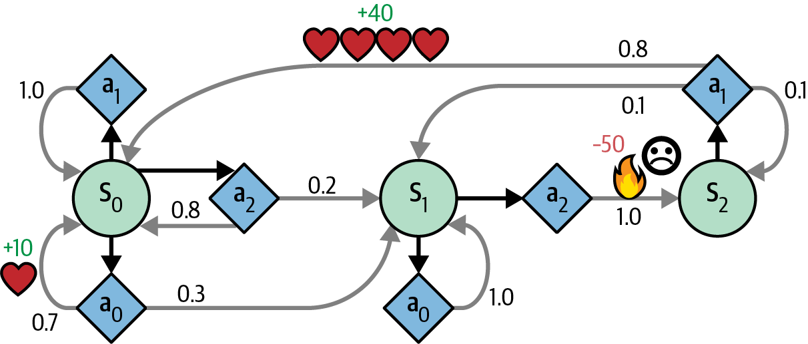
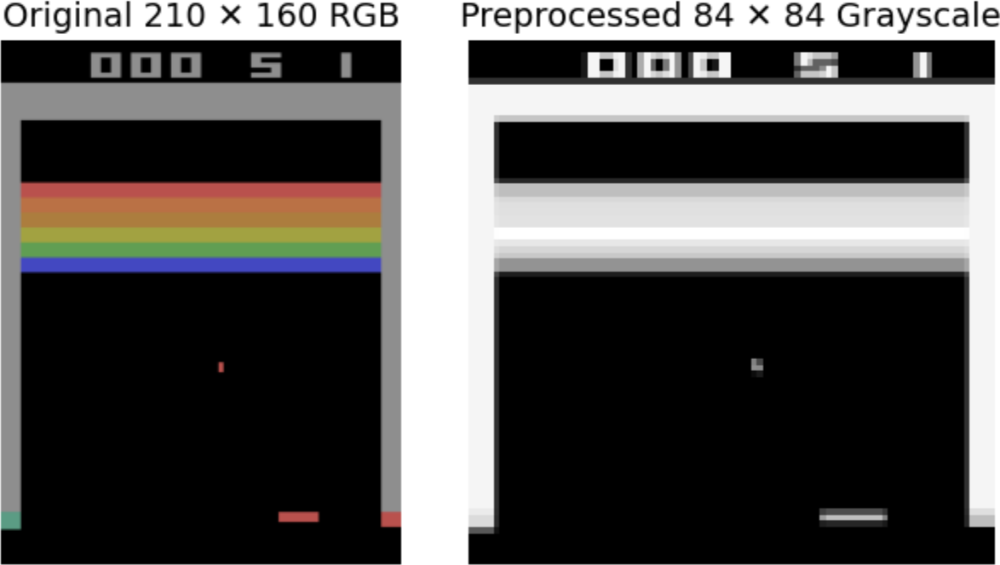

<!-- _class: cover -->
# 強化學習：策略、價值與深度 RL

## Gymnasium、Q-learning、DQN 與 PPO

書本第 19 章

建議 240 分鐘，含活動與休息

<!-- 來源／講者提示：自編章節導入 -->

---
## 學習成果與課堂安排

可分兩次各 120 分鐘，總計含兩次 10 分鐘休息。

- 前半：互動、Gymnasium、回報與 policy gradient。
- 後半：MDP、Q-learning、DQN、actor–critic 與 PPO。

成果：能手算回報與 Q 更新，區分 episode 結束與 bootstrap 條件。

<!-- notebook-companion-link -->
> 💻 **配套 Notebook**：`programs/notebooks/23_強化學習_策略價值與深度RL.ipynb`。程式片段、實際圖表與表格可由此檔重現。

<!-- 來源／講者提示：書本 Ch.19，PDF pp.1–46 -->

---
<!-- notebook-result-slide -->
<!-- _class: small -->
## 程式實驗與實際輸出

<div class="columns wide-left">
<div>

```python
Q[a] += (reward - Q[a]) / count[a]
```

**觀察**：epsilon-greedy 保留探索；移動平均獎勵逐步接近較佳動作的期望值。

參考程式：`programs/notebooks/23_強化學習_策略價值與深度RL.ipynb`

</div>
<div>



</div>
</div>

<!-- 講者提示：程式與圖均來自 programs/notebooks/23_強化學習_策略價值與深度RL.ipynb 的已執行輸出；來源與改編界線見 Notebook。 -->
---
## Agent 與環境的互動

在每一步，agent 依 observation 選 action，環境回傳新 observation 與 reward。

策略 $\pi(a\mid s)$ 決定行為，學習目標是提高長期回報。

環境有資料與回饋，只是正確動作未必事先標好。

<!-- 來源／講者提示：書本 Ch.19，PDF pp.2–6；修正「RL不需要資料」的常見誤解。 -->

---
## Reward、return 與 policy

| 名稱 | 意義 |
| --- | --- |
| Reward | 某一步收到的回饋 |
| Return | 從某一步起的折扣累積回饋 |
| Policy | 根據狀態選動作的方法 |
| Value | 在特定策略下的預期return |

短期獎勵高，不一定代表長期結果最好。

<!-- 來源／講者提示：書本 Ch.19，PDF pp.2–6、12–13 -->

---
## Policy search 與神經網路策略

策略可由規則、參數化機率模型或神經網路表示。

Policy search 在策略參數空間尋找較好的行為。

神經網路可輸出各動作的 logits，再轉成分布抽樣。

訓練前先用簡單規則作基準，確認環境與獎勵理解正確。

<!-- 來源／講者提示：書本 Ch.19，PDF pp.4–6、9–12 -->

---
<!-- _class: figure -->
## CartPole 的任務



觀測描述小車與桿子的狀態；動作控制往左或往右施力。

<!-- 來源／講者提示：書本 Ch.19，PDF 7，圖 19-4。圖為教材原圖，非本次實驗結果。 -->

---
<!-- _class: small -->
## Gymnasium 的一步互動

```python
import gymnasium as gym
env = gym.make("CartPole-v1")
obs, info = env.reset(seed=42)
action = env.action_space.sample()
next_obs, reward, terminated, truncated, info = env.step(action)
env.close()
```

reset 回傳 observation 與 info；step 回傳五個項目。

作者程式：Cells 21–32（簡化）（`19_reinforcement_learning.ipynb`）

<!-- 來源／講者提示：書本 Ch.19，PDF pp.6–9；程式依作者 19_reinforcement_learning.ipynb Cells 21–32（簡化） 節錄或教學改寫，非完整獨立訓練腳本。 -->

---
## Terminated 與 truncated

| 訊號 | 常見原因 |
| --- | --- |
| terminated | 任務中的終止狀態，例如跌倒 |
| truncated | 外部時間或步數限制 |

兩者都可能需要 reset，但價值學習不一定都停止 bootstrap。

若任務本身有有限時域，剩餘時間也應納入狀態設計。

<!-- 來源／講者提示：書本 Ch.19，PDF pp.6–9、26–30；區分收集停止與價值目標，自編教學補充。 -->

---
## 折扣回報

$$G_t=r_t+\gamma r_{t+1}+\gamma^2r_{t+2}+\cdots$$

$\gamma$ 決定較遠回饋的相對權重。

在有限 episode 可從尾端反向算：$G_t=r_t+\gamma G_{t+1}$。

<!-- 來源／講者提示：書本 Ch.19，PDF pp.12–13；此課以動作後收到的reward記為r_t，與r_{t+1}慣例等價但勿混用。 -->

---
<!-- _class: figure -->
## Credit assignment 的回報分配



後來得到的結果，會影響先前動作的評價；距離越遠，折扣通常越多。

<!-- 來源／講者提示：書本 Ch.19，PDF 12，圖 19-6。圖為教材原圖，非本次實驗結果。 -->

---
<!-- _class: activity -->
## 回報手算：10、0、−50

設 $\gamma=0.8$，從最後一步往前：

| 步驟 | 計算 | Return |
| --- | --- | --- |
| 3 | $-50$ | −50 |
| 2 | $0+0.8×(-50)$ | −40 |
| 1 | $10+0.8×(-40)$ | −22 |

第一步立刻得到10，仍可能有負的長期回報。

<!-- 來源／講者提示：書本 Ch.19，PDF pp.12–13；作者Cell47相同教材數例。 -->

---
<!-- _class: small -->
## 折扣回報的小函式

```python
def returns(rewards, gamma):
    result = []
    G = 0.0
    for reward in reversed(rewards):
        G = reward + gamma * G
        result.append(G)
    return list(reversed(result))
assert returns([10, 0, -50], 0.8) == [-22.0, -40.0, -50.0]
```

此例為完整有限 episode，不另外加末端 bootstrap。

作者程式：Cell 46（改寫）（`19_reinforcement_learning.ipynb`）

<!-- 來源／講者提示：書本 Ch.19，PDF pp.12–13；程式依作者 19_reinforcement_learning.ipynb Cell 46（改寫） 節錄或教學改寫，非完整獨立訓練腳本。 -->

---
## REINFORCE 的更新方向

$$L_\pi=-\frac1N\sum_t G_t\log\pi_\theta(a_t\mid s_t)$$

高回報動作的 log probability 受到增加的壓力。

回報作為權重，不對環境或抽到的動作本身微分。

減去與動作無關的 baseline 可降低梯度估計變異。

<!-- 來源／講者提示：書本 Ch.19，PDF pp.13–16 -->

---
## Policy gradient 程式導讀

作者 Notebook（`19_reinforcement_learning.ipynb`）：Cells 40–50。

- PolicyNetwork 產生動作 logits。
- choose_action 同時保存 action 與 log probability。
- 收集 episode 後計算 return。
- 使用 log probability 與 return 更新 policy。

若只存整數 action，之後無法從它恢復原本的梯度圖。

<!-- 來源／講者提示：程式：作者Ch19 REINFORCE。 -->

---
## Markov 性與 observation

Markov 狀態包含預測下一步所需的資訊，不必回看完整歷史。

環境的 observation 未必就是完整 state。

例如單一影格看不出速度，可用多影格或記憶模型補充。

<!-- 來源／講者提示：書本 Ch.19，PDF pp.16–18、38–40 -->

---
<!-- _class: figure -->
## Markov decision process



狀態、可選動作、轉移機率與回饋，定義一個可做長期決策的問題。

<!-- 來源／講者提示：書本 Ch.19，PDF 18，圖 19-8。圖為教材原圖，非本次實驗結果。 -->

---
## Value iteration 與 Bellman 最優性

$$V^*(s)=\max_a\sum_{s^{\prime}}P(s^{\prime}\mid s,a)\left[r(s,a,s^{\prime})+\gamma V^*(s^{\prime})\right]$$

已知環境轉移模型時，可反覆更新價值估計。

Q-value 把「先採取哪個動作」也納入價值的輸入。

<!-- 來源／講者提示：書本 Ch.19，PDF pp.18–21 -->

---
## TD learning 用樣本更新

$$\delta=r+\gamma V(s^{\prime})-V(s)$$
$$V(s)\leftarrow V(s)+\alpha\delta$$

使用一步樣本與下一狀態的估計，不必等待整段 episode 才更新。

這種以估計值作目標的一部分，稱為 bootstrap。

<!-- 來源／講者提示：書本 Ch.19，PDF pp.21–22；真正terminal的下一狀態價值設0。 -->

---
## Q-learning 的更新式

$$Q(s,a)\leftarrow Q(s,a)+\alpha\left[r+\gamma\max_{a^{\prime}}Q(s^{\prime},a^{\prime})-Q(s,a)\right]$$

更新的是這次實際走過的 $(s,a)$。

目標使用下一狀態的最大 Q，行為策略卻可包含隨機探索。

<!-- 來源／講者提示：書本 Ch.19，PDF pp.22–25 -->

---
<!-- _class: activity -->
## 舊稿手算：一般移動

沿用 `12_強化學習.pdf` p.13 的局部數例：

$Q=0.5,\alpha=0.1,\gamma=0.9,r=0,\max Q_{next}=0.8$。

$$Q_{new}=0.5+0.1(0+0.9×0.8-0.5)=0.522$$

這是數例設定，不與舊稿其他頁面的獎勵尺度混用。

<!-- 來源／講者提示：補充：source_pptx/12_強化學習.pdf p.13；原稿p.10的獎勵尺度不同。 -->

---
<!-- _class: activity -->
## 舊稿手算：抵達終點

沿用舊稿 p.14：$Q=0.2,\alpha=0.1,r=1$，抵達 terminal。

$$Q_{new}=0.2+0.1(1-0.2)=0.28$$

終點沒有下一步可累積的回報，因此不再加下一狀態的估計。

若只是時間限制中斷，需要先確認任務的終止定義。

<!-- 來源／講者提示：補充：source_pptx/12_強化學習.pdf p.14。 -->

---
<!-- _class: activity -->
## 舊稿手算：碰牆但尚未終止

沿用舊稿 p.15：$Q=0.1,\alpha=0.1,\gamma=0.9,r=-0.1,\max Q_{next}=0.4$。

$$Q_{new}=0.1+0.1(-0.1+0.9×0.4-0.1)=0.116$$

立即回饋為負，Q 值仍可能上升，因為更新同時考慮未來。

<!-- 來源／講者提示：補充：source_pptx/12_強化學習.pdf p.15；相對原Q，TD target=0.26更高。 -->

---
## 探索與利用

ε-greedy 以機率 ε 隨機探索，其他時候挑最高 Q。

| 選擇 | 可能的問題 |
| --- | --- |
| 太早停止探索 | 沒發現更好的路徑 |
| 一直大量隨機 | 已學到的策略難以穩定展現 |

可逐步調低 ε，也可使用依不確定性或新奇程度設計的探索。

<!-- 來源／講者提示：書本 Ch.19，PDF pp.24–25 -->

---
## DQN 用網路近似 Q 函數

CartPole 有兩個離散動作，網路可輸出 `[Q(left),Q(right)]`。

輸出是預期回報，不是總和等於 1 的機率。

因此不需要對 Q 值加 Softmax 再做 Q-learning。

<!-- 來源／講者提示：書本 Ch.19，PDF pp.25–27；作者Cell76。 -->

---
<!-- _class: small -->
## DQN 的兩個動作輸出

```python
import torch
from torch import nn
q_net = nn.Sequential(
    nn.Linear(4, 32), nn.ReLU(),
    nn.Linear(32, 32), nn.ReLU(),
    nn.Linear(32, 2))
q_values = q_net(torch.randn(8, 4))
```

預期形狀 `[8,2]`；每筆資料的狀態有4個特徵。

作者程式：Cell 76（簡化）（`19_reinforcement_learning.ipynb`）

<!-- 來源／講者提示：書本 Ch.19，PDF pp.25–27；程式依作者 19_reinforcement_learning.ipynb Cell 76（簡化） 節錄或教學改寫，非完整獨立訓練腳本。 -->

---
## Replay buffer 與 target network

Replay buffer 保存 $(s,a,r,s^{\prime},terminated,truncated)$，抽樣後更新。

Target network 以較慢速度更新，降低目標跟著參數快速移動的問題。

兩者用途不同：一個改資料取樣，一個穩定 bootstrap 目標。

<!-- 來源／講者提示：書本 Ch.19，PDF pp.26–32；書中先介紹基本DQN，再加target network等改善。 -->

---
<!-- _class: small -->
## DQN 的 TD target

```python
# 此例把時間限制視為可bootstrap的截斷，使用終止前next_state
with torch.no_grad():
    next_q = target_net(next_states).max(dim=1).values
    target = rewards + gamma * (~terminated).float() * next_q
current = q_net(states).gather(1, actions[:, None]).squeeze(1)
loss = nn.functional.mse_loss(current, target)
```

所有向量均以 batch 對齊；自動 reset 的環境要保留真正 final observation。

作者程式：Cells 85–91（加入target network的教學改寫）（`19_reinforcement_learning.ipynb`）

<!-- 來源／講者提示：書本 Ch.19，PDF pp.27–33；程式依作者 19_reinforcement_learning.ipynb Cells 85–91（加入target network的教學改寫） 節錄或教學改寫，非完整獨立訓練腳本。 -->

---
## DQN 的常見改善

| 方法 | 要處理的問題 |
| --- | --- |
| Target network | 學習目標快速變動 |
| Double DQN | max操作造成的過度估計 |
| Prioritized replay | 提高重要經驗的取樣機會 |
| Dueling network | 分開估計state value與action advantage |

<!-- 來源／講者提示：書本 Ch.19，PDF pp.31–33；prioritized replay需考慮取樣偏差修正。 -->

---
## Actor–critic 的兩個角色

Actor 產生 policy；critic 估計 value，協助評估動作。

$$A(s,a)=Q(s,a)-V(s)$$

Advantage 表示動作比該狀態的平均水準好多少。

簡單版本可用 TD error 近似 advantage。

<!-- 來源／講者提示：書本 Ch.19，PDF pp.33–38 -->

---
<!-- _class: small -->
## Actor loss 與 critic loss 分開

```python
td_error = target_value - state_value
actor_loss = -(log_prob * td_error.detach()).mean()
critic_loss = nn.functional.mse_loss(state_value, target_value)
loss = actor_loss + critic_weight * critic_loss
```

target_value 應是已停止梯度的bootstrap目標；actor權重detach，避免錯走critic梯度。

作者程式：Cell 95（加上batch平均）（`19_reinforcement_learning.ipynb`）

<!-- 來源／講者提示：書本 Ch.19，PDF pp.34–38；程式依作者 19_reinforcement_learning.ipynb Cell 95（加上batch平均） 節錄或教學改寫，非完整獨立訓練腳本。 -->

---
<!-- _class: small -->
## PPO 限制策略一次改太多

$$r_t(\theta)=\frac{\pi_\theta(a_t\mid s_t)}{\pi_{old}(a_t\mid s_t)}$$
$$L^{clip}=\mathbb E\!\left[\min\left(r_tA_t,\operatorname{clip}(r_t,1-\epsilon,1+\epsilon)A_t\right)\right]$$

PPO 最大化這個代理目標，實作最小化損失時須改符號。

Clipping 限制過度更新的誘因，不是硬性保證每個比率都在區間內。

<!-- 來源／講者提示：書本 Ch.19，PDF pp.38–42；公式為PPO clipped objective教學補充。 -->

---
<!-- _class: figure -->
## Atari 的影格前處理



縮小、灰階與堆疊影格，可降低輸入成本並提供運動資訊。

<!-- 來源／講者提示：書本 Ch.19，PDF 39，圖 19-11。圖為教材原圖，非本次實驗結果。 -->

---
<!-- _class: small -->
## Stable-Baselines3 的小型介面示例

```python
from stable_baselines3 import PPO
agent = PPO("MlpPolicy", "CartPole-v1", verbose=0, seed=42)
agent.learn(total_timesteps=10_000)
agent.save("ppo_cartpole_demo")
```

改用小型 CartPole 示範；一萬步只作介面練習，不保證收斂。

作者程式：Cell 110（由Atari CnnPolicy改寫）（`19_reinforcement_learning.ipynb`）

<!-- 來源／講者提示：書本 Ch.19，PDF pp.38–42；程式依作者 19_reinforcement_learning.ipynb Cell 110（由Atari CnnPolicy改寫） 節錄或教學改寫，非完整獨立訓練腳本。 -->

---
## Atari 完整實驗的閱讀路線

作者 Notebook（`19_reinforcement_learning.ipynb`）：Cells 102–118。

讀取 vectorized environments、frame stack、PPO 設定與評估。

原筆記本提供作者訓練模型的下載方式；其訓練步數與結果屬作者實驗。

課堂不把預訓練回放當作現場重新訓練成功。

<!-- 來源／講者提示：程式：作者Cell114明示其3000萬步訓練；環境資源與依賴見Notebook。 -->

---
## 演算法比較

| 家族 | 學什麼 | 本課例子 |
| --- | --- | --- |
| Value-based | 狀態或動作價值 | Q-learning、DQN |
| Policy gradient | 策略分布 | REINFORCE |
| Actor–critic | 策略與價值 | A2C、PPO |
| 連續動作方法 | 連續動作策略與價值 | DDPG、TD3、SAC（選讀） |

<!-- 來源／講者提示：書本 Ch.19，PDF pp.42–44；選擇還需看on/off-policy、資料效率與環境成本。 -->

---
## On-policy、off-policy 與環境模型

| 比較軸 | 含義 |
| --- | --- |
| On-policy | 主要使用目前策略收集的資料更新 |
| Off-policy | 可利用其他行為策略的資料 |
| Model-based | 使用或學習環境轉移／回饋模型來規劃 |
| Model-free | 直接學價值或策略 |

這是兩組不同的分類軸，不應放在同一個互斥清單。

<!-- 來源／講者提示：書本 Ch.19，PDF pp.42–44；Q-learning與PPO作課堂對照。 -->

---
## 連續動作與其他演算法（選讀）

連續動作空間無法簡單列出所有動作再取最大 Q。

- DDPG 使用決定性 actor 提供動作，critic 評估動作。
- TD3 以雙 critic 等設計減少過度估計與不穩定。
- SAC 的目標包含熵，鼓勵保留策略多樣性。

另可閱讀 model-based RL、模仿學習與 offline RL，比較互動資料如何取得。

<!-- 來源／講者提示：書本 Ch.19，PDF pp.42–44；依書中RL總覽作概念選讀，不要求課堂重作全部實驗。 -->

---
## RL 實驗的評估方式

- 分開訓練探索策略與測試策略。
- 多個隨機種子與多個 episode，報告分布或不確定性。
- 固定環境版本、步數限制與獎勵設定。
- 除了 return，也檢查行為是否符合任務目的。

高 reward 可能反映鑽獎勵設計漏洞，而非完成真正需求。

<!-- 來源／講者提示：書本 Ch.19，PDF pp.42–46；自編實驗規格。 -->

---
<!-- _class: activity -->
## 課堂活動：迷宮與 CartPole

25 分鐘。

1. 手填迷宮的兩次 Q 更新，標出 terminal。
2. 比較規則策略與小型 PPO 的評估設計。
3. 寫一個「獎勵變高但行為不合目的」的例子。

交付：狀態／動作／回饋定義、更新計算與評估表。

<!-- 來源／講者提示：自編活動，結合source_pptx/12_強化學習.pdf與作者Ch19。 -->

---
## 離堂檢核

- Reward 與 return 是否相同？
- Q-learning 的行為與目標策略可以不同嗎？
- DQN 輸出為何不是機率？
- truncated 為何不一定代表下一狀態價值為零？

<!-- 來源／講者提示：自編檢核；否；可以off-policy；Q是回報尺度；外部時間限制可在繼續任務假設下bootstrap。 -->

---
<!-- _class: small -->
## 課後程式與延伸閱讀

- 作者第 19 章 Notebook（`19_reinforcement_learning.ipynb`）：先執行 Setup，再定位本課指定區段。
- 舊稿 `source_pptx/12_強化學習.pdf`：迷宮與三個 Q-learning 手算；獎勵以各例明列的設定為準。

程式來源依教材核對版本標示；執行前確認資料、套件與運算資源。

<!-- 來源／講者提示：來源：作者 notebook 固定 commit 47eba45aacc85feae51ba7db68dd1ca66cb25e0a；Cell 編號從 0 起算。範例片段以讀碼為主，完整依賴見 notebook。 -->
