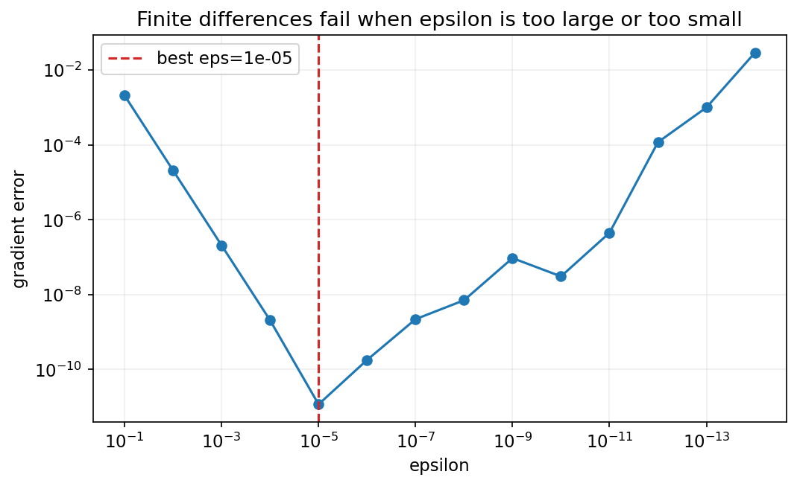
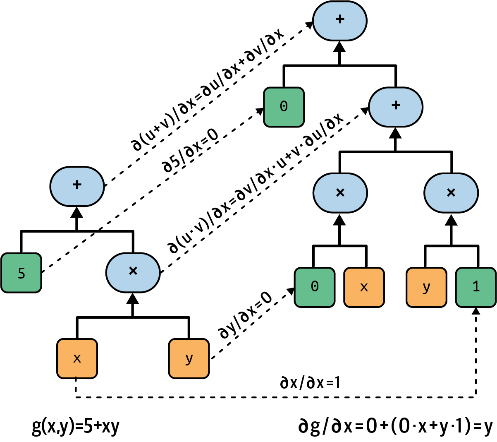
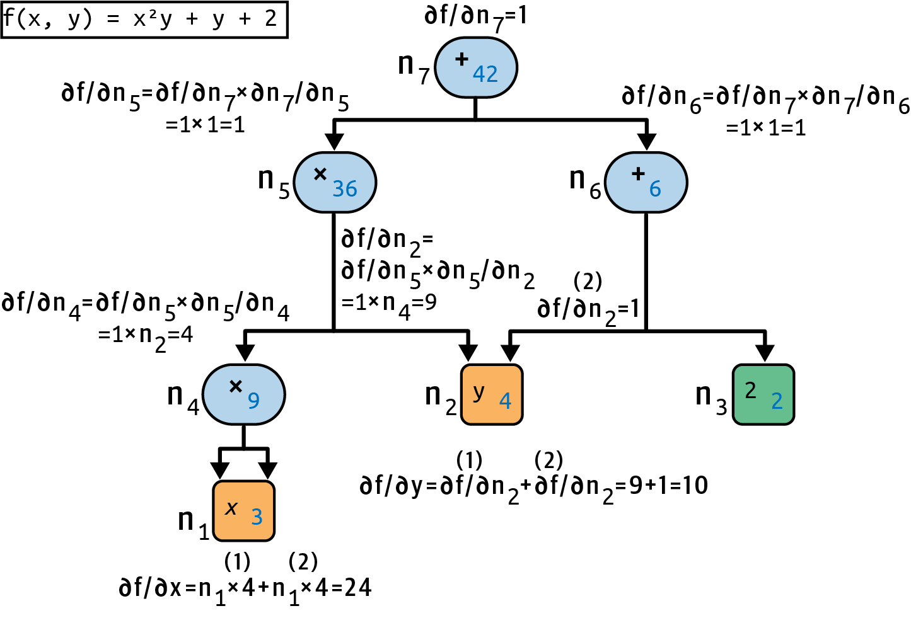

<!-- _class: cover -->
# 附錄 A：自動微分與計算圖

## 手算、有限差分、前向與反向模式

書本附錄 A

建議 90 分鐘，含活動與休息

<!-- 來源／講者提示：自編章節導入 -->

---
## 學習成果與使用時機

可在深層網路、LoRA 或自訂損失之前補充。

- 0–25 分：手算導數與有限差分。
- 25–55 分：計算圖、前向模式與對偶數。
- 55–90 分：反向模式、autograd 與梯度檢查。

成果：解釋 backward 如何工作，辨識梯度中斷與累積。

<!-- notebook-companion-link -->
> 💻 **配套 Notebook**：`programs/notebooks/24_附錄A_自動微分與計算圖.ipynb`。本檔提供公式驗算、機制實驗與結果圖；框架片段及完整模型案例另依頁面說明閱讀。

<!-- 來源／講者提示：書本 Ch.A，PDF pp.1–8 -->

<!-- Notebook 對照：程式 24-01、24-02；完整對照見本章 ipynb 開頭。 -->

---
<!-- notebook-result-slide -->
<!-- _class: small -->
## 程式實驗與實際輸出

<div class="columns wide-left">
<div>

```python
dfdx = (f(x+eps)-f(x-eps)) / (2*eps)
```

**觀察**：有限差分的步長太大有近似誤差，太小則受浮點相消影響。

參考程式：`programs/notebooks/24_附錄A_自動微分與計算圖.ipynb`

</div>
<div>



</div>
</div>

<!-- 講者提示：程式與圖均來自 programs/notebooks/24_附錄A_自動微分與計算圖.ipynb 的已執行輸出；來源與改編界線見 Notebook。 -->

<!-- Notebook 對照：程式 24-04；完整對照見本章 ipynb 開頭。教材原圖與小型實驗的對應範圍依對照表標示，不直接沿用原圖模型分數。 -->

---
## 同一函式的三種求導方式

以書中 $f(x,y)=x^2y+y+2$ 為例。

| 方法 | 做法 |
| --- | --- |
| 手算微分 | 使用符號規則推導 |
| 有限差分 | 微小改變輸入再比較函式值 |
| 自動微分 | 沿計算圖套用局部導數與鏈鎖律 |

自動微分仍受浮點誤差影響，但不靠小步長近似導數。

<!-- 來源／講者提示：書本 Ch.A，PDF pp.1–3 -->

<!-- Notebook 對照：程式 24-03、24-05；完整對照見本章 ipynb 開頭。 -->

---
<!-- _class: activity -->
## 手算梯度

$$\frac{\partial f}{\partial x}=2xy,\qquad\frac{\partial f}{\partial y}=x^2+1$$

在 $(x,y)=(3,4)$：

$f=42$，$\partial f/\partial x=24$，$\partial f/\partial y=10$。

請指出 $y$ 透過幾條路徑影響輸出。

<!-- 來源／講者提示：書本 Ch.A，PDF pp.1–2；兩條路徑：x²y與直接加y。 -->

<!-- Notebook 對照：程式 24-03、24-05；完整對照見本章 ipynb 開頭。 -->

---
## 有限差分與步長

$$\frac{\partial f}{\partial x}\approx\frac{f(x+\epsilon,y)-f(x-\epsilon,y)}{2\epsilon}$$

$\epsilon$ 太大，近似誤差較大；太小，浮點相減可能失去有效位數。

中央差分常作梯度檢查，但高維參數逐一擾動成本很高。

<!-- 來源／講者提示：書本 Ch.A，PDF pp.2–3；中央差分為書中前向差分的教學延伸。 -->

<!-- Notebook 對照：程式 24-03、24-04；完整對照見本章 ipynb 開頭。 -->

---
<!-- _class: small -->
## 有限差分的可執行小例子

```python
def f(x, y):
    return x*x*y + y + 2
eps = 1e-5
dx = (f(3 + eps, 4) - f(3 - eps, 4)) / (2 * eps)
dy = (f(3, 4 + eps) - f(3, 4 - eps)) / (2 * eps)
print(dx, dy)  # 預期接近 24、10
```

函式不含下載或模型依賴，可與手算結果比較。

作者程式：Cells 6、17–23（改寫）（`Appendix_A_autodiff.ipynb`）

<!-- 來源／講者提示：書本 Ch.A，PDF pp.1–3；程式依作者 Appendix_A_autodiff.ipynb Cells 6、17–23（改寫） 節錄或教學改寫，非完整獨立訓練腳本。 -->

<!-- Notebook 對照：程式 24-03、24-04；完整對照見本章 ipynb 開頭。 -->

---
## 計算圖與中間變數

把函式拆成：

| 變數 | 運算 | x=3、y=4時 |
| --- | --- | --- |
| a | $x×x$ | 9 |
| b | $a×y$ | 36 |
| c | $b+y$ | 40 |
| f | $c+2$ | 42 |

每個節點只需知道自己的局部導數。

<!-- 來源／講者提示：書本 Ch.A，PDF pp.3–7；自編分解，對應作者Toy Computation Graph。 -->

<!-- Notebook 對照：程式 24-05、24-06；完整對照見本章 ipynb 開頭。 -->

---
<!-- _class: figure -->
## 前向模式沿計算順序傳遞導數



選定一個輸入方向，讓值與該方向的導數一起往前走。

<!-- 來源／講者提示：書本 Ch.A，PDF 4，圖 A-1。圖為教材原圖，非本次實驗結果。 -->

<!-- Notebook 對照：程式 24-05、24-06；完整對照見本章 ipynb 開頭。教材原圖與小型實驗的對應範圍依對照表標示，不直接沿用原圖模型分數。 -->

---
<!-- _class: activity -->
## 前向模式手算

對 $x$ 微分，初始方向為 $\dot x=1,\dot y=0$。

| 節點 | 方向導數 |
| --- | --- |
| a=x² | $2x\dot x=6$ |
| b=ay | $\dot a y+a\dot y=24$ |
| c=b+y | $24+0=24$ |
| f=c+2 | 24 |

改求 y 方向時，要換初始方向。

<!-- 來源／講者提示：書本 Ch.A，PDF pp.3–5；自編逐步手算。 -->

<!-- Notebook 對照：程式 24-05；完整對照見本章 ipynb 開頭。 -->

---
## 對偶數的表示

以 $a+b\varepsilon$ 表示值與方向導數，且 $\varepsilon^2=0$。

$$(a+b\varepsilon)(c+d\varepsilon)=ac+(ad+bc)\varepsilon$$

乘法自然出現乘法微分法則；程式可把值與導數存成一對資料。

<!-- 來源／講者提示：書本 Ch.A，PDF pp.4–6，對偶數運算。 -->

<!-- Notebook 對照：程式 24-05；完整對照見本章 ipynb 開頭。 -->

---
<!-- _class: figure -->
## 反向模式由輸出往回傳



先算所有中間值，再從輸出導數 1 出發，沿反向路徑累積梯度。

<!-- 來源／講者提示：書本 Ch.A，PDF 6，圖 A-3。圖為教材原圖，非本次實驗結果。 -->

<!-- Notebook 對照：程式 24-06；完整對照見本章 ipynb 開頭。教材原圖與小型實驗的對應範圍依對照表標示，不直接沿用原圖模型分數。 -->

---
<!-- _class: activity -->
## 反向模式手算

由 $\partial f/\partial f=1$ 開始：

| 節點 | 累積的梯度 |
| --- | --- |
| c、b | 各為1 |
| y | 直接路徑1，加上乘法路徑a=9，共10 |
| a | y=4 |
| x | $4×2x=24$ |

同一變數出現在多條路徑時，梯度必須相加。

<!-- 來源／講者提示：書本 Ch.A，PDF pp.6–8；自編計算。 -->

<!-- Notebook 對照：程式 24-06；完整對照見本章 ipynb 開頭。 -->

---
## 前向與反向模式的選擇

| 問題 | 通常較合適的方向 |
| --- | --- |
| 少量輸入、多個輸出 | 前向模式 |
| 大量參數、一個scalar loss | 反向模式 |

前向模式計算 Jacobian-vector product；反向模式計算 vector-Jacobian product。

神經網路訓練常以一個 scalar loss 對很多參數求梯度。

<!-- 來源／講者提示：書本 Ch.A，PDF pp.3–8 -->

<!-- Notebook 對照：程式 24-05、24-06；完整對照見本章 ipynb 開頭。 -->

---
<!-- _class: small -->
## PyTorch autograd 驗算

```python
import torch
x = torch.tensor(3., requires_grad=True)
y = torch.tensor(4., requires_grad=True)
f = x*x*y + y + 2
f.backward()
print(f.item(), x.grad.item(), y.grad.item())
# 預期 42.0、24.0、10.0
```

此例可直接執行；backward 對scalar輸出預設使用上游梯度1。

作者程式：Cells 85–86（`Appendix_A_autodiff.ipynb`）

<!-- 來源／講者提示：書本 Ch.A，PDF pp.7–8；程式依作者 Appendix_A_autodiff.ipynb Cells 85–86 節錄或教學改寫，非完整獨立訓練腳本。 -->

<!-- Notebook 對照：程式 24-06；完整對照見本章 ipynb 開頭。 -->

---
## 梯度累積與計算圖生命週期

- `.grad` 會累積，更新前應依訓練設計清空。
- backward 後，圖中部分中間資訊通常已釋放。
- `.detach()` 切斷目前的梯度路徑。
- `.item()` 取得 Python 數值，不能再當可微損失接回圖。

不要為了消除錯誤而到處加 `retain_graph=True`。

<!-- 來源／講者提示：書本：附錄A；作者PyTorch autodiff範例的教學延伸。 -->

<!-- Notebook 對照：程式 24-06；完整對照見本章 ipynb 開頭。 -->

---
## 與手刻反向傳播程式對照

MachineLearning2025：ANN from scratch（`programs/upstream/MachineLearning2025/06_ANN_from_Scratch_MNIST.py`）

找出 Linear 與 activation 的 `backward`，對照：

- 上游梯度乘上局部導數。
- batch 與廣播軸的梯度如何加總。
- 權重梯度與輸入梯度的形狀。

autograd 把這套工作系統化，仍需正確的前向運算。

<!-- 來源／講者提示：補充：本地手刻ANN；附錄A reverse-mode。 -->

<!-- Notebook 對照：程式 24-06；完整對照見本章 ipynb 開頭。 -->

---
<!-- _class: activity -->
## 課堂活動：梯度檢查

15 分鐘。

1. 手算 $f(3,4)$ 的兩個偏導數。
2. 用有限差分與 autograd 比較。
3. 把 `x*x` 改成 `(x*x).detach()`，預測哪些梯度消失。

交付三種結果與差異原因；不要只貼執行畫面。

<!-- 來源／講者提示：自編活動。detach後x.grad為None，y.grad仍10。 -->

<!-- Notebook 對照：程式 24-05、24-06；完整對照見本章 ipynb 開頭。 -->

---
## 離堂檢核

- 自動微分是否就是有限差分？
- 共享參數的多條路徑為何要加總？
- scalar loss 對百萬參數為何適合反向模式？
- `.item()` 放進 loss 建構過程可能造成什麼問題？

<!-- 來源／講者提示：自編檢核；否；鏈鎖律總微分；一次反向遍歷得到多參數梯度；計算圖中斷。 -->

<!-- Notebook 對照：程式 24-06；完整對照見本章 ipynb 開頭。 -->

---
<!-- _class: small -->
## 課後程式與延伸閱讀

- 作者附錄 A Notebook（`Appendix_A_autodiff.ipynb`）：先執行 Setup，再定位本課指定區段。
- 主教材附錄 A 與作者的 Toy Computation Graph；不需大型模型或資料集。
- 本地手刻 ANN（`programs/upstream/MachineLearning2025/06_ANN_from_Scratch_MNIST.py`）：逐層 backward 對照。

程式來源依教材核對版本標示；執行前確認資料、套件與運算資源。

<!-- 來源／講者提示：來源：作者 notebook 固定 commit 47eba45aacc85feae51ba7db68dd1ca66cb25e0a；Cell 編號從 0 起算。範例片段以讀碼為主，完整依賴見 notebook。 -->

<!-- Notebook 對照：程式 24-06；完整對照見本章 ipynb 開頭。 -->

---
<!-- _class: small -->
## Notebook 導讀：可執行的機制與驗收

| 方法 | 同一函式的核對結果 |
|---|---|
| 解析式與有限差分 | $f(3,4)=42$，梯度 $[24,10]$ |
| 前向對偶數 | 種子 $(1,0)$ 得 24；$(0,1)$ 得 10 |
| 反向計算圖 | 共用 x 與 y 的多條路徑梯度相加 |
| 梯度累積／detach | 再反向會累積；切斷 x 路徑後 y 仍為 10 |

Notebook 內含可執行的小型自動微分引擎；PyTorch 版本作 API 對照。
簡化引擎的斷線梯度為 0，PyTorch 的未連接葉節點通常為 None。

<!-- 講者提示：NumPy CPU 小型實驗對應公式、形狀與流程；教材架構與外部模型成效不宣稱完整重現。 可用於程式課或課後，不增加原核心時間。 -->

<!-- Notebook 對照：程式 24-05、24-06；完整對照見本章 ipynb 開頭。 -->
