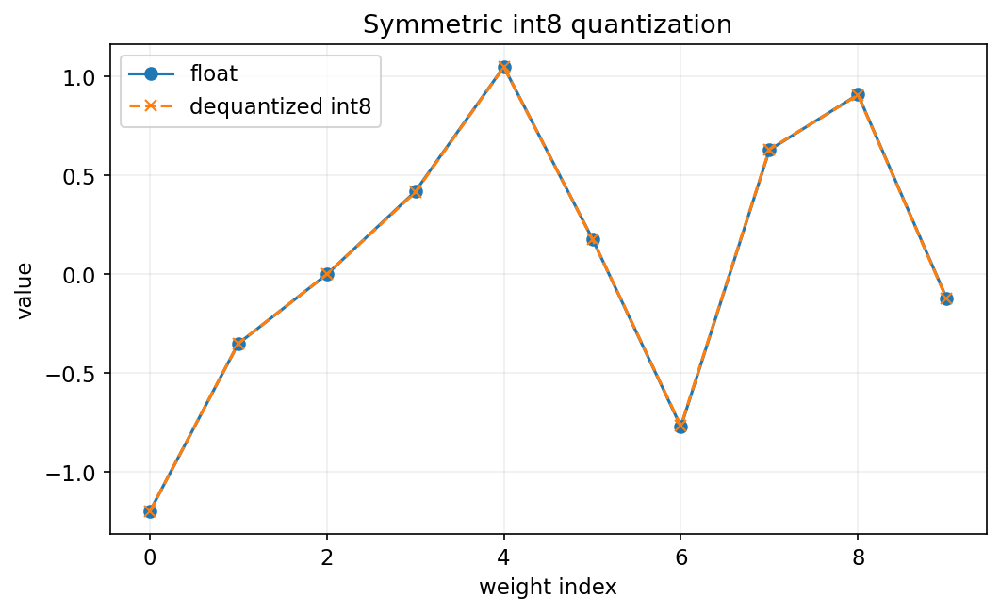
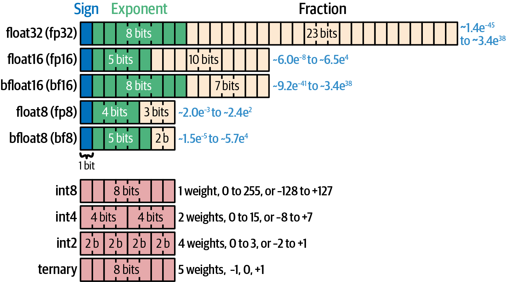
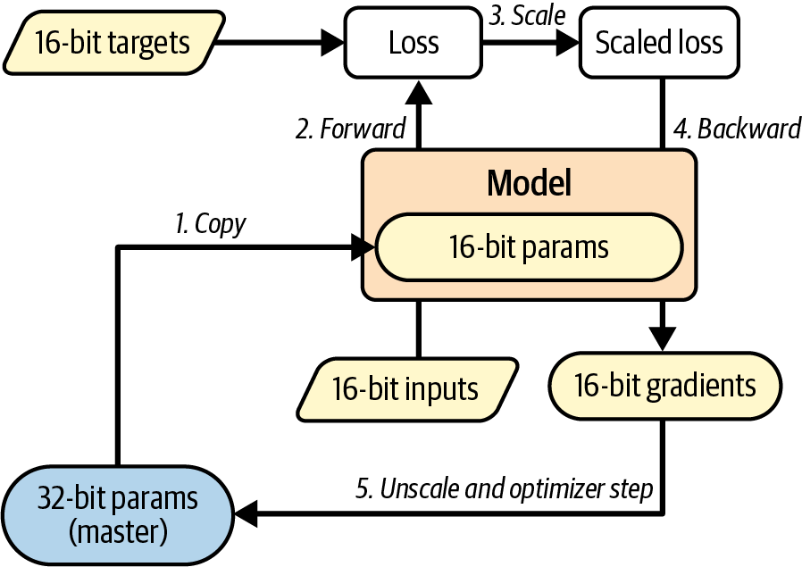
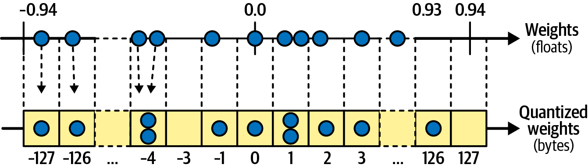

<!-- _class: cover -->
# 附錄 B：混合精度與量化

## 數值格式、AMP、PTQ 與 QAT

書本附錄 B

建議 120 分鐘，含活動與休息

<!-- 來源／講者提示：自編章節導入 -->

---
## 學習成果與課堂安排

- 0–35 分：數值格式、範圍與精度。
- 35–70 分：混合精度與量化手算。
- 80–120 分：PTQ、QAT、模型載入與比較。

成果：估算儲存需求，說明低位元如何改變誤差與執行成本。

<!-- notebook-companion-link -->
> 💻 **配套 Notebook**：[`25_附錄B_混合精度與量化.ipynb`](../programs/notebooks/25_附錄B_混合精度與量化.ipynb)。程式片段、實際圖表與表格可由此檔重現。

<!-- 來源／講者提示：書本 Ch.B，PDF pp.1–20；含一次10分鐘休息。 -->

---
<!-- notebook-result-slide -->
<!-- _class: small -->
## 程式實驗與實際輸出

<div class="columns wide-left">
<div>

```python
q = round(weight / scale).astype(int8)
weight_hat = q * scale
```

**觀察**：對稱 int8 量化大幅縮小表示範圍，但反量化後仍會留下離散化誤差。

[開啟完整 Notebook](../programs/notebooks/25_附錄B_混合精度與量化.ipynb)

</div>
<div>



</div>
</div>

<!-- 講者提示：程式與圖均來自 programs/notebooks/25_附錄B_混合精度與量化.ipynb 的已執行輸出；來源與改編界線見 Notebook。 -->
---
<!-- _class: figure -->
## 數值格式的位元分配



浮點格式把位元分配給符號、指數與有效數字；範圍與精細程度是不同特性。

<!-- 來源／講者提示：書本 Ch.B，PDF 3，圖 B-1。圖為教材原圖，非本次實驗結果。 -->

---
## FP32、FP16 與 BF16

| 格式 | 指數位元 | 小數位元 | 教學重點 |
| --- | --- | --- | --- |
| FP32 | 8 | 23 | 常用完整精度基準 |
| FP16 | 5 | 10 | 較窄範圍，較易溢位或下溢 |
| BF16 | 8 | 7 | 較寬範圍，精細程度較低 |

表中另各有1個符號位元；硬體支援決定實際速度。

<!-- 來源／講者提示：書本 Ch.B，PDF pp.2–4 -->

---
<!-- _class: activity -->
## 模型權重大小估算

10 億參數，只計權重：

| 每參數儲存 | 約略大小 |
| --- | --- |
| FP32，4 bytes | 4 GB |
| FP16／BF16，2 bytes | 2 GB |
| INT8，1 byte | 1 GB |
| 4-bit，半 byte | 0.5 GB |

量化還有 scale／zero point 等額外資訊；以上不是完整執行記憶體。

<!-- 來源／講者提示：自編十進位GB估算；附錄B pp.1–5。 -->

---
## 降低精度的不同位置

- 權重儲存格式。
- 乘法與加總的計算格式。
- Activation 與梯度格式。
- Optimizer 狀態與主權重副本。

「4-bit 模型」通常不代表所有步驟都以4-bit計算。

<!-- 來源／講者提示：書本 Ch.B，PDF pp.4–8、16–20 -->

---
<!-- _class: figure -->
## 混合精度訓練



不同運算採不同精度；保留必要的高精度操作，降低其他部分的成本。

<!-- 來源／講者提示：書本 Ch.B，PDF 6，圖 B-2。圖為教材原圖，非本次實驗結果。 -->

---
## AMP 與 loss scaling

Autocast 依運算與 backend 選擇精度，避免手動把所有 tensor 轉成半精度。

FP16 小梯度可能下溢；loss scaling 先放大 loss，再在更新前處理尺度。

BF16 因範圍較寬，通常不需要同樣的 scaling，但仍需硬體與套件支援。

<!-- 來源／講者提示：書本 Ch.B，PDF pp.5–8 -->

---
<!-- _class: small -->
## CUDA FP16 的 AMP 訓練步驟

```python
scaler = torch.amp.GradScaler("cuda")
optimizer.zero_grad()
with torch.autocast(device_type="cuda", dtype=torch.float16):
    loss = criterion(model(X), y)
scaler.scale(loss).backward()
scaler.step(optimizer)
scaler.update()
```

模型與資料須在 CUDA；此例不適用時保留 FP32 流程，不強制切到 FP16。

[作者程式：Cell 40（單步節錄）](https://github.com/ageron/handson-mlp/blob/47eba45aacc85feae51ba7db68dd1ca66cb25e0a/Appendix_B_mixed_precision_and_quantization.ipynb)

<!-- 來源／講者提示：書本 Ch.B，PDF pp.5–8；程式依作者 Appendix_B_mixed_precision_and_quantization.ipynb Cell 40（單步節錄） 節錄或教學改寫，非完整獨立訓練腳本。 -->

---
## AMP 與梯度裁切的順序

若同時使用 loss scaling 與梯度裁切：

```python
scaler.scale(loss).backward()
scaler.unscale_(optimizer)
torch.nn.utils.clip_grad_norm_(model.parameters(), max_norm=1.0)
scaler.step(optimizer)
scaler.update()
```

應在 unscale 後裁切，才能使用原本梯度尺度的門檻。

<!-- 來源／講者提示：書本：附錄B混合精度；與Ch11梯度裁切整合的教學片段。 -->

---
## 線性量化與反量化

$$q=\operatorname{clip}\left(\operatorname{round}(x/s)+z,q_{min},q_{max}\right)$$
$$\hat x=s(q-z)$$

$s$ 是 scale，$z$ 是 zero point；四捨五入與裁切都可能產生誤差。

<!-- 來源／講者提示：書本 Ch.B，PDF pp.8–11 -->

---
<!-- _class: activity -->
## 量化手算

設 $s=0.1,z=0$，整數範圍足以容納資料。

| x | q | 還原值 | 誤差 |
| --- | --- | --- | --- |
| 0.26 | 3 | 0.3 | +0.04 |
| −0.44 | −4 | −0.4 | +0.04 |
| 0 | 0 | 0 | 0 |

若數值超過整數範圍，裁切誤差可能遠大於半個刻度。

<!-- 來源／講者提示：自編量化數例；附錄B pp.8–11。 -->

---
<!-- _class: figure -->
## 對稱量化



以零為中心安排整數刻度；適合某些近似對稱的權重分布。

<!-- 來源／講者提示：書本 Ch.B，PDF 11，圖 B-3。圖為教材原圖，非本次實驗結果。 -->

---
## 對稱、非對稱與粒度

| 選項 | 影響 |
| --- | --- |
| 對稱／非對稱 | 是否以零為中心，zero point如何設定 |
| Per-tensor | 整個tensor共用scale |
| Per-channel | 不同通道有不同scale |
| Per-group | 每組權重共用量化參數 |

細粒度可降低部分誤差，也增加metadata與kernel複雜度。

<!-- 來源／講者提示：書本 Ch.B，PDF pp.8–11、16–20 -->

---
<!-- _class: small -->
## 對稱 INT8 權重量化

```python
import torch
w = torch.tensor([0.0, -0.94, 0.92, 0.93])
scale = max(w.abs().max().item() / 127, 1e-12)
qw = torch.quantize_per_tensor(w, scale=scale,
                               zero_point=0, dtype=torch.qint8)
print(qw.int_repr())
print(qw.dequantize())
```

這是張量量化示例；把完整模型變成高效整數運算，還需相容算子與backend。

[作者程式：Cell 47（加入零範圍保護）](https://github.com/ageron/handson-mlp/blob/47eba45aacc85feae51ba7db68dd1ca66cb25e0a/Appendix_B_mixed_precision_and_quantization.ipynb)

<!-- 來源／講者提示：書本 Ch.B，PDF pp.10–11；程式依作者 Appendix_B_mixed_precision_and_quantization.ipynb Cell 47（加入零範圍保護） 節錄或教學改寫，非完整獨立訓練腳本。 -->

---
## PTQ 與 QAT

| 方法 | 何時考慮量化誤差 |
| --- | --- |
| Post-training quantization | 訓練完成後轉換 |
| Quantization-aware training | 訓練時模擬量化效果 |

PTQ 成本較低；QAT 可讓參數適應量化，但需資料與額外訓練。

<!-- 來源／講者提示：書本 Ch.B，PDF pp.11–16 -->

---
## 動態與靜態量化

| 方法 | Activation 的量化設定 |
| --- | --- |
| 動態量化 | 執行時依輸入範圍計算 |
| 靜態量化 | 以代表性校準資料估計 |

校準資料應涵蓋部署分布，並保持測試集獨立，避免反覆利用測試結果調設定。

<!-- 來源／講者提示：書本 Ch.B，PDF pp.11–15 -->

---
## 靜態 PTQ 的工作流程

1. 準備已訓練且在 eval 模式的模型。
2. 依 backend 融合適合的算子並插入 observers。
3. 用代表性 calibration data 前向計算。
4. 轉換成量化模型，重測品質與延遲。

量化前後要用同一批測試樣本與同一硬體比較。

<!-- 來源／講者提示：書本 Ch.B，PDF pp.11–15；作者Cells51–63；書中使用torch.ao量化介面，實作須沿用相容版本。 -->

---
## 書中量化程式的版本邊界

[作者附錄 B Notebook](https://github.com/ageron/handson-mlp/blob/47eba45aacc85feae51ba7db68dd1ca66cb25e0a/Appendix_B_mixed_precision_and_quantization.ipynb)：Cells 48–66。

教材使用 `torch.ao.quantization` 的 dynamic、prepare／convert 與 QAT 介面。

先核對 Notebook 環境與執行 backend，不將舊介面範例視為所有新版本的部署流程。

CPU、CUDA、MPS 支援的量化算子不同。

<!-- 來源／講者提示：程式：作者附錄B，固定版本來源；未提供最新API承諾。 -->

---
## QAT 的 fake quantization

訓練期間模擬四捨五入與裁切造成的效果，通常仍用浮點 tensor。

真正的 round 幾乎處處導數為0；訓練可採 straight-through estimator 近似梯度。

完成後還需 convert 與部署 backend，不能把 fake quant 模型直接當整數加速結果。

<!-- 來源／講者提示：書本 Ch.B，PDF pp.15–16 -->

---
## BitsAndBytes 與低位元 LLM

作者範例以 4-bit NF4 載入權重，並指定 BF16 計算格式。

低位元權重可減少儲存；反量化、矩陣乘法與 runtime 仍有成本。

搭配 LoRA 的 QLoRA 概念是凍結量化主幹，再訓練小型 adapter。

<!-- 來源／講者提示：書本 Ch.B，PDF pp.16–18；作者Cells67–70，原例以CUDA條件執行。 -->

---
<!-- _class: small -->
## 量化設定與計算精度分開指定

```python
from transformers import BitsAndBytesConfig
config = BitsAndBytesConfig(
    load_in_4bit=True, bnb_4bit_quant_type="nf4",
    bnb_4bit_compute_dtype=torch.bfloat16)
# 已選定的相容模型：from_pretrained(..., quantization_config=config)
```

此處只展示設定；完整載入需支援的 bitsandbytes／硬體與足夠記憶體。

[作者程式：Cell 69（設定節錄）](https://github.com/ageron/handson-mlp/blob/47eba45aacc85feae51ba7db68dd1ca66cb25e0a/Appendix_B_mixed_precision_and_quantization.ipynb)

<!-- 來源／講者提示：書本 Ch.B，PDF pp.16–18；程式依作者 Appendix_B_mixed_precision_and_quantization.ipynb Cell 69（設定節錄） 節錄或教學改寫，非完整獨立訓練腳本。 -->

---
## 預先量化模型與格式

書中介紹可直接取得的量化權重與 GGUF 等格式。

- 檢查格式是否符合推論後端。
- 核對 tokenizer、聊天模板與模型來源。
- 比較不同量化程度對自己的任務造成的誤差。

檔案較小，不代表所有裝置上的延遲都較低。

<!-- 來源／講者提示：書本 Ch.B，PDF pp.18–20 -->

---
<!-- _class: activity -->
## 課堂活動：精度比較表

20 分鐘，設計 FP32、AMP 與 INT8 的比較。

每欄填入：權重大小、峰值記憶體、延遲、任務指標與硬體。

固定 batch 與輸入長度，區分載入時間與暖機後推論。

交付：預期取捨與實測欄位；尚未測量的數字留空。

<!-- 來源／講者提示：自編活動。 -->

---
## 離堂檢核

- FP16 與 BF16 的範圍與精度差在哪裡？
- Loss scaling 為何不能改變有效學習率？
- Calibration data 與 test data 為何應分開？
- 4-bit 權重是否表示所有運算都是4-bit？

<!-- 來源／講者提示：自編檢核；指數/小數分配；需在更新前unscale；避免選設定洩漏；否。 -->

---
<!-- _class: small -->
## 課後程式與延伸閱讀

- [作者附錄 B Notebook](https://github.com/ageron/handson-mlp/blob/47eba45aacc85feae51ba7db68dd1ca66cb25e0a/Appendix_B_mixed_precision_and_quantization.ipynb)：先執行 Setup，再定位本課指定區段。
- 主教材附錄 B；與第 17 章的 LoRA、記憶體估算與加速實驗一起閱讀。

程式連結固定於教材核對的版本；執行前確認資料、套件與運算資源。

<!-- 來源／講者提示：來源：作者 notebook 固定 commit 47eba45aacc85feae51ba7db68dd1ca66cb25e0a；Cell 編號從 0 起算。範例片段以讀碼為主，完整依賴見 notebook。 -->
